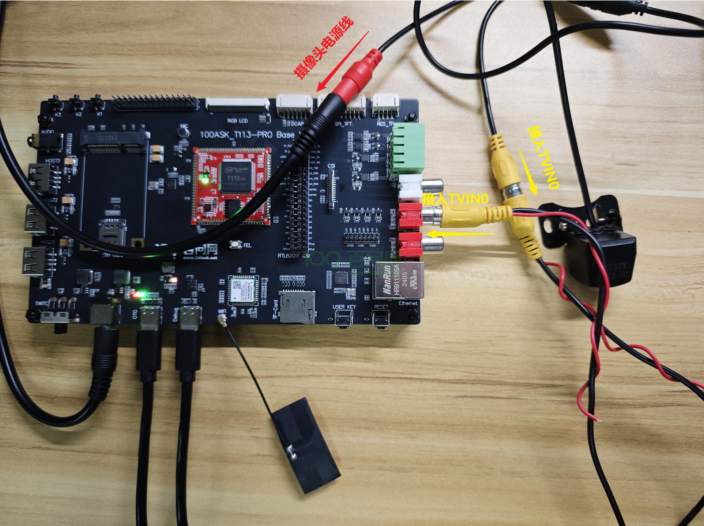

# CVBS 摄像头抓图

本章节将讲解如何在 T113s4-SdNand 开发板上使用 CVBS 摄像头抓取图像数据。

---

## 准备工作

**硬件：**
- T113s4-SdNand 开发板
- USB Type-C 线 ×1（串口/供电）
- 电源适配器（12V）
- CVBS 摄像头（需另外购买）

**软件：**
- 支持 TVD 模块的系统镜像（如 `t113_linux_evb1_auto_uart0.img`）
- 全志线刷工具：[AllwinnertechPhoeniSuit](https://dl.100ask.net/Hardware/MPU/T113i-Industrial/Tools/AllwinnertechPhoeniSuit.zip)
- 全志 USB 烧录驱动：[AllwinnerUSBFlashDeviceDriver](https://dl.100ask.net/Hardware/MPU/T113i-Industrial/Tools/AllwinnerUSBFlashDeviceDriver.zip)

---

## TVD 模块概述

### 什么是 TVD？

全志内部通常把 CVBS IN 模块称为 **TVD** 或 **TVIN** 模块，是一个用于采集模拟 CVBS 视频的硬件模块。

**功能特性：**
- 将输入的 CVBS 信号或 YPbPr 信号转换成 YUV 信号
- 支持 PAL/NTSC 等多种视频制式
- 通过 V4L2 框架向用户态提供接口

### 驱动框架

```
TVD 硬件 → TVD 驱动 → V4L2 框架 → 用户态应用程序
```

TVD 驱动只负责硬件描述并注册进 V4L2 框架，具体使用放在用户态的应用层。

---

## 硬件连接

将 CVBS 摄像头连接到开发板的 CVBS IN 接口。



---

## 登录串口终端

硬件连接成功后，参考《快速入门》中的「启动开发板」章节登录串口。

---

## 获取抓图工具

在 Ubuntu 上执行以下指令，获取资源：

```bash
git clone https://e.coding.net/weidongshan/tina5/APP-DevExample.git
```

下载的资源中，源码在 `V4L2/camera_demo_v1` 文件夹：

```
camera_demo_v1/
├── camerademo   # 抓图应用程序
├── makefile
├── Makefile
├── README.md
└── src
```

---

## 抓图测试

### 1. 查看 TVD 设备节点

```bash
ls /dev/video*
```

通常 TVD 设备节点为 `/dev/video4`（不是默认的 `/dev/video0`）。

### 2. 执行抓图命令

指定设备节点为 `/dev/video4`：

```bash
camerademo NV21 720 480 30 bmp /tmp 5 4
```

**参数说明：**
- `NV21` - 像素格式
- `720 480` - 分辨率
- `30` - 帧率
- `bmp` - 图片格式
- `/tmp` - 保存路径
- `5` - 拍照数量
- `4` - 设备节点编号（对应 `/dev/video4`）

### 3. 查看抓图结果

图片会保存在 `/tmp` 目录下：

```bash
ls /tmp/bmp_*.bmp
```

输出示例：
```
bmp_NV21_1.bmp  bmp_NV21_3.bmp  bmp_NV21_5.bmp
bmp_NV21_2.bmp  bmp_NV21_4.bmp
```

可以通过 ADB 工具将图片传输到 Windows 进行查看。

---

## 常见问题

| 问题 | 解决方法 |
|:---|:---|
| 找不到 video 设备 | 确认镜像已包含 TVD 驱动 |
| 抓图失败 | 检查 CVBS 摄像头连接是否正常 |
| 画面无信号 | 确认摄像头已通电并输出 CVBS 信号 |
