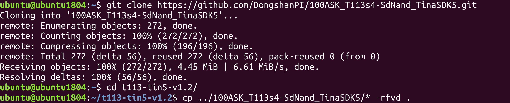

# 获取 Tina5 源码

本章节将讲解如何获取 T113s4-SdNand 的 Tina5 SDK 源码。

---

## 获取 Tina5 SDK 基础包

### 1. 下载基础包

通过百度网盘下载 Tina5 SDK 基础包：

- 链接：[百度网盘](https://pan.baidu.com/s/1JhS8JNbhPgcCiaVDay_rYw?pwd=bdz2)
- 提取码：`bdz2`
- 文件大小：约 21.81 GB
- 文件名：`t113s4-tin5SDK-8939a92cf6401f1d2e156bc1e248d5e4.tar.gz`

下载完成后，将文件拷贝到 Ubuntu 虚拟机中。

### 2. 解压基础包

```bash
tar -xvf t113s4-tin5SDK-8939a92cf6401f1d2e156bc1e248d5e4.tar.gz
```

解压后，SDK 目录命名为 `t113-tin5-v1.2`。

出现以下目录结构说明源码获取成功。

---

## 获取补丁包

百问网针对 T113s4-SdNand 开发板提供了扩展补丁包，包含设备树、WiFi 驱动、应用示例等适配内容。

### 克隆补丁仓库

```bash
git clone https://github.com/DongshanPI/100ASK_T113s4-SdNand_TinaSDK5.git
```

### 应用补丁

```bash
cd t113-tin5-v1.2/
cp ../100ASK_T113s4-SdNand_TinaSDK5/* -rfvd .
```



---

## 下一步

源码和补丁获取完成后，参考《Tina5 编译系统》章节开始编译固件。
