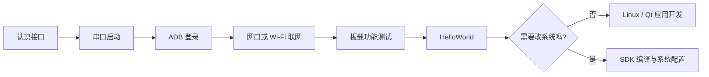

<div
  className="hero shadow--md"
  style={{
    borderRadius: '20px',
    padding: '3.2rem 2rem',
    marginBottom: '2rem',
    color: '#ffffff',
    background: 'linear-gradient(135deg, #12372a 0%, #1f7a55 58%, #46a578 100%)'
  }}>
  <div className="container" style={{textAlign: 'center'}}>
    <p style={{fontSize: '0.95rem', letterSpacing: '0.16em', marginBottom: '0.8rem'}}>DONGSHANPI · INDUSTRIAL LINUX</p>
    <h1 className="hero__title" style={{color: '#ffffff', fontSize: 'clamp(2rem, 5vw, 3.6rem)'}}>OmniGate-T153 开发指南</h1>
    <p className="hero__subtitle" style={{maxWidth: '760px', margin: '1rem auto 1.8rem'}}>从第一次上电，到接口验证、系统编译和应用开发，一套可以跟着终端一步步完成的实战文档。</p>
    <div>
      <a className="button button--secondary button--lg margin-right--sm" href="./part1/QuickStart">10 分钟快速启动</a>
      <a className="button button--outline button--secondary button--lg" href="./part3/DevelopmentEnvironmentSetup">开始编译固件</a>
    </div>
  </div>
</div>

这套文档同时面向第一次接触开发板的用户和需要修改 Tina SDK、驱动、设备树的开发者。每篇实操
都会说明命令在哪台设备执行、正常输出是什么、怎样算成功以及失败后先检查哪里。你不需要从头
读完所有手册，只需选择当前目标。

:::tip 第一次使用，先完成最小闭环

连接串口 → 启动系统 → 连接 ADB → 测试网络 → 编译并运行 HelloWorld。完成这五步后，再测试
CAN、RS485、4G 或修改内核。这样遇到问题时更容易判断是硬件、系统还是应用层造成的。

:::

## 先选一个目标

<div className="row">
  <div className="col col--4 margin-bottom--lg">
    <div className="card shadow--lw" style={{height: '100%'}}>
      <div className="card__header"><h3>第一次使用</h3></div>
      <div className="card__body"><p>接串口、上电、进入 Shell，并完成 ADB 与网络检查。</p></div>
      <div className="card__footer"><a className="button button--primary button--block" href="./part1/QuickStart">从上电开始</a></div>
    </div>
  </div>
  <div className="col col--4 margin-bottom--lg">
    <div className="card shadow--lw" style={{height: '100%'}}>
      <div className="card__header"><h3>体验板载接口</h3></div>
      <div className="card__body"><p>验证双网口、Wi-Fi、CAN、RS485、USB、TF、声音、LED 和 4G。</p></div>
      <div className="card__footer"><a className="button button--primary button--block" href="./part2/Ethernet">开始硬件体检</a></div>
    </div>
  </div>
  <div className="col col--4 margin-bottom--lg">
    <div className="card shadow--lw" style={{height: '100%'}}>
      <div className="card__header"><h3>定制系统</h3></div>
      <div className="card__body"><p>在 Ubuntu 24.04 上配置 SDK、完整编译、打包并核对固件。</p></div>
      <div className="card__footer"><a className="button button--primary button--block" href="./part3/DevelopmentEnvironmentSetup">进入 SDK 开发</a></div>
    </div>
  </div>
</div>

| 我现在想做什么 | 从哪里开始 | 完成标志 |
| --- | --- | --- |
| 第一次给开发板上电 | [启动开发板](./part1/01-QuickStart.md) | 串口进入 Linux Shell，ADB 能识别设备 |
| 烧录默认固件或自己编译的固件 | [更新系统固件](./part1/02-FlashSystem.md) | 新固件启动，版本和构建时间符合预期 |
| 测试板载接口 | [板载功能体验](./part2/01-Ethernet.md) | 对应接口完成一次收发或读写闭环 |
| 编译完整系统 | [SDK 环境搭建与固件编译](./part3/01-DevelopmentEnvironmentSetup.md) | 生成可烧录的 `.img` 镜像 |
| 编写 Linux 程序 | [HelloWorld 快速入门](./part4/01-HelloWorld.md) | Arm 程序上传并在板端运行 |
| 开发 E907 / AMP | [OmniGate AMP Shell](./part5/05-OmniGateAMPShell.md) | A7 与 E907 可以通过 RPMsg 通信 |
| 查询底层 HAL 接口 | [HAL V2 总览](./03-HALV2/00-Overview.md) | 找到对应外设的接口和示例 |

## 新手推荐路线



建议顺序如下：

1. 阅读[单板介绍](./01-BoardIntroduction.md)，只需先认识电源、UART0、OTG 和要测试的接口。
2. 按[启动开发板](./part1/01-QuickStart.md)进入 Shell，并学会区分 **Ubuntu 主机**和**开发板**。
3. 按[双网口测试](./part2/01-Ethernet.md)或[Wi-Fi 与蓝牙](./part2/02-WiFiBluetooth.md)联网。
4. 根据项目选择 CAN、RS485、USB/TF、声音/LED 或 4G 页面，不必全部测试。
5. 按[HelloWorld](./part4/01-HelloWorld.md)完成交叉编译闭环。
6. 只有需要修改驱动、设备树或根文件系统时，再进入[Tina-SDK 开发](./part3/01-DevelopmentEnvironmentSetup.md)。

## 文档中的命令在哪里执行

这是新手最容易混淆的地方。每组命令前都会标明执行位置：

| 标记 | 指什么 | 常见命令 |
| --- | --- | --- |
| **Ubuntu 主机** | 用来下载、编译和烧录的 x86_64 电脑 | `git`、`adb`、`./build.sh` |
| **SDK 根目录** | 同时含 `build.sh`、`device/`、`kernel/` 的目录 | `source build/envsetup.sh` |
| **开发板 Linux Shell** | 通过 UART0 或 `adb shell` 进入的 Arm 系统 | `ip`、`dmesg`、`mmcli` |

:::warning 不要把提示符也复制进去

文档代码块通常只放命令本身。终端中看到的 `ubuntu@host:~$`、`root@board:~#` 或单独的 `#`
是提示符，不属于命令。

:::

## 当前固件的默认行为

基于当前 OmniGate overlay 构建的固件，启动后会自动完成以下工作：

| 功能 | 默认行为 | 服务脚本 |
| --- | --- | --- |
| 双网口 | `eth0`、`eth1` 自动置为 UP；插线后请求 DHCP，拔线后清理地址 | `S40network` |
| CAN | `can0`、`can1` 以 1 Mbps、`restart-ms 100` 启动 | `S42can` |
| Wi-Fi / Bluetooth | 加载 AIC8800D80 驱动，拉起 `wlan0` 和 `hci0` | `S45aic8800-bluetooth` |
| 声音 | 配置板载 Codec 和扬声器输出通路 | `S35audio` |
| 三个状态灯 | 默认以 250 ms 间隔运行流水灯 | `S47ledctl` |
| TF 卡 | 插卡自动挂载到 `/mnt/sdcard/mmcblk1p1`，拔卡自动卸载 | `S21tfcard-hotplug` + udev |
| 4G 管理 | 启动 ModemManager；未安装模块时显示找不到 Modem 属正常现象 | `S44modem-manager` |
| ADB | 启动 USB Gadget ADB | `S50adb_start` |

如果你的结果与上表不同，先确认烧录的是应用了最新 OmniGate overlay 的固件，再查看对应章节。

## 遇到问题时先保存这些信息

在 **开发板 Linux Shell**执行：

```bash
uname -a
cat /proc/cmdline
ip -br link
cat /proc/partitions
dmesg | tail -n 120
```

在 **Ubuntu 主机**执行：

```bash
adb devices
lsusb
```

反馈问题时同时提供：板卡批次、固件文件名与 SHA-256、接线照片、完整操作步骤和上述输出。
只提供一句**不能用**或最后一行报错，通常无法区分供电、接线、驱动和应用配置问题。

## 参考资料与实操教程的区别

- `快速启动`、`板载功能体验`和`应用开发`是可以照着执行的实操教程。
- `系统软件`、`Buildroot`、`系统配置`、`USB/OTA/AMP`和`HAL V2`保留了大量原厂参考内容，
  适合遇到具体问题时按目录查询，不建议新手顺序通读。
- 不同硬件批次或选配模块可能存在差异。涉及电压、引脚、天线和供电时，以当前批次原理图、
  BOM 和模块规格书为准。
