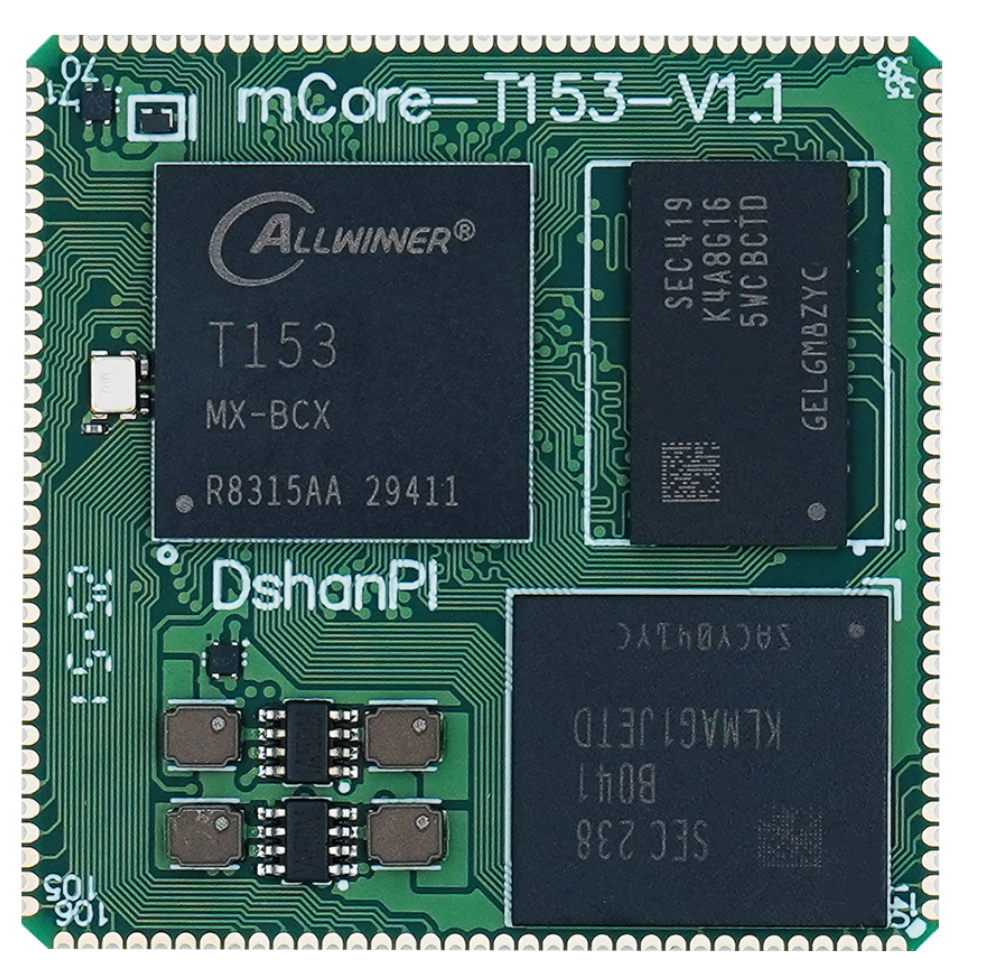
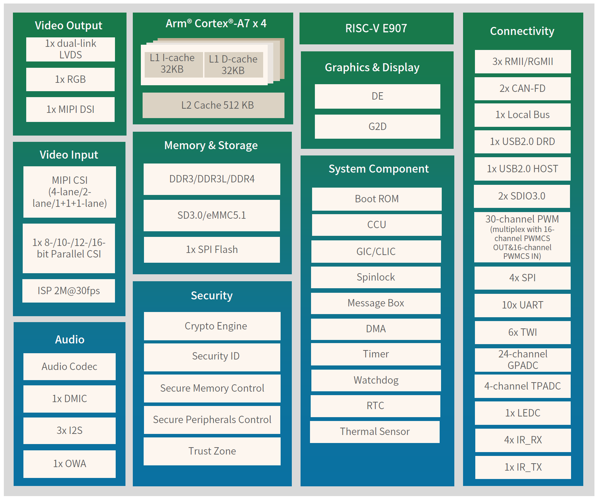

# mCore-T153MX硬件

* 此开发板的任何问题都可以在我们的论坛交流讨论 https://forums.100ask.net/c/aw/t113s3/19

## 硬件简述

### T153MX芯片
- 概述

T153 是一款面向自动化应用的四核架构解决方案，例如可编程逻辑控制器 (PLC)、人机界面 (HMI) 等。

- 卓越的计算能力

T153 配备四核 Arm Cortex-A7 处理器、单核 RISC-V E907 处理器，并支持 DDR3/DDR3L/DDR4 内存，可提供强大的计算性能和快速响应，是高要求自动化任务的理想之选。

- 智能自动化控制

该处理器具有三个千兆以太网接口、两个 CAN FD 接口以及 8/16/32 位本地总线，支持高吞吐量网络，满足复杂数据驱动型应用的需求。其集成的图像信号处理器和显示引擎可提供清晰的实时视觉反馈，用于管理复杂的制造流程。

- 丰富的扩展选项

T153 提供广泛的外设支持，包括 24 通道 GPADC、6 个 TWI 和 30 通道 PWM。这些接口为各种应用提供了灵活性，从而实现了自动化系统的轻松集成和可扩展性。

## 配套模块

