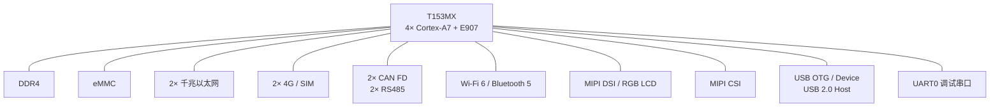

import boardHero from './images/DshanPI-OminiGate-3.png';

  

    

      
DONGSHANPI · INDUSTRIAL EDGE

      <h1 style={{color: '#ffffff', fontSize: 'clamp(2.25rem, 5vw, 4rem)', lineHeight: 1.05, margin: '1rem 0'}}>OmniGate-T153</h1>
      
四核 Linux 与 E907 实时核心协同，连接双千兆、双 4G 与工业总线，为边缘网关、HMI 和数据采集而生。

      

        4× Cortex-A7
        RISC-V E907
        2× GbE
        2× 4G
      

      <a className="button button--secondary button--lg margin-right--sm" href="./part1/QuickStart">开始使用</a>
      <a className="button button--outline button--secondary button--lg" href="./part2/Ethernet">体验接口</a>
    

    

      

        
      

    

  

OmniGate-T153 由 **mCore-T153MX 核心板**和 **OmniGate 扩展底板**组成。核心板承载处理器、内存
和 eMMC，底板负责工业接口与扩展连接。模块化结构既方便快速验证，也适合继续开发网关、HMI、
数据采集和边缘控制产品。

## 核心能力

  

    

      
<h3>异构计算</h3>
4× Cortex-A7 运行 Linux，E907 承担实时与异构任务。

    

  

  

    

      
<h3>灵活存储</h3>
最大支持 DDR4 4 GB 与 eMMC 64 GB，容量按 SKU 选择。

    

  

  

    

      
<h3>多路联网</h3>
双千兆以太网、双 4G 模块位，以及 Wi-Fi 6 和蓝牙 5。

    

  

  

    

      
<h3>工业连接</h3>
双 CAN FD、双 RS485，并提供显示、触摸与 USB 扩展。

    

  

:::caution **最大支持**不等于当前板卡实装容量

DDR4 4 GB 和 eMMC 64 GB 是平台支持上限。拿到板卡后应在 Linux 中用 `free -h`、`lsblk` 或
`cat /proc/partitions` 查看实际容量，并以对应 SKU/BOM 为准。

:::

:::info 使用提示

不同批次或选配型号的内存、eMMC、4G 模块和无线模块可能存在差异。选型、接线和量产设计时，
请以当前批次随板提供的原理图、BOM 和模块规格书为准。

:::

## 产品组成

### mCore-T153MX 核心板

mCore-T153MX 将处理器、内存、eMMC 和电源等核心器件集中在约 31.9 mm × 31.9 mm 的邮票孔模块上。核心板采用 140 Pin、0.8 mm 间距的单面布局，便于直接焊接到底板。

| 项目 | 配置 |
| --- | --- |
| 主处理器 | 全志 T153MX |
| Linux CPU | 4× Arm Cortex-A7 |
| 实时/异构核心 | 1× RISC-V E907 |
| 内存 | 最大支持 DDR4 4 GB；实际容量以具体 SKU/BOM 为准 |
| 存储 | 最大支持 eMMC 64 GB；实际容量以具体 SKU/BOM 为准 |
| 外形 | 31.9 mm × 31.9 mm |
| 引出方式 | 140 Pin 邮票孔，0.8 mm 间距 |

T153MX 面向 PLC、HMI 和工业自动化等场景。芯片集成多路以太网、CAN FD、TWI、PWM 和 GPADC 等资源，并可通过 E907 处理实时或异构任务。

### OmniGate 扩展底板

OmniGate 扩展底板为核心板提供双 4G、双千兆以太网、工业总线、显示、摄像头、USB 和无线连接等接口。

### 硬件功能关系示意

```mermaid
flowchart TB
    SOC[T153MX<br/>4× Cortex-A7 + E907]
    DDR[DDR4]
    EMMC[eMMC]
    NET[2× 千兆以太网]
    CELL[2× 4G / SIM]
    BUS[2× CAN FD<br/>2× RS485]
    WIFI[Wi-Fi 6 / Bluetooth 5]
    DISP[MIPI DSI / RGB LCD]
    CAM[MIPI CSI]
    USB[USB OTG / Device<br/>USB 2.0 Host]
    DEBUG[UART0 调试串口]

    SOC --- DDR
    SOC --- EMMC
    SOC --- NET
    SOC --- CELL
    SOC --- BUS
    SOC --- WIFI
    SOC --- DISP
    SOC --- CAM
    SOC --- USB
    SOC --- DEBUG
```

该图表示功能连接关系，不表示具体引脚号。电平、复用、供电和连接器脚位仍应以对应批次原理图
及设备树为准。

## 主要硬件资源

| 类别 | 板载资源 |
| --- | --- |
| 蜂窝网络 | 2× 4G 模块位、2× SIM 卡槽 |
| 有线网络 | 2× 千兆以太网 RJ45 |
| 无线连接 | Wi-Fi 6、Bluetooth 5 |
| 工业总线 | 2× CAN FD、2× RS485 |
| 显示 | MIPI DSI、RGB LCD 扩展接口 |
| 摄像头 | MIPI CSI 扩展接口 |
| 存储扩展 | TF Card |
| USB | USB OTG/Device、USB 2.0 High-Speed Type-A Host |
| 调试与交互 | 调试串口、按键、状态指示灯 |

:::caution 4G 模块为选配器件

装配模块前应确认接口尺寸、供电能力、SIM 卡方向、天线连接和运营商频段支持。

:::

## 软件支持状态

当前软件配置基于 Tina Linux 5.0、Linux 5.10 和 `t153_omnigate_mmc-buildroot` 方案。下表用于说明
各功能在当前版本中的支持和验证情况。

| 功能 | 当前状态 | 说明 |
| --- | --- | --- |
| 双千兆以太网 | 已配置 | `gmac0`、`gmac1` 及对应 PHY 已在设备树启用 |
| CAN FD | 已配置并实板验证 | `can0`、`can1` 默认以 1 Mbps 启动 |
| Wi-Fi / Bluetooth | 已实板验证 | AIC8800D80，SDIO + UART |
| Bluetooth PCM | 已实板验证 | I2S0 使用 PB5～PB8 |
| eMMC / TF Card | 已配置 | 当前构建目标为 eMMC Buildroot 方案 |
| MIPI DSI 4-Lane / 触摸 | Linux 下已实板验证 | 1024×768 显示和触摸可用；U-Boot Logo 默认关闭 |
| 双 4G | 驱动与拨号工具已配置 | 当前未安装模块实板验证，需根据模块和运营商设置 APN |
| E907 AMP Shell | 已实板验证 | A7 Linux 通过 remoteproc、MSGBOX 和 RPMsg 连接 E907 FreeRTOS |

**已配置**表示 SDK 中已经包含对应驱动或板级配置，不代表当前镜像已启用控制器，也不代表所有外接设备、线材和应用场景均完成验证。

## 接下来做什么

单板介绍只用于认识硬件，不在这里展开 SDK 和烧录操作。第一次使用建议按以下顺序继续：

1. [从这里开始](./00-StartHere.md)
2. [获取源码、工具与手册](./02-SourceCodeToolDocumentationManual.md)
3. [连接并启动开发板](./part1/01-QuickStart.md)
4. [更新系统固件](./part1/02-FlashSystem.md)
5. [体验板载功能](./part2/01-Ethernet.md)
6. [编译第一个 Linux 应用](./part4/01-HelloWorld.md)
