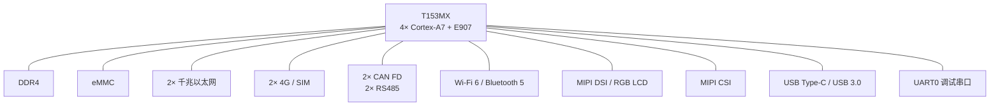

# DshanPi OmniGate-T153 单板介绍

OmniGate-T153 是一款基于全志 T153MX 的工业边缘网关开发板，由 **mCore-T153MX 核心板**和 **OmniGate 扩展底板**组成，面向双 4G 联网、多网口接入、工业总线控制和人机界面等应用。


:::info 资料来源

本文依据 [T153MX-Tina5SDK_OmniGate 板级仓库](https://github.com/dshanpi/T153MX-Tina5SDK_OmniGate)中的硬件图片、板级配置和调试记录整理。不同批次或选配型号的内存、eMMC、4G 模块与无线模块可能不同，量产设计请以对应批次的原理图、BOM 和模块规格书为准。

:::

## 目标

通过本页确认 OmniGate-T153 的核心板、扩展底板、主要接口和软件支持状态，并找到从获取板级 overlay 到首次进入 Linux Shell 的最短路径。

## 准备工作

- OmniGate-T153 开发板及对应批次的原理图、BOM 或硬件说明。
- 稳定电源、USB 数据线和调试串口连接。
- Ubuntu 开发主机及可用的 T153 Tina SDK。

不同批次的内存、eMMC、无线和 4G 模块可能不同。开始实验前应以实物和当前批次资料核对，不能只根据同系列板卡推断。

## 操作步骤

1. 查看下方产品组成和资源表，确认核心板与底板版本。
2. 克隆板级适配仓库，将 overlay 应用到完整 Tina SDK。
3. 选择 `t153_omnigate_mmc-buildroot`，完成编译和打包。
4. 核对镜像路径和目标设备后烧录，通过调试串口观察首次启动。

## 验证方法

启动后应能从串口进入开发板 Linux Shell。使用 `uname -a`、`cat /proc/partitions` 和对应接口的设备节点确认运行内核、存储与板级配置；未完成板端验证的功能仍以本页状态表为准。

## 产品组成

### mCore-T153MX 核心板

mCore-T153MX 将处理器、内存、eMMC 和电源等核心器件集中在约 31.9 mm × 31.9 mm 的邮票孔模块上。核心板采用 140 Pin、0.8 mm 间距的单面布局，便于直接焊接到底板。


| 项目 | 配置 |
| --- | --- |
| 主处理器 | 全志 T153MX |
| Linux CPU | 4× Arm Cortex-A7 |
| 实时/异构核心 | 1× RISC-V E907 |
| 内存 | DDR4 4 GB |
| 存储 | eMMC 64 GB |
| 外形 | 31.9 mm × 31.9 mm |
| 引出方式 | 140 Pin 邮票孔，0.8 mm 间距 |

T153MX 面向 PLC、HMI 和工业自动化等场景。芯片集成多路以太网、CAN FD、TWI、PWM 和 GPADC 等资源，并可通过 E907 处理实时或异构任务。

### OmniGate 扩展底板

OmniGate 扩展底板为核心板提供双 4G、双千兆以太网、工业总线、显示、摄像头、USB 和无线连接等接口。


### 硬件功能关系示意


```mermaid
flowchart TB
    SOC[T153MX<br/>4× Cortex-A7 + E907]
    DDR[DDR4]
    EMMC[eMMC]
    NET[2× 千兆以太网]
    CELL[2× 4G / SIM]
    BUS[2× CAN FD<br/>2× RS485]
    WIFI[Wi-Fi 6 / Bluetooth 5]
    DISP[MIPI DSI / RGB LCD]
    CAM[MIPI CSI]
    USB[USB Type-C / USB 3.0]
    DEBUG[UART0 调试串口]

    SOC --- DDR
    SOC --- EMMC
    SOC --- NET
    SOC --- CELL
    SOC --- BUS
    SOC --- WIFI
    SOC --- DISP
    SOC --- CAM
    SOC --- USB
    SOC --- DEBUG
```

该图表示功能连接关系，不表示具体引脚号。电平、复用、供电和连接器脚位仍应以对应批次原理图
及设备树为准。

## 主要硬件资源

| 类别 | 板载资源 |
| --- | --- |
| 蜂窝网络 | 2× 4G 模块位、2× SIM 卡槽 |
| 有线网络 | 2× 千兆以太网 RJ45 |
| 无线连接 | Wi-Fi 6、Bluetooth 5 |
| 工业总线 | 2× CAN FD、2× RS485 |
| 显示 | MIPI DSI、RGB LCD 扩展接口 |
| 摄像头 | MIPI CSI 扩展接口 |
| 存储扩展 | TF Card |
| USB | USB Type-C、USB 3.0 Type-A |
| 调试与交互 | 调试串口、按键、状态指示灯 |

:::caution 4G 模块为选配器件

装配模块前应确认接口尺寸、供电能力、SIM 卡方向、天线连接和运营商频段支持。

:::

## 软件支持状态

板级仓库不是完整的 Tina SDK，而是 OmniGate 板级开发产生的覆盖式差异包。当前配置基于 Tina Linux 5.0、Linux 5.10 和 `t153_omnigate_mmc-buildroot` 方案。

| 功能 | 当前状态 | 说明 |
| --- | --- | --- |
| 双千兆以太网 | 已配置 | `gmac0`、`gmac1` 及对应 PHY 已在设备树启用 |
| CAN FD | 已配置 | `can0`、`can1` 已配置 |
| Wi-Fi / Bluetooth | 已实板验证 | AIC8800D80，SDIO + UART |
| Bluetooth PCM | 已实板验证 | I2S0 使用 PB5～PB8 |
| eMMC / TF Card | 已配置 | 当前构建目标为 eMMC Buildroot 方案 |
| MIPI DSI 4-Lane | 调试中 | 背光、初始化和 DRM 已工作，仍存在水平条纹 |
| 双 4G | 硬件支持 | 需根据实际 4G 模块补充拨号和运营商配置 |
| E907 AMP Shell | 已实板验证 | A7 Linux 通过 remoteproc、MSGBOX 和 RPMsg 连接 E907 FreeRTOS |

“已配置”表示板级配置中已经启用相关控制器，不代表所有外接设备、线材和应用场景均完成验证。

## 获取开发资料

### 获取 T153MX 基础 SDK

基础开发包通过百度网盘提供：

- 文件夹：`DshanPI-OminiGate_T153MX`
- 下载链接：[https://pan.baidu.com/s/1ai6yzYs5ujDba-luz-JeXw](https://pan.baidu.com/s/1ai6yzYs5ujDba-luz-JeXw)
- 提取码：`6mtk`

下载完成后，先阅读[Tina SDK 开发环境搭建](./part3/01-DevelopmentEnvironmentSetup.md)。网盘文件夹名称不等于解压后的 SDK 根目录；能够看到 `build/envsetup.sh`、`build.sh`、`device/`、`kernel/` 和 `buildroot/` 的目录才是 SDK 根目录。

:::tip 建议保留原始包

首次解压后不要直接覆盖唯一副本。建议保留一份未修改的基础 SDK，用于比对板级修改、恢复误删文件和重新生成 overlay 补丁。

:::

### 获取 OmniGate 板级适配仓库

```bash
git clone https://github.com/dshanpi/T153MX-Tina5SDK_OmniGate.git
```

仓库采用 overlay 结构，主要内容如下：

```text
T153MX-Tina5SDK_OmniGate/
├── docs/       单板说明与专题调试记录
├── images/     核心板和扩展底板图片
├── overlay/    按 Tina SDK 根目录组织的差异文件
├── meta/       差异、删除和状态记录
└── scripts/    应用 overlay 和执行删除的脚本
```

## 应用板级配置

假设 Tina SDK 位于 `/path/to/TinaSDK`，执行：

```bash
/path/to/T153MX-Tina5SDK_OmniGate/scripts/apply_overlay.sh /path/to/TinaSDK
```

该脚本只会将 `overlay/` 中的文件覆盖到 SDK 对应路径，不会自动执行删除操作。需要清理旧固件时，应先人工检查 `meta/delete_list.txt`，确认无误后再运行仓库提供的删除脚本。

## 编译与打包

完整的主机依赖、SDK 检查、编译和产物验证步骤见[Tina SDK 开发环境搭建](./part3/01-DevelopmentEnvironmentSetup.md)。下面仅列出已经配置好环境后的最短命令。

在已经应用 overlay 的 Tina SDK 根目录，首次先执行交互式方案配置：

```bash
source build/envsetup.sh
./build.sh config
```

按名称选择 `linux`、`buildroot`、`t153`、`omnigate`、`default` 和 `linux-5.10-origin`，该组合
对应 `t153_omnigate_mmc-buildroot`。随后执行：

```bash
./build.sh
./build.sh pack
```

当前镜像输出名称：

```text
out/t153/omnigate/buildroot/t153_linux_omnigate_uart0.img
```

启用对应无线配置时，也可能生成 `t153_linux_omnigate_uart0-wifi1.img`。烧录前必须根据本次 `pack` 的时间戳和构建配置选择镜像，不能只按文件名猜测。

烧录和串口调试前请确认目标设备、USB 连接和镜像路径，避免误写其他存储设备。

## 调试资料

- [板载功能体验](./part2/01-Ethernet.md)
- [HelloWorld 应用开发](./part4/01-HelloWorld.md)
- [OmniGate 板级仓库](https://github.com/dshanpi/T153MX-Tina5SDK_OmniGate)
- [WLAN、Bluetooth 与 PCM 调试记录](https://github.com/dshanpi/T153MX-Tina5SDK_OmniGate/blob/main/docs/wlan-bluetooth-bringup.md)
- [MIPI DSI 4-Lane 屏调试记录](https://github.com/dshanpi/T153MX-Tina5SDK_OmniGate/blob/main/docs/mipi-dsi-debug-record.md)
- [Bluetooth 音响交付变更说明](https://github.com/dshanpi/T153MX-Tina5SDK_OmniGate/blob/main/docs/bluetooth-speaker-change-set.md)
- [OmniGate AMP Shell 异构开发](./part5/05-OmniGateAMPShell.md)
