# 系统软件

:::info 文档说明

- **原始页数：** 57 页
- **文档版本：** 2.1
- **发布日期：** 2025-08-25
- **原始文件：** [查看或下载 PDF](/pdfs/T153MX/01-system-software-guide.pdf)

正文按原始 PDF 的文本层、书签层级和页面顺序转换，仅移除重复页眉、页脚与水印，不改写技术内容。

:::

<!-- PDF page 7 -->

## 1 概述

### 1.1 文档简介

本文档作为Allwinner Tina Linux 系统平台开发指南，旨在帮助软件工程师、技术支持工程师快速上手，熟悉Tina Linux 系统软件开发及调试流程。

### 1.2 适用范围

Tina Linux v5.0 及以上版本。

### 1.3 相关术语介绍

表1-1:SDK 相关术语。

| 术语 | 解释说明 |
| --- | --- |
| SUNXI | Allwinner 一系列SoC 硬件平台 |
| Tina | 基于openWRT/buildroot 构建的Linux 系统开发平台 |
| openWRT | 一个开源的嵌入式Linux 系统自动构建框架 |
| buildroot | 一个自动化构建嵌入式Linux 系统的框架 |
| BSP | Board Support Package，板级支持包 |
| sys_config.fex | 全志平台板级配置文件 |

### 1.4 目标读者

本开发指南适用于Tina 系统软件开发工程师、Tina 系统技术支持工程师。

<!-- PDF page 8 -->

### 1.5 文档约定

#### 1.5.1 标志说明

! 注意

提醒操作中应注意的事项。不当的操作可能会损坏器件，影响可靠性、降低性能等。

说明

为准确理解文中指令、正确实施操作而提供的补充或强调信息。

巧

一些容易忽视的小功能、技巧。了解这些功能或技巧能帮助解决特定问题或者节省操作时间。

#### 1.5.2 地址与数据描述方法约定

本文档在描述地址、数据时遵循如下约定：

表1-2: 地址与数据描述方法约定

| 符号 | 例子 | 说明 |
| --- | --- | --- |
| 0x | 0x0200 | 地址或数据以16 进制表示。 |
| 0b | 0b010 | 数据采用二进制表示(寄存器描述除外)。 |
| X | 00X | 数据描述中，X 代表0 或1，例如，00X 代表000 或001。 |

#### 1.5.3 数值单位约定

本文档在描述数据容量（如NAND 容量）时，单位词头代表的是1024 的倍数；描述频率、数据速

时则代表的是1000倍数。具体如下：

表1-3: 数值单位约定

| 类型 | 符号 | 对应数值 |
| --- | --- | --- |
| 数据容量 | 1 K | 1024 |
| 数据容量 | 1 M | 1 048 576 |

<!-- PDF page 9 -->

| 类型 | 符号对应数值 |  |
| --- | --- | --- |
| 数据容量 | 1 G | 1 073 741 824 |
| 频率，数据速率等 | 1 K | 1000 |
| 频率，数据速率等 | 1 M | 1 000 000 |
| 频率，数据速率等 | 1 G | 1 000 000 000 |

<!-- PDF page 10 -->

## 2 Tina系统概述

### 2.1 概述

Tina Linux SDK 中包含Linux 系统开发用到的boot 源码、内核源码、驱动、工具、系统中间件与应用程序包。相对于Tina4.0 及之前版本, 有众多特性, 例如：

持多构建系统

完整的SDK 可以支持OpenWrt 以及Buildroot, 部分定制化SDK 则可能只保留着OpenWrt 或者Buildroot，甚至没有任何构建系统，只有BSP 代码，通过initramfs 或者预制好的rootfs 镜像进入系统。

2.BSP 高度复用

Tina Linux 中BSP(boot,kernel 代码，编译打包工具等) 是独立的存在，可支持单独编译打包，快速生成一个的固件镜像。

3.OpenWrt 改造

我们对OpenWrt 进行了较多改造，例如与内核编译解耦合，编译产物的目录调整，软件包及方案目录的独立仓库化等等, 可以更加友好的单独构建rootfs，裁剪SDK。

说明

OpenWrt 是一个开源的嵌入式Linux 系统自动构建框架，是由Makefile 脚本和Kconfig 配置文件构成的。使得用户可以通过menuconfig 灵活配置软件包。基于OpenWrt21.02 的修改点范围尽量集中, 后续可以比较方便进行版本升级，或者无改动移植社区软件包。

<!-- PDF page 11 -->

### 2.2 系统框图

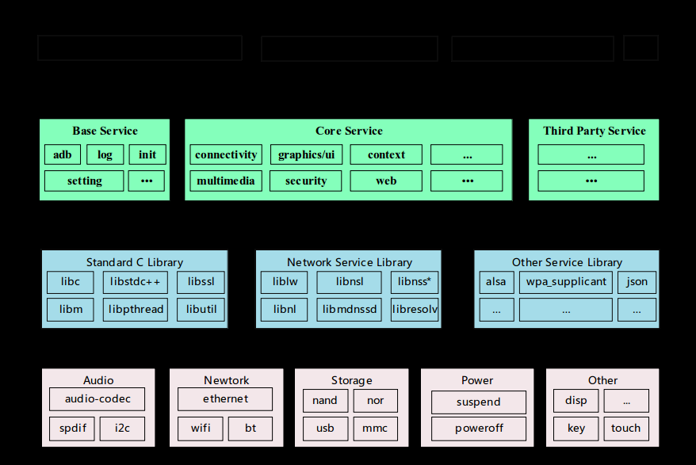

*图2-1: Tina Linux 系统框图*

Tina 系统软件框图如图所示，从下至上分为Kernel && Driver、Libraries、System Services、Ap-plications 四个层次。各层次内容如下：

1. Kernel&&Driver 主要提供Linux Kernel 的标准实现。Tina 平台的Linux Kernel 采用Linux 5.15

等内核(不同硬件平台可能使用不同内核版本)。提供安全功能，内存管理，进程管理，网络协议栈等基础支持；主要是通过Linux 内核管理设备硬件资源，如CPU 调度、缓存、内存、I/O等。

2. Libraries 层对应一般嵌入式系统，相当于中间件层次。包含了各种系统基础库，及第三方开源

程序库支持，对应用层提供API 接口，系统定制者和应用开发者可以基于Libraries 层的API 开发新的应用。

3. System Services 层对应系统服务层，包含系统启动管理、配置管理、热插拔管理、存储管理、

多媒体中间件等。

4. Applications 层主要是实现具体的产品功能及交互逻辑，需要一些系统基础库及第三方程序库

支持，开发者可以开发实现自己的应用程序，为终端客户提供各种产品功能。

<!-- PDF page 12 -->

### 2.3 开发流程

Tina Linux 系统是基于Linux Kernel，针对多种不同产品形态开发的SDK。可以基于本SDK，有效地实现系统定制和应用移植开发。


*图2-2:TinaLinux系统开发流程*

如上图所示，开发者可以遵循上述开发流程，在本地快速构建Tina Linux 系统的开发环境和编译代码。下面将简单介绍下该流程：

1. 检查系统需求：在下载代码和编译前，需确保本地的开发设备能够满足需求，包括机器的硬件

能力，软件系统，工具链等。目前Tina Linux 系统只支持Ubuntu 操作系统环境下编译，并仅提供Linux 环境下的工具链支持，其他如MacOS，Windows 等系统暂不支持。

2. 搭建编译环境：开发机器需要安装的指定的软件包和工具，或者使用验证过的ubuntu 版本。

体可参考开发主机配置章节。

3. 选择设备：在编译源码前，开发者需要先导出预定义环境变量，然后根据开发者的需求，选择

对应的硬件板型。

4. 下载源代码：请参考《SDK 获取》章节。

5. 系统定制：开发者可以根据使用的硬件板子、产品定义，定制U-Boot、Kernel 及Openwrt，

请参考后续章节中相关开发指南和配置的描述。

6. 编译与打包：完成设备选择、系统定制之后执行编译命令，将生成的boot/内核二进制文件、

根文件系统等产物，最终通过打包脚本按照一定格式打包生成固件。

7. 烧录并运行：继生成固件镜像文件后，通过烧录工具烧录到硬件设备中，详情可参考固件烧

录章节。

<!-- PDF page 13 -->

## 3 SDK概述

### 3.1 SDK获取

Allwinner Tina Linux SDK 通过全志代码服务器对外发布。客户需要向业务/技术支持窗口申请SDK下载权限。申请需同步提供SSH 公钥进行服务器认证授权，获得授权后即可同步代码。

操作，可参考全志客户服务平台的相关路径：帮助文档-&gt;产品包下载。

说明

全志客户服务平台https://open.allwinnertech.com。

### 3.2 SDK资料

Tina SDK 发布的文档旨在帮助开发者快速上手开发及调试，文档中涉及的内容并不能涵盖所有的开发知识和问题。文档列表也正在不断更新。

文档上的疑问及需求，请联系AllwinnerFAE 窗口或访问全志客户服务平台https://open.

allwinnertech.com获取支持。

Tina SDK 提供丰富的文档资料，包括Release Note(发布声明)，Hardware(硬件类文档)，Soft-ware(软件类文档)，Tools(工具类文档)，Product(量产指导文档)。

### 3.3 文档列表

请以全志科技全志客户服务平台最新列表为准，路径参考: 文档中心-&gt; XXX 平台-&gt;XXX Linux。

#### 3.3.1 Release Note 发布声明

包含文档list 指引和SDK 版本发布说明，详情见各个目录下的文档。

<!-- PDF page 14 -->

#### 3.3.2 Hardware 硬件类文档

包含芯片手册、硬件设计指南，原理图，PCB，部分硬件物料清单支持列表，详情见各个目录下的文档。

#### 3.3.3 Software 软件类文档

包含基础组件开发指南、SDK 规格说明、SDK 模块开发指南，详情见各个目录下的文档。

本节主要对这些开发文档进行一个归纳索引，大家结合实际开发遇到的问题，参照以下表格阅读学习对应的开发指南，可在全志客户服务平台文档中心的&#123;IC&#125; Linux/Software软件类文档/基础组件开发指南/路

获取，并会不断完善更新。

表3-1: Tina 系统基础组件开发指南

| 模块功能 | 内容简介 | 对应文档 |
| --- | --- | --- |
| buildrooot | 介绍Tina buildroot 的构建方式 | Tina_Linux_buildroot_ 使用指南.pdf |
| CAMERA | 介绍camera 驱动移植、验证方 |  |

Tina_Linux_Camera_ 开发指南.pdf

式、ISP 常见问题和csi pipeline设置介绍

ISP 效果常见问题.pdf

vin 数据链路.pdf

OTA系统OTA 指南，介绍支持OTA 方

Tina_Linux_OTA_ 开发指南.pdf

案、指导如何开发、使用等

| PWM | 介绍Linux PWM 的使用方式 | Tina_Linux_PWM_ 开发指南.pdf |
| --- | --- | --- |
| USB | 介绍全志平台USB 模块的配置方 |  |

Tina_Linux_USB_ 开发指南.pdf

式、常用gadget 功能的配置方式和调试手段和USB 的相关应用

WiFi介绍WiFi 模组驱动移植步骤以及

Tina_Linux_Wi-Fi_ 开发指南.pdf

常见问题排查方式

Tina_Linux_Wi-Fi_ 模组移植指南.pdf

Tina_Linux_ 配网_ 开发指南.pdf

Tina_Linux_Wi-Fi_ 常见问题与调试指南.pdf

Tina_Linux_Wi-Fi_ 抓包使用指南.pdf

<!-- PDF page 15 -->

模块功能内容简介对应文档

Tina_Linux_WiFi_RF 测试_ 使用指南.pdf

Tina_Linux_Wi-Fi_BT_ 射频测试指南.pdf

Tina_Linux_ 网络性能_ 参考指南.pdf

BT介绍蓝牙模组移植步骤以及常见

Tina_Linux_ 蓝牙_ 开发指南.pdf

问题排查方式

Tina_Linux_ 蓝牙_ 模组移植指南.pdf

Tina_Linux_ 蓝牙_ 常见问题与调试指南.pdf

安全介绍Tina 平台安全启动等配置方

Tina_Linux_ 安全_ 开发指南.pdf

式

Tina_Linux_ 存储性能_ 参考指南.pdf

固件打包介绍Tina 固件打包流程Tina_Linux_ 打包流程_ 使用指南.pdf

Tina_Linux_ 打包流程_ 说明指南.pdf

| CPU 调频 | 介绍全志平台CPU VF 表的配置 | Tina_Linux_ 调频系统_ 使用指南.pdf |
| --- | --- | --- |
| 编解码 | 介绍Tina 多媒体编解码中间件使 |  |

Tina_Linux_ 多媒体编码_ 开发指南.pdf

用方式

Tina_Linux_ 多媒体解码_ 开发指南.pdf

Tina_Linux_ 各平台多媒体格式_ 支持列表.pdf

功耗系统功耗管理指南，指导如何使

Tina_Linux_ 功耗管理_ 开发指南.pdf

用、开发，定制化等

Tina_Linux_ 功耗性能_ 参考指南.pdf

| 系统测试 | 介绍Tina SDK 的量产测试工具 |  |
| --- | --- | --- |
| Tinatest | 的配置方式 |  |
| 内存优化 | 介绍Tina 如何进行内存优化开发 | Tina_Linux_ 内存优化_ 开发指南.pdf |
| 系统配置 | 系统配置指南，包括 |  |

Tina_Linux_ 量产测试_ 使用指南.pdf

Tina_Linux_ 配置_ 开发指南.pdf

menuconfig 的软件包配置、sys_config.fex 和设备树的板级配置、分区表配置、env 分区的作用等，最后介绍了nor/nand的切换操作步骤。

<!-- PDF page 16 -->

| 模块功能内容简介 | 对应文档 |  |
| --- | --- | --- |
| 启动优化 | 系统启动优化开发指导 | Tina_Linux_ 启动优化_ 开发指南.pdf |
| 温控 | 介绍全志平台对于温控框架的配 |  |

Tina_Linux_ 温度控制_ 使用指南.pdf

置方式

| 系统裁剪 | 系统裁剪优化开发指导 | Tina_Linux_ 系统裁剪_ 开发指南.pdf |
| --- | --- | --- |
| 系统调试 | 介绍Tina 系统可选用的debug |  |

Tina_Linux_ 系统调试_ 使用指南.pdf

调试工具

异构介绍全志平台基于remoteproc

Tina_Linux_ 异构通信框架_ 开发指

框架的从核管理机制，包括从核

南.pdf

RTOS的编译、启动逻辑、日志

debug、保活机制、通信机制等信息

音频系统音频开发指南，指导配置通

Tina_Linux_ 音频_ 开发指南.pdf

路、使用、测试等

软件包介绍Tina SDK 如何添加软件包Tina_Linux_ 创建软件包流程_ 使用指

南.pdf

NPU介绍全志平台NPU docket 环境

NPU_ 快速入门_ 开发指南.pdf

的搭建、模型的转换部署以及算子的支持情况

NPU_ 开发环境部署_ 参考指南.pdf

NPU_ 模型部署_ 开发指南.pdf

NPU_RuntimeAPI_ 参考指南.pdf

NPU_ 算子支持列表.pdf

RTOS介绍RTOS 系统外设接口以及各

FreeRTOS_RTOS_ 系统_ 开发指南.pdf

组件使用方式

FreeRTOS_RTOS_ 外设_ 使用指南.pdf

FreeRTOS_RTOS_ 配置_ 开发指南.pdf

FreeRTOS_RTOS_ 终端命令_ 使用指南.pdf

FreeRTOS_RTOS_ 系统调试_ 使用指南.pdf

FreeRTOS_RTOS_ 内存优化_ 使用指南.pdf

<!-- PDF page 17 -->

#### 3.3.4 Tool工具类文档

工具需要以全志客户服务平台工具为准，工具对应使用文档默认集成在工具安装目录。在APST界面，在已安装的软件信息中，鼠标右键选择打开目录，在安装目录下，将会有相应工具使用指南，工具及其文档获取路径参考如下，以下表格是一些常用工具的文档。

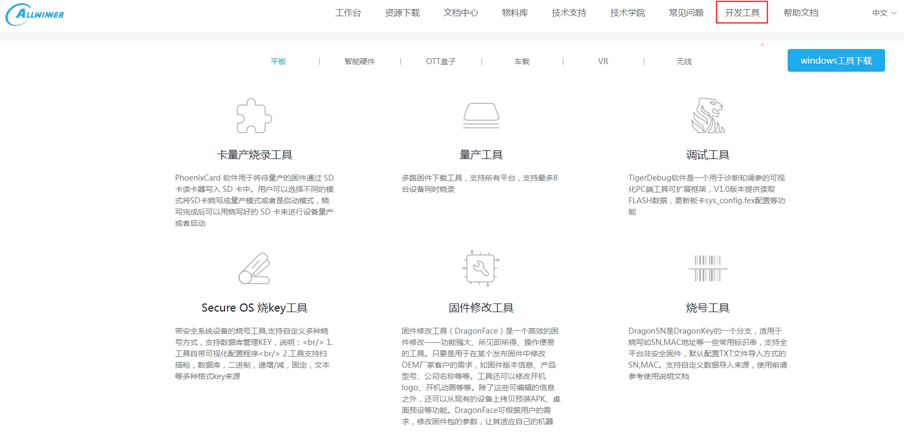

*图3-1: 量产工具获取*

表3-2: 工具文档

| 工具名称 | 工具用途 | 对应文档 |
| --- | --- | --- |
| PhoenixSuit | Windows 烧录工具 | PhoenixSuit_ 使用指南.pdf |
| PhoenixUSBPro Windows 量产烧录工具 | PhoenixUSBPro_ 使用指南.pdf |  |
| TigerDump | dump DDR 和flash | TigerDump_ 使用指南.pdf |
| TigerISP | ISP 在线调试工具 | tigerisp_cfg 配置说明.pdf |

图像质量调优(ISP6xx)_ 操作指南.pdf

TigerISP_ 使用指南.pdf

IQ 优化实例分析.pdf

| TigerDOS | 设备远程调试工具 | DOS_ 使用指南.pdf |
| --- | --- | --- |
| DragonFace | 固件修改工具，可基于固件修改 |  |

DragonFace_ 使用指南.pdf

dts 和DDR 参数配置等

dragonface 修改uboot_dts 说明.pdf

<!-- PDF page 18 -->

| 工具名称工具用途 | 对应文档 |  |
| --- | --- | --- |
| DragonHD | DDR 和EMMC 异常检测工具 | DragonHD_ 使用指南.pdf |
| DragonSN | 烧号工具 | DragonSN_ 使用指南.pdf DragonSN 配 |

置工具使用手册.pdf

#### 3.3.5 Product 量产指导文档

包含物料验证指南、异常问题排查指南，详情见各个目录下的文档。

### 3.4 物料支持列表

请以全志科技全志客户服务平台物料库为准，当前提供EMMC，DRAM，SLC NAND，MLC NAND，SPI NAND，NOR，WIFI/BT，以太网PHY 支持列表。

物料库路径参考：

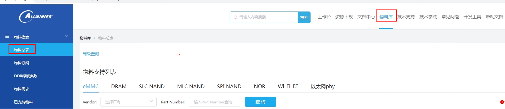

*图3-2: 物料库查询路径参考图*

### 3.5 SDK更新

SDK 更新分为两类：一类是以补丁的形式发布到一号通，发布后系统以邮件形式通知开发者；另

| 是定期（半年或季度）的小版本迭代升级，将过往的补丁合入到 | SDK 中，发布后以系统邮件 |
| --- | --- |
| 开发者，可基于干净的 | SDK 包通过reposync 命令更新。 |

### 3.6 问题反馈

Allwinner 提供全志客户服务平台（https://open.allwinnertech.com），用来登记客户遇到的问题以及解决状态。方便双方追踪，使问题处理更加高效。后续SDK 问题、技术问题、技术咨询等都可以提交到此系统上，Allwinner 技术服务会及时将问题进行分发、处理和跟踪。

<!-- PDF page 19 -->

注：系统登录帐号需要与Allwinner 开通确认。

<!-- PDF page 20 -->

## 4 Tina开发环境

### 4.1 编译环境搭建

### 4.2 目录结构

TinaSDK 目录结构,主要有构建工具、构建系统、配置工具、工具链、芯片配置目录、内核及boot目录等组成, 下面按照目录顺序做简单介绍。

TinaLinux/

```text
├──brandy
├──bsp
├──build
├──buildroot
├──build.sh -> build/top_build.sh
├──device
├──kernel
├──openwrt
├──out
├──platform
─prebuilt
├──rtos
└──tools
```

#### 4.2.1 brandy

brandy 目录下主要存放boot0，U-Boot 等代码。

brandy└──brandy-2.0

```text
├──build.sh -> tools/build.sh
├──spl-pub
├──tools
├──u-boot-2023
├──u-boot-bsp
└──u-boot-2018
```

快捷跳转命令：cboot,cboot0

说明

每个芯片SDK 包使用的U-Boot 版本可能不一样，通常只支持及提供一个版本的U-Boot，请以实际sdk 中U-Boot 为准。u-boot-2023 使用了独立bsp 仓库机制，即u-boot-2023 目录下是原生U-Boot，而Allwinner 相关改动内容都放在u-boot-bsp 目录中，编译时会自动做处理合成一体。

<!-- PDF page 21 -->

#### 4.2.2 build

build 目录存放Tina Linux 的系统构建脚本，主要功能有：

1. 提供编译需要的环境变量、函数、规则。

2. 提供各目标模块的编译方法、规则。

3. 对接OpenWrt, Buildroot 等不同构建系统。

4. 打包生成系统固件的脚本。

快捷跳转命令：cbuild

#### 4.2.3 buildroot

buildroot 相关的配置文件以及原生builroot 代码。

说明

部分SDK 可能没有buildroot 目录, 即不支持buildroot。

#### 4.2.4 device

e 目录用于存放芯片方案的配置文件，包括内核配置，env配置，分区表配置，

sys_config.fex，board.dts 等。

device

```text
├──config
│   ├──chips
│   ├──common
│   └──rootfs_tar
└──product -> ./config/chips/v853
```

快捷跳转命令：cchips,cconfigs

说明

rootfs_tar 中存放着rootfs 目录包，当使用BSP 编译方式时, 使用到的预制rootfs 就是从这里制作而成。

#### 4.2.5 kernel

kernel 目录主要存放不同版本的内核代码。

kernel

```text
├──linux-4.9
├──linux-5.4
...
└──linux-5.15
```

<!-- PDF page 22 -->

说明

部分内核版本会采用独立bsp 仓库方式，即kernel/linux-X.X 目录存放的是原生内核，而Allwinner 的驱动都会存放在bsp 目

录下。

#### 4.2.6 bsp

bsp 目录下存放着Allwinner 的驱动，以及对内核的改动，保证着原生内核(kernel/linux-X.X) 比较干净的状态，并且能够快速移植适配到新内核中。

#### 4.2.7 openwrt

openwrt 目录存放着OpenWrt 原生代码，及软件包、芯片方案目录。

openwrt

```text
├──build
             # OpenWrt构建系统相关hook脚本
├──dl
           # 软件压缩包
├──openwrt
              # OpenWrt原生代码目录
├──package
              # 额外添加的软件包,包括AW软件包、第三方软件包，feeds引入的软件包
└──target
             # 各个芯片方案目录，用于保存差异化配置信息
```

#### 4.2.8 out

out 目录用于保存编译相关的临时文件和最终镜像文件，编译后自动生成此目录，例如编译方案r528-evb4。

out

```text
├──r528
│   ├──evb4
││├──buildroot
││├──openwrt
││├──bsp
││└──pack_out
│   └──kernel
└──toolchain
```

└──gcc-linaro-5.3.1-2016.05-x86_64_arm-linux-gnueabi

根据配置选择，最终的编译产物会在openwrt 或者buildroot 目录下，而打包生成固件的准备文件

都存放在pack_out 下，kernel 是内核编译产物(仅限linux-5.4 及之后版本),toolchain目录是存放着解压后的工具链，用于编译内核。

openwrt 目录

openwrt

```text
├──boot.img
├──rootfs.img
├──build_dir
├──staging_dir
├──tmp
```

<!-- PDF page 23 -->

```text
├──extra
├──r528_linux_evb4_uart0.img
├──uImage
├──vmlinux
└──zImage
```

- boot.img 为最终烧写到系统boot 分区的数据，可能为boot.img 格式也可能为uImage 格式。

- rootfs.img 为最终烧写到系统rootfs 分区的数据，该分区默认为squashfs 格式。

- build_dir 为sdk 编译host，target 和toolchain 的临时文件目录，存有各个软件包的源码。

- staging_dir 为sdk 编译过程中保存各个目录结果的目录。

- extra 目录下会保存的是最终生成的ipk 软件包。

- tmp 目录下会保存着本方案软件包相关的信息。

- r528_linux_evb4_uart0.img 为最终固件包(系统镜像)，串口信息通过串口输出。

使用pack-d，则生成的固件包为xxx_card0.img，串口信息转递到tf 卡座输出。

快捷跳转命令：cout,ctarget,crootfs

#### 4.2.9 platform

platform 目录存放着一些软件包源码，这些软件包的编译方式是通用的，分别可以用在OpenWrt或者Buildroot 等不同构建系统中。这个目录的存在是为了不同构建系统共用软件包提供可能性。

目前platform 目录结构如下，主要根据是否AW 自研改动，以及类别区分：

platform

```text
├──allwinner
│   ├──power
│   ├──system
│   ├──usb
│   ├──utils
│   └──wireless
└──thirdparty
```

└──gui

#### 4.2.10 prebuilt

ilt 目录存放着一些预编译好的工具：

```text
├──hostbuilt
│   ├──make4.1
│   └──python3.8
├──kernelbuilt
│   ├──aarch64
│   ├──arm
│   └──riscv
└──rootfsbuilt
 ├──aarch64
 ├──arm
 └──riscv
```

<!-- PDF page 24 -->

- hostbuilt 目录下存放着make 以及python3.8 工具，为了解决个别Host 端工具版本过低导致编

译失败的问题。

- kernelbuilt 目录存放着编译内核的工具链压缩包，它会被解压到out/toolchain 目录下。

- rootfsbuilt 目录存放着编译rootfs 的工具链。

#### 4.2.11 rtos

rtos 目录用于存放异构系统构建环境，不同平台rtos 构建存在差异，rtos 构建查看《FreeR-TOS_RTOS_ 系统_ 开发指南》、《&#123;IC&#125;_RTOS_ 系统_ 开发指南》：

```text
├──board
│   └──mr527_e906
─envsetup.sh->tools/scripts/source_envsetup.sh
├──lichee
│   ├──baremetal
│   ├──hal_v2
│   ├──dsp
│   ├──rtos
│   ├──rtos-components
│   └──rtos-hal
└──tools
 ├──image-file
 ├──scripts
 ├──tool
 ├──win-tools
 └──xradio-tools
```

- board：板级配置目录，用于存放芯片方案的配置文件，主要包括系统端口配置文件

sys_config.fex 等。

- lichee/baremetal：裸机系统、组件、应用。

- lichee/hal_v2：裸机系统使用的HAL 驱动。

- lichee/dsp：存放DSP FreeRTOS 系统、组件、应用。

- lichee/rtos：存放FreeRTOS 系统、组件、应用。

- lichee/rtos-components：公共组件目录，lichee/dsp 与lichee/rtos 都可以使用该组件。

- lichee/rtos-hal：BSP 驱动目录，用于存放各种驱动代码。对lichee/dsp 与lichee/rtos 通用。

- tools：工具目录，用于存放编译打包相关的脚本、工具等。

#### 4.2.12 tools

tools 目录用于存放一些host 端工具, 例如打包工具。

<!-- PDF page 25 -->

### 4.3 开发主机配置

Tina Linux SDK 是在ubuntu14.04/16.04/18.04/20.04/22.04 下均测试验证过可正常编译开发。其他版本可能需要对软件包做相应调整。

编译Tina Linux SDK 之前，需要先确定编译服务器安装了gcc，binutils，bzip2，flex，python，perl，make，ia32-libs，find，grep，diff，unzip，gawk，getopt，subversion，libz-dev，libc headers 等软件包。

ubuntu 14.04 版本可直接执行以下命令安装：

```bash
sudo apt-get install build-essential subversion git-core libncurses5-dev zlib1g-dev gawk flex quilt libssl-dev xsltproc
    libxml-parser-perl mercurial bzr ecj cvs unzip lib32z1 lib32ncurses5 lib32z1-dev lib32stdc++6 libstdc++6 ncurses-
ermbisonlibexpat1-dev-y
```

ubuntu 16.04/18.04 版本，执行下面命令安装软件包：

```bash
sudo apt-get install build-essential subversion git-core libncurses5-dev zlib1g-dev gawk flex quilt libssl-dev xsltproc
    libxml-parser-perl mercurial bzr ecj cvs unzip lib32z1 lib32z1-dev lib32stdc++6 libstdc++6 libc6:i386 libstdc++6:i386
    lib32ncurses5 lib32z1 ncurses-term bison libexpat1-dev -y
```

ubuntu 20.04/22.04 版本，执行下面命令安装软件包：

```bash
sudo apt-get install build-essential subversion git-core libncurses5-dev zlib1g-dev gawk flex quilt libssl-dev xsltproc
    libxml-parser-perl mercurial bzr ecj cvs unzip lib32z1 lib32z1-dev lib32stdc++6 libstdc++6 libc6:i386 libstdc++6:i386
    lib32ncurses-dev lib32z1 ncurses-term bison libexpat1-dev -y
```

<!-- PDF page 26 -->

## 5 Tina编译烧录

编译SDK 环境搭建所依赖的软件包安装，参考开发主机配置章节。

### 5.1 编译打包

DK 根目录下执行编译命令:

```text
(1) source build/envsetup.sh
(2) lunch
(3) make [-jN]
(4) pack [-d] [-s]
其中，
步骤(1)建立编译环境，导出编译相关函数、变量。
步骤(2)提示需要选择你想要编译的方案。
步骤(3)参数N为并行编译进程数量，依赖编译服务器CPU核心数，如4核PC，可"make -j4"
步骤(4)打包固件，-d参数使生成固件包串口信息转到tf卡座输；-s参数是生成安全固件。
编译完成后系统镜像会打包在out/<board>/目录下
```

巧

```text
1. 该命令只支持编译出openWrt
 固件
```

2. 如果想编译buildroot 等其他rootfs 固件，请使用更多编译方式章节中的./build.sh 方式。

说明

1. 步骤2，可以执行lunch r528-evb4-tina 这种方式直接选择; 这种方式还可以通过tab 键补全方案名。2. 一个终端只需要执行

一次source/lunch 即可，后续可以直接make 进行编译。3. 这种方式只支持编译Tina OpenWrt 固件。4. 步骤3，make 命令还可以添加V=s 参数，打开OpenWrt 软件包的详细编译信息。5. 生成安全固件前需要执行./build/createkeys 生成签名密钥，关于安全固件相关详情参考《Tina_Linux_ 安全开发指南》

进行软件包配置

```bash
make menuconfig
根据需要勾选软件包。注意更改软件包配置后，需要再次编译打包，才会更新到固件镜像中。
可以对应软件包目录下执行
mm进行编译，详细可参考《Tina
快捷命令》章节。
```

### 5.2 更多编译方式

可以通过build.sh 脚本进行细致化的配置, 可支持构建出OpenWrt/Buildroot/BSP 等固件。

编译方式：

<!-- PDF page 27 -->

```text
1.选择方案
./build.sh config
要选择配置，例如依次选择
nux,buildroot,t113,evb1_auto,default
2.编译
./build.sh
3.打包
./build.sh pack
```

三个步骤即可生成Linux固件镜像。

```text
其他编译命令：
单独编译内核：
./build.sh kernel
单独编译OpenWrt rootfs:
.shopenwrt_rootfs
选择配置软件包
./build.sh menuconfig
单独编译buildroot rootfs
./build.sh buildroot_rootfs
打开buildroot配置文件
./build.sh buildroot_menuconfig
保存buildroot配置文件
./build.sh buildroot_saveconfig
```

说明

建议同样执行source build/envsetup.sh 以支持更多快捷命令。Buildroot/BSP 方案编译构建参考文档《Longan_Linux_ 开

发指南》，本文档不做详细介绍。

### 5.3 编译boot

| 命令 | 命令有效目录 | 作用 |
| --- | --- | --- |
| mboot | tina 下任意目录 | 编译boot0 和U-Boot |
| mboot0 | tina 下任意目录 | 编译boot0 |
| muboottina 下任意目录编译 | U-Boot |  |

### 5.4 编译内核

<!-- PDF page 28 -->

命令命令有效目录作用

mkernel tina 下任意目录编译内核

### 5.5 OpenWrt构建环境下的快捷命令

#### 5.5.1 应用重编

请确保进行过一次固件的编译，确保SDK 基础已经编译，才能单独重编应用包。重编应用包应用

一般为：只修改了应用，不想重新烧写固件，只需要安装应用安装包即可。请确保在编译前

已加载tina 环境：

```text
$ source build/envsetup.sh
$ lunch
```

方法一

当在应用包的目录（包括其子目录）中，可执行

```text
$ mm [-B]
```

=&gt; B参数则先clean此应用临时文件再编译

示例：假设软件包路径为：openwrt/package/feeds/utils/memtester/，则：

```text
$cdopenwrt/package/feeds/utils/memtester/
$ mm -B
```

编译出应用安装包保存路径为：

out/IC型号/方案名/openwrt/extra/packages/arm_cortex-a7_neon/base/memtester_4.3.0-1_arm_cortex-a7_neon.ipk

方法二

任意目录下执行

```text
$ mmo [-B] 软件包名
```

=&gt; B参数则先clean此应用临时文件再编译

示例：假设软件包路径为：openwrt/package/feeds/utils/memtester/，包名由PKG_NAME 决定,

mtester：

```text
$ mmo -B memtester
```

#### 5.5.2 其他命令

<!-- PDF page 29 -->

| 令 | 命令有效目录作用 |  |
| --- | --- | --- |
| make | tina 根目录 | 编译整个sdk |
| make menuconfig | tina 根目录 | 启动软件包配置界面 |
| make kernel_menuconfig | tina 根目录 | 启动内核配置界面 |
| croot | tina 下任意目录 | 快速切换到tina 根目录 |
| cconfigs | tina 下任意目录 | 快速切换到方案的bsp 配置目录 |
| cplat | tina 下任意目录 | 快速切换到方案配置目录 |
| arget | tina 下任意目录快速切换到OpenWrt 软件包编译产物目录 |  |
| crootfs | tina 下任意目录 | 快速切换到OpenWrt rootfs 目录 |
| copsrc | tina 下任意目录 | 快速切换到OpenWrt 目录 |
| cout | tina 下任意目录 | 快速切换到方案的输出目录 |
| cboot | tina 下任意目录 | 快速切换到U-Boot 目录 |
| cgrep | tina 下任意目录 | 在c ／c++ ／h 文件中查找字符串 |
| mm [-B] | 软件包目录 | 编译软件包，-B 指编译前先clean |
| mmo [-B] pkg | tina 下任意目录 | 编译指定的软件包，-B 指编译前先clean |
| ck | tina 根目录 | 打包固件 |
| m | tina 下任意目录 | make 的快捷命令，编译整个sdk |
| p | tina 下任意目录 | pack 的快捷命令，打包固件 |

<!-- PDF page 30 -->

### 5.6 固件烧写

本章节主要介绍如何将构建完成的镜像文件(image) 烧写并运行在硬件设备上的流程。

SDK 中的烧录工具不再更新，后续会删除，请优先选择从全志客户服务平台下载最新烧录工具。

windows 工具均集成在APST 中，下载安装APST 即可，APST 的工具均自带文档。

### 5.7 烧录工具

提供的几种镜像烧写工具介绍如表所示，用户可以选择合适的烧写方式进行烧写。

| 工具 | 运行系统 | 描述 |
| --- | --- | --- |
| PhoenixSuit | windows | 分分区升级及整个固件升级工具 |
| PhoenixCard | windows | 卡固件制作工具 |
| PhoenixUSBpro | windows | 量产升级工具，支持USB 一拖8 烧录 |
| LiveSuit | ubuntu | 固件升级工具 |

buntu：

- 64bit 主机使用LiveSuitV306_For_Linux64.zip。

- 32bit 主机使用LiveSuitV306_For_Linux32.zip。

具体烧录工具和使用说明，请到全志客户服务平台下载。

### 5.8 进入烧录模式

需进入烧录模式，以下几种情况会进入烧录模式：

1. BROM 无法读取到boot0，例如新换的flash 不包含数据，或者上电时短路flash 阻断通信。

2. 在串口中按2 进入烧录。即，在串口工具输出框中，按住键盘的’2’，不停输出字符’2’，

上电启动。boot0 检测到此字符，会跳到烧录模式。

3. 在U-Boot 控制台，执行efex。

4. 在linux 控制台，执行reboot efex。

<!-- PDF page 31 -->

5. adb 可用的情况下，可使用adb shell reboot efex，或点击烧录工具上的“立即烧录” 按钮。

完整配置[fel_key]el_key_max 和fel_key_min时，按下键值在范围内按键，之后上电。

7. 当板子有FEL 按键时，按住FEL 按键上电。

8. 制作特殊的启动卡，从卡启动再进入烧录模式。

<!-- PDF page 32 -->

## 6 Tina U-Boot定制开发

### 6.1 概述

本章节简单介绍U-Boot 基本配置、功能裁剪、编译打包、常用命令的使用，帮助客户了解Tina平台U-Boot 框架，为boot 定制开发提供基础。

### 6.2 代码路径

TinaSDK/brandy/brandy-2.0

```text
├──u-boot-2018
                  # 2018版本U-Boot，AW驱动集成在仓库内
├──u-boot-efex
                  # 烧录使用的U-Boot源码，只有MR536的u-boot-2023才会使用
├──u-boot-bsp
                  # u-boot-2023版本的AW驱动
└──u-boot-2023
                  # 2023版本U-Boot，AW驱动在u-boot-bsp仓库中
```

### 6.3 U-Boot功能

TinaSDK 中，bootloader/U-Boot 在内核运行之前运行，可以初始化硬件设备、建立内存空间映射图，从而将系统的软硬件环境带到一个合适状态，为最终调用linux 内核准备好正确的环境。

在Tina 系统平台中，除了必须的引导系统启动功能外，U-Boot 还提供烧写、升级等其它功能。

- 引导内核能从存储介质（nand/mmc/spinor）上加载内核镜像到DRAM 指定位置并运行。

- 量产& 升级包括卡量产，USB 量产，私有数据烧录，固件升级。

- 电源管理包括进入充电模式时的控制逻辑和充电时的显示画面。

- 开机提示信息开机能显示启动logo 图片(BMP 格式)。

tboot 功能实现ot 的标准命令，能使用fastboot 刷机。

### 6.4 U-Boot配置

各项功能可以通过defconfig 或配置菜单menuconfig 进行开启或关闭，各个方案使用的U-Boot defconfig，由device/config/chips/$(CHIP)/configs/$(BOARD)/BoardConfig.mk 中的LICHEE_BRANDY_DEFCONF 指定。具体配置方法如下：

<!-- PDF page 33 -->

#### 6.4.1 defconfig方式

##### 6.4.1.1 defconfig配置步骤

以u-boot-2018 为例说明进行说明，u-boot-2023 建议使用menuconfig 方式。

```text
1. vim TinaSDK/brandy/brandy-2.0/u-boot-2018/configs/sun8iw20p1_defconfig
2. 打开sun8iw20p1_defconfig后，在相应的宏定义前去掉或添加"#"即可将相应功能开启或关闭。
```


*图6-1: U-Boot defconfig 配置图*

如上图，只要将CONFIG_SUNXI_NAND 前的# 去掉即可支持NAND 相关功能，其他宏定义的开启关闭也类似。

##### 6.4.1.2 defconfig配置宏介绍

图是部分基本宏定义的介绍：

| 宏定义 | 宏定义功能说明 |  |
| --- | --- | --- |
| CONFIG_SUNXI_NAND | 支持NAND 驱动的开关 |  |
| CONFIG_SUNXI_SPINOR | 支持spinor 驱动的开关 |  |
| CONFIG_SUNXI_USB | 支持usb 驱动的开关 |  |
| CONFIG_SUNXI_EFEX | 支持usb 烧录功能的开关 |  |
| CONFIG_SUNXI_BURN | 支持烧key 功能的开关 |  |
| CONFIG_SUNXI_FASTBOOT | 支持 | fastboot 功能的开关 |
| CONFIG_EFI_PARTITION | 支持gpt 功能的开关 |  |
| CONFIG_SUNXI_SPRITE | 支持量产功能的开关 |  |
| CONFIG_SUNXI_SECURE_STORAGE | 支持安全存储的开关 |  |
| CONFIG_SUNXI_SECURE_BOOT | 支持安全启动的开关 |  |
| CONFIG_SUNXI_KEYBOX | 支持信用链的开关 |  |

<!-- PDF page 34 -->

| 宏定义 | 宏定义功能说明 |
| --- | --- |
| CONFIG_CMD_SUNXI_EFEX | shell 命令支持跳烧录的开关 |
| CONFIG_CMD_SUNXI_BURN | shell 命令支持烧key 的开关 |
| CONFIG_CMD_FAT | shell 命令支持fat 命令的开关 |
| CONFIG_CMD_PART | shell 命令支持查看分区信息命令的开关 |

#### 6.4.2 menuconfig方式

通过menuconfig 方式配置的方法步骤如下：

```bash
cd TinaSDK/brandy/brandy-2.0/u-boot-${version}/
1.make sun8iw20p1_defconfig
该命令会赋值配置文件为.config, 配置文件在configs目录下,注意根据实际方案选择对应配置文件。
2.make menuconfig
进行方案配置，注：对于u-boot-2023版本，需要make savedefconfig，将改动配置进行保存，保存路径在：TinaSDK/
```

brandy/brandy-2.0/u-boot-bsp/configs 目录下

```text
3.make
编译U-Boot
```

上述命令会弹出menuconfig 配置菜单，如下图所示，此时即可对各模块功能进行配置，配置menuconfig 配置菜单窗口中有说明。

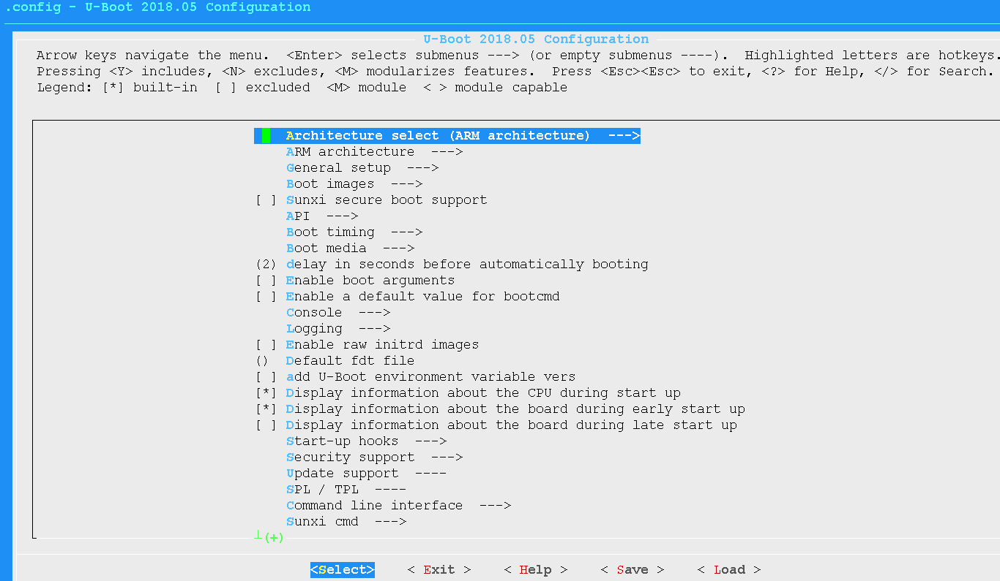

*图6-2: menuconfig 配置菜单图*

<!-- PDF page 35 -->

### 6.5 U-Boot编译

在tina 目录下即可编译U-Boot。

```bash
source build/envsetup.sh(见详注1)
lunch (见详注2)
muboot(见详注3)
详注：
1加载环境变量及tina提供的命令。
2输入编号，选择方案。
3编译U-Boot，编译完成后自动更新U-Boot binary到对应芯片配置仓库的Bin目录下:TinaSDK/device/config/chips/\$(CHIP)/
    bin/。
```

### 6.6 u-boot-efex编译

u-boot-efex 是专门用存放烧录代码的，只有MR536 u-boot-2023 才会使用，主要是和启动用的U-Boot 剥离开，其他平台不需要关注。

lunch 方案后执行muboot 命令可以手动编译。编译后的bin 存放在如下目录：

TinaSDK/device/config/chips/$(CHIP)/bin/u-boot-efex.bin

也可以手动编译，支持编译的方案配置路径在：

TinaSDK/brandy/brandy-2.0/u-boot-efex/configs

需要的方案，执行如下的命令：

```bash
cd brandy/brandy-2.0/u-boot-efex
make sun55iw6p1_mr536_efex_defconfig
make -j
```

### 6.7 U-Boot的配置

#### 6.7.1 dts配置

otdts 中会定义部分硬件配置，每个方案均有自己差异化的U-Bootdts 文件，路径：

TinaSDK/device/config/chips/$(CHIP)/configs/$(BOARD)/uboot-board.dts

修改配置文件后，注意重新编译U-Boot 确保dts 改动生效。

<!-- PDF page 36 -->

#### 6.7.2 sys_config配置

sys_config.fex 是对不同模块参数进行配置的重要文件，对各模块重要参数的更改及更新提供了极大的方便。其文件存放路径：

TinaSDK/device/config/chips/$(CHIP)/configs/$(BOARD)/sys_config.fex

说明

1.sys_config 的主要作用：打包阶段根据sys_config 配置更新boot0, U-Boot, optee 等bin 文件的头部等信息，例如更新

dram 参数、uart 参数等。2. 根据1 描述，在修改sys_config 之后，重新打包即可, 无需重新make 编译。

##### 6.7.2.1 sys_config.fex结构介绍

sys_config.fes 主要由主键和子键构成，主键是某项功能或模块的主标识，由[] 括起，子键是对该功能或模块中各个参数的配置项，如下图所示，dram_para 是主键，dram_clk、dram_type 和dram_zq 是子键。

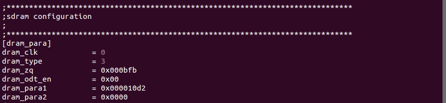

*图6-3: sysconfig.fex 基本结构图*

##### 6.7.2.2 sys_config.fex配置实例

[platform]：平台相关配置项。


*图6-4: platform 配置图*

例如，debug_mode =1 表示开启U-Boot 的调试模式，开启后会在log 中打印出对应的调试信息。next_work=2 表示烧录完成后系统的下一步执行动作(0x1 表示正常启动、0x2 表示重启、0x3 表示关)，其他配置可以查看[platform] 前的提示说明。

[target]：目标平台相关功能配置项。

<!-- PDF page 37 -->


*图6-5: target 配置图*

上图中的可以通过配置boot_clock 配置cpu 的频率大小。

[uart_para]：串口配置项，uart_para 配置项是U-Boot 串口打印调试时用到的重要配置。


*图6-6:uart_para配置图*

上图中的uart_debug_port=0 表示使用的是uart0，uart_debug_tx/uart_debug_rx 配置的gpio口（PA04/PA05）需要根据对应的GPIO DATASHEET 进行配置。

##### 6.7.2.3 sys_config.fex解析流程

在uboot2018 中sys_config.fex 最终会被转化为dtb（device tree binary，linux 内核配置

，dtb 最终会被打包烧录至flash 中，启动过程中会将该文件加载至内存，之前在

sys_config.fex 中配置的参数已转化为dtb 节点，最终会调用fdt_getprop_32() 函数对dtb 中的节点进行解析。

#### 6.7.3 环境变量配置

U-Boot 的环境变量就是一个个的键值对，操作接口为：getenv()，setenv()，saveenv()。环境变量的形式：

```text
boot_normal=sunxi_flash read 40007800 boot;boota 4000780
boot_recovery=sunxi_flash read 40007800 recovery;boota 40007800
boot_fastboot=fastboot
```

##### 6.7.3.1 环境变量作用

可以把一些参数信息或者命令序列定义在该环境变量中。在环境变量中定义U-Boot 命令序列，可以把U-Boot 各个功能模块按顺序组合在一起执行，从而完成某个重要功能。

例如，如果执行了上述提到的boot_normal 环境变量对应的命令，U-Boot 则会先调用sunxi_flash 命令从存储介质的boot 分区上加载内核到DRAM 的0x40007800 位置；然后调用

<!-- PDF page 38 -->

boota 命令完成内核的引导。

ot 启动时调用环境变量方式下如图所示：

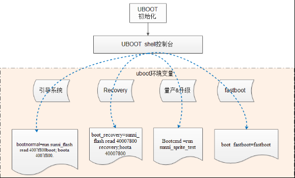

*图6-7: U-Boot 启动调用环境变量方式图*

##### 6.7.3.2 环境变量配置示例介绍

TinaSDK 中，环境变量配置文件保存在

TinaSDK/device/config/chips/$(CHIP)/configs/$(BOARD)/env.cfg文件，

用户使用的时候，可能会看到env-5.4.cfg 等文件，env-xxx 后缀数字表示在不同内核版本上的配置。打开后其内容示例如下，

- bootdelay=0 ，改环境变量bootdelay（即boot 启动时log 中的倒计时延迟时间）值的大小，

为便于调试，bootdelay 的值一般不要等于0，这样在小机上电后按下任意键才能进入U-Boot

ll 命令状态。

- boot_normal=sunxi_flash read 40007800 boot;boota 4000780 ，设置启动内核命令，即将

boot 分区读到内存0x40007800 地址处，然后从内存0x40007800 地址处启动内核。

- setargs_nand=setenv bootargs earlyprintk=$&#123;earlyprink&#125;，设置内核相关环境变量，该变量在

启动至内核的log 中会打印处理，即cmdline 如下图：

<!-- PDF page 39 -->

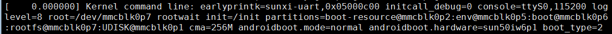

*图6-8: kernel cmdline 图*

- loglevel=8，设置内核log 打印等级。

#### 6.7.4 sys_partition.fex分区配置

分区配置文件是一个规划磁盘分区的文件，烧录过程会按照该分区配置文件将各分区数据烧录至flash 中。

DK 中，分区配置文件路径：

TinaSDK/device/config/chips/$(CHIP)/configs/$(BOARD)/sys_partition.fex。

有些方案可以看到sys_partition.fex、sys_partition_nor.fex 两个分区配置文件，若是打包Tina非nor 固件，则使用的是sys_partition_linux.fex 配置文件，若是打包nor 固件，则使用的是sys_partition_nor.fex。

##### 6.7.4.1 sys_partition.fex分区配置介绍

一个分区的属性，包含名称、分区大小、下载文件与用户属性。以下是文件中所描述的一个分区的属性：

<!-- PDF page 40 -->

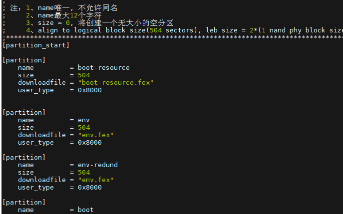

*图6-9: sys_partition 图*

- name，分区名称由用户自定义。当用户在定义一个分区的时候，可以把这里改成自己希望的字

符串，但是长度不能超过16 个字节。

，定义该分区的大小，以扇区的单位(1 扇区=512Bytes，如上图给env 分区分配了504 个

扇区，即504*512/1024 = 252K)，注意，为了对齐，这里分配的扇区大小应当能整除504(对于ubi 方案)。

- downloadfile，下载文件的路径和名称。可以使用相对路径，相对是指相对于image.cfg 文件所

在分区。也可以使用绝对路径。

- user_type，提供给操作系统使用的属性。目前，每个操作系统在读取分区的时候，会根据用户

属性来判断当前分区是不是属于自己的然后才进行操作。这样设计的目的是为了避免在多系统同时存在的时候，A 操作系统把B 操作系统的系统分区进行了不应该的读写操作，导致B 操作系统无法正常工作。

体的说明，可参考《a_Linux_ 存储_ 开发指南.pdf》。

<!-- PDF page 41 -->

## 7 Tina kernel定制开发

### 7.1 概述

本章节简单介绍kernel 基本配置、功能裁剪、常用命令的使用，帮助客户了解Tina 平台linux 内核，为内核定制开发提供基础。

目前TinaSDK 支持多个内核版本，如Linux-5.4，分别在不同硬件平台上使用，客户拿到SDK 需要根据开发的硬件平台核对内核信息。

### 7.2 代码路径

TinaSDK/kernel

```text
├──linux-4.9
├──linux-5.4
...
─linux-5.15
```

### 7.3 模块开发文档

详阅BSP 开发文档，文档目录包括常用内核模块使用与开发说明。

### 7.4 内核配置

在定制化产品时，通常需要更改linux 内核配置，在TinaSDK 中，打开内核配置的方式如下，

```bash
croot
make kernel_menuconfig
```

执行完后，shell 控制台会跳出配置菜单。如下图所示，

<!-- PDF page 42 -->

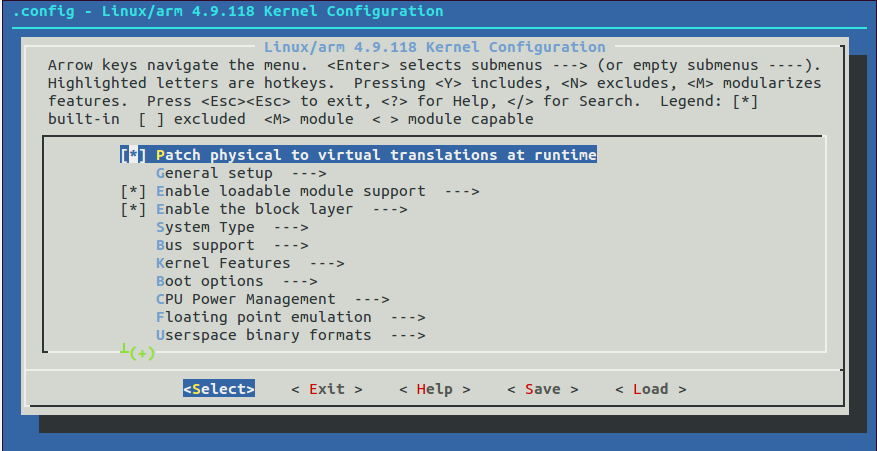

*图7-1: TinaLinux 内核配置菜单*

各个方案的内核配置文件，最终存放为TinaSDK/device/config/chips/$(CHIP)/configs/$(BOARD)/linux-/bsp_defconfig。

### 7.5 DTS介绍

Linux Kernel 目前支持多平台使用dts，全志平台的dts 文件存放于：

```text
Linux5.10内核之前的版本
TinaSDK/lichee/linux-<内核版本>/arch/arm64(arm)/boot/dts/sunxi/$(SOC)-pinctrl.dtsi
TinaSDK/lichee/linux-<内核版本>/arch/arm64(arm)/boot/dts/sunxi/$(SOC)-clk.dtsi
TinaSDK/lichee/linux-<内核版本>/arch/arm64(arm)/boot/dts/sunxi/$(SOC)-soc.dtsi
TinaSDK/lichee/linux-<内核版本>/arch/arm64(arm)/boot/dts/sunxi/$(SOC).dtsi
Linux5.10内核及之后的版本
TinaSDK/bsp/configs/linux-<内核版本>/$(SOC).dtsi
方案板端dts路径
TinaSDK/device/config/chips/$(CHIP)/configs/$(BOARD)/linux-<内核版本>/board.dts
```

确认某个方案使用的ux 内核版本呢？

查看BoardConfig.mk 配置可以获取内核版本、U-Boot 版本以及配置文件等信息。

按下面优先级路径查看BoardConfig.mk 配置：

```text
TinaSDK/device/config/chips/$(CHIP)/configs/$(BOARD)/$(LINUX_DEV)/BoardConfig.mk
TinaSDK/device/config/chips/$(CHIP)/configs/$(BOARD)/BoardConfig.mk
TinaSDK/device/config/chips/$(CHIP)/configs/default/BoardConfig.mk
```

<!-- PDF page 43 -->

```text
LINUX_DEV可能是openwrt/buildroot/bsp等,由./build.sh config时决定
如果选择的是nor介质方案，请查看BoardConfig_nor.mk
```

内核等关键信息举例：

```text
LICHEE_KERN_VER:=5.15-origin
LICHEE_BRANDY_UBOOT_VER:=2023
```

### 7.6 GPIO

比如MR527 提供12 组GPIO(GPIOB~GPIOM) 共203 个，所有的GPIO 都可以用作中断，GPIOL 及以上的GPIO 可以作为系统唤醒脚，所有GPIO 都可以软件配置为上拉或者下拉，所有GPIO 默认

e，GPIO 的驱动能力软件可以配置。

当通过/sys/class/gpio/节点在应用层操作GPIO 时，这里需要输入GPIO index，它的计算公式是port x 32 + index，比如PB1 = B(1) x 32 + 1 = 33，此时echo 33 &gt; &gt; export，将会生成gpio33，操作该目录下的节点，即可控制PB1 的IO 状态，其他的GPIO 依此类推。

GPIO 的其他配置事项，可参考全志客户服务平台文档中心的&#123;IC&#125; Linux/Software软件类文档/SDK模块开发指南/Linux模块驱动开发指南/Linux_GPIO_开发指南.pdf。

### 7.7 CPU、DDR频率修改

DVFS（Dynamic Voltage and Frequency Scaling）动态电压频率调节，是一种实时的电压和频率调节技术。目前5.15 内核中支持DVFS 的模块有CPU、GPU、DDR。CPUFreq 是内核开发者定义的一套支持动态调整CPU 频率和电压的框架模型。它能有效的降低CPU 的功耗，同时兼顾CPU的性能。CPUFreq 通过不同的变频策略，选择一个合适的频率供CPU 使用，目前的内核版本提供了以下几种策略：

- interactive：根据CPU 负载动态调频调压；

- conservative：保守策略，逐级调整频率和电压；

- ondemand：根据CPU 负载动态调频调压，比interactive 策略反应慢；

- userspace：用户自己设置电压和频率，系统不会自动调整；

- powersave：功耗优先，始终将频率设置在最低值；

- performance：性能优先，始终将频率设置为最高值；

详细的模块功能及配置，请参考全志客户服务平台文档中心的&#123;IC&#125; Linux/Software软件类文档/SDK模块开发指南/Linux模块驱动开发指南/Linux_CPUFREQ_开发指南.pdf。CPU/GPU/DDR 分别有对应的调试接口，可以通过终端命令进行操作，对应的接口目录如下(实际平台会有节点差异)：

```text
CPU小核：/sys/devices/system/cpu/cpu0/cpufreq/
CPU大核：/sys/devices/system/cpu/cpu4/cpufreq/
```

<!-- PDF page 44 -->

```text
GPU：/sys/class/devfreq/1800000.gpu/
DDR：/sys/class/devfreq/3120000.dmcfreq/
```

这些目录下有如下类似节点：

- available_frequencies：显示支持的频率

- available_governors：显示支持的变频策略

- cur_freq：显示当前频率

- governor：显示当前的变频策略

- max_freq：显示当前最高能跑的频率

- min_freq：显示当前最低能跑的频率

U 为例进行定频操作，流程如下：查看支持哪些频率：

```bash
cat /sys/devices/system/cpu/cpu0/cpufreq/scaling_available_frequencies
```

切换变频策略：

```bash
echo userspace > /sys/devices/system/cpu/cpu0/cpufreq/scaling_governor
```

定频：

```bash
echo 1008000 > /sys/devices/system/cpu/cpu0/cpufreq/scaling_max_freq
echo 1008000 > /sys/devices/system/cpu/cpu0/cpufreq/scaling_min_freq
```

### 7.8 温控设置

当前主控芯片的ARM 核、GPU 核、NPU 核、DRAM 控制器等，分别带有温度传感器，可以实时监控CPU、GPU、NPU、DRAM 的温度，并通过算法来控制CPU 和GPU 的频率从而控制CPU 和GPU 的温度（大部分是CPU）。每个产品的硬件设计和模具不同对应的散热情况也不同，详细的温控策略，可参考全志客户服务平台文档中心的&#123;IC&#125; Linux/Software软件类文档/基础组件开发指南/Tina系统基础组件开发指南/Tina_Linux_温度控制_使用指南.pdf。

<!-- PDF page 45 -->

## 8 Tina 系统openWrt定制开发

该章节主要介绍openWrt 下开发使用说明，如果想了解其他构建系统，可查阅其他单独的文章，例如《Tina_Linux_buildroot_ 使用指南》。如果没有找到该文档，可能该SDK 并未支持build-root 等其它系统。

### 8.1 Tina procd-init与busybox-init切换

Linux 系统的1 号进程init 决定着进入系统后的环境配置(挂载、参数、环境变量等)，以及启动脚本。而Tina 中支持procd-init 以及busybox-init 两种启动方式。

procd-init 是openWrt 官方自身的init 进程，它还涉及到设备热拔插、挂载、日志保存、uci 配置等诸多功能，默认建议使用该种方式以支持更全的功能。

busybox-init 是使用busybox 工具中自带的init 进程，全志添加了相关启动脚本，完成基础的文件系统挂载、模块加载、应用启动等功能。

#### 8.1.1 Tina procd-init

tina 一般默认为procd-init，主要由下面配置决定：

```text
System init (procd-init) --->
Base system --->
 <*>block-mount
 <*>busybox................................ Core utilities for embedded Linux --->
```

Init Utilities ---&gt;

```text
[ ] init
          此处不选
  Coreutils --->
   [*] head
scellaneousUtilities--->
   [*] strings
<*> uci
<*> logd
```

选中上述配置后，重新编译整个固件。

```text
注意确认busybox的init不要被选中，对应选项为CONFIG_BUSYBOX_CONFIG_INIT。
如果改动过busybox的软件包配置，请务必重编busybox,命令:mmo busybox -B
```

<!-- PDF page 46 -->

#### 8.1.2 Tina busybox-init

busybox-init 的启动方式，由下面配置决定：

```text
System init (busybox-init) --->
Base system --->
 <*>busybox................................ Core utilities for embedded Linux --->
 Init Utilities --->
 [* ] init
 [*] Support reading an inittab file
```

另外inittab 文件中需要注意串口终端是否有正确指定，文件路径：

```text
openwrt/target/${ic}/${board}/busybox-init-base-files/etc/inittab
如果不存在busybox-init-base-files
目录，可以从别的方案目录下拷贝过来
重点关注这一句:
ttyS0::respawn:-/bin/sh
```

ttyS0或者ttyAS0表示使用的uart0，该tty一般与env.cfg的是对应起来的

以上配置一般就可以完成busybox init 的启动了，但建议选中下面选项，提供比较完整常用的功能：

```text
CONFIG_BUSYBOX_CONFIG_INSMOD
CONFIG_BUSYBOX_CONFIG_LSMOD
CONFIG_BUSYBOX_CONFIG_RMMOD
CONFIG_BUSYBOX_CONFIG_MDEV
CONFIG_BUSYBOX_CONFIG_FEATURE_MDEV_CONF
CONFIG_BUSYBOX_CONFIG_FEATURE_MDEV_EXEC
CONFIG_BUSYBOX_CONFIG_FEATURE_MDEV_DAEMON
```

选中上述配置后，建议先执行mmo busybox -B 确保busybox 软件包被重编，然后再重新编译整个固件。

```text
注意procd相关的一些软件包可以去掉，例如：
CONFIG_PACKAGE_procd
CONFIG_PACKAGE_block-mount
CONFIG_PACKAGE_uci
CONFIG_PACKAGE_logd
```

### 8.2 工具链编译

默认情况下，Tina Linux SDK 使用外部工具链进行编译，如下图所示。

<!-- PDF page 47 -->

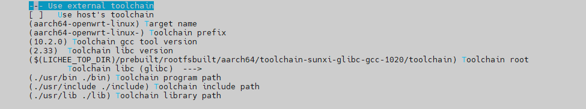

*图8-1: 外部工具链选项配置*

如果需要替换为其它工具链，用户可以根据工具链信息自行修改工具链根目录“Toolchain root”与各种版本信息。

在某些特殊情况下，用户需要自行编译工具链。此时需要在menuconfig 中取消勾选“Use exter-

naltoolchain” 以禁用外部工具链功能, 同时要选上“ToolchainOptions” 来开启编译工具链功能, 具体可以参考下面的配置。

[*] Advanced configuration options (for developers) ---&gt;

```text
[ ] Use external toolchain ----
[*] Toolchain Options (NEW) --->
```

Tina Linux SDK 的编译工具链时需要编译如下所示的软件包，其Makefile 均位于openwrt/openwrt/toolchain 目录下。

- binutils: 开源软件工具集, 它包含了一系列的实用程序，如汇编器(as)、链接器(ld) 和目标文

| 转换工具(objdump | bjcopy 等)，可以处理可执行文件、目标文件和共享库等。支持通过 |  |  |
| --- | --- | --- | --- |
| inutilsVersion” | 切换版本，可供选择的版本有 | :2.35.1、2.37、2.38、2.39 | 、2.40。 |

- kernel-headers: 提供了用于开发和构建在环境中运行的应用程序所需的内核头文件。

- gcc: 开源编译器工具集，将源代码翻译成目标代码，生成可执行文件或者库文件，用于构建软

件应用程序。支持通过“GCC compiler Version” 选项切换版本，可供选择的版本有:10.2.0、

11.3.0、12.2.0。

- libc(glibc 或musl):C 语言标准库，它提供了一系列基本的函数和工具，用于开发和运行C 语言

程序。Tina Linux SDK 支持glibc 和musl 两种C 库，可以在menuconfig 中通过“C Library implementation” 选项进行切换。其中glibc 支持通过“Glibc version” 选项在2.33 与2.37版本间进行选择;musl 目前只支持1.2.3 版本。需要注意的是，由于一些头文件定义问题，gcc

10.2 需要配合glibc 2.33 版本使用，否则会引起编译报错。

: 开源调试器，用于调试C、C++ 等编程语言的程序。

使能工具链编译功能后，即可进一步配置工具链编译选项，Tina Linux SDK 默认的外部工具链也是由此编译而来。目前所有平台均支持gcc 8.3.0 加glibc 2.33 版本的工具链。此外aarch64 平台还额外提供了gcc 10.2.0 和gcc 11.3.0 两个版本的工具链，其版本和配置信息如下表所示。如果没有其他需求直接使用提供的外部工具链即可。

<!-- PDF page 48 -->

| gccbinutilsglibcgdb | 其他选项 |  |  |  |
| --- | --- | --- | --- | --- |
| 10.2.0 | 3.35.1 | 2.33 | 12.1 | INSTALL_GFORTRAN、GCC_DEFAULT_SSP |
| 11.3.0 | 3.40 | 2.37 | 无 | INSTALL_GFORTRAN |

当配置好编译选项后，在终端输入m openwrt_rootfs toolchain/install 即可编译工具链。编译成功后可以执行m openwrt_rootfs target/toolchain/install 将编译出来的工具链打包为tar.xz格式，以mr527-evb 方案为例，最终工具链压缩包的路径为out/mr527/evb/openwrt/extra/targets/mr527-evb/generic-glibc/toolchain-aarch64_generic-glibc.tar.xz。用户可以将其解压到当前架构对应的目录下，替代原有的工具链。

### 8.3 应用移植

在Tina Linux SDK 中一个软件包目录下通常包含如下两个目录和一个文件：

```text
package/<分类>/<软件包名>/Makefile
package/<分类>/<软件包名>/patches/ [可选]
package/<分类>/<软件包名>/files/ [可选]
其中，
patches 保存补丁文件，在编译前会自动给源码打上所有补丁
保存软件包的源码，在编译时会对应源码覆盖源码中的源文件
```

file 编译规则文件，

#### 8.3.1 Makefile范例

该Makefile 的功能是: 软件源码的准备，编译和安装的过程，提供给Tina Linux 识别和管理软件包的接口，软件的编译逻辑是由软件自身的Makefile 决定，理论上和该Makefile(该Makefile 只执行make 命令和相关参数) 无实质关系。

<!-- PDF page 49 -->

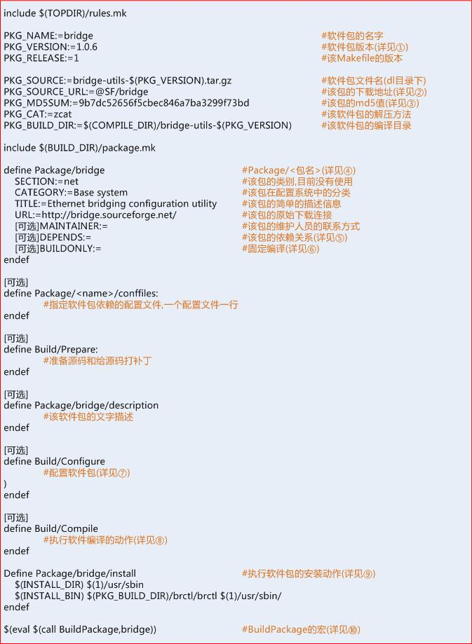

详注：

```text
1.如果是开源软件，软件包版本建议与下载软件包的版本一致。
2.以PKG开头的变量主要告诉编译系统去哪里下载软件包。
3.md5sum用于校验下载下来的软件包是否正确，如果正确，在编译该软件的时候，就会在PKG_BUILD_DIR下找到该软件包
```

<!-- PDF page 50 -->

```text
的源码。
       4.Package/<name>: <name>用来指定该Package的名字，该名字会在配置系统中显示。
       5.使用依赖包的名字
<name>来指定依赖关系，如果是扩展包，前面添加一个”
                    +”号，如果是内核版本依赖使用@LINUX_2_<
           minor version>。
       6.如果该值为1，该包将不会出现在配置菜单中，但会作为固定编译，可选。
       7.在开源软件中一般用来生成Makefile，其中参数可以通过CONFIGURE_VARS来传递。
       8.在开源软件中一般相当于执行make，其中有两个参数可以使用:MAKE_FLAGS和MAKE_VARS。
       9.内置的几个关键字如下：
        INSTALL_DIR相当于install -d m0755
        INSTALL_BIN相当于install -m0755
        INSTALL_DATA相当于install -m0644
        INSTALL_CONF相当于install -m0600
       10.该Makefile的所有define部分都是为该宏的参数做的定义.上层Makefile通过调用此宏进行编译。
       11.更详细内容请参考OpenWrt官方指导文档：https://openwrt.org/docs/guide-developer/packages
```

#### 8.3.2 自启动设置

在Tina Linux 中支持两种格式的初始化脚本，一种是busybox 式或者sysV 式的初始化脚本，一种是procd 式的初始化脚本。一般我们把由初始化脚本启动的应用叫做服务。

初始化脚本以shell 脚本的编程语言组织，shell 脚本作为基础知识在此不展开说明。一般情况下，初始化脚本源码保存在软件的files 目录，且后缀为“.init”，例如：

tina/openwrt/openwrt/package/system/fstools/files/fstab.init

在Makefile 的install 中把初始化脚本安装到小机端的/etc/init.d 中，例如：

define Package/block-mount/install

```text
$(INSTALL_DIR) $(1)/etc/init.d/
 $(INSTALL_BIN) ./files/fstab.init $(1)/etc/init.d/fstab
endef
```

##### 8.3.2.1 调用自启动脚本

手动调用方式, 在启动的时候会有太多的log，且log 信息已被logd 守护进程收集，不利于我们调试初始化脚本，此时可通过小机端的命令行手动调用的形式来调试，例如：

TinaLinux:/#/etc/init.d/fstabstart

##### 8.3.2.2 sysV格式脚本

sysV 式的初始化脚本保存在小机端的/etc/init.d/目录下，实现开机自启动。下例以最小内容的初始化脚本作示例讲解，核心是实现start/stop 函数：

<!-- PDF page 51 -->

```text
#!/bin/sh /etc/rc.common
# Example script
# Copyright (C) 2007 OpenWrt.org
START=10
STOP=15
DEPEND=xxxx
start() {
 #commands to launch application
}
stop() {
 #commands to kill application
}
注意：
T=10，指明开机启动优先级
序列)[数值越小，越先启动]，取值范围
0-99。
STOP=15，指明关机停止优先级(序列) [数值越小，越先关闭]，取值范围0-99。
DEPEND=xxxx，指明初始化脚本会并行执行，通过此项配置确保执行的依赖。
```

在rc.common 中提供了一个init 脚本的功能模板，模板中包括如下几个组成部分：

| 名称 | 属性 | 功能 |
| --- | --- | --- |
| start | 必须实现 | 启动一个服务 |
| stop | 必须实现 | 停止一个服务 |
| reload | 可选实现 | 重启一个服务 |
| enable | 可选实现重新加载服务 |  |
| disable | 可选实现 | 禁用服务 |

在shell 里面可以使用如下的命令来操作相关的服务。

```text
$ root@TinaLinux:/# /etc/init.d/exmple restart|start|stop|reload|enable|disable
```

##### 8.3.2.3 procd格式脚本

以下例的初始化脚本作示例讲解，主要是实现函数start_service：

```text
#!/bin/sh /etc/rc.common
USE_PROCD=1
PROG=xxxx
START=10
STOP=15
DEPEND=xxxx
start_service() {
```

<!-- PDF page 52 -->

```text
procd_open_instance
 procd_set_param command $PROG -f
 ......
 procd_close_instance
}
```

详细的介绍可以参考：https://wiki.openwrt.org/inbox/procd-init-scripts。

### 8.4 应用调试

新添加的软件默认配置为不使能，此时需要手动配置使能软件包。通过在tina 的根目录执行make menuconfig 进入软件包的配置界面：

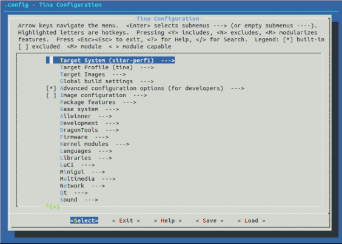

*图8-2: 应用配置主界面*

包的所在路径与软件包的Makefile 中的定义有关，以fstools 为例，在Makefile中定义为：

define Package/fstools

```text
SECTION:=base
 CATEGORY:=Base system
 DEPENDS:=+ubox +USE_GLIBC:librt +NAND_SUPPORT:ubi-utils
 TITLE:=OpenWrt filesystem tools
 MENU:=1
endef
```

此时，只需要在menuconfig 界面中进入Basy system 即可找到fstools 的软件包。

<!-- PDF page 53 -->

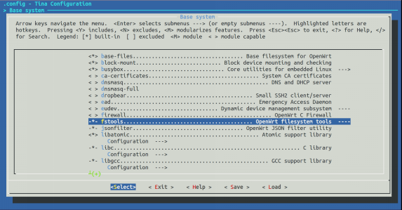

*图8-3: 软件包所在界面*

前缀符号含义：

```text
[*] 或<*> ：编译进入SDK
[ ] 或< > ：不包含
```

支持操作：

：选择包含

N 或n ：取消选择

### 8.5 应用编译

应用软件包的编译有多种办法，可以根据实际开发、调试需要选择，达到节省编译耗时的目的。

1. 编译整个固件镜像，参考编译打包章节。

make -jN 会执行完整编译流程，耗时相对较久。

注意如果不是首次执行make，只有软件包被识别到有更新才会被编译，例如软件包的Makefile、目录下源码等被改动。

如果不确定软件包的编译情况，想让完整重新编译整个sdk，可以先执行make distclean 清理编译产物后，再执行make。

2. 应用目录下编译。

<!-- PDF page 54 -->

```text
例如编译fstools软件包，在openwrt/openwrt/package/system/fstools路径下可执行：
编译软件包：
mm
```

重编软件包：mm -B

一般使用该方式的场景：熟悉某个软件包的路径，并且要经常单独编译该软件包做调试用。

注意，mm -B 命令是相当于会先clean 清除再make 编译, 能够确保软件包被编译。

3. 在Tina SDK 根目录下编译软件包。

```bash
make openwrt_rootfs package/{包名}/clean
make openwrt_rootfs package/{包名}/compile
以memtester软件包为例
编译软件包：make openwrt_rootfs package/memtester/compile
件包：makeopenwrt_rootfspackage/memtester/clean
```

4. 在任意目录下编译指定软件包。

```text
mmo {包名}
以alsa-utils软件包为例
编译软件包：mmo alsa-utils
重编软件包：mmo alsa-utils -B
```

### 8.6 应用安装

1. 获取安装包

安装包一般位于目录：

tina/out/out/&lt;芯片名&gt;/dev/openwrt/staging_dir/packages/&lt;方案名&gt;/

安装包命名格式为：

&lt;应用名&gt;_&lt;应用版本&gt;-&lt;架构指令集&gt;.ipk

装应用包

通过adb 推送安装包到小机：

```text
$ adb push <安装包路径> <推送到小机路径>
```

安装应用包：

<!-- PDF page 55 -->

```text
$ opkg install <安装包路径>
```

3. 不通过openwrt 的okpg 方式将应用推送到设备端

可以先找到能编译产物路径，然后通过adb 将二进制、配置等需要的文件推送到小机端。

```text
应用软件包编译时的源码以及生成的产物路径,以alsa-utils举例：
TinaSDK/out/$(CHIP)/$(BOARD)/openwrt/build_dir/target/alsa-utils-1.2.4
其中ipkg-install目录是目标产物安装目录，这里的二进制文件是未经过strip的。
ipkg-$(ARCHl)目录跟install目录类似，但二进制文件是经过strip的
```

### 8.7 分区与挂载

- 升级分区

| 分区 | 功能 |  |  |
| --- | --- | --- | --- |
| boot 分区 | 存内核镜像 |  |  |
| rootfs 分区 | 基础系统镜像分区，包含/lib，/bin，/etc 等 |  |  |
| recovery 分区 | 存放恢复系统镜像，仅大容量方案有，详见OTA 文档 |  |  |
| tend 分区存放恢复系统镜像及 | rootfs 的 | 部分，仅小容量方案有，详见 | OTA 文档 |

- 不升级分区

| 分区 | 功能 |  |
| --- | --- | --- |
| private 分区 | 存储SN 号分区 |  |
| misc 分区 | 系统状态、刷机状态分区 |  |
| UDISK | 分区用户数据分区，一般挂载在 | /mnt/UDISK |
| overlayfs 分区 | 存储overlayfs 覆盖数据 |  |

- 默认挂载点

<!-- PDF page 56 -->

| 分区 | 挂载点 | 备注 |
| --- | --- | --- |
| /dev/by-name/boot | /boot |  |
| /dev/by-name/boot-res | /boot-res |  |
| /dev/by-name/UDISK | /mnt/UDISK | 用户数据分区 |
| /dev/mmcblk0 或/dev/mmcblk0p1 | /mnt/SDCARD | Tf 卡挂载点 |
| /dev/by-name/rootfs_data | /overlay | 存储overlayfs 覆盖数据 |

### 8.8 新建方案

主要涉及下面几个改动点：

1. 新增openwrt 方案目录信息

以T113 芯片下新建t113-evb1 方案为例，需要增加：

TinaSDK/openwrt/target/t113/t113-evb1

并注意该目录下的文件名及内容：

```text
Makefile: 注意BOARD,BOARDNAME
     等信息
t113_evb1.mk, vendorsetup.sh等文件，注意t113相关字样信息
defconfig:注意更新配置信息
```

2. 新增芯片方案目录信息以T113 芯片下新建t113-evb1 方案为例，需要增加：

TinaSDK/device/config/chips/t113/configs/evb1

重新执行source, lunch 等命令配置环境，即可编译新增方案了。

<!-- PDF page 57 -->

权声明

本文档及内容受著作权法保护，其著作权由珠海全志科技股份有限公司（“全志”）拥有并保留一切权利。

本文档是全志的原创作品和版权财产，未经全志书面许可，任何单位和个人不得擅自摘抄、复制、修改、发表或传播本文档内容的部分或全部，且不得以任何形式传播。

商标声明

、

、

、

（不完全列

举）均为珠海全志科技股份有限公司的商标或者注册商标。在本文档描述的产品中出现的其它商标，产品名称，和服务名称，均由其各自所有人拥有。

免责声明

您购买的产品、服务或特性应受您与珠海全志科技股份有限公司（“全志”）之间签署的商业合同和条款的约束。本文档中描述的全部或部分产品、服务或特性可能不在您所购买或使用的范围内。使用前请认真阅读合同条款和相关说明，并严格遵循本文档的使用说明。您将自行承担任何不当使用行为（包括但不限于如超压，超频，超温使用）造成的不利后果，全志概不负责。

本文档作为使用指导仅供参考。由于产品版本升级或其他原因，本文档内容有可能修改，如有变

恕不另行通知。全志尽全力在本文档中提供准确的信息，但并不确保内容完全没有错误，因

使用本文档而发生损害（包括但不限于间接的、偶然的、特殊的损失）或发生侵犯第三方权利事件，全志概不负责。本文档中的所有陈述、信息和建议并不构成任何明示或暗示的保证或承诺。

本文档未以明示或暗示或其他方式授予全志的任何专利或知识产权。在您实施方案或使用产品的过程中，可能需要获得第三方的权利许可。请您自行向第三方权利人获取相关的许可。全志不承担也不代为支付任何关于获取第三方许可的许可费或版税（专利税）。全志不对您所使用的第三方许可技术做出任何保证、赔偿或承担其他义务。
