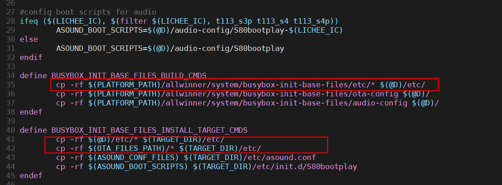
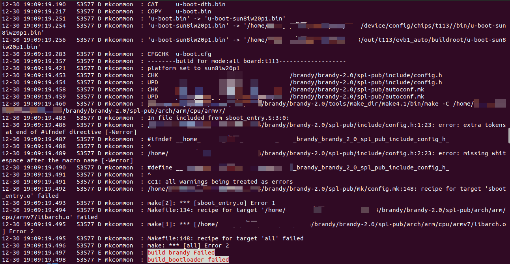
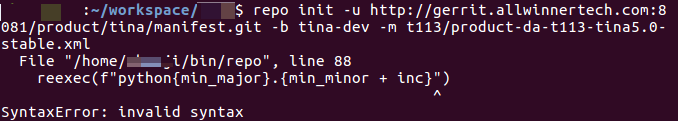
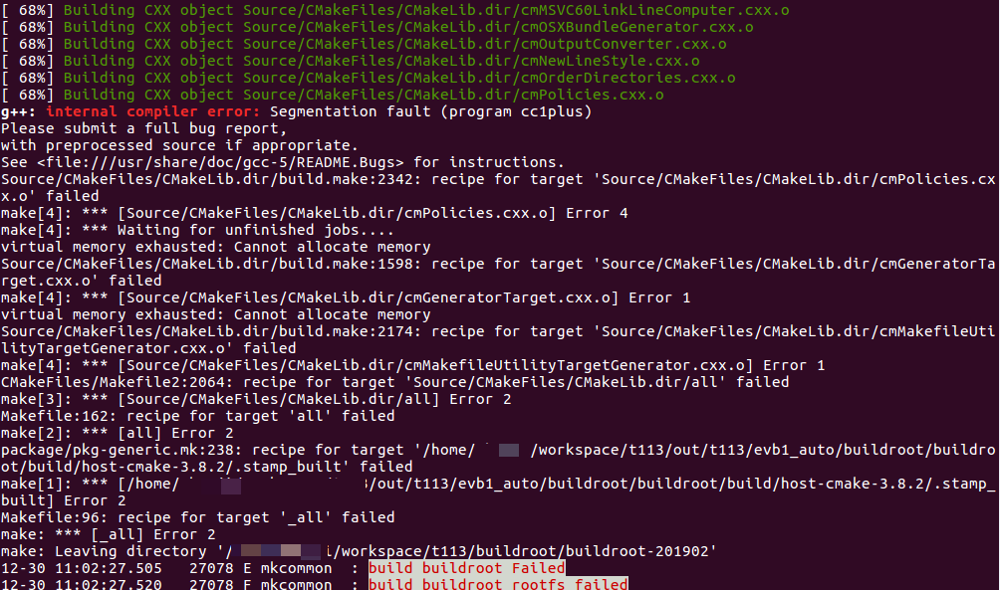
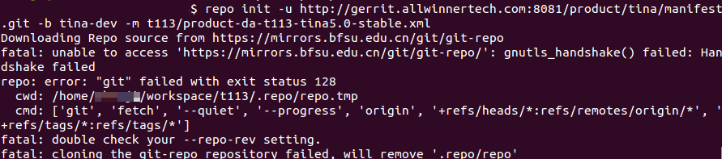

# Buildroot

:::info 文档说明

- **原始页数：** 26 页
- **文档版本：** 1.5
- **发布日期：** 2025-08-18
- **原始文件：** [查看或下载 PDF](/pdfs/T153MX/02-buildroot-guide.pdf)

正文按原始 PDF 的文本层、书签层级和页面顺序转换，仅移除重复页眉、页脚与水印，不改写技术内容。

:::

<!-- PDF page 5 -->

## 1 前言

### 1.1 文档简介

本文档介绍Tina 系统(Linux SDK) 下的Buildroot 文件系统的目录结构、编译和使用，主要目的用于指导用户如何定制和使用文件系统和使用基于Buildroot 构建自己的应用程序。

### 1.2 目标读者

基于Tina 系统的Buildroot 文件系统及应用开发者。

### 1.3 适用范围

全志T113、T527、A40i、MR153、A733、T736、T153、T536 等芯片。

<!-- PDF page 6 -->

## 2 Buildroot介绍

Buildroot，是嵌入式开发领域内一个成套的嵌入式开发环境。它可以用来定制自己的交叉编译器，制作自己的根文件系统。

Buildroot 集成在Tina 系统里面，在Tina 平台中，主要使用Buildroot 定制文件系统。因此，可以在Tina 里面配置并且编译。

<!-- PDF page 7 -->

## 3 buildroot目录结构

### 3.1 buildroot

Tina SDK 下的buildroot 文件夹主要包含（201902/202205）两个版本的Buildroot 项目源码、Buildroot 全志自研软件包编译配置(config) 和AW Buildroot 方案全志自研软件包(package)。

发布的SDK 一般只包含其中一个版本。

```text
# ${SDK_PATH}/buildroot
├──buildroot-201902 # 201902版本
├──buildroot-202205 # 202205版本
 ├──arch
              # 存放CPU架构相关的配置脚本，如arm/mips/x86
 ├──board
               # 存放了一些默认开发板的配置补丁之类的
 ├──boot
              # 引导系统
 ├──build.sh
 ├──CHANGES
 ├──Config.in
 ├──Config.in.legacy
 ├──configs
               # 放置开发板的一些配置参数,如sun55iw3p1*_*_defconfig
 ├──COPYING
 ├──DEVELOPERS
 ├──dl
             # 存放下载的源码包及应用软件的压缩包
─docs# 存放相关的参考文档
 ├──fs
             # 放各种文件系统的源代码
 ├──linux
              # 存放着Linux kernel的自动构建脚本
 ├──Makefile
 ├──Makefile.legacy
 ├──package
                # 下面放着应用软件的配置文件，包含Config.in和xxx.mk及patch
 ├──README
 ├──scripts
              # 存放编译脚本
 ├──support
 ├──system
               # 根目录主要骨架和启动初始化配置,然后再安装toolchain的动态库和勾选的package的可执行文件
 │└──skeleton # 提供rootfs模板目录结构，包含一些最基本的目录及文件。
 ├──toolchain
                # 存放编译工具链
 └──utils
├──config
                    # Buildroot全志自研软件包编译配置
│└──buildroot
└──package
                    # Buildroot方案全志自研软件包
 ├──auto
                   # Buildroot方案模块测试demo
 ├──qt
                  # qt-5.12
 ....
```

### 3.2 output

注：buildroot 根目录下的output 目录，在Tina 编译系统里面，转移到了out/&#123;IC&#125;/&#123;board&#125;/buildroot/buildroot 路径下。

<!-- PDF page 8 -->

```text
├──output
            # 输出文件夹，存放解压后的代码和目标文件
| ├──build # 存放解压后的各种软件包和编译完成后的现场
| ├──host # 存放着制作好的编译工具链，如gcc、arm-linux-gcc等工具
| ├──images # 存放着编译好的uboot.bin, zImage, rootfs等镜像文件，可烧写到板子里, 让linux系统跑起来。
| ├──per-package # 开启BR2_PER_PACKAGE_DIRECTORIES（并行编译）才有的目录，存放每个软件包的编译依赖以及
    编译产物。
| ├──staging # 软链接到host/< tuple >/sysroot/ 就是上面说到的文件系统需要的so库、*.h等目录,方便查看
| ├──target # 用来制作rootfs文件系统，里面放着Linux系统基本的目录结构，以及编译好的应用库和bin可执行文件(
```

Buildroot根据用户配置把.ko .so .bin文件安装到对应的目录下去，根据用户的配置安装指定位置)

### 3.3 platform

由于Tina 平台不单单支持Buildroot 文件系统，还有openwrt 等，因此一些共性全志自研软件包

在此目录下。下图仅列出部分应用列表。

```text
# ${SDK_PATH}/platform
platform
├──allwinner
│├──display
││├──libgpu
                    # GPU的mali.so库
││└──libuapi
│├──power
││└──healthd
│├──system
││├──ota-burnboot
                    # OTA升级相关代码
││└──rpbuf
│├──usb
││├──adbd
                    # adbd相关代码
││├──mtp
││└──setusbconfig
│├──utils
││├──boot-play
││├──cpu_monitor
                    # cpu_monitor相关代码
││├──libsocket_db
││├──mtop
                    # mtop相关代码
││└──uevent-monitor
│└──wireless
│
    ├──btmanager
                    # bt相关代码
│
    ├──common
│
    ├──firmware
                    # wifi/bt的固件包
│
    └──wifimanager
                    # wifi相关代码
└──Makefile -> build/Makefile
```

<!-- PDF page 9 -->

## 4 构建Buildroot

### 4.1 配置repo环境

说明

如果没有repo/git 环境，可参考如下方式准备。

#### 4.1.1 安装必要的软件包

在配置repo 之前，请确保系统已安装以下必要软件包：

```bash
sudo apt-get update //更新包索引
sudo apt-get install -y git-core curl //安装Git和Curl工具，这是repo所依赖的基础工具
```

#### 4.1.2 下载并配置repo工具

##### 4.1.2.1 下载repo脚本

在用户的bin 目录中下载repo 脚本。创建bin 目录（如果不存在），然后下载repo 脚本：

```text
mkdir -p ~/bin
curl https://storage.googleapis.com/git-repo-downloads/repo > ~/bin/repo
```

##### 4.1.2.2 设置repo脚本的可执行权限

下载完成后，需要为repo 脚本设置可执行权限：

chmod a+x ~/bin/repo //设置repo脚本为可执行文件

##### 4.1.2.3 将repo工具添加到PATH环境变量

为了在终端中能够直接使用repo 命令，需要将repo 工具的路径添加到PATH 环境变量中：

```text
export PATH=~/bin:$PATH
```

<!-- PDF page 10 -->

为了使这个修改在每次登录时自动生效，可以将这条命令添加到~/.bashrc或~/.profile文件中：

```bash
echo'exportPATH=~/bin:$PATH'>>~/.bashrc//
               将路径添加命令写入
        .bashrc文件
source ~/.bashrc //重新加载.bashrc文件，使修改立即生效
```

##### 4.1.2.4 更换镜像源

由于谷歌服务器位于国外，每次运行时repo 会检查更新导致下载较慢，甚至直接卡住不动然后失败。国内用户可以配置镜像源，在repo 的运行过程中会尝试访问官方的git 源更新自己，提高下载速度。

执行以下命令更换镜像源：

```bash
#ubuntu20.04/16.04执行下面命令
echo export REPO_URL='https://mirrors.bfsu.edu.cn/git/git-repo' >> ~/.bashrc
# ubuntu14.04执行下面命令
echo export REPO_URL='http://mirrors.bfsu.edu.cn/git/git-repo' >> ~/.bashrc
# 然后source使配置立即生效
source ~/.bashrc
```

##### 4.1.2.5 配置git用户与邮箱

git 上传代码需要配置用户名以及邮箱地址，可以通过以下命令进行配置：

```bash
git config --global user.email "you@example.com"
nfig--globaluser.name"YourName"
```

### 4.2 配置编译环境

ubuntu 20.04/22.04 版本，执行下面命令安装软件包：

```bash
sudo apt-get install build-essential subversion git-core libncurses5-dev zlib1g-dev gawk flex quilt libssl-dev xsltproc
    libxml-parser-perl mercurial bzr ecj cvs unzip lib32z1 lib32z1-dev lib32stdc++6 libstdc++6 libc6:i386 libstdc++6:i386
    lib32ncurses-dev lib32z1 ncurses-term bison libexpat1-dev python-is-python3 -y
```

ubuntu 16.04/18.04 版本，执行下面命令安装软件包：

```bash
sudo apt-get install build-essential subversion git-core libncurses5-dev zlib1g-dev gawk flex quilt libssl-dev xsltproc
    libxml-parser-perl mercurial bzr ecj cvs unzip lib32z1 lib32z1-dev lib32stdc++6 libstdc++6 libc6:i386 libstdc++6:i386
    lib32ncurses5 lib32z1 ncurses-term bison libexpat1-dev -y
```

ubuntu 14.04 版本可直接执行以下命令安装：

```bash
sudo apt-get install build-essential subversion git-core libncurses5-dev zlib1g-dev gawk flex quilt libssl-dev xsltproc
    libxml-parser-perl mercurial bzr ecj cvs unzip lib32z1 lib32ncurses5 lib32z1-dev lib32stdc++6 libstdc++6 ncurses-
    term bison libexpat1-dev -y
```

<!-- PDF page 11 -->

#### 4.2.1 各个软件包的说明：

build-essential：

```bash
包含编译软件所需的基本工具和库，包括gcc、g++、make 等。
subversion：
 版本控制系统，用于管理源代码的版本，适合团队协作。
git-core（通常只需使用git）：
 分布式版本控制系统，用于源代码管理，支持分支和合并等功能。
libncurses5-dev：
 提供终端用户界面（TUI）开发所需的库，支持文本界面的应用程序。
zlib1g-dev：
 提供Zlib 压缩库的开发文件，常用于数据压缩和解压缩。
gawk：
 GNU 版本的AWK，文本处理工具，用于模式扫描和处理。
flex：
分析器生成器，用于生成扫描器（
lexer），通常与bison 一起使用。
```

quilt：

```text
用于管理补丁的工具，方便在源代码上应用和管理多个补丁。
      libssl-dev：
       OpenSSL 的开发库，提供SSL/TLS 加密功能，常用于网络安全。
      xsltproc：
       XSLT 处理器，用于将XML 文档转换为其他格式（如HTML）。
      libxml-parser-perl：
       Perl 的XML 解析库，提供XML 文档的解析功能。
      mercurial：
       分布式版本控制系统，类似于Git，用于源代码管理。
      bzr：
       Bazaar 版本控制系统，另一种源代码管理工具。
      ecj：
       Eclipse Java Compiler，用于编译Java 代码。
      cvs：
控制系统，较旧的源代码管理工具，现已被
Git 和其他工具取代。
```

unzip：

```text
用于解压缩ZIP 文件的工具。
lib32z1：
 32 位Zlib 压缩库，提供32 位应用程序的压缩支持。
lib32z1-dev：
 32 位Zlib 压缩库的开发文件，供32 位应用程序开发使用。
lib32stdc++6：
 32 位GNU 标准C++ 库，供32 位应用程序使用。
libstdc++6：
 GNU 标准C++ 库，供64 位应用程序使用。
libc6:i386
    提供基本的系统调用接口和C 标准库函数，如字符串处理、内存管理、输入输出等。
libstdc++6:i386
    提供C++ 标准库的功能，包括STL（标准模板库）、输入输出流、字符串处理等。
lib32ncurses-dev：
 32 位ncurses 开发库，提供终端用户界面开发所需的功能。
ncurses-term：
 提供终端类型的描述文件，支持终端用户界面的应用程序。
bison：
 语法分析器生成器，用于生成解析器（parser），通常与flex 一起使用。
libexpat1-dev：
 Expat XML 解析库的开发文件，提供XML 文档的解析功能。
python-is-python3:
    创建一个符号链接，使得python 命令指向python3。
```

可通过执行dpkg -l显示所有已安装的软件包及其版本信息。也可以执行apt list --installed命令以更易读的

<!-- PDF page 12 -->

格式列出所有已安装的软件包。

### 4.3 配置Buildroot

#### 4.3.1 配置BoardConfig.mk

为了方便文件系统定制，Tina SDK 支持Buildroot 构建文件系统，为了支持Buildroot 方案，SDK需要进行如下的适配。

新增$&#123;SDK_PATH&#125;/device/config/chips/&#123;ic&#125;/configs/&#123;board&#125;/buildroot 文件夹，新增如下文件，

会提供。

```text
${SDK_PATH}/device/config/chips/{ic}/configs/{board}/buildroot$ tree -L 1
├──BoardConfig.mk
                    # 配置文件，必需文件，下文说明
├──env_ab.cfg
                 # ab系统需要
├──env.cfg
               # 环境变量配置文件，必需文件
├──env-recovery.cfg # recovery环境变量配置文件
├──swupdate
                 # OTA升级相关
├──sys_partition_ab.fex
├──sys_partition.fex # 系统分区表
└──sys_partition-recovery.fex
```

Buildroot 的配置在BoardConfig*.mk 如下所示：

```text
LICHEE_BUILDING_SYSTEM
LICHEE_BR_VER
E_BR_DEFCONF
```

LICHEE_BR_RAMFS_CONF

当需要使用Buildroot 来构建文件系统时，需要在BoardConfig*.mk 文件增加这些环境变量的配置，介绍如下：

```text
# ${SDK_PATH}/device/config/chips/{ic}/configs/{board}/buildroot/BoardConfig.mk
LICHEE_BUILDING_SYSTEM:=buildroot
                    # 构建系统Buildroot
LICHEE_BR_VER:=202205
                    # Buildroot版本，目前支持201902和202205
LICHEE_BR_DEFCONF:=sun55iw3p1_defconfig
                    # Buildroot构建根文件系统时使用的配置文件
LICHEE_BR_RAMFS_CONF:=sun55iw3p1_ramfs_defconfig # 编译ramfs时使用的配置文件，没有编译ramfs，可以不配置
```

#### 4.3.2 配置defconfig

在编译对应版本的Buildroot 前，需要提供构建文件系统的Buildroot 的配置文件，如sun55iw3p1_defconfig。

```text
xxx:${SDK_PATH} ls buildroot/buildroot-202205/configs/sun55iw3p1_defconfig
buildroot/buildroot-202205/configs/sun55iw3p1_defconfig
```

<!-- PDF page 13 -->

### 4.4 编译Buildroot

满足这些配置后，按照Tina 的编译过程，就可以对Buildroot 进行编译了。

#### 4.4.1 Buildroot完整编译

1. 方案选择：

```text
./build.sh config
# 根据需要选择配置，例如依次选择linux,buildroot,t527,demo_linux_car,default,linux-5.15
```

成功后得到如下log信息

make: Entering directory `/home/xxx/workspace/t527_linux_aiot/buildroot/buildroot-202205'

```bash
GEN
      /home/xxx/workspace/t527_linux_aiot/out/t527/demo_linux_car/buildroot/buildroot/Makefile
#
# configuration written to /home/xxx/workspace/t527_linux_aiot/out/t527/demo_linux_car/buildroot/buildroot/.config
#
make: Leaving directory `/home/xxx/workspace/t527_linux_aiot/buildroot/buildroot-202205'
INFO: buildroot defconfig is sun55iw3p1_defconfig
```

\\# Tina 系统已经选择了对应的Buildroot配置

2. 编译

个Tina 编译过程，会根据选择的Buildroot 配置进行Buildroot 文件系统的全部编译。

./build.sh # 该命令会在buildroot目录执行make all,编译Buildroot所有选中的程序

3. 打包

./build.sh pack

三个步骤即可生成具有Buildroot 文件系统的Linux 固件镜像。

#### 4.4.2 单独编译软件包

有时候，在开发调试的时候，需要单独编译一个软件包。以mtop 软件包为例，使用Buildroot 标准编译方式进行模块编译。

```text
# (1) 进入buildroot目录,如下
$ cd buildroot/buildroot-202205
# (2) 删除上次mtop编译生成的中间文件（每次编译，最稳妥就是先clean）
$ make mtop-dirclean
# (3) 强制重新编译mtop
$ make mtop-rebuild
# 编译完成后会自动把生成的bin文件拷贝到out目录下的rootfs中
# 此时可以手动push进小机端进行测试，或者重新执行/build.sh即可更新rootfs包
```

<!-- PDF page 14 -->

说明

mtop 的源码位置：platform/allwinner/utils/mtop/*

mtop 的Buildroot 编译配置位置：buildroot/config/buildroot/allwinner/utils/mtop/*mtop 编译生成的中间文件位置：out/&#123;ic&#125;/&#123;board&#125;/buildroot/buildroot/build/mtop/*mtop 编译最终生成的rootfs 下的bin 位置：out/&#123;ic&#125;/&#123;board&#125;/buildroot/buildroot/target/bin/mtop

说明

Buildroot 的全志自研软件包每次修改源码后不会自动编译，所以最好手动dirclean/rebuild 模块一次。

<!-- PDF page 15 -->

## 5 Buildroot常用命令

### 5.1 Tina SDK支持命令

说明

以下的命令执行路径为SDK 的根目录。

| 命令 | 用法说明 |
| --- | --- |
| ./build.sh config | 选择Buildroot 文件系统配置 |
| ./build.sh buildroot_rootfs | 单独编译Buildroot rootfs |
| ./build.sh buildroot_menuconfig | 打开Buildroot 配置文件 |
| ./build.sh buildroot_saveconfig | 保存Buildroot 配置文件 |

### 5.2 Buildroot编译命令

说明

以下的命令执行路径为buildroot/buildroot-20xxxx。

| 命令 | 用法说明 |  |  |
| --- | --- | --- | --- |
| 整体编译 | make xxx_defconfig | 基于Configs/xxx_defconfig 生成.config |  |
| 整体编译 | make menuconfig | 界面配置 |  |
| 整体编译 | makesavedefconfig | 基于.config | 保存到Configs/xxx_defconfig |
| 整体编译 | make | 整体编译(由于集成了aw 私有包，不建议使用) |  |
| 整体编译 | make clean | 清除过程文件和目标文件 |  |
| 整体编译 | make distclean | 清除所有的生成文件 |  |
| 软件包 | make xxx-build | 编译名为xxx 的软件包 |  |
| 软件包 | make xxx-dirclean | 清除名为xxx 的软件包 |  |

<!-- PDF page 16 -->

命令用法说明

| 软件包 | make xxx-rebuild | 重新编译名为xxx 的软件包 |
| --- | --- | --- |
| 软件包 | make xxx-reconfigure | 重新配置xxx 软件包 |

<!-- PDF page 17 -->

## 6 与标准Buildroot的不同

由于Tina 需要根据不同板型来配置并编译Buildroot，这就决定了Tina 的Buildroot 和标准Buil-droot 编译有些不同。

Tina 系统中的Buildroot 和标准Buildroot 的不同主要在.config 和编译目标输出。位置和说明情况如下所示：

- buildroot/buildroot-xxx/.config ：Tina 系统编译时不会生成或者使用到此文件，属于无效文件

- out/&#123;IC&#125;/&#123;board&#125;/buildroot/buildroot/.config：Buildroot 编译时使用到的.config

- out/&#123;IC&#125;/&#123;board&#125;/buildroot/ramfs/.config：ramfs 编译时使用到的.config

- buildroot/buildroot-xxx/output：Tina 系统编译时不会生成或者使用到此目录，属于无效目录

- out/&#123;IC&#125;/&#123;board&#125;/buildroot/buildroot/：同一个芯片的不同板型有不同的Buildroot 输出目录

- out/&#123;IC&#125;/&#123;board&#125;/buildroot/ramfs/：ramfs 输出目录

同时，为了支持AW 自研的软件包，新增了如下的目录。

| 目录 | 用法说明 |
| --- | --- |
| buildroot/config | Buildroot 全志自研软件包编译配置 |
| buildroot/package | Buildroot 方案全志自研软件包 |
| platform | 共性全志自研软件包源码 |

<!-- PDF page 18 -->

## 7 Buildroot软件包修改

### 7.1 添加Buildroot全志自研软件包

以t527 芯片平台新增helloworld 为例进行描述。

写app 源码和Makefile

```c
xxx@GZExdroid04:~/workspace/t527_linux_aiot/platform/allwinner/helloworld$ tree
├──helloworld.c
└──Makefile
/* helloworld.c */
#include <stdio.h>
void main(void) { printf("Hello world.\n");}
TARGET = helloworld
SRCS = $(wildcard *.c)
```

all: $(TARGET)

$(TARGET): $(SRCS)$(CC) $^ $(CFLAGS) $(INCLUDES) $(LDFLAGS) -o $@

clean:rm -rf $(TARGET)

.PHONY: all clean install

2. helloworld 增加编译规则

需要新建buildroot/config/buildroot/helloworld目录，并创建helloworld.mk 与Config.in 文件。

world/Config.in通过makemenuconfig可以对helloworld 进行选择。

config BR2_PACKAGE_HELLOWORLD

```text
bool "helloworld"
help
```

This is a demo to add local app.

Buildroot 编译helloworld 所需要的设置helloworld.mk，包括源码位置、编译规格、安装目录等。

```text
HELLOWORLD_VERSION:= 1.0.0
HELLOWORLD_SITE = $(PLATFORM_PATH)/../../../platform/allwinner/helloworld
```

<!-- PDF page 19 -->

```text
HELLOWORLD_SITE_METHOD:=local
HELLOWORLD_INSTALL_TARGET:=YES
```

define HELLOWORLD_BUILD_CMDS

```text
$(MAKE) CC="$(TARGET_CC)" LD="$(TARGET_LD)" -C $(@D) all
endef
```

define HELLOWORLD_INSTALL_TARGET_CMDS

```text
$(INSTALL) -D -m 0755 $(@D)/helloworld $(TARGET_DIR)/bin
endef
```

$(eval $(generic-package))

3. 把软件包添加到Buildroot 编译脚本中。

uildroot/config/buildroot/Config.in，增加如下信息：

```bash
xxx@GZExdroid04:~/workspace/t527_linux_aiot/buildroot/config$ git diff buildroot/Config.in
diff --git a/buildroot/Config.in b/buildroot/Config.in
index f5bf03a..816b819 100755
--- a/buildroot/Config.in
+++ b/buildroot/Config.in
@@ -10,6 +10,7 @@ endmenu
menu "system"
source "../config/buildroot/allwinner/system/ota/ota-burnboot/Config.in"
+source "../config/buildroot/helloworld/Config.in"
```

endmenu

menu "usb"

uildroot/config/buildroot/platform.mk，增加如下信息：

```text
xxx@GZExdroid04:~/workspace/t527_linux_aiot/buildroot/config$ git diff buildroot/platform.mk
diff --git a/buildroot/platform.mk b/buildroot/platform.mk
index 488090d..0e0e24a 100755
--- a/buildroot/platform.mk
+++ b/buildroot/platform.mk
@@ -34,3 +34,4 @@ include ${PLATFORM_PATH}/rpbuf/rpbuf.mk
include ${PLATFORM_PATH}/allwinner/wireless/wireless_common/wireless_common.mk
include ${PLATFORM_PATH}/allwinner/wireless/btmanager/btmanager.mk
include ${PLATFORM_PATH}/ai-sdk/ai-sdk.mk
+include ${PLATFORM_PATH}/helloworld/helloworld.mk
```

| nuconfig 选中 | 保存 |  |  |  |  |  |
| --- | --- | --- | --- | --- | --- | --- |
| 通过 | menuconfig | 选中 | APP，然后 | make | savedefconfig，helloworld | 的配置 |

（BR2_PACKAGE_HELLOWORLD）就会保存到sun55iw3p1_defconfig 中。

修改Buildroot 的defconfig 后，开始编译即可。

5. 编译app

<!-- PDF page 20 -->

可以和整个平台一起编译APP；或者make helloworld 单独编译。

个文件在选中此后，都会被拷贝到output/build/helloworld-1.0.0文件夹中。

然后生成的bin 文件拷贝到output/target/bin/helloworld，这个文件会打包到文件系统中。

说明

如遇到较为复杂的程序，可以参考AW 其他自研的类似app，适配操作都是类似的。

### 7.2 配置Buildroot开机自启动

模块位置：buildroot/allwinner/system/busybox-init-base-files。

bd 开机自启动为例：

1. 新建S50adb_start 文件，并实现start 与stop 方法，分别对应开机自启动运行，以及关机退出

进程。

```text
xxx:~/workspace/t527_linux_aiot/buildroot/config/buildroot/allwinner/system/busybox-init-base-files/etc/init.d$ tree
.
├──S20mdev
├──S50adb_start # 新增的开机启动脚本
...
```

| 置busybox-init-base-files.mk | ，把新建的 | S50adb_start 文件拷贝到rootfs 中的/etc/ |
| --- | --- | --- |
| t.d/文件夹下。默认脚本会自动拷贝指定位置的启动脚本到 | target 文件系统中去。 |  |



*图7-1: etc_install*

说明

原理介绍：Buildroot 原生开机运行的模块为package/initscripts，加载rootfs 后首先会运行/etc/init.d/rcS 脚本，这个脚本会遍历/etc/init.d/文件夹下的S 开头的文件，并依次执行他们。所以如果期望开机自启动其他进程，可新建Sxx 的文件，拷贝至/etc/init.d/即可实现。

<!-- PDF page 21 -->

## 8 Q&A

### 8.1 ubuntu20.04显示无法识别python

问题原因：Ubuntu 从20.04 开始不再将python 加入PATH 环境变量，在编译安装一些软件会提示无法运行并提示找不到python，然而python3 已安装，需要额外重定向。

解决方法：可以将脚本代码的python 都改为python3即可解决问题，但比较繁琐。可以通过安装软件包python-is-python3 创建软连接，将python 指向python3，即可解决问题。

```bash
# 安装python-is-python3软件包，创建软连接
sudo apt-get install python-is-python3
```

### 8.2 ubuntu20.04显示编译错误

如下图所示，编译时显示预处理指令存在语法解释错误：



*图8-1: 20_04 版本编译报错*

问题原因：编译路径中存在非ASCII 字符，比如中文字符，会导致编译器出现问题。

解决方法：移动SDK 包到纯英文路径下，确保路径中不存在非ASCLL 字符。

<!-- PDF page 22 -->

### 8.3 ubuntu16.04/14.04进行repo初始化仓库报错



*图8-2: repo 初始化仓库报错*

问题原因：Python 版本问题。f-string（格式化字符串字面量）是从Python 3.6 开始引入的。如果

的是Python3.5的版本，就会出现这个语法错误。可以通过在终端中运行python--version

或python3 --version 来检查当前使用的Python 版本。

当前python3 版本为3.5.22，因此不能支持以上的语法，需要安装python3.6 版本。

解决方法：手动安装python3.6 以上的版本。

1. 下载python3.6

```text
网址：Python Source Releases | Python.org
选择Gzipped source tarball格式文件下载
```

2. 解压压缩包

```text
tar xfz Python-3.6.5.tgz
# 这里使用xfz命令，而不建议使用-xvzf命令，因为其释放的文件夹需要root权限才可以更改或者删除。
```

3. 进入到解压好的文件夹内配置

```bash
cd Python-3.6.5/
# 指定python3.6的安装路径为/usr/bin/python3.6
./configure "--prefix=/usr/bin/python3.6"
```

4. 编译并安装

```bash
sudo make
sudo make install
# 进入python3.6文件夹内，有bin include lib share 文件夹
```

5. 建立指向Python3.6 的链接，权限不够的话sudo

<!-- PDF page 23 -->

```bash
sudo rm -rf /usr/bin/python3
       sudo ln -s /usr/bin/python3.6/bin/python3.6 /usr/bin/python3
       # 如需系统默认指向
python3，需下述操作
       # 先删除默认的Python软链接：
       sudo rm -rf /usr/bin/python
       # 然后创建一个新的软链接指向需要的Python版本：
       sudo ln -s /usr/bin/python3 /usr/bin/python
       # 如果想还原回原python2.7，只需
       sudo rm -rf /usr/bin/python
       sudo ln -s /usr/bin/ptyhon2.7 /usr/bin/python
```

6. 最后使用python 查看版本

```text
python --version
Python 3.6.5
```

### 8.4 ubuntu16.04编译出现段错误(Segmentation Fault)

Fault)

问题现象：

如图所示：



*图8-3: Ubuntu 16_04 编译错误示例*

问题原因：内存不足，需要增加虚拟内存。

<!-- PDF page 24 -->

解决方法：

如下文件：

```bash
sudo gedit /etc/security/limits.conf
```

在# End of file 下添加以下内容：

```text
nvidia hard nofile 65535
nvidia soft nofile 65535
root hard nofile 65535
root soft nofile 65535
ubuntu hard nofile 65535
ubuntu soft nofile 65535
ubuntu hard stack 2024
ubuntu soft stack 2024
nvidia hard stack 2024
nvidia soft stack 2024
root hard stack 2024
root soft stack 2024
```

保存退出，需要重启系统生效。

```bash
sudo reboot
```

### 8.5 ubuntu14.04连接git服务器报错

untu14.04 使用工具连接git 服务器时，出现网络连接错误：

该报错问题仅出现在ubuntu14.04 版本上，在ubuntu20.04 和ubuntu16.04 上没有出现该错误。



*图8-4: 14_04 版本拉取git 服务器报错.png*

问题原因：在前面拉取repo 仓库时，为了提高速度更换了镜像源：

```bash
echo export REPO_URL='https://mirrors.bfsu.edu.cn/git/git-repo' >> ~/.bashrc
source ~/.bashrc
```

原因很大可能是因为https 和http 的proxy 的对应的分别是https 和http 开头的proxy server，而https 的proxy server 可能无法正常工作。因此，一个解决方法就是把https 的proxy server 换成http 的proxy server:

<!-- PDF page 25 -->

```bash
echo export REPO_URL='http://mirrors.bfsu.edu.cn/git/git-repo' >> ~/.bashrc
source ~/.bashrc
```

重新执行repo init 操作，可以解决上面报错问题。

<!-- PDF page 26 -->

权声明

本文档及内容受著作权法保护，其著作权由珠海全志科技股份有限公司（“全志”）拥有并保留一切权利。

本文档是全志的原创作品和版权财产，未经全志书面许可，任何单位和个人不得擅自摘抄、复制、修改、发表或传播本文档内容的部分或全部，且不得以任何形式传播。

商标声明

、

、

、

（不完全列

举）均为珠海全志科技股份有限公司的商标或者注册商标。在本文档描述的产品中出现的其它商标，产品名称，和服务名称，均由其各自所有人拥有。

免责声明

您购买的产品、服务或特性应受您与珠海全志科技股份有限公司（“全志”）之间签署的商业合同和条款的约束。本文档中描述的全部或部分产品、服务或特性可能不在您所购买或使用的范围内。使用前请认真阅读合同条款和相关说明，并严格遵循本文档的使用说明。您将自行承担任何不当使用行为（包括但不限于如超压，超频，超温使用）造成的不利后果，全志概不负责。

本文档作为使用指导仅供参考。由于产品版本升级或其他原因，本文档内容有可能修改，如有变

恕不另行通知。全志尽全力在本文档中提供准确的信息，但并不确保内容完全没有错误，因

使用本文档而发生损害（包括但不限于间接的、偶然的、特殊的损失）或发生侵犯第三方权利事件，全志概不负责。本文档中的所有陈述、信息和建议并不构成任何明示或暗示的保证或承诺。

本文档未以明示或暗示或其他方式授予全志的任何专利或知识产权。在您实施方案或使用产品的过程中，可能需要获得第三方的权利许可。请您自行向第三方权利人获取相关的许可。全志不承担也不代为支付任何关于获取第三方许可的许可费或版税（专利税）。全志不对您所使用的第三方许可技术做出任何保证、赔偿或承担其他义务。
