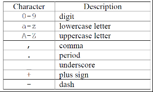
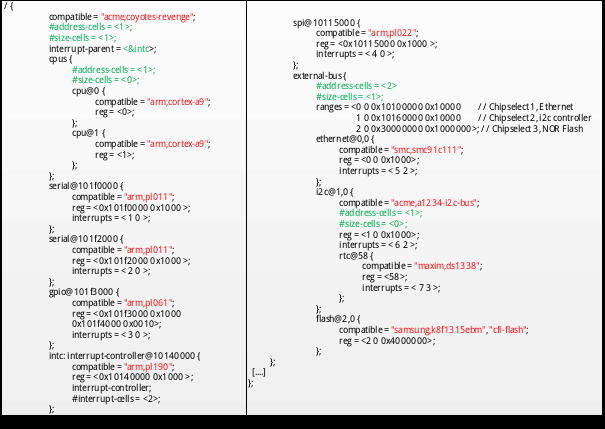
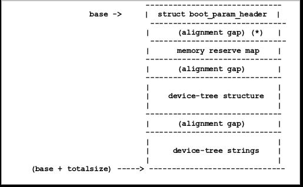
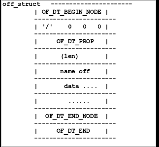
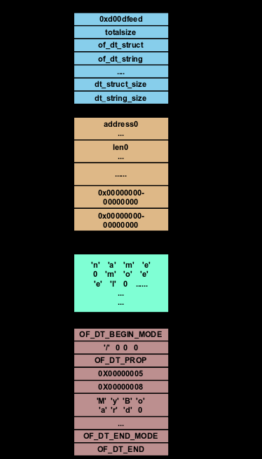

# 系统配置

:::info 文档说明

- **原始页数：** 69 页
- **文档版本：** 1.2
- **发布日期：** 2025-07-28
- **原始文件：** [查看或下载 PDF](/pdfs/T153MX/03-configuration-guide.pdf)

正文按原始 PDF 的文本层、书签层级和页面顺序转换，仅移除重复页眉、页脚与水印，不改写技术内容。

:::

<!-- PDF page 8 -->

## 1 概述

### 1.1 编写目的

介绍TinaLinux 的配置文件，配置方法。

### 1.2 适用范围

Tina V5.0 及其后续版本。

### 1.3 相关人员

适用于TinaLinux 平台的客户及相关技术人员。

<!-- PDF page 9 -->

## 2 menuconfig

Tina 采用Kconfig 机制，对SDK 和内核进行配置。

具体用法，可以参考Kconfig 机制的相关介绍。

### 2.1 文件系统配置文件

#### 2.1.1 openwrt构建

在Tina Linux SDK 的根目录下，执行make menuconfig 命令可进入Tina Linux 的(openWrt 软件包) 配置界面。

对于具体软件包：

```text
<*> (按y) ：表示该软件包将包含在固件中。
<M>(按m) ：表示该软件将会被编译，但不会包含在固件中。
< >(按n) ：表示该软件不会被编译。
```

配置文件保存在：

```text
openwrt/target/${ic}/${board}/defconfig
或
openwrt：target/${ic}/openwrt/${board}/defconfig
buildroot：target/${ic}/buildroot/${board}/defconfig
```

make menuconfig 修改后的文件，会保存回上述配置文件。

#### 2.1.2 buildroot构建

build.shbuildroot_menuconfig打开buildroot 配置界面

执行./build.sh buildroot_saveconfig 保存buildroot 配置

配置文件保存在：

buildroot/buildroot-202205/configs/XXX_defconfig

<!-- PDF page 10 -->

### 2.2 内核配置文件

#### 2.2.1 openwrt构建

Tina Linux SDK 的根目录下，对于openwrt，执行make kernel_menuconfig命令可进入对应内核的配置界面。

说明

1. 只有通过source & lunch 方式才可以使用make kernel_menuconfig 或者m kernel_menuconfig 进行配置2. 也可以通

过./build.sh menuconfig 进行配置

#### 2.2.2 buildroot构建

执行./build.sh menuconfig命令可进入对应内核的配置界面; ./build.sh saveconfig保存内核配置文件

保存后的内核配置文件在：

```text
如果是4.9,5.4内核：
device/config/chips/${chip}/configs/${borad}/linux-{kernel-version}/config-{kernel-version}
如果是5.10及之后的内核：
device/config/chips/${chip}/configs/${borad}/linux-{kernel-version}/bsp_defconfig
```

### 2.3 uboot配置文件

执行./build.sh uboot_menuconfig 命令可以进入uboot 配置界面；执行./build.sh uboot_saveconfig命令保存uboot 配置文件。

对于uboot2018，配置文件路径brandy/brandy-2.0/u-boot-2018/configs/xxx_defconfig；对于uboot2023，配置文件路径brandy/brandy-2.0/u-boot-bsp/configs/xxx_defconfig。

<!-- PDF page 11 -->

## 3 sysconfig

### 3.1 说明

#### 3.1.1 文档说明

- 描述GPIO 配置的形式：Port: 端口+ 组内序号。

- 文中的&lt;X&gt;=0,1,2,3,4,5…..，如twi0，twi1….；uart0，uart1….。

- 部分模块的配置项目可能是多余的，同时配置举例仅供参考，不一定为真实可用的，实际使用

时需向技术支持人员询问。

- 跟模块说明文档冲突的，以模块文档为准。

#### 3.1.2 配置文件路径

device/config/chips/$&#123;chip&#125;/configs/$&#123;borad&#125;/sys_config.fex

#### 3.1.3 注意事项

对于使用linux-5.4 及之后版本内核的方案要注意：

sys_config.fex 的作用主要是：打包阶段根据sys_config 配置更新boot0, uboot, optee 等bin 文件的头部等信息，例如更新dram 参数、uart 参数等。

修改sys_config.fex 之后，只需要执行pack 打包即可，无需再编译。

### 3.2 系统

#### 3.2.1 [product]

<!-- PDF page 12 -->

| 项 | 配置项含义 |
| --- | --- |
| version | 配置的版本号 |
| machine | 方案名字 |

示例：

```text
[product]
version
       = "100"
machine
         = "evb1"
```

#### 3.2.2 [platform]

| 配置项 | 配置项含义 |
| --- | --- |
| eraseflag | 量产时是否擦除。0：不擦，1：擦除（仅仅对量产工具，升级工具 |

无效），0x11：强制擦除(包括private 分区) 0x12：强制擦除(擦除private 分区及secure storage)。

示例：

```text
[platform]
eraseflag = 0
```

#### 3.2.3 [target]

| 配置项 | 配置项含义 |
| --- | --- |
| boot_clock | 启动CPU 频率; xx 表示多少MHz。部分平不支持；不建议修改； |

若修改了，需同时修改电压。

storage_type启动介质选择0:nand 1:sd 2:emmc 3:spinor 4:emmc3 5:spinand

6:sd1 -1:(defualt) 自动扫描启动介质。

burn_key支持DragonSN_V2.0 烧录sn 号。

技巧

目前nor 和其他介质不兼容，若为nor，请配置为3. 否则请配置为对应的介质或-1。

示例：

<!-- PDF page 13 -->

```text
[target]
boot_clock = 1008
e_type=-1
burn_key
         = 1
```

#### 3.2.4 [power_sply]

| 配置项配 | 置项含义 |
| --- | --- |
| dcdc&lt;X&gt;_vol d | cdc&lt;X&gt; 模块输出电压 |
| aldo&lt;X&gt;_vol a | ldo&lt;X&gt; 模块输出电压 |
| dc1sw_vol d | c1sw 模块输出电压 |
| dc5ldo_vol d | c5ldo 模块输出电压 |
| dldo&lt;X&gt;_vol d | ldo&lt;X&gt; 模块输出电压 |
| gpio&lt;X&gt;_vol g | pio&lt;X&gt; 的输出电压 |

示例：

```text
[power_sply]
dcdc1_vol
         = 1003300
dcdc2_vol
         = 1001160
dcdc3_vol
         = 1001100
dcdc4_vol
         = 1100
aldo1_vol
         = 2800
aldo2_vol
         = 1001500
aldo3_vol
         = 1003000
dc1sw_vol
          = 3000
dc5ldo_vol = 1100
dldo1_vol
         = 3300
dldo2_vol
         = 3300
dldo3_vol
         = 3300
dldo4_vol
         = 2500
eldo1_vol
         = 2800
eldo2_vol
         = 1500
eldo3_vol
         = 1200
_vol=3300
_vol=1800
```

补充说明：

电压名称= 100XXXX ：表示把该路电压设置为XXXX 指定的电压值，同时打开输出开关。

电压名称= 000XXXX ：表示把该路电压设置为XXXX 指定的电压值，同时关闭输出开关，当有需要时由内核驱动打开。

电压名称= 0 ：表示关闭该路电压输出开关，不修改原有的值。

<!-- PDF page 14 -->

这里的电压值单位为mV。

#### 3.2.5 [card_boot]

| 配置项 | 配置项含义 |
| --- | --- |
| logical_start | 启动卡逻辑起始扇区 |
| sprite_gpio0 | 卡量产gpio led 灯配置 |
| next_work | 卡量产完成后：1-不做任何动作，2-重启，3-关机，4-量产，5-正 |

常启动

示例：

```text
[card_boot]
logical_start = 40960
sprite_gpio0
           = port:PH21<1><default><default><default>
```

#### 3.2.6 [card0_boot_para]

| 项 | 配置项含义 |
| --- | --- |
| card_ctrl=0 | 卡量产相关的控制器选择0 |
| card_high_speed | 速度模式0 为低速，1 为高速 |
| card_line | 1，4，8 线卡可以选择，需看具体芯片是否支持 |
| sdc_clk | sdc 卡时钟信号的GPIO 配置 |
| sdc_cmd | sdc 命令信号的GPIO 配置 |
| sdc_d&lt;X&gt; | sdc 卡数据&lt;X&gt; 线信号的GPIO 配置 |

示例：

```text
[card0_boot_para]
card_ctrl
         = 0
card_high_speed = 1
card_line
          = 4
sdc_d1
         = port:PF0<2><1><2><default>
sdc_d0
         = port:PF1<2><1><2><default>
sdc_clk
         = port:PF2<2><1><2><default>
```

<!-- PDF page 15 -->

```text
sdc_cmd
          = port:PF3<2><1><2><default>
sdc_d3
         = port:PF4<2><1><2><default>
2=port:PF5<2><1><2><default>
```

#### 3.2.7 [card2_boot_para]

| 配置项 | 配置项含义 |  |  |
| --- | --- | --- | --- |
| card_ctrl=2 | 卡启动控制器选择2 |  |  |
| card_high_speed | 速度模式0 为低速，1 为高速 |  |  |
| _line | 1， | 4， | 8 线卡可以选择，需看具体芯片是否支持 |
| sdc_clk | sdc 卡时钟信号的GPIO 配置 |  |  |
| sdc_d&lt;X&gt; | sdc 卡数据&lt;X&gt; 线信号的GPIO 配置 |  |  |
| sdc_emmc_rst | sdc 卡rst 引脚 |  |  |

sdc_ex_dly_used

sdc_io_1v8

```text
[card2_boot_para]
card_ctrl
          = 2
card_high_speed = 1
card_line
          = 8
sdc_clk
          = port:PC7<3><1><3><default>
sdc_cmd
           = port:PC6<3><1><3><default>
sdc_d0
          = port:PC8<3><1><3><default>
sdc_d1
          = port:PC9<3><1><3><default>
sdc_d2
          = port:PC10<3><1><3><default>
sdc_d3
          = port:PC11<3><1><3><default>
sdc_d4
          = port:PC12<3><1><3><default>
sdc_d5
          = port:PC13<3><1><3><default>
sdc_d6
          = port:PC14<3><1><3><default>
sdc_d7
          = port:PC15<3><1><3><default>
mmc_rst=port:PC24<3><1><3><default>
sdc_ds
          = port:PC5<3><1><3><default>
sdc_ex_dly_used = 2
;sdc_io_1v8
            =
```

#### 3.2.8 [twi_para]

<!-- PDF page 16 -->

| 项 | 配置项含义 |
| --- | --- |
| twi_port | Boot 的twi 控制器编号 |
| twi_scl | Boot 的twi 的时钟的GPIO 配置 |
| twi_sda | Boot 的twi 的数据的GPIO 配置 |
| twi_regulator | 上拉配置 |

示例：

```text
[twi_para]
ort=0
twi_scl
       = port:PB0<2><default><default><default>
twi_sda
       = port:PB1<2><default><default><default>
```

#### 3.2.9 [uart_para]

| 配置项 | 配置项含义 |  |
| --- | --- | --- |
| uart_debug_port | Boot 串口控制器编号 |  |
| _debug_tx | Boot 串口发送的GPIO | 配置 |
| uart_debug_rx | Boot 串口接收的GPIO 配置 |  |
| uart_regulator | 上拉配置 |  |

示例：

```text
[uart_para]
uart_debug_port = 0
uart_debug_tx = port:PF02<3><1><default><default>
uart_debug_rx = port:PF04<3><1><default><default>
```

#### 3.2.10 [jtag_para]

| 配置项 | 配置项含义 |
| --- | --- |
| jtag_enable | JTAG 使能 |
| jtag_ms | 测试模式选择输入(TMS) 的GPIO 配置 |

<!-- PDF page 17 -->

| 项 | 配置项含义 |
| --- | --- |
| jtag_ck | 测试时钟输入(TMS) 的GPIO 配置 |
| jtag_do | 测试数据输出(TDO) 的GPIO 配置 |
| jtag_di | 测试数据输入（TDI）的GPIO 配置 |

示例：

```text
[jtag_para]
jtag_enable = 1
jtag_ms
        = port:PB14<3><default><default><default>
k=port:PB15<3><default><default><default>
jtag_do
        = port:PB16<3><default><default><default>
jtag_di
       = port:PB17<3><default><default><default>
```

### 3.3 DRAM

#### 3.3.1 [dram_para]

| 配置项 | 配置项含义 |
| --- | --- |
| dram_clk | DRAM 的时钟频率，单位为MHz; 它为24 的整数倍，最低不得低于 |

120

| dram_type | DRAM 类型：2 为DDR2，3 为DDR3 |
| --- | --- |
| dram_zq | DRAM 控制器内部参数，由原厂来进行调节，请勿修改 |
| dram_odt_en | ODT 是否需要使能0：不使能1：使能，一般情况下，为了省电， |

此项为0

| dram_para1 | DRAM 控制器内部参数，由原厂来进行调节，请勿修改 |
| --- | --- |
| dram_para2 | DRAM 控制器内部参数，由原厂来进行调节，请勿修改 |
| dram_mr0 | DRAM CAS 值，可为6，7，8，9；具体需根据DRAM 的规格书和 |

速度来确定

dram_mr&lt;X&gt;DRAM 控制器内部参数，由原厂来进行调节，请勿修改

示例：

<!-- PDF page 18 -->

```text
[dram_para]
dram_clk
         = 648
dram_type = 7
dram_zq
         = 0x3b3bfb
dram_odt_en = 0x31
dram_para1 = 0x10e410e4
dram_para2 = 0x1000
dram_mr0
          = 0x1840
dram_mr1
          = 0x40
dram_mr2
          = 0x18
dram_mr3
          = 0x2
dram_tpr0 = 0x0048A192
dram_tpr1 = 0x01b1a94b
dram_tpr2 = 0x00061043
dram_tpr3 = 0xB47D7D96
dram_tpr4 = 0x0000
dram_tpr5 = 0x198
_tpr6=0x21000000
dram_tpr7 = 0x2406C1E0
dram_tpr8 = 0x0
dram_tpr9 = 0
dram_tpr10 = 0x0008
dram_tpr11 = 0x44450000
dram_tpr12 = 0x9777
dram_tpr13 = 0x4090950
```

<!-- PDF page 19 -->

## 4 设备树介绍

### 4.1 Device tree介绍

ARM Linux 中，arch/arm/mach-xxx 中充斥着大量描述板级细节的代码，而这些板级细节对于内核来讲，就是垃圾，如板上的platform 设备、resource、i2c_board_info、spi_board_info 以及

硬件的platform_data

内核社区为了改变这个局面，引用了PowerPC 等其他体系结构下已经使用的Flattened Device Tree(FDT)。采用Device Tree 后，许多硬件的细节可以直接透过它传递给Linux，而不再需要在kernel 中进行大量的冗余编码。

Device Tree 是一种描述硬件的数据结构，它表现为一颗由电路板上cpu、总线、设备组成的树，Device Tree 由一系列被命名的结点(node) 和属性(property) 组成，而结点本身可包含子结点。所谓属性，其实就是成对出现的name 和value。在Device Tree 中，可描述的信息包括：

- CPU 的数量和类别

存基地址和大小

- 总线

- 外设

- 中断控制器

- GPIO 控制器

- Clock 控制器

Bootloader 会将这棵树传递给内核，内核可以识别这棵树，并根据它展开出Linux 内核中的plat-form_device、i2c_client、spi_device 等设备，而这些设备用到的内存、IRQ 等资源，也会通过dtb 传递给了内核，内核会将这些资源绑定给展开的相应的设备。

etree 牵扯的东西还是比较多的，对devicetree的理解，可以分为5 个步骤：

1. 用于描述硬件设备信息的文本格式，如dts/dtsi。

2. 认识DTC 工具。

3. Bootloader 怎么把二进制文件写入到指定的内存位置。

4. 内核时如何展开文件，获取硬件设备信息。

5. 设备驱动如何使用。

<!-- PDF page 20 -->

### 4.2 Device tree source file

.dts 文件是一种ASCII 文本格式的Device Tree 描述，在ARM Linux 中，一个.dts 文件对应一个ARM 的machine。* ARMv7 架构下，dts 文件放置在内核的arch/arm/boot/dts/目录。* ARMv8架构下，dts 文件放置在内核的arch/arm64/boot/dts/目录。* RISCV 架构下，dts 文件放置在内核的arch/riscv/boot/dts/目录。

由于一个SoC 可能对应多个machine（一个SoC 可以对应多个产品和电路板），势必这些.dts 文件需包含许多共同的部分。Linux 内核为了简化，把SoC 公用的部分或者多个machine 共同的部分一般提炼为.dtsi，类似于C 语言的头文件，其他的machine 对应的.dts 就include 这个.dtsi。

设备树是一个包含节点和属性的简单树状结构。属性就是键－值对，而节点可以同时包含属性和

点。例如，以下就是一个.dts 格式的简单树：


*图4-1: dts 简单树示例*

这棵树显然是没什么用的，因为它并没有描述任何东西，但它确实体现了节点的一些属性：

个单独的根节点：“/”。

2. 两个子节点：“node1” 和“node2”。

3. 两个node1 的子节点：“child-node1” 和“child-node2”。

4. 一堆分散在树里的属性。

属性是简单的键－值对，它的值可以为空或者包含一个任意字节流。虽然数据类型并没有编码进数据结构，但在设备树源文件中仍有几个基本的数据表示形式。

1. 文本字符串（无结束符）可以用双引号表示：a-string-property=”hello world”。

<!-- PDF page 21 -->

2. 二进制数据用方括号限定。

3. 不同表示形式的数据可以使用逗号连在一起。

4. 逗号也可用于创建字符串列表：a-string-list-property=”first string”,”second string”。

#### 4.2.1 Device tree 结构约定

##### 4.2.1.1 节点名称(node names)

规范：device tree 中每个节点的命名必须遵从一下规范：node-name@unit-address

详注：

1. node-name：节点的名称，小于31 字符长度的字符串，可以包括图中所示字符。节点名称的

首字符必须是英文字母，可大写或者小写。通常，节点的命名应该根据它所体现的是什么样的设备。


*图4-2: 节点名称支持字符*

2. @unit-address：如果该节点描述的设备有一个地址，则应该加上设备地址（unit-address）。

通常，设备地址就是用来访问该设备的主地址，并且该地址也在节点的reg 属性中列出。

3. 同级节点命名必须是唯一的，但只要地址不同，多个节点也可以使用一样的通用名称（例如

serial@101f1000 和serial@101f2000）。

节点没有node-name或者unit-address，它通过“/” 来识别。

实例

<!-- PDF page 22 -->


*图4-3: 节点名称规范示例*

在实例中，一个根节点/下有3 个子节点；节点名称为cpu 的节点，通过地址0 和1 来区别；节点名称为ethernet 的节点，通过地址fe001000 和fe002000 来区别。

##### 4.2.1.2 路径名称(path names)

在device tree 中唯一识别节点的另一个方法，通过给节点指定从根节点到该节点的完整路径。

device tree 中约定了完整路径表达方式：

-name-1/node-name-2/.../node-name-N

实例：

如图2-3 节点名称规范示例，

指定根节点路径：/

指定cpu#1 的完整路径：/cpus/cpu@1

指定ethernet#fe002000：/cpus/ethernet@fe002000

说明

注：如果完整的路径可以明确表示我们所需的节点，那么unit-address 可以省略

##### 4.2.1.3 属性(properties)

Device tree 中，节点可以用属性来描述该节点的特征，属性由两个部分组成：名称和值。

属性名称(property names)

由长度小于31 的字符串组成。属性名称支持的字符如下图：

<!-- PDF page 23 -->



*图4-4: 属性名称支持字符*

准的属性名称，需要指定一个唯一的前缀，用来识别是哪个公司或者机构定义了该属性。

例如：

```text
fsl,channel-fifo-len 29
　ibm,ppc-interrupt-server#s 30
　linux,network-index
```

属性值(property values)

属性值是一个包含属性相关信息的数组，数组可能有0 个或者多个字节。

当属性是为了传递真伪信息时，属性值可能为空值，这个时候，属性值的存在或者不存在，就已经足够描述属性的相关信息了。

| value | description |
| --- | --- |
| &lt;empty&gt; | 属性表达真伪信息，判断值有没有存在就可以识别 |
| &lt;u32&gt; | 大端格式的32 位整数. 例如：值0x11223344 ，则address 11; |

address+1 22; address+2 33; address+3 44;

&lt;u64&gt;大端格式的64 位整数，有两个&lt;u32&gt; 组成。第一&lt;u32&gt; 表示高

位，第二&lt;u32&gt; 表示地位。例如，0x1122334455667788 由两个单元组成&lt;0x11223344,0x55667788&gt; address 11 address+1 22 address+2 33 address+3 44 address+4 55 address+5 66

address+677address+788

&lt;string&gt;字符串可打印，并且有终结符。例如：“hello” address 68

address+1 65 address+2 6c address+3 6c address+4 6f address+5 00

| &lt;prop-encoded-array&gt; | 跟特定的属性有关 |
| --- | --- |
| &lt;phandle&gt; | 一个&lt;u32&gt; 值，phandle 值提供了一种引用设备树中其他节点的 |

方法。通过定义phandle 属性值，任何节点都可以被其他节点引用。

<!-- PDF page 24 -->

| e | description |
| --- | --- |
| &lt;stringlist&gt; | 由一系列&lt;string&gt; 值串连在一起，例如”hello”,”world”. |

address 68 address+1 65 address+2 6C address+3 6C address+4 6F address+5 00 address+6 77 address+7 6F address+8 72 address+9 6C address+10 64 address+11 00

##### 4.2.1.4 标准属性类型

Compatible

```dts
1. 属性：compatible
2. 值类型：<stringlist>
3. 说明：
 树中每个表示一个设备的节点都需要一个compatible 属性。
 compatible 属性是操作系统用来决定使用哪个设备驱动来绑定到一个设备上的关键因素。
 compatible 是一个字符串列表，之中第一个字符串指定了这个节点所表示的确切的设备，该字符串的格式为：
   “<制造商>,<型号>”
 剩下的字符串的则表示其它与之相兼容的设备。
 例如：compatible = “fsl,mpc8641-uart”, “ns16550";
 系统首先会查找跟fsl,mpc8641-uart相匹配的驱动，如果找不到，就找更通用的，跟ns16550相匹配的驱动。
```

Model

```text
1. 属性：model
2. 值类型：<string>
3. 说明：
 model 属性值是<string>,该值指定了设备的型号。推荐的使用形式如下：
 “manufacturer，model”
 其中，字符manufacturer表示厂商的名称，字符model表示设备的型号。
 例如：model = “fsl,MPC8349EMITX”;
```

Phandle

```text
1. 属性：phandle
2. 值类型：<u32>
3. 说明：
device tree 中，定义了phandle属性，它是一个u32的值。
每个节点都可以拥有一个相关的phandle，通过它的值来唯一标识。(实际实现中常采用指针或者偏移)。
phandle 常用于查询或者遍历设备树，也有用于指向设备树中的其它节点。
例如，在设备树中，pic节点如下所示：
c@10000000{
    phandle = <1>;
    interrupt-controller;
   };
定义pic节点的phandle 为1，那么其他设备节点引用pic节点时，只需要在本节点中添加：
```

interrupt-parent = &lt;1&gt;;

Status

```text
1. 属性：status
2. 值类型：<string>
3. 说明：
```

<!-- PDF page 25 -->

该属性指明设备的运行状态，见表格

| value | description |
| --- | --- |
| “okay” | 表明设备可运行。 |
| “disabled” | 表明设备当前不可运行，但条件满足，它还是可以运行的。 |
| “fail” | 表明设备不可运行，设备产生严重错误，如果不修复，将一直不 |

可运行。

“fail-sss”表明设备不可运行，设备产生严重错误，如果不修复，将一直不

可运行.sss 部分特定设备相关，指明错误检测条件。

\\#address-cells 和#size-cells

```text
1.属性：#address-cells，#size-cells
2.值类型：<u32>
3.说明：
 #address-cells 和#size-cells 属性常备用在拥有孩子节点的父节点上，用来描述孩子节点时如何编址的。
 父结点的#address-cells 和#size-cells 分别决定了子结点的reg 属性的address 和length 字段的长度。
 例如：
```



*图4-5: address-cells 和size-cells 示例*

<!-- PDF page 26 -->

```text
root 结点的#address-cells = <1>和#size-cells =<1>;
决定了serial、gpio、spi 等结点的address 和length 字段的长度分别为1。
cpus 结点的#address-cells = <1>和#size-cells = <0>;
决定了2 个cpu 子结点的address 为1，而length 为空，于是形成了2 个cpu 的reg = <0>和reg = <1>。
external-bus 结点的#address-cells = <2>和#size-cells = <1>;
决定了其下的ethernet、i2c、flash 的reg 字段形如reg = <0 0 0x1000>;reg = <1 0 0x1000>和reg = <2 0 0x4000000>。
其中，address字段长度为0，开始的第1个cell（0、1、2）是对应的片选，第2 个cell（0，0，0）是相对该片选的基地址，
第3 个cell（0x1000、0x1000、0x4000000）为length。
特别要留意的是i2c 结点中定义的#addresscells= <1>和#size-cells = <0>;
又作用到了I2C 总线上连接的RTC，它的address 字段为0x58，是设备的I2C 地址。
```

Reg

```text
1. 属性：reg
类型：<address1length1[address2length2][address3length3]...>
3. 说明
 reg 属性描述了设备拥有资源的地址信息，其中的每一组address length 表明了设备使用的一个地址范围。
 address 为1 个或多个32 位的整型（即cell），而length 则为cell 的列表或者为空（若#size-cells = 0）。
 address 和length 字段是可变长的，父结点的#address-cells 和#size-cells
 分别决定了子结点的reg 属性的address 和length 字段的长度。
```

Virtual-reg

```text
1. 属性：virtual-reg
2. 值类型：<u32>
3. 说明：virutal-reg 属性指定一个有效的地址映射到物理地址。
```

Ranges

```text
1. 属性：ranges
2. 值类型：<empty>或者<prop-encoded-array>
3. 说明：
 前边reg属性说明中，我们已经知道如何给设备分配地址，但目前来说这些地址还只是设备节点的本地地址，
 我们还没有描述如何将这些地址映射成CPU 可使用的地址。
 根节点始终描述的是CPU 视角的地址空间。根节点的子节点已经使用的是CPU 的地址域，
 所以它们不需要任何直接映射。例如，serial@101f0000 设备就是直接分配的0x101f0000 地址。
 那些非根节点直接子节点的节点就没有使用CPU 地址域。为了得到一个内存映射地址，
 设备树必须指定从一个域到另一个域地址转换的方法，而ranges 属性就为此而生。
 还以图2-5的设备数来分析：
   ranges = < 0 0 0x10100000 0x10000
                    // Chipselect 1，Ethernet
       1 0 0x10160000 0x10000
                    // Chipselect 2，i2c controller
       2 0 0x30000000 0x1000000 >; // Chipselect 3，NOR Flash
 ranges 是一个地址转换列表。ranges 表中的每一项都是一个包含子地址、父地址和在子地址空间中区域大小的元组。
字段的值都取决于子节点的
ddress-cells 、父节点的#address-cells
和子节点的#size-cells。
 以本例中的外部总线来说，子地址是#address-cells是2、父地址#address-cells是1 、区域大小#size-cells 是1。
 那么三个ranges 被翻译为：
 从片选0 开始的偏移量0 被映射为地址范围：0x10100000..0x1010ffff
 从片选0 开始的偏移量1 被映射为地址范围：0x10160000..0x1016ffff
 从片选0 开始的偏移量2 被映射为地址范围：0x30000000..0x10000000
 另外，如果父地址空间和子地址空间是相同的，那么该节点可以添加一个空的range 属性。
 一个空的range 属性意味着子地址将被1:1 映射到父地址空间。
```

<!-- PDF page 27 -->

#### 4.2.2 常用节点类型

所有device tree 都必须拥有一个根节点，还必须在根节点下边有以下的节点：

1. CPU 节点

2. Memory 节点

##### 4.2.2.1 根节点(root node)

设备树都必须有一个根节点，树中其它的节点都是根节点的后代，根节点的完整路径是/。

点具有如下属性：

| 属性名称 | 需要使用 | 属性值类型 | 定义 |
| --- | --- | --- | --- |
| #address-cells | 需要 | &lt;u32&gt; | 表示子节点寄存器属性中的地址 |
| #size-cells | 需要 | &lt;u32&gt; | 表示子节点寄存器属性中的大小 |
| model | 需要 | &lt;string&gt; | 指定一个字符串用来识别不同板子 |
| compatible | 需要 | &lt;stringlist&gt; | 指定平台的兼容列表 |
| pr-version | 需要 | &lt;string&gt; | 这个属性必须包含下边字符串 |

“ePAPR-&lt;ePAPR version&gt;” 其中，&lt;ePAPR version&gt; 是平台遵从的PAPR规范版本号，例如：Epapr-version =”ePAPR-1.1”

##### 4.2.2.2 别名节点(aliases node)

Device tree 中采用别名节点来定义设备节点全路径的别名，别名节点必须是根节点的孩子，而且还必须采用aliases 的节点名称。

/aliases 节点中每个属性定义了一个别名，属性的名字指定了别名，属性值指定了devicetree 中设备节点的完整路径。例如：

```text
serial0 = “/simple-bus@fe000000/serial@llc500”
```

指定该路径下serial@llc500 设备节点全路径的别名为serial0。当用户想知道的只是“那个设备是serial” 时，这样的全路径就会变得很冗长，采用aliases 节点指定一个设备节点全路径的别名，好处就在这个时候体现出来了。

<!-- PDF page 28 -->

##### 4.2.2.3 内存节点(memory node)

ePAPR 规范中指定了内存节点是device tree 中必须的节点。内存节点描绘了系统物理内存的信息，如果系统中有多个内存范围，那么device tree 中可能会创建多个内存节点，或者在一个单独的内存节点中通过reg 属性指定内存的范围。节点的名称必须是memory。

内存节点属性如下：

| 属性名称 | 是否使用 | 值类型 | 定义 |
| --- | --- | --- | --- |
| Device_type | 需要 | &lt;string&gt; | 属性值必须为” |

memory”

需要&lt;prop-encoded-array&gt;包含任意数量的用来指示

地址和地址空间大小的对

Initial-mapped-area可选择&lt;prop-encoded-array&gt;指定初始映射区的内存地

址和地址空间的大小

假设一个64 位系统具有以下的物理内存块：

1. RAM：起始地址0x0，长度0x80000000(2GB)

2. RAM：起始地址0x100000000，长度0x100000000(4GB)

内存节点的定义可以采用以下方式，假设#address-cells =2，#size-cells =2。

方式1：

```text
memory@0 {
 device_type = "memory";
 reg = < 0x000000000 0x00000000 0x00000000 0x80000000
      0x000000001 0x00000000 0x00000001 0x00000000>;
};
```

方式2：

```text
memory@0 {
ce_type="memory";
 reg = < 0x000000000 0x00000000 0x00000000 0x80000000>;
};
memory@100000000 {
 device_type = "memory";
 reg = < 0x000000001 0x00000000 0x00000001 0x00000000>;
};
```

<!-- PDF page 29 -->

##### 4.2.2.4 chosen 节点

chosen 节点并不代表一个真正的设备，只是作为一个为固件和操作系统之间传递数据的地方，比如引导参数。chosen 节点里的数据也不代表硬件。通常，chosen 节点在.dts 源文件中为空，并在启动时填充。它必须是根节点的孩子。节点属性如下：

| 属性名称 | 是否使用 | 值类型 | 定义 |
| --- | --- | --- | --- |
| bootargs | 可选择 | &lt;string&gt; | 为用户指定boot 参数 |
| Stdout-path | 可选择 | &lt;string&gt; | 指定boot 控制台输出路径 |
| Stdin-path | 可选择 | &lt;string&gt; | 指定boot 控制台输入路径 |

例子：

```text
chosen {
 bootargs = "root=/dev/nfs rw nfsroot=192.168.1.1 console=ttyS0,115200";
};
```

##### 4.2.2.5 cpus 节点

ePAPR 规范指定cpus 节点是device tree 中必须的节点，它并不代表系统中真实设备，可以理解

| 节点仅作为存放子节点 | cpu 的一个容器。节点属性如下： |  |
| --- | --- | --- |
| 属性名称 | 是否使用 | 值类型 |
| #address-cells | 必须 | &lt;u32&gt; |
| #size-cells | 必须 | &lt;u32&gt; |

##### 4.2.2.6 cpu节点

Devicetree 中每一个cpu 节点描述一个具体的硬件执行单元。每个cpu 节点的compatible属性是一个“,” 形式的字符串，并指定了确切的cpu，就像顶层的compatible 属性一样。如果系统的cpu 拓扑结构很复杂，还必须在binding 文档中详细说明。

cpu 节点所拥有的属性：

<!-- PDF page 30 -->

| 名称 | 是否使用值类型 | 定义 |  |
| --- | --- | --- | --- |
| Device_type | 必须 | &lt;string&gt; | 属性值必须是“cpu” 的 |

字符串

| reg | 必须 | &lt;prop-encoded-array&gt; | 定义cpu/thread id |
| --- | --- | --- | --- |
| Clock-frequency | 必须 | &lt;prop-encodec-array&gt; | 指定cpu 的时钟频率 |

Timebase-

必须&lt;prop-encoded-array&gt;指定当前timebase 的是

frequency

时钟频率信息

status&lt;u32&gt;描述cpu 的状态okay/

disabled

ble-method&lt;stringlist&gt;指定了cpu从disabled 状

态到enabled 的方式

Mmu-type可选&lt;string&gt;指定cpu mmu 的类型

cpu 节点实例：

```text
cpus {
 #address-cells = <1>;
 #size-cells = <0>;
 cpu@0 {
   device_type = "cpu";
mpatible="arm,cortex-a8";
   reg = <0x0>;
 };
};
```

##### 4.2.2.7 soc节点

这个节点用来表示一个系统级芯片（soc），如果处理器就是一个系统级芯片，那么这个节点就必须包含，soc 节点的顶层包含soc 上所有设备可见的信息。

节点名字必须包含soc 的地址并且以”soc” 字符开头。

```dts
soc@01c20000 {
   compatible = "simple-bus";
   #address-cells = <1>;
   #size-cells = <1>;
   reg = <0x01c20000 0x300000>;
   ranges;
   intc: interrupt-controller@01c20400 {
    compatible = "allwinner,sun4i-ic";
    reg = <0x01c20400 0x400>;
```

<!-- PDF page 31 -->

```text
interrupt-controller;
#interrupt-cells = <1>;
```

```dts
pio: pinctrl@01c20800 {
    compatible = "allwinner,sun5i-a13-pinctrl";
    reg = <0x01c20800 0x400>;
    interrupts = <28>;
    clocks = <&apb0_gates 5>;
    gpio-controller;
    interrupt-controller;
    #address-cells = <1>;
    #size-cells = <0>;
    #gpio-cells = <3>;
    uart1_pins_a: uart1@0 {
      allwinner,pins = "PE10", "PE11";
allwinner,function="uart1";
      allwinner,drive = <0>;
      allwinner,pull = <0>;
    };
    .........
}
```

#### 4.2.3 Binding

对于Device Tree 中的结点和属性具体是如何来描述设备的硬件细节的，一般需要文档来进行讲解，这些文档位于内核的Documentation/devicetree/bindings/arm 路径下。

### 4.3 Device tree block file

#### 4.3.1 DTC (device tree compiler)

将.dts 编译为.dtb 的工具。DTC 的源代码位于内核的scripts/dtc 目录，在Linux 内核使能了De-vice Tree 的情况下，编译内核时同时会编译dtc。通过scripts/dtc/Makefile 中的“hostprogs-y:= dtc” 这一hostprogs 编译target。

在Linux 内核的arch/arm/boot/dts/Makefile 中，描述了当某个SoC 被选中后，哪些.dtb 文件会

译出来，如与sunxi应的.dtb 包括

dtb-$(CONFIG_ARCH_SUN8IW20) += \\

board.dtb

<!-- PDF page 32 -->

#### 4.3.2 Device Tree Blob (.dtb)

.dtb 是.dts 被DTC 编译后的二进制格式的Device Tree 描述，可由Linux 内核解析。通常在我们为电路板制作NAND、SD 启动image 时，会为.dtb 文件单独留下一个很小的区域以存放之，之后bootloader 在引导kernel 的过程中，会先读取该.dtb 到内存。

#### 4.3.3 DTB的内存布局

Device tree block 内存布局大致如下(地址从上往下递增)。我们可以看到，dtb 文件结构主要由4个部分组成，一个小的文件头、一个memory reserve map、一个device tree structure 、一个

e-treestrings。这几个部分构成一个整体，一起加载到内存中。



*图4-6: dtb 内存布局*

##### 4.3.3.1 文件头-boot_param_header

的物理指针指向的内存区域在structureboot_param_header这个结构体中大概描述到了：

include/linux/of_fdt.h

```text
/* Definitions used by the flattened device tree */
#define OF_DT_HEADER
                    0xd00dfeed /* marker */
#define OF_DT_BEGIN_NODE
                    0x1
                    /* Start of node, full name */
#define OF_DT_END_NODE
                    0x2
                    /* End node */
#define OF_DT_PROP
                   0x3
                    /* Property: name off, size,* content */
#define OF_DT_NOP
                  0x4
                    /* nop */
#define OF_DT_END
                  0x9
#define OF_DT_VERSION
                    0x10
```

<!-- PDF page 33 -->

```text
struct boot_param_header {
 __be32 magic;
                    /* magic word OF_DT_HEADER */
 __be32 totalsize;
                   /* total size of DT block */
 __be32 off_dt_struct;
                    /* offset to structure */
 __be32 off_dt_strings;
                    /* offset to strings */
 __be32 off_mem_rsvmap;
                    /* offset to memory reserve map */
 __be32 version;
                    /* format version */
 __be32 last_comp_version;
                    /* last compatible version */
 /* version 2 fields below */
 __be32 boot_cpuid_phys;
                    /* Physical CPU id we're booting on */
 /* version 3 fields below */
 __be32 dt_strings_size;
                    /* size of the DT strings block */
 /* version 17 fields below */
 __be32 dt_struct_size;
                    /* size of the DT structure block */
};
```

这个结构体怎么用，在后边会有具体描述。

##### 4.3.3.2 device-tree structure

这一部分主要存储了各个结点的信息。每一个结点都都可以嵌套子结点，其中的结点以OF_DT_BEGIN_NODE 做起始标志，接下来就是结点名。如果结点带有属性，那么就紧接就是结点的属性，其以OF_DT_PROP 为起始标志。嵌套的子结点紧跟着父子结点之后，也是以OF_DT_BEGIN_NODE 起始。OF_DT_END_NODE 标志着一结点的终止。



*图4-7: device-tree 的structure 结构*

上面提到一个结点的属性，每一个属性有如下的结构：

```text
Scripts/dtc/libfdt/fdt.h
struct fdt_property {
   uint32_t tag;
   uint32_t len;
```

<!-- PDF page 34 -->

```text
uint32_t nameoff;
char data[0];
```

##### 4.3.3.3 Device tree string

最后一部分就是String，没有固定格式。其主要是把一些公共的字符串线性排布，以节约空间。

<!-- PDF page 35 -->

##### 4.3.3.4 dtb 实例



*图4-8: dtb 实例*

可以看出dtb 结构由4 个部分组成。

memory reserve table：给出了kernel 不能使用的内存区域列表。

Of_device-struct：结构包含了device tree 的属性。每个节点以OF_DT_BEGIN_NODE 标签开始，接着紧跟着节点的名称。如果节点有属性，那么紧跟着就是节点的属性，每个属性值以OF_DT_PROP 标签开始，紧接着是嵌套在节点中的子节点，子节点也是以OF_DT_BEGIN_NODE起始，以OF_DT_END_NODE 结束，最后以标签OF_DT_END 标示根节点结束。

<!-- PDF page 36 -->

对每个属性，在标签OF_DT_PROP 之后，由一个32 位的数指明属性名称存放在偏移of_dt_string

结构体起始地址多少byte 的地方。之所以采用这种做法，是因为有很多节点都有很多相同的属性名称，比如compatible、reg 等，这些节点的名称如果一个个存放起来，显然挺浪费空间的，采用一个偏移量，来指定它在of_dt_string 的哪个地方，在of_dt_string 中只需要保存一份属性值就可以了，有利于降低block 占用的空间。

### 4.4 内核常用API

#### 4.4.1 of_device_is_compatible

int of_device_is_compatible(const struct device_node *device,const char *compat);

函数作用

判断设备结点的compatible 属性是否包含compat 指定的字符串。当一个驱动支持2 个或多个设备的时候，这些不同.dts 文件中设备的compatible 属性都会进入驱动OF 匹配表。因此驱动可以透过Bootloader 传递给内核的Device Tree 中的真正结点的compatible 属性以确定究竟是哪一种设备，从而根据不同的设备类型进行不同的处理。

#### 4.4.2 of_find_compatible_node

原型

struct device_node *of_find_compatible_node(struct device_node *from,

const char *type, const char *compatible);

函数作用

根据compatible 属性，获得设备结点。遍历Device Tree 中所有的设备结点，看看哪个结点的类型、compatible 属性与本函数的输入参数匹配，大多数情况下，from、type 为NULL。

#### 4.4.3 of_property_read_u32_array

原型

int of_property_read_u8_array(const struct device_node *np,

```c
const char *propname, u8 *out_values, size_t sz);
int of_property_read_u16_array(const struct device_node *np,
    const char *propname, u16 *out_values, size_t sz);
int of_property_read_u32_array(const struct device_node *np,
    const char *propname, u32 *out_values, size_t sz);
int of_property_read_u64(const struct device_node *np,
```

<!-- PDF page 37 -->

const char *propname, u64 *out_value);

作用

读取设备结点np 的属性名为propname，类型为8、16、32、64 位整型数组的属性。对于32 位处理器来讲，最常用的是of_property_read_u32_array()。

#### 4.4.4 of_property_read_string

原型

int of_property_read_string(struct device_node *np,

```text
const char *propname, const char **out_string);
property_read_string_index(structdevice_node*np,
```

const char *propname, int index, const char **output);

函数作用

前者读取字符串属性，后者读取字符串数组属性中的第index 个字符串。

#### 4.4.5 bool of_property_read_bool

原型

```text
static inline bool of_property_read_bool(const struct device_node *np,
constchar*propname);
```

函数作用

如果设备结点np 含有propname 属性，则返回true，否则返回false。一般用于检查空属性是否存在。

#### 4.4.6 of_iomap

原型

void __iomem *of_iomap(struct device_node *node, int index);

函数作用

通过设备结点直接进行设备内存区间的ioremap()，index 是内存段的索引。若设备结点的reg 属性有多段，可通过index 标示要ioremap 的是哪一段，只有1 段的情况，index 为0。采用Device Tree 后，大量的设备驱动通过of_iomap() 进行映射，而不再通过传统的ioremap。

<!-- PDF page 38 -->

#### 4.4.7 irq_of_parse_and_map

原型

unsigned int irq_of_parse_and_map(struct device_node *dev, int index);

函数作用

透过Device Tree 或者设备的中断号，实际上是从.dts 中的interrupts 属性解析出中断号。若设备使用了多个中断，index 指定中断的索引号。

### 4.5 Device tree 配置demo

以pinctrl 为例：

```dts
soc@01c20000 {
   compatible = "simple-bus";
   #address-cells = <1>;
   #size-cells = <1>;
   ranges;
   pio: pinctrl@01c20800 {
    compatible = "allwinner,sun50i-pinctrl";
    reg = <0x01c20800 0x400>;
    interrupts = <0 11 1>, <0 15 1>, <0 16 1>, <0 17 1>;
    clocks = <&apb1_gates 5>;
    gpio-controller;
    interrupt-controller;
    #address-cells = <1>;
    #size-cells = <0>;
    #gpio-cells = <6>;
    uart0_pins_a: uart0@0 {
      allwinner,pins = "PH20", "PH21"; //设备需要用到的pin
      allwinner,function = "uart0";
                    //复用名字
      allwinner,drive = <0>;
                    //设置驱动力
      allwinner,pull = <0>;
                    //设置上下拉
      allwinner,data=<0>;
                    //设置数据属性
    };
   };
};
```

<!-- PDF page 39 -->

## 5 设备树使用

### 5.1 引言

#### 5.1.1 编写目的

介绍DeviceTree 配置、设备驱动如何获取DeviceTree配置信息等内容，让用户明确掌握Device Tree 配置与使用方法。

#### 5.1.2 术语与缩略语

| 术语/缩略语 | 解释说明 |
| --- | --- |
| DTS | Device Tree Source File，设备树源码文件 |
| DeviceTreeBlobFile | ，设备树二进制文件 |
| sys_config.fex | Allwinner 配置文件 |

### 5.2 模块介绍

Device Tree 是一种描述硬件的数据结构，可以把嵌入式系统资源抽象成一颗树形结构，可以直观查看系统资源分布；内核可以识别这棵树，并根据它展开出Linux 内核中的platform_device 等。

#### 5.2.1 模块功能介绍

Device Tree 改变了原来用hardcode 方式将HW 配置信息嵌入到内核代码的方法，消除了arch/arm64 下大量的冗余编码。使得各个厂商可以更专注于driver 开发，开发流程遵从mainline ker-nel 的规范。

#### 5.2.2 相关术语介绍

<!-- PDF page 40 -->

| /缩略语 | 解释说明 |
| --- | --- |
| FDT | 嵌入式PowerPC 中，为了适应内核发展&& 嵌入式PowerPC 平 |

台的千变万化，推出了Standard for Embedded Power Architecture Platform Requirements（ePAPR）标准，吸收了Open Firmware 的优点，在U-boot 引入了扁平设备树FDT 接口，使用一个单独的FDT blob 对象将系统硬件信息传递给内核。

DTS device tree 源文件，包含用户配置信息。对于32bit Arm 架构，

dts 文件存放在arch/arm/boot/dts 路径下。对于64bit Arm 架构，dts 文件存放在arch/arm64/boot/dts 路径下。对于

Tina3.5.1 及之后版本，会使用device 目录下的board.dts，即

device/config/chips/chip/configs/&#123;borad&#125;/board.dts。

DTB DTS 被DTC 编译后二进制格式的Device Tree 描述，可由Linux

内核解析，并为设备驱动提供硬件配置信息。

### 5.3 如何配置

#### 5.3.1 配置文件位置

树文件，存放在具体内核的目录下。

- ARMv7 架构下，dts 文件放置在内核的arch/arm/boot/dts/目录。

- ARMv8 架构下，dts 文件放置在内核的arch/arm64/boot/dts/目录。

- RISCV 架构下，dts 文件放置在内核的arch/riscv/boot/dts/目录。

- 如果是linux-5.15 及之后版本内核，放置在bsp/configs/linux-5.15/目录。

此外，每个板级都有个性化的dts 文件，路径如下：

device/config/chips/$&#123;chip&#125;/configs/$&#123;borad&#125;/linux-&#123;kernel-version&#125;/board.dts

选择具体方案后，可以使用快捷命令跳到该目录：

cdts

#### 5.3.2 配置文件关系

一份完整的配置可以包括两个部分, 分别是：

- soc 级配置文件：定义了SOC 级配置，如设备时钟、中断等资源。

<!-- PDF page 41 -->

- board 级配置文件：定义了板级配置，包含一些板级差异信息。

##### 5.3.2.1 soc级配置文件与board级配置文件

soc 级配置文件与board 级配置文件都是dts 配置文件，对于相同设备节点的描述可能存在重合关系。因此，需要对重合的部分采取合并或覆盖的特殊处理，我们一般考虑两种情况：

- 一般地，soc 级配置文件保存公共配置，board 级配置文件保存差异化配置，如果公共配置不完

善或需要变更，则一般需要通过board 级配置文件修改补充，那么只需在board 级配置文件中创建相同的路径的节点，补充差异配置即可。此时采取的合并规则是：两个配置文件中不同的属性都保留到最终的配置文件，即合并不同属性配置项；相同的属性，则优先选取board 级配

文件中属性值保留，即board 覆盖soc 级相同属性配置项。如下：

```text
soc级定义：
/｛
 soc {
   thermal-zones {
    xxx {
      aaa = "1";
      bbb = "2";
    }
   }
 }
｝
board级定义：
/｛
 soc {
   thermal-zones {
    xxx {
      aaa = "3";
      ccc = "4";
    }
   }
 }
｝
最终生成：
/｛
 soc {
   thermal-zones {
    xxx {
      aaa = "3";
      bbb = "2";
      ccc = "4";
    }
   }
 }
｝
```

- 如果soc 级保存的公共配置无法满足部分方案的特殊要求，且使用这项公共配置的其他方案众

多，直接修改难度较大。那么我们考虑在board 级配置文件中，使用/delete-node/语句删除soc 级的配置，并重新定义。如下：

<!-- PDF page 42 -->

```text
soc级定义：
/｛
 soc {
   thermal-zones {
    xxx {
      aaa = "1";
      bbb = "2";
    }
   }
 }
｝
board级定义：
/｛
 soc {
   /delete-node/ thermal-zones;
   thermal-zones {
xxx{
      aaa = "3";
      ccc = "4";
    }
   }
 }
｝
最终生成：
/｛
 soc {
   thermal-zones {
    xxx {
      aaa = "3";
      ccc = "4";
    }
 }
｝
```

删除节点的语法如下：

/delete-node/ 节点名；

需要注意的是注意：（1）/delete-node/与节点名之间有空格。

（2）如果节点中有地址信息，节点名后也需要加上。

删除属性的语法如下：

/delete-property/ 属性名；

#### 5.3.3 配置device tree

```text
Vdevice: vdevice@0{
                    (详见(1))：(详见(2))
 compatible=”allwinner,sun50i-vdevice”;
 device_type=”Vdevice”;
                    (详见(3))
 pinctrl_name=”default”;
                    (详见(4))
 pinctrl_0=<&vdevice_pins_a>
```

<!-- PDF page 43 -->

```text
test_prop=”adb”
                    (详见(5))
status=”okay”
                    (详见(6))
```

详注：

(1) label，此处名字必须与sys_config.fex 主键一致。

(2) 节点名字。

(3) 特定属性表示设备类型，必须与label 一致。

(4) 特定属性，用来PIN 配置。

(5) 普通属性。

定属性，用来表示设备是否使用。

### 5.4 接口描述

Linux 系统为device tree 提供了标准的API 接口。

#### 5.4.1 常用外部接口

使用内核提供的device tree 接口，必须引用Linux 系统提供的device tree 接口头文件，包含且不

以下头文件：

```c
#include<linux/of.h>
#include<linux/of_address.h>
#include<linux/of_irq.h>
#include<linux/of_gpio.h>
```

##### 5.4.1.1 irq_of_parse_and_map

| 类别 | 介绍 |
| --- | --- |
| 原型 | unsignedintirq_of_parse_and_map(structdevice_node |

*dev, int index)

参数dev：要解析中断号的设备；index：dts 源文件中节点interrupt

属性值索引；

返回如果解析成功，返回中断号，否则返回0。

DEMO：

<!-- PDF page 44 -->

```text
以timer节点为例子：
Dts配置：
/{
　　timer0: timer@1c20c00 {
      ...
      interrupts = <GIC_SPI 18 IRQ_TYPE_EDGE_RISING>;
      ...
　　};
};
驱动代码片段：
static void __init sunxi_timer_init(struct device_node *node){
```

int irq;

```text
....
irq = irq_of_parse_and_map(node, 0);
 if (irq <= 0)
panic("Can'tparseIRQ");
```

##### 5.4.1.2 of_iomap

| 类别 | 介绍 |
| --- | --- |
| 函数原型 | void __iomem *of_iomap(struct device_node *np, int index); |
| 参数 | np：要映射内存的设备节点，index：dts 源文件中节点reg 属性 |

值索引；

返回如果映射成功，返回IO memory 的虚拟地址，否则返回NULL。

DEMO：

```text
以timer节点为例子，dts配置：
/{
　　timer0: timer@1c20c00 {
      ...
      reg = <0x0 0x01c20c00 0x0 0x90>;
      ...
　　};
};
以timer为例子，驱动代码片段：
static void __init sunxi_timer_init(struct device_node *node){
  ...
 timer_base = of_iomap(node, 0);
}
```

##### 5.4.1.3 of_property_read_u32

<!-- PDF page 45 -->

介绍

函数原型static inline int of_property_read_u32(const struct

device_node *np, const char *propname, u32 *out_value)

参数np：想要获取属性值的节点; propname：属性名称;

out_value：属性值

返回如果取值成功，返回0。

DEMO：

```text
//以timer节点为例子，dts配置例子：
/{
   soc_timer0: timer@1c20c00 {
    clock-frequency = <24000000>;
    timer-prescale = <16>;
   };
};
//以timer节点为例子，驱动中获取clock-frequency属性值的例子：
int rate=0;
if (of_property_read_u32(node, "clock-frequency", &rate)) {
 pr_err("<%s> must have a clock-frequency property\n",node->name);
 return;
}
```

##### 5.4.1.4 of_property_read_string

| 类别 | 介绍 |
| --- | --- |
| 函数原型 | static inline int of_property_read_string(struct device_node |

*np, const char *propname, const char **output)

参数np：想要获取属性值的节点；propname：属性名称；output：

用来存放返回字符串

| 返回 | 如果取值成功，返回0 |
| --- | --- |
| 描述 | 该函数用于获取节点中属性值。（针对属性值为字符串） |

DEMO：

```text
//例如获取string-prop的属性值，Dts配置：
/{
```

soc@01c20800&#123;

vdevice: vdevice@0&#123;...

```text
string_prop = "abcd";
```

<!-- PDF page 46 -->

```text
};
 };
};
例示代码：
test{
 const char *name;
 ....
 err = of_property_read_string(np, "string_prop", &name);
 if (WARN_ON(err))
    return;
}
```

##### 5.4.1.5 of_property_read_string_index

| 类别 | 介绍 |
| --- | --- |
| 函数原型 | static inline int of_property_read_string_index(struct |

device_node *np, const char *propname,int index, const char**output)

参数np：想要获取属性值的节点Propname：属性名称; Index：用来

索引配置在dts 中属性为propname 的值。Output：用来存放返回字符串

| 返回 | 如果取值成功，返回0。 |
| --- | --- |
| 描述 | 该函数用于获取节点中属性值。（针对属性值为字符串）。 |

DEMO：

```text
//例如获取string-prop的属性值，Dts配置：
/{
```

soc@01c20800&#123;

vdevice: vdevice@0&#123;...

```text
string_prop = "abcd";
    };
 };
};
例示代码：
test{
 const char *name;
 ....
 err = of_property_read_string_index(np, "string_prop", 0, &name);
 if (WARN_ON(err))
    return;
}
```

##### 5.4.1.6 of_find_node_by_name

<!-- PDF page 47 -->

介绍

函数原型extern struct device_node *of_find_node_by_name(struct

device_node *from, const char *name);

参数clk：待操作的时钟句柄；From：从哪个节点开始找起Name：

想要查找节点的名字

| 返回 | 如果成功，返回节点结构体，失败返回null。 |
| --- | --- |
| 功能描述 | 该函数用于获取指定名称的节点。 |

：

```text
//获取名字为vdeivce的节点，dts配置
/{
```

soc@01c20800&#123;vdevice: vdevice@0&#123;

```text
...
    string_prop = "abcd";
   };
 };
};
例示代码片段：
test{
  struct device_node *node;
  ....
de=of_find_node_by_name(NULL,"vdevice");
```

if (!node)&#123;pr_warn("can not get node.\\n");

```text
};
   of_node_put(node);
}
```

##### 5.4.1.7 of_find_node_by_type

| 类别 | 介绍 |
| --- | --- |
| 函数原型 | extern struct device_node *of_find_node_by_name(struct |

device_node *from, const char *type);

参数clk：待操作的时钟句柄；From：从哪个节点开始找起type：想

要查找节点中device_type 包含的字符串

| 返回 | 如果成功，返回节点结构体，失败返回null。 |
| --- | --- |
| 功能描述 | 该函数用于获取指定device_type 的节点。 |

<!-- PDF page 48 -->

DEMO：

```text
//获取名字为vdeivce的节点，dts配置。
/{
```

soc@01c20800&#123;vdevice: vdevice@0&#123;

```text
...
   device_type = "vdevice";
    string_prop = "abcd";
   };
 };
};
例示代码片段：
test{
  struct device_node *node;
  ....
de=of_find_node_by_type(NULL,"vdevice");
```

if (!node)&#123;

```text
pr_warn("can not get node.\n");
 };
   of_node_put(node);
}
```

##### 5.4.1.8 of_find_node_by_path

| 类别 | 介绍 |
| --- | --- |
| 原型 | externstructdevice_node*of_find_node_by_path(constchar |

*path);

| 参数 | path：通过指定路径查找节点； |
| --- | --- |
| 返回 | 如果成功，返回节点结构体，失败返回null。 |
| 功能描述 | 该函数用于获取指定路径的节点。 |

DEMO：

```text
//获取名字为vdeivce的节点，dts配置。
/{
```

soc@01c20800&#123;vdevice: vdevice@0&#123;

```text
...
   device_type = "vdevice";
    string_prop = "abcd";
   };
 };
};
例示代码片段：
test{
```

struct device_node *node;

<!-- PDF page 49 -->

....

```text
node = of_find_node_by_path("/soc@01c2000/vdevice@0");
   if (!node){
    pr_warn("can not get node.\n");
 };
   of_node_put(node);
}
```

##### 5.4.1.9 of_get_named_gpio_flags

| 类别 | 介绍 |
| --- | --- |
| 原型 | intof_get_named_gpio_flags(structdevice_node*np,const |

char *propname, int index, enum of_gpio_flags *flags)

参数np：包含所需要查找GPIO 的节点propname：包含GPIO 信息

的属性Index：属性propname 中属性值的索引Flags：用来存放gpio 的flags

返回如果成功，返回gpio 编号，flags 存放gpio 配置信息，失败返回

null。

功能描述该函数用于获取指定名称的gpio 信息。

：

```text
//获取名字为vdeivce的节点，dts配置。
/{
```

soc@01c20800&#123;vdevice: vdevice@0&#123;

```text
...
   device_type = "vdevice";
    string_prop = "abcd";
   };
 };
};
例示代码片段：
test{
  struct device_node *node;
  ....
   node = of_find_node_by_path("/soc@01c2000/vdevice@0");
   if (!node){
    pr_warn("can not get node.\n");
 };
   of_node_put(node);
}
```

/&#123;

soc@01c20800&#123;

vdevice: vdevice@0&#123;...

<!-- PDF page 50 -->

```c
test-gpios=<&pio PA 1 1 1 1 0>;
      };
   };
};
static int gpio_test(struct platform_device *pdev)
{
    struct gpio_config config;
   ....
    node=of_find_node_by_type(NULL, "vdevice");
    if(!node){
      printk(" can not find node\n");
  }
   ret = of_get_named_gpio_flags(node, "test-gpios", 0, (enum of_gpio_flags *)&config);
   if (!gpio_is_valid(ret)) {
      return -EINVAL;
   }
```

#### 5.4.2 sys_config接口&&dts接口映射

##### 5.4.2.1 获取子键内容

script API：

script_item_value_type_e script_get_item(char *main_key,

原型

char *sub_key, script_item_u *item);

作用通过主键名和子键名字，获取子键内容（该接口可以自己识别子

键的类型）。

dts API：

dts 标准接口支持通过节点和属性名，获取属性值（用户需要知

说明

道属性值得类型）

原型int of_property_read_u32(const struct device_node *np,

constchar*propname,u32*out_value)

| 作用 | 获取属性值，使用于属性值为整型数据。 |
| --- | --- |
| 原型 | int of_property_read_string(struct device_node *np, const |

char *propname, const char **out_string)

| 作用 | 获取属性值，使用于属性值为字符串。 |
| --- | --- |
| 原型 | int of_get_named_gpio_flags(struct device_node *np, const |

char *list_name, int index, enum of_gpio_flags *flags)

<!-- PDF page 51 -->

dts 标准接口支持通过节点和属性名，获取属性值（用户需要知

道属性值得类型）

作用获取GPIO 信息。

##### 5.4.2.2 获取主键下GPIO列表

script API：

| 原型 | int script_get_pio_list(char *main_key, script_item_u **list); |
| --- | --- |
| 作用 | 获取主键下GPIO 列表。 |

dts API：

说明无对应接口。

##### 5.4.2.3 获取主键数量

API：

| 原型 | unsigned int script_get_main_key_count(void); |
| --- | --- |
| 作用 | 获取主键数量。 |

dts API：

说明无对应接口。

##### 5.4.2.4 获取主键名称

script API：

<!-- PDF page 52 -->

char *script_get_main_key_name(unsigned int

main_key_index);

作用通过主键索引号，获取主键名字。

dts API：

说明无对应接口。

##### 5.4.2.5 判断主键是否存在

script API：

| 原型 | bool script_is_main_key_exist(char *main_key); |
| --- | --- |
| 作用 | 判断主键是否存在。 |

dts API：

说明

准接口支持四种方式判断节点是否存在。

struct device_node *of_find_node_by_name(struct

原型

device_node *from, const char *name)

| 作用 | 通过节点名字。 |
| --- | --- |
| 原型 | struct device_node *of_find_node_by_path(const char *path) |
| 作用 | 通过节点路径。 |
| 原型 | struct device_node *of_find_node_by_phandle(phandle |

handle)

通过节点phandle 属性。

原型struct device_node *of_find_node_by_type(struct

device_node *from, const char *type)

作用通过节点device_type 属性。

<!-- PDF page 53 -->

### 5.5 接口使用例子

#### 5.5.1 配置比较

下表展示了设备vdevice 在sys_config.fex 与dts 中的配置，两种配置形式不一样，但实现的功能是等价的。

dts：

```dts
/*
device config in dts:
/{
 soc@01c20000{
evice@0{
    compatible = "allwinner,sun50i-vdevice";
    device_type= "vdevice";
    vdevice_0=<&pio 1 1 1 1 1 0>;
    vdevice_1=<&pio 1 2 1 1 1 0>;
    vdevice-prop-1=<0x1234>;
    vdevice-prop-3="device-string";
    status = "okay";
   };
 };
};
```

sys_config.fex：

```text
device config in sys_config.fex
ce]
compatible
            = "allwinner,sun50i-vdevice";
vdevice_used
             = 1
vdevice_0
            = port:PB01<1><1><2><default>
vdevice_1
            = port:PB02<1><1><2><default>
vdevice-prop-1
              = 0x1234
vdevice-prop-3
              = "device-string"
*/
```

说明：GPIO_IN/GPIO_OUT/EINT 采用下边的配置方式，PIN 采用另外配置，参考pinctrl 使用说明文档。

```text
vdevice_0=<&pio 1 1 1 1 1 0>;
 |
     | | | | | | |-------------------电平
 |
     | | | | | |----------------------上下拉
 |
     | | | | |-------------------------驱动力
 |
     | | | |----------------------------复用类型，0-GPIOIN 1-GPIOOUT..
 |
     | | |------------------------------pin bank内偏移.
 |
     | |---------------------------------哪个bank，PA=0，PB=1...以此类推
 |
     |--------------------------------------指向哪个pio，属于cpus要用&r_pio
 |-----------------------------------------------------属性名字，相当sys_config子键名
```

#### 5.5.2 获取整形属性值

通过script 接口：

<!-- PDF page 54 -->

```c
#include <linux/sys_config.h>
int get_subkey_value_int(void)
{
 script_item_u script_val;
 script_item_value_type_e type;
 type = script_get_item("vdevice", "vdevice-prop-1", &script_val);
 if (SCIRPT_ITEM_VALUE_TYPE_INT != type) {
   return -EINVAL;
 }
 return 0;
}
```

通过dts 接口：

```c
#include <linux/of.h>
_subkey_value_int(void)
{
 int ret;
 u32 value;
 struct device_node *node;
 node = of_find_node_by_type(NULL,"vdevice");
 if(!node){
   return -EINVAL;
 }
 ret = of_property_read_u32(node, "vdevice-prop-1", &value);
 if(ret){
   return -EINVAL;
 }
 printk("prop-value=%x\n", value);
```

rn0;

```text
}
```

#### 5.5.3 获取字符型属性值

通过script 接口：

```c
#include <linux/sys_config.h>
int get_subkey_value_string(void)
{
 script_item_u script_val;
pt_item_value_type_etype;
 type = script_get_item("vdevice", "vdevice-prop-3", &script_val);
 if (SCIRPT_ITEM_VALUE_TYPE_STR!= type) {
   return -EINVAL;
 }
 return 0;
}
```

通过dts 接口：

<!-- PDF page 55 -->

```c
#include <linux/of.h>
int get_subkey_value_string(void)
{
 int ret;
 const char *string;
 struct device_node *node;
 node = of_find_node_by_type(NULL,"vdevice");
 if(!node){
   return -EINVAL;
 }
 ret = of_property_read_string(node, "vdevice-prop-3", &string);
 if(ret){
   return -EINVAL;
 }
 printk("prop-vlalue=%s\n", string);
```

rn0;

```text
}
```

#### 5.5.4 获取gpio属性值

通过script 接口：

```c
#include <linux/sys_config.h>
int get_gpio_info(void)
{
 script_item_u script_val;
 script_item_value_type_e type;
 type = script_get_item("vdevice", "vdevice_0", &script_val);
 if (SCIRPT_ITEM_VALUE_TYPE_PIO!= type) {
   return -EINVAL;
 }
 return 0;
}
```

通过dts 接口：

```c
#include <linux/sys_config.h>
#include <linux/of.h>
#include <linux/of_gpio.h>
int get_gpio_info(void)
 unsigned int gpio;
 struct gpio_config config;
 struct device_node *node;
 node = of_find_node_by_name(NULL,"vdevice");
 if(!node){
   return -EINVAL;
 }
 gpio = of_get_named_gpio_flags(node, "vdevice_0", 0, (enum of_gpio_flags *)&config);
 if (!gpio_is_valid(gpio)) {
```

return -EINVAL;

<!-- PDF page 56 -->

```text
}
 printk("pin=%d mul-sel=%d drive=%d pull=%d data=%d gpio=%d\n",
    config.gpio,
    config.mul_sel,
    config.drv_level,
    config.pull,
    config.data,
    gpio);
 return 0;
}
```

#### 5.5.5 获取节点

通过scritp 接口：

```c
#include <linux/sys_config.h>
int check_mainkey_exist(void)
{
 int ret;
 ret = script_is_main_key_exist("vdevice");
 if(!ret){
   return -EINVAL;
 }
}
```

通过dts 接口：

```c
int check_mainkey_exist(void)
{
ctdevice_node*node_1,*node_2;
 /* mode 1*/
 node_1 = of_find_node_by_name(NULL,"vdevice");
 if(!node_1){
   printk("can not find node in dts\n");
   return -EINVAL;
 }
 /*mode 2 */
 node_2 = of_find_node_by_type(NULL,"vdevice");
If(!node_2){
   return -EINVAL;
 }
 return 0;
}
```

### 5.6 其他

#### 5.6.1 sysfs设备节点

device tree 会解析dtb 文件中，并在/sys/devices 目录下会生成对应设备节点，其节点命名规则如下：

<!-- PDF page 57 -->

##### 5.6.1.1 单元地址.节点名

节点名的结构是“单元地址. 节点名”，例如1c28000.uart、1f01400.prcm。

形成这种节点名的设备，在device tree 里的节点配置具有reg 属性。

```dts
uart0: uart@01c28000 {
 compatible = "allwinner,sun50i-uart";
 reg = <0x0 0x01c28000 0x0 0x400>;
 ......
};
prcm {
 compatible = "allwinner,prcm";
 reg = <0x0 0x01f01400 0x0 0x400>;
```

##### 5.6.1.2 节点名.编号

节点名的结构是“节点名. 编号”，例如soc.0、usbc0.5。

形成这种节点名的设备，在device tree 里的节点配置没有reg 属性。

```dts
soc: soc@01c00000 {
 compatible = "simple-bus";
 ......
};
usbc0:usbc0@0 {
 compatible = "allwinner,sunxi-otg-manager";
 ......
};
```

编号是按照在device tree 中的出现顺序从0 开始编号，每扫描到这样一个节点，编号就增加1，如soc 节点是第1 个出现的，所以编号是0，而usbc0 是第6 个出现的，所以编号是5。

device tree 之所以这么做，是因为device tree 中允许配置同名节点，所以需要通过单元地址或者编号来区分这些同名节点。可以参见内核的具体实现代码：

arm64_device_init()-&gt;of_platform_populate()

```text
->of_platform_bus_create()
->of_platform_device_create_pdata()
```

-&gt;of_device_alloc()

```text
->of_device_make_bus_id()
of_device_make_bus_id()
{
 ......
 reg = of_get_property(node, "reg", NULL);
 if (reg) {
 ......
 dev_set_name(dev, "%llx.%s", (unsigned long long)addr, node->name);
 return;
 }
```

<!-- PDF page 58 -->

```text
magic = atomic_add_return(1, &bus_no_reg_magic);
 dev_set_name(dev, "%s.%d", node->name, magic - 1);
}
```

<!-- PDF page 59 -->

## 6 设备树调试

介绍在不同阶段Device Tree 配置信息查看方式。

### 6.1 测试环境

lMenuconfig 配置：

```text
Device Drivers-->
Device Tree and Open Firmware support-->
Suppot for device tree in /proc
```

### 6.2 Pack阶段

#### 6.2.1 输出文件描述

0 及之后版本，tree 的二进制文件存放路径有多个，但均是同一个dtb：

- out/&#123;chip&#125;/&#123;board&#125;/openwrt/sunxi.dtb

- out/kernel/staging/sunxi.dtb

#### 6.2.2 配置信息查看

查看dtb 配置信息的方法：

默认pack 的时候，会反编译dtb 得到dts 文件，输出到：

hip&#125;/&#123;board&#125;/&#123;linux_dev&#125;/.sunxi.dts

linux_dev 可以是openwrt,buildroot 或者bsp, 具体看当前配置使用哪个LINUX_DEV

### 6.3 系统启动boot阶段

当firmware 下载到target device 之后，target device 启动到uboot 的时候，也可以查看dtb 配置信息。

<!-- PDF page 60 -->

在uboot 的控制台输入：

elp

可以看到uboot 提供的可以查看、修改dtb 的方法：

```text
fdt - flattened device tree utility commands
Usage:
fdt addr [-c] <addr> [<length>] - Set the [control] fdt location to <addr>
fdt move <fdt> <newaddr> <length> - Copy the fdt to <addr> and make it active
fdt resize
                 - Resize fdt to size + padding to 4k addr
fdt print <path> [<prop>]
                    - Recursive print starting at <path>
fdt list <path> [<prop>]
                    - Print one level starting at <path>
fdt get value <var> <path> <prop> - Get <property> and store in <var>
fdt get name <var> <path> <index> - Get name of node <index> and store in <var>
fdt get addr <var> <path> <prop>
                    - Get start address of <property> and store in <var>
fdt get size <var> <path> [<prop>] - Get size of [<property>] or num nodes and store in <var>
<path><prop>[<val>]-Set<property>[to<val>]
fdt mknode <path> <node>
                    - Create a new node after <path>
fdt rm
       <path> [<prop>]
                    - Delete the node or <property>
fdt header
                  - Display header info
fdt bootcpu <id>
                    - Set boot cpuid
fdt memory <addr> <size>
                    - Add/Update memory node
fdt rsvmem print
                    - Show current mem reserves
fdt rsvmem add <addr> <size>
                    - Add a mem reserve
fdt rsvmem delete <index>
                    - Delete a mem reserves
fdt chosen [<start> <end>]
                    - Add/update the /chosen branch in the tree
               <start>/<end> - initrd start/end addr
fdt save
                - write fdt to flash
```

常用的比如：

```text
fdt print
                    --打印整棵设备树。
fdtprintf/soc/vdevice
    --打印“/soc/vdevice”路径下的配置信息。
fdt set /soc/vdevice status "disabled"
                    --设置“/soc/vdevice”下status属性的属性值。
fdt save
             --fdt set之后需要执行fdt save才能真正写入flash保存。
```

### 6.4 系统启动kernel阶段

内核配置了CONFIG_PROC_DEVICETREE = y 之后，在/proc/device-tree 文件夹下的文件节点可以读取到dtb 的配置信息。在linux4.9 内核之后，不再需要配置CONFIG_PROC_DEVICETREE 选项，内核默认已支持通过/sys/firmware/devicetree/base 或/proc/device-tree 节点读取dtb 配置信息。

明

注：该文件节点下配置信息只能读不能写。

<!-- PDF page 61 -->

## 7 uboot-board.dts

uboot-board.dts 为uboot 阶段使用的dts 设备树配置，文件路径为device/config/chips/&#123;IC&#125;/configs/&#123;BOARD&#125;/uboot-board.dts。

uboot-board.dts 主要支持以下配置修改：

- power_sply：配置PMU 电源相关的信息

- platform：设置uboot 阶段的打印等级

- target：设置uboot 阶段的CPU 频率等

说明

修改uboot dts 后请务必重新编译uboot。

<!-- PDF page 62 -->

## 8 分区表

请参考，TinaLinux 存储管理开发指南。

<!-- PDF page 63 -->

## 9 env

### 9.1 配置文件路径

env.cfg 用于环境变量，它的文件名可以是env.cfg 或者env-$&#123;kernel-version&#125;.cfg。

芯片默认配置文件路径：

device/config/chips/$&#123;chip&#125;/configs/default

具体方案配置文件路径：

```text
device/config/chips/${chip}/configs/${borad}/linux-${kernel-version}
或
device/config/chips/${chip}/configs/${borad}/openwrt/env-${kernel-version}
```

优先级依次递增，即优先使用具体方案下的配置文件，没有方案配置，则使用芯片默认配置文件。

### 9.2 常用配置项说明

| 配置项 | 含义 |
| --- | --- |
| bootdelay | 串口选择是否进入uboot 命令行的等待时间，单位秒。例如：为 |

0 时自动加载内核，为3 则等待3 秒，期间按任何按键都可进入uboot 命令行。

bootcmd默认为run setargs_nand boot_normal，但uboot 会根据实际

介质正确修改setargs_nand，称为＂update_bootcmd ＂。另外，在烧录固件时bootcmd 会被修改成run sunxi_sprite_test，即此时不会去加载内核，而是去执行烧录固件命令。

setargs_xxx会去设置bootargs、console、root、init、loglevel、

partitions，这些都是内核需要用到的环境变量。其中partitions会根据分区进行自适应。

| boot_normal | 正常启动加载内核。 |
| --- | --- |
| boot_recovery | 正常启动加载恢复系统。 |

<!-- PDF page 64 -->

| 项 | 含义 |
| --- | --- |
| boot_fastboot | 正常启动加载fastboot。 |
| console | 设置内核的串口。 |
| loglevel | 设置内核的log 级别。 |
| verify | 设置是否校验内核，默认会进行校验，设置为=no 则不校验。 |
| cmd | 设置cmd 内存大小。 |

### 9.3 uboot中的修改方式

进入uboot 命令行执行env 相关命令可以查看，修改，保存env 环境变量。常用的命令如：

```text
env print
             --打印所有环境变量。
env set bootdelay 1
                 --设置bootdelay 为1。
env save
             --保存环境变量，env set之后需要执行env save才能真正写入flash保存。
```

### 9.4 用户空间的修改方式

| 中提供了uboot-envtools | 软件包，选中即可： |
| --- | --- |
| make menuconfig ---&gt; | Utilities ---&gt; &lt;*&gt;uboot-envtools |

可在用户空间，调用fw_setenv 和fw_printenv，对env 进行读写。

fw_printenv 使用方法：

```text
Usage: fw_printenv [OPTIONS]... [VARIABLE]...
Print variables from U-Boot environment
-h, --help
           print this help.
-v, --version
            display version
-c, --config
            configuration file, default:/etc/fw_env.config
-n, --noheader
              do not repeat variable name in output
-l, --lock
           lock node, default:/var/lock
```

fw_setenv 使用方法：

```text
fw_setenv: option requires an argument -- 'h'
Usage: fw_setenv [OPTIONS]... [VARIABLE]...
Modify variables in U-Boot environment
-h, --help
           print this help.
-v, --version
            display version
-c, --config
            configuration file, default:/etc/fw_env.config
-l, --lock
           lock node, default:/var/lock
-s, --script
           batch mode to minimize writes
```

<!-- PDF page 65 -->

Examples:

```text
fw_setenv foo bar set variable foo equal bar
fw_setenv foo
             clear variable foo
fw_setenv --script file run batch script
```

Script Syntax:

```text
key [space] value
lines starting with '#' are treated as comment
A variable without value will be deleted. Any number of spaces are
allowed between key and value. Space inside of the value is treated
as part of the value itself.
```

Script Example:

```text
netdev
         eth0
kernel_addr
           400000
mptyemptyemptyemptyemptyempty
```

<!-- PDF page 66 -->

## 10 nor/nand介质配置

由于spinor 一般容量远小于其他介质，为此分离出了独立的分区表sys_partition_nor.fex 。打包时需要特殊处理，跟其他介质不兼容。即，可以用一个固件，兼容nand 和emmc，但不能兼容spinor。

一般需要跟spinor 互换的，是spinand。

的目的是：

- 设置sys_config.fex，方便打包时进行判断

- 选上适配的驱动，即nor 要选nor 的驱动，nand 要选nand 的驱动

- 选上UDISK 使用的文件系统支持，nor 默认使用jffs2，nand 默认使用ext4

- 选上对应的文件系统工具，nor 需要mtd-utils，nand 需要e2fsprogs

具体配置方法如下。

### 10.1 spinand切换为spinor

#### 10.1.1 sys_config

设置介质为nor：

```text
[target]
storage_type = 3
```

配置所用nor 的大小，如16M：

```text
[norflash]
size
     = 16
```

#### 10.1.2 内核配置

```bash
make kernel_menuconfig --->
```

Device Drivers ---&gt;

```text
< >Block devices (取消选中)
Device Drivers --->
```

&lt;*&gt;Memory Technology Device (MTD) support&lt;*&gt;OpenFirmware partitioning information support

<!-- PDF page 67 -->

```text
<*>SUNXI partitioning support
   <*> Caching block device access to MTD devices
   <*> SPI-NOR device support (对于linux4.9，先选这个，下面的选项才出现)
   Self-contained MTD device drivers --->
     <*> Support most SPI Flash chips (AT26DF, M25P, W25X, ...)
File systems --->
 < > The Extended 4 (ext4) filesystem（取消选中）
File systems --->
```

[*] Miscellaneous filesystems ---&gt;

```text
<*> Journalling Flash File System v2 (JFFS2) support（选中）
[*] Enable the block layer --->
```

[ ] Support for large (2TB+) block devices and files（取消选中）

#### 10.1.3 menuconfig配置

```bash
make menuconfig --->
```

Utilities ---&gt;&lt;*&gt; mtd-utils (选择) ---&gt;

&lt;*&gt; mtd-utils-mkfs.jffs2

```bash
make menuconfig --->
```

Utilities ---&gt;Filesystem ---&gt;

&lt; &gt; e2fsprogs(取消选择)

### 10.2 spinor切换为spinand

#### 10.2.1 sys_config

设置介质为spinand：

```text
[target]
storage_type = 5
```

#### 10.2.2 内核配置

kernel_menuconfig---&gt;

Device Drivers ---&gt;[*]Block devices ---&gt;

&lt;*&gt; sunxi nand flash driver

```bash
make kernel_menuconfig --->
```

Device Drivers ---&gt;&lt; &gt;Memory Technology Device (MTD) support（取消选择）

```bash
make kernel_menuconfig --->
```

[*] Enable the block layer ---&gt;[*] Support for large (2TB+) block devices and files

<!-- PDF page 68 -->

```bash
make kernel_menuconfig --->
```

File systems ---&gt;&lt;*&gt; The Extended 4 (ext4) filesystem

#### 10.2.3 menuconfig配置

```bash
make menuconfig --->
```

Utilities ---&gt;&lt; &gt; mtd-utils (取消选择)

```bash
make menuconfig --->
```

Utilities ---&gt;

```text
Filesystem --->
<*>e2fsprogs
```

<!-- PDF page 69 -->

权声明

本文档及内容受著作权法保护，其著作权由珠海全志科技股份有限公司（“全志”）拥有并保留一切权利。

本文档是全志的原创作品和版权财产，未经全志书面许可，任何单位和个人不得擅自摘抄、复制、修改、发表或传播本文档内容的部分或全部，且不得以任何形式传播。

商标声明

、

、

、

（不完全列

举）均为珠海全志科技股份有限公司的商标或者注册商标。在本文档描述的产品中出现的其它商标，产品名称，和服务名称，均由其各自所有人拥有。

免责声明

您购买的产品、服务或特性应受您与珠海全志科技股份有限公司（“全志”）之间签署的商业合同和条款的约束。本文档中描述的全部或部分产品、服务或特性可能不在您所购买或使用的范围内。使用前请认真阅读合同条款和相关说明，并严格遵循本文档的使用说明。您将自行承担任何不当使用行为（包括但不限于如超压，超频，超温使用）造成的不利后果，全志概不负责。

本文档作为使用指导仅供参考。由于产品版本升级或其他原因，本文档内容有可能修改，如有变

恕不另行通知。全志尽全力在本文档中提供准确的信息，但并不确保内容完全没有错误，因

使用本文档而发生损害（包括但不限于间接的、偶然的、特殊的损失）或发生侵犯第三方权利事件，全志概不负责。本文档中的所有陈述、信息和建议并不构成任何明示或暗示的保证或承诺。

本文档未以明示或暗示或其他方式授予全志的任何专利或知识产权。在您实施方案或使用产品的过程中，可能需要获得第三方的权利许可。请您自行向第三方权利人获取相关的许可。全志不承担也不代为支付任何关于获取第三方许可的许可费或版税（专利税）。全志不对您所使用的第三方许可技术做出任何保证、赔偿或承担其他义务。
