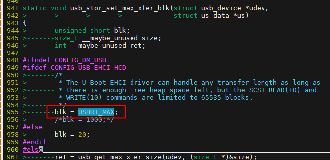
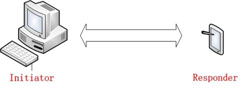
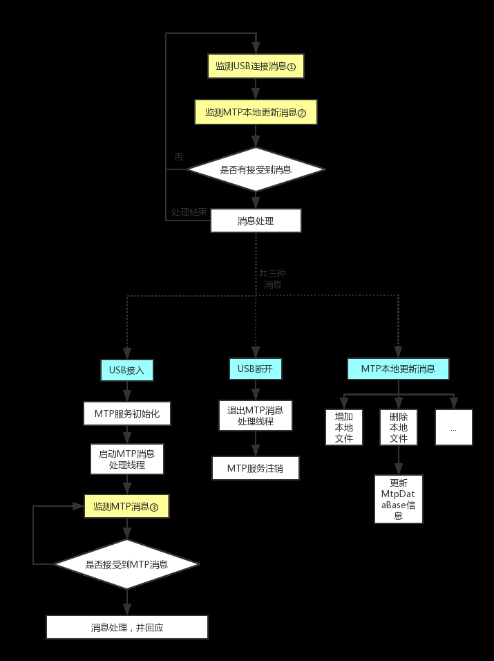

# USB

:::info 文档说明

- **原始页数：** 44 页
- **文档版本：** 2.5
- **发布日期：** 2025-07-29
- **原始文件：** [查看或下载 PDF](/pdfs/T153MX/04-usb-guide.pdf)

正文按原始 PDF 的文本层、书签层级和页面顺序转换，仅移除重复页眉、页脚与水印，不改写技术内容。

:::

<!-- PDF page 5 -->

## 1 概述

### 1.1 编写目的

介绍全志USB 模块的使用方法。

### 1.2 适用范围

该文档适用平台如下表所示：

表1-1: 文档使用平台列表

| 平台 | 内核版本 |
| --- | --- |
| R528 | Linux-5.4 |
| 3 | Linux-5.4 |
| T113 | Linux-5.4 |
| MR527 | Linux-5.15 |
| AI985 | Linux-5.15 |
| MR536 | Linux-5.15 |
| V821 | Linux-5.4 |
| MR153 | Linux-5.15 |

### 1.3 相关人员

USB 驱动和应用开发人员。

<!-- PDF page 6 -->

## 2 模块介绍

USB 有主机功能和从设备功能。做主机时，能连接U 盘、USB 鼠标等USB 设备；做从设备时，具有ADB 调试等从设备功能。

芯片硬件上支持USB device/Host(OHCI/EHCI)。

### 2.1 相关术语介绍

| 术语 | 解释 |
| --- | --- |
| USB | Universal Serial Bus, 通用串行总线 |
| OTG | On-The-Go |
| ADB | Android Debug Bridge，Android 调试桥 |

HostControllerDriver，主机控制器驱动

| UDC | USB Device Controller, USB 设备控制器 |
| --- | --- |
| HCI | Host Controller Interface，主机控制器接口 |
| EHCI | Enhanced Host Controller Interface，增强型主机控制器接口 |
| OHCI | Open Host Controller Interface，开放式主机控制器接口 |

### 2.2 模块配置

#### 2.2.1 Device Tree配置(Linux-4.9内核)

USB0 配置:

```text
usbc0:usbc0@0 {
 device_type = "usbc0";
 usb_port_type = <0x2>;
 usb_detect_type = <0x1>;
 usb_id_gpio = <&pio PB 3 0 0 0xffffffff 0xffffffff>;
 usb_det_vbus_gpio = <&pio PB 3 0 0 0xffffffff 0xffffffff>;
```

<!-- PDF page 7 -->

```dts
usb_regulator_io = "nocare";
 usb_wakeup_suspend = <0>;
 usb_serial_unique = <0>;
 usb_serial_number = "20080411";
 rndis_wceis = <1>;
 status = "okay";
};
```

| 参数 | 功能 |
| --- | --- |
| usb_port_type | USB 模式。0:device; 1:host; 2:OTG。 |
| usb_detect_type | USB 检测类型。0:none; 1:vbus/id detect; 2:id/dpdm。1 是使 |

用GPIO 去检测，需要与usb_id_gpio 配合使用。2 是使用

| PMU 去检测，需要配合 | det_vbus_supply 使用。 |
| --- | --- |
| usb_detect_mode | USB ID 脚检测模式。0: 线程轮询; 1: 中断检测; 默认为0。 |
| usb_id_gpio | USB ID 脚配置。若usb_detect_type 配置为1，这里则使用对 |

应gpio。若usb_detect_type 配置为2，这里则不需要配置。

usb_det_vbus_gpio USB VBUS 检测引脚配置; 一般使用对应gpio 即可；注意，如

果方案不需要检测VBUS，那么这里请填写USB ID 脚, 如果方案由PMU 检测VBUS, 那么这里请填写“axp_ctrl”。

det_vbus_supply与usb_det_vbus_gpio 类似，用于检测VBUS 是否存在。它会

指向usb_power_supply 节点。

| _regulator_io | IO 的供电，如果没有则 | “nocare”。 |
| --- | --- | --- |
| usb_wakeup_suspend | 是否支持USB 唤醒。如果需要支持进入深度休眠后的USB 唤 |  |

醒，则置为1。

| usb_serial_unique | 是否使用唯一序列号(由芯片chipid 得到)。 |
| --- | --- |
| usb_serial_number | 如果usb_serial_unique 为0，那么使用这里的配置的值作为 |

序列号。

status是否启用该模块。“okay”: 启用; “disabled”: 关闭。

说明

```text
若usb_detect_type
（即使用PMU 检测），且同时外部硬件接口为
usbtype-c 接口。需要注意使能
  cc 协议识别功
```

能。

如果PMU 使用的是全志的AXP 芯片，那么就需要在PMU 驱动的dts 配置中，将pmu_usb_typec_used 配置成1，否则，pmu 可能无法正常检测到cc 的状态，从而otg 无法正常自动切换。配置示例:

```dts
&usbc0 {
 device_type = "usbc0";
 usb_port_type = <0x2>;
```

<!-- PDF page 8 -->

```dts
usb_detect_type = <0x2>;
 usb_detect_mode = <0x0>;
 usb_id_gpio;
 usb_det_vbus_gpio = "axp_ctrl";
 det_vbus_supply = <&usb_power_supply>;
 usb_regulator_io = "nocare";
 usb_wakeup_suspend = <0>;
 usb_serial_unique = <0>;
 usb_serial_number = "20080411";
 status = "okay";
}；
usb_power_supply：usb_power_supply {
 ......
 pmu_usb_typec_used = <1>;
 ......
}；
```

XP 芯片的配置方法，详情可以参考文档《Tina_Linux_电源管理_ 开发指南》。

如果使用的是其他PMU 芯片，需要注意使能cc 协议识别功能。

det_vbus_supply 存在的作用：

1. 如果usb_det_vbus_gpio 设置的是axp_ctrl, 那么这里用于获取power_supply 来检测vbus 是

否存在。

2. 卸载device 驱动时，需要获取power_supply，然后设置限流值。

```text
有些时候，还需要对udc进行配置:
udc:udc-controller@0x05100000 {
_vbus_supply=<&usb_power_supply>;
```

```text
这里det_vbus_supply同样指向usb_power_supply节点, 这里的目的是让udc获取到usb power, 并设置限流值。
udc驱动中会检测到USB接入的是PC，然后软件设置USB限流值。
如果PMU支持并开启了BC1.2协议(识别USB的类型并且硬件上自动设置限流值),那么这里就不需要配置。
```

无论是USB0 还是USB1, EHCI/OHCI 的配置都是类似的, 具体EHCI/OHCI 配置如下:

```text
ehci0:ehci0-controller@0x04101000 {
 drvvbus-supply = <&reg_drivevbus>;
};
ohci0:ohci0-controller@0x04101400 {
 drvvbus-supply = <&reg_drivevbus>;
};
```

这里reg_drivevbus 主要配置对应的regulator 作为OTG_5V 供电。常见的配置有：

```text
使用PMU自带的DRVVBUS引脚使能对应的5V输出:
regulator0: regulators@0 {
 reg_drivevbus: drivevbus {
   regulator-name = "axp2585-drivevbus";
 };
};
```

使用GPIO去控制5V输出:

<!-- PDF page 9 -->

```dts
reg_usb0_vbus: usb0-vbus {
 compatible = "regulator-fixed";
 gpio = <&pio PH 12 1 2 0 0>;
 regulator-name = "usb0-vbus";
 regulator-min-microvolt = <5000000>;
 regulator-max-microvolt = <5000000>;
 enable-active-high;
};
```

USB1 配置:

```dts
usbc1:usbc1@0 {
 device_type = "usbc1";
 usb_regulator_io = "nocare";
 usb_wakeup_suspend = <0>;
 status = "okay";
};
```

| 与USB0 类似，但少了 | UDC 相关部分： |
| --- | --- |
| 参数 | 功能 |
| usb_regulator_io | IO 的供电，如果没有则“nocare” |
| usb_wakeup_suspend | 是否支持USB 唤醒; 如果需要支持进入深度休眠后的USB 唤醒，则 |

置为1

status是否启用该模块。“okay”: 启用; “disabled”: 关闭

#### 2.2.2 Device Tree配置(Linux-5.4内核)

5.4 内核下，USB 的DTS 配置有些许不同，主要是gpio 的配置存在差异。

USB0 配置:

```dts
usbc0:usbc0@0 {
 device_type = "usbc0";
 usb_port_type = <0x2>;
 usb_detect_type = <0x1>;
 usb_id_gpio = <&pio PD 21 GPIO_ACTIVE_HIGH>;
 enable-active-high;
 usb_det_vbus_gpio = <&pio PD 20 GPIO_ACTIVE_HIGH>;
 usb_wakeup_suspend = <0>;
 usb_serial_unique = <0>;
 usb_serial_number = "20080411";
 rndis_wceis = <1>;
 status = "okay";
};
```

<!-- PDF page 10 -->

功能

| usb_port_type | USB 模式。0:device; 1:host; 2:OTG。 |
| --- | --- |
| usb_detect_type | USB 检测类型。0:none; 1:vbus/id detect; 2:id/dpdm。1 是使 |

用GPIO 去检测，需要与usb_id_gpio 配合使用。2 是使用PMU 去检测，需要配合det_vbus_supply 使用。

| usb_detect_mode | USB ID 脚检测模式。0: 线程轮询; 1: 中断检测; 默认为0。 |
| --- | --- |
| usb_id_gpio | USB ID 脚配置。若usb_detect_type 配置为1，这里则使用对 |

应gpio。若usb_detect_type 配置为2，这里则不需要配置。

| usb_det_vbus_gpio | USB VBUS 检测引脚配置; 一般使用对应gpio 即可；注意，如 |
| --- | --- |
| 果方案不需要检测 | VBUS，那么这里请填写USBID 脚, 如果方 |

案由PMU 检测VBUS, 那么这里请填写“axp_ctrl”。

det_vbus_supply与usb_det_vbus_gpio 类似，用于检测VBUS 是否存在。它会

指向usb_power_supply 节点。

usb_wakeup_suspend是否支持USB 唤醒。如果需要支持进入深度休眠后的USB 唤

醒，则置为1。

| usb_serial_unique | 是否使用唯一序列号(由芯片chipid 得到)。 |
| --- | --- |
| usb_serial_number | 如果usb_serial_unique 为0，那么使用这里的配置的值作为 |

序列号。

us是否启用该模块。“okay”: 启用;“disabled”:关闭。

说明

若usb_detect_type 配置成2（即使用PMU 检测），且同时外部硬件接口为usb type-c 接口。需要注意使能cc 协议识别功能。

如果PMU 使用的是全志的AXP 芯片，那么就需要在PMU 驱动的dts 配置中，将pmu_usb_typec_used 配置成1，否则，pmu 可能无法正常检测到cc 的状态，从而otg 无法正常自动切换。配置示例:

```dts
&usbc0 {
e_type="usbc0";
 usb_port_type = <0x2>;
 usb_detect_type = <0x2>;
 usb_detect_mode = <0x0>;
 usb_id_gpio;
 usb_det_vbus_gpio = "axp_ctrl";
 det_vbus_supply = <&usb_power_supply>;
 usb_regulator_io = "nocare";
 usb_wakeup_suspend = <0>;
 usb_serial_unique = <0>;
 usb_serial_number = "20080411";
 status = "okay";
```

<!-- PDF page 11 -->

```text
}；
usb_power_supply：usb_power_supply {
 ......
 pmu_usb_typec_used = <1>;
 ......
}；
```

全志AXP 芯片的配置方法，详情可以参考文档《Tina_Linux_ 电源管理_ 开发指南》。

如果使用的是其他PMU 芯片，需要注意使能cc 协议识别功能。

```text
有些时候，还需要对udc进行配置:
udc:udc-controller@0x05100000 {
 det_vbus_supply = <&usb_power_supply>;
};
这里det_vbus_supply同样指向
  usb_power_supply节点, 这里的目的是让
           udc获取到usbpower, 并设置限流值。
udc驱动中会检测到USB接入的是PC，然后软件设置USB限流值。
如果PMU支持并开启了BC1.2协议(识别USB的类型并且硬件上自动设置限流值),那么这里就不需要配置。
```

无论是USB0 还是USB1, EHCI/OHCI 的配置都是类似的, 具体EHCI/OHCI 配置如下:

```text
ehci0:ehci0-controller@0x04101000 {
 drvvbus-supply = <&reg_drivevbus>;
};
ohci0:ohci0-controller@0x04101400 {
 drvvbus-supply = <&reg_drivevbus>;
};
```

这里reg_drivevbus 主要配置对应的regulator 作为OTG_5V 供电。常见的配置有：

```dts
使用PMU自带的DRVVBUS引脚使能对应的5V输出:
regulator0: regulators@0 {
 reg_drivevbus: drivevbus {
   regulator-name = "axp2585-drivevbus";
 };
};
使用GPIO去控制5V输出:
reg_usb0_vbus: usb0-vbus {
 compatible = "regulator-fixed";
 regulator-name = "usb0-vbus";
 regulator-min-microvolt = <5000000>;
 regulator-max-microvolt = <5000000>;
 regulator-enable-ramp-delay = <1000>;
 gpio = <&pio PD 19 GPIO_ACTIVE_HIGH>;
ble-active-high;
};
```

USB1 配置:

```dts
usbc1:usbc1@0 {
 device_type = "usbc1";
 usb_regulator_io = "nocare";
 usb_wakeup_suspend = <0>;
 status = "okay";
};
```

<!-- PDF page 12 -->

配置与USB0 类似，但少了UDC 相关部分：

| 参数 | 功能 |
| --- | --- |
| usb_regulator_io | IO 的供电，如果没有则“nocare” |
| usb_wakeup_suspend | 是否支持USB 唤醒; 如果需要支持进入深度休眠后的USB 唤醒，则 |

置为1

status是否启用该模块。“okay”: 启用; “disabled”: 关闭

#### 2.2.3 Device Tree配置(Linux-5.15及之后的内核)

与Linux-5.4 的配置方法一样，可以直接参考章节《Device Tree 配置(Linux-5.4 内核)》。

#### 2.2.4 内核配置(Linux-4.9/Linux-5.4内核)

USB device 相关配置：

Device Drivers ---&gt;[*] USB support ---&gt;&lt;*&gt; USB Gadget Support ---&gt;

```text
USB Peripheral Controller --->
*>SoftWinnerSUNXIUSBPeripheralController
```

USB Host 相关配置：

Device Drivers ---&gt;[*] USB support ---&gt;&lt;*&gt; Support for Host-side USB

```text
<*>
    EHCI HCD (USB 2.0) support
<*>
    OHCI HCD (USB 1.1) support
<*>
    SoftWinner SUNXI USB Host Controller support
<*>
     SoftWinner SUNXI USB HCI
<*>
      SoftWinner SUNXI USB EHCI0
<*>
      SoftWinner SUNXI USB EHCI1
<*>
      SoftWinner SUNXI USB OHCI0
<*>
      SoftWinner SUNXI USB OHCI1
```

角色管理相关配置

Device Drivers ---&gt;[*] USB support ---&gt;&lt;*&gt; SUNXI USB2.0 Dual Role Controller support ---&gt;&lt;*&gt; SUNXI USB2.0 Manager

其他内核配置，例如gadget 驱动配置，请参考常用功能配置章节。

<!-- PDF page 13 -->

#### 2.2.5 内核配置(Linux-5.15及之后的内核)

说明

由于Linux-5.15 及之后内核的AW 外设驱动代码存放在BSP 仓库中(TinaSDK/bsp)，因此内核配置也有所改动。

USB device 相关配置：

Allwinner BSP ---&gt;Device Drivers ---&gt;

USB Drivers ---&gt;USB Device Drivers ---&gt;

&lt;*&gt; Allwinner USB Peripheral Controller

USB Host 相关配置：

Allwinner BSP ---&gt;Device Drivers ---&gt;

USB Drivers ---&gt;USB Host Controller Drivers ---&gt;

```text
<*> Allwinner EHCI HCD
<*> Allwinner OHCI HCD
<*> Allwinner USB Host Controller
<*> Allwinner USB HCI
<*>
    Allwinner USB EHCI0
<*>
    Allwinner USB EHCI1
<*>
    Allwinner USB OHCI0
<*>
    Allwinner USB OHCI1
```

USB 角色管理相关配置:

nerBSP---&gt;

Device Drivers ---&gt;USB Drivers ---&gt;

USB Device Drivers ---&gt;&lt;*&gt; Allwinner USB2.0 Dual Role Controller support ---&gt;

```text
<*> Allwinner USB2.0 Manager
<*> Allwinner USB driver debug message
<*> Allwinner USB driver use adb source
```

其他内核配置，例如gadget 驱动配置，请参考常用功能配置章节。

### 2.3 代码结构

驱动的源代码位于内核drivers/usb 目录下，如下是sunxi 平台相关源码：

USB Host:

```text
drivers/usb/host/
├──ehci_sunxi.c
├──ohci_sunxi.c
├──sunxi_hci.c
└──sunxi_hci.h
```

UDC 和Manager:

<!-- PDF page 14 -->

```text
drivers/usb/sunxi_usb/
├──include
│   ├──sunxi_hcd.h
│   ├──sunxi_sys_reg.h
│   ├──sunxi_udc.h
│   ├──sunxi_usb_board.h
│   ├──sunxi_usb_bsp.h
│   ├──sunxi_usb_config.h
│   ├──sunxi_usb_debug.h
│   └──sunxi_usb_typedef.h
├──Kconfig
├──Makefile
├──manager
│   ├──usbc0_platform.c
│   ├──usbc_platform.h
│   ├──usb_hcd_servers.c
│   ├──usb_hcd_servers.h
──usb_hw_scan.c
│   ├──usb_hw_scan.h
│   ├──usb_manager.c
│   ├──usb_manager.h
│   ├──usb_msg_center.c
│   └──usb_msg_center.h
├──misc
│   └──sunxi_usb_debug.c
├──udc
│   ├──sunxi_udc_board.c
│   ├──sunxi_udc_board.h
│   ├──sunxi_udc.c
│   ├──sunxi_udc_config.h
│   ├──sunxi_udc_debug.c
│   ├──sunxi_udc_debug.h
│   ├──sunxi_udc_dma.c
──sunxi_udc_dma.h
```

└──usbc

```text
├──usbc.c
├──usbc_dev.c
├──usbc_i.h
└──usbc_phy.c
```

<!-- PDF page 15 -->

## 3 常用功能配置

### 3.1 配置OTG功能

OTG 功能下，需要根据USB ID 脚去进行Device, Host 模式的切换；如果需要支持NULL 模式(既不加载Device 也不加载Host 驱动), 那么还需要VBUS 状态检测引脚。

到的主要改动点：

```text
usb_port_type配置为2,即OTG模式。
usb_id_gpio配置对应的USB ID引脚。
usb_det_vbus_gpio, 需要根据实际情况进行配置:
1.如果需要检测VBUS状态，则按下面情况进行配置：
 a.由gpio引脚进行检测。直接配置对应的gpio即可。
 b.由我司PMU检测。填写"axp_ctrl"
2.如果不需要检测VBUS状态(缺少NULL模式)
 那么直接填写USB ID的gpio配置(也就是VBUS与ID状态一致)。
```

otg 功能相关的调试节点，每个芯片平台的路径可能会不一样，具体可以通过find -name otg_role确认, 下面默认以/sys/devices/platform/soc/usbc0/otg_role 这个路径举例。

方法：

```bash
拔插OTG线, 并通过下面节点查询当前USB角色：
cat /sys/devices/platform/soc/usbc0/otg_role
```

调试方法：

```bash
确认当前角色：
cat /sys/devices/platform/soc/usbc0/otg_role
开启角色切换调试:
echo 1 > /sys/devices/platform/soc/usbc0/hw_scan_debug
会有下面类似打印：
Id=3,role=2
```

role表示当前角色，0:NULL; 1:HOST; 2:DEVICE

```text
Id值，主要看低两位，bit0表示ID, bit1表示VBUS,
例如3表示ID脚为高，VBUS脚也为高, 所以当前应该为Device模式
```

Id 值的所有情况：

| Id 值 | ID | VBUS | 模式 |
| --- | --- | --- | --- |
| 0x00 | 0 | 0 | Host |
| 0x01 | 1 | 0 | Null |

<!-- PDF page 16 -->

| d 值 | ID | VBUS | 模式 |
| --- | --- | --- | --- |
| 0x02 | 0 | 1 | Host |
| 0x03 | 1 | 1 | Device |

- ID 脚一般情况下为高电平，只有接入OTG 线时会拉低;

- VBUS 为1 表示micro USB 口有接入外部电源;

- 一般不会出现Id 值为0x02 的情况，这表示接入OTG 线，但是还检测到VBUS;

- 如果没有VBUS 检测，Id 值就只有0x00 和0x03 两种情况, 也就是说要么加载device 驱动，要

么加载host 驱动; 这会带来一些影响：usb 相关时钟一直被打开，导致有一定功耗，以及硬件射

### 3.2 USB Gadget功能配置

USB Gadget 支持众多功能，它们的配置方法比较类似：

- 内核配置选中对应功能。

- 私有gadget 功能配置。通过configfs 创建对应的gadget 功能，并设置私有属性节点。

针对部分gadget 功能，我们在setusbconfig 脚本中封装了gadget 功能配置，可供参考，请看setusbconfig章节。

#### 3.2.1 ADB功能配置

内核相关配置:

Device Drivers ---&gt;[*] USB support ---&gt;&lt;*&gt; USB Gadget Support ---&gt;&lt;*&gt; USB functions configurable through configfs

```text
[*]
    Function filesystem (FunctionFS)
```

Device Drivers ---&gt;Character devices ---&gt;

```text
[*] Enable TTY
[*] Unix98 PTY support
```

[*] Networking support ---&gt;Networking options ---&gt;

```text
<*> Unix domain sockets
[*] TCP/IP networking
```

No Location

```text
CONFIG_NET
```

<!-- PDF page 17 -->

说明

```text
若不选上TTY 相关配置，会导致
adbshell 无法使用。若不选上网络相关配置，会导致
adbd 运行失败，应用退出。
```

进入系统后输入setusbconfig adb 即可切换并配置为adb 模式。

setusbconfig 中adb 相关配置解析：

```bash
设置idVendor, idProduct:
echo 0x18d1 > /sys/kernel/config/usb_gadget/g1/idVendor
echo 0xD002 > /sys/kernel/config/usb_gadget/g1/idProduct
创建adb功能:
mkdir /sys/kernel/config/usb_gadget/g1/functions/ffs.adb
建立config软链接:
ys/kernel/config/usb_gadget/g1/functions/ffs.adb//sys/kernel/config/usb_gadget/g1/configs/c.1/ffs.adb
挂载functionfs:
mount -o uid=2000,gid=2000 -t functionfs adb /dev/usb-ffs/adb/
设置对应的UDC控制器名称:
udc_controller=`ls /sys/class/udc`
echo $udc_controller > /sys/kernel/config/usb_gadget/g1/UDC
```

使用方法：需要开机启动adbd 服务, 具体请参考ADB 功能章节。

#### 3.2.2 MTP功能配置

相关配置:

Device Drivers ---&gt;[*] USB support ---&gt;&lt;*&gt; USB Gadget Support ---&gt;&lt;*&gt; USB functions configurable through configfs

```text
[*]
    MTP gadget
```

进入系统后输入setusbconfig mtp 即可切换并配置为mtp 模式。

setusbconfig 中mtp 相关配置解析：

```bash
设置idVendor, idProduct:
echo 0x045E > /sys/kernel/config/usb_gadget/g1/idVendor
echo 0x00C9 > /sys/kernel/config/usb_gadget/g1/idProduct
创建mtp功能:
mkdir /sys/kernel/config/usb_gadget/g1/functions/mtp.gs0
建立config软链接:
ln -s /sys/kernel/config/usb_gadget/g1/functions/mtp.gs0/ /sys/kernel/config/usb_gadget/g1/configs/c.1/mtp.gs0
设置对应的UDC控制器名称:
udc_controller=`ls /sys/class/udc`
echo $udc_controller > /sys/kernel/config/usb_gadget/g1/UDC
```

使用方法：需要开机启动MtpDaemon 服务, 具体请参考MTP 功能章节。

<!-- PDF page 18 -->

#### 3.2.3 Mass Storage功能配置

内核相关配置:

Device Drivers ---&gt;[*] USB support ---&gt;&lt;*&gt; USB Gadget Support ---&gt;&lt;*&gt; USB functions configurable through configfs

```text
[*]
    Mass storage
```

进入系统后输入setusbconfig mass_storage 即可切换并配置为mass_storage 模式。

setusbconfig 中mass_storage 相关配置解析：

```bash
设置idVendor, idProduct:
x1f3a>/sys/kernel/config/usb_gadget/g1/idVendor
x1000>/sys/kernel/config/usb_gadget/g1/idProduct
创建mass storage功能:
mkdir /sys/kernel/config/usb_gadget/g1/functions/mass_storage.usb0
建立config软链接:
ln -s /sys/kernel/config/usb_gadget/g1/functions/mass_storage.usb0/ /sys/kernel/config/usb_gadget/g1/configs/c.1/f1
设置对应的UDC控制器名称:
udc_controller=`ls /sys/class/udc`
echo $udc_controller > /sys/kernel/config/usb_gadget/g1/UDC
```

使用方法：

```bash
把要挂载的块设备写入file节点中：
dev/by-name/boot-res>/sys/kernel/config/usb_gadget/g1/functions/mass_storage.usb0/lun.0/file
卸载：
echo "" > /sys/kernel/config/usb_gadget/g1/functions/mass_storage.usb0/lun.0/file
```

说明

1. setusbconfig 脚本中，块设备名称默认为/dev/by-name/boot-res，需要根据实际情况将对应设备路径修改到setusbcon-

fig 脚本中。

2. 在将块设备映射到mass storage 之前，需要确保当前块设备未被挂载，否则可能会造成文件系统异常！因此建议在运

```text
行setusbconfig mass_stotage之前再运行一个umount /dev/by-name/boot-res。
```

磁盘映射PC 端成功后，还可以通过如下命令行自行配置所映射的分区（自行写脚本传参）。

```bash
echo none > /sys/kernel/config/usb_gadget/g1/UDC //disable掉udc功能
echo "/dev/sda" > /sys/kernel/config/usb_gadget/g1/functions/mass_storage.usb0/lun.0/file //设置映射分区
ls/sys/class/udc`>/sys/kernel/config/usb_gadget/g1/UDC//
重新enableudc功能。
```

#### 3.2.4 RNDIS功能配置

内核相关配置:

Device Drivers ---&gt;[*] USB support ---&gt;

<!-- PDF page 19 -->

&lt;*&gt; USB Gadget Support ---&gt;

```text
<*> USB functions configurable through configfs
RNDIS
```

进入系统后输入setusbconfig rndis 即可切换并配置为rndis 模式。

setusbconfig 中rndis 相关配置解析：

```bash
设置idVendor, idProduct:
echo 0x0525 > /sys/kernel/config/usb_gadget/g1/idVendor
echo 0xa4a2 > /sys/kernel/config/usb_gadget/g1/idProduct
创建rndis功能:
mkdir /sys/kernel/config/usb_gadget/g1/functions/rndis.usb0
建立config软链接:
ln -s /sys/kernel/config/usb_gadget/g1/functions/rndis.usb0/ /sys/kernel/config/usb_gadget/g1/configs/c.1/rndis.usb0
设置对应的UDC控制器名称:
udc_controller=`ls /sys/class/udc`
echo $udc_controller > /sys/kernel/config/usb_gadget/g1/UDC
```

使用方法：

通过ifconfig命令确认是否新增了网卡设备。

如果没有可以输入下面命令开启网卡：ifconfig usb0 up

```text
并通过ifconfig分别设置设备端以及host端网卡的ip，确保在同一个局域网内，并ping测试连通性:
设备端：
ifconfig usb0 192.168.10.5
Host端：i
genp0s20u3192.168.10.6
92.168.10.5
```

iperf 测试：

```text
设备端：
iperf -c 192.168.10.6 -t 100 -i 2 -p 5004
Host端：
iperf -s 192.168.10.5 -t 100 -i 2 -p 5004
```

```text
设备端的测试结果：
root@TinaLinux:/# iperf -c 192.168.10.6 -t 100 -i 2 -p 5004
------------------------------------------------------------
Client connecting to 192.168.10.6, TCP port 5004
indowsize:85.0KByte(default)
------------------------------------------------------------
[ 3] local 192.168.10.5 port 37656 connected with 192.168.10.6 port 5004
[ ID] Interval
            Transfer
                    Bandwidth
[ 3] 0.0- 2.0 sec 19.4 MBytes 81.3 Mbits/sec
```

#### 3.2.5 UAC1功能配置

内核相关配置:

<!-- PDF page 20 -->

Device Drivers ---&gt;[*] USB support ---&gt;&lt;*&gt; USB Gadget Support ---&gt;&lt;*&gt; USB functions configurable through configfs

```text
[*]
    Audio Class 1.0
```

进入系统后输入setusbconfig uac1 即可切换并配置为uac 模式。

setusbconfig 中uac1 相关配置解析：

```bash
设置idVendor, idProduct:
echo 0x1d61 > /sys/kernel/config/usb_gadget/g1/idVendor
echo 0x0101 > /sys/kernel/config/usb_gadget/g1/idProduct
创建uac1功能:
mkdir /sys/kernel/config/usb_gadget/g1/functions/uac1.usb0
设置UAC1私有属性节点：
设置通道数掩码,例如支持两通道:
echo 0x3 > /sys/kernel/config/usb_gadget/g1/functions/uac1.usb0/c_chmask
echo 0x3 > /sys/kernel/config/usb_gadget/g1/functions/uac1.usb0/p_chmask
注意我们默认代码UDC的endpoint中仅有一个ISO端点，所以只支持单项的同步传输，
默认会将p_chmask设置为0,也就是关闭playback通路
设置采样率：
echo 16000 > /sys/kernel/config/usb_gadget/g1/functions/uac1.usb0/p_srate
echo 48000 > /sys/kernel/config/usb_gadget/g1/functions/uac1.usb0/c_srate
建立config软链接:
ln -s /sys/kernel/config/usb_gadget/g1/functions/uac1.usb0/ /sys/kernel/config/usb_gadget/g1/configs/c.1/uac1.usb0
```

应的UDC控制器名称:

```bash
udc_controller=`ls /sys/class/udc`
echo $udc_controller > /sys/kernel/config/usb_gadget/g1/UDC
```

使用方法：

默认配置下，仅使能了c_chmask, 即PC端往小机端送音频数据，小机端播放出来

```text
小机端执行setusbconfig uac1设置功能后，会在PC端枚举生成一个USB声卡, PC端选择使用该声卡进行播放
然后小机端执行下面命令：
arecord -Dhw:UAC1Gadget -f S16_LE -r 48000 -c 2 |aplay -f S16_LE -r 48000 -c 2
表示从虚拟声卡(拿到PC端送来的数据)录音，然后直接播放出来
```

#### 3.2.6 HID功能配置

内核相关配置:

Device Drivers ---&gt;[*] USB support ---&gt;&lt;*&gt; USB Gadget Support ---&gt;&lt;*&gt; USB functions configurable through configfs

```text
[*]
    HID function
```

进入系统后输入setusbconfig hid 即可切换并配置为hid 模式。

<!-- PDF page 21 -->

setusbconfig 中hid 相关配置解析：

```bash
设置idVendor,idProduct:
echo 0x0525 > /sys/kernel/config/usb_gadget/g1/idVendor
echo 0xa4ac > /sys/kernel/config/usb_gadget/g1/idProduct
创建HID功能:
mkdir /sys/kernel/config/usb_gadget/g1/functions/hid.usb0
设置HID相关节点(根据实际HID功能进行配置,下面是模拟键盘的例子):
echo 1 > /sys/kernel/config/usb_gadget/g1/functions/hid.usb0/protocol
echo 8 > /sys/kernel/config/usb_gadget/g1/functions/hid.usb0/report_length
echo -ne \\x05\\x01\\x09\\x06\\xa1\\x01\\x05\\x07\\x19\\xe0\\x29\\xe7\\x15\\x00\\x25\\x01\\x75\\x01\\x95\\x08\\x81\\
    x02\\x95\\x01\\x75\\x08\\x81\\x03\\x95\\x05\\x75\\x01\\x05\\x08\\x19\\x01\\x29\\x05\\x91\\x02\\x95\\x01\\x75\\
    x03\\x91\\x03\\x95\\x06\\x75\\x08\\x15\\x00\\x25\\x65\\x05\\x07\\x19\\x00\\x29\\x65\\x81\\x00\\xc0 > /sys/kernel
    /config/usb_gadget/g1/functions/hid.usb0/report_desc
```

onfig软链接:

```bash
ln -s /sys/kernel/config/usb_gadget/g1/functions/hid.usb0/ /sys/kernel/config/usb_gadget/g1/configs/c.1/hid.usb0
设置对应的UDC控制器名称:
udc_controller=`ls /sys/class/udc`
echo $udc_controller > /sys/kernel/config/usb_gadget/g1/UDC
```

使用方法：

```text
设备端：setusbconfig hid设置gadget hid功能后，会生成/dev/hidgX节点,
其中，设置report_desc的内容用于描述hid设备，默认脚本中是一个键盘设备，因此会在Host端生成对应的/dev/input/
    eventX节点,
通过该节点可以获取到对应的按键事件，例如用于检测是否能够获取到事件的简单命令：
Ubuntu(Host端)：执行:sudo cat /dev/input/event16 |hexdump -C
```

另外，可以参考linux-x.x/Documentation/usb/gadget_hid.txt编译生成一个设备端的demo:hid_gadget_test去进行测试。

```text
设备端执行的测试命令：
hid_gadget_test /dev/hidg0 keyboard
然后按下对应按键(串口输入字符给到hid_gadget_test然后write到hidg0节点中)，观察PC端是否接受到对应消息。
最后，可以输入--quit退出测试应用
```

注意：

hid设备需要两个INT端点，而我们SDK一般默认只配置了一个，请参考《改UDC Endpoint配置》章节设置为两组INT端点的配

置。

#### 3.2.7 printer功能配置

内核相关配置:

Device Drivers ---&gt;[*] USB support ---&gt;&lt;*&gt; USB Gadget Support ---&gt;&lt;*&gt; USB functions configurable through configfs

```text
[*]
    Printer function
```

进入系统后输入setusbconfig printer 即可切换并配置为printer 模式。

<!-- PDF page 22 -->

setusbconfig 中printer 相关配置解析：

```bash
设置idVendor,idProduct:
echo 0x0525 > /sys/kernel/config/usb_gadget/g1/idVendor
echo 0xa4a8 > /sys/kernel/config/usb_gadget/g1/idProduct
创建printer功能:
mkdir /sys/kernel/config/usb_gadget/g1/functions/printer.usb0
设置printer相关节点(根据实际进行设置，下面是例子):
echo "MFG:linux;MDL:g_printer;CLS:PRINTER;SN:1;" > /sys/kernel/config/usb_gadget/g1/functions/printer.usb0/
    pnp_string
echo 10 > /sys/kernel/config/usb_gadget/g1/functions/printer.usb0/q_len
建立config软链接:
ln -s /sys/kernel/config/usb_gadget/g1/functions/printer.usb0/ /sys/kernel/config/usb_gadget/g1/configs/c.1/printer.
```

usb0

```bash
设置对应的UDC控制器名称:
udc_controller=`ls /sys/class/udc`
echo $udc_controller > /sys/kernel/config/usb_gadget/g1/UDC
```

使用方法：

```text
设置gadget printer功能后，会生成/dev/g_printer0节点,
然后可以参考linux-4.9/Documentation/usb/gadget_printer.txt里面的demo去进行测试。
```

#### 3.2.8 多功能复合设备

场景需要同时使用多种USB 功能，同样可以通过configfs 进行配置，默认setusbconfig 脚本

中添加了adb 和mtp 功能的复合设备配置，进入系统后输入setusbconfig adb,mtp 可以进行切换。

脚本配置很简单, 把两个功能一起设置即可，其他复合设备可作参考：

```bash
[ -d /sys/kernel/config/usb_gadget/g1/functions/ffs.adb ] || {
   mkdir /sys/kernel/config/usb_gadget/g1/functions/ffs.adb
}
echo "Tina ADB" > /sys/kernel/config/usb_gadget/g1/strings/0x409/product
[ -d /sys/kernel/config/usb_gadget/g1/functions/mtp.gs0 ] || {
   mkdir /sys/kernel/config/usb_gadget/g1/functions/mtp.gs0
}
[ -d /dev/usb-ffs/mtp ] || {
mkdir-p/dev/usb-ffs
   mkdir /dev/usb-ffs/mtp
   mount -o rmode=0770,fmode=0660,uid=1024,gid=1024,no_disconnect=1 -t functionfs mtp /dev/usb-ffs/mtp/
}
ln -s /sys/kernel/config/usb_gadget/g1/functions/ffs.adb/ /sys/kernel/config/usb_gadget/g1/configs/c.1/ffs.adb
ln -s /sys/kernel/config/usb_gadget/g1/functions/$mtp_name/ /sys/kernel/config/usb_gadget/g1/configs/c.1/mtp.gs0
```

每个gadget 功能都对UDC 的endpoint 有要求，例如需要什么类型的ep, 多少个ep 等等，如果没有正确配置，那么gadget 驱动中申请ep 资源的时候就会失败，请根据需求改动udc ep 配置，具体请参考UDC Endponint 配置章节。

<!-- PDF page 23 -->

另外，对于任何USB 功能都对应有一个idVendor,idProduct，对于复合设备也一样，某些功能的

可能需要USBHost端根据id 去选择匹配驱动，否则无法正常使用的。

下面网址可以查询一些已经注册过的id:

http://www.linux-usb.org/usb.ids

### 3.3 修改UDC Endpoint配置

UDC 硬件上一般支持4 组(极个别芯片可支持5 组) 可配置的endpoint, 默认代码下我们配置了两组BULK ep, 一个ISO ep, 一个INT ep。

根据实际使用的gadget功能，要求的ep 传输类型也不一样，下表简单列举的部分gadget 功能要求的ep 类型、个数：

| gadget 功能 | ep 类型 | 个数 |
| --- | --- | --- |
| hid | INT | 2, IN/OUT |
| accessory | BULK | 2, IN/OUT |
| loopback | BULK | 2, IN/OUT |
| mass_storage | BULK | 2, IN/OUT |
| mtp | BULK | 2,IN/OUT |
| INT | 1, IN |  |
| uac1 | ISOC | 2, IN/OUT |
| rndis | INT | 1, IN |
| BULK | 2, IN/OUT |  |
| serial | BULK | 2, IN/OUT |
| printer | BULK | 2, IN/OUT |

```text
个别功能根据实际配置，要求的ep可能也有变化, 例如uac1:
如果有2个ISOC ep,那么可以同时支持录音、播放；
如果只有一个ISOC ep, 可以支持录音或者播放。
```

下面介绍如何修改代码支持不同类型的ep, 改动点只有两个文件:

1. 修改drivers/usb/sunxi_usb/include/sunxi_udc.h

进行修改前，请注意：

<!-- PDF page 24 -->

```text
我们芯片的udc分两种：
a. 4K FIFO, 4组ep
b.8KFIFO,5
组ep
```

请根据spec或者sunxi_udc.h中的宏去区分，大部分芯片都是第一种，4K FIFO, 4组ep。

修改ep_fifo 配置：

```text
默认配置：
static const struct sw_udc_fifo ep_fifo[] = {
   {ep0name,
               0,
                  512, 0},
   {ep1in_bulk_name, 512, 512, 0},
   {ep1out_bulk_name, 1024, 512, 0},
   {ep2in_int_name, 1536, 512, 0},
   {ep2out_int_name, 2048, 512, 0},
   {ep3_iso_name,
                 2560, 512, 0},
   {ep4in_int_name, 3072, 512, 0},
   {ep4out_int_name, 3584, 512, 0},
static const int ep_fifo_in[] = {0, 1, 3, 5, 6, 7};
static const int ep_fifo_out[] = {0, 2, 4, 5, 7, 8};
```

ep_fifo中，第一列表示ep名称；第二列表示FIFO起始地址；第三列表示ep的长度；第四列参数表示使用double buffered fifo

，配置为1则表示启用。

```text
ep_fifo_in的配置,这里会配置所有输入方向的ep(ep0 + 4组ep)的序号,序号指的是上面ep_fifo数组的index。
例如ep_fifo_in数组中:
0表示ep0对应ep_fifo[0],即ep0;
1对应ep_fifo[1], 即ep1in-bulk;
3表示ep_fifo[3], 即ep2in-bulk;
5表示ep_fifo[5], 即ep3-iso;
6表示ep_fifo[6], 即ep4-int;
7在这里没有作用，只有某些芯片支持5组ep的才会用到这个index;i
o_out的配置方法与i
ut类似。
```

说明

关于double bufferd fifo，若给第三列ep 长度配置1024，则表示两个fifo 各占了512Bytes 的大小。double bufferd fifo 是会占用实际的fifo 空间的。

2. 修改drivers/usb/sunxi_usb/udc/sunxi_udc.c

主要修改static struct sunxi_udc sunxi_udc 这个结构体里面的ep 数组。

数组需要根据sunxi_udc.h 中的ep_fifo 一一对应, 修改每个ep 时需要注意：

- num 字段，表示第几组ep;

- name 字段，对应的ep 名称;

- maxpacket 字段，FIFO 大小，一般为512;

- caps, 指定传输类型以及方向;

- bEndpointAddress, 传输方向以及ep 序号;

- bmAttributes, 传输类型。

下面一些修改例子：

<!-- PDF page 25 -->

1. 支持ISO IN/OUT。

```text
s/usb/sunxi_usb/include/sunxi_udc.h
改动：
#define SW_UDC_EP_ISO_FIFO_SIZE
                    512
static const char ep3in_iso_name[]
                    = "ep3in-iso";
static const char ep3out_iso_name[]
                    = "ep3out-iso";
static const struct sw_udc_fifo ep_fifo[] = {
 {ep0name,
             0,
                512, 0},
 {ep1in_bulk_name, 512, 512, 0},
 {ep1out_bulk_name, 1024, 512, 0},
 {ep2in_bulk_name, 1536, 512, 0},
 {ep2out_bulk_name, 2048, 512, 0},
 {ep3in_iso_name, 2560, 512, 0},
 {ep3out_iso_name, 3072, 512, 0},
 {ep4_int_name,
               3584, 512, 0},
static const int ep_fifo_in[] = {0, 1, 3, 5, 7, 7};
static const int ep_fifo_out[] = {0, 2, 4, 6, 7, 8};
drivers/usb/sunxi_usb/udc/sunxi_udc.c改动：
主要改动了ep[5],ep[6]
 .ep[5] = {
   .num
           = 3,
   .ep = {
    .name
            = ep3in_iso_name,
    .ops
           = &sunxi_udc_ep_ops,
    .maxpacket = SW_UDC_EP_ISO_FIFO_SIZE,
    .maxpacket_limit = SW_UDC_EP_ISO_FIFO_SIZE,
    .caps = USB_EP_CAPS(USB_EP_CAPS_TYPE_ISO,
       USB_EP_CAPS_DIR_IN),
   },
   .dev
            = &sunxi_udc,
   .bEndpointAddress = (USB_DIR_IN | 3),
   .bmAttributes
                = USB_ENDPOINT_XFER_ISOC,
 },
 .ep[6] = {
   .num
           = 3,
   .ep = {
    .name
            = ep3out_iso_name,
    .ops
           = &sunxi_udc_ep_ops,
    .maxpacket = SW_UDC_EP_ISO_FIFO_SIZE,
    .maxpacket_limit = SW_UDC_EP_ISO_FIFO_SIZE,
    .caps = USB_EP_CAPS(USB_EP_CAPS_TYPE_ISO,
       USB_EP_CAPS_DIR_OUT),
   },
ev
=&sunxi_udc,
   .bEndpointAddress = (USB_DIR_OUT | 3),
   .bmAttributes
                = USB_ENDPOINT_XFER_ISOC,
 },
```

2. 支持两个INT 传输，方向均支持。

默认代码支持了一个INT传输，所以增加一个即可，最简单的就是将ISO端点改为INT:

```text
drivers/usb/sunxi_usb/include/sunxi_udc.h改动：
static const char ep3_int_name[]
                    = "ep3-int";
static const struct sw_udc_fifo ep_fifo[] = {
```

<!-- PDF page 26 -->

```text
{ep0name,
               0,
                  512, 0},
   {ep1in_bulk_name, 512, 512, 0},
   {ep1out_bulk_name, 1024, 512, 0},
   {ep2in_bulk_name, 1536, 512, 0},
   {ep2out_bulk_name, 2048, 512, 0},
   {ep3_int_name,
                 2560, 1024, 0},
   {ep4_int_name,
                 3584, 512, 0},
};
drivers/usb/sunxi_usb/udc/sunxi_udc.c改动：
主要改动了ep[5]
 .ep[5] = {
   .num
           = 3,
   .ep = {
    .name
            = ep3_int_name,
    .ops
           = &sunxi_udc_ep_ops,
    .maxpacket = SW_UDC_EP_FIFO_SIZE,
maxpacket_limit=SW_UDC_EP_FIFO_SIZE,
```

.caps = USB_EP_CAPS(USB_EP_CAPS_TYPE_INT,

```text
USB_EP_CAPS_DIR_ALL),
 },
 .dev
           = &sunxi_udc,
 .bEndpointAddress = 3,
 .bmAttributes
               = USB_ENDPOINT_XFER_INT,
},
```

3. 支持4 组BULK IN/OUT。

每个ep 都至少占用512 字节的FIFO, 如果需要支持4 组BULK, 并且IN/OUT 都需要, 那么共需要8*512=4K 的FIFO, 另外ep0 至少需要64 字节的FIFO。而我们UDC 的FIFO 实际大小是4K+64byte,是可以满足该需求的，配置方法如下所示:

```text
代码下支持了两组BULK
现在需要多增加两组BULK。
drivers/usb/sunxi_usb/include/sunxi_udc.h改动：
static const char ep3in_bulk_name[] = "ep3in-bulk";
static const char ep3out_bulk_name[] = "ep3out-bulk";
static const char ep4in_bulk_name[] = "ep4in-bulk";
static const char ep4out_bulk_name[] = "ep4out-bulk";
static const struct sw_udc_fifo ep_fifo[] = {
   {ep0name,
               0,
                   64, 0},
   {ep1in_bulk_name, 64,
                    512, 0},
   {ep1out_bulk_name, 512+64, 512, 0},
   {ep2in_bulk_name, 1024+64, 512, 0},
   {ep2out_bulk_name, 1536+64, 512, 0},
   {ep3in_bulk_name, 2048+64, 512, 0},
p3out_bulk_name,2560+64,512,0},
   {ep4in_bulk_name, 3072+64, 512, 0},
   {ep4out_bulk_name, 3584+64, 512, 0},
};
static const int ep_fifo_in[] = {0, 1, 3, 5, 7, 7};
static const int ep_fifo_out[] = {0, 2, 4, 6, 8, 8};
drivers/usb/sunxi_usb/udc/sunxi_udc.c改动：
主要改动了ep[5],ep[6],ep[7],ep[8]
.ep[5] = {
```

<!-- PDF page 27 -->

```text
.num
             = 3,
 .ep = {
   .name
            = ep3in_bulk_name,
   .ops
           = &sunxi_udc_ep_ops,
   .maxpacket
              = SW_UDC_EP_FIFO_SIZE,
   .maxpacket_limit = SW_UDC_EP_FIFO_SIZE,
   .caps = USB_EP_CAPS(USB_EP_CAPS_TYPE_BULK,
      USB_EP_CAPS_DIR_IN),
 },
 .dev
            = &sunxi_udc,
 .bEndpointAddress = (USB_DIR_IN | 3),
 .bmAttributes
               = USB_ENDPOINT_XFER_BULK,
},
.ep[6] = {
 .num
             = 3,
 .ep = {
ame=ep3out_bulk_name,
   .ops
           = &sunxi_udc_ep_ops,
   .maxpacket
              = SW_UDC_EP_FIFO_SIZE,
   .maxpacket_limit = SW_UDC_EP_FIFO_SIZE,
   .caps = USB_EP_CAPS(USB_EP_CAPS_TYPE_BULK,
      USB_EP_CAPS_DIR_OUT),
 },
 .dev
            = &sunxi_udc,
 .bEndpointAddress = (USB_DIR_OUT | 3),
 .bmAttributes
               = USB_ENDPOINT_XFER_BULK,
},
.ep[7] = {
 .num
             = 4,
 .ep = {
   .name
            = ep4in_bulk_name,
ps=&sunxi_udc_ep_ops,
   .maxpacket
              = SW_UDC_EP_FIFO_SIZE,
   .maxpacket_limit = SW_UDC_EP_FIFO_SIZE,
   .caps = USB_EP_CAPS(USB_EP_CAPS_TYPE_BULK,
      USB_EP_CAPS_DIR_IN),
 },
 .dev
            = &sunxi_udc,
 .bEndpointAddress = (USB_DIR_IN | 4),
 .bmAttributes
               = USB_ENDPOINT_XFER_BULK,
},
.ep[8] = {
 .num
             = 4,
 .ep = {
   .name
            = ep4out_bulk_name,
   .ops
           = &sunxi_udc_ep_ops,
   .maxpacket
              = SW_UDC_EP_FIFO_SIZE,
   .maxpacket_limit = SW_UDC_EP_FIFO_SIZE,
   .caps = USB_EP_CAPS(USB_EP_CAPS_TYPE_BULK,
      USB_EP_CAPS_DIR_OUT),
 },
 .dev
            = &sunxi_udc,
 .bEndpointAddress = (USB_DIR_OUT | 4),
 .bmAttributes
               = USB_ENDPOINT_XFER_BULK,
},
```

<!-- PDF page 28 -->

### 3.4 USB Host功能配置

#### 3.4.1 U盘功能

Device Drivers ---&gt;SCSI device support ---&gt;&lt;*&gt; SCSI device support

```text
<*> SCSI disk support
[*] USB support --->
 <*>
     USB Mass Storage support
 <*>
      Datafab Compact Flash Reader support
 <*>
      Freecom USB/ATAPI Bridge support
 <*>
      ISD-200 USB/ATA Bridge support
USBAT/USBAT02-basedstoragesupport
 <*>
      SanDisk SDDR-09 (and other SmartMedia, including DPCM) support
 <*>
      SanDisk SDDR-55 SmartMedia support
 <*>
      Lexar Jumpshot Compact Flash Reader
 <*>
      Olympus MAUSB-10/Fuji DPC-R1 support
 <*>
      Support OneTouch Button on Maxtor Hard Drives
 <*>
      Support for Rio Karma music player
 <*>
      SAT emulation on Cypress USB/ATA Bridge with ATACB
 <*>
      USB Attached SCSI
```

Enable the block layer ---&gt;Partition Types ---&gt;[*] PC BIOS (MSDOS partition tables) support

说明

若PC BIOS(MSDOS_PARTITION) 配置项没有选上，会导致不能识别U 盘在windows 端的分区。

```text
假设
U 盘是有两个分区，但没有配置该配置项，则在
linux 端的表现为：只有/dev/sda 一个文件节点。不会生成/dev/sda/dev/
      sda1 /dev/sda2 等多个文件节点。从而会使得挂载失败。
```

#### 3.4.2 USB声卡

Device Drivers ---&gt;&lt;*&gt; Sound card support ---&gt;[*] USB sound devices ---&gt;&lt;*&gt; USB Audio/MIDI driver

#### 3.4.3 USB网卡

Device Drivers ---&gt;[*] Network device support ---&gt;

```text
<*> USB Network Adapters --->
在这选择对应的驱动
例如是rndis驱动：
```

&lt;*&gt; Multi-purpose USB Networking Framework

```text
<*>
    Host for RNDIS and ActiveSync devices
```

<!-- PDF page 29 -->

#### 3.4.4 USB HID设备

Device Drivers ---&gt;HID support ---&gt;USB HID support ---&gt;&lt;*&gt; USB HID transport layer

#### 3.4.5 USB 摄像头

Device Drivers ---&gt;&lt;*&gt; Multimedia support ---&gt;

```text
[*] Media USB Adapters --->
USBVideoClass(UVC)
 [*]
    UVC input events device support
```

#### 3.4.6 USB 打印机

Device Drivers ---&gt;SCSI device support ---&gt;&lt;*&gt; SCSI device support

```text
<*> SCSI disk support
[*] USB support --->
 <*>
     USB Printer support
```

sb 打印机设备后，会生成对应设备节点：/dev/usb/lp0。

### 3.5 支持USB Standby

部分芯片可以支持USB Standby，例如外接USB 鼠标键盘，在点击鼠标时，可以唤醒系统。

软件上注意配置usb_wakeup_suspend 为1 即可。

硬件上注意vdd-usb 的电在休眠时不能关。如果用的是USB0, 那么注意OTG-5V 的电也不能掉，否则USB 外设不能正常工作。

### 3.6 设置USB序列号

很多时候adb devices 查看设备时，它的序列号都是20080411, 它的值就是有USB 序列号决定的。

如果要求每个设备都有自己唯一的序列号，那么可以配置芯片的chipid 转换得到序列号，并设置到USB 驱动中，修改步骤如下所示：

<!-- PDF page 30 -->

1. 修改uboot 配置，增加CONFIG_SUNXI_SERIAL 配置。

```text
增加该配置后，uboot阶段会读取chipid并转换得到serial number。
并将该serial number设置到环境变量snum中，然后启动内核时获取该变量，并增加到内核cmdline中："androidboot.
    serialno="
```

2.usb 配置使用唯一序列号。

```text
修改dts, 将usbc0的usb_serial_unique改为1
usb相关驱动中会读取cmdline中"androidboot.serialno"字段获取序列号
后续gadget驱动中均会配置使用该序列号
注意，进入系统后不要再修改/sys/kernel/config/usb_gadget/g1/strings/0x409/serialnumber该节点。
```

验证方法：

可以通过adb devices查看序列号

### 3.7 测试USB速率

可以通过挂载移动硬盘，然后进行测试读写性能。

写性能：

```text
确认移动硬盘的挂载目录，如/mnt/exUDISK/，然后执行下面命令：
time dd if=/dev/zero of=/mnt/exUDISK/test.bin bs=1MB count=1024
1024+0 records in
1024+0 records out
real
    0m 36.63s
m0.00s
sys0m3.41s
所以写性能为:1024/36.63=27.95MB/s
```

读性能:

```text
time dd if=/mnt/exUDISK/test.bin of=/dev/null bs=1MB count=1024
1024+0 records in
1024+0 records out
real
    0m 28.99s
user
     0m 0.01s
sys
    0m 2.38s
所以读性能为:1024/28.99=35.33MB/s
```

注意，不同的U 盘、移动硬盘，受存储介质、文件系统格式影响，速率可能会存在较大差别，建

用fat32 文件系统的移动硬盘进行测试，而不使用ntfs 文件系统的移动硬盘。

说明

dd 命令在运行结束之后，其实还没真正地将文件写到硬盘上，而是单纯地把数据写/读到内存缓存当中。因此，如果需要真实反映到硬盘的读写速度。写操作需要加上参数“oflag=direct”，读操作需要加上参数“iflag=direct”。

<!-- PDF page 31 -->

### 3.8 USB功能裁剪

一般我们默认SDK 都会默认开启USB0 的OTG 功能，USB1 的Host 功能。而不同客户产品对USB功能的需求不一样，可以根据下面几个例子进行功能裁剪：

#### 3.8.1 删除多余的usb gadget功能

实际产品仅用到有限种类的gadget 功能，可以通过make kernel_menuconfig 进入相关配置项：

Device Drivers ---&gt;

```text
[*] USB support --->
USBGadgetSupport--->
  <*> USB functions configurable through configfs
                    //必须要选configfs功能
  [*]
      Mass storage
                    //USB Masss Storage功能，可以理解设备模拟为U盘
  [*]
      Function filesystem (FunctionFS)
                    //ADB就是通过该ffs功能实现
  [*]
      MTP gadget
  [*]
      HID function
  [*]
      Printer function
```

实际产品可以根据情况仅选用自己需要用到的gadget 功能。

#### 3.8.2 仅用到usb0的OTG功能

删除USB1 相关的配置

Device Drivers ---&gt;[*] USB support ---&gt;

```text
< >
      SoftWinner SUNXI USB EHCI1
< >
      SoftWinner SUNXI USB OHCI1
```

把EHCI1,OHCI1 的配置去掉。

#### 3.8.3 仅使用到adb功能

adb 功能需要用到USB0 的device 功能，因此可以把USB1 以及Host 相关配置都删除。

eDrivers---&gt;

[*] USB support ---&gt;

```text
<*> Support for Host-side USB
<*> USB Gadget Support --->
 <*> USB functions configurable through configfs
                    //必须要选configfs功能
 [*]
     Function filesystem (FunctionFS)
                    //ADB就是通过该ffs功能实现
<*> SUNXI USB2.0 Dual Role Controller support --->
```

“USB Support” 配置页中仅保持上面选项，其他例如“HCI”, “USB Mass Storage” 相关配置都去掉。

<!-- PDF page 32 -->

### 3.9 Uboot阶段U盘功能

一般uboot 默认配置都没有使能USB 及U 盘功能，需要修改方案默认defconfig(例如configs/&#123;CHIP&#125;_defconfig):

```text
CONFIG_USB1_VBUS_PIN="PF4"
CONFIG_USB=y
CONFIG_USB_HOST=y
CONFIG_USB_EHCI_HCD=y
CONFIG_USB_STORAGE=y
CONFIG_CMD_USB=y
```

其中，USB1_VBUS_PIN 表示使能USB1 口5V 电压的gpio，如果硬件上这个5V 供电默认就上电，那么这个配置可以置空为“”。

使用的是USB0 口，那么请新增或修改CONFIG_USB0_VBUS_PIN这个配置。

测试验证步骤：

```text
1.进入uboot命令行后，输入下面命令使能USB功能：
 usb start
 他会初始化USB0,USB1的Host功能(如果CONFIG_USB_MAX_CONTROLLER_COUNT为1则只初始化USB0)，
 如果当前接了U盘，会被扫描到，并有如下打印：
 => usb start
 starting USB...
 USB0: start sunxi USB-DRD...
 config usb clk ok
 sunxi USB-DRD init ok...
 USB EHCI 1.00
ningbus0fordevices...1USBDevice(s)found
 USB1: start sunxi USB1-Host...
 config usb clk ok
 sunxi USB1-Host init ok...
 USB EHCI 1.00
 scanning bus 1 for devices... 2 USB Device(s) found
```

scanning usb for storage devices... 1 Storage Device(s) found

另外还可以用usb tree等命令查看USB控制器信息

```text
2.使用fat相关命令查看U盘内容
 例出U盘里面的文件信息(作用如同ls)：
 fatls usb 0
 读取U盘文件到指定内存地址中：
 fatload usb 0 0x43000000 test_file
```

事项：

1. 请注意确认U 盘文件系统格式, 目前仅支持fat 格式;

2. 如果文件读取过程中出现下面timeout 打印，可尝试将common/usb_storage.c 的blk 值改小。

异常打印：

<!-- PDF page 33 -->

```text
=> fatload usb 0 0x42000000 4M.bin
EHCI timed out on TD - token=0x40008d80
EHCI timed out on TD - token=0x40008d80
EHCI timed out on TD - token=0x40008d80
Error reading cluster
** Unable to read file 4M.bin **
```

修改办法：



*图3-1: 修改blk 值*

越小，兼容性越好，但是传输速率也会相对降下来。

出现这种现象的原因：uboot 原生代码中未对U 盘做兼容性处理，故使用U 盘读取文件时，有一些U 盘会出错，导致传输失败。

<!-- PDF page 34 -->

## 4 常见调试方法

### 4.1 调试节点

查看USB0 当前Role:

```bash
cat /sys/devices/platform/soc/usbc0/otg_role
cat `find /sys -name otg_role`
```

手动切换成Host 模式:

```bash
cat /sys/devices/platform/soc/usbc0/usb_host
或者
cat `find /sys -name usb_host`
```

手动切换成Device 模式:

```bash
cat /sys/devices/platform/soc/usbc0/usb_device
或者
cat `find /sys -name usb_device`
```

手动切换模式后，G 自动切换角色的功能就会失效；

USB1 调试节点:

```bash
卸载主机驱动
echo 0 > sys/devices/platform/soc/5200000.ehci1-controller/ehci_enable
echo 0 > sys/devices/platform/soc/5200000.ohci1-controller/ohci_enable
加载主机驱动
echo 1 > sys/devices/platform/soc/5200000.ehci1-controller/ehci_enable
echo 1 > sys/devices/platform/soc/5200000.ohci1-controller/ohci_enable
```

### 4.2 测试USB眼图

USB0 OTG Device 眼图测试:

```bash
手动切换Device模式:
cat /sys/devices/platform/soc/usbc0/usb_device
每个芯片平台的节点路径会有些差异，请通过find命令确认：
find /sys -name otg_ed_test
眼图测试命令：
echo test_pack > /sys/devices/platform/soc/5100000.udc-controller/otg_ed_test
```

<!-- PDF page 35 -->

USB0 OTG Host 眼图测试:

```bash
手动切换Host模式:
cat /sys/devices/platform/soc/usbc0/usb_host
每个芯片平台的节点路径会有些差异，请通过find命令确认(注意选择带有ehci0的路径)：
find /sys -name ed_test
眼图测试命令：
echo test_pack > /sys/devices/platform/soc/5101000.ehci0-controller/ed_test
```

USB1 Host 眼图测试:

```text
每个芯片平台的节点路径会有些差异，请通过find命令确认(注意选择带有ehci1的路径)：
find /sys -name ed_test
眼图测试命令：
est_pack>/sys/devices/platform/soc/4201000.ehci1-controller/ed_test
```

<!-- PDF page 36 -->

## 5 USB相关应用工具

### 5.1 setusbconfig脚本

setusbconfig 脚本位于：

TinaSDK/platform/allwinner/usb/setusbconfig/

使用方法，setusbconfig 功能名, 例如:

```text
切换成adb功能:
setusbconfig adb
切换成mtp功能：
setusbconfig mtp
切换成adb mtp复合功能：
setusbconfig adb,mtp
```

### 5.2 ADB

ADB 功能是从Android 移植过来的，设备端会运行adbd 服务，而Host 端(一般为PC) 通过adb工具进行调试，如adb shell, adb push/pull 等。

Tina SDK 中支持adbd 服务，请make menuconfig 选中对应软件包：

例如openWrt 下：

Allwinner ---&gt;USB ---&gt;&lt;*&gt; adbd................................................. adbd for Tina Linux

选中该软件包后，开机会默认运行adbd 服务，并且设置USB gadget 为ADB 功能。

<!-- PDF page 37 -->

#### 5.2.1 ADB功能说明

##### 5.2.1.1 adb shell功能

```text
PC端执行adb shell,可进入控制台。
PC端执行adb shell + command, 例如adb shell ls /可以直接将结果输出到终端。
```

##### 5.2.1.2 adb push/pull功能

```text
推送文件到小机端：
ushtest.bin/mnt/UDISK/
从小机端拉取文件：
adb pull /mnt/UDISK/test.bin .
```

##### 5.2.1.3 adb网络连接

修改adbd 启动脚本：

```text
tina/package/utils/adb/adbd-configfs.init
取消下面注释
#ADB_TRANSPORT_PORT=5555
```

小机端与PC 在同一个局域网，并且可以ping 通。

```text
PC端执行adb connect 192.168.1.101建立连接。
然后就可以开始执行adb shell等命令了。
```

##### 5.2.1.4 adb forward功能

adb forward 功能用于数据转发，执行该命令后，应用可以通过socket 通信，实现PC 与设备之间的数据交互。

```text
PC端执行:adb forward tcp:11111 tcp:22222
tcp:11111表示PC端监听的端口。
222表示设备端的端口。
PC端对11111端口的数据读写，都会转发到设备端22222端口
所以设备端的一些应用可以通过22222端口与PC端进行数据交互。
```

##### 5.2.1.5 adb auth功能

该功能主要用于权限管理，只有经过公私钥认证后才能进行adb 通信。

<!-- PDF page 38 -->

使用前需要make menuconfig 选中对应功能：

Allwinner ---&gt;USB ---&gt;

```text
<*> adbd................................................. adbd for Tina Linux
< > adbd_auth_service........................ adb auth service for Tina Linux
< > libawadbauth................................. adb auth lib for Tina Linux
```

默认开机就会使能该功能，执行adb 命令时会进行公私钥校验。

公钥的安装：

```text
默认允许安装所有公钥，可以通过修改TinaSDK/platform/allwinner/usb/adbd/auth/aw_adb_auth_service.c
取消下面注释
/*aw_adbd_install_pubkey_detector(publickey_detector); */
然后在publickey_detector函数中判断是否安装公钥，返回false则不安装
```

安装路径：/mnt/UDISK/adb_keys

如果/mnt/UDISK/adb_keys 下面没有对应的公钥，并且不允许安装新公约，这时候adb 功能就不能使用了。

注意事项：1.Windows 下面公私钥的路径：

```text
%USERPROFILE%\.android\adbkey
                    // 私钥
%USERPROFILE%\.android\adbkey.pub // 公钥
```

2.Ubuntu 下面公私钥的路径：

```text
用户目录/.android/adbkey
                    // 私钥
用户目录/.android/adbkey.pub
                    // 公钥
```

#### 5.2.2 ADB常见问题

- 注意是否启动了adbd 服务

```text
ps|grep adbd确认是否存在adbd进程，如果没有请确认:
1.是否选中adb软件包。
2.adbd启动脚本是否执行了。
可通过命令手动运行adbd服务：
/etc/init.d/adbd start
```

- 如果是busybox 启动方式，需要注意挂载devpts

```bash
adb shell的过程中，需要创建虚拟终端，依赖于devpts
mount -t devpts /dev/pts /dev/pts
```

- adb shell 不能使用，但是push/pull 功能正常

<!-- PDF page 39 -->

```text
adb shell会用到虚拟终端，依赖部分内核配置:
CONFIG_VT_CONSOLE
CONFIG_UNIX98_PTYS
CONFIG_DEVPTS_MULTIPLE_INSTANCES
CONFIG_CONSOLE_TRANSLATIONS
```

- adb 命令执行后提示close

```bash
可以通过查看adbd的打印确认问题, 串口端输入：
killall adbd
adbd &
这样adbd的打印会直接输出到串口终端
如果确认到/dev/pts/等相关字样错误打印,并且mount看到缺少devpts文件系统的信息，
那么需要挂载devpts文件系统即可解决问题：
mkdir /dev/pts
mount -t devpts none /dev/pts
```

### 5.3 MTP

MTP，全称是Media Transfer Protocol（媒体传输协议）。它是微软的一个为计算机和便携式设备之间传输图像、音乐等所定制的协议。

按照MTP 定义的规则，可以使得电脑能够获取小机端的目录信息，并且可以进行增、删、查看等操作。因此，这就要求电脑端以及小机端都需要有一个服务或者程序去发送、解析、回应数据包。

的应用分为两种角色，一个是作为Inititator，另一个作为Responder。

- Initiator ⸺在MTP 中所有的请求都有Initiator 发起。例如，PC 请求获取小机设备的文件数

据。

- Responder ⸺它会处理Initiator 的请求；除此之外，Responder 也会发送Event 事件。



*图5-1: MTP 数据传输*

一般Windows PC 都默认支持MTP。ubuntu 等PC 也有一些第三方包可以支持，例如libmtp,mtpfs 等。而小机端上则需要一个应用去处理PC 发送过来的请求(实际上就是按照MTP 生成的数据包)，并做出回应。

Tina 参考Android MTP 系统服务，实现了自己的MTP 服务。

<!-- PDF page 40 -->

#### 5.3.1 MTP服务

MtpDaemon 软件设计流程图：



*图5-2: MtpDaemon 软件流程*

<!-- PDF page 41 -->

- 监测usb uevent 事件。

- 监测fifo 看是否接受到消息，该消息主要用于更新小机端MtpDataBase(用于保存文件目录信息

的对象)，详细请查阅MtpTools 章节。

- 监测MTP 消息，该消息是从/dev/mtp_usb 节点获取。

#### 5.3.2 MTP相关配置

##### 5.3.2.1 menuconfig选中MtpDaemon软件包

Allwinner ---&gt;USB ---&gt;

```text
<*> MtpDaemon................................................ Tina MTP Daemon
[*] MTP daemon compile with aio
```

##### 5.3.2.2 配置挂载目录

默认配置下，只会把小机端/mnt/UDISK 挂载到PC 上，并且挂载的盘符名称为”Tina 存储设备”。如果想修改或者新增目录，可以修改下面路径的源码：

TinaSDK/platform/allwinner/usb/mtp/src/main.c

```text
static mtp_storage_t gStorageArray[] = {
 {NULL, 65537, "/mnt/UDISK", "Tina存储设备", MB(2), MB(4096)},
   //{NULL, 65539, "/boot", "boot", 0, 0},
   //{NULL, 65540, "/boot-res", "boot-res", 0, 0},
};
可以在该数组上添加需要的目录及相关信息，例如
{NULL, 65539, "/boot", "boot", 0, 0},
第一个参数固定填写NULL即可，MtpDaemon会在自动对这个成员赋值。
第二个参数表示Storage ID, 对每个要挂载的目录都有唯一的ID，例如上面设置的65537为/mnt/UDISK的storage ID，这个值是
    一个32bit的整型数，建议从65537累加上去即可。
第三个参数表示要挂载到PC的目录，是一个绝对路径。
第四个参数表示保留空间，比如上述的是保留2MB的空间。
第五个参数表示该单个文件大小的最大值，上述例子为限制传输单个文件最大不超过4GB。
```

#### 5.3.3 MtpTools

MtpDaemon 作为responder 处理并回应PC 发送过来的MTP 消息，因此在PC 上可以对小机端的目录、文件进行操作。但为了让小机端的修改能够同步到PC 上，Tina 提供了MtpTools。

MtpTools 主要通过fifo 发送消息给MtpDaemon, 然后MtpDaemon 根据该消息去更新Mtp-DataBase, 即更新用于描述目录文件信息的对象，此时PC 上只需要刷新下即可同步得到小机端的修改。

<!-- PDF page 42 -->

下面介绍下MtpTools 的几个命令：

```text
MtpToolsusage:
MtpTools [function] [path]
-f, --function
            function opion, contains add,remove,update,cut,copy
-t, --type
           object type, FILE or DIR
-s, --spath
           object src path
-d, --dpath
            object dest path, specify dest path of object which will be cut or copy
-h, --help
           show help
example:
MtpTools -f add -t FILE -s /mnt/UDISK/test
```

| 参数 | 功能说明 |  |
| --- | --- | --- |
| 指定要执行的动作，包含 | add-新增 | ,remove-移除,update-更新,cut-剪切, |

copy-复制

| -t | 指定要操作对象的类型，文件or 目录 |
| --- | --- |
| -s | 表示操作对象的源路径 |
| -d | 表示操作对象的目标路径 |

举例说明：

新增一个名为test 的文件：

ols-fadd-tFILE-s/mnt/UDISK/test

实际上有一种比较简单的方法，就是直接更新目录信息，例如：

MtpTools -f update -t DIR -s /mnt/UDISK

这样不管该目录下就行了任何修改，全都会更新一遍。(他会遍历更新所有目录、文件信息，相对耗时多一些)。

#### 5.3.4 MTP常见问题

机后MTP 功能没法正常使用

```text
1.ps|grep Mtp确认MtpDaemon是否运行。
2.setusbconfig mtp切换成MTP功能。
3.确认Windows端USB驱动是否正常识别。
 如果没有识别到，请打开设备管理器，找到对应"未知设备"，然后右键选择更新驱动，按下面步骤手动加载驱动：
 选择"浏览计算机以查找驱动程序软件" ->
  "从计算机的设备驱动程序列表中选择" ->
  "便携设备"
  "标准MTP设备” ->
  "MTP设备"
4.修改盘符名称。
```

<!-- PDF page 43 -->

默认是hostname(即TinaLinux), 可以在src/MtpServer.c中定义MODEL_NAME宏去设定其他盘符名称。

<!-- PDF page 44 -->

权声明

本文档及内容受著作权法保护，其著作权由珠海全志科技股份有限公司（“全志”）拥有并保留一切权利。

本文档是全志的原创作品和版权财产，未经全志书面许可，任何单位和个人不得擅自摘抄、复制、修改、发表或传播本文档内容的部分或全部，且不得以任何形式传播。

商标声明

、

、

、

（不完全列

举）均为珠海全志科技股份有限公司的商标或者注册商标。在本文档描述的产品中出现的其它商标，产品名称，和服务名称，均由其各自所有人拥有。

免责声明

您购买的产品、服务或特性应受您与珠海全志科技股份有限公司（“全志”）之间签署的商业合同和条款的约束。本文档中描述的全部或部分产品、服务或特性可能不在您所购买或使用的范围内。使用前请认真阅读合同条款和相关说明，并严格遵循本文档的使用说明。您将自行承担任何不当使用行为（包括但不限于如超压，超频，超温使用）造成的不利后果，全志概不负责。

本文档作为使用指导仅供参考。由于产品版本升级或其他原因，本文档内容有可能修改，如有变

恕不另行通知。全志尽全力在本文档中提供准确的信息，但并不确保内容完全没有错误，因

使用本文档而发生损害（包括但不限于间接的、偶然的、特殊的损失）或发生侵犯第三方权利事件，全志概不负责。本文档中的所有陈述、信息和建议并不构成任何明示或暗示的保证或承诺。

本文档未以明示或暗示或其他方式授予全志的任何专利或知识产权。在您实施方案或使用产品的过程中，可能需要获得第三方的权利许可。请您自行向第三方权利人获取相关的许可。全志不承担也不代为支付任何关于获取第三方许可的许可费或版税（专利税）。全志不对您所使用的第三方许可技术做出任何保证、赔偿或承担其他义务。
