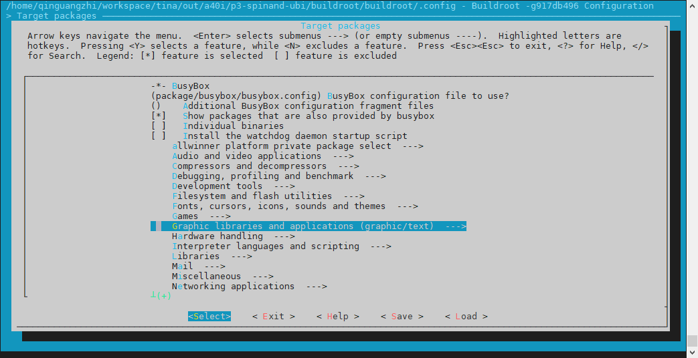
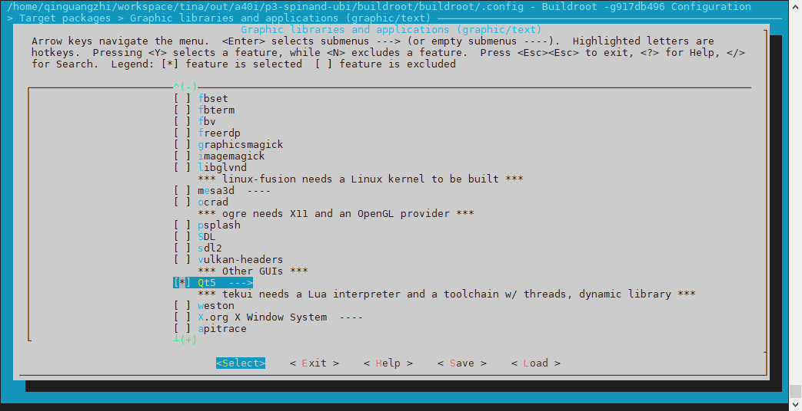
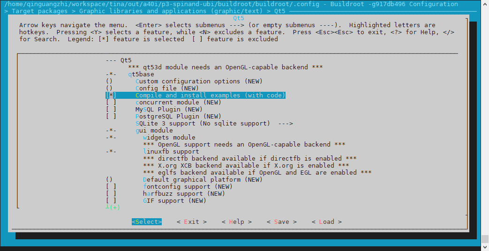
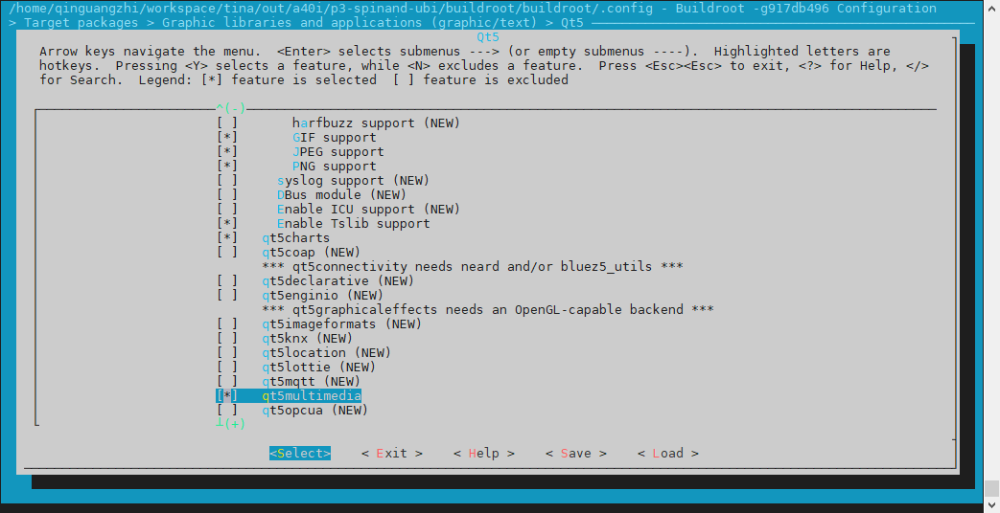
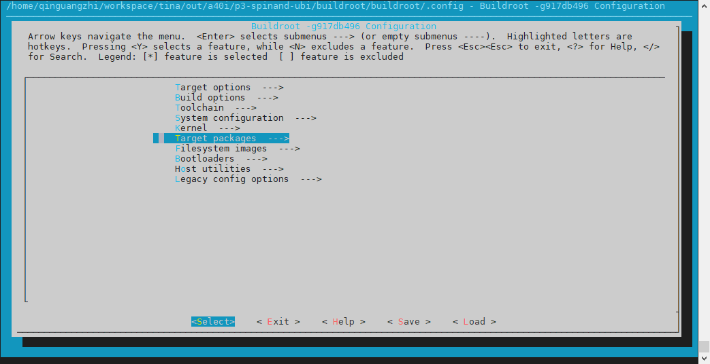
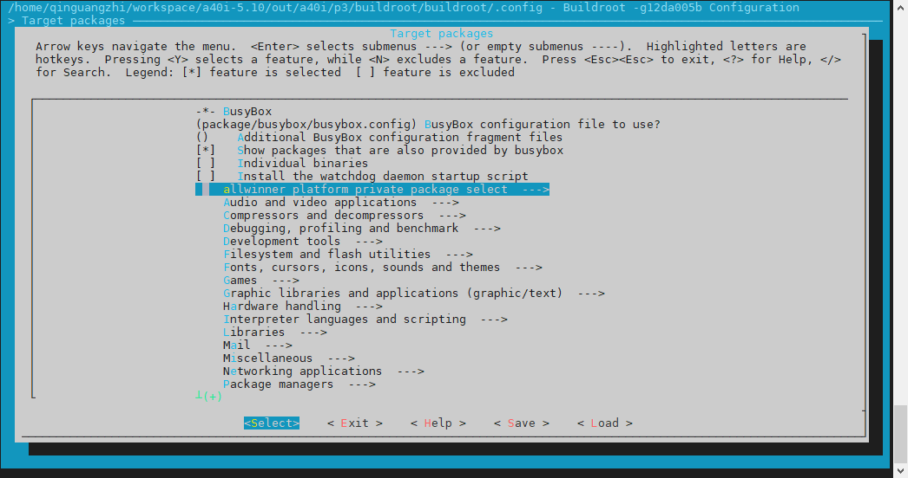
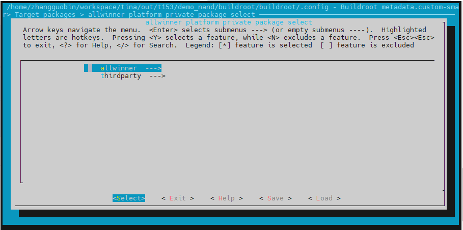
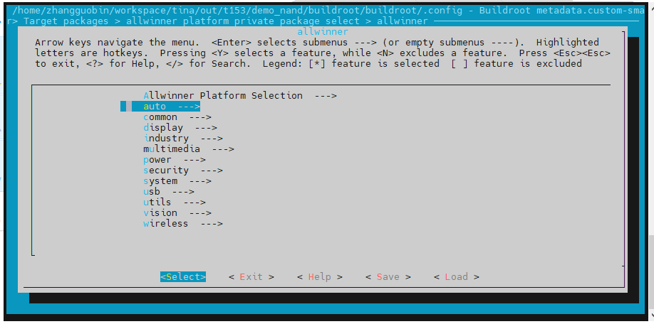
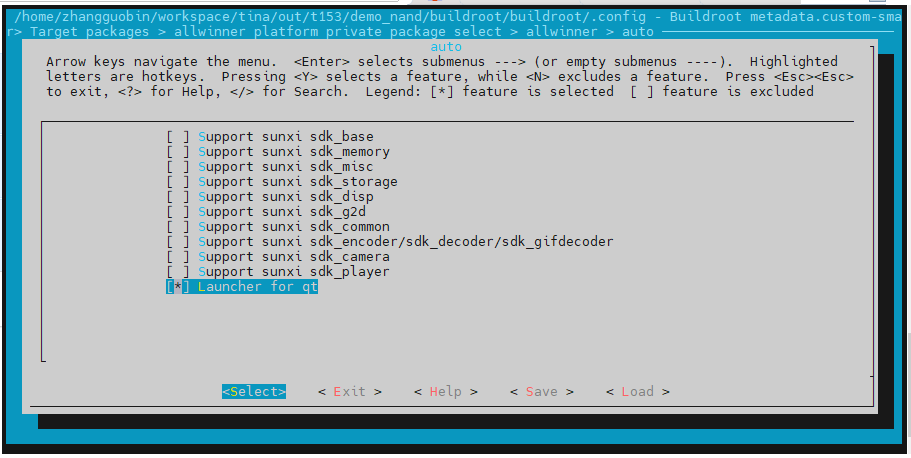
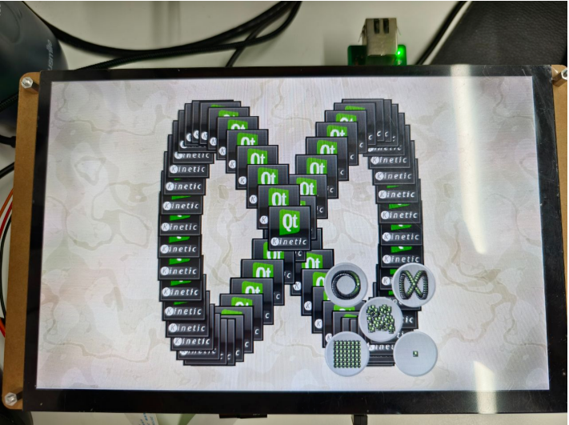

# Qt

:::info 文档说明

- **原始页数：** 20 页
- **文档版本：** 1.2
- **发布日期：** 2025-08-05
- **原始文件：** [查看或下载 PDF](/pdfs/T153MX/05-qt-guide.pdf)

正文按原始 PDF 的文本层、书签层级和页面顺序转换，仅移除重复页眉、页脚与水印，不改写技术内容。

:::

<!-- PDF page 5 -->

## 1 前言

### 1.1 文档简介

介绍基于Buildroot 文件系统的Qt 模块的使用方法，方便开发人员使用。

### 1.2 目标读者

Qt 模块的驱动开发/维护人员。

### 1.3 适用范围

全志T527、A40i、T3、T153 等芯片。

<!-- PDF page 6 -->

## 2 Qt适配介绍

### 2.1 前提

本次环境依赖如下：

| 软件 | 版本 |
| --- | --- |
| Buildroot | Buildroot-202205 |
| Qt5 | Qt-5.15（Buildroot 默认版本） |
| Qt_demo | demo-v1.0 |

### 2.2 主要介绍

南主要介绍Qt 系统以下几项。

- 如何在Buildroot 工具里编译Qt 动态库。

- 编译及运行Qt_demo 应用程序。

- 适配过程遇到的问题。

### 2.3 具体代码

root/config仓库

```text
./buildroot/qt_demo/launcher # Qt_demo配置
./buildroot/allwinner/system/busybox-init-base-files/etc/init.d # launcher运行
# buildroot/buildroot-202205仓库
./dl/qt5base
            # Qt 5.15源代码文件(buildroot自行根据配置官网下载的代码)
./dl/qt5multimedia # Qt 5.15源代码文件
./package/qt5
             # Qt 5.15编译配置
# buildroot/package/auto/Qt_demo仓库
./qt_demo
            # Qt_demo源码
```

<!-- PDF page 7 -->

### 2.4 模块配置介绍

#### 2.4.1 内核配置

Qt 依赖显示驱动，需要把显示驱动加载进来，具体配置请参考显示驱动指导指南说明。

#### 2.4.2 动态库配置

在项目根路径执行./build.sh buildroot_menuconfig（默认使用buildroot-202205 配置）进入配置页面。

- 首先，选择Target packages 选项进入下一级配置，如下图所示。


*图2-1: target-packages*

argetpackages项下选择Graphiclibrariesandapplications，如下图所示。

<!-- PDF page 8 -->



*图2-2: select-graphic-library*

- 在Graphic libraries and applications 配置项中选择Qt5, 如下图所示。

注意，如果服务器的gcc 版本较低，是不会显示Qt5 的，需按照提示更新到要求版本。



*图2-3: select-qt5*

- 在Qt5 中配置项下选择以下这些选项（这里选择基础配置）, 如下图所示。

<!-- PDF page 9 -->



*图2-4: qt5-select-1*



*图2-5: qt5-select-2*

以上操作会把一些基本能验证的Qt 动态库编译出来，下面的动作可以把修改的配置保存到配置文件。

```bash
# 以下路径均基于sdk所在路径为依据
cd buildroot/buildroot-202205/
make savedefconfig
```

注意：在项目跟路径执行./build.sh buildroot_saveconfig本质就是就执行上面的逻辑。

<!-- PDF page 10 -->

#### 2.4.3 Qt_demo-launcher配置

这个是用于测试Qt 环境的小程序，我们可以适配上去用于验证。

在项目根路径执行./build.sh buildroot_menuconfig（默认使用buildroot-202205 配置）进入配置页面。

- 首先，选择Target packages 选项进入下一级配置，如下图所示。



*图2-6: target-packages*

- 在Target packages 配置项下选择allwinner platform private package select，如下图所示。

<!-- PDF page 11 -->



*图2-7: select-allwinner-package*

- 在allwinner platform private package select 配置项中选择allwinner, 如下图所示。



*图2-8: select-allwinner*

- 在allwinner 配置项中选择auto, 如下图所示。

<!-- PDF page 12 -->



*图2-9: select-auto*

- 在auto 配置项中选择Launcher for Qt, 如下图所示。



*图2-10:select-launcher-qt*

以上操作会把一些基本能验证的Qt demo (launcher) 编译出来，下面的动作可以把修改的配置保存到配置文件。

```bash
# 以下路径均基于sdk所在路径为依据
cd buildroot/buildroot-202205/
make savedefconfig
```

<!-- PDF page 13 -->

## 3 模块使用范例

如下是在busybox 上增加一个开机自启动任务启动Qt-demo。

```bash
#
# buildroot/config/buildroot/allwinner/system/busybox-init-base-files/etc/init.d/S70launcher
#
case "$1" in
 start)
!-f"/usr/bin/Launcher"];then
    exit 1
   fi
   if [ -d "/usr/local/Qt_5.12.5" ];then
    export QTDIR=/usr/local/Qt_5.12.5
   else
    export QTDIR=/usr/lib
   fi
   if [ -d $QTDIR ];then
    export QT_ROOT=$QTDIR
    export PATH=$QTDIR/bin:$PATH
    export LD_LIBRARY_PATH=$QTDIR/lib:/usr/lib/cedarx/:$LD_LIBRARY_PATH
exportQT_QPA_PLATFORM_PLUGIN_PATH=$QT_ROOT/plugins
    export QT_QPA_PLATFORM=linuxfb:tty=/dev/fb0
    export QT_QPA_FONTDIR=$QT_ROOT/fonts
    TouchDevice=gt9xxnew_ts
    for InputDevices in /sys/class/input/input*
    do
      DeviceName=`cat $InputDevices/name`
      if [ "$DeviceName" == "$TouchDevice" ];then
       TouchDeviceNum=${InputDevices##*input}
       export QT_QPA_EVDEV_TOUCHSCREEN_PARAMETERS=/dev/input/event$TouchDeviceNum
       echo "add "/dev/input/event$TouchDeviceNum "to Qt Application."
       break
      fi
    done
    if [ ! -n "$TouchDeviceNum" ]; then
      echo "Error:Input device $TouchDevice can not be found,plz check it!"
    fi
    if [ -d "/usr/local/Qt_5.12.5" ];then # qt-5.12 use gpu
      export QT_QPA_PLATFORM=eglfs
      export QT_QPA_GENERIC_PLUGINS=evdevtouch
      export QT_QPA_EGLFS_INTEGRATION=eglfs_mali
    else
                    # qt-5.15 use fb
      export QT_QPA_FONTDIR=/usr/lib/fonts
      export QT_QPA_GENERIC_PLUGINS=tslib
      #export QT_QPA_GENERIC_PLUGINS=evdevmouse:/dev/input/event4
      export TSLIB_FBDEVICE=/dev/fb0
```

<!-- PDF page 14 -->

```bash
export TSLIB_CONSOLEDEVICE=none
      export TSLIB_TSDEVICE=/dev/input/event4
      export TSLIB_CONFFILE=/etc/ts.conf
      export TSLIB_CALIBFILE=/etc/pointercal
      export TSLIB_PLUGINDIR=/usr/lib/ts
    fi
    export QWS_MOUSE_PROTO=
    mkdir -p /dev/shm
    ulimit -c unlimited
    Launcher &
   fi
   ;;
 stop)
   ;;
 *)
   echo "Usage: $0 {start}"
it1
   ;;
esac
```

exit 0

<!-- PDF page 15 -->

## 4 测试验证

编译固件并烧录到样机中，系统启动后，如屏幕显示如图案，这表示Qt 应用程序及动态库运行正常。


*图4-1: launcher*

<!-- PDF page 16 -->

## 5 Qt自带程序验证

由于lanucher 的功能比较单一，无法显示Qt 更多的功能。我们可以使用Qt 自带的测试示例进行各种验证。

用例需要打开如下的配置（Compile and install example），才会编译对应的demo。


*图5-1: qt5-select-1*

编译好的实例在如下位置。

```text
/usr/lib/qt/examples
#注意,里面的demo能否都使用,需要依赖对应的动态库是否正确编译
```

在使用Qt 自带的实例前，需要修改etc/init.d/S70launcher，不让launcher 跑起来。防止被影

| 在样机重启后，导入对应 | Qt 的环境变量。 |
| --- | --- |
| export QT_QPA_PLATFORM=linuxfb:tty=/dev/fb0export QT_QPA_GENERIC_PLUGINS=tslib | # 显示终端配置# 触摸屏设置 |

执行examples 下的的应用程序，如

\\# /usr/lib/qt/examples/widgets/mainwindows/mainwindow/mainwindow

输入命令，若无报错信息，样机会显示画面，触控可以使用。

<!-- PDF page 17 -->

## 6 Qt适配使用eglfs显示后端

### 6.1 前提

在上述模块配置的前提下，额外打开如下的Buildroot 宏：

```text
BR2_PACKAGE_QT5BASE_OPENGL_ES2=y
ACKAGE_QT5BASE_EGLFS=y
```

可以使用如下命令来打开配置并且保存：

```text
./build.sh buildroot_menuconfig
./build.sh buildroot_saveconfig
```

在打开了这些相关配置项之后，Buildroot 构建系统会自动下载所需要的依赖包并编译

### 6.2 测试验证

如下目录，确定持的eglfs 后端：

```text
# ls usr/lib/qt/plugins/egldeviceintegrations/
libqeglfs-emu-integration.so
libqeglfs-kms-egldevice-integration.so
libqeglfs-kms-integration.so
libqeglfs-mali-integration.so
```

这里以kms 为例，执行如下步骤，配置eglfs：

1. 声明环境变量：

```text
bash
     export QT_QPA_PLATFORM=eglfs
                    export QT_QPA_EGLFS_INTEGRATION=eglfs_kms
                    export QT_QPA_EGLFS_KMS_CONFIG
```

/eglfs.json#该路径根据实际情况填写

2. 查看drm 实际节点：（这里看到是card0）

```text
bash
     # ls -alh /dev/dri/by-path/
                    total 0
                    drwxr-xr-x
                    2 root
                    root
                    100 Jan 1 00:00 .
                    drwxr-xr-x
                    3 root
                    root
                    120 Jan
1 00:00 ..
        lrwxrwxrwx
                  1 root
                    root
                    8 Jan 1 00:00 platform-1800000.gpu-card -> ../card1
                    lrwxrwxrwx
                    1 root
                    root
                    13
Jan 1 00:00 platform-1800000.gpu-render -> ../renderD128
                    lrwxrwxrwx
                    1 root
                    root
                    8 Jan 1 00:00 platform-soc@3000000:
```

sunxi-drm-card -&gt; ../card0

<!-- PDF page 18 -->

3. 编辑eglfs.json 文件，填写如下内容：（vi /media/eglfs.json）

```text
bash
     { "device": "/dev/dri/card0" } #card0为实际的drm节点
```

4. 运行测试demo，例如：

```text
bash
     # /usr/lib/qt/examples/widgets/animation/animatedtiles/animatedtiles
                    QFactoryLoader::QFactoryLoader() checking
directory path "/usr/lib/qt/plugins/platforms" ...
                    QFactoryLoader::QFactoryLoader() looking at "/usr/lib/qt/plugins/platforms
/libqeglfs.so"
           Found metadata in lib /usr/lib/qt/plugins/platforms/libqeglfs.so, metadata=
                    {
                    "IID": "org.qt-project.Qt.QPA
.QPlatformIntegrationFactoryInterface.5.3",
                    "MetaData": {
                    "Keys": [
                    "eglfs"
                    ]
                    },
                    "archreq": 1,
                    "
className": "QEglFSIntegrationPlugin",
                    "debug": true,
                    "version": 331520
                    }
                    ......
```



*图6-1:eglfs_demo*

<!-- PDF page 19 -->

## 7 FAQ

### 7.1 Q1：样机无Qt画面显示

优先考虑launcher 是都正常运行，通过查看ps 查看launcher 任务正常运行，

```text
# ps -a | grep Launcher
ootgrepLauncher
```

\\# 这样表示Qt demo有运行

如果后台没有运行launcher 没有运行，查看程序是否编译到样机上，或者运行的相关路径是否正确。

如果程序有在运行，但是无显示，可以查看显示驱动是否正常运行，或者Qt 启动的配置是否与该平台符合（如是否使能gpu，显示节点是否匹配等）

### 7.2 Q2：样机显示异常花屏

优先考虑是否硬件出现问题，如屏幕排线或者是否连接不稳等，使用同样的sdk 在其他样机查看，是否必现。

如果必现，同样优先让显示的同事使用显示自带接口调试驱动是否异常，若不行，就看Qt 程序和动态库使用端的问题。

<!-- PDF page 20 -->

权声明

本文档及内容受著作权法保护，其著作权由珠海全志科技股份有限公司（“全志”）拥有并保留一切权利。

本文档是全志的原创作品和版权财产，未经全志书面许可，任何单位和个人不得擅自摘抄、复制、修改、发表或传播本文档内容的部分或全部，且不得以任何形式传播。

商标声明

、

、

、

（不完全列

举）均为珠海全志科技股份有限公司的商标或者注册商标。在本文档描述的产品中出现的其它商标，产品名称，和服务名称，均由其各自所有人拥有。

免责声明

您购买的产品、服务或特性应受您与珠海全志科技股份有限公司（“全志”）之间签署的商业合同和条款的约束。本文档中描述的全部或部分产品、服务或特性可能不在您所购买或使用的范围内。使用前请认真阅读合同条款和相关说明，并严格遵循本文档的使用说明。您将自行承担任何不当使用行为（包括但不限于如超压，超频，超温使用）造成的不利后果，全志概不负责。

本文档作为使用指导仅供参考。由于产品版本升级或其他原因，本文档内容有可能修改，如有变

恕不另行通知。全志尽全力在本文档中提供准确的信息，但并不确保内容完全没有错误，因

使用本文档而发生损害（包括但不限于间接的、偶然的、特殊的损失）或发生侵犯第三方权利事件，全志概不负责。本文档中的所有陈述、信息和建议并不构成任何明示或暗示的保证或承诺。

本文档未以明示或暗示或其他方式授予全志的任何专利或知识产权。在您实施方案或使用产品的过程中，可能需要获得第三方的权利许可。请您自行向第三方权利人获取相关的许可。全志不承担也不代为支付任何关于获取第三方许可的许可费或版税（专利税）。全志不对您所使用的第三方许可技术做出任何保证、赔偿或承担其他义务。
