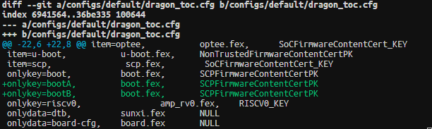

# OTA

:::info 文档说明

- **原始页数：** 87 页
- **文档版本：** 1.2
- **发布日期：** 2025-08-19
- **原始文件：** [查看或下载 PDF](/pdfs/T153MX/06-ota-guide.pdf)

正文按原始 PDF 的文本层、书签层级和页面顺序转换，仅移除重复页眉、页脚与水印，不改写技术内容。

:::

<!-- PDF page 8 -->

## 1 概述

OTA 是Over The Air 的简称，顾名思义就是通过无线网络从服务器上下载更新文件对本地系统或文件进行升级，便于客户为其用户及时更新系统和应用以提供更好的产品服务，这对于客户和消费者都极其重要。

### 1.1 编写目的

本文主要服务于使用Tina 软件平台的广大客户，以及帮助客户使用Tina 平台的OTA 升级系统并做二次开发。

### 1.2 适用范围

Allwinner 软件平台Tina5.0。

### 1.3 相关人员

适用Tina 平台的广大客户和关心OTA 的相关人员。

### 1.4 文档约定

本文升级针对分区，而不是文件系统里某个具体的文件。

### 1.5 相关术语介绍

- 主系统：由./build.sh 或者make 整体编译得到的内核镜像和rootfs 镜像组成的系统

- recovery 系统：专指swupdate_make_recovery_img 命令编译出来的recovery 镜像

<!-- PDF page 9 -->

### 1.6 OTA方案

#### 1.6.1 recovery系统方案

recovery 系统方案，是在主系统之外，增加一个recovery 系统。升级时，主系统负责升级recov-ery 系统，recovery 系统负责升级主系统。

这样如果升级中途发生掉电，也不会影响当前正在使用的这个系统。重启后仍可正常进入系统，继续完成升级。

一般recovery 系统会使用initramfs 功能，并大量裁剪不必要的应用，只保留OTA 必需的功能，

e 尽量减小。

recovery 系统方案优点：

1. recovery 系统可以做得比较小，对AB 系统节省flash 空间约40% 或更高。

recovery 系统方案缺点：

1. recovery 系统一般不包含主应用，所以OTA 期间，处于recovery 系统中时，无法为用户正常

提供服务。

2. 需要重启两次。

要维护两份系统配置，即主系统和recovery 系统。

#### 1.6.2 AB系统方案

AB 系统方案，是将原有的系统，增加一份。即flash 上总共有AB 两套系统。两套系统互相升级。OTA 时，若当前运行的是A 系统，则升级B 系统，升级完成后，设置标志，重启切换到B 系统。OTA 时，若当前运行的是B 系统，则升级A 系统，升级完成后，设置标志，重启切换到A 系统。

AB 系统方案优点：

新过程是在完整系统中进行的，更新期间可正常提供服务，用户无感知。最终做一次重启即

可。

2. 逻辑简单，只重启一次。

3. 只维护一套系统配置。

AB 系统方案缺点：

1. flash 占用较大，增加一倍的内核与rootfs 分区大小。

<!-- PDF page 10 -->

## 2 快速入门

在默认的SDK，都使用swupdate 去OTA；会提供一个配置好swupdate 功能的方案。

广大用户可以先基于此方案去使用。

OTA 的快捷命令封装于build/buildbase.sh，执行以下命令获取：

```bash
source build/envsetup.sh
```

说明

1、当前OTA 基于分区升级，需要方案定好分区数量和大小，量产后无法调整设备分区。

2、swupdate 未支持4G 以上的OTA 包，所以一些客户自身的资源应单独存放到一个新分区；然后通过其他方法升级，比如dd

命令。

! 注意

全文多次提及OTA 配置文件sw-description 和sw-subimgs.cfg 的目录，此处做汇总。

```text
openwrt:
target/{IC}/openwrt/{IC}-{BOARD}/swupdate #第一优先级
wrt/target/{IC}/{IC}-{BOARD}/swupdate#
第二优先级。后文以此路径举例
buildroot:
target/{IC}/buildroot/{BOARD}/swupdate/ #第一优先级。后文以此路径举例
device/config/chips/{IC}/configs/{BOARD}/buildroot/swupdate #第二优先级。
```

! 注意

对于开启了uboot 安全env 功能即uboot defconfig 开启了CONFIG_SUNXI_BOOT_ENV_INLINE=y 的方案；env.cfg 的中的bootcmd, boot_normal 已被屏蔽，修改不生效。需要在uboot defconfig 文修改

```text
CONFIG_SUNXI_BOOT_ENV_STRING 里面对应的变量，默认提供的方案都已修改好。下文依旧以env.cfg 举
```

例说明。

### 2.1 recovery系统整包升级

#### 2.1.1 配置

分区表指sys_partition.fex，nor 介质对应sys_partition_nor.fex

在分区表添加recovery 分区，size 根据实际的recovery.img 调节。

<!-- PDF page 11 -->

[partition]

```text
name
        = recovery
size
      = 65536
downloadfile = "recovery.fex"
user_type
         = 0x8000
```

env 默认是配置好的，查看是否有以下内容，有则跳过env 配置；没有则添加，然后配置boot_normal 命令，从$boot_partition 变量指定的分区加载系统。

```text
boot_partition=boot
root_partition=rootfs
```

#### 2.1.2 编译

系统编译：./build.sh或m-j64(openwrt)；

2. recovery 系统编译：swupdate_make_recovery_img -j64；产物是recovery.img

openwrt 构建编译的产物主要在：out/&#123;IC&#125;/&#123;BOARD&#125;/openwrt/

buildroot 构建编译的产物主要在：out/&#123;IC&#125;/&#123;BOARD&#125;/buildroot/

#### 2.1.3 OTA包

生成OTA 包前需要执行一遍打包命令；

非安全固件打包：

./build.sh pack或p；

安全固件打包：

./build.sh pack_secure或p -s；

2. 查看swupdate 配置文件，看有多少sw-subimgs-xxx.cfg 格式的文件。

oot 查看目录：/&#123;IC&#125;/buildroot/&#123;BOARD&#125;/swupdate/

openwrt 查看目录：openwrt/target/&#123;IC&#125;/&#123;IC&#125;-&#123;BOARD&#125;/swupdate

有些方案能看到sw-subimgs.cfg，此配置一般是recovery 系统的OTA 包配置，则生成OTA 包的命令为：

```text
swupdate_pack_swu
```

有些方案能看到sw-subimgs-recovery.cfg，则生成OTA 包的命令为：

<!-- PDF page 12 -->

```text
swupdate_pack_swu -recovery
```

执行成功最后的示OTA 包的文件。

#### 2.1.4 执行OTA

1. 将OTA 包推入设备端，如：

adb push xxx.swu /mnt/UDISK

2. 设备端使用swupdate_cmd.sh 升级：

```text
swupdate_cmd.sh -i /mnt/UDISK/xxx.swu -e stable,upgrade_recovery
参数说明：
-i: 指定设备端OTA包绝对路径
-e: 指定升级执行的步骤；与具体使用的sw-description有关，比如有些方案的参数是: -e stable,upgrade_recovery_emmc
```

### 2.2 AB系统整包升级

#### 2.2.1 配置

在分区表中，将原有的boot 分区和rootfs 分区，分区名改为bootA 和rootfsA。

将这两个分区配置拷贝一份，即新增两个分区，并把名字改为bootB 和rootfsB，downloadfile 不用改。

这样flash 中就存在A 系统(bootA+rootfsA) 和B 系统(bootB+rootfsB)。

在env 中，修改如下，表示烧录完默认从A 系统启动

```text
boot_partition=bootA
root_partition=rootfsA
```

并配置boot_normal 命令，从$boot_partition 变量指定的分区加载系统。

! 注意

对安全启方案AB 系统还要在dragon_toc.cfg 中增加对bootA、bootB 的签名配置；

<!-- PDF page 13 -->



*图2-1: 安全AB 系统配置*

#### 2.2.2 编译

主系统编译：./build.sh 或m -j64(openwrt)；

不用recovery 系统，所以不需要执行recovery 编译命令。

#### 2.2.3 OTA包

1. 在生成OTA 包前需要执行一遍打包命令；

全固件打包：

./build.sh pack或p；

安全固件打包：

./build.sh pack_secure或p -s；

2. 查看swupdate 配置文件，看有多少sw-subimgs-ab-xxx.cfg 格式的文件。

buildroot 查看目录：target/&#123;IC&#125;/buildroot/&#123;BOARD&#125;/swupdate/

wrt 查看目录：openwrt/target/&#123;IC&#125;/&#123;IC&#125;-&#123;BOARD&#125;/swupdate

有些方案能看到sw-subimgs-ab.cfg，则生成OTA 包的命令为：

```text
swupdate_pack_swu -ab
```

有些方案能看到sw-subimgs-ab-ubi.cfg，此配置用于ubi nand；则生成OTA 包的命令为：

```text
swupdate_pack_swu -ab-ubi
```

命令执行成功最后的log 提示OTA 包的文件。

<!-- PDF page 14 -->

#### 2.2.4 执行OTA

1. 将OTA 包推入设备端，如：

adb push xxx.swu /mnt/UDISK

2. 判断设备端当前所处系统；

使用fw_printenv 读取判断当前的boot_partition 和root_partition 的值。

```text
A系统：boot_partition=bootA, root_partition=rootfsA
```

：boot_partition=bootB,root_partition=rootfsB

3. 设备端使用swupdate_cmd.sh 升级：

```text
当前处于A系统：
swupdate_cmd.sh -i /mnt/UDISK/xxx.swu -e stable,now_A_next_B
当前处于B系统：
swupdate_cmd.sh -i /mnt/UDISK/xxx.swu -e stable,now_B_next_A
参数说明：
-i: 指定设备端OTA包绝对路径
-e: 指定升级执行的步骤；与具体使用的sw-description有关，比如有些方案的参数是: -e stable,now_A_next_B_emmc
```

### 2.3 AB系统差分升级

1. 配置、编译、OTA 整包生成的操作与AB 系统整包升级一致

2. 将第一次得到的AB 系统OTA 整包复制到SDK 根目录(SDK 其他目录也可)，重命名为base.swu

3. 修改内核、应用等，如添加打印；然后重新编译打包，生成新的AB 系统OTA 整包

4. 将上一步得到的OTA 整包复制到第2 步操作同等级目录，重命名为new.swu

5. 执行以下命令制作差分文件

date_make_deltabase.swunew.swu

6. 执行以下命令生成AB 系统差分包

```text
swupdate_pack_swu -ab-rdiff
```

7. 将OTA 包推入设备端，如：

<!-- PDF page 15 -->

adb push xxx.swu /mnt/UDISK

8. 设备端使用swupdate_cmd.sh 升级：

```text
当前处于A系统：
swupdate_cmd.sh -i /mnt/UDISK/xxx.swu -e stable,now_A_next_B
当前处于B系统：
swupdate_cmd.sh -i /mnt/UDISK/xxx.swu -e stable,now_B_next_A
```

<!-- PDF page 16 -->

## 3 Tina SWUpdate OTA介绍

### 3.1 swupdate介绍

#### 3.1.1 简介

date 是一个开源的TA 框架，提供了一种灵活可靠的方式来更新嵌入式系统上的软件。

官方源码：

https://github.com/sbabic/swupdate

官方文档：

http://sbabic.github.io/swupdate/

非官方翻译的中文文档：

https://zqb-all.github.io/swupdate/

源码自带文档：

解压swupdate-xxx.tar.xz，解压后的doc 目录下即为此版本源码附带的文档。

社区论坛：

https://groups.google.com/forum/#!forum/swupdate

#### 3.1.2 移植到openwrt的改动

移植到openwrt 主要做了以下修改：

置在openwrt/package/allwinner/system/swupdate。

- 仿照busybox，添加了配置项，可通过make menuconfig 直接配置。

- 添加patch，支持了更新boot0，uboot。

- 添加了自启动脚本。

- 默认启动progress 在后台，输出到串口。这样升级时会打印进度条。实际方案不需要的话，可

去除。客户应用可参考progress 源码，自行获取进度信息。

- 默认启动一个脚本swupdate_cmd.sh，负责完善参数，最终调用swupdate。脚本介绍详见后

续章节。

<!-- PDF page 17 -->

#### 3.1.3 移植到buildroot的改动

相对于openwrt，swupdate 移植到buildroot 系统，主要是软件包存放路径不同：

- 对于201902 版本：软件包位置在buildroot/buildroot-201902/package/swupdate。

- 对于202205 版本：软件包位置在buildroot/buildroot-202205/package/swupdate。

### 3.2 配置

#### 3.2.1 recovery系统介绍

若选用主系统+recovery 系统的方式，则需要一个recovery 系统。

recovery 系统是一个带initramfs 的kernel。

recovery 系统的内核配置由device/config/chips/&#123;IC&#125;/configs/&#123;BOARD&#125;/BoardConfig.mk 的LICHEE_KERN_DEFCONF_RECOVERY 指定。

在openwrt 环境下，该配置文件的路径在openwrt/target/xxx/xxx/defconfig_ota。

如果没有此文件，可以拷贝defconfig 为defconfig_ota，再做配置裁剪。

在buildroot 环境下，对应的recovery 配置文件可查看SDK 根目录.buildconfig文件中的LICHEE_BR_RAMFS_CONF 变量；实际配置的文件是：BoardConfig.mk；如存在以下内容：

```text
LICHEE_BR_VER:=201902
LICHEE_BR_RAMFS_CONF:=sunxi_recovery_ramfs_defconfig
```

则指定buildroot/buildroot-201902/configs/sunxi_recovery_ramfs_defconfig，配置具体方案时可将该文件拷贝一份为方案名字，再进行修改。

如果没有此文件，可以拷贝xxx_defconfig 为sunxiwxxpx_recovery_ramfs_defconfig，再做配置裁剪。

#### 3.2.2 系统配置命令

##### 3.2.2.1 openwrt环境

对于主系统，使用：

```bash
make menuconfig
```

配置结果保存在：

<!-- PDF page 18 -->

openwrt/target/xxx/xxx/defconfig

ecovery 系统，使用：

```bash
make ota_menuconfig
```

配置结果保存在：

openwrt/target/xxx/xxx/defconfig_ota

##### 3.2.2.2 buildroot环境

对于主系统，使用：

令需要在根目录下执行

```text
./build.sh buildroot_menuconfig
                    # 打开配置
./build.sh buildroot_saveconfig
                    # 保存配置
```

配置结果保存在：

buildroot/buildroot-xxx版本/configs/xxx_defconfig

对于recovery 系统，使用cbr 命令跳转到buildroot/buildroot-xx 版本目录后，使用：

```bash
make sunxxiwxx_recovery_ramfs_defconfig
                    # 根据具体方案配置选择
make menuconfig
make savedefconfig
```

结果保存在：

buildroot/buildroot-xx版本/configs/sunxxiwxx_recovery_ramfs_defconfig # 根据选择的方案保存配置

#### 3.2.3 主系统和recovery都需要的swupdate包

##### 3.2.3.1 openwrt环境

选上swupdate 包。

```text
Allwinner
          --> System ---> [*] swupdate
```

swupdate 中还有很多细分选项，一般用默认配置即可。需要的话可以做一些调整，比如裁剪掉网络部分。

swupdate 会依赖选中uboot-envtools 包，以提供用户空间读写env 分区的功能。

<!-- PDF page 19 -->

##### 3.2.3.2 buildroot环境

选上swupdate 包：

```text
Target packages ---> System tools ---> [*] swupdate
```

swupdate 中还有很多细分选项，一般用默认配置即可。需要的话可以做一些调整，比如裁剪掉网络部分。

另外在buildroot 环境中，swupdate 包依赖的其它软件包不会依赖选中，需要手动选中：

Target packages ---&gt; Hardware handling ---&gt; [*] u-boot tools

Target packages ---&gt; allwinner platform private package select ---&gt; system ---&gt; [*] ota-burnboot

tpackages---&gt;Libraries---&gt;Filesystem---&gt;-*-libconfig

nand 方案升级需要依赖的包：

Target packages ---&gt; Filesystem and flash utilities ---&gt; [*] mtd, jffs2 and ubi/ubifs tools

网络升级除了需要选中网络配置外，还需要依赖下面的包：

Target packages ---&gt; Libraries ---&gt; Networking ---&gt; [*] libcurl

差分升级除了选中swupdate的rdiff功能，需要依赖的包：

Target packages ---&gt; Libraries ---&gt; Networking ---&gt; [*] librsync

签名校验升级除了选中swupdate的签名校验升级功能，需要依赖的包:

tpackages---&gt;Libraries---&gt;Crypto---&gt;[*]opensslsupport

#### 3.2.4 主系统和recovery都需要的wifimanager daemon

如果想从网络升级，则需要启动系统自动联网。

一种实现方式是，使用wifimanager daemon。当然，如果用户自己在脚本或应用中去做联网，则不需要此选项。

openwrt环境中：

ner

Wireless ---&gt;-*- wifimanager-v2.0................................... Tina wifimanager-v2.0 ---&gt;

```text
-*- wifimanager-v2.0-lib........................... Tina wifimanager-v2.0 lib
 <*>
      wifimanager-v2.0-demo..................... Tina wifimanager-v2.0 app demo
-*- wirelesscommon............................. Allwinner Wi-Fi/BT Public lib
```

buildroot环境中：

Target packages ---&gt;allwinner platform private package select ---&gt;

wireless ---&gt;

<!-- PDF page 20 -->

```text
[*] wifimanager-v2.0
[*] wifimanager-v2.0-lib
[*]
    Tina wifimanager-v2.0-demo
-*- wireless_common
```

具体的模组需要参考实际情况配置。

#### 3.2.5 配置主系统

就以上提到的几个包，暂时没有只针对主系统的需要选的包。

#### 3.2.6 编译主系统

执行./build.sh 或m(openwrt 快捷命令) 即生成主系统。

./build.sh

#### 3.2.7 配置recovery系统

##### 3.2.7.1 内核配置

a5.0 中，都使用very 独立内核进行编译，需要在BoardConfig.mk 中添加以下配置。

```text
对于5.10以前的内核，一般使用的是：
LICHEE_KERN_DEFCONF_RECOVERY:=config-x.x-recovery
如果是5.10以上内核，一般使用的是：
LICHEE_KERN_DEFCONF_RECOVERY:=bsp_recovery_defconfig
```

在Tina5.0 中，recovery 的内核需要支持init ramdisk，以及gzip 格式的压缩ramdisk。内核配置bsp_recovery_defconfig 中需要选中下面的选项：

```text
CONFIG_BLK_DEV_INITRD=y
CONFIG_RD_GZIP=y
```

注意

在Tina5.0 中，recovery 的内核可以通过./build.sh recovery_menuconfig 配置；然后执行./build.sh recovery_saveconfig 保存

修改过后需要重新source、lunch。

按照上述修改后recovery 系统默认使用device/config/chips/xxx/configs/xxx/linux-xx/config-x.x-recovery 或bsp_recovery_defconfig。

<!-- PDF page 21 -->

##### 3.2.7.2 应用配置

在openwrt 环境中，在主系统的基础上，复制一份deconfig 为份deconfig_ota，并作裁剪，更改配置以下选项即可：

```bash
make ota_menuconfig
```

---&gt; Target Images[*] don't create rootfs.img for recovery

在buildroot 环境中，由BoardConfig.mk 的LICHEE_BR_RAMFS_CONF 配置指定recovery 的de-fconfig 之后选手相关软件包即可。

#### 3.2.8 编译recovery系统

要编译生成recovery 系统，可使用：

```text
swupdate_make_recovery_img
```

编译得到：

在openwrt环境中，编译后生成的文件是out/$&#123;LICHEE_IC&#125;/$&#123;LICHEE_BOARD&#125;/openwrt/recovery.img

在buildroot环境中，编译后生成的文件是out/$&#123;LICHEE_IC&#125;/$&#123;LICHEE_BOARD&#125;/buildroot/recovery.img

#### 3.2.9 配置env

本方案推荐使用env 来保存信息，不使用misc 分区。

uboot 会从env 分区读取启动命令，并根据启动命令来启动系统。只要我们能在用户空间改动到env，即可控制下次启动的系统。

openwrt 配置：

Utilities ---&gt;Boot Loaders ---&gt;

-*- uboot-envtools................. read/modify U-Boot bootloader environment

buildroot 配置：

Target packages ---&gt;Hardware handling ---&gt;

```text
[*] u-boot tools
[*] fw_printenv
 choose fw_env.config for emmc/nand --->
                    # 根据介质选择是否有备份env
```

<!-- PDF page 22 -->

##### 3.2.9.1 boot_partition变量

增加一个boot_partition 变量，用于指定要启动的内核所在分区。

配置env 主要是修改boot_normal 命令，将要启动的分区独立成boot_partition 变量。

即从：

```text
boot_normal=sunxi_flash read 43000000 boot;bootm 43000000
```

改成：

```text
boot_partition=boot
boot_normal=sunxi_flash read 43000000 ${boot_partition};bootm 43000000
```

这样可以通过控制boot_partition来直接选择下次要启动的系统，无需uboot 介入。uboot 只需按照boot_normal 启动即可。

对于recovery 方案，可设置boot_partition 为boot 或recovery。OTA 切换系统时，只需要改变此变量即可达到切换主系统和recovery 系统的目的。

对于AB 系统方案，可设置为boot_partition 为bootA 或bootB。OTA 切换系统时，只需要改变此变量即可达到切换kernel 的目的。

##### 3.2.9.2 root_partition变量

一个root_partition量，用于指定要启动的rootfs所在分区。

uboot 会解析分区表，找出此变量指定的分区并在cmdline 中指定root 参数。

例如，在env 中设置：

```text
root_partition=rootfs
```

则启动时uboot 会遍历分区表，找到名字为rootfs 的分区，假设找到的分区为/dev/mmcblk0p5，则在cmdline 中增加root=/dev/mmcblk0p5。

kernel 需要挂载rootfs 时，取出root 参数，则得知需要挂载/dev/nand0p4 分区。

ecovery 方案，就一直设置root_partition 为rootfs 即可。主系统需要从rootfs 分区读取数

据，而recovery 系统使用initramfs，无需从rootfs 分区读取数据即可正常运行OTA 应用等。当然，recovery 系统中要更新rootfs 的话，还是会访问(写入)rootfs 分区的，但这个动作就跟env 的root_partition 无关了。

对于AB 系统方案，可设置root_partition 为rootfsA 或rootfsB，以匹配不同的系统。OTA 切换系统时，只需要改变此变量即可达到切换rootfs 的目的。

<!-- PDF page 23 -->

#### 3.2.10 配置备份env

由于写入env 时断电，可能导致env 的数据被破坏，因此需要支持备份env。由于使用习惯，也可以继续使用单个env 分区，只是有掉电风险。

##### 3.2.10.1 方式： 增加env-redund分区

此方式是uboot 原生功能。虽然也需要修改sunxi 的env 读取代码进行适配，但总体读写逻辑是社区原生的。

启用方法：

1. 增加env-redund 分区。

将env 分区复制一份，分区名改为env-redund。

注意只是分区名修改为env-redund，其downloadfile 仍然指定为env.fex

2. 支持在打包时制作冗余env。

```text
tina5.0配置方式：
在device/config/chips/{IC}/configs/{BOARD}/BoardConfig.mk文件添加
LICHEE_REDUNDANT_ENV_SIZE:=0x20000
然重新source,lunch
```

注意事项：

启用上述选项之后，打包时会调用mkenvimage 工具来制作env，对env 的格式有一定要求。如注释和有效配置不能合并在一行。

若env-x.x.cfg 中存在类似如下配置

```text
bootcmd=run setargs_nand boot_normal#default nand boot
```

则需要改成：

ultnandboot

```text
md=runsetargs_nandboot_normal
```

3. 配置uboot 并重新编译uboot bin。

在对应方案的uboot defconfig 文件，如：

brandy/brandy-2.0/u-boot-xx版本/configs/sunxxiwxx_defconfig

中增加配置：

<!-- PDF page 24 -->

```text
CONFIG_SUNXI_REDUNDAND_ENVIRONMENT=y
CONFIG_SYS_REDUNDAND_ENVIRONMENT=y
CONFIG_SUNXI_ENV_REDUNDAND_PARTITION="env-redund"
CONFIG_ENV_SIZE=0x20000
```

重新编译uboot。

4. 修改fw_env.config

拷贝

brandy/brandy-2.0/u-boot-xx版本/tools/env/fw_env.config

到目标目录

```text
openwrt:
openwrt/target/{IC}/{IC}-{BOARD}/base-files/etc/ （若使用procd-init）
openwrt/target/{IC}/{IC}-{BOARD}/busybox-init-base-files/etc/ （若使用busybox-init）
buildroot-2022:
target/{IC}/buildroot/{BOARD}/overlay/etc（依赖buildroot对应defconfig开启BR2_ROOTFS_OVERLAY）
```

修改拷贝后的fw_env.config，增加备份env 的配置。

如果使用emmc 方案，例如原本最后一行为：

```text
/dev/by-name/env
                 0x0000
                    0x20000
```

则增加一行：

by-name/env-redund0x00000x20000

如果使用ubinand 方案，例如原本最后一行为：

```text
/dev/ubi0:env
             0x0
                 0x20000
                    0x20000
```

则增加一行：

```text
/dev/ubi0:env-redund 0x0
                    0x20000
                    0x20000
```

在buildroot-2019 环境中，fw_env.config 存放在buildroot/buildroot-201902/package/uboot-tools，makefile 根据选择的介质以及是否有备份env 的情况将fw_env.config 拷贝到小机端。

这样用户空间的fw_printenv 和fw_setenv 即可正确处理两份env。

#### 3.2.11 配置启动脚本

1. openwrt 环境procd-init 是默认配置好的。

busybox-init 需要手工配置下。

拷贝

<!-- PDF page 25 -->

openwrt/package/allwinner/system/busybox-init-base-files/files/etc/init.d/load_script.conf

openwrt/target/&#123;IC&#125;/&#123;IC&#125;-&#123;BOARD&#125;/busybox-init-base-files/etc/init.d/

并在其中添加一行：

```text
swupdate_autorun
```

2. buildroot 环境默认配置好

### 3.3 OTA包

OTA 包中，需要包含sw-description 文件，以及本次升级会用到的各个文件，例如kernel，rootfs。

整个OTA 包是cpio 格式，且要求sw-description 文件在第一个。

#### 3.3.1 OTA策略描述文件：sw-description

sw-description 文件是swupdate 官方规定的，OTA 策略的描述文件，具体语法可参考swupdate官方文档。

了几个示例：

在build/swupdate中

也可以自行为具体的方案编写描述文件：

在openwrt中，为openwrt/target/&#123;IC&#125;/&#123;IC&#125;-&#123;BOARD&#125;/swupdate/sw-description

在buildroot中，为target/&#123;IC&#125;/buildroot/&#123;BOARD&#125;/swupdate/sw-description

本文件在SDK 中的存放路径和名字没有限定，只要最终打包进OTA 包中，重命名为sw-description 并放在第一个文件即可。

#### 3.3.2 OTA包配置文件：sw-subimgs.cfg

sw-subimgs.cfg 是tina 提供的，用于指示如何生成OTA 包。

基本格式为

```text
swota_file_list=(
#表示把文件xxx拷贝到swupdate目录下，重命名为yyy，并把yyy打包到最终的OTA包中
xxx:yyy
)
```

<!-- PDF page 26 -->

```text
swota_copy_file_list=(
#表示把文件
xxx拷贝到swupdate目录下，重命名为yyy，但不把yyy打包到最终的OTA包中
xxx:yyy
)
```

swota_copy_file_list 存在的原因是，有一些文件我们只需要其sha256 值，而不需要文件本身。例如使用差分包配合readback handler 时，readback handler 需要原始镜像的sha256 值用于校验。

例子：

```text
swota_file_list=(
openwrt/target/${LICHEE_IC}/${LICHEE_IC}-${LICHEE_BOARD}/swupdate/sw-description-ab:sw-description
${LICHEE_PACK_OUT_DIR}/boot_package.fex:uboot
${LICHEE_PACK_OUT_DIR}/boot0_sdcard.fex:boot0
EE_PACK_OUT_DIR}/boot.fex:kernel
${LICHEE_PACK_OUT_DIR}/rootfs.fex:rootfs
)
```

tina 提供了几个示例：

```text
build/swupdate/sw-subimgs.cfg
                    # 普通系统，recovery系统，整包升级。这是其余demo的基础版本。
build/swupdate/sw-subimgs-ab.cfg
                    # 改为AB系统。
build/swupdate/sw-subimgs-secure.cfg
                    # 改为安全系统。
build/swupdate/sw-subimgs-ab-rdiff.cfg
                    # 改为AB方案，差分方案。
build/swupdate/sw-subimgs-readback.cfg
                    # 增加回读校验。
build/swupdate/sw-subimgs-sign.cfg
                    # 增加签名校验。
build/swupdate/sw-subimgs-ubi.cfg
                    # 改为ubi方案。
```

也可以自行为具体的方案编写配置文件：

nwrt中，为openwrt/target/&#123;IC&#125;/&#123;IC&#125;-&#123;BOARD&#125;/swupdate/sw-subimgs.cfg

在buildroot中，为target/&#123;IC&#125;/buildroot/&#123;BOARD&#125;/swupdate/sw-subimgs.cfg

名字需要命名为sw-subimg.cfg 或sw-subimgsxxx.cfg，其中xxx 可自定义。

这个限定主要是为了方便打包函数处理。在打包时，命令行传入参数xxx，则会使用sw-subimgsxxx.cfg 进行打包。

#### 3.3.3 OTA包生成：swupdate_pack_swu

ld 目录中提供了一个wupdate_pack_swu 函数。

可以参考该函数，自行实现一套打包swupdate 升级包的脚本。也可以直接使用，使用方式如下。

! 注意

生成OTA 包前需要先执行打包命令：pack

1. 准备好sw-descrition 文件，具体作用和语法请参考官方swupdate 说明文档，下文也有举例。

<!-- PDF page 27 -->

2. 准备好sw-subimgs.cfg 文件，里面需要每一行列出一个打包需要的子镜像文件，即内核，

rootfs 等。可以使用冒号分隔，前面为SDK 中的文件，后面为打包进OTA 包的文件名。若没有冒号则使用原文件名字。使用相对于tina 根目录的相对路径进行描述。其中第一个必须为sw-description。

3. 编译好所需的子镜像，例如主系统的内核和rootfs，recovery 系统等。

4. 执行swupdate_pack_swu 生成swupdate 升级包。

不带参数执行，则会在特定路径下寻找sw-subimgs.cfg，解析配置生成OTA 包。不带参数默认生成recovery 的OTA 包。

带参数-xx 执行，则会在特定路径下寻找sw-subimgs-xx.cfg，解析配置生成OTA 包。例如执行

date_pack_swu-sign则会寻找sw-subimgs-sign.cfg，如此方便配置多个不同用途的sw-gs-xx.cfg。

注：不同介质使用的boot0/uboot 镜像不同，swupate_pack_swu 需要sys_config.fex 中的stor-age_type 配置明确指出介质类型，才能取得正确的boot0.img 和uboot.img。

具体可直接查看build 目录中swupdate_pack_swu 的实现。参考build/buildbase.sh 文件。

### 3.4 recovery系统方案举例

#### 3.4.1 配置分区和env

在分区表中，增加一个recovery 分区，用于保存recovery 系统。

size 根据实际recovery 系统的大小，再加点裕量。

download_file 可以留空，因为OTA 第一步就是写入一个recovery 系统。

当然也可以配置上download_file，并在打包固件之前先编译好recovery 系统，一并打包到固件中，这样出厂就带recovery 系统，后续的OTA 执行过程，可以考虑不写入recovert 系统，用现成的，直接重启并升级主系统。

download_file 为recovery.fex，分区表添加recovery 参考：

[partition]

```text
name
        = recovery
size
      = 65536
downloadfile = "recovery.fex"
user_type
         = 0x8000
```

在env 中指定：

```text
boot_partition=boot
root_partition=rootfs
```

<!-- PDF page 28 -->

并配置boot_normal 命令，从$boot_partition 变量指定的分区加载系统。

#### 3.4.2 配置主系统

lunch 选择方案后，make menuconfig，选上swupdate。

#### 3.4.3 配置recovery系统

##### 3.4.3.1 内核配置

操作如下：

```bash
cd device/config/chips/{IC}/configs/{BOARD}/linux-x.x
cp config-5.4 config-5.4-recovery
                    # linux-5.4及以前环境
cp bsp_defconfig bsp_recovery_defconfig # linux-5.4以后环境
```

在device/config/chips/&#123;IC&#125;/configs/&#123;BOARD&#125;/buildroot 目录下，修改BoardConfig.mk 文件，linux-5.4 添加下面这行代码。

LICHEE_KERN_DEFCONF_RECOVERY:=config-5.4-recovery

linux-5.4 以后的内核添加面这行代码

LICHEE_KERN_DEFCONF_RECOVERY:=bsp_recovery_defconfig

添加后要回到根目录下，重新source，./build.sh config，重新选择方案。

recovery 的内核需要支持init ramdisk，以及gzip 格式的压缩ramdisk。内核配置bsp_recovery_defconfig 中需要选中下面的选项：

```text
CONFIG_BLK_DEV_INITRD=y
CONFIG_RD_GZIP=y
```

recovery 系统整个运行在ram 中，如果系统过大会无法启动，所以需要进行裁剪。将不必要的包尽量从recovery 系统的内核中去掉。

在根目录执行：

```text
./build.shrecovery_menuconfig#
    打开recovery 内核配置
./build.sh recovery_saveconfig # 保存recovery 内核配置
```

可以对recovery 系统的应用进行裁剪。

<!-- PDF page 29 -->

##### 3.4.3.2 openwrt环境

假设没有现成的recovery 系统配置，则我们从主系统配置修改得到。lunch 选择方案后，拷贝配置文件。

```text
cplat(快捷命令)
cp defconfig defconfig_ota
```

根据上文介绍，make ota_menuconfig 选上swupdate 等必要的配置。

recovery 系统整个运行在ram 中，如果系统过大会无法启动，所以需要进行裁剪。make ota_menuconfig，将不必要的包尽量从recovery 系统中去掉。

##### 3.4.3.3 buildroot环境

假设没有现成的recovery 系统配置，则我们从主系统配置修改得到。需要在根目录执行./build.sh config 选择方案后，拷贝配置文件。

recovery 的软件包配置在buildroot/buildroot-xx 版本/configs 目录下，如果没有方案对应配置，可以将sunxxiwxx_recovery_ramfs_defconfig 拷贝为当前方案配置。例：

```text
cp sunxxiwxx_defconfig sunxxiwxx_recovery_ramfs_defconfig
在device/config/chips/{IC}/configs/{BOARD}/buildroot目录下，修改BoardConfig.mk文件，添加下面这行代码。
LICHEE_BR_RAMFS_CONF=sunxxiwxx_recovery_ramfs_defconfig
```

后要回到根目录下，重新source，./build.shconfig，重新选择方案。

#### 3.4.4 准备sw-description

这里我们直接使用：

在openwrt中：

openwrt/target/&#123;IC&#125;/&#123;IC&#125;-&#123;BOARD&#125;/swupdate/sw-description

在buildroot中：

/&#123;IC&#125;/buildroot/&#123;BOARD&#125;/swupdate/sw-subimgs.cfg

内容如下，中文部分是注释，原文件中没有。

```text
/* 固定格式，最外层为software = { } */
software =
{
 /* 版本号和描述*/
 version = "0.1.0";
 description = "Firmware update for Tina Project";
```

/*

<!-- PDF page 30 -->

```text
* 外层tag，stable，
* 没有特殊含义，就理解为一个字符串标志即可。
* 可以修改，调用的时候传入匹配的字符串即可
*/
stable = {
```

/*

```text
* 内层tag，upgrade_recovery,
 * 当调用swupdate xxx -e stable,upgrade_recovery时，就会匹配到这部分，执行｛｝内的动作，
　* 可以修改，调用的时候传入匹配的字符串即可
 */
 /* upgrade recovery,uboot,boot0 ==> change swu_mode,boot_partition ==> reboot */
 upgrade_recovery = {
   /* 这部分是为了在主系统中，升级recovery系统，升级uboot和boot0 */
   /* upgrade recovery */
   images: ( /* 处理各个image */
    {
filename="recovery";/*
源文件是OTA包中的recovery
文件*/
      device = "/dev/by-name/recovery"; /* 要写到/dev/by-name/recovery节点中, 这个节点在tina上就对应recovery分
   区*/
      /*volume = "recovery";*/ /* 当使用ubinand方案时，需要将上面的device = "/dev/by-name/recovery";注释掉，
   修改为当前语句*/
      installed-directly = true; /* 流式升级，即从网络升级时边下载边写入, 而不是先完整下载到本地再写入，避免占用额
   外的RAM或ROM */
    },
    {
      filename = "uboot"; /* 源文件是OTA包中的uboot文件*/
      type = "awuboot"; /* type为awuboot，则swupdate会调用对应的handler做处理*/
    },
    {
      filename = "boot0"; /* 源文件是OTA包中的boot0文件*/
      type = "awboot0"; /* type为awuboot，则swupdate会调用对应的handler做处理*/
    }
;
   /* image处理完之后，需要设置一些标志，切换状态*/
   /* change swu_mode to upgrade_kernel,boot_partition to recovery & reboot*/
   bootenv: ( /* 处理bootenv，会修改uboot的env分区*/
    {
      /* 设置env:swu_mode=upgrade_kernel, 这是为了记录OTA进度*/
      name = "swu_mode";
      value = "upgrade_kernel";
    },
    {
      /* 设置env:boot_partition=recovery, 这是为了切换系统，下次uboot就会启动recovery系统(kernel位于recovery分
   区) */
      name = "boot_partition";
      value = "recovery";
    },
    {
      /* 设置env:swu_next=reboot, 这是为了跟外部脚本配合，指示外部脚本做reboot动作*/
      name = "swu_next";
      value = "reboot";
    }
    /* 实际有什么其他需求，都可以灵活增删标志来解决, 外部脚本和应用可通过fw_setenv/fw_printenv操作env */
    /* 注意，以上几个env，是一起在ram中修改好再写入的, 不会出现部分写入部分未写入的情况*/
   );
 };
```

/** 内层tag，upgrade_kernel,

<!-- PDF page 31 -->

```text
* 当调用swupdate xxx -e stable,upgrade_kernel时，就会匹配到这部分，执行｛｝内的动作，
　* 可以修改，调用的时候传入匹配的字符串即可。
 */
 /* upgrade kernel,rootfs ==> change sw_mode */
 upgrade_kernel = {
   /* upgrade kernel,rootfs */
   /* image部分，不赘述*/
   images: (
    {
      filename = "kernel";
      device = "/dev/by-name/boot";
      /*volume = "boot";*/
                    /* 当使用ubinand方案时，需要将上面的device = "/dev/by-name/boot";注释掉，修改为
   当前语句*/
      installed-directly = true;
    },
    {
      filename = "rootfs";
device="/dev/by-name/rootfs";
      /*volume = "rootfs";*/
                    /* 当使用ubinand方案时，需要将上面的device = "/dev/by-name/rootfs";注释掉，修改
   为当前语句*/
      installed-directly = true;
    }
   );
   /* change sw_mode to upgrade_usr,change boot_partition to boot */
   bootenv: (
    {
      /* 设置env:swu_mode=upgrade_usr, 这是为了记录OTA进度*/
      name = "swu_mode";
      value = "upgrade_usr";
    },
    {
      /* 设置env:boot_partition=boot, 这是为了切换系统，下次uboot就会启动主系统(kernel位于boot分区) */
      name = "boot_partition";
value="boot";
    }
   );
 };
```

/* 内层tag，upgrade_usr,

```text
当调用swupdate xxx -e stable,upgrade_usr时，就会匹配到这部分，执行｛｝内的动作，
  可以修改，调用的时候传入匹配的字符串即可*/
/* upgrade usr ==> clean ==> reboot */
upgrade_usr = {
```

/*

```text
* misc-upgrade的小容量方案，将usr拆成独立分区了。
　　　　　　* 这里我们不需要，如果保留的话，不做任何image操作即可。
     * 也可以彻底删除这一部分，并将上面的upgrade_usr改掉。
　　　　　　*/
```

/* upgrade usr */

```text
/* OTA结束，清空各种标志*/
/* clean swu_param,swu_software,swu_mode & reboot */
bootenv: (
 {
   name = "swu_param";
   value = "";
 },
 {
   name = "swu_software";
   value = "";
```

<!-- PDF page 32 -->

```text
},
    {
      name = "swu_mode";
      value = "";
    },
    {
      name = "swu_next";
      value = "reboot";
    }
   );
 };
};
/* 当没有匹配上面的tag，进入对应的处理流程时，则运行到此处。我们默认清除掉一些状态*/
/* when not call with -e xxx,xxx
                    just clean */
bootenv: (
   name = "swu_param";
   value = "";
 },
 {
   name = "swu_software";
   value = "";
 },
 {
   name = "swu_mode";
   value = "";
 },
 {
   name = "swu_version";
   value = "";
 }
```

```text
}
```

说明：

升级过程会进行两次重启。具体的：

（1）升级recovery 分区(recovery)，uboot(uboot)，boot0(boot0) 。设置boot_partition 为re-covery。

（2）重启，进入recovery 系统。

（3）升级内核(kernel) 和rootfs(rootfs) 。设置boot_partition 为boot。

（4）重启，进入主系统，升级完成。

#### 3.4.5 准备sw-subimgs.cfg

我们直接看下tina 默认的：

<!-- PDF page 33 -->

在openwrt环境中：

```text
wrt/target/{IC}/{IC}-{BOARD}/swupdate/sw-subimgs.cfg
、
sw-subimgs-ubi.cfg或sw-subimgs-recovery.cfg
```

在buildroot环境中：

target/&#123;IC&#125;/buildroot/&#123;BOARD&#125;/swupdate/sw-subimgs-recovery.cfg

以openwrt 为例。内容如下，中文部分是注释，原文件中没有。

```text
swota_file_list=(
#取得sw-description，放到OTA包中。
#注意第一行必须为sw-description。如果源文件不叫sw-description，可在此处加:sw-description做一次重命名
openwrt/target/${LICHEE_IC}/${LICHEE_IC}-${LICHEE_BOARD}/swupdate/sw-description-recovery:sw-description
#取得recovery.img，重命名为recovery，放到OTA包中。以下雷同
${LICHEE_PACK_OUT_DIR}/recovery.fex:recovery
#uboot.img和boot0.img是执行swupdate_pack_swu时自动拷贝得到的，需配置sys_config.fex中的storage_type，不配置则
可以参考此种写法
${LICHEE_PACK_OUT_DIR}/boot_package.fex:uboot
#注：boot0没有修改的话，以下这行可去除，其他雷同，可按需升级
${LICHEE_PLAT_OUT}/boot0.img:boot0
${LICHEE_PACK_OUT_DIR}/boot.fex:kernel
${LICHEE_PACK_OUT_DIR}/rootfs.fex:rootfs
#下面这行是给小容量方案预留的，目前注释掉
#${LICHEE_PLAT_OUT}//usr.img:usr
)
```

说明：

指明打包swupdate 升级包所需的各个文件的位置。这些文件会被拷贝到out 目录下，再生成swupdate OTA 包。

#### 3.4.6 编译OTA包所需的子镜像

编译kernel 和rootfs。

```bash
make -j<N>
```

编译recovery 系统。

```text
swupdate_make_recovery_img -j<N>
```

编译uboot。

muboot

打包，若需要升级boot0/uboot，则是必要步骤，打包会将boot0 和uboot 拷贝到out 目录下，并对头部参数等进行修改。生成的固件也可用于测试。注：如果希望生成的固件的recovery 分区是有系统的，则需要先编译recovery 系统，再打包。

pack / pack -s

生成OTA 包。因为我们使用的就是sw-subimgs.cfg，所以不同带参数。

<!-- PDF page 34 -->

注意，如果方案目录下存在sw-subimgs.cfg，则优先用方案目录下的。没有方案特定配置才

用build/swupdate 下的。如果需要升级boot0/uboot，需要配置好sys_config.fex中的stor-age_type 参数，swupdate_pack_swu 才能正确拷贝对应的boot0/uboot。

```text
swupdate_pack_swu
```

#### 3.4.7 执行OTA

##### 3.4.7.1 准备OTA包

对于测试来说，直接推入。

ushxxx.swu/mnt/UDISK

实际应用时，可从先从网络下载到本地，再调用swupdate，也可以直接传入url 给swupdate。

##### 3.4.7.2 调用swupdate

若使用原生的swupdate，则调用：

```text
swupdate -i /mnt/UDISK/<board>.swu -e stable,upgrade_recovery
```

但这样不会在自启动的时候帮我们准备好swupdate 所需的-e 参数。

可以使用辅助脚本：

```text
swupdate_cmd.sh -i /mnt/UDISK/xxx.swu -e stable,upgrade_recovery
```

### 3.5 AB系统方案举例

#### 3.5.1 配置分区和env

在分区表中，将原有的boot 分区和rootfs 分区，分区名改为bootA 和rootfsA。

将这两个分区配置拷贝一份，即新增两个分区，并把名字改为bootB 和rootfsB。

这样flash 中就存在A 系统(bootA+rootfsA) 和B 系统(bootB+rootfsB)。

一般是一个系统烧录两份。即分区表中的bootA 和bootB 都指定的boot.fex，rootfsA 和rootfsB都指定的rootfs.fex。

在env 中，指定：

<!-- PDF page 35 -->

```text
boot_partition=bootA
root_partition=rootfsA
```

并配置boot_normal 命令，从$boot_partition 变量指定的分区加载系统。

#### 3.5.2 配置主系统

##### 3.5.2.1 openwrt环境

lunch 选择方案后，make menuconfig，选上swupdate。

##### 3.5.2.2 buildroot环境

./build.sh config选择方案后，./build.sh buildroot_menuconfig以及./build.sh build-root_saveconfig 选择swupdate 以及相关依赖配置，并保存。

#### 3.5.3 配置recovery系统

AB 系统方案没有使用recovery 系统，无需配置和生成。

#### 3.5.4 准备sw-description

这里我们直接使用：

在openwrt环境中：

openwrt/target/&#123;IC&#125;/&#123;IC&#125;-&#123;BOARD&#125;/swupdate/sw-description-ab 或sw-description-ab-ubi

在buildroot环境中：

target/&#123;IC&#125;/buildroot/&#123;BOARD&#125;/swupdate/sw-description-ab

内容如下，中文部分是注释，原文件中没有。

```text
/* 固定格式，最外层为software = { } */
software =
{
 /* 版本号和描述*/
 version = "0.1.0";
 description = "Firmware update for Tina Project";
```

/*

```text
* 外层tag，stable，
* 没有特殊含义，就理解为一个字符串标志即可。
* 可以修改，调用的时候传入匹配的字符串即可。
```

<!-- PDF page 36 -->

```text
*/
stable = {
```

/*

```text
* 内层tag，now_A_next_B,
          * 当调用swupdate xxx -e stable,now_A_next_B时，就会匹配到这部分，执行｛｝内的动作，
        　* 可以修改，调用的时候传入匹配的字符串即可。
          */
          /* now in systemA, we need to upgrade systemB(bootB, rootfsB) */
          now_A_next_B = {
           /* 这部分是描述，当前处于A系统，需要更新B系统，该执行的动作。执行完后下次启动为B系统*/
           images: ( /* 处理各个image */
            {
              filename = "kernel"; /* 源文件是OTA包中的kernel文件*/
              device = "/dev/by-name/bootB"; /* 要写到/dev/by-name/bootB节点中, 这个节点在tina上就对应bootB分区*/
              /*volume = "bootB";*/
                    /* 当使用ubinand方案时，需要将上面的device = "/dev/by-name/bootB";注释掉，修改
           为当前语句*/
installed-directly=true;/*
流式升级，即从网络升级时边下载边写入
, 而不是先完整下载到本地再写入，避免占用额
```

外的RAM或ROM */

```text
},
  {
   filename = "rootfs"; /* 同上，但处理rootfs，不赘述*/
   device = "/dev/by-name/rootfsB";
   /*volume = "rootfsB";*/
                    /* 当使用ubinand方案时，需要将上面的device = "/dev/by-name/rootfsB";注释掉，修
改为当前语句*/
   installed-directly = true;
  },
  {
   filename = "uboot"; /* 源文件是OTA包中的uboot文件*/
   type = "awuboot"; /* type为awuboot，则swupdate会调用对应的handler做处理*/
  },
  {
   filename = "boot0"; /* 源文件是OTA包中的boot0文件*/
type="awboot0";/*type
为awuboot，则swupdate会调用对应的
handler做处理*/
  }
);
/* image处理完之后，需要设置一些标志，切换状态*/
bootenv: ( /* 处理bootenv，会修改uboot的env分区*/
  {
   /* 设置env:swu_mode=upgrade_kernel, 这是为了记录OTA进度, 对于AB系统来说，此时已经升级完成，置空*/
   name = "swu_mode";
   value = "";
  },
  {
   /* 设置env:boot_partition=bootB, 这是为了切换系统，下次uboot就会启动B系统(kernel位于bootB分区) */
   name = "boot_partition";
   value = "bootB";
  },
  {
   /* 设置env:root_partition=rootfsB, 这是为了切换系统，下次uboot就会通过cmdline指示挂载B系统的rootfs */
   name = "root_partition";
   value = "rootfsB";
  },
  {
   /* 兼容另外的切换方式，可以先不管*/
   name = "systemAB_next";
   value = "B";
  },
  {
```

/* 设置env:swu_next=reboot, 这是为了跟外部脚本配合，指示外部脚本做reboot动作*/

<!-- PDF page 37 -->

```text
name = "swu_next";
    value = "reboot";
   }
 );
};
```

/*

```text
* 内层tag，now_B_next_A,
 * 当调用swupdate xxx -e stable,now_B_next_A时，就会匹配到这部分，执行｛｝内的动作，
　* 可以修改，调用的时候传入匹配的字符串即可
 */
 /* now in systemB, we need to upgrade systemA(bootA, rootfsA) */
 now_B_next_A = {
   /* 这里面就不赘述了, 跟上面基本一致，只是AB互换了*/
   images: (
    {
      filename = "kernel";
device="/dev/by-name/bootA";
      /*volume = "bootA";*/
                    /* 当使用ubinand方案时，需要将上面的device = "/dev/by-name/bootA";注释掉，修改
   为当前语句*/
      installed-directly = true;
    },
    {
      filename = "rootfs";
      device = "/dev/by-name/rootfsA";
      /*volume = "rootfsA";*/
                    /* 当使用ubinand方案时，需要将上面的device = "/dev/by-name/rootfsA";注释掉，修
   改为当前语句*/
      installed-directly = true;
    },
    {
      filename = "uboot";
      type = "awuboot";
    },
{
      filename = "boot0";
      type = "awboot0";
    }
   );
   bootenv: (
    {
      name = "swu_mode";
      value = "";
    },
    {
      name = "boot_partition";
      value = "bootA";
    },
    {
      name = "root_partition";
      value = "rootfsA";
    },
    {
      name = "systemAB_next";
      value = "A";
    },
    {
      name = "swu_next";
      value = "reboot";
    }
   );
```

<!-- PDF page 38 -->

```text
};
 };
 /* 当没有匹配上面的tag，进入对应的处理流程时，则运行到此处。我们默认清除掉一些状态*/
 /* when not call with -e xxx,xxx
                    just clean */
 bootenv: (
   {
    name = "swu_param";
    value = "";
   },
   {
    name = "swu_software";
    value = "";
   },
   {
    name = "swu_mode";
    value = "";
   {
    name = "swu_version";
    value = "";
   }
 );
}
```

说明：

升级过程会进行一次重启。具体的：

（1）升级kernel 和rootfs 到另一个系统所在分区，升级uboot(uboot)，boot0(boot0) 。设置

partition 为切换系统。

（2）重启，进入新系统。

#### 3.5.5 准备sw-subimgs.cfg

我们直接看下tina 默认的：

在openwrt环境中：

openwrt/target/&#123;IC&#125;/&#123;IC&#125;-&#123;BOARD&#125;/swupdate/sw-subimgs-ab.cfg 或sw-subimgs-ab-ubi.cfg

在buildroot环境中：

target/&#123;IC&#125;/buildroot/&#123;BOARD&#125;/swupdate/sw-subimgs-ab.cfg

以openwrt 为例。内容如下，中文部分是注释，原文件中没有。

```text
swota_file_list=(
#取得sw-description-ab，重命名成sw-description，放到OTA包中。
#注意第一行必须为sw-description
openwrt/target/${LICHEE_IC}/${LICHEE_IC}-${LICHEE_BOARD}/swupdate/sw-description-ab:sw-description
#取得uboot.img，重命名为uboot，放到OTA包中。以下雷同
#uboot.img和boot0.img是执行swupdate_pack_swu时自动拷贝得到的，需配置sys_config.fex中的storage_type
${LICHEE_PLAT_OUT}/uboot.img:uboot
```

<!-- PDF page 39 -->

```text
#注：boot0没有修改的话，以下这行可去除，其他雷同，可按需升级
${LICHEE_PLAT_OUT}/boot0.img:boot0
${LICHEE_PACK_OUT_DIR}/boot.fex:kernel
${LICHEE_PACK_OUT_DIR}/rootfs.fex:rootfs
)
```

说明：

指明打包swupdate 升级包所需的各个文件的位置。这些文件会被拷贝到out 目录下，再生成swupdate OTA 包。

#### 3.5.6 编译OTA包所需的子镜像

ernel 和rootfs

```bash
make -j<N>
```

编译uboot。

muboot

打包，若需要升级boot0/uboot，则是必要步骤，打包会将boot0 和uboot 拷贝到out 目录下，并对头部参数等进行修改。生成的固件也可用于测试。

pack / pack -s

生成OTA 包。因为我们使用的是sw-subimgs-ab.cfg 或sw-subimgs-ab-ubi.cfg，所以调用时带参

或-ab-ubi。

注意，如果方案目录下存在sw-subimgs-ab.cfg，则优先用方案目录下的。没有方案特定配置才用build/swupdate 下的。

```text
swupdate_pack_swu -ab 或swupdate_pack_swu -ab-ubi
```

#### 3.5.7 执行OTA

##### 3.5.7.1 准备OTA包

对于测试来说，直接推入。

adb push &lt;board&gt;.swu /mnt/UDISK

实际应用时，可从先从网络下载到本地，再调用swupdate，也可以直接传入url 给swupdate。

<!-- PDF page 40 -->

##### 3.5.7.2 判断AB系统

对于AB 系统方案来说，必须判断当前所处系统，才能知道需要升级哪个分区的数据。

判断当前是处于A 系统还是B 系统。

方式一：直接使用fw_printenv 读取判断当前的boot_partition 和root_partition 的值。

##### 3.5.7.3 调用swupdate

若使用原生的swupdate，则调用：

```text
当前处于A系统：
swupdate -i /mnt/UDISK/<board>.swu -e stable,now_A_next_B
当前处于B系统：
swupdate -i /mnt/UDISK/<board>.swu -e stable,now_B_next_A
```

但这样不会在自启动的时候帮我们准备好swupdate 所需的-e 参数。

我们可以使用辅助脚本：

```text
当前处于A系统：
swupdate_cmd.sh -i /mnt/UDISK/<board>.swu -e stable,now_A_next_B
当前处于B系统：
swupdate_cmd.sh -i /mnt/UDISK/<board>.swu -e stable,now_B_next_A
```

### 3.6 辅助脚本swupdate_cmd.sh

为什么需要辅助脚本？

因为我们需要启动时能自动调用swupdate，自动传递合适的-e 参数给swupdate，需要在合适的时候调用重启。

具体可直接看下脚本内容。

其基本思路是，当带参数调用时，脚本从传入的参数中，取出”-e xxx,yyy” 部分，将其余参数原样保存为env 的swu_param 变量。

取出的”-e xxx,yyy” 中的xxx 保存到env 的swu_software 变量，yyy 保存为env 的swu_mode变量。

然后就取出变量，循环调用。

```text
swupdate $swu_param -e "$swu_software，$swu_mode"
```

sw-description 中可以通过改变env 的swu_software 和swu_mode 变量，来影响下次的调用参数。

<!-- PDF page 41 -->

实际应用时，可不使用此脚本，直接在主应用中，调用swupdate 即可。但要自行做好-e 参数的

#### 3.6.1 自适应nand/emmc

! 注意

此功能只是开发阶段测试使用；一般项目量产不会同时使用2 种存储介质都作为系统启动介质；普遍是一种介质作为系统启动，另外一种介质作为客户资源的存储介质。如：系统从nand 启动，emmc 作为客户多媒体资源存放的存储介质。则系统OTA 升级主要负责nand 升级，emmc 使用其他方法单独维护。

目前有很多方案有两种介质，所以在脚本中添加了可以区分nand/emmc 方案的升级命令。

工作原理：在升级包中包含两种介质(nand/emmc) 的升级包，主要就是boot0 使用的升级文件不同，将两种介质使用的所有文件全部打包进OTA 包中，通过该辅助脚本在输入的命令后添加后缀，用来区分nand/emmc 的介质，在策略描述文件中也包含两种介质的升级流程，不同的介质通过添加不同的后缀走不同的流程。例如：

```bash
get_flash_type()
{
 case "$(sed 's/ /\n/g' /proc/cmdline | awk -F= '/^root=/{print $2}')" in
 /dev/mmcblk*)
   echo emmc
   ;;
/ubi*)
   echo ubinand
   ;;
 /dev/nand*)
   echo rawnand
   ;;
#
  /dev/mtdblock*)
#
    echo nor
#
    ;;
 esac
}
diff --git a/swupdate_cmd.sh b/swupdate_cmd.sh
index b070e8b..141d149 100755
--- a/swupdate_cmd.sh
+++ b/swupdate_cmd.sh
@@ -89,8 +89,8 @@ mkdir -p /var/lock
  echo "swu_software $swu_software" >> /tmp/swupdate_param_file
  swu_mode=$(echo "$swu_param_e" | awk -F ',' '{print $2}')
#
   echo "swu_mode: ##$swu_mode##"
-#
   swu_mode=${swu_mode}_$(get_flash_type)
-#
   echo "swu_mode after fix to emmc/nand: ##$swu_mode##"
+
  swu_mode=${swu_mode}_$(get_flash_type)
+
  echo "swu_mode after fix to emmc/nand: ##$swu_mode##"
  echo "swu_mode $swu_mode" >> /tmp/swupdate_param_file
  fw_setenv -s /tmp/swupdate_param_file
  sync
```

<!-- PDF page 42 -->

利用get_flash_type()，通过cmdline 获取当前的介质，并在输入的命令后面添加emmc/nand 的

走不同的升级流程。例如：

```text
software =
{
 version = "0.1.0";
 description = "Firmware update for xxx Project";
 stable = {
   /* ------------------------- For emmc -------------------------*/
   /* now in systemA, we need to upgrade systemB(bootB, rootfsB) */
   now_A_next_B_emmc = {
```

images: (

```text
{
 filename = "kernelB";
 device = "/dev/by-name/bootB";
 installed-directly = true;
},
{
 filename = "rootfs";
 device = "/dev/by-name/rootfsB";
 installed-directly = true;
},
{
 filename = "uboot";
 type = "awuboot";
},
{
 filename = "boot0_emmc";
 type = "awboot0";
}
;
```

bootenv: (

```text
{
       name = "swu_mode";
       value = "writenv_now_A_next_B";
      }
    );
   }
..........
   now_A_next_B_ubinand = {
```

images: (

```text
{
 filename = "kernelB";
 volume = "bootB"
installed-directly=true;
},
{
 filename = "rootfs";
 volume = "rootfsB"
 installed-directly = true;
},
{
 filename = "uboot";
 type = "awuboot";
},
{
```

<!-- PDF page 43 -->

```text
filename = "boot0_nand";
   type = "awboot0";
 }
);
```

bootenv: (

```text
{
    name = "swu_mode";
    value = "writenv_now_A_next_B";
   }
 );
}
```

可以看出，上面为两个AB 升级的例子，从A 系统升级到B 系统，因为两个升级流程使用的boot0文件不同，分别在now_A_next_B 命令后添加_emmc 和_ubinand 后缀。

### 3.7 版本号

#### 3.7.1 使用方式

在sw-description 文件中，会配置一个版本号字符串，如：

```text
software =
{
 version = "1.0.0";
 ...
}
```

如果需要在升级时检查版本号，则可使用-N 参数，传入的参数代表小机端当前的版本号。如果不需要，则不传递-N 参数，忽略版本号即可。

swupdate 会进行比较，如果OTA 包中sw-description 文件配置的版本号小于当前版本号，则不允许升级。

如何在小机端保存，获取，更新版本号，需要自定义，swupdate 没有规定具体的方式。

#### 3.7.2 实现例子

可以按自己的逻辑维护版本号，不依赖系统env等，只需按照swupate 要求传递参数即可。

此处提供一种依赖系统env 的实现方式供参考。

1. 初始化设备端版本号。

首先需要定义设备端的版本号存放在哪，如何获取。

本方法定义设备端的版本号保存于env 之中，用swu_version 记录。

<!-- PDF page 44 -->

则在SDK 中，需在env-x.x.cfg 中添加一行：

```text
ersion=1.0.0
```

表示此时版本为1.0.0，烧录固件后可执行fw_printenv 查看。

此步骤如果不做，则第一次烧录固件后env 中不存在swu_version，调用swupdate 时也无法传入获得并版本号，则第一次升级时不会检查版本。

注：这是tina 自定义的，可修改。只要读写这个版本号的地方均配套修改即可。实际应用时版本号可以存在任意分区中，或者存放在文件系统的文件中，或者硬编码在系统和应用的二进制中，swupdate 未做限制。

2. 在sw-description 中，设置OTA 包版本号。

升级时如果检查到OTA 包的sw-description 中的version，小于通过-N 参数传入的版本号，则不允许升级。

```text
software =
{
 version = "2.0.0";
 ...
```

例如当设备端的env 中设置了swu_version=2.0.0，则调用swupdate_cmd.sh 时，会自动获取此参数并在调用swupdate 时传入-N 2.0.0。

此时若OTA 包中定义了version = “1.0.0” ，则此时升级会降低版本号，拒绝升级。

此时若OTA 包中定义了version = “2.0.0” ，则此次升级不会降低版本号，可以升级。

此时若OTA 包中定义了version = “3.0.0” ，则此次升级不会降低版本号，可以升级。

注：这是swupdate 原生的OTA 包版本号规则，不是tina 自定义的。

3. 更新设备端版本号。

本方式版本号定义在env 中，则升级kernel 和rootfs 分区不会自动更新版本号，需要主动修改env。

若版本号是记录于rootfs的某个文件，则不必在sw_description 中添加这种操作，因为更新rootfs 时版本号就自然更新了。但缺点是版本号跟rootfs 绑定了，每次OTA 必须升级rootfs 才能更新版本号。

添加一个设置version 代表swu_version 的env 操作，在OTA 时自动更新版本号。

```text
software =
{
 #表示这个OTA包的版本号，给swupdate读取检查的。原生规定的。
 version = "2.0.0";
 ...
```

<!-- PDF page 45 -->

bootenv: (

```text
...
      {
       #表示这个OTA包的版本号，OTA时会写入env分区，用于在下次OTA时读出作为-N参数的值。Tina自定义的。
       name = "swu_version";
       value = "2.0.0";
      }
      ...
    );
 ...
}
```

注意，这么做的话，更新版本时需要修改env 中的版本号，以使得新的固件包拥有新的版本号，以及更新sw-description 的两个位置，一处是最上面的version = xxx 的版本号，一处是bootenv操作中的版本号，以使得OTA 包拥有新的版本号，以及能在OTA 时写入新版本号。

4. 读取设备端版本号传给swupdate。

假如小机端是用脚本调用，则可用如下方式读取并传给swupdate：

```text
swu_version=$(fw_printenv -n swu_version)
swupdate ... -N $swu_version
```

更好的方式是判断非空才传入，如此可支持不在env 中提前配置好swu_version。

```bash
check_version_para=""
[ x"$swu_version" != x"" ] && {
 echo "now version is $swu_version"
ck_version_para="-N$swu_version"
}
swupdate ... $check_version_para
```

注：

如果不使用版本号，则不在env 中设置swu_version，也不在bootenv 中写swu_version 即可。

如果sw_description 中的版本号一直保持v1.0.0，也总是能升级。

### 3.8 签名校验

#### 3.8.1 检验原理

OTA 包中包含了sw-decsription 文件和各个具体的镜像，如kernel，rootfs。

如果对整个OTA 包进行完整校验，则会对流式升级造成影响，要求必须把整个OTA 包下载下来，才能判断出校验是否通过。

<!-- PDF page 46 -->

为了避免上述问题，swupdate 的校验是分镜像的，首先从OTA 包最前面取出两个文件，即sw-

description 和sw-description.sig，使用传入的公钥校验sw-description，校验通过则认为sw-description 可信，则说明其中描述的image 和sha256 也是可信的。

后续无需再使用公钥，直接校验每个镜像的sha256 即可。因此可以逐个镜像处理，无需全部下载完毕再处理。

#### 3.8.2 配置

swupdate 支持使用签名校验功能，需要在编译时选中对应功能。

出于安全考虑，一旦使能了校验，则swupdate 不再支持不使用签名的更新调用。

在openwrt中配置主系统：

```bash
make menuconfig --->
```

Allwinner ---&gt;System ---&gt;

```text
<*> swupdate --->
 SSL implementation to use (None) ---> (OpenSSL)
 [*] Enable verification of signed images
 Signature verification algorithm (RSA PKCS#1.5) --->(选择校验算法，此处以RSA为例)
```

注意，recovery系统也需要对应进行配置，即：

```bash
make ota_menuconfig ---> ...(重复以上配置)
```

droot环境中配置主系统：

```text
./build.sh buildroot_menuconfig
Target packages --->
```

System tools ---&gt;

```text
[*] swupdate --->
    SSL implementation to use (None) ---> (OpenSSL)
    [*] Enable verification of signed images
    Signature verification algorithm (None) ---> (RSA PKCS#1.5) (选择校验算法，此处以RSA为例)
recovery系统：
在buildroot/buildroot-xx版本/目录下执行make xxx_defconfig(recovery对应的defconfig配置)。
```

然后执行make menuconfig 更改配置，最后执行make savedefconfig 保存配置。

#### 3.8.3 使用方法

在PC 端使用私钥签名OTA 包。

在小机端调用swupdate 时，使用-k 参数传入公钥。

<!-- PDF page 47 -->

#### 3.8.4 初始化key

Tina 封装了一条命令，生成默认的密钥对。执行：

```text
swupdate_init_key
```

##### 3.8.4.1 openwrt环境

执行后会使用默认密码生成密钥对并拷贝到指定目录：

```text
密码/私钥/公钥：
password:openwrt/target/{IC}/{IC}-{BOARD}/swupdate/swupdate_priv.password
ekey:openwrt/target/{IC}/{IC}-{BOARD}/swupdate/swupdate_priv.pem
public key:openwrt/target/{IC}/{IC}-{BOARD}/swupdate/swupdate_public.pem
公钥拷贝到base-files中，供使用procd-init的方案使用
public key:openwrt/target/{IC}/{IC}-{BOARD}/base-files/swupdate_public.pem
公钥拷贝到busybox-init-base-files中，供使用busybox-init的方案使用
public key:openwrt/target/{IC}/{IC}-{BOARD}/busybox-init-base-files/swupdate_public.pem
```

##### 3.8.4.2 buildroot环境

执行后会使用默认密码生成密钥对并拷贝到指定目录：

```text
密码/私钥/公钥：
password:target/{IC}/buildroot/{BOARD}/swupdate/swupdate_priv.password
privatekey:target/{IC}/buildroot/{BOARD}/swupdate/swupdate_priv.pem
public key:target/{IC}/buildroot/{BOARD}/swupdate/swupdate_public.pem
公钥拷贝到busybox-init-base-files中，
public key:buildroot/config/buildroot/allwinner/system/busybox-init-base-files/etc/swupdate_public.pem
```

此步骤仅为方便调试使用，只需要做一次。

用户也可使用自己的密码自行生成密钥，生成密钥的具体命令可参考build/buildbase.sh 中swup-date_init_key 的实现：

```bash
local password="swupdate";
echo "$password" > swupdate_priv.password;
echo "-------------------- init priv key --------------------";
openssl genrsa -aes256 -passout file:swupdate_priv.password -out swupdate_priv.pem;
echo "-------------------- init public key --------------------";
openssl rsa -in swupdate_priv.pem -passin file:swupdate_priv.password -out swupdate_public.pem -outform PEM -
```

pubout;

如上，生成的密钥一般放到方案目录下，即可在打包OTA 包时自动使用。

主要就是调用openssl 生成，私钥拷贝到SDK 指定目录，供生成OTA 包时使用。公钥放到设备端，供设备端执行OTA 时使用。

密钥的作用是校验OTA 包，意味着拿到密钥的人即可生成可通过校验的OTA 包，因此正式产品中一般密钥只掌握在少数人手中，并采取适当措施避免泄漏或丢失。

<!-- PDF page 48 -->

一种可参考的实践方式是，正式密钥做好备份，并仅部署在有权限管控的服务器上，只能代码入

通过自动构建生成包，普通工程师无法拿到密钥自行本地生成用于正式产品的OTA 包。

目前脚本支持自动在生成OTA 包时，更新sha256 的值。但需要在sw-description 中，手工添加：

```text
sha256 = @文件名
```

如：

```text
$ git diff sw-description
diff --git a/sw-description b/sw-description
index ed04b64..467ac3b 100644
--- a/sw-description
+++ b/sw-description
@@ -9,14 +9,17 @@ software =
      {
filename="boot_initramfs_recovery.img"
       device = "/dev/by-name/recovery";
+
        sha256 = "@boot_initramfs_recovery.img"
      },
      {
       filename = "boot_package.fex"
       type = "awuboot";
+
        sha256 = "@boot_package.fex"
      },
      {
       filename = "boot0_nand.fex"
       type = "awboot0";
+
        sha256 = "@boot0_nand.fex"
      }
    );
4,10+37,12@@software=
      {
       filename = "boot.img";
       device = "/dev/by-name/boot";
+
        sha256 = "@boot.img"
      },
      {
       filename = "rootfs.img";
       device = "/dev/by-name/rootfs";
+
        sha256 = "@rootfs.img"
      }
    );
    bootenv: (
```

在打包OTA 包时，脚本自动算出sha256 的值，并替换到上述位置，再完成OTA 包的生成。

考：

```text
build/swupdate/sw-description-sign
build/swupdate/sw-subimgs-sign.cfg
注：
调用swupdate_pack_swu 则会使用sw-subimgs.cfg，其中默认指定了使用sw-description做为最终的sw-description。
调用swupdate_pack_swu -sign则会使用sw-subimgs-sign.cfg，其中默认指定了使用sw-description-sign做为最终的sw-
    description。
即关键还是看使用哪份sw-subimgs.cfg，以及sw-subimgs.cfg中如何指定。
```

<!-- PDF page 49 -->

#### 3.8.5 添加sw-description.sig

签名的OTA 包，需要生成签名文件sw-description.sig，并使其在OTA 包中，紧随在sw-description 后面。

目前脚本中自动处理。

#### 3.8.6 生成OTA包

方法不变，脚本中会检测defconfig 的配置，并自动完成签名等动作。

#### 3.8.7 将公钥放置到小机端

目前脚本中生成key 的时候，自动拷贝了。如需手工处理，可参考如下方式。

##### 3.8.7.1 openwrt环境

对于procd-init：

```text
cplat
mkdir -p ./base-files
update_public.pem./base-files/etc/
```

对于busybox-init

```text
cplat
mkdir -p ./busybox-init-base-files/
cp swupdate_public.pem ./busybox-init-base-files/etc/
```

##### 3.8.7.2 buildroot环境

对于busybox-init

ldrootconfig/buildroot/allwinner/system/busybox-init-base-files/etc/

cp &lt;SDK&gt;/target/&#123;IC&#125;/buildroot/&#123;BOARD&#125;/swupdate/swupdate_public.pem ./

#### 3.8.8 在小机端调用

在原本的命令基础上，加上-k /etc/swupdate_public.pem 即可，如：

```text
swupdate_cmd.sh -v -i /mnt/UDISK/xxx.swu -k /etc/swupdate_public.pem -e stable,upgrade_recovery
```

<!-- PDF page 50 -->

### 3.9 压缩

swupdate 支持对镜像先解压，再写入目标位置，当前支持gzip 和zstd 两种压缩算法。

#### 3.9.1 配置

使用gzip 压缩无需配置，使用zstd 则需选上

```bash
make menuconfig --> Allwinner ---> <*> swupdate --> [*] Zstd compression support
```

#### 3.9.2 生成压缩镜像

如果希望每次打包固件自动生成，则可修改build/pack，在function do_pack_linux() 函数的最后加上压缩的动作。

```text
生成gz镜像:
gzip -k -f boot.fex
gzip -k -f rootfs.fex
gzip -k -f recovery.fex #如果使用AB方案，则无需recovery
生成lzma镜像:
zstd -k -f boot.fex -T0
zstd -k -f rootfs.fex -T0
zstd -k -f recovery.fex -T0
```

对于lzma，若需要调整压缩率，可指定0-19 的数字(数字越大，压缩率越高，耗时越长)，如

```text
zstd -19 -k -f boot.fex -T0
zstd -19 -k -f rootfs.fex -T0
zstd -19 -k -f recovery.fex -T0
```

如果不希望每次打包固件多耗时间，则需自行在生成OTA 包之前，使用上述命令制作好压缩镜像。原始的boot.fex，rootfs.fex，recovery.fex 在out/&#123;IC&#125;/&#123;BOARD&#125;/openwrt(或buildroot)/目录下。

#### 3.9.3 sw-subimgs.cfg配置压缩镜像

以rootfs 为例，将原本未压缩的版本

$&#123;LICHEE_PACK_OUT_DIR&#125;/rootfs.fex:rootfs

改成压缩的

$&#123;LICHEE_PACK_OUT_DIR&#125;/rootfs.fex.gz:rootfs.gz

或

<!-- PDF page 51 -->

$&#123;LICHEE_PACK_OUT_DIR&#125;/rootfs.fex.zst:rootfs.zst

注：为了方便差分包的处理，此处约定压缩镜像需以.gz 或.zst 结尾，生成差分项的脚本会检查后缀名，并自动解压。

#### 3.9.4 sw-description配置压缩镜像

以rootfs 为例，将原本未压缩的版本

```text
{
 filename = "rootfs";
 device = "/dev/by-name/rootfs";
 installed-directly = true;
sha256="@rootfs";
},
```

换成

```text
{
 filename = "rootfs.gz";
 device = "/dev/by-name/rootfs";
 installed-directly = true;
 sha256 = "@rootfs.gz";
 compressed = "zlib";
},
```

或

```text
{
 filename = "rootfs.zst";
 device = "/dev/by-name/rootfsB";
 installed-directly = true;
 sha256 = "@rootfs.zst";
 compressed = "zstd";
},
```

### 3.10 调用OTA

swupdate_cmd.sh , 用于给swupdate 传入相关参数，切换更新状态，以及不断重试。

#### 3.10.1 进度条

swupdate 提供了progress 程序，该程序会在后台运行，从socket 获取进度信息，打印进度条到串口。

具体方案可参考其实现(在swupdate 源码中搜索progress)，自行在应用中获取进度，通过屏幕等其他方式进行指示。

<!-- PDF page 52 -->

#### 3.10.2 重启

1. 调用swupdate 的时候加上-p reboot，则swupdate 更新完毕后，会执行reboot。

2.swupdate_cmd.sh 支持检测env 中的swu_next 变量，如果为reboot，则脚本中执行reboot。

可在sw-description 中设置此变量。

3. 如果调用progress 的时候加上-r 参数，则progress 会在检测到更新完成后，执行reboot。

#### 3.10.3 本地升级示例

成的OTA 包推送到小机端，如放在/mnt/UDISK目录下。

PC 端执行：

adb push xxx.swu /mnt/UDISK

小机端执行(不带签名校验版本)：

```text
swupdate_cmd.sh -i /mnt/UDISK/xxx.swu -e stable,upgrade_recovery
```

小机端执行(带签名校验版本)：

```text
swupdate_cmd.sh -i /mnt/UDISK/xxx.swu -k /etc/swupdate_public.pem -e stable,upgrade_recovery
```

#### 3.10.4 网络升级示例

0.4 网络升级示例

启动服务器：

```bash
linux系统：
进入OTA包所在文件夹，如：
cd swupdate/
sudo python -m SimpleHTTPServer 80 #启动一个服务器
或
sudo python -m http.server 80
windows系统：
打开OTA包所在文件夹；然后按住Shift键，并点击鼠标右键，
择在此处打开Powershell
口，在窗口执行
sudo python -m http.server 80
```

小机端命令，使用-d -uxxx，xxx 为url。

例如(不带签名校验版本)：

```text
swupdate_cmd.sh -d -uhttp://192.168.35.112/xxx.swu -e stable,upgrade_recovery
```

例如(带签名校验版本)：

<!-- PDF page 53 -->

```text
swupdate_cmd.sh -d -uhttp://192.168.35.112/xxx.swu -k /etc/swupdate_public.pem -e stable,upgrade_recovery
```

需依赖外部程序，提供自动联网支持。OTA 本身不处理联网。

#### 3.10.5 错误处理

如何判断swupdate 升级出错？

1. 调用swupdate 时获得并判断返回值是否为0。

2. 读取env 变量recovery_status。根据swupdate 官方文档，swupdate 开始执行时，会

设置recovery_status=“progress”，升级完成会清除这个变量，升级失败则设置recov-

_status=“failed”

### 3.11 裁剪

swupdate 本身是可配置的, 不需要某些功能时，可将其裁剪掉。

```text
<*> swupdate --->
```

例如，不需要使用swupdate 来从网络下载OTA 包的话，则可将

[*] Enable image downloading

掉。

不需要更新boot0/uboot 的话，则将

Image Handlers ---&gt;

[*] allwinner boot0/uboot

取消掉

### 3.12 调试

#### 3.12.1 直接调用swupdate

目前swupdate_cmd.sh 主要有两个作用：

1. 自启动，无限重试。

2. 在主系统和recovery 系统中，传入不同的-e 参数给swupdate。

<!-- PDF page 54 -->

出问题时，可以不使用swupdate_cmd.sh，手工直接调用swupdate，在后面加上合适的-e 参

观察输出log。

如：

```text
swupdate -v -i xxx.swu -e stable,boot
swupdate -v -i xxx.swu -e stable,recovery
```

#### 3.12.2 手工切换系统

按上述env 的配置，启动的系统，是由boot_partition 变量控制的。

需要/var/lock在且可写。

切换到主系统：

```text
fw_setenv boot_partition boot
```

reboot

切换到recovery 系统：

```text
fw_setenv boot_partition recovery
```

reboot

观察当前变量：

fw_printenv

#### 3.12.3 更新boot0/uboot

目前更新boot0，uboot 实际功能是由另一个软件包ota-burnboot 完成的，swupdate 只是准备数据，并调用ota-burnboot 提供的动态库。

如果更新失败，先尝试手工使用ota-burnboot0 xxx 和ota-burnuboot xxx 能否正常更新。以确定是ota-burnboot 的问题，还是swupdate 的问题。

#### 3.12.4 解压OTA包

swupdate 的OTA 包，本质上是一个cpio 格式的包，直接使用通用的cpio 解包命令即可。

cpio -idv &lt; xxx.swu

<!-- PDF page 55 -->

#### 3.12.5 校验OTA包

当使能了签名校验，会对sw-description 签名生成sw-description.sig，如果校验失败，可以在PC 端手工验证下：

使用RSA 时，build/envsetup.sh 中调用的命令是：

openssl dgst -sha256 -sign "$priv_key_file" $password_para "$SWU_DIR/sw-description" &gt; "$SWU_DIR/sw-description.

sig"

则对应的密钥验证签名命令为：

```text
openssl dgst -prverify swupdate_priv.pem -sha256 -signature sw-description.sig sw-description
```

验证签名的命令为：

```text
openssl dgst -verify swupdate_public.pem -sha256 -signature sw-description.sig sw-description
```

### 3.13 测试固件示例

#### 3.13.1 生成方式

一般而言，测试需要两个有差异的OTA 包，如，uboot 和kernel 的log 有差异，rootfs 的文件有差异。

方法测试人员根据判断是否升级成功。

##### 3.13.1.1 准备工作

如果需要网络更新，OTA 不负责联网，所以需要选上wifimanager。

在openwrt中：

```text
Allwinner
---> Wireless
```

---&gt; -*- wifimanager-v2.0................................... Tina wifimanager-v2.0 ---&gt;

```text
-*- wifimanager-v2.0-lib........................... Tina wifimanager-v2.0 lib
 <*>
      wifimanager-v2.0-demo..................... Tina wifimanager-v2.0 app demo
-*- wirelesscommon............................. Allwinner Wi-Fi/BT Public lib
```

在buildroot环境中：

Target packages ---&gt;allwinner platform private package select ---&gt;

wireless ---&gt;

```text
[*] wifimanager-v2.0
[*] wifimanager-v2.0-lib
[*]
    Tina wifimanager-v2.0-demo
-*- wireless_common
```

<!-- PDF page 56 -->

具体的模组需要参考实际情况配置。

##### 3.13.1.2 生成固件1和OTA包1

重新编译boot，使得编译时间更新：

mboot

创建文件以标记rootfs;

重新编译recovery 系统：

```text
swupdate_make_recovery_img
```

重新编译打包，使得编译时间更新：

mp -j32

生成OTA 包1：

```text
swupdate_pack_swu
```

将得到产物重命名为OTA1.swu

##### 3.13.1.3 生成固件2和OTA包2

重新编译uboot，使得编译时间更新：

muboot

创建文件以标记rootfs;

重新编译recovery 系统：

```text
swupdate_make_recovery_img
```

重新编译打包，使得编译时间更新：

mp -j32

OTA 包2：

```text
swupdate_pack_swu
```

将得到产物重命名为OTA2.swu

#### 3.13.2 使用方式

任意选择一个OTA 固件烧录后，可在此基础上进行本地升级或网络升级。

<!-- PDF page 57 -->

##### 3.13.2.1 本地升级方式

PC 端执行：

adb push OTA1.swu /mnt/UDISK

小机端执行：

```text
swupdate_cmd.sh -i /mnt/UDISK/OTA1.swu
```

##### 3.13.2.2 网络升级方式

搭建服务器：

```bash
sudo python -m http.server 80
```

小机端联网：

wifi -c 账号密码

小机端执行：

```text
swupdate_cmd.sh -d -uhttp://192.168.xxx.xxx/OTA1.swu
```

注明：启动后会自动联网，连网后等待OTA 后台脚本尝试更新。中途掉电重启后，正常会在启动后几十秒内，成功联网并开始继续更新。

##### 3.13.2.3 升级过程

升级过程会进行两次重启。具体的：

（1）升级recovery分区(boot_initramfs_recovery.img)，uboot(boot_package.fex)，boot0(boot0_nand.fex)。

（2）重启，进入recovery 系统。

（3）升级内核(boot，img) 和rootfs(rootfs.img)。

重启，进入主系统，升级完成。

##### 3.13.2.4 判断升级

从log 中的时间和rootfs 文件可以判断当前运行的版本。

<!-- PDF page 58 -->

### 3.14 升级定制分区

如果定制了一个分区，并需要对此分区进行OTA，则需要：

1. 确认需不需要备份。

2. 将分区文件加入OTA 包。

3. 确定升级策略，在sw-description 中增加对此分区的处理。

#### 3.14.1 备份

在OTA 过程随时可能掉电，如果掉电时正在升级分区mypart，则重启后mypart 的数据是不完整的。

是否需要备份主要取决于mypart 所保存的文件是否影响继续进行OTA。

例如mypart 中保存的是开机音乐，被损坏的结果只是开机无声音，但开机后能正常继续OTA，则无需备份。

例如mypart 中保存的是应用，且OTA 中途掉电后重启，需要应用负责联网从网络重新下载OTA包，则需要备份，否则无法继续OTA，设备就无法恢复了。

例如mypart 中保存的是dsp，启动过程没有有效的dsp 镜像会无法启动，则需要备份，否则无法

也就无法继续OTA备就无法恢复了。

#### 3.14.2 无需备份

假设分区表中定义了：

[partition]

```text
name
        = mypart
size
      = 512
downloadfile = "mypart.fex"
user_type
         = 0x8000
```

放在：

my_dir/mypart.fex

则在sw-subimg.cfg 中增加一行（注意要放到sw-description 之后，因为sw-description 必须是第一个文件），将mypart.fex 打包到OTA 包中，重命名为mypart：

my_dir/mypart.fex:mypart

在sw-description 中增加升级动作的定义。例如可以在升级rootfs 之后，升级该分区：

<!-- PDF page 59 -->

```text
software =
{
 ...
 stable = {
   ...
   upgrade_kernel = {
```

images: (

```text
...
{
 filename = "rootfs";
 device = "/dev/by-name/rootfs";
 installed-directly = true;
},
{
 filename = "mypart";
 device = "/dev/by-name/mypart";
 installed-directly = true;
}
```

...

```text
);
...
```

#### 3.14.3 需要备份

在分区表中定义好两个分区，这样升级过程掉电，总有一份是完整的。

[partition]

```text
name
        = mypart
size
      = 512
downloadfile = "mypart.fex"
_type=0x8000
```

[partition]

```text
name
        = mypart-r
size
      = 512
downloadfile = "mypart.fex"
user_type
         = 0x8000
```

文件放在：

my_dir/mypart.fex

则在sw-subimg.cfg 中增加一行（注意要放到sw-description 之后，因为sw-description 必须是第一个文件），将mypart.fex 打包到OTA 包中，重命名为mypart：

r/mypart.fex:mypart

有两个分区，则需要条件决定使用哪一个，可考虑在env 中定义一个变量：

```text
mypart_partition=mypart
```

使用mypart 时，要先读取env 的mypart_partition 的值来决定要使用哪个分区。

在sw-description 中，定义好要升级的分区和bootenv，保证每次升级那个未在使用的分区。这样即使掉电也无妨。

<!-- PDF page 60 -->

```text
software =
{
 ...
 stable = {
   upgrade_recovery = {
```

images:

```text
{
    filename = "recovery";
    device = "/dev/by-name/recovery";
    installed-directly = true;
   },
/* 更新mypart-r，此时掉电，mypart分区是完整的*/
   {
    filename = "mypart-r";
    device = "/dev/by-name/mypart-r";
    installed-directly = true;
   }
 );
 bootenv: (
   {
    name = "swu_mode";
    value = "upgrade_kernel";
   },
   {
    name = "boot_partition";
    value = "recovery";
   },
/* 设置这个env，指示下次启动，即启动到recovery分区时，配套使用mypart-r */
   {
    name = "mypart_partition";
    value = "mypart-r";
   },
{
    name = "swu_next";
    value = "reboot";
   }
 );
};
upgrade_kernel = {
```

images: (

```text
{
    filename = "kernel";
    device = "/dev/by-name/boot";
    installed-directly = true;
   },
   {
    filename = "rootfs";
    device = "/dev/by-name/rootfs";
    installed-directly = true;
   },
/* 更新mypart，此时掉电，mypart分区还是完整的*/
   {
    filename = "mypart-r";
    device = "/dev/by-name/mypart-r";
    installed-directly = true;
   }
 );
 bootenv: (
```

<!-- PDF page 61 -->

```text
{
      name = "swu_mode";
      value = "upgrade_usr";
    },
 /* 设置这个env，指示下次启动，即启动到正常系统时，使用mypart */
    {
      name = "mypart_partition";
      value = "mypart";
    },
    {
      name = "boot_partition";
      value = "boot";
    }
   );
 };
...
```

### 3.15 handler说明

此处只对一些handler 做简介。

具体的handler 的用法，请参考swupdate 官方文档说明。

#### 3.15.1 awboot

1.1 nand/emmc

全志拓展的handler，用于支持升级全志boot0 和uboot，实质上会调用外部的ota-burnboot 包完成升级。

##### 3.15.1.1 nand/emmc

使用方式：

选上handler 支持：

```text
<*> swupdate --->
 Image Handlers -->
[*]allwinnerboot0/uboot
```

注意，recovery 系统也需要对应进行配置;

在sw-description 中指定type 即可：

```text
{
 filename = "uboot"; /* 源文件是OTA包中的uboot文件*/
 type = "awuboot"; /* type为awuboot，则swupdate会调用对应的handler做处理*/
},
{
 filename = "boot0"; /* 源文件是OTA包中的boot0文件*/
```

<!-- PDF page 62 -->

```text
type = "awboot0"; /* type为awuboot，则swupdate会调用对应的handler做处理*/
}
```

##### 3.15.1.2 nor

对于nor 方案，升级boot0/uboot 有掉电风险。如确需升级，可直接配置合适偏移即可，不使用awboot handler。

例如已知boot0 存放在偏移为0 处，uboot 存放在偏移为24k 处，则配置：

```text
{
 filename = "boot0";
 device = "/dev/mtdblock0";
alled-directly=true;
},
{
 filename = "uboot";
 device = "/dev/mtdblock0";
 offset = "24k"
 installed-directly = true;
}
```

#### 3.15.2 readback

用于支持在sw-description 中配置sha256，在升级后读出数据进行校验。

一种应用场景是，在AB 系统差分升级时，应用差分包后读出校验，以确认差分得到的结果是对的，再切换系统。

需选上对应handler。

openwrt环境：

```bash
make menuconfig/make ota_menuconfig
--> Allwinner
```

System ---&gt;

```text
--> swupdate
 --> <*> Allow to add sha256 hash to each image
 --> Image Handlers
```

--&gt; [*] readback

oot环境：

```text
./build.sh buildroot_menuconfig
--> Target packages
```

--&gt; System tools

```text
--> swupdate
 --> [*] Allow to add sha256 hash to each image
 Image Handlers --->
```

--&gt; [*] readback

上面为主系统的配置方式，recovery系统配置方案请参考recovery配置。

<!-- PDF page 63 -->

##### 3.15.2.1 示例

```text
build/swupdate/sw-description-readback
build/swupdate/sw-subimgs-readback.cfg
```

#### 3.15.3 ubi

用于ubi 方案。

需先选上MTD 支持：

openwrt/buildroot环境：

```bash
make menuconfig
--> swupdate
```

--&gt; Swupdate Settings---&gt; General Configuration---&gt; [*] MTD support

注意：buildroot系统需要选中依赖的MTD包：

Target packages ---&gt;Filesystem and flash utilities ---&gt;

[*] mtd, jffs2 and ubi/ubifs tools

再选上对应handler：

wrt/buildroot环境：

```bash
make menuconfig
--> swupdate
```

--&gt; Image Handlers--&gt; [*] ubivol

##### 3.15.3.1 示例

请参考：

```text
build/swupdate/sw-subimgs-ubi.cfg
build/swupdate/sw-description-ubi
```

最后使用swupdate_pack_swu -ubi 命令打包OTA 包

#### 3.15.4 rdiff

rdiff handle 用于差分包升级。

需选上对应handler：

<!-- PDF page 64 -->

openwrt/buildroot系统：

```bash
make menuconfig
--> swupdate
```

--&gt; Image Handlers--&gt; [*] rdiff

\\#若使用AB系统方案，则无recovery系统，则make ota_menuconfig的配置可不做。

在buildroot系统中需要选中对应的lib：

Target packages ---&gt;Libraries ---&gt;

Networking ---&gt;[*] librsync

4.1特性

##### 3.15.4.1 特性

在https://librsync.github.io/page_rdiff.html 中指出

rdiff cannot update files in place: the output file must not be the same as the input file.

即不支持原地更新，即应用差分包将A0 更新成A1，需要有足够空间存储A0 和A1，不能直接对A0 进行改动。

rdiff does not currently check that the delta is being applied to the correct file. If a delta is applied to the wrong basis file,

the results will be garbage.

不校验原文件，如果将差分包应用于错误的文件，则会得到无效的输出文件，但不会报错。

The basis file must allow random access. This means it must be a regular file rather than a pipe or socket.

原文件必须支持随机访问，因此不能从管道或socket 中获取原文件。

更多介绍请参考：https://librsync.github.io/

##### 3.15.4.2 示例

首先需要将方案修改为AB 系统的方案，请参考上文的“AB 系统方案举例”。

date 的配置文件请参考：

```text
build/swupdate/sw-description-ab-rdiff
build/swupdate/sw-subimgs-ab-rdiff.cfg
```

差分文件的生成使用rdiff：

```text
$ rdiff -h
Usage: rdiff [OPTIONS] signature [BASIS [SIGNATURE]]
     [OPTIONS] delta SIGNATURE [NEWFILE [DELTA]]
     [OPTIONS] patch BASIS [DELTA [NEWFILE]]
```

tina 封装了一条命令，用于解出两个swu 包并生成各个子镜像的差分文件。

<!-- PDF page 65 -->

一种参考的差分包生成方式是，先按普通的升级方式生成整包。

旧固件对应V1.swu固件对应V2.swu，则可使用：

```text
swupdate_make_delta V1.swu V2.swu
```

生成差分文件。

再将生成的差分文件，用于生成差分的OTA 包。

例如：

```bash
make && pack #生成V1固件
swupdate_pack_swu -ab #得到xxx-ab.swu
cp xxx-ab.swu V1.swu #保存V1的OTA包
```

一些修改

```bash
make && pack #生成V2固件
swupdate_pack_swu -ab #得到xxx-ab.swu
cp xxx-ab.swu V2.swu #保存V2的OTA包
swupdate_make_delta V1.swu V2.swu #生成差分镜像
swupdate_pack_swu -ab-rdiff #生成差分OTA包，这一步用到了刚刚生成的差分镜像
```

##### 3.15.4.3 开销问题

差分升级的主要好处在于节省传输的文件大小。而不是节省ram 和rom 的占用。

端在进行差分升级时，需要使用版本匹配的旧版本镜像，加上差分包，生成新版本镜像。

rsync 不支持原地更新，必须有额外的空间保存新生成的镜像。

从掉电安全的角度考虑，在新版本镜像完整保存到flash 之前，旧版本镜像不能破坏，否则一旦中途掉电，将无法再次使用旧镜像+ 差分包生成新镜像，只能联网下载完整的OTA 包。

以上限制，导致flash 必须在旧镜像之外，有足够flash 空间用于存放新的镜像。

对于recovery 方案，原本的：

```text
从OTA包获取新recovery写入recovery分区-->
reboot -->
从OTA包获取新kernel写入boot分区-->
包获取新rootfs升级
区-->
```

t

就需要变成：

```text
从OTA包获取recovery差分包，读recovery分区，生成新recovery暂存到文件系统中-->
从文件系统获取新recovery写入recovery分区-->
reboot -->
...
```

总体较为麻烦，且需要文件系统足够大。

<!-- PDF page 66 -->

对于AB 方案，原本的：

```text
从OTA包获取新kernel写入
bootB分区-->
  从OTA包获取新rootfs写入rootfsB分区-->
  reboot
```

就需要变成：

```text
从OTA包获取kernel差分包，读出bootA分区，合并生成新kernel写入bootB分区-->
从OTA包获取rootfs差分包，读出rootfsA分区，合并生成新rootfs写入bootB分区-->
reboot
```

不需要依赖额外的文件系统空间。

因此，若希望节省ram/rom 占用，差分包并非解决的办法。若希望使用差分包，建议配合AB 系统使用。

##### 3.15.4.4 管理问题

差分包的一个麻烦问题在于，差分包必须跟设备端的版本匹配。而出厂之后的设备，可能存在多种版本。

例如出厂为V1，当前最新为V4，则设备可能处于V1，V2，V3。此时若使用整包升级，则无需区分。

若使用差分升级，一种策略是为每个旧版本生成一个差分包，则需要制作三个差分包V1_4，

V3_4，并在OTA先判断设备端和云端版本，再使用对应的差分包。

另一种策略是，只为上一个版本生成差分包V3_4，并额外准备一个整包。在OTA 时先判断设备端版本和云端版本，若可相差一个版本则使用差分包，若跨版本则使用整包。

不管哪一种，都需要应用做出额外的判断。这一点需要主应用和云端服务器做好处理。

##### 3.15.4.5 校验问题

目前社区支持的rdiff 本身并不包含较好的校验机制，即应用一个版本不对的差分包，也能跑完升级流程。这样一旦出错，就会导致机器变砖。

一种可考虑的方式是搭配readback 使用，即在应用差分包，写入目标分区之后，将更新后的目标分区数据读出，校验其sha256 是否符合预期，校验成功才切换系统，校验失败则报错。

可参考

```text
build/swupdate/sw-description-ab-rdiff-sign
build/swupdate/sw-subimgs-ab-rdiff-sign.cfg
```

其中增加了readback 的处理。

<!-- PDF page 67 -->

具体的，sw-subimgs-xxx.cfg 中可以配置swota_copy_file_list，指定一些文件只拷贝到swup-

date 目录，不打包到最终的OTA 包（swu 文件）中。因为在这个场景下，我们需要原始的ker-nel，rootfs 等文件来计算sha256，但并不需要将其加入最终的OTA 包中。

##### 3.15.4.6 跟ubi的配合问题

swupdate 官方目前没有支持rdiff 用于ubi 卷。

目前采用增加预处理脚本的方式来兼容，即在执行rdiff handler 之前，先调用脚本使用ubiupdat-evol 创建一个可用于升级目标ubi 卷的fifo。随后rdiff handler 即可将此fifo 当作目标裸设备，无需特殊处理ubi 卷。在后处理脚本中，再通过填0 的方式，结束所有的ubiupdatevol。

可参考如下文件夹中的配置和脚本：

```text
openwrt查看目录：openwrt/target/{IC}/{IC}-{BOARD}/swupdate
buildroot查看目录：target/{IC}/buildroot/{BOARD}/swupdate/
```

前提仍然是配置好AB 系统，使用方式：

```bash
# 编译系统，得到要烧录的固件，记为V1
make && pack
# 生成OTA包，此OTA包的各个分区镜像跟V1固件的镜像一致
swupdate_pack_swu -ab
cp xxx-ab.swu ab_V1.swu
# 进行修改，编译出V2的系统
&&pack
# 生成OTA包，此OTA包的各个分区镜像跟V2固件的镜像一致
swupdate_pack_swu -ab
cp xxx-ab.swu ab_V2.swu
# 此时ab_V2.swu 可用于正常的OTA升级
# 生成各个镜像的差分文件
swupdate_make_delta ./ab_V1.swu ./ab_V2.swu
# 基于上一步得到的差分文件，生成差分OTA包
swupdate_pack_swu -ab-rdiff
```

5.5pretinstall和postinstall 脚本

功能是在OTA 升级过程中执行OTA 包里脚本。

pretinstall：表示升级分区镜像前执行的脚本。但在swupdate_cmd.sh 之后

#### 3.15.5 pretinstall和postinstall脚本

配置，默认已经选上：

<!-- PDF page 68 -->

```bash
make menuconfig
--> swupdate
```

--&gt; Swupdate Settings---&gt; General Configuration---&gt; [*] enable pre and postinstall scripts

再选上对应handler，默认已经选上：

```bash
make menuconfig
--> swupdate
```

--&gt; Image Handlers--&gt; [*] shellscript

##### 3.15.5.1 示例

以非ubi 格式，recovery 系统配置文件为例。

1. 在openwrt 环境，在openwrt/target/xxx/xxx/swupdate 中创建。

2. 在buildroot 环境，在target/&#123;IC&#125;/buildroot/&#123;BOARD&#125;/swupdate 目录下创建。

3. 修改swupdate/sw-subimgs.cfg 文件，以openwrt 为例

```text
swota_file_list=(
openwrt/target/${LICHEE_IC}/${LICHEE_IC}-${LICHEE_BOARD}/swupdate/sw-description
${LICHEE_PLAT_OUT}/boot0.img:boot0
${LICHEE_PLAT_OUT}/uboot.img:uboot
${LICHEE_PACK_OUT_DIR}/boot.fex:kernel
${LICHEE_PACK_OUT_DIR}/rootfs.fex:rootfs
openwrt/target/${LICHEE_IC}/${LICHEE_IC}-${LICHEE_BOARD}/swupdate/preinstall_A.sh
openwrt/target/${LICHEE_IC}/${LICHEE_IC}-${LICHEE_BOARD}/swupdate/postinstall_A.sh
)
```

4. 修改swupdate/sw-description 文件，将这一段复制到对应的节点。

scripts: (

```text
{
 filename = "preinstall_A.sh";
 type = "preinstall";
},
{
 filename = "postinstall_A.sh";
 type = "postinstall";
}
;
```

比如想在升级recovery 系统前后执行脚本

```text
stable = {
   /* upgrade recovery,uboot,boot0 ==> change swu_mode,boot_partition ==> reboot */
   upgrade_recovery = {
    /* upgrade recovery */
    images: (
      {
       filename = "recovery";
```

<!-- PDF page 69 -->

```text
device = "/dev/by-name/recovery";
    installed-directly = true;
   },
   {
    filename = "uboot";
    type = "awuboot";
   },
   {
    filename = "boot0";
    type = "awboot0";
   }
 );
 scripts: (
   {
    filename = "preinstall_A.sh";
    type = "preinstall";
   },
{
    filename = "postinstall_A.sh";
    type = "postinstall";
   }
 );
 /* change swu_mode to upgrade_kernel,boot_partition to recovery & reboot*/
 bootenv: (
   {
    name = "swu_mode";
    value = "upgrade_kernel";
   },
   {
    name = "boot_partition";
    value = "recovery";
   },
   {
name="swu_next";
    value = "reboot";
   }
 );
};
```

### 3.16 升级开机logo

开机logo 对应的分区是boot-resource，所以只需要升级此分区即可。

#### 3.16.1 配置sw-subimgs文件

6.1 配置sw-subimgs文件

创建openwrt/target/&#123;IC&#125;/&#123;IC&#125;-&#123;BOARD&#125;/swupdate/sw-subimgs-logo.cfg 文件，用来把logo 镜像打包到OTA 包里，内容如下：

```text
swota_file_list=(
openwrt/target/${LICHEE_IC}/${LICHEE_IC}-${LICHEE_BOARD}/swupdate/sw-description-logo:sw-description
${LICHEE_PACK_OUT_DIR}/boot-resource.fex:new_logo
)
```

<!-- PDF page 70 -->

#### 3.16.2 配置sw-description文件

创建swupdate/sw-description-logo 文件，表示升级logo 后重启，内容如下：

```text
software =
{
 version = "0.1.0";
 description = "Firmware update for Tina Project";
 stable = {
   /* upgrade boot-resource for new logo ==> reboot */
   upgrade_logo = {
    /* upgrade boot-resource */
    images: (
      {
       filename = "new_logo";
       device = "/dev/by-name/boot-resource";
       installed-directly = true;
      }
    );
    /* clean & reboot*/
    bootenv: (
      {
       name = "swu_param";
       value = "";
      },
      {
       name = "swu_software";
       value = "";
      },
      {
       name = "swu_mode";
value="";
      },
      {
       name = "swu_next";
       value = "reboot";
      }
    );
   };
 };
}
```

#### 3.16.3 使用

端执行命令：swupdate_pack_swu-logo；打包OTA 包。

2.PC 通过adb push 把OTA 推到设备端/mnt/UDISK 目录。

3.设备端执行升级命令：swupdate_cmd.sh-i/mnt/UDISK/tina-xxx.swu-e sta-

ble,upgrade_logo。

<!-- PDF page 71 -->

### 3.17 快起方案 OTA 介绍

#### 3.17.1 功能介绍

目前对快起方案的OTA，制定了一套相对完整的升级流程，为了考虑平台兼容性，快起方案的OTA 依然使用swupdate 框架，并且使用方法上没有进行修改，只需要注意几个配置，会在下面详细介绍。

#### 3.17.2 系统介绍

快起方案没有u-boot所以将读分区功能以及env 功能移植到boot0 中实现。

所以切换系统的方式没有更改，还是通过env 中的boot_partition 以及root_partition 变量切换。

##### 3.17.2.1 AB系统

除了与正常的使用：修改分区表、env 外，还需要参考以下内容修改。

目前AB 系统使用了两个内核镜像区分，A 系统使用正常编译的boot.img，B 系统使用额外编译的bootB.img。

内核的编译命令：

```text
swupdate_make_kernelB_img
```

拷贝一份board.dts 改名为board-B.dts，与正常的编译流程相同，但是使用的设备树为board-B.dts。生成的boot.img 拷贝为bootB.img，作为B 系统的内核镜像。

目前将设备树添加到内核镜像中，将board.dts 打包到boot.img，将board-B.dts 打包到bootB.img。

AB 系统的设备树不同点只在于chosen 节点中的root 变量，例如，下面为快起方案的AB 系统的设备树使用说明：

：

```text
chosen {
   bootargs = "earlycon=uart8250,mmio32,0x02500000 clk_ignore_unused initcall_debug=0 console=ttyAS0,115200
    loglevel=8 root=/dev/mmcblk0p3 rootwait init=/init rdinit=/rdinit partitions=bootA@mmcblk0p1:
    bootB@mmcblk0p2:rootfsA@mmcblk0p3:rootfsB@mmcblk0p4:boot-resource@mmcblk0p5:env@mmcblk0p6:
    env-redund@mmcblk0p7:boottone@mmcblk0p8:rootfs_data@mmcblk0p9:private@mmcblk0p10:
    UDISK@mmcblk0p11 ......";
 };
```

B 系统：

<!-- PDF page 72 -->

```text
chosen {
   bootargs = "earlycon=uart8250,mmio32,0x02500000 clk_ignore_unused initcall_debug=0 console=ttyAS0,115200
    loglevel=8 root=/dev/mmcblk0p4 rootwait init=/init rdinit=/rdinit partitions=bootA@mmcblk0p1:
    bootB@mmcblk0p2:rootfsA@mmcblk0p3:rootfsB@mmcblk0p4:boot-resource@mmcblk0p5:env@mmcblk0p6:
    env-redund@mmcblk0p7:boottone@mmcblk0p8:rootfs_data@mmcblk0p9:private@mmcblk0p10:
    UDISK@mmcblk0p11 ......";
 };
```

可以看到，两个设备树的chosen 节点基本上相同，只有root=/dev/mmcblk0p3 root=/dev/mmcblk0p4 的差异。

比如：

chosen 节点中root=/dev/mmcblk0p3，partitions=…rootfsA@mmcblk0p3…，那么当前的rootfs 就是rootfsA，就是A 系统。

chosen 节点中root=/dev/mmcblk0p4，partitions=…rootfsB@mmcblk0p4…，那么当前的rootfs 就是rootfsB，就是B 系统。

注意：chosen 节点中的partitions 变量的值，一定要与分区表(sys_partition.fex) 中的顺序一一对齐，否则会引起打包失败的问题。

使用方法与非快起方案一样，使用swupdate_pack_swu 命令打包OTA 包。

因为B 系统使用独立的内核镜像，那么A 系统和B 系统的内核升级时需要使用不同的内核镜像，所以需要将B 系统的内核镜像打包到OTA 包中。

例如：AB 系统的配置文件为：

```text
swota_file_list=(
openwrt/target/xxx/xxx/swupdate/sw-description-ab:sw-description
${LICHEE_PACK_OUT_DIR}/boot_package.fex:uboot
                    # uboot镜像
${LICHEE_PACK_OUT_DIR}/boot0_sdcard.fex:boot0_emmc
                    # emmc介质使用的boot0文件
${LICHEE_PACK_OUT_DIR}/boot0_nand.fex:boot0_nand
                    # nand介质使用的boot0文件
${LICHEE_PACK_OUT_DIR}/boot.fex:kernel
                    # A系统的内核镜像
${LICHEE_PACK_OUT_DIR}/bootB.fex:kernelB
                    # B系统的内核镜像
${LICHEE_PACK_OUT_DIR}/rootfs.fex:rootfs
                    # rootfs镜像
)
```

AB 系统的策略描述文件，在升级AB 系统的内核时，更改了上面在配置文件中打包的内核镜像名称，变更为：

......

```text
now_A_next_B = {
```

images: (

```text
{
       filename = "kernelB";
       device = "/dev/by-name/bootB";
       installed-directly = true;
      }
......
 now_B_next_A = {
```

images: (

```text
{
```

<!-- PDF page 73 -->

```text
filename = "kernel";
       device = "/dev/by-name/bootA";
       installed-directly = true;
      }
......
```

在使用方法上，与原本的非快起方案没有区别。

##### 3.17.2.2 recovery系统

快起方案与非快起方案的recovery 系统的使用是没有差别的。

除了增加recovery 分区，同时也要在设备树board.dts 中的chosen 节点添加recovery。

chosen 节点的ons 变量的顺序要和分区表中的分区顺序一致。

```text
chosen {
   bootargs = "earlycon=uart8250,mmio32,0x02500000 clk_ignore_unused initcall_debug=0 console=ttyAS0,115200
    loglevel=8 root=/dev/mmcblk0p2 rootwait init=/init rdinit=/rdinit partitions=boot@mmcblk0p1:
    rootfs@mmcblk0p2:boot-resource@mmcblk0p3:env@mmcblk0p4:env-redund@mmcblk0p5:
    boottone@mmcblk0p6:rootfs_data@mmcblk0p7:private@mmcblk0p8:recovery@mmcblk0p9:
    UDISK@mmcblk0p10 ......";
 };
```

recovery 系统的使用方法与非快起方案一样，使用swupdate_make_recovery_img 命令编译re-covery 系统。

使用swupdate_pack_swu 命令打包OTA 包。

<!-- PDF page 74 -->

## 4 ota-burnboot介绍

### 4.1 章节说明

此章节主要介绍如何在OTA 时升级boot0/uboot。

工具包含两个方面内容：

OTA 命令升级boot0 和uboot。

OTA 升级boot0 和uboot 的C/C++ APIs。

### 4.2 概念说明

表4-1: ota-burnboot 相关概念说明表

说明

boot0较为简单，主要作用是初始化dram 并加载运行uboot。一般不需修

改。

| uboot | 功能较丰富，支持烧写，启动内核，烧key 及其他一些定制化的功能。 |
| --- | --- |
| sys_config | 全志特有的配置文件，对于使用linux3.4/uboot2011 的平台，在打包之 |

后sys_config 会跟uboot 拼接到一起。对于使用linux3.10/uboot2014及更高版本的平台，sys_config 会在打包阶段，跟设备树的配置合并，生成最终的dtb。linux5.4 开始不再合并到dtb。

| dtb | 设备树，由dts 配置和sys_config 配置综合得到。 |  |
| --- | --- | --- |
| ot.fex | 使用linux3.4/uboot2011 的平台最终用到的 | uboot，其实是 |

uboot+sys_config。

boot_package.fex使用linux3.10/uboot2014 及更高版本的平台最终用到的uboot，其实

包含的文件由配置文件boot_package.cfg 决定，一般至少包含了uboot和dtb，安全方案会包含一些安全所需文件文件，可能还有bootlogo 等文件。

toc0.fex安全方案使用的boot0。

<!-- PDF page 75 -->

说明

toc1.fex安全方案使用的uboot，类似boot_package.fex 说明，其中实际也包含

了dts 等多个文件。

即，本文介绍的升级uboot，其实是升级uboot+dtb 这样的一个整体文件。后文不再区分更新uboot，更新sys_config，更新dtb。这几个打包完毕是合成一个文件的，暂不支持单独更新其中一个，需整体更新。

### 4.3 用于更新的 bin 文件

获取用于OTA 的boot0 与uboot 的bin 文件，用于加入OTA 包中。

#### 4.3.1 编译 boot0 uboot

如果原本的固件生成流程已经包含编译uboot，则正常编译固件即可。

否则可按照如下步骤编译生成uboot

```text
$ source build/envsetup.sh
设置环境变量。
$ lunch
 => 选择方案。
$ muboot
 => 编译uboot。
$ mboot0
```

=&gt; 编译boot0 (注意，此命令在大多数平台无效，因为boot0不开源，SDK中提供了编译好的bin文件)。

编译后会自行拷贝bin 文件到该平台的目录下，即：

device/config/chips/$&#123;CHIP&#125;/bin

编译出的boot0/uboot 还不能直接用于OTA，请继续编译和打包固件，如执行：

```text
$ make -j <N>
=> 编译命令，若只修改boot0/uboot/sys_config 无需重新编译，可跳过。
修改了dts 则需要执行，重新编译。
$ pack [-d]。
=> 非安全方案的打包命令。
$ pack -s [-d]
=> 安全方案的打包命令。
```

#### 4.3.2 关于更新 boot0

大多数平台，代码环境中并不包含boot0 相关代码，因此无法编译boot0。

<!-- PDF page 76 -->

一般情况下并不需要修改boot0，而是直接使用提供的boot0 的bin 文件即可。

分平台提供了可编译的boot0 代码，可使用mboot0编译。

#### 4.3.3 Bin 文件路径

##### 4.3.3.1 使用 uboot2018 及更高版本的非安全方案

根据对应存储介质选择bin。

boot0：

```text
out/pack_out/boot0_nand.fex
      ：nand 方案使用的boot0。
out/pack_out/boot0_sdcard.fex
                    ：mmc 方案使用的boot0。
out/pack_out/boot0_spinor.fex
                    ：nor 方案使用的boot0。
```

uboot：

```text
out/pack_out/boot_package.fex
                    ：nand/mmc 方案使用的uboot。
out/pack_out/boot_package_nor.fex
                    ：nor 方案使用的uboot。
```

##### 4.3.3.2 安全方案

：

```text
out/pack_out/toc0.fex
                    ：安全方案使用的boot0。
```

uboot：

```text
out/pack_out/toc1.fex
                    ：安全方案使用的uboot。
```

### 4.4 OTA 升级命令

#### 4.4.1 支持 OTA 升级命令

升级boot0 与uboot 分别使用ota-burnboot0 与ota-burnuboot 命令。

两个命令都是OTA 升级boot0 和uboot 的C/C++ APIs 的封装。

要支持本功能，需要选中ota-burnboot 的包，即：

选择以下配置：

&lt;*&gt;ota-burnboot

<!-- PDF page 77 -->

在Linux-5.15 内核中，nand 驱动没有ioctl，在没有ioctl 的情况下，目前nand 通过/dev/

nd_cdev 节点更新ot0、uboot。

#### 4.4.2 ota-burnboot0

##### 4.4.2.1 命令说明

```text
$ Usage: ota-burnboot0 <boot0-image>
```

升级boot0，其中boot0-image 是镜像的路径。

意，安全和非安全方案所使用的boot0-image 是不同的，具体见“用于更新的bin 文件” 章

节。

##### 4.4.2.2 使用示例

```text
root@TinaLinux:/# ota-burnboot0 /tmp/boot0_nand.fex
Burn Boot0 Success
```

#### 4.4.3 ota-burnuboot

##### 4.4.3.1 命令说明

```text
$ Usage: ota-burnuboot <uboot-image>
```

升级uboot，其中uboot-image 是镜像的路径。请注意，安全和非安全方案，不同的uboot 版本，所使用的uboot-image 是不同的，具体见“用于更新的bin 文件” 章节。

##### 4.4.3.2 使用示例

```text
root@TinaLinux:/#ota-burnuboot/tmp/u-boot.fex
Burn Uboot Success
```

### 4.5 OTA 升级 C/C++ APIs

包含头文件OTA_BurnBoot.h，使用库libota-burnboot.so。

<!-- PDF page 78 -->

#### 4.5.1 int OTA_burnboot0(const char *img_path)

- 作用：烧写boot0

- 参数：

-img_path：boot0 镜像路径

- 返回：

-0：成功；-非零：失败。

#### 4.5.2 int OTA_burnuboot(const char *img_path)

- 作用：烧写uboot

- 参数：

-img_path：uboot 镜像路径

- 返回：

-0：成功；-非零：失败。

### 4.6 底层实现

#### 4.6.1 如何保证安全更新 boot0/uboot

前提条件是，flash 中存有不止一份boot0/uboot。在这个基础上，启动流程需支持校验并选择完整的boot0/uboot 进行启动，更新流程需保证任意时刻掉电，flash 上总存在至少一份可用的boot0/uboot。

#### 4.6.2 Nand Flash NFTL方案 实现

在nand nftl 方案中，boot0 和uboot 是由nand 驱动管理，保存在物理地址中，逻辑分区不可见。

Nand 驱动会保存多份boot0 和uboot，启动时，从第一份开始依次尝试，直到找到一份完整的boot0/uboot 进行使用。

更新boot0/uboot 时，上层调用nand 驱动提供的接口，驱动中会从第一份开始依次更新，多份全部更新完毕后返回。因此可保证在OTA 过程中任意时刻掉电，flash 中均有至少一份完整的boot0/uboot 可用。再次启动后，只需重新调用更新接口进行更新，直到调用成功返回即可。

<!-- PDF page 79 -->

目前nand 中的多份boot0/uboot 是由nand 驱动管理的，只能整体更新，暂不支持单独更新其中

份。

#### 4.6.3 Nand Flash UBI方案 实现

在nand ubi 方案中，boot0 一般存放于mtd0 中，uboot 存放于mtd1 中。

与nftl 方案一样，底层实际是保存多份boot0 和uboot。启动时，从第一份开始依次尝试，直到找到一份完整的boot0/uboot 进行使用。对上提供多份统一的更新接口，软件包会通过对mtd 的iotcl 接口发起更新。

注：用户空间直接读写/dev/mtdx 节点，需要内核使能CONFIG_MTD_CHAR=y。

#### 4.6.4 MMC Flash 实现

在mmc 方案中，boot0 和uboot 各有两份，存在mmc 上的指定偏移处，逻辑分区不可见。需要读写可直接操作/dev/mmcblk0 节点的指定偏移。

具体位置:

```text
1 sector = 512 bytes = 0.5k。
```

boot0/toc0 保存了两份，offset1: 16 sector, offset2: 256 sector。

```text
/toc1 保存了两份，
2800sector,offset2:24576sector
   。
```

启动时会先读取offset1，如果完整性校验失败，则读取offset2。

! 注意

更新时，默认只更新offset1，而offset2 是保持在出厂状态的。只要offset1 正常更新了，则启动时会优先使用。如果在更新offset1 的过程中掉电导致数据损坏，则自动使用offset2 进行启动。如需定制策略，例如改成每次offset1 和offset2 均更新，可自行修改ota-burnboot 代码。

#### 4.6.5 NOR Flash 实现

nor 方案中，只保存一份boot0 和uboot，更新过程中掉电可能导致无法启动，只能进行刷机。故目前未实现ota 更新，需后续扩展。

### 4.7 dram参数更新

dram 初始化是在boot0 阶段，若需要OTA 升级dram 参数，就需要升boot0。

<!-- PDF page 80 -->

! 注意

```text
参数一般以SDK
准，若需要修改，请与全志官方联系。
```

#### 4.7.1 emmc介质升级dram参数不生效

为了兼容部分芯片在usb 烧录时更新了dram 参数到设备的boot0 头部，遗留下的代码。每次升级boot0，以设备端原有的dram 参数为准。

实际上在大部分芯片不需要，在nand,nor 介质上也没有实现。所以，可以修改文件：

platform/allwinner/system/ota-burnboot/src/BurnSdBoot.c

dateSdBoot0 函数中的memcpy 部分代码注释，具体代码：

```c
static int updateSdBoot0(int fd, BufferExtractCookie *cookie) {
...
 /* copy the ddr param from old to new */
 //memcpy((void *)newToc0Config->dram_para, (void *)oldToc0Config->dram_para, (32 *4));
...
 /* copy the ddr param from old to new */
 //memcpy((void *)newBoot0->prvt_head.dram_para, (void *)oldBoot0->prvt_head.dram_para, (32 *4));
...
}
```

#### 4.7.2 dram参数训练

部分芯片dram 参数训练时间较长，出现在烧录阶段或者OTA 升级boot0 之后第一次启动。

这个是必要的，为了让dram 参数更适应对应的设备。

dram 参数训练的结果保存到flash 的boot_para 区域，nor,nand,emmc 有各自的实现。

由于boot0 是极少需要更新的；而且影响的只有OTA 升级后的第一次启动时间，对后续再次启动时间无影响。

所以，不建议专门去处这种现象。

若是连OTA 后第一次启动时间较长也无法接受的，需要提问题单与全志官方联系处理。

全志内部的优化处理是OTA 升级boot0 后重启，不重新进行dram training 动作；直接使用boot_param 区域的dram 参数。

带来的优点是

SDK dram参数无变更时，OTA升级boot0后，第一次启动时间无明显增长。

缺点是：

<!-- PDF page 81 -->

```text
1. 需要单独维护优化后的boot0
2. 若是出现SDK dram参数需要变更，必需回退优化补丁，再去升级boot0；
而且此次
OTA升级boot0后第一次重启必然需要耗时，因为SDKdram参数变了，
```

设备端dram参数需重新训练。

<!-- PDF page 82 -->

## 5 其他功能

### 5.1 在用户空间操作env

Tina 中支持了uboot-envtools 软件包。

&lt;*&gt; uboot-envtools

后即可在用户空间使用w_printenv 和fw_setenv来读写env 分区的变量。

### 5.2 AB系统切换

#### 5.2.1 使用背景

1、OTA 升级时防止升级失败而导致变砖;

2、运行过程中系统损坏可以切换到另外一个系统；

他需要切换系统的情况。

#### 5.2.2 uboot原生启动计数机制

uboot 原生支持了启动计数功能。该功能主要涉及三个变量。

```text
upgrade_available=0/1 #总开关，设置1才会进行bootcount++及检查切换，设为0则表示关闭此功能
bootcount=N
             #启动计数，若upgrade_available=1，则每次启动bootcount++，并用于跟bootlimit比较
bootlimit=5
            #配置判定启动失败的阈值
```

即编译支持该功能后，当upgrade_available=1，则uboot 会维护一个bootcount 计数值，每次

动加一，并判断bootcount 是否超过bootlimit。如果未超过，则正常启动，执行env 中配

置的bootcmd 命令。如果超过，则执行env 中的altbootcmd 命令。

支持此功能后，启动脚本或主应用需要在合适的时机清除bootcount 计数值，表示已经正常启动。

配置：

```text
使能：配置CONFIG_BOOTCOUNT_LIMIT
选择bootcount存放位置，
如存放在env分区(掉电不丢失)：配置CONFIG_BOOTCOUNT_ENV
```

<!-- PDF page 83 -->

```text
如存放在RTC寄存器(掉电丢失)：配置CONFIG_BOOTCOUNT_RTC
如需存放在其他位置可自行拓展
```

在用户空间可配置upgrade_available 的值对此功能进行动态开关。例如可在OTA 之前打开，确认OTA 成功后关闭。也可一直保持打开。在用户空间，需要清空bootcount，否则多次重启就会导致bootcount 超过bootlimit。

#### 5.2.3 uboot部分AB系统切换逻辑及标志说明

在uboot 中，AB 系统有两种切换方式分别对应上面2 中场景：

1、应用自动切换（对应场景1，ota 升级切换）；

统启动失败超过后损坏切换（对应场景2，系统损坏后切换）。

#### 5.2.4 全志定制系统切换

##### 5.2.4.1 应用自动切换

全志自己添加了CONFIG_SUNXI_SWITCH_SYSTEM 功能进行系统切换。目前尚未大量使用，供参考。

接口：

在flash 的env 分区中设置了2 个标志变量systemAB_now，systemAB_next。systemAB_now：由uboot 阶段进行设置，该标志位系统应用只读不能写（通过工具fw_printenv，或其他工具）。systemAB_next：无论是uboot 还是系统应用都可读可写（一般uboot 不会主动修改，除非系统已经损坏需要切换）。初始值一般设置为

```text
systemAB_next=A
                 #表示下次启动A系统
systemAB_now=A
                  #表示当前为A系统，不设置也可以，uboot会自动设置
```

当前系统应用可以通过systemAB_now 标志识别当前系统是A 系统还是B 系统。系统应用可以把标志变量systemAB_next=A/B 写到env 分区里，然后重启。重启后uboot 会去检查sys-temAB_next 这个标志，如果标志是systemAB_next=A，uboot 会启动A 系统，如果是sys-

temAB_next=B，uboot会启动B 系统。同时uboot会根据本次systemAB_next的值设置sys-temAB_now 供系统读取。

底层设置：

对上接口定义的是systemA/B，以系统为单位。目前的系统组成定义为包含kernel 和rootfs 分区。考虑不同方案，分区名可能不同，因此支持用环境变量指定具体分区名，而不是hardcode 为某个分区名。

<!-- PDF page 84 -->

```text
systemA=boot
                A系统kernel分区名
rootfsA=rootfs
               A系统rootfs分区名
systemB=boot_B
                 B系统kernel分区名
rootfsB=rootfs_B
                B系统rootfs分区名
```

底层实现：

此机制会动态修改boot_partition 和root_partition 的值。具体boot_partition 和root_partition变量的作用，请参考本文档其他章节的介绍。

##### 5.2.4.2 系统损坏切换

在flash 的env 分区中中设置了4 个标志变量，upgrade_available，bootlimit，bootcount 和

mAB_damage。

```text
upgrade_available=0/1
                    使用损坏切换功能必须设置，0表示关闭损坏切换功能，1表示开启损坏切换功能
bootlimit=N
                使用损坏切换必须设置，系统启动失败多少次后进行系统切换
bootcount=n
                 启动失败次数计数值，uboot阶段会对它加1，应用正常启动需要对它清零(当bootcount > bootlimit后
    会进行系统切换)
systemAB_damage=A/B
                    系统损坏后由uboot设置，此标志uboot设置后不会进行清除，需要应用对它进行处理(该标志
    位只表明该系统曾经损坏)
```

如果uboot 中已经使能了系统损坏功能，那么系统可以通过设置upgrade_available 标志位动态打开或关闭系统损坏切换功能。

使能upgrade_available 后每次系统启动时uboot 阶段都会对bootcount 加1，系统正常启动后系统应用需要把bootcount 清零(正常启动bootcount 的值都不会超过bootlimit)。

如果系统启动失败然后重启(借由外部手段重启或看门狗重启)，每次bootcount 都会在uboot 阶段加1，但因为系统损坏没有进入到系统，bootcount 标志没有被系统应用及时清零，当启动失败次数到达一定次数后(bootcount &gt; bootlimit)，uboot 会进行系统切换, 如果是A 系统损坏会切换到B 系统，同时uboot 会在env 里设置标志systemAB_damage=A，这样B 系统起来后可以知道A 系统曾经损坏了。

同理B 系统损坏会切换到A 系统，同时在env 设置标志systemAB_damage=B。

如果使能损坏切换功能后，系统应用必须在每次正常启动后使用fw_setenv(或其他工具) 对boot-count 进行清0，否则uboot 会把该系统视为已损坏。

为bootcount 清零的参考脚本：（可以根据需要添加到开机自启动脚本中）

```text
#reset bootcount, when bootcount > bootlimit, uboot will switch system AB
bootcount=$(fw_printenv -n bootcount 2>/dev/null)
 [ x"$bootcount" != x"0" ] && {
   fw_setenv bootcount 0
 }
```

如果不想使用损坏切换功能，系统应用把upgrade_available 动态设为0 关闭即可。

<!-- PDF page 85 -->

## 6 注意事项

### 6.1 Q & A

Q：系统的哪些部分是可以升级的？

rnel 和rootfs 是可以升级的，但为了掉电安全，需要搭配一个recovery 系统或者做AB 系

统。对于nand 和emmc 来说，boot0/uboot 存在备份，可以升级。对于nor 来说，boot0/uboot没有备份，不能升级。或者说升级有风险，中途掉电会导致无法启动。boot0/uboot 的升级具体可参考本文档中的ota-burnboot 部分。对于swupdate 升级方案，可以自行在sw-description 中配置策略，升级自己的定制分区和文件，但务必考虑升级中途掉电的情况，必要的话需要做备份和恢复机制。

Q：系统的哪些部分是不能升级的？

A：分区表是不可升级的，因为改动分区表后，具体分区对应的数据也要迁移。建议在量产前规划好分区，为每个可能升级的分区预留部分空间，防止后续升级空间不足。nor 方案的boot0/uboot是不可升级的，因为没有备份。其余不确定是否能够升级的，请向开发人员确认。

s 如何升级？

A：目前默认跟内核绑定，需要与内核一起升级。

Q：升级过程掉电重启后，是从断点继续升级还是从头升级？

A：从头开始升级，例如定义了在recovery 系统中升级boot 分区和rootfs 分区，则在升级boot或rootfs 过程中断电，重启后均是从boot 重新开始升级。

<!-- PDF page 86 -->

## 7 升级失败问题排查

凡是遇到升级失败问题先看串口log，如果不行再看/mnt/UDISK/swupdate.log 文件

### 7.1 分区比镜像文件小引起的失败

概如下。找error方，可以看到recovery分区比其镜像小，所以报错。

[ERROR] : SWUPDATE failed [0] ERROR handlers/ubivol_handler.c : update_volume : 171 : "recovery" will not fit volume

"recovery"

解决方法：增加对应方案tina/device/config/chips/&lt; 芯片编号&gt;/configs/&lt; 方案名&gt;/sys_partition.fex 文件的对应分区的大小

### 7.2 校验失败

有严格的版本控制，当出现checksum 有问题时，基本可以归类为这种问题。

解决方法：重新烧录固件，制作差分包

<!-- PDF page 87 -->

权声明

本文档及内容受著作权法保护，其著作权由珠海全志科技股份有限公司（“全志”）拥有并保留一切权利。

本文档是全志的原创作品和版权财产，未经全志书面许可，任何单位和个人不得擅自摘抄、复制、修改、发表或传播本文档内容的部分或全部，且不得以任何形式传播。

商标声明

、

、

、

（不完全列

举）均为珠海全志科技股份有限公司的商标或者注册商标。在本文档描述的产品中出现的其它商标，产品名称，和服务名称，均由其各自所有人拥有。

免责声明

您购买的产品、服务或特性应受您与珠海全志科技股份有限公司（“全志”）之间签署的商业合同和条款的约束。本文档中描述的全部或部分产品、服务或特性可能不在您所购买或使用的范围内。使用前请认真阅读合同条款和相关说明，并严格遵循本文档的使用说明。您将自行承担任何不当使用行为（包括但不限于如超压，超频，超温使用）造成的不利后果，全志概不负责。

本文档作为使用指导仅供参考。由于产品版本升级或其他原因，本文档内容有可能修改，如有变

恕不另行通知。全志尽全力在本文档中提供准确的信息，但并不确保内容完全没有错误，因

使用本文档而发生损害（包括但不限于间接的、偶然的、特殊的损失）或发生侵犯第三方权利事件，全志概不负责。本文档中的所有陈述、信息和建议并不构成任何明示或暗示的保证或承诺。

本文档未以明示或暗示或其他方式授予全志的任何专利或知识产权。在您实施方案或使用产品的过程中，可能需要获得第三方的权利许可。请您自行向第三方权利人获取相关的许可。全志不承担也不代为支付任何关于获取第三方许可的许可费或版税（专利税）。全志不对您所使用的第三方许可技术做出任何保证、赔偿或承担其他义务。
