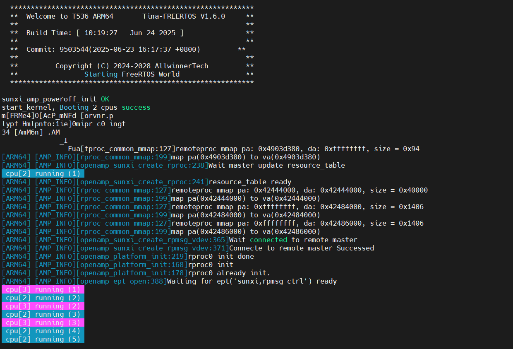
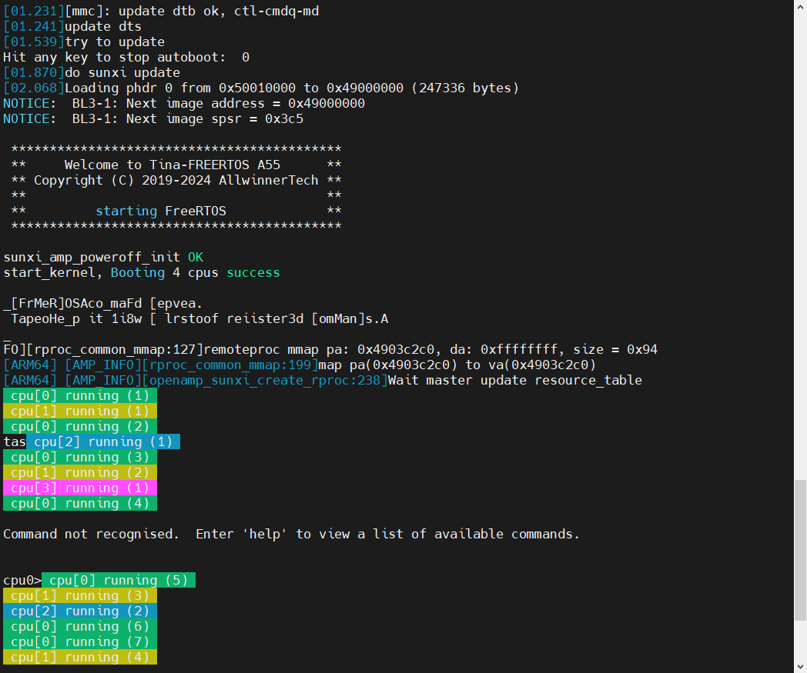

# 同构 AMP 多系统

:::info 文档说明

- **原始页数：** 36 页
- **文档版本：** 1.0
- **发布日期：** 2025-06-12
- **原始文件：** [查看或下载 PDF](/pdfs/T153MX/07-homogeneous-amp-guide.pdf)

正文按原始 PDF 的文本层、书签层级和页面顺序转换，仅移除重复页眉、页脚与水印，不改写技术内容。

:::

<!-- PDF page 5 -->

## 1 前言

### 1.1 文档简介

本文档基于TINA5.0 构建环境介绍全志的同构AMP 多系统开发环境，区别于异构AMP 系统。

1. 介绍在ARM 多核架构下，隔离出若干个cpu 核心用于跑其他从系统，如baremetal/freertos 等小型操作系统。

主系统（如Linux）来管理其生命周期。并且通过rpmsg 等架构进行主系统与从系统的通信。

2. 描述了UBOOT 直接运行多核SMP 的Freertos。

### 1.2 目标读者

- sunxi 同构amp 驱动的开发人员/维护人。

- sunxi 同构amp 多系统环境开发任务/维护者。

- sunxi smp freertos 系统的开发者和维护者。

### 1.3 适用范围

T536 T153 等芯片同构AMP 多系统。

<!-- PDF page 6 -->

## 2 相关术语介绍

表2-1: 异构框架相关术语。

| 术语 | 解释说明 |
| --- | --- |
| SUNXI | Allwinner 一系列SoC 硬件平台 |

可运行在裸机或RTOS 上用于异构多核系统间通信的第三方开源库

Rpmsg定义了异构多核系统中核与核之间进行通信时所

使用的标准二进制接口

AMP非对称多处理(Asymmetric Multi-processing)

<!-- PDF page 7 -->

## 3 前提

目前同构AMP 多系统方案支持如下平台（默认配置）。

平台架构方案默认配置debug uart

A55*4 demo_amp linux(cpu0/1) + freertos(cpu3) + baremetal(cp

u2)uart0+uar15+uart8

T153 A7*4 demo_nand

linux(cpu0/1) + freertos(cpu3) + baremetal(cp

uart0

_amp

u2)

+uart1+uart1

目前支持同构AMP 多系统的配置如下。

```text
# T536:
linux ￨buildroot ￨t536 ￨demo_amp ￨default ￨linux-5.10-rt
# T153
linux ￨buildroot ￨t153 ￨demo_amp_nand ￨default ￨linux-5.10-rt
```

如下SDK 介绍均使用上述的(T536) 平台配置去操作，其他芯片的配置类似。

<!-- PDF page 8 -->

## 4 从系统编译构建

构建AMP 系统的首要目标，就是要生成对应的同构amp 系统镜像。目前tina 平台，支持构建freertos 和baremetal。如下提供简单的构建和使用方式，更详细的请参考freertos 和baremetal 的使用指南。

### 4.1 freertos编译构建

目前freertos 支持集成在整个build 构建中，SDK 需要配置如下才会使能该功能。

以T536为例，构建T536的freertos需要在对应的BoardConfig.mk文件新增或者修改变量LICHEE_RTOS_PROJECT_NAME。

$&#123;SDK_ROOT&#125;/device/config/chips/$&#123;LICHEE_IC&#125;/configs/$&#123;LICHEE_BOARD&#125;/BoardConfig.mk。

```text
LICHEE_RTOS_PROJECT_NAME=t536_e907_demo@amp_rv0.bin:t536_demo@amp_arm64_rtos.bin
```

在$&#123;SDK_ROOT&#125; 目录下重新./build config后通过如下命令查看即可了解是否生效。

```text
${SDK_ROOT}$ cat .buildconfig ￨grep "LICHEE_RTOS_PROJECT_NAME"
HEE_RTOS_PROJECT_NAME=t536_e907_demo@amp_rv0.bin:t536_demo@amp_arm64_rtos.bin
```

目前freertos 支持smp 模式，smp 使用不同版型配置，因此需要改成如下才会编译构建。

```text
LICHEE_RTOS_PROJECT_NAME=t536_e907_demo@amp_rv0.bin:t536_demo_smp@amp_arm64_rtos.bin
```

Freertos 构建常用命令。

```bash
cd ${SDK_ROOT}
./build.sh rtos
                    # build rtos
./build.sh rtos clean
                    # clean rtos
./build.sh rtos menuconfig
                    # set and save rtos config
cd ${SDK_ROOT}/rtos/
source envsetup.sh
                    # 导出环境变量
lunch_rtos
                    # 选择配置
m
                    #buildrtos
m clean
                    # clean rtos
mrtos
                    # build rtos
mrtos_menuconfig
                    # set and save rtos config
```

生成的freertos 系统镜像（如amp_arm64_rtos.bin）会自动拷贝到如下位置。

$&#123;SDK_ROOT&#125;/device/config/chips/$&#123;LICHEE_IC&#125;/configs/bin/

<!-- PDF page 9 -->

### 4.2 baremetal编译构建

目前baremetal 支持集成在整个Tina build 构建中，需要配置如下才会使能该功能。

以T536为例，构建T536的baremetal需要在对应的BoardConfig.mk文件新增或者修改变量LICHEE_BAREMETAL_PROJECT_NAME。

$&#123;SDK_ROOT&#125;/device/config/chips/$&#123;LICHEE_IC&#125;/configs/$&#123;LICHEE_BOARD&#125;/BoardConfig.mk。

LICHEE_BAREMETAL_PROJECT_NAME:=t536_demo@amp_arm64_bare.bin

在$&#123;SDK_ROOT&#125; 目录下重新./build config后通过如下命令查看即可了解是否生效。

```text
${SDK_ROOT}$ cat .buildconfig ￨grep "LICHEE_BAREMETAL_PROJECT_NAME"
HEE_BAREMETAL_PROJECT_NAME=t536_demo@amp_arm64_bare.bin
```

baremetal 构建常用命令。

```bash
cd ${SDK_ROOT}
./build.sh baremetal
cd ${SDK_ROOT}/rtos/lichee/baremetal
./build.sh config
                    # config before build
./build.sh
                    # build baremetal
./build.sh clean
                    # clean baremetal
./build.sh menuconfig
                    # set and save baremetal config
```

生成的baremetal 系统镜像（amp_arm64_bare.bin）会自动拷贝到如下位置。

$&#123;SDK_ROOT&#125;/device/config/chips/$&#123;LICHEE_IC&#125;/configs/bin/

<!-- PDF page 10 -->

## 5 引导方式

### 5.1 前提

若需求要求freertos 或者baremetal 提前启动（在内核之前架加载运行），内核的gic 的dict 不能重初始化，需要临时屏蔽对应接口。

T&#125;/kernel/$&#123;LICHEE_KERN_VER&#125;路径下打上此补丁。

```text
${SDK_ROOT}/device/config/chips/${LICHEE_IC}/patch/kernel/${LICHEE_KERN_VER}/
0001-gic-Handle-dist-init-when-Amp-system-Loaded-earlier-.patch
```

根据从系统在不同时间上加载引导，这里提供了三种引导方式。其中三种方式是互斥的，选择其中一种，务必把其他引导方式的配置去除。

1. Boot0 引导同构AMP 从系统；

2. Uboot 引导同构AMP 从系统；

3. Kernel 引导同构AMP 从系统。

### 5.2 通用配置

无论使用何种引导方式，都需要如下的配置。

#### 5.2.1 kernel menuconfig配置

```text
CONFIG_AW_MSGBOX=y
CONFIG_AW_REMOTEPROC=y
RPROC_FW=y
CONFIG_AW_RPROC_FW_FROM_MEM=y
CONFIG_AW_RPROC_SUBDEV=y
CONFIG_AW_RPROC_SUBDEV_STANDBY=y
CONFIG_AW_REMOTEPROC_ARM_BOOT=y
CONFIG_AW_RPMSG_CTRL=y
CONFIG_AW_RPMSG_HEARTBEAT=y
```

<!-- PDF page 11 -->

| 属性 | 释义 |
| --- | --- |
| W_MSGBOX | 打开msgbox 通信功能 |
| CONFIG_AW_REMOTEPROC | bsp 独立仓库的remoteproc 驱动 |
| CONFIG_AW_RPROC_FW | 用于uboot 或者boot0 快启获取固件镜像 |

CONFIG_AW_RPROC_FW_FROM_MEM从uboot amp 固件的加载地址获取镜像, 以解析资

源

CONFIG_AW_RPROC_SUBDEV从设备驱动开关，包括standby，资源表管理，看

门狗等子设备驱动

CONFIG_AW_REMOTEPROC_ARM_BOOT注册arm 作为rproc device 驱动CONFIG_AW_RPMSG_CTRL用于rpmsg char 字符设备，提供上层接口，用于

ampshell

#### 5.2.2 DTS平台配置说明

如下是T536 的配置，其他平台配置类似，一些名称会有差别，发布的sdk 默认会携带如下信息。

```text
reserved-memory {
```

/*

```dts
* The name should be "vdev%dbuffer".
 * Its size should be not less than
 *
        RPMSG_BUF_SIZE * (num of buffers in a vring) * 2
 *
      = 512 * (num of buffers in a vring) * 2
/
arm_freertos_vdev0buffer: vdev0buffer@42444000 {
                    /* arm freertos rpmsg 通信内存*/
    compatible = "shared-dma-pool";
    reg = <0x0 0x42444000 0x0 0x40000>;
    no-map;
};
```

/*

```text
* The name should be "vdev%dvring%d".
 * The size of each should be not less than
 *
        PAGE_ALIGN(vring_size(num, align))
 *
      = PAGE_ALIGN(16 * num + 6 + 2 * num + (pads for align) + 6 + 8 * num)
 *
 * (Please refer to the vring layout in include/uapi/linux/virtio_ring.h)
 */
arm_freertos_vdev0vring0: vdev0vring0@42484000 {
                    /* arm freertos rpmsg 通信内存*/
    reg = <0x0 0x42484000 0x0 0x2000>;
    no-map;
};
arm_freertos_vdev0vring1: vdev0vring1@42484000 {
                    /* arm freertos rpmsg 通信内存*/
    reg = <0x0 0x42486000 0x0 0x2000>;
    no-map;
};
arm_freertos_reserved: arm_ddr@49000000 {
                    /* arm freertos 预留的运行地址*/
    reg = <0x0 0x49000000 0x0 0x01000000>;
    no-map;
};
```

<!-- PDF page 12 -->

```dts
arm_freertos_mem_fw: arm_mem_fw@50000000 {
                    /* arm freertos 预留的运行地址*/
    /* boot0 & uboot0 load elf addr */
    reg = <0x0 0x50000000 0x0 0x01000000>;
};
arm_baremetal_reserved: arm_ddr@55000000 {
    reg = <0x0 0x55000000 0x0 0x00a00000>;
    no-map;
};
arm_baremetal_mem_fw: arm_mem_fw@56000000 {
    /* boot0 & uboot0 load elf addr */
    reg = <0x0 0x56000000 0x0 0x01000000>;
};
arm_baremetal_vdev0buffer: vdev0buffer@4248A000 {
    compatible = "shared-dma-pool";
reg=<0x00x4248A0000x00x40000>;
    no-map;
};
```

/*

```text
* The name should be "vdev%dvring%d".
      * The size of each should be not less than
      *
            PAGE_ALIGN(vring_size(num, align))
      *
          = PAGE_ALIGN(16 * num + 6 + 2 * num + (pads for align) + 6 + 8 * num)
      *
      * (Please refer to the vring layout in include/uapi/linux/virtio_ring.h)
      */
    arm_baremetal_vdev0vring0: vdev0vring0@424CA000 {
         reg = <0x0 0x424CA000 0x0 0x2000>;
         no-map;
    };
m_baremetal_vdev0vring1:vdev0vring1@424CC000{
         reg = <0x0 0x424CC000 0x0 0x2000>;
         no-map;
    };
    arm_freertos_share_irq_table: share_irq_table@42489000 {
         reg = <0x0 0x42489000 0x0 0x1000>;
         no-map;
    };
};
reserved-irq {
    share-a55 {
         arch-name = "a55";
         memory-region = <&arm_share_irq_table>;
         /* defined by sun55iw6-share-irq-dt.h */
         share-irq =
                  <1
                    0x1
                    A55_PA_IRQ_NUM
                    ARM_PA_IRQ_NUM
                    0x00000000>,
                  <2
                    0x2
                    A55_PB_IRQ_NUM
                    ARM_PB_IRQ_NUM
                    0x00000000>,
                  <3
                    0x3
                    A55_PC_IRQ_NUM
                    ARM_PC_IRQ_NUM
                    0x00000000>,
                  <4
                    0x4
                    A55_PD_IRQ_NUM
                    ARM_PD_IRQ_NUM
                    0x00000000>,
                  <5
                    0x5
                    A55_PE_IRQ_NUM
                    ARM_PE_IRQ_NUM
                    0x00000000>,
                  <6
                    0x6
                    A55_PF_IRQ_NUM
                    ARM_PF_IRQ_NUM
                    0x00000000>,
                  <7
                    0x7
                    A55_PG_IRQ_NUM
                    ARM_PG_IRQ_NUM
                    0x00000000>,
                  <8
                    0x8
                    A55_PH_IRQ_NUM
                    ARM_PH_IRQ_NUM
                    0x00000000>,
                  <9
                    0x9
                    A55_PI_IRQ_NUM
                    ARM_PI_IRQ_NUM
                    0x00000000>,
```

<!-- PDF page 13 -->

```dts
<10
                    0xa
                    A55_PJ_IRQ_NUM
                    ARM_PJ_IRQ_NUM
                    0x00000000>,
                    <11
                    0xb
                    A55_PK_IRQ_NUM
                    ARM_PK_IRQ_NUM
                    0x00000000>,
                    <120xcA55_PL_IRQ_NUMARM_PL_IRQ_NUM0x00000000>,
                    <13
                    0xd
                    A55_PM_IRQ_NUM
                    ARM_PM_IRQ_NUM
                    0x00000000>;
         };
    };
&soc {
    arm_rproc: arm_rproc@0 {
         compatible = "allwinner,arm-rtos-rproc";
         mboxes = <&msgbox_core0 8>;
                    /* rpmsg 需要的msgbox 节点，需提前保证msgbox功能使能*/
         firmware-name = "amp_arm64_rtos.bin";
         memory-region = <&arm_freertos_vdev0buffer>,
                    /* 配置为有rpmsg通信功能的内存属性*/
                  <&arm_freertos_vdev0vring0>,
                  <&arm_freertos_vdev0vring1>,
                  <&arm_freertos_reserved>,
<&arm_freertos_share_irq_table>;
         fw-region = <&arm_freertos_mem_fw>;
         boot-amp = <&amp0>;
         auto-boot;
                    /* boot0 或者uboot引导务必增加此属性
                    */
         mbox-names = "arm-kick";
         memory-mappings =
         /* DDR front 1GB */
         < 0x40000000
                    0x40000000
                    0x40000000 >;
         share-irq = "a55";
         status = "okay";
    };
    arm_baremetal_rproc: arm_rproc_bare@1 {
         compatible = "allwinner,arm-barematal-rproc";
         mboxes = <&msgbox_core0 4>;
         mbox-names = "arm-kick";
rmware-name="amp_arm64_bare.bin";
         memory-mappings =
         /* DDR front 1GB */
         < 0x40000000
                    0x40000000
                    0x40000000 >,
         /* SRAM A2 */
         < 0x40000
                    0x2BFFF
                    0x40000 >;
         memory-region = <&arm_baremetal_vdev0buffer>,
                    /* 配置为无通信功能的内存属性*/
                  <&arm_baremetal_vdev0vring0>,
                  <&arm_baremetal_vdev0vring1>,
                  <&arm_freertos_share_irq_table>,
                  <&arm_baremetal_reserved>,
                  <&sram_reserved>;
         fw-region = <&arm_baremetal_mem_fw>;
         boot-amp = <&amp1>;
         auto-boot;
                    /* boot0 或者uboot引导务必增加此属性
                    */
         /* only boot on remote baremetal core without
             rsc table */
         // only-boot;
                    /* 无通信功能，必须显示设置该属性*/
         share-irq = "a55";
         status = "okay";
    };
};
sunxi_amp: sunxi-amp {
    compatible = "sunxi,amp";
    status = "okay";
    amp-count = <2>;
```

<!-- PDF page 14 -->

```text
amp0: amp0 {
    cpu-id = <0x300>;
                    /* smp模式配置如下cpu-id = <0x200>，<0x300>
                    连续并且从小到大*/
    entry-addr = <0x49000000>;
    load-addr = <0x50000000>;
    arch = <1>; /* 0:arm 1:arm64 */
    image = "amp-freertos";
    boot-stage = "uboot";
};
amp1: amp1 {
    cpu-id = <0x200>;
    entry-addr = <0x55000000>;
    load-addr = <0x56000000>;
    arch = <1>; /* 0:arm 1:arm64 */
    image = "amp-arm";
    boot-stage = "boot0";
```

```dts
&msgbox_core0 {
    status = "okay";
};
```

| 属性 | 释义 |  |
| --- | --- | --- |
| arm_freertos_vdev0buffer | arm freertos 的共享内存预留地址 |  |
| arm_freertos_vdev0vring0 | arm freertos rpmsg 通信viring 队列0 |  |
| arm_freertos_vdev0vring1 | arm freertos rpmsg 通信viring 队列1 |  |
| arm_freertos_reserved | arm freertos 预留运行地址 |  |
| tos_mem_fw | armfreertos | 预留的加载地址 |
| arm_baremetal_vdev0buffer | arm baremetal 的共享内存预留地址 |  |
| arm_baremetal_vdev0vring0 | arm baremetalrpmsg-lite 通信viring 队列0 |  |
| arm_baremetal_vdev0vring1 | arm baremetalrpmsg-lite 通信viring 队列1 |  |
| arm_baremetal_reserved | arm baremetal 预留运行地址 |  |
| arm_baremetal_mem_fw | arm baremetal 预留的加载地址 |  |
| arm_freertos_share_irq_table | arm rtos/bare 与共享中断表的预留内存 |  |
| share-a55 | arm 与共享中断表 |  |
| arm_rproc | arm freertos rproc 节点 |  |
| metal_rproc | armbaremetalrproc 节点 |  |
| sunxi_amp | 同构AMP 多系统启动配置 |  |
| msgbox_core0 | A55 同构msgbox 节点 |  |

sunxi_amp 用于配置具体系统从哪个节点启动使用哪个核心。

<!-- PDF page 15 -->

| 属性 | 说明 |
| --- | --- |
| t | 总共的同构AMP 系统个数 |
| cpu-id | 异构系统使用的核心序号 |
| entry-add | 异构系统启动地址 |
| arch | 异构系统架构：目前0 代表arm，1 代表arm64 |
| image | 分区名称，用于ubootl 引导 |
| boot-stage | 启动阶段，可选择boot0 uboot kernel |

#### 5.2.3 sys_partition.fex

在类似如下位置新增或者修改镜像分区。$&#123;SDK_ROOT&#125;/device/config/chips/$&#123;LICHEE_IC&#125;/configs/$&#123;LICHEE_BOARD&#125;/buildroot/sys_partition.fex。

[partition]

```text
name
              = amp-freertos
size
              = 32768
downloadfile = "amp_arm64_rtos.fex"
user_type
              = 0x8000
```

[partition]

```text
name
              = amp-baremetal
size
              = 32768
downloadfile = "amp_arm64_bare.fex"
user_type
              = 0x8000
```

| 名称 | 描述 |
| --- | --- |
| name | 建议rtos 使用amp-freertos，bare 使用amp-baremetal |
| size | 根据系统镜像大小灵活配置 |

downloadfile目前仅支持amp_arm64_rtos.fex、amp_arm64_bare.fex、amp_arm_rtos.fex、

amp_arm_bare.fex

user_type默认0x8000 即可，无需改动

### 5.3 Boot0引导同构AMP从系统

注意：目前BOOT0 阶段引导AMP 从系统暂支持T536，T153 仍在开发进行中。

若想AMP 从系统在BOOT0 阶段。需要进行如下配置：

<!-- PDF page 16 -->

#### 5.3.1 spl.dts设置

```c
#include "spl.dtsi"
/ {
         sunxi_amp: sunxi-amp {
                  compatible = "sunxi,amp";
                  status = "okay";
                  amp-count = <1>;
                  amp0: amp0 {
                    cpu-id = <0x200>;
                    #设置具体cpu跑从系统
                    entry-addr = <0x55000000>;
                    #从系统的运行首地址
                    load-addr = <0x56000000>;
                    arch = <1>;
                    /* 0:arm 1:arm64 */
     image="amp-arm";
                    boot-stage = "boot0";
                  };
         };
};
&flash_read {
         part-name = "amp-baremetal";
                    # 与分区表的一致
```

/*

```text
* 0x60000000: read dest addr (phy addr)
          * 0xFFFFFFFF: read blk num (Select the minimum value between the configuration value
     and the partition size.)
          */
         dest-addr = <0x56000000 0xFFFFFFFF>;
};
ge￨boot-stage需要如上图一致，其他参考DTS平台配置说明章节。
```

### 5.4 Uboot引导同构AMP从系统

#### 5.4.1 uboot menuconfig设置

采用uboot 启动ARM 同构AMP 从系统的方法，主核Linux 环境下uboot 需要选中对应配置，部分方案已默认选中，此章节对所需配置进行介绍。

boot 启用一条mp 命令，使用方法见env.cfg参数设置。

在sdk 根目录, 执行./build.sh uboot_menuconfig

```text
CONFIG_CMD_SUNXI_AMP
```

| 属性 | 释义 |
| --- | --- |
| CONFIG_CMD_SUNXI_AMP | 使用除core0 外的核心启动镜像 |

<!-- PDF page 17 -->

#### 5.4.2 env.cfg参数设置

即uboot 可以配置启动baremetal 或启动freertos，或者两者都启动。$&#123;SDK_ROOT&#125;/device/config/chips/$&#123;LICHEE_IC&#125;/configs/$&#123;LICHEE_BOARD&#125;/buildroot/env.cfg 文件中添加加载命令，内容如下：

boot_amp 指的是在跑linux 的前提下，取出若干个核心去跑freertos 或者baremetal。

boot_amp 命令后面的参数是固件加载地址，此地址会被dtsi 的覆盖。请注意！！！

```text
boot_amp=boot_amp 0x50000000
bootcmd=run sunxi_pre_cmd boot_amp boot_normal
```

如上配置务必是需要才添加。

#### 5.4.3 dts设置

```text
amp0: amp0 {
    image = "amp-freertos";
                    # 分区名称
    boot-stage = "uboot";
                    #必须设置uboot
};
#主要注意image ￨boot-stage 需要如上图一致，其他参考DTS平台配置说明章节。
```

### 5.5 Kernel引导同构AMP从系统

#### 5.5.1 从UBOOT改为Kernel

从UBOOT 启动到Kernel 启动，仅仅需要修改如下的dts 即可。

```text
amp1: amp1 {
    boot-stage = "kernel";
                    # 修改为kernel
};
arm_rproc: arm_rproc@0 {
    /* auto-boot; */
                    /* kernel启动注释此属性
                    */
};
```

\\#主要注意boot-stage 需要如上图一致，其他参考DTS平台配置说明章节。

#### 5.5.2 从BOOT0改为Kernel

从BOOT0 启动改为Kernel 启动，除了修改上一小章的DTS 配置还需如下修改。

如有，让BOOT0 失去启动从系统的能力。

删除spl.dts 文件，或者给文件名换一个名称。这个最简单的方式。

<!-- PDF page 18 -->

#### 5.5.3 命令启动AMP系统

AMP 异构固件以amp_arm*_bare.bin或者amp_arm*_rtos.bin文件的形式存在于Linux 小机端的/lib/firmware 目录下，通过remoteproc 驱动来对从核生命周期进行管理，默认情况下，内核会加载remoteproc 驱动，在其过程中完成启动从核的操作。

启动/关闭的从系统，注意使用remoteproc 的节点。

如下拿T536 为例来进行操作。

```bash
# 获取rproc节点名称
cat /sys/class/remoteproc/remoteproc*/name
# 设置固件名：
rm64_rtos.bin>/sys/class/remoteproc/remoteproc1/firmware
# 启动freeros amp:
echo start > /sys/class/remoteproc/remoteproc1/state
# 关闭freertos amp:
echo stop > /sys/class/remoteproc/remoteproc1/state
```

<!-- PDF page 19 -->

## 6 通信

如下都是使用T536 来介绍，其他芯片操作类似。

### 6.1 快起方案

版型默认配置为引导单核FreeRTOS 系统，以下配置已默认打开。

#### 6.1.1 dts配置

固件在boot0 或者uboot 快起引导需要支持auto_boot 功能，即在rproc 驱动加载前，rtos 固件需要等待内核通信端点建立完成，需打开的配置如下，设备树单核A55/A7 的rproc 节点中，如下介绍T536 arm 核心的配置。

```text
arm_rproc: arm_rproc@0 {
    ...
    fw-region = <&arm_freertos_mem_fw>;
    ...
oot;#快启动，boot0或uboot引导需要配置该属性
};
```

- auto-boot 属性：快启（从系统在内核之前启动）需要打开该属性，arm rproc 会在驱动probe 时主动调用

rproc_add, 去注册通信相关资源。

- arm_freertos_mem_fw: 快启动elf 固件的加载地址，用于快起rproc 启动从内存解析rpmsg 通信所需资源表，

以及uboot/boot 引导搬运程序段。

#### 6.1.2 rtos config配置

境menuconfig 需要打开配置CONFIG_SLAVE_EARLY_BOOT，

```text
│Symbol: SLAVE_EARLY_BOOT [=y]
│Type
         : boolean
│Prompt: system will early boot before master rproc ready
│
     Location:
│
       -> System components
│
         -> thirdparty components
│
            -> OpenAMP Support
│
              -> Libmetal Support (COMPONENTS_LIBMETAL [=y])
│(3)
                -> OpenAMP Framework Support (COMPONENTS_OPENAMP [=y])
```

<!-- PDF page 20 -->

目的是在openamp 阻塞等待内核rproc 把资源表准备好。

注意：快起方案需要打开这两个配置才能正常使用rpmsg 通信。

### 6.2 普通方案

非快起方案rpmsg 通信只屏蔽快起方案的配置即可，相关配置已默认打开，这里描述下异构通讯通用配置:

#### 6.2.1 设备树配置

/*

```dts
* channel0~3
                 : core0 -> core1
 * channel4~7
                 : core0 -> core2
 * channel8~12 : core0 -> core3
 */
msgbox_core0: msgbox_core0@03600000 {
    compatible = "allwinner,sun55iw6-msgbox-core0";
    #mbox-cells = <1>;
    reg = <0x0 0x03600000 0x0 0x1000>,
           <0x0 0x03601000 0x0 0x1000>,
           <0x0 0x03602000 0x0 0x1000>,
           <0x0 0x03603000 0x0 0x1000>;
    interrupts = <GIC_SPI 166 IRQ_TYPE_LEVEL_HIGH>,
              <GIC_SPI 170 IRQ_TYPE_LEVEL_HIGH>,
              <GIC_SPI 171 IRQ_TYPE_LEVEL_HIGH>,
<GIC_SPI172IRQ_TYPE_LEVEL_HIGH>;
    clocks = <&ccu CLK_MSGBOX_CORE0>;
    clock-names = "msgbox";
    resets = <&ccu RST_BUS_MSGBOX_CORE0>;
    reset-names = "rst";
    local_id = <0>;
    status = "disabled";
};
```

dtsi 配置主要是核间通信msgbox，需要起到rpmsg kick 的作用，目前用的core0 的msgbox ch0 和core3 msgbox ch0 通信，每个核有4 个通道，0 ~ 3 为core1，4 ~ 7 为core2，8 ~ 11 为core3 ，目前与core3 通信，使用通道0，所以arm rproc 节点msgbox 的remotepoint 节点mboxes 需要填入8。

```text
arm_freertos_rproc: arm_rproc@0 {
    /* core3 chn0 */
=<&msgbox_core08>;
```

通信运行需要预留系统内存。

```text
arm_freertos_rproc: arm_rproc@0 {
    /* core3 chn0 */
    mboxes = <&msgbox_core0 8>;
    memory-region = <&arm_freertos_vdev0buffer>,
             <&arm_freertos_vdev0vring0>,
             <&arm_freertos_vdev0vring1>,
             <&arm_freertos_reserved>,
             <&arm_freertos_share_irq_table>;
```

<!-- PDF page 21 -->

fw-region = &lt;&arm_freertos_mem_fw&gt;;

- arm_freertos_vdev0buffer：rpmsg virtio 共享内存；

- arm_freertos_vdev0vring0：rpmsg virtio 循环队列0 共享内存；

- arm_freertos_vdev0vring0：rpmsg virtio 循环队列1 共享内存；

- arm_freertos_reserved：单核a55 预留运行内存。

```text
arm_freertos_reserved: arm_ddr@49000000 {
    reg = <0x0 0x49000000 0x0 0x01000000>;
    no-map;
};
```

| 0x49000000 的运行内存， | rtosconfig 需要配置一致的起始地址，以 | amp 版型为例， | rtos/lichee/rtos/ |
| --- | --- | --- | --- |
| CHEE_IC&#125;/demo/defconfig | 路径下defconfig。 |  |  |

```text
CONFIG_ARCH_START_ADDRESS=0x49000000
CONFIG_ARCH_MEM_LENGTH=0x00a00000
```

- arm_freertos_share_irq_table：此配置为gpio share irq 功能预留配置表功能，用于划分gpio 的同一组bank 的

二级中断，表可以在dts 配置。

```text
reserved-irq {
  share-a55 {
       arch-name = "a55";
       memory-region = <&arm_share_irq_table>;
       /* defined by sun55iw6-share-irq-dt.h */
e-irq=
                <1
                    0x1
                    A55_PA_IRQ_NUM
                    ARM_PA_IRQ_NUM
                    0x00000000>,
                <2
                    0x2
                    A55_PB_IRQ_NUM
                    ARM_PB_IRQ_NUM
                    0x00000000>,
                <3
                    0x3
                    A55_PC_IRQ_NUM
                    ARM_PC_IRQ_NUM
                    0x00000000>,
                <4
                    0x4
                    A55_PD_IRQ_NUM
                    ARM_PD_IRQ_NUM
                    0x00000000>,
                <5
                    0x5
                    A55_PE_IRQ_NUM
                    ARM_PE_IRQ_NUM
                    0x00000000>,
                <6
                    0x6
                    A55_PF_IRQ_NUM
                    ARM_PF_IRQ_NUM
                    0x00000000>,
                <7
                    0x7
                    A55_PG_IRQ_NUM
                    ARM_PG_IRQ_NUM
                    0x00000000>,
                <8
                    0x8
                    A55_PH_IRQ_NUM
                    ARM_PH_IRQ_NUM
                    0x00000000>,
                <9
                    0x9
                    A55_PI_IRQ_NUM
                    ARM_PI_IRQ_NUM
                    0x00000000>,
                <10
                    0xa
                    A55_PJ_IRQ_NUM
                    ARM_PJ_IRQ_NUM
                    0x00000000>,
                <11
                    0xb
                    A55_PK_IRQ_NUM
                    ARM_PK_IRQ_NUM
                    0x00000000>,
                <12
                    0xc
                    A55_PL_IRQ_NUM
                    ARM_PL_IRQ_NUM
                    0x00000000>,
                <13
                    0xd
                    A55_PM_IRQ_NUM
                    ARM_PM_IRQ_NUM
                    0x00000000>;
  };
}
```

可见默认表中最后一项都默认配置为0，表示所有gpio 中断都注册linux 侧，若需要把某个中断注册到rtos 端，如PB10, 则需要把对应屏蔽bit 置位为1，如PB10 注册为RTOS 中断，PB 组中断项改为

```text
<2
       0x2
              A55_PB_IRQ_NUM
                    ARM_PB_IRQ_NUM
                    0x00000400>,
```

#### 6.2.2 内核config配置

linux 端需要打开以下配置。

<!-- PDF page 22 -->

```text
CONFIG_AW_MSGBOX=y
CONFIG_AW_REMOTEPROC=y
CONFIG_SUNXI_RPROC_SHARE_IRQ=y
CONFIG_AW_REMOTEPROC_ARM_BOOT=y
CONFIG_AW_RPMSG_CTRL=y
CONFIG_AW_RPMSG_VIRTIO=y
```

- CONFIG_AW_MSGBOX : msgbox 驱动开关用于rpmsg kick；

- CONFIG_AW_REMOTEPROC：remoteproc 驱动开关；

- CONFIG_SUNXI_RPROC_SHARE_IRQ：gpio share irq 功能开关；

- CONFIG_AW_REMOTEPROC_ARM_BOOT：arm 核心rproc priv 驱动，管理单核内核引导及生命周期；

- CONFIG_AW_RPMSG_CTRL：rpmsg ctrl 字符驱动，用于动态创建销毁通信端点；

W_RPMSG_VIRTIO:rpmsg总线驱动，匹配rpmsgdriver和通道device。

#### 6.2.3 rtos config配置

amp 板级配置，rtos config 配置文件路径为

$&#123;SDK_ROOT&#125;rtos/lichee/rtos/projects/$&#123;LICHEE_IC&#125;/$&#123;LICHEE_BOARD&#125;/defconfig

openamp 相关的配置

```text
#
# OpenAMP Support
#
CONFIG_COMPONENTS_LIBMETAL=y
CONFIG_COMPONENTS_OPENAMP=y
CONFIG_AMP_SLAVE_MODE=y
CONFIG_MBOX_CHANNEL=0
CONFIG_MBOX_QUEUE_LENGTH=16
CONFIG_RPMSG_DEMO=y
CONFIG_RPMSG_TEST=y
CONFIG_RPMSG_CLIENT=y
CONFIG_RPMSG_CLIENT_TEST=y
CONFIG_RPMSG_CLIENT_QUEUE_SIZE=16
# CONFIG_RPMSG_CLIENT_DEBUG is not set
# CONFIG_RPMSG_HEARBEAT is not set
CONFIG_SLAVE_EARLY_BOOT=y
CONFIG_AMP_SHARE_IRQ=y
```

```text
#
# Multi Console Support
#
CONFIG_MULTI_CONSOLE=y
# CONFIG_MULTI_CONSOLE_DEBUG is not set
CONFIG_UART_MULTI_CONSOLE=y
CONFIG_UART_MULTI_CONSOLE_AS_MAIN=y
CONFIG_RPMSG_MULTI_CONSOLE=y
CONFIG_RPMSG_CONSOLE_CACHE=y
```

- CONFIG_COMPONENTS_LIBMETAL：openamp 跨平台公用组件；

<!-- PDF page 23 -->

- CONFIG_COMPONENTS_OPENAMP：openamp 核心组件；

MP_SLAVE_MODE作为从端，主动发送端点名给nameservice；

- CONFIG_MBOX_CHANNEL: openamp 默认使用msgbox 通道0；

- CONFIG_MBOX_QUEUE_LENGTH：msgbox 消息队列缓存长度；

- CONFIG_RPMSG_DEMO：rpmsg 简单测试程序；

- CONFIG_RPMSG_TEST：老化测试程序；

- CONFIG_RPMSG_CLIENT：与内核的rpmsg ctrl 驱动搭配，动态创建销毁通信端点；

- CONFIG_RPMSG_CLIENT_TEST: 动态创建端点测试程序；

- CONFIG_SLAVE_EARLY_BOOT：uboot/boot0 引导时需要使能；

- CONFIG_AMP_SHARE_IRQ：GPIO 中断共享功能；

ULTI_CONSOLE ell 终端模式；

- CONFIG_UART_MULTI_CONSOLE_AS_MAIN：串口终端作为主shell 接收命令，且注册为multi console；

- CONFIG_RPMSG_MULTI_CONSOLE：用于amp shell, 新增一个rpmsg console，用于处理远端内核的amp shell 的

命令输入；

- CONFIG_RPMSG_CONSOLE_CACHE：终端输入缓存模式。

### 6.3 通信测试

#### 6.3.1 AMP_SHELL

amp 实现机制是在rtos 端实现一个简单的shell 终端，接受linux 端发送的rpmsg 输入指令，

返回对应的命令操作字符串，可以实现不接串口线的条件下，也能调试远端同构异构核。

1. 上电进入主核Linux 系统。

Linux 端输入命令amp_shell -d /dev/rpmsg_ctrl-arm_rproc@0 进入ARM Freertos 控制台。

在通过amp_shell 进入的ARM AMP 控制台上输入命令，回显正常。

:

```text
# amp_shell -d /dev/rpmsg_ctrl-arm_rproc\@0
opt = ?
rpmsg opt
[
   176.865373] virtio_rpmsg_bus virtio0: creating channel sunxi,rpmsg_client addr 0x401
Creating Auto Free Endpoint...[
                    176.866667] sunxi:sunxi_dsufreq-8860000.dsufreq:[ERR]:
    cpufreq cpu get failed
[
   176.867004] sunxi:sound-mach:[WARN]: 372 asoc_simple_parse_ucfmt(): set data late to
    default
Success Create /dev/rpmsg1
```

<!-- PDF page 24 -->

```text
[
   176.867026] sunxi:sound-mach:[ERR]: 488 simple_parse_of(): simple_dai_link_of failed
=============================
 [
    176.882242] rpmsg rpmsg_ctrl-arm_rproc@0: bind ept: 1(console)
          AMP Shell
============================
msh >
```

#### 6.3.2 RPMSG

在Freertos 环境输入以下命令：

rpmsg_test -N test -L 496 -c -v

口输入以下命令

rpmsg_test -r arm_rproc@0 -c test -L 496 -v

关键log

[rpmsg1]data:e8595a67e19c824924508829f84fbd75... [md5:e306202bce7ccbfee956027ee164fd21]

```text
[rpmsg1] send: 0.496000Kb 0.000000ms infM/s
[rpmsg1] receive : 0.496000Kb 500.000000ms 0.000992Mb/s
data:000000002df45158cf8cb14046f6b54b... check:feb17eeb632d7bdbe2a3aaf7d8bbd296[rpmsg1]
```

success

[rpmsg1]data:e8595a67e19c824924508829f84fbd75... [md5:e306202bce7ccbfee956027ee164fd21]

end:0.496000Kb0.000000msinfM/s

```text
[rpmsg1] receive : 0.496000Kb 504.000000ms 0.000984Mb/s
data:000000002df45158cf8cb14046f6b54b... check:feb17eeb632d7bdbe2a3aaf7d8bbd296[rpmsg1]
```

success

[rpmsg1]data:05de765554e8797ef0658a508c0c035f... [md5:f9661a12ec834ae13d44c83ac8b62390]

```text
[rpmsg1] send: 0.496000Kb 0.000000ms infM/s
[rpmsg1] receive : 0.496000Kb 500.000000ms 0.000992Mb/s
data:000000002df45158cf8cb14046f6b54b... check:feb17eeb632d7bdbe2a3aaf7d8bbd296[rpmsg1]
```

success

[rpmsg1]data:05de765554e8797ef0658a508c0c035f... [md5:f9661a12ec834ae13d44c83ac8b62390]

```text
[rpmsg1] send: 0.496000Kb 0.000000ms infM/s
[rpmsg1] receive : 0.496000Kb 504.000000ms 0.000984Mb/s
0002df45158cf8cb14046f6b54b...check:feb17eeb632d7bdbe2a3aaf7d8bbd296[rpmsg1]
    success
```

[rpmsg1]data:704b4b43a9eb3333d0d51b372877ee47... [md5:030422bb17f8904db272cba8fe733505]

```text
[rpmsg1] send: 0.496000Kb 0.000000ms infM/s
[rpmsg1] receive : 0.496000Kb 500.000000ms 0.000992Mb/s
data:000000002df45158cf8cb14046f6b54b... check:feb17eeb632d7bdbe2a3aaf7d8bbd296[rpmsg1]
```

success

[rpmsg1]data:704b4b43a9eb3333d0d51b372877ee47... [md5:030422bb17f8904db272cba8fe733505]

<!-- PDF page 25 -->

```text
[rpmsg1] send: 0.496000Kb 0.000000ms infM/s
[rpmsg1] receive : 0.496000Kb 504.000000ms 0.000984Mb/s
data:000000002df45158cf8cb14046f6b54b... check:feb17eeb632d7bdbe2a3aaf7d8bbd296[rpmsg1]
```

success

#### 6.3.3 RPMSG-LITE

Rpmsg_lite 主要用于裸机和linux 的Rpmsg 通信。

##### 6.3.3.1 Linux端配置

oard.dts

```dts
arm_baremetal_vdev0buffer: vdev0buffer@4248A000 {
    compatible = "shared-dma-pool";
    reg = <0x0 0x4248A000 0x0 0x40000>;
    no-map;
};
         /*
 * The name should be "vdev%dvring%d".
 * The size of each should be not less than
 *
        PAGE_ALIGN(vring_size(num, align))
 *
      = PAGE_ALIGN(16 * num + 6 + 2 * num + (pads for align) + 6 + 8 * num)
 *
 * (Please refer to the vring layout in include/uapi/linux/virtio_ring.h)
/
arm_baremetal_vdev0vring0: vdev0vring0@424CA000 {
    reg = <0x0 0x424CA000 0x0 0x2000>;
    no-map;
};
arm_baremetal_vdev0vring1: vdev0vring1@424CC000 {
    reg = <0x0 0x424CC000 0x0 0x2000>;
    no-map;
};
```

```dts
arm_baremetal_rproc: a55_rproc_bare@1 {
    compatible = "allwinner,arm-barematal-rproc";
    mboxes = <&msgbox_core0 4>;
    mbox-names = "arm-kick";
    firmware-name = "amp_arm64_bare.bin";
    memory-mappings =
    /* DDR front 1GB */
    < 0x40000000
                    0x40000000
                    0x40000000 >,
    /* SRAM A2 */
    < 0x40000
                   0x2BFFF
                    0x40000 >;
    memory-region = <&arm_baremetal_vdev0buffer>,
             <&arm_baremetal_vdev0vring0>,
             <&arm_baremetal_vdev0vring1>,
             <&arm_freertos_share_irq_table>,
             <&arm_baremetal_reserved>,
             <&sram_reserved>;
```

<!-- PDF page 26 -->

```dts
fw-region = <&arm_baremetal_mem_fw>;
    boot-amp = <&amp1>;
    auto-boot;
    /* only boot on remote baremetal core without
         rsc table */
    // only-boot;
    share-irq = "a55";
    status = "okay";
};
```

6.3.3.1.2 Kernel config

```text
CONFIG_AW_RPMSG_LITE_TEST:
    Say y here to enable support for the rpmsg lite test driver.
:AW_RPMSG_LITE_TEST[=y]
    Type
           : tristate
    Defined at bsp/drivers/rpmsg/Kconfig:54
    Prompt: Allwinner RPMSG lite test driver
    Depends on: AW_BSP [=y]
    Location:
    -> Allwinner BSP
```

-&gt; Device Drivers

```text
-> Rpmsg drivers
Selects: RPMSG_VIRTIO [=y]
```

##### 6.3.3.2 RTOS端配置

OOT&#125;/rtos/lichee/baremetal/components/rpmg-lite/examples。

```c
void rpmsg_lite_communicate_test()
{
    printf("rpmsg_lite_communicate_test start\n");
    rproc_virtio_wait_remote_ready();
    rpmsg_lite_base = (char *)resource_table_get_vring_da();
    printf("rpmsg_lite_base: %p\r\n", rpmsg_lite_base);
    int ret = 0;
    my_rpmsg = rpmsg_lite_remote_init(rpmsg_lite_base, 0,
                  RL_NO_FLAGS, &rpmsg_ctxt);
    if (!my_rpmsg) {
         printf("Failed to initialize RPMsg Lite\n");
turn;
```

```text
my_ept = rpmsg_lite_create_ept(my_rpmsg, RL_ADDR_ANY , ept_cb, NULL, &my_ept_ctxt);
if(!my_ept){
     printf("rpmsg_lite_create_ept faile \n");
     return;
}
ret = rpmsg_ns_announce(my_rpmsg, my_ept, RPMSG_LITE_NS_ANNOUNCE_STRING, (uint32_t)
RL_NS_CREATE);
```

if(ret != RL_SUCCESS)&#123;

<!-- PDF page 27 -->

```text
printf("'rpmsg_ns_announce' failed ret = %d\n", ret);
return;
```

printf("communicate test end \\n");

```text
}
```

##### 6.3.3.3 测试说明

1、先在baremetal 输入hal_rpmsg_test

2、

如下。

```bash
mount -t debugfs debugfs /sys/kernel/debug
echo 'file *remoteproc.c +p' > /sys/kernel/debug/dynamic_debug/control
echo 'file *rproc*.c +p' > /sys/kernel/debug/dynamic_debug/control
echo 'file *rpmsg*.c +p' > /sys/kernel/debug/dynamic_debug/control
# echo hello > /dev/rpmsg_test
```

linux 端串口log 显示如下。

```text
# [
       99.066003] sunxi_rpmsg_lite virtio2.sunxi,rpmsg_test_bare.-1.1: TX From 0x400, To 0x1,
    Len 6, Flags 0, Reserved 0
[
    99.066023] rpmsg_virtio TX: 00 04 00 00 01 00 00 00 00 00 00 00 06 00 00 00
    ................
9]rpmsg_virtioTX:68656c6c6f0a
hello.
[
    99.066040] remoteproc remoteproc0: sunxi_rproc_kick,753 vqid = 0x1
[
    99.066271] remoteproc remoteproc0: sunxi_rproc_mb_tx_done,264 name = arm-kick, vq_id = 0
    x1
[
    99.113524] remoteproc remoteproc0: sunxi_rproc_mb_rx_callback,243 name = arm-kick, vq_id
    = 0x1
[
    99.113554] virtio_rpmsg_bus virtio2: From: 0x1, To: 0x400, Len: 6, Flags: 0, Reserved: 0
[
    99.113572] rpmsg_virtio RX: 01 00 00 00 00 04 00 00 00 00 00 00 06 00 00 00
    ................
[
    99.113578] rpmsg_virtio RX: 68 65 6c 6c 6f 0a
                    hello.
[
    99.113590] virtio_rpmsg_bus virtio2: Received 1 messages
[
    99.113597] remoteproc remoteproc0: sunxi_rproc_kick,753 vqid = 0x0
[
    99.113631] remoteproc remoteproc0: sunxi_rproc_mb_tx_done,264 name = arm-kick, vq_id = 0
    x0
[
    99.116294] remoteproc remoteproc0: sunxi_rproc_mb_rx_callback,243 name = arm-kick, vq_id
    = 0x0
[
    99.116316] virtio_rpmsg_bus virtio2: rpmsg_xmit_done
[
    99.119060] remoteproc remoteproc0: sunxi_rproc_mb_rx_callback,243 name = arm-kick, vq_id
    = 0x1
[
    99.119081] virtio_rpmsg_bus virtio2: rpmsg_xmit_done
```

baremetal 端串口显示如下。

```text
letter:/$ [59.662796] receive kick vq:1
[59.662842] rpmsg_virtio RX:
                    :
[59.662878]
0x42410000 : [59.662910]
                    400 [59.662935]
                    1 [59.663251]
                    0 [59.665071]
```

<!-- PDF page 28 -->

```text
6 [59.666891]
0x42410010 : [59.669231] 6c6c6568 [59.671051]
                    a6f [59.672871]
                    0 [59.674691]
      0 [59.676511]
0x42410020 : [59.678851]
                    0 [59.680672]
                    0 [59.682491]
[59.683706] src: 0x1024, data:hello
                    , len:6
[59.687785] rpmsg_virtio TX:
                    :
[59.690638]
0x42400200 : [59.692978]
                    1 [59.694798]
                    400 [59.696618]
                    0 [59.698438]
      6 [59.700258]
0x42400210 : [59.702598] 6c6c6568 [59.704418]
                    a6f [59.706238]
```

#### 6.3.4 RPBUF

板级没有配置rpbuf可参考其他方案增加预留地址测试，有需求可联系fae。

<!-- PDF page 29 -->

## 7 引导同构双核 SMP freertos

此处单独描述在一个Linux 主系统下，划分2 个cpu 跑SMP Freertos。目前该方案仅仅支持在UBOOT 和Kernel 阶段加载运行。

因为默认配置方案是支持linux + freertos + baremetal，因此需要对sdk 进行一定修改才能使用。跟随如下步骤，可跑起2core Linux + 2 core Freertos。

### 7.1 构建Freertos smp 系统镜像

以T536 为例，构建T536 的freertos 需要新增或者修改LICHEE_RTOS_PROJECT_NAME。修改为t536_demo_smp版型。

```text
LICHEE_RTOS_PROJECT_NAME=t536_e907_demo@amp_rv0.bin:t536_demo_smp@amp_arm64_rtos.bin
```

在$&#123;SDK_ROOT&#125; 目录下重新./build config后通过如下命令查看即可了解是否生效。

```text
${SDK_ROOT}$ cat .buildconfig ￨grep "LICHEE_RTOS_PROJECT_NAME"
export LICHEE_RTOS_PROJECT_NAME=t536_e907_demo@amp_rv0.bin:t536_demo_smp@amp_arm64_rtos.bin
```

#### 7.1.1 board.dts

给freertos 增加一个使用的cpu。

```text
amp0: amp0 {
    cpu-id = <0x200>, <0x300>;
};
```

### 7.2 关闭baremetal从系统

若默认配置baremetal 占用了一个cpu，因此必须把该从系统从多系统方案中抹除。

#### 7.2.1 spl.dtb

如有，让BOOT0 失去启动从系统的能力。删除spl.dts 文件，或者给文件名换一个名称。这个最简单的方式。

<!-- PDF page 30 -->

#### 7.2.2 board.dts

若有，disabled arm_baremetal_rproc 节点。

```dts
arm_baremetal_rproc: arm_rproc_bare@1 {
    status = "disabled;
};
```

重新配置后，编译打包把固件烧写到样机，若成功，rtos 的uart 会打印如下信息。版型demo 会一直循环两个核心打印。



*图7-1: 2-core-linux-2-core-rtos*

<!-- PDF page 31 -->

## 8 uboot启动多核FreeRTOS

由于目前没有单一的RTOS SDK，想要uboot 启动多核RTOS，需要借助Tina 的sdk，改动如下。

### 8.1 关闭boot0启动从系统

#### 8.1.1 spl.dtb

让BOOT0 失去启动从系统的能力。删除spl.dts 文件，或者给文件名换一个名称。这个最简单的方式。

### 8.2 构建Freertos smp 系统镜像

#### 8.2.1 选择smp版型

，构建T536 的需要新增或者修改LICHEE_RTOS_PROJECT_NAME。

```text
LICHEE_RTOS_PROJECT_NAME=t536_e907_demo@amp_rv0.bin:t536_demo_smp@amp_arm64_rtos.bin
```

在$&#123;SDK_ROOT&#125; 目录下重新./build config后通过如下命令查看即可了解是否生效。

```text
${SDK_ROOT}$ cat .buildconfig ￨grep "LICHEE_RTOS_PROJECT_NAME"
export LICHEE_RTOS_PROJECT_NAME=t536_e907_demo@amp_rv0.bin:t536_demo_smp@amp_arm64_rtos.bin
```

#### 8.2.2 修改freertos cpu核数

在$&#123;SDK_ROOT&#125; 目录下如下命令。

```text
./build.sh rtos menuconfig
# 选择带smp版型
CONFIG_NR_CPUS=4
```

#### 8.2.3 修改Freertos调试uart

修改为uart0 与uboot 等保持一致，方便开发调试。

<!-- PDF page 32 -->

```text
./build.sh rtos menuconfig
# 选择带smp版型
ORT=0
```

### 8.3 env.cfg参数设置

uboot 启动freertos，不启动kernel。

$&#123;SDK_ROOT&#125;/device/config/chips/$&#123;LICHEE_IC&#125;/configs/$&#123;LICHEE_BOARD&#125;/buildroot/env.cfg 文件中添加加载命令，内容如下：

boot_rtos 指的是不跑内核，uboot 结束后直接带起freertos。

```text
boot_rtos=boot_rtos0x50000000amp-freertos
bootcmd=run sunxi_pre_cmd boot_rtos
```

### 8.4 sys_partition.fex

SDKROOT /device/config/chips/&#123;LICHEE_IC&#125;/configs/$&#123;LICHEE_BOARD&#125;/buildroot/sys_partition.fex。

保留核心的镜像分区。

```text
[mbr]
size = 16384
```

[partition_start]

[partition]

```text
name
              = boot-resource
size
              = 65536
downloadfile = "boot-resource.fex"
user_type
              = 0x8000
```

[partition]

```text
name
                   = env
    size
                   = 32768
    downloadfile = "env.fex"
    user_type
                   = 0x8000
[partition]
    name
                   = amp-freertos
    size
                   = 32768
    downloadfile = "amp_arm64_rtos.fex"
    user_type
                   = 0x8000
```

重新配置后，编译打包把固件烧写到样机，若成功，uart0 会打印如下信息。

<!-- PDF page 33 -->



*图8-1: uhoot-run-4-core-freertos*

<!-- PDF page 34 -->

## 9 关于Freertos smp的使用提醒。

Freertos smp 架构是社区近两年合并到主分支，可参考的资料不多，在使用上难免会遇到一些问题。在多核同步竞争资源这块，需要使用者做好临界区的保护，防止出现具有风险的操作。

<!-- PDF page 35 -->

## 10 QA

### 10.1 同构核uart串口没有输出

先合入kernel 的补丁，然后断电起来之后可以重新拔插一下串口看看有无输出。

<!-- PDF page 36 -->

本文档及内容受著作权法保护，其著作权由珠海全志科技股份有限公司（“全志”）拥有并保留一切权利。

本文档是全志的原创作品和版权财产，未经全志书面许可，任何单位和个人不得擅自摘抄、复制、修改、发表或传播本文档内容的部分或全部，且不得以任何形式传播。

商标声明

、

、

、

（不完全列举）均为珠海

份有限公司的商标或者注册商标。在本文档描述的产品中出现的其它商标，产品名称，和服务名

称，均由其各自所有人拥有。

免责声明

您购买的产品、服务或特性应受您与珠海全志科技股份有限公司（“全志”）之间签署的商业合同和条款的约束。本文档中描述的全部或部分产品、服务或特性可能不在您所购买或使用的范围内。使用前请认真阅读合同条款和相关说明，并严格遵循本文档的使用说明。您将自行承担任何不当使用行为（包括但不限于如超压，超频，超温使用）造成的不利后果，全志概不负责。

本文档作为使用指导仅供参考。由于产品版本升级或其他原因，本文档内容有可能修改，如有变更，恕不另行通知。全志尽全力在本文档中提供准确的信息，但并不确保内容完全没有错误，因使用本文档而发生损害（包

间接的、偶然的、特殊的损失）或发生侵犯第三方权利事件，全志概不负责。本文档中的所有陈

述、信息和建议并不构成任何明示或暗示的保证或承诺。

本文档未以明示或暗示或其他方式授予全志的任何专利或知识产权。在您实施方案或使用产品的过程中，可能需要获得第三方的权利许可。请您自行向第三方权利人获取相关的许可。全志不承担也不代为支付任何关于获取第三方许可的许可费或版税（专利税）。全志不对您所使用的第三方许可技术做出任何保证、赔偿或承担其他义务。
