# 异构通信框架

:::info 文档说明

- **原始页数：** 112 页
- **文档版本：** 1.12
- **发布日期：** 2026-05-31
- **原始文件：** [查看或下载 PDF](/pdfs/T153MX/08-heterogeneous-communication-guide.pdf)

正文按原始 PDF 的文本层、书签层级和页面顺序转换，仅移除重复页眉、页脚与水印，不改写技术内容。

:::

<!-- PDF page 8 -->

## 1 前言

### 1.1 文档简介

介绍全志的异构通信框架，该框架主要提供AMP 场景下处理器的生命周期管理功能和处理器核间通信功能，由于AMP 场景下从核一般运行RTOS 系统，因此本文中也有涉及RTOS 的内容。

### 1.2 目标读者

异构通信框架的开发、使用人员。

### 1.3 适用范围

适用于主核运行Linux 系统，从核运行RTOS 系统的芯片平台。

#### 1.3.1 标志说明

!注意

- 提醒操作中应注意的事项。不当的操作可能会损坏器件，影响可靠性、降低性能等。

说明

为准确理解文中指令、正确实施操作而提供的补充或强调信息。

技巧

小功能、技巧。了解这些功能或技巧能帮助解决特定问题或者节省操作时间。

#### 1.3.2 地址与数据描述方法约定

本文档在描述地址、数据时遵循如下约定：

表1-1: 地址与数据描述方法约定

```text
符号
        例子
                    说明
0x
        0x0200
                    地址或数据以16 进制表示。
0b
        0b010
                    数据采用二进制表示(寄存器描述除外)。
X
        00X
                    数据描述中，X 代表0 或1，例如，00X 代表000 或001。
```

#### 1.3.3 数值单位约定

本文档在描述数据容量（如NAND 容量）时，单位词头代表的是1024 的倍数；描述频率、数据速率等时则代表的是1000 的倍数。具体如下：

表1-2: 数值单位约定

```text
类型
                    符号
                    对应数值
数据容量
                    1 K
                    1024
数据容量
                    1 M
                    1 048 576
数据容量
                    1 G
                    1 073 741 824
频率，数据速率等
                    1 K
                    1000
```

<!-- PDF page 9 -->

```text
符号
                    对应数值
频率，数据速率等
                    1 G
                    1 000 000 000
```

### 1.4 相关术语介绍

表1-3: 异构框架相关术语

```text
术语
              解释说明
SMP
              对称多处理(Symmetric Multi-processing)
AMP
              非对称多处理(Asymmetric Multi-processing)
OpenAMP
              可在裸机或RTOS 上运行的用于AMP 场景下处理器核间通信的第三方开源软件。全称为Open Asymmetric
```

Multi-Processing

```text
AMP 系统内的单个或多个
CPU 核(多个CPU 核组成一个
SMP 系统)，对于某一个AMP 用户，其运行的软件可能在整个
生命周期内会发生变化
例如早期先运行bootloader 软件，后期运行操作系统软件
           )
主核
              AMP 系统内主要的AMP 用户(此AMP 用户上运行的软件若发生crash 则必须重启整个AMP 系统)，一般在整个AMP
```

系统硬件复位后最先运行，一般运行Linux 系统且处理的任务较多

```text
从核
              AMP 系统内被主核管理生命周期的AMP 用户(此AMP 用户上运行的软件crash 后无需重启整个AMP 系统，可被主核
```

单独重启)，一般在主核之后运行，一般运行RTOS 系统或裸机软件且处理的任务较少

```text
remoteproc
              远端处理器(Remote Processor)，一般情况下指代从核，在OpenAMP 框架和Linux remoteproc 子系统里表示通信时
```

对端的处理器

```text
RPMsg
              remoteproc message，AMP 场景下处理器核间的一种标准通信方式
RPBuf
              remoteproc buffer，全志实现的AMP 场景下处理器核间进行大量数据传输的通信方式，可突破rpmsg 单次传输时的数
```

据长度限制

```text
RV
              集成在芯片内部的RISC-V 架构的处理器核心，部分芯片平台不一定有
DSP
              集成在芯片内部的Xtensa 架构的处理器核心，部分芯片平台不一定有
```

<!-- PDF page 10 -->

## 2 AMP系统架构概述

由于AMP 系统内主核和从核这2 个AMP 用户具有较大差异，因此全志目前在主核上运行的Linux 系统环境和从核上运行RTOS 系统环境下分别实现了一套AMP 系统软件。

Linux 系统环境下的AMP 系统架构框图如下：

*图2-1: Linux 系统环境下的AMP 系统架构架构框图*

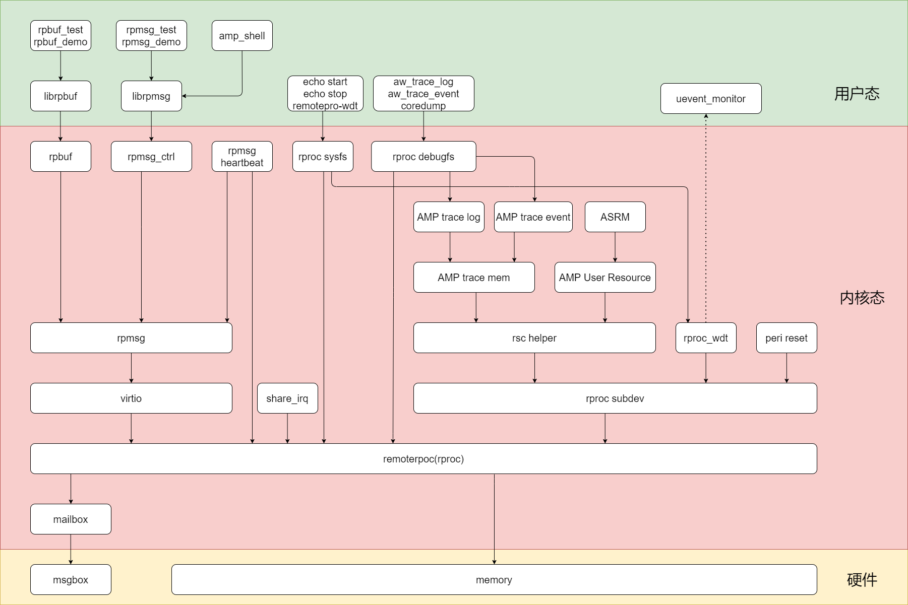

RTOS 系统环境下的AMP 系统架构框图如下：

<!-- PDF page 11 -->

*图2-2: RTOS 系统环境下的AMP 系统架构架构框图*

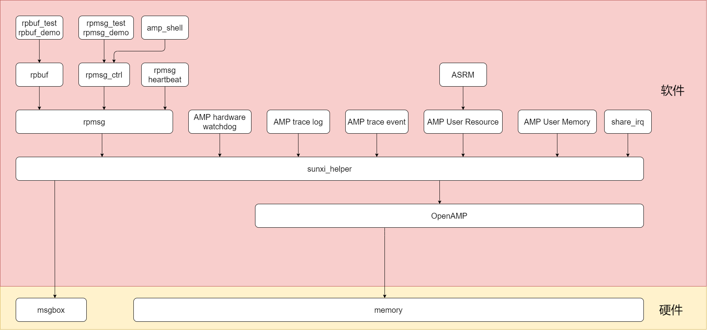

<!-- PDF page 12 -->

## 3 SDK使用

目前SDK 里集成了主核Linux 编译环境与从核RTOS 编译环境，下面将分别介绍两个编译环境的使用方法。

### 3.1 Linux编译环境

在SDK 下，首先执行source build/envsetup.sh 配置编译环境，然后输入lunch 命令选择具体方案。之后就可以使用一些快捷命令来帮助开发，此处介绍Linux 编译环境下常用的快捷命令。

1. ckernel, m kernel_menuconfig, mkernel：分别对应进入到内核目录，配置内核，单独编译内核。

2. m menuconfig：配置软件包。

3. cboot0, mboot0：进入boot0 目录，单独编译boot0。

4. cuboot, muboot：进入uboot 目录，单独编译uboot 相关固件。

```text
tina 系统相关的固件，如
oot0，uboot，内核，根文件系统等。
```

入板级配置目录，这里主要存放板级的设备树，分区等配置文件。

7. p：打包命令，将编译后的东西打包成固件。

!注意

m 命令是否编译RTOS 相关固件由对应方案的BoardConfig.mk 文件里的LICHEE_RTOS_PROJECT_NAME 变量决定，可参考“Linux 编译环境下编译RTOS”章节

### 3.2 RTOS编译环境

SDK 中的rtos 目录即为RTOS 编译环境，进入rtos 目录，执行source envsetup.sh 配置RTOS 编译环境(为防止RTOS 编译环境和Linux 编译环境中的环境变量冲突，建议单独开一个新的终端来配置RTOS 编译环境)，然后输入lunch_rtos 命令选择具体方案。之后就可以使用一些快捷命令来帮助开发，此处介绍RTOS 编译环境下常用的快捷命令。

切换到rtos/lichee/rtos

2. cdsp：快速切换到rtos/lichee/dsp 目录。

3. mrtos menuconfig：RTOS 配置界面。

4. mrtos：编译RTOS。

在RTOS 编译环境下编译后生成固件的路径为：

```text
RV核：rtos/lichee/rtos/build/<project>/img/rt_system.elf
DSP核：rtos/lichee/dsp/out/<chip>/evb1/<chip>_dsp0_evb1.bin
```

其中project 为方案名，例如：mr536_e907_evb1，chip 为芯片名，例如：mr536

另外目前在RTOS 编译环境下单独编译出来的RV 核固件未被strip，文件大小比较大，需要对固件进行strip，可在rtos/lichee/rtos 目录执行如下命令进行strip：

tools/riscv64-elf-x86_64-20201104/bin/riscv64-unknown-elf-strip build/&lt;project&gt;/img/rt_system.elf

若需要打包到最终的烧录固件里则还需要在打包前手动拷贝从核固件到具体方案的bin 目录，具体bin 目录的路径请参考“SDK 里的固件”章节。

由于在RTOS 编译环境下获取最终的RV 核固件的整个流程至少需要两步：编译、strip，而特殊情况下还需要做拷贝操作，建议不是非常熟悉RTOS 编译环境的客户使用Linux 环境来编译RTOS，其可自动处理strip 和拷贝操作。

技巧

一般在RTOS 编译环境里编译固件主要用于运行时单独更新从核固件这种场景，若需要使用烧录方式来更新从核固件，可参考“Linux 编译环境下编译RTOS”章节。

<!-- PDF page 13 -->

### 3.3 Linux编译环境下编译RTOS

最新SDK 支持在Linux 编译环境下直接编译并拷贝RTOS 固件到对应方案的bin 目录，前提是需要在对应方案的BoardConfig.mk 文件里增加LICHEE_RTOS_PROJECT_NAME 变量，以mr536_evb1 方案为例，需要在BoardConfig.mk 文件里增加如下内容：

LICHEE_RTOS_PROJECT_NAME:=mr536_e907_evb1

增加后在Linux 编译环境下执行make 命令或m 命令时会先编译RTOS 固件并拷贝到bin 目录，也可执行如下命令单独编译RTOS 并拷贝到bin目录：

./build.sh rtos

另外还支持如下命令：

- 修改RTOS 配置：./build.sh rtos menuconfig

编译中间文件：./build.shrtosclean

技巧

上述在Linux 编译环境下单独编译RTOS 的相关命令还可使用mrtos 系列命令，比如mrtos、mrtos menuconfig 和mrtos clean。

<!-- PDF page 14 -->

## 4 从核固件

### 4.1 固件文件命名

目前SDK 支持的从核架构有RISC-V 和Xtensa 架构，分别对应于RV 核和DSP 核，其固件文件分别命名为amp_rvx.bin 和amp_dspx.bin，其中x 表示从核的ID，此ID 是架构范围内唯一，并不是整个芯片范围内唯一，也即若芯片内集成了不同架构的从核(1 个RV 核和1 个DSP 核)，则其固件命名为amp_rv0.bin 和amp_dsp0.bin，而不是amp_rv0.bin 和amp_dsp1.bin(或是amp_rv1.bin 和amp_dsp0.bin)

### 4.2 固件文件格式

虽然上面提到固件文件的后缀名为.bin，但目前SDK 里使用从核固件文件实际上是经过strip 后的ELF 文件。

### 4.3 固件保存路径

#### 4.3.1 SDK里的固件

SDK 里从核固件保存的路径为如下几个模式(pattern)：

```text
bin/*.bin
configs/*/bin/*.bin
configs/*/*/bin/*.bin
configs/*/*/*/bin/*.bin
```

这些路径模式前面还需要加上device/config/chips/才是相对于SDK 根目录的相对路径，其中后面路径模式的文件若存在，则会覆盖前面的文件。

以MR527 和MR536 为例，MR527 的从核固件路径为device/config/chips/mr527/configs/evb/bin/amp_rv0.bin，满足第二种路径模式configs/*/bin/*.bin ；MR536 从核固件的路径为device/config/chips/mr536/bin/amp_rv0.bin，满足第一种路径模式bin/*.bin 。

#### 4.3.2 设备上的固件

设备上的从核固件一般保存在文件系统里，具体为/lib/firmware 目录下，一般用于从核在Linux 应用阶段启动并初始化的情况。若从核在bootloader 阶段(一般是u-boot) 启动，由于u-boot 目前不支持读取Linux 系统使用的文件系统，则需要将固件保存到分区里，例如对与RV 从核，会从核固件烧录在riscv0 分区或riscv0-r 分区。

!注意

```text
若使用
       OpenWRT
                 构建
                    rootfs，不管从核固件是保存在文件系统里还是分区里，都需要在主核
                    Linux
                    环境下启用软件包配置
CONFIG_PACKAGE_amp-firmware。
```

### 4.4 固件更新

从核固件更新主要有如下2 种方式

#### 4.4.1 构建时更新

构建时更新固件主要是单独编译RTOS 固件并将其打包进烧录固件中，然后通过烧录方式来更新从核固件，可参考“Linux 编译环境下编译RTOS”章节。

#### 4.4.2 运行时更新

运行时更新固件一般在Linux 系统里操作，使用adb push 命令将新固件上传到设备文件系统里，根据保存从核固件的方式执行对应的操作：

- 若从核固件保存在文件系统里，直接拷贝新固件到/lib/firmware 目录里替换掉对应的文件即可

```text
• 若从核固件保存在分区里，则可通过dd 命令更新，例如更新第一个RV 核固件的命令：dd if=amp_rv0.fex of=/dev/by-name/riscv0
```

<!-- PDF page 15 -->

nux:/#ls/dev/by-name/riscv0-ahl

```text
lrwxrwxrwx
           1 root
                    root
                    11 Jan
                    1 11:06 /dev/by-name/riscv0 -> /dev/ubi0_7
root@TinaLinux:/# ubiupdatevol /dev/ubi0_7 /mnt/UDISK/amp_rv0.fex
```

技巧

可通过内核日志确认从核固件是保存在分区里还是文件系统里，若内核日志中打印“load fw from filesystem, filename: amp_rv0.bin” 类似日志，则表明从核固件是保存在文件系统里的，否则是保存在分区里。

<!-- PDF page 16 -->

## 5 从核启动和初始化

首先说明下从核启动和从核初始化的概念，从核的启动指的是让从核开始运行代码，而从核的初始化则指的是Linux remoteproc 框架初始化remoteproc 的操作，完成初始化后才可以和从核通信。

目前SDK 里支持如下几种从核启动和初始化方式：

1. 从核在bootloader 阶段启动，在Linux 内核阶段初始化

2. 从核在bootloader 阶段启动，在Linux 应用阶段初始化

3. 从核在Linux 应用阶段启动并初始化

一般主要使用第1 种方式和第3 种方式，当前SDK 默认使用第1 种方式。

### 5.1 bootloader启动从核

```text
当前SDK 默认让从核在bootloader
阶段启动，bootloader 阶段又可具体细分
          boot0 阶段和uboot 阶段，一般方案会在
                    uboot 阶段启动从核，
```

实现了快启功能的平台则会在boot0 阶段启动从核(部分平台甚至boot0 直接启动Linux 内核，不会有uboot 阶段)。

uboot 阶段启动从核主要需要配置u-boot 启动命令、从核固件分区信息以及从核RTOS 端OpenAMP 框架等待主核Linux 端初始化从核，而在boot0 阶段启动从核时一般会从boot package 里获取从核固件，且平台对应的boot0 默认会启动从核，故此处不详细展开说明boot0 相关的配置。

#### 5.1.1 配置信息

##### 5.1.1.1 主核 u-boot 的 menuconfig 配置

采用u-boot 启动从核的方法，主核Linux 环境下u-boot 需要选中对应配置来提供启动从核的命令，SDK 中已默认选中，此章节对所需配置进行介绍。

```text
的uboot 目录，可采用
t 命令快速切换到该目录，makemenuconfig
  选中以下配置：
CONFIG_CMD_SUNXI_BOOTRV=y
CONFIG_BOOT_RISCV=y
```

##### 5.1.1.2 从核固件的分区信息和从核启动命令

以MR536 平台为例，执行cconfigs 进入方案配置目录，修改该目录中的两个文件openwrt/sys_partition.fex 和openwrt/env-5.15.cfg。部分旧平台可能没有openwrt 目录，可修改对应kernel 的版本目录下的对应文件，例如：MR527 对应修改linux-5.15/sys_partition.fex 和linux-

5.15/env-5.15.cfg。

1. sys_partition.fex 中添加从核固件的分区信息，内容如下：

[partition]

```text
name
          = riscv0
=2048
downloadfile = "amp_rv0.fex"
user_type
          = 0x8000
```

技巧

其中size 以512 对齐，可根据实际的从核固件文件大小调整。当设备使用ubi 文件系统时，riscv0 分区需要以496 对齐。

2. env-5.15.cfg 文件中添加启动从核的命令并修改bootcmd 环境变量，内容如下：

```text
boot_riscv=bootrv 46000000 200000 0 riscv0 riscv0-r
bootcmd=run boot_riscv sunxi_pre_cmd boot_normal
```

<!-- PDF page 17 -->

u-boot 中bootrv 命令的参数分别为固件文件加载内存地址、加载内存区域大小、从核ID、从核固件分区名、从核固件备份分区名，其中加载内存区域大小需要大于等于从核固件大小。

3. 对于MR153/MR536 等使用了安全env 的平台，只能在env-xx.cfg 文件中修改RV 的运行加载地址和加载内存区域大小，boot_riscv、

bootcmd 启动配置则定义在uboot 的bsp/configs 对应的平台的CONFIG_SUNXI_BOOT_ENV_STRING 配置中。如下是MR153 安全env的配置：

```text
~/workspace/tina_mr153/brandy/brandy-2.0/u-boot-2023/bsp/configs$ grep -rnwHI CONFIG_SUNXI_BOOT_ENV_STRING ./
./sun8iw22p1_mr153_nor_defconfig:117:CONFIG_SUNXI_BOOT_ENV_STRING="preboot=sunxi_get_kern_env;sunxi_preboot\n bootcmd=run
    boot_riscv sunxi_pre_cmd boot_normal\n sunxi_pre_cmd=${sunxicmd};sunxi_update\n sunxicmd=run setargs_nand\n boot_normal=
    sunxi_flash read 0x40007800 ${boot_partition};bootm 0x40007800 ${sunxi_ramd_addr} ${sunxi_fdt_addr}\n boot_riscv=bootrv ${
    rv_fw_load_addr} ${rv_fw_load_size} 0 ${riscv_partition} ${riscv-r_partition}\n boot_recovery=\n boot_fastboot=fastboot\n
    altbootcmd=sunxi_switch_system\n"
```

ina_mr153/device/config/chips/mr153/configs/evb1$grep-rnEHI"rv_fw_load_size=|rv_fw_load_addr=|riscv_partition=|

```text
riscv-r_partition=" ./
./openwrt/env-5.15.cfg:20:riscv_partition=riscv0
./openwrt/env-5.15.cfg:21:riscv-r_partition=riscv0-r
./openwrt/env-5.15.cfg:22:rv_fw_load_addr=0x44000000
./openwrt/env-5.15.cfg:23:rv_fw_load_size=0x300000
```

##### 5.1.1.3 从核RTOS环境配置

从核在u-boot 阶段启动时，RTOS 端OpenAMP 框架中部分逻辑是需要等待Linux 端初始化从核后才能继续执行的，因此从核RTOS 环境需要启用配置CONFIG_SLAVE_EARLY_BOOT。

!注意

从核RTOS 端OpenAMP 框架默认是放在线程中初始化的，在开启上述配置后会导致用户程序先于OpenAMP 框架初始化完成前运行(不开启

可能，但概率较低)，用户编写代码时需要注意这一点。

#### 5.1.2 u-boot启动从核现象

u-boot 启动从核时，会打印如下从核固件编译时间的日志：

*图5-1: uboot 启动RV 的logs*

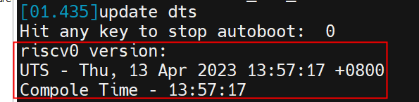

!注意

目前boot0 正常启动从核时不会有任何打印，只能根据从核串口是否在u-boot 之前或kernel 运行之前有打印来判断boot0 是否有启动从核。

### 5.2 Linux启动和初始化从核

Linux 里启动和初始化从核的操作可分为如下2 种组合：

<!-- PDF page 18 -->

nux 内核只启动从核但不初始化从核的情况。

#### 5.2.1 remoteproc状态

Linux remoteproc 框架里目前规定remoteproc 有7 种状态，分别为如下：

- offline：关机状态

- suspended：休眠状态

- running：运行状态

- crashed：crash 状态，也即remoteproc 进入了异常状态，需要恢复

- deleted：删除状态，一般不会出现这种情况

- attached：attached 状态，表明remoteproc 已在更早的阶段启动，且Linux 已初始化remoteproc

- detached：detached 状态，表明remoteproc 已在更早的阶段启动，比如bootloader 阶段

到offline、running、attached 以及detached 这4 种状态，由于目前SDK 默认在bootloader 阶段启动从核，在Linux 内核阶

段初始化从核，因此在主核Linux 系统完全启动后，从核的状态为attached。

#### 5.2.2 remoteproc生命周期管理相关命令

remoteproc 生命周期管理一般会用到2 个命令，分别用于start 和stop remoteproc，具体如下：

```text
• start remoteproc：echo start > /sys/class/remoteproc/remoteprocx/state
• stop remoteproc：echo stop > /sys/class/remoteproc/remoteprocx/state
```

上述命令里的x 表示remoteproc 的ID，在Linux 系统remoteproc 框架范围内唯一，和前面“固件文件命名” 章节里提到的从核ID 有区别，也即若某个具体芯片平台有多个不同架构的从核，此remoteproc ID 也不会重复。

需要注意的是在start remoteproc 时，会根据remoteproc 当前处于的状态执行不同的操作，若remoteproc 处于offline 状态，则会执行从核启动和从核初始化操作，执行完成后remoteproc 处于running 状态，若remoteproc 处于detached 状态(表明从核已在bootloader 阶段启

```bash
从核初始化操作，执行完成后从核处于
attached 状态。
另外查看
remoteproc
           状态可执行命令
                    cat
                    /sys/class/remoteproc/remoteprocx/state，还可通过命令
                    cat
                    /sys/class/remoteproc/
```

remoteprocx/name 查看对应的remoteproc 在dts 中的节点名，根据节点名来识别具体的从核。

#### 5.2.3 bootloader阶段已启动从核

此种情况下Linux 只需要初始化从核即可，在内核阶段初始化从核只需要对应的remoteproc 节点里增加auto-boot 空属性，应用阶段初始化从核则只需要start remoteproc 即可。

#### 5.2.4 bootloader阶段未启动从核

此种情况下一般从核固件会保存在文件系统里，在应用阶段启动并初始化从核，只需执行start remoteproc 对应的命令即可。

!

此种情况下虽然增加auto-boot 属性也可在内核阶段尝试启动并初始化从核，但由于remoteproc 框架初始化比较早，此时文件系统还无法正常使用，所以会出现启动失败的情况，一般不会在此种情况下让内核去启动和初始化从核。

<!-- PDF page 19 -->

## 6 从核在Linux侧的调试节点的使用说明

在remoteproc 框架中的remoteproc_debugfs.c 和remoteproc_sysfs.c 中分别创建了debugfs 和sysfs 节点。

### 6.1 sysfs节点

在remoteproc 框架中向用户提供了coredump、recovery、firmware、state、name 节点，其路径如下：

```text
/sys/class/remoteproc/remoteproc0/state
/sys/class/remoteproc/remoteproc0/name
/sys/class/remoteproc/remoteproc0/firmware
/sys/class/remoteproc/remoteproc0/recovery
/sys/class/remoteproc/remoteproc0/coredump
```

其作用分别为：

- state：通过输入不同的命令来控制远程处理器的状态；

- name：显示远程处理器的名称；

- firmware：通过输入来修改固件名称，在修改了固件名称后，需要将同名的固件放置在主核Linux 端的/lib/firmware 目录下，才可以start

启动改名后固件；

- recovery：recovery 的内容可以是enabled、disabled 或recovery 三者之一，用于控制恢复机制的行为。

- enabled 表示远程处理器将在崩溃时可以自动恢复；

- disabled 表示远程处理器在崩溃时将保持崩溃状态；

- recovery 表示如果远程处理器处于崩溃状态，此功能将触发立即恢复，而不用手动更改或检查恢复状态（启用/禁用）。

- coredump：coredump 的内容可以是inline、disabled 或default 三者之一，用于控制核心转储机制的行为。

- inline 表示coredump 不会被复制到单独的缓冲区，恢复过程必须等到数据被用户空间读取；

- disabled 表示这是默认的核心转储机制。恢复将在不收集任何转储的情况下继续进行；

示当remoteproc 崩溃时，整个核心转储将被复制到一个单独的缓冲区并暴露给用户空间。

### 6.2 debugfs节点

```text
在
remoteproc
           框架中向用户提供了
                    name、recovery、crash、resource_table、carveout_memories、coredump、aw_trace_log、
```

aw_trace_event 节点，其路径如下：

```text
/sys/kernel/debug/remoteproc/remoteproc0/name
/sys/kernel/debug/remoteproc/remoteproc0/recovery
/sys/kernel/debug/remoteproc/remoteproc0/crash
/sys/kernel/debug/remoteproc/remoteproc0/resource_table
/sys/kernel/debug/remoteproc/remoteproc0/carveout_memories
/sys/kernel/debug/remoteproc/remoteproc0/coredump
/sys/kernel/debug/remoteproc/remoteproc0/aw_trace_log
/sys/kernel/debug/remoteproc/remoteproc0/aw_trace_event
```

其作用分别为：

- name：显示远程处理器的名称；

- recovery：recovery 的内容可以是enabled、disabled 或recovery 三者之一，用于控制恢复机制的行为。

- enabled 表示远程处理器将在崩溃时可以自动恢复；

- disabled 表示远程处理器在崩溃时将保持崩溃状态；

- recovery 表示如果远程处理器处于崩溃状态，此功能将触发立即恢复，而不用手动更改或检查恢复状态（启用/禁用）。

- crash：记录系统崩溃时候的有关信息；

- resource_table：记录了从核的资源信息（资源表）；

- carveout_memories：记录从核的内存分配情况；

- coredump：coredump 的内容可以是inline、disabled 或default 三者之一，用于控制核心转储机制的行为。

<!-- PDF page 20 -->

示这是默认的核心转储机制。恢复将在不收集任何转储的情况下继续进行；

- enabled 表示当remoteproc 崩溃时，整个核心转储将被复制到一个单独的缓冲区并暴露给用户空间。

- aw_trace_log：查看从核系统运行过程中的日志。

- aw_trace_event：查看从核的trace event

<!-- PDF page 21 -->

## 7 从核 coredump使用

当从核运行过程中发生异常（内存越界、堆栈溢出、非法指针等）导致crash 时, 主核Linux 系统会把从核使用到的内存区域的数据存储在一个文件中，这个过程称作coredump，产生的文件即为coredump 文件(ELF 格式)，coredump 一般译为核心转储。

### 7.1 coredump的使用步骤

1. 修改内核配置，将下面的配置设置为y

```text
CONFIG_COREDUMP=y
CONFIG_WANT_DEV_COREDUMP=y
CONFIG_ALLOW_DEV_COREDUMP=y
CONFIG_DEV_COREDUMP=y
```

2. 使能从核coredump

方法一：永久启用，修改设备树中remoteproc 对应的节点，增加coredump 属性：

coredump;

以MR536 平台为例，修改如下：

```text
#tina/bsp$ git diff configs/linux-5.15-origin/sun55iw6p1.dtsi
  diff --git a/configs/linux-5.15-origin/sun55iw6p1.dtsi b/configs/linux-5.15-origin/sun55iw6p1.dtsi
  index 835331c9f..3ed5402fa 100644
  --- a/configs/linux-5.15-origin/sun55iw6p1.dtsi
  +++ b/configs/linux-5.15-origin/sun55iw6p1.dtsi
              e907_rproc: e907_rproc@1a00000 {
  +
                    coredump;
                    reg = <0x0 0x1a00000 0x0 0x1000>,
                    <0x0 0x01a02000 0x0 0x400>;
                    compatible="allwinner,e907-rproc";
```

方法二：临时启用（掉电丢失）

```bash
echo enabled > /sys/class/remoteproc/remoteproc0/coredump
```

3. 编译linux 内核，打包镜像，烧录更新。

4. 在从核执行panic 命令，产生crash。

以MR536 平台为例，在从核执行panic 命令后的输出如下：

```text
cpu0>panic
========================================================================
                    EXC_BREAKPOINT
========================================================================
```

gprs:

```text
x0:0x00000000
              ra:0x7000e3c6
                    sp:0x7008a410
                    gp:0x70045130
 tp:0x00000000
              t0:0xa5a5a5a5
                    t1:0x00000002
                    t2:0xa5a5a5a5
 s0:0x00000000
              s1:0x00000001
                    a0:0x00000001
                    a1:0x7008a420
 a2:0x00000000
              a3:0x00000000
                    a4:0x00000000
                    a5:0x7000de2c
 a6:0x00000000
              a7:0x7008a424
                    s2:0x7008a420
                    s3:0x7002ed90
 s5:0x70050d50
              s5:0x7008a6f0
                    s6:0xa5a5a5a5
                    s7:0xa5a5a5a5
 s8:0xa5a5a5a5
              s9:0xa5a5a5a5
                    s10:0xa5a5a5a5
                    s11:0xa5a5a5a5
 t3:0x00000022
              t4:0x0000003b
                    t5:0x00000020
                    t6:0x00000009
other:
mepc
      :0x7000de2c
mcause
      :0x38000003
mtval
      :0x00000000
mstatus :0x00003880
```

<!-- PDF page 22 -->

a5a5a5

```text
-------backtrace-----------
backtrace : 0X7000DE2C #某条指令的地址，从核因为执行这条指令而导致crash，通过这个地址，可以定位到此指令对应函数的哪一行
backtrace : invalid lr(00000000)
backtrace : 0X7000E3C4
backtrace : 0X7000D9E8
backtrace : 0X7000DD8C
backtrace : 0X70025DF4
```

省略

5. 在主核Linux 系统里可以查看从核生成的coredump 文件，coredump 文件路径为：/sys/class/remoteproc/remoteproc0/devcoredump/data

!注意

coredump，不会生成coredump 文件，coredump 文件只有在从核crash 时才生成。

- 读取完成后需要对/sys/class/remoteproc/remoteproc0/devcoredump/data 写入任意数据，否则新产生的coredump 不会保存，除非旧

的coredump 的生命周期结束(一般是5 分钟后自动释放掉)

6. 将coredump 文件从主核Linux 系统拷贝出来

以MR536 为例，使用adb pull 拉取coredump 文件：

```text
C:\Users\xxx\Desktop\temp>adb pull /sys/class/remoteproc/remoteproc0/devcoredump/data coredump.data
/sys/class/remoteproc/remoteproc0/devcoredump/data: 1 file pulled. 3.8 MB/s (2117812 bytes in 0.534s)
```

7. 将coredump 文件上传到到Tina SDK 的服务器的rtos 目录

```text
~/workspace/{SDK_ROOT}/rtos$ ls -ahl coredump.data
-rwxr--r-- 1 user user 3.1M 4月
                    9 10:17 coredump.data
```

### 7.2 gdb查看状态、全局变量

用户可以将从核的奔溃时生成的coredump.data 拷贝到SDK 中，然后执行命令将带有调试信息的rtos elf 原始固件中的section 数据替换为coredump.data 中相应的section 数据，重新生成一个带有奔溃时内存数据且带有调试信息的elf 固件，执行命令后会自动进入gdb 终端，用户可以在gdb 终端中查看全局变量、奔溃时的状态信息、内存等，具体操作如下：

1. 把奔溃时，从核的coredump 数据拷贝到SDK 中的rtos 的目录下：

```text
~/workspace/{SDK_ROOT}/rtos$ ls
board
      coredump.data
                  envsetup.sh
                    lichee
                    text
                    tools
~/workspace/{SDK_ROOT}/rtos$ ls -ahl coredump.data
-rwxr--r-- 1 user user 3.1M 4月
                    9 10:17 coredump.data
```

```text
下，执行env 设置以及进行
unch：
~/workspace/{SDK_ROOT}/rtos$ source envsetup.sh
~/workspace/{SDK_ROOT}/rtos$ lunch_rtos
```

3. 在rtos 目录下执行命令，将带有调试信息的rtos elf 原始固件中的section 数据替换为coredump.data 中相应的section 数据，并重新生成

一个带有奔溃时内存数据且带有调试信息的elf 固件。执行命令成功后，会自动进入gdb 终端。

~/workspace/&#123;SDK_ROOT&#125;/rtos$ rv_coredump_debug coredump.data

以MR153 为例，执行时的关键日志如下：

<!-- PDF page 23 -->

ina_mr153/rtos$rv_coredump_debugcoredump.data

```text
/home/user/workspace/tina_mr153/rtos
~/workspace/tina_mr153/rtos/tools/tool/rv_coredump_debug ~/workspace/tina_mr153/rtos
```

warning: Couldn't find general-purpose registers in core file.

```text
warning: Couldn't find general-purpose registers in core file.
#0
   <unavailable> in ?? ()
rv elf file path = /home/user/workspace/tina_mr153/rtos/lichee/rtos/build/mr153_e907_evb1/img/rt_system.elf
rv mem file path = coredump.data.mem
rv mem file addr = 421c5000
rv out file path = /home/user/workspace/tina_mr153/rtos/lichee/rtos/build/mr153_e907_evb1/img/rt_system_fix.elf
elf file size: 2181564
mem file size: 3145728
replace memory
update .text
update .data
update .version_table
ce_table
update .digest
update .FSymTab
update .amp_user_rsc later
update .bss later
add memory
idx: 0
idx: 1
idx: 2
idx: 3
idx: 4
idx: 5
idx: 6
idx: 7
update .amp_user_rsc
idx: 8
update .bss
idx: 9
idx: b
idx: c
idx: d
idx: e
idx: f
idx: 10
idx: 11
idx: 12
idx: 13
idx: 14
idx: 15
done
add mem to elf success
GNU gdb (Ubuntu 9.2-0ubuntu1~20.04.2) 9.2
Copyright (C) 2020 Free Software Foundation, Inc.
License GPLv3+: GNU GPL version 3 or later <http://gnu.org/licenses/gpl.html>
This is free software: you are free to change and redistribute it.
RANTY,totheextentpermittedbylaw.
Type "show copying" and "show warranty" for details.
This GDB was configured as "x86_64-linux-gnu".
Type "show configuration" for configuration details.
For bug reporting instructions, please see:
<http://www.gnu.org/software/gdb/bugs/>.
Find the GDB manual and other documentation resources online at:
```

&lt;http://www.gnu.org/software/gdb/documentation/&gt;.

```text
For help, type "help".
Type "apropos word" to search for commands related to "word"...
Reading symbols from /home/user/workspace/tina_mr153/rtos/lichee/rtos/build/mr153_e907_evb1/img/rt_system_fix.elf...
warning: Loadable section ".bss" outside of ELF segments
(gdb)
```

<!-- PDF page 24 -->

1. 命令执行日志中的#0 &lt;unavailable&gt; in ?? () 以及前两行warning 打印可以忽略

```text
2. 命令执行分为两个阶段，第一个阶段是生成带有崩溃时运行内存以及调试信息的
                    elf
                    固件，这个阶段执行成功会打
印add mem to elf success 。第二阶段时，进入gdb 终端，进入gdb 终端时，提示的
                    warning:Loadablesection".bss"outside
```

ofELFsegments 可以忽略，gdb 终端进入成功后，会打印提示(gdb) ，等待用户输入命令。gdb 如果无法正常进入，用户需要根据gdb 报错提示检查自己服务器的是否安装了gdb 以及是否缺失gdb 正常运行所需的依赖库。

进入gdb 时，默认加载了全志自定义的GDB 命令脚本文件，允许用户在gdb 终端中使用stat 命令查看调度器、堆、以及任务状态：

```text
(gdb) stat
scheduler stat:
       uxTaskNumber: 17
       uxCurrentNumberOfTasks: 9
       uxTopReadyPriority: 40001
dPending:0
       xSchedulerRunning: 1
       xPendedTicks: 0
       xTickCount: 342569
```

heap stat:

```text
total:
                   2837976 (
                    2771 KB)
       free:
                   2707712 (
                    2644 KB)
       free(mini):
                   2632688 (
                    2570 KB)
status
            tcb
                  id prio nest runtimec
                    stack-free-base-cur name
running 0x4222bc10
                  9
                    18
                    1
                    8
                    3542 42227c00 4222b358 CLI
ready
      0x4221aed0
                  4
                    0
                    0
                    342219
                    978 42219ec0 4221ae08 IDLE
delay2
      0x42219530
                  12
                    6
                    0
                    0
                    4006 422342e0 42238178 ctrldev
delay2
      0x42218200
                  2
                    31
                    0
                    13
                    206 42212b80 42212eb8 amp_hw_wdog_feed
delay2
      0x4221d080
                  5
                    31
                    0
                    1
                    1988 4221b070 4221cf80 Tmr Svc
delay2
      0x42218060
                  1
                    15
                    0
                    2
                    4434 42213050 42217598 uart
suspend 0x4221f750
                  7
                    17
                    0
                    0
                    926 4221e740 4221f5b8 pm_client
suspend0x4221e4106160
4004221e2a8pm_suspend
suspend 0x42234080
                  11
                    31
                    0
                    0
                    8118 4222c070 42233f48 cpu-vring-ipi
end
```

用户可以打印全局变量：

```text
(gdb) print rtos_version_msg
$1 = "UTS - Tue, 08 Apr 2025 09:29:21 +0800\nCompile Time - 09:29:21"
(gdb) print g_is_irq_core_init
$2 = 1
(gdb) print uart_msg
$3 = {{base = 39845888, irqn = 1800, clk_id = 117, rst_id = 27, uart_tx = 41, uart_rx = 42, func = 2, drqdst_tx = -1, drqsrc_rx =
     -1, no_suspend = false, used_dma = false, rsc = 0x0}, {base = 39849984, irqn = 1900, clk_id = 118,
   rst_id = 28, uart_tx = 160, uart_rx = 161, func = 4, drqdst_tx = -1, drqsrc_rx = -1, no_suspend = false, used_dma = false,
    rsc = 0x0}, {base = 39854080, irqn = 2000, clk_id = 119, rst_id = 29, uart_tx = 32, uart_rx = 33,
rqdst_tx=-1,drqsrc_rx=-1,no_suspend=false,used_dma=false,rsc=0x0},{base=39858176,irqn=2100,
    clk_id = 120, rst_id = 30, uart_tx = 110, uart_rx = 111, func = 6, drqdst_tx = -1, drqsrc_rx = -1,
   no_suspend = false, used_dma = false, rsc = 0x0}, {base = 39862272, irqn = 2200, clk_id = 121, rst_id = 31, uart_tx = 102,
    uart_rx = 103, func = 6, drqdst_tx = -1, drqsrc_rx = -1, no_suspend = false, used_dma = false,
   rsc = 0x0}, {base = 39866368, irqn = 2300, clk_id = 122, rst_id = 32, uart_tx = 288, uart_rx = 289, func = 7, drqdst_tx = -1,
     drqsrc_rx = -1, no_suspend = false, used_dma = false, rsc = 0x0}, {base = 39870464, irqn = 2400,
   clk_id = 123, rst_id = 33, uart_tx = 100, uart_rx = 101, func = 7, drqdst_tx = -1, drqsrc_rx = -1, no_suspend = false,
    used_dma = false, rsc = 0x0}, {base = 39874560, irqn = 2500, clk_id = 124, rst_id = 34, uart_tx = 45,
   uart_rx = 46, func = 3, drqdst_tx = -1, drqsrc_rx = -1, no_suspend = false, used_dma = false, rsc = 0xa0dead55}, {base =
    39878656, irqn = 16400, clk_id = 125, rst_id = 35, uart_tx = 106, uart_rx = 107, func = 7, drqdst_tx = -1,
   drqsrc_rx = -1, no_suspend = false, used_dma = false, rsc = 0x0}, {base = 39882752, irqn = 16500, clk_id = 126, rst_id = 36,
    uart_tx = 96, uart_rx = 97, func = 7, drqdst_tx = -1, drqsrc_rx = -1, no_suspend = false,
   used_dma = false, rsc = 0x0}, {base = 0, irqn = 0, clk_id = 0, rst_id = 0, uart_tx = 0, uart_rx = 0, func = 0, drqdst_tx = 0,
     drqsrc_rx = 0, no_suspend = false, used_dma = false, rsc = 0x0}, {base = 0, irqn = 0, clk_id = 0,
   rst_id = 0, uart_tx = 0, uart_rx = 0, func = 0, drqdst_tx = 0, drqsrc_rx = 0, no_suspend = false, used_dma = false, rsc = 0x0
```

<!-- PDF page 25 -->

=0,irqn=0,clk_id=0,rst_id=0,uart_tx=0,uart_rx=0,func=0,drqdst_tx=0,

```text
drqsrc_rx = 0, no_suspend = false, used_dma = false, rsc = 0x0}, {base = 0, irqn = 0, clk_id = 0, rst_id = 0, uart_tx = 0,
 uart_rx = 0, func = 0, drqdst_tx = 0, drqsrc_rx = 0, no_suspend = false, used_dma = false, rsc = 0x0}, {
base = 0, irqn = 0, clk_id = 0, rst_id = 0, uart_tx = 0, uart_rx = 0, func = 0, drqdst_tx = 0, drqsrc_rx = 0, no_suspend =
 false, used_dma = false, rsc = 0x0}, {base = 0, irqn = 0, clk_id = 0, rst_id = 0, uart_tx = 0,
uart_rx = 0, func = 0, drqdst_tx = 0, drqsrc_rx = 0, no_suspend = false, used_dma = false, rsc = 0x0}, {base = 0, irqn = 0,
 clk_id = 0, rst_id = 0, uart_tx = 0, uart_rx = 0, func = 0, drqdst_tx = 0, drqsrc_rx = 0,
no_suspend = false, used_dma = false, rsc = 0x0}}
```

用户可以查看内存：

```text
(gdb) x/4x 0x421d1532
                  #从内存地址0x421d1532 开始，查看4 个内存单元，每个单元以十六进制格式显示
0x421d1532 <cmd_panic>: 0x45019002
                    0x72f98082
                    0x110102c1
                    0x6709ce06
```

```text
解析：
0x421d1532：这是查看的起始内存地址。
这个地址对应的符号是cmd_panic，在这个地址处，程序正在执行cmd_panic函数。
```

37980820xce0611010x0814911a：这些是从地址0x421d1532开始的四个4字节（32位）值，以十六进制格式显示。

### 7.3 gdb查看trace event

若当用户配置打开rtos 的trace event 功能（具体请查阅“从核跟踪事件获取”章节），从核崩溃时，从设备中导出的coredump data 包含有记录了trace event 日志的全局数组，用户使用全志自定义的gdb 命令event_dump 可以把trace event 日志的全局数组中的event log 导出，具体如下：

```text
(gdb) event_dump
$1 = {magic = 4092878443, stat = 4223233, pid = 4, name = 0x421f4fac "unlock:7:mutex:", time = 5142563967105, args = 0x42211b38 <
    g_events_buffer+24>}
[42211b20 +1c
                    Tmr Svc-4 [0] .0 5142.563967105 tracing_mark_write: E|4|mutex|unlock:7:mutex:{0x42254690}]
[42211b3c +20
                    Tmr Svc-4 [0] .0 5142.563972271 tracing_mark_write: B|4|mutex|lock:7:mutex:4:ticks:{0
    x42254690}{-1}]
[42211b5c +1c
                    Tmr Svc-4 [0] .0 5142.563985146 tracing_mark_write: E|4|mutex|unlock:7:mutex:{0x42254690}]
mrSvc-4[0].05143.554379427tracing_mark_write:B|4|mutex|lock:7:mutex:4:ticks:{0
    x42254690}{-1}]
[42211b98 +1c
                    Tmr Svc-4 [0] .0 5143.554386468 tracing_mark_write: E|4|mutex|unlock:7:mutex:{0x42254690}]
[42211bb4 +20
                    Tmr Svc-4 [0] .0 5143.554391385 tracing_mark_write: B|4|mutex|lock:7:mutex:4:ticks:{0
    x42254690}{-1}]
[42211bd4 +1c
                    Tmr Svc-4 [0] .0 5143.554403677 tracing_mark_write: E|4|mutex|unlock:7:mutex:{0x42254690}]
[42211bf0 +20
                    Tmr Svc-4 [0] .0 5144.544798207 tracing_mark_write: B|4|mutex|lock:7:mutex:4:ticks:{0
    x42254690}{-1}]
....略...
```

### 7.4 从核各种状态下的coredump数据处理

从核在uevent-monitor-for-rproc_wdt 程序运行前就已经发生崩溃，会导致uevent-monitor-for-rproc_wdt 程序无法拿到运行前产生的看门狗超时事件，丢失看门狗事件，用户就无法保存coreudmp 文件，影响问题调试。为了避免这种情况，用户在导出从核coredump 数据前，应主动检查从核状态，以获取正确的coredump 数据，具体如下：

class/remoteproc/remoteprocX/state文件，根据状态进行处理：

```text
├─attached --> 这种状态是快启平台的从核正常运行状态，无需处理读取devcoredump/data
├─running --> 说明从核已发生过一次recovery，用户应检查devcoredump/data 是否存在
│
    ├─存在--> 此为recovery过程中自动生成的有效coredump数据，应保存
│
    └─不存在--> 说明此时coredump数据已被内核5分钟超时清理了
├─crashed --> 这种状态表示recovery失败，更具体来说是主核stop从核失败。recovery过程中如果stop从核成功，在没有重新start从核前，从核的状态
    都应该为offline。用户应检查devcoredump/data 是否存在
│
    ├─存在--> 这部分数据不可用，因为从核状态是在切换成offline之后，才会进行coredump，所以此时有数据则是上一次从核崩溃的残留数据，用户应
    主动去清除残留的数据，清理方式：向devcoredump/data 写入任意内容（如"1"），触发内核调度删除，然后再手动trigger 产生新的coredump
│
    └─不存在--> 手动trigger coredump --> 等待data --> 保存
└─offline --> stop从核成功但start从核失败，用户应检查devcoredump/data 是否存在
  ├─存在--> 此为有效的coredump数据，应保存
  └─不存在--> 手动trigger coredump --> 等待data --> 保存
```

<!-- PDF page 26 -->

手动trigger coredump 的方式：通过写“trigger” 到/sys/class/remoteproc/remoteprocX/device/rproc_dump 文件，触发内核调用rproc-&gt;ops-&gt;coredump() ，生成新的devcoredump 数据。具体源码可参考全志提供的uevent-monitor-for-rproc_wdt 程序（路径：openwrt/package/allwinner/testtools/testapk/openamp_ro bustness_test/src/uevent-monitor ）。如旧的SDK 包中不存在如上目录，请找对应fae 获取。

<!-- PDF page 27 -->

## 8 从核AMP控制台

当前SDK 中从核的控制台分为2 个，一个是通过串口进入的串口控制台，另外一个是在Linux 端通过amp_shell 命令进入的AMP 控制台，AMP控制台主要提供在Linux 端远程执行从核固件里的命令并查看命令的输出结果，一般在实际设备未引出从核串口的情况下使用。而串口控制台除了执行命令和查看命令输出结果外还可查看从核系统运行过程中打印的一些日志。AMP 控制台配置步骤如下。

### 8.1 配置信息

主核Linux 环境需要启用内核配置CONFIG_AW_RPMSG_CTRL、软件包配置CONFIG_PACKAGE_amp_shell。

从核RTOS 环境需要启用如下配置：

```text
• CONFIG_RPMSG_CLIENT
• CONFIG_MULTI_CONSOLE
```

RT_MULTI_CONSOLE

```text
• CONFIG_UART_MULTI_CONSOLE_AS_MAIN
• CONFIG_RPMSG_MULTI_CONSOLE
• CONFIG_RPMSG_CONSOLE_CACHE
```

### 8.2 使用示例

```text
以MR527 为例，在Linux 终端运行amp_shell -d /dev/rpmsg_ctrl-e906_rproc@7130000 可以进入RV 核AMP 控制台。
```

*图8-1: amp 控制台现象*

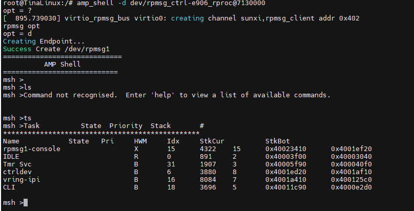

amp_shell 命令参数说明：

```text
• -d devname：指定要与哪个远端处理器建立连接，可使用ls /dev/rpmsg_ctrl* 查看可用的设备文件。
```

技巧

<!-- PDF page 28 -->

## 9 从核日志获取

由于AMP 控制台只能用来执行命令并查看命令输出结果，因此在未引出从核串口的情况下若需要获取从核系统运行过程中打印的日志则需要使用AMP trace log 功能。

AMP trace log 的实现机制说明：

- 异构系统会从DDR SDRAM 中开辟（carve out）出一段空间用作从核的运行内存，代码段、数据段、BSS 段、堆栈都在这段内存当中；

- 从核在BSS 段中定义一个全局的数组amp_log_buffer，将这个trace buffer 的address 和len，通过resource table 传递给主核

- 从核的printf 打印日志接口会同步将日志写入amp_log_buffer

- 主核解析resource table 获得trace buffer 的address 和len，然后从相应的内存中，读取trace log

### 9.1 配置信息

```text
需要启用内核配置CONFIG_AW_RPROC_ENHANCED_TRACE
    。
```

从核RTOS 环境需要启用配置CONFIG_AMP_TRACE_SUPPORT。

技巧

```text
RTOS
      环境下可通过配置
                    CONFIG_AMP_TRACE_BUF_SIZE
                    来修改
                    trace
                    buffer
                    的大小，此
                    buffer
                    对应的内存来自
                    RTOS
                    环
境的一个全局数组，定义在
                    rtos/lichee/rtos-components/thirdparty/openamp/trace_log/openamp_log.c
                    文件里，因此配置
CONFIG_AMP_TRACE_BUF_SIZE 的值决定了此全局数组占用的内存大小。
```

### 9.2 使用示例

```text
在Linux 系统控制台下执行命令cat /sys/kernel/debug/remoteproc/remoteproc0/aw_trace_log 即可看到从核系统运行过程中的日志：
x:/#cat/sys/kernel/debug/remoteproc/remoteproc0/aw_trace_log
nit
info: writer init
[0.108]sunxi_dma_clk_init()412 enter dma clk init
[0.126]
[0.127] *******************************************
[0.128] ** Welcome to MR536_E907 FreeRTOS V1.6.0
                    **
[0.132] ** Copyright (C) 2019-2021 AllwinnerTech **
[0.136] **
                    **
[0.141] **
             starting riscv FreeRTOS
                    **
[0.146] *******************************************
[0.151]
[0.151]Date:May 31 2024, Time:10:10:43
[0.155]init Icache
[0.157]init Dcache
[0.158]AMP timestamp device 0 probe success, count_freq: 24000000Hz
[0.165]amp_hw_wdog_feed_thread enter, feed_interval: 100ms, feed_interval_tick: 100
dwarewatchdog'snewtimeout:2s
[0.176]Begin to feed AMP hardware watchdog!
[0.180]pm_client_init end!!!
[0.190][RV] [AMP_INFO][openamp_platform_init:112]rproc0 init
[0.197][RV] [AMP_INFO][rproc_common_mmap:128]remoteproc mmap pa: 0x60039850, da: 0xffffffff, size = 0xc8
[0.206][RV] [AMP_INFO][rproc_common_mmap:199]map pa(0x60039850) to va(0x60039850)
[0.214][RV] [AMP_INFO][openamp_sunxi_create_rproc:238]Wait master update resource_table
[4.124][RV] [AMP_INFO][openamp_sunxi_create_rproc:241]resource_table ready
[4.126][RV] [AMP_INFO][rproc_common_mmap:128]remoteproc mmap pa: 0x42400000, da: 0x42400000, size = 0x40000
[4.136][RV] [AMP_INFO][rproc_common_mmap:199]map pa(0x42400000) to va(0x42400000)
[4.144][RV] [AMP_INFO][rproc_common_mmap:128]remoteproc mmap pa: 0xffffffff, da: 0x42440000, size = 0x1406
[4.154][RV] [AMP_INFO][rproc_common_mmap:199]map pa(0x42440000) to va(0x42440000)
[4.162][RV] [AMP_INFO][rproc_common_mmap:128]remoteproc mmap pa: 0xffffffff, da: 0x42442000, size = 0x1406
[4.172][RV] [AMP_INFO][rproc_common_mmap:199]map pa(0x42442000) to va(0x42442000)
[4.180][RV] [AMP_INFO][openamp_sunxi_create_rpmsg_vdev:365]Wait connected to remote master
[4.189][RV] [AMP_INFO][openamp_sunxi_create_rpmsg_vdev:371]Connecte to remote master Successed
```

<!-- PDF page 29 -->

MP_INFO][openamp_platform_init:157]rproc0initdone

```text
[4.205][RV] [AMP_INFO][openamp_platform_init:112]rproc0 init
[4.211][RV] [AMP_INFO][openamp_platform_init:122]rproc0 already init.
[4.218][RV] [AMP_INFO][openamp_ept_open:321]Waiting for ept('sunxi,rpmsg_ctrl') ready
[4.237][RV] [AMP_INFO][openamp_ept_open:326]ept('sunxi,rpmsg_ctrl') ready! src: 0x400, dst: 0x400
[4.241]rpmsg ctrldev: Start Running...
[4.245][RPBUF_INFO][rpbuf_init_service:154]Waiting for rpbuf ept('rpbuf-service') ready.
[4.253][RV] [AMP_INFO][openamp_platform_init:112]rproc0 init
[4.259][RV] [AMP_INFO][openamp_platform_init:122]rproc0 already init.
[4.266][RV] [AMP_INFO][openamp_ept_open:321]Waiting for ept('sunxi,rpmsg_heartbeat') ready
[4.297][RPBUF_INFO][rpbuf_init_service:160]rpbuf ept('rpbuf-service') ready! src: 0x401, dst: 0x401
[4.315][RV] [AMP_INFO][openamp_ept_open:326]ept('sunxi,rpmsg_heartbeat') ready! src: 0x402, dst: 0x402
[4.319]Start Rpmsg Hearbeat Timer
```

从核进入异常状态后，主核Linux 端自动重启从核前也会主动获取从核系统运行过程中的日志并打印出来。如下所示，从核panic 异常时，主核Linux 端既输出了内核日志，也输出了从核的日志。用户可配置主核Linux 端的CONFIG_AW_RPROC_ENHANCED_TRACE_CRASH_DUMP 为n，可禁止在从核异常时输出从核日志到内核日志中。

```text
[
   36.053987] axp2202-cldo4: disabling
[
   36.059619] axp2202-vmid: disabling
[
   39.377556] remoteproc remoteproc0: crash detected in e907_rproc: type watchdog
[
   39.386901] remoteproc remoteproc0: handling crash #1 in e907_rproc
[
   39.394063] remoteproc remoteproc0: recovering e907_rproc
[
   39.404001] rpmsg_heartbeat virtio0.sunxi,rpmsg_heartbeat.-1.1026: virtio0.sunxi,rpmsg_heartbeat.-1.1026 is removed
[
   39.417880] sunxi-rproc 1a00000.e907_rproc: exception cause: EXC_BREAKPOINT
[
   39.425826] sunxi-rproc 1a00000.e907_rproc: begin dump crash log before stop remoteproc!
[
   39.435806] sunxi-rproc 1a00000.e907_rproc: trace mem: 0x60043780, len: 32768
[
   39.444356] trace_mem:
                    ffffffc009843780
[
   39.449378] trace_mem_len: 32768
[
   39.452993] r->pos:
                    0
[
   39.456240] r->area_size:
                    0
[
   39.459482] w->pos:
                    21346
[
   39.463116] w->size:
                    32640
[
   39.466743] w->area_size:
                    64
[
   39.470079] w->overrun:
                    0
nfo:readerinit
[
   39.476743]
[
   39.478524] info: writer init
[
   39.481937] sunxi_dma_clk_init()406 enter dma clk init
[
   39.487676]
[
   39.489440]
             *******************************************
[
   39.495476]
             ** Welcome to MR536_E907 FreeRTOS V1.6.0
                    **
[
   39.501810]
             ** Copyright (C) 2019-2021 AllwinnerTech **
[
   39.507859]
             **
                    **
[
   39.513892]
             **
                   starting riscv FreeRTOS
                    **
[
   39.519915]
             *******************************************
[
   39.525938]
[
   39.527690] Date:Feb 24 2025, Time:16:41:03
[
   39.532352] AMP timestamp device 0 probe success, count_freq: 24000000Hz
[
   39.539831] amp_hw_wdog_feed_thread enter, feed_interval: 100ms, feed_interval_tick: 100
[
   39.548854] AMP hardware watchdog's new timeout: 2s
[
   39.554295] Begin to feed AMP hardware watchdog!
[
   39.559446] pm_client_init end!!!
RV][AMP_INFO][openamp_platform_init:217]rproc0init
[
   39.570813] [RV] [AMP_INFO][rproc_common_mmap:128]remoteproc mmap pa: 0x6003f448, da: 0xffffffff, size = 0x138
[
   39.582840] [RV] [AMP_INFO][rproc_common_mmap:199]map pa(0x6003f448) to va(0x6003f448)
[
   39.592644] [RV] [AMP_INFO][openamp_sunxi_create_rproc:238]Wait master update resource_table
[
   39.603023] [RV] [AMP_INFO][openamp_sunxi_create_rproc:241]resource_table ready
[
   39.612146] [RV] [AMP_INFO][rproc_common_mmap:128]remoteproc mmap pa: 0x42400000, da: 0x42400000, size = 0x40000
[
   39.624368] [RV] [AMP_INFO][rproc_common_mmap:199]map pa(0x42400000) to va(0x42400000)
[
   39.634171] [RV] [AMP_INFO][rproc_common_mmap:128]remoteproc mmap pa: 0x4244c000, da: 0x4244c000, size = 0x1000
[
   39.646300] [RV] [AMP_INFO][rproc_common_mmap:199]map pa(0x4244c000) to va(0x4244c000)
[
   39.656102] [RV] [AMP_INFO][rproc_common_mmap:128]remoteproc mmap pa: 0xffffffff, da: 0x42440000, size = 0x1406
[
   39.668225] [RV] [AMP_INFO][rproc_common_mmap:199]map pa(0x42440000) to va(0x42440000)
[
   39.678030] [RV] [AMP_INFO][rproc_common_mmap:128]remoteproc mmap pa: 0xffffffff, da: 0x42442000, size = 0x1406
[
   39.690156] [RV] [AMP_INFO][rproc_common_mmap:199]map pa(0x42442000) to va(0x42442000)
[
   39.699957] [RV] [AMP_INFO][openamp_sunxi_create_rpmsg_vdev:365]Wait connected to remote master
[
   39.710626] [RV] [AMP_INFO][openamp_sunxi_create_rpmsg_vdev:371]Connecte to remote master Successed
```

<!-- PDF page 30 -->

openamp_share_irq_init:139]share_irq_table(addr:4244C000)invalidtag:0x0,shouldbe0x52454459

```text
[
   39.733037] [RV] [AMP_ERR][amp_share_irq_init:167]Init Share Interrupt Table Failed,ret=-14.
[
   39.743323] [RV] [AMP_ERR][openamp_platform_init:256]Init AMP share interrupt failed, ret: -4
[
   39.753707] [RV] [AMP_INFO][openamp_platform_init:268]rproc0 init done
[
   39.761858] [RV] [AMP_INFO][openamp_platform_init:217]rproc0 init
[
   39.769532] [RV] [AMP_INFO][openamp_platform_init:227]rproc0 already init.
[
   39.778169] [RV] [AMP_INFO][openamp_ept_open:439]Waiting for ept('sunxi,rpmsg_ctrl') ready
[
   39.788363] [RV] [AMP_INFO][openamp_ept_open:444]ept('sunxi,rpmsg_ctrl') ready! src: 0x400, dst: 0x400
[
   39.799717] rpmsg ctrldev: Start Running...
[
   39.804382] [RPBUF_INFO][rpbuf_init_service:154]Waiting for rpbuf ept('rpbuf-service') ready.
[
   39.814476] [RV] [AMP_INFO][openamp_platform_init:217]rproc0 init
[
   39.822532] [RV] [AMP_INFO][openamp_platform_init:227]rproc0 already init.
[
   39.831167] [RV] [AMP_INFO][openamp_ept_open:439]Waiting for ept('sunxi,rpmsg_heartbeat') ready
[
   39.841842] [RPBUF_INFO][rpbuf_init_service:160]rpbuf ept('rpbuf-service') ready! src: 0x401, dst: 0x401
[
   39.852995] [RV] [AMP_INFO][openamp_ept_open:444]ept('sunxi,rpmsg_heartbeat') ready! src: 0x402, dst: 0x402
[
   39.865214] Start Rpmsg Hearbeat Timer
[
   39.869493] Warning: no shared GPIO interrupt info table!
[
   39.875512] =====================================================================================================
EXC_BREAKPOINT
[
   39.895309] =====================================================================================================
[
   39.906759]
[
   39.908413] gprs:
[
   39.910560]
             x0:0x00000000
                    ra:0x6000caf4
                    sp:0x6007aef0
                    gp:0x6003f800
[
   39.918230]
             tp:0x00000000
                    t0:0xa5a5a5a5
                    t1:0x00000002
                    t2:0xa5a5a5a5
[
   39.925902]
             s0:0x00000000
                    s1:0x00000001
                    a0:0x00000001
                    a1:0x6007af00
[
   39.933570]
             a2:0x00000000
                    a3:0x00000000
                    a4:0x00000000
                    a5:0x6000c55a
[
   39.941237]
             a6:0x00000000
                    a7:0x6007af04
                    s2:0x6007af00
                    s3:0x6002ab10
[
   39.948902]
             s5:0x60042dd8
                    s5:0x6007b1d0
                    s6:0xa5a5a5a5
                    s7:0xa5a5a5a5
[
   39.956571]
             s8:0xa5a5a5a5
                    s9:0xa5a5a5a5
                    s10:0xa5a5a5a5
                    s11:0xa5a5a5a5
[
   39.964239]
             t3:0x00000022
                    t4:0x0000003b
                    t5:0x00000020
                    t6:0x00000009
[
   39.971906]
[
   39.973564] other:
[
   39.975800] mepc
                  :0x6000c55a
[
   39.979299] mcause
                  :0x38000003
[
   39.982801] mtval
                  :0x00000000
[
   39.986302] mstatus :0x00003880
scratch:0xa5a5a5a5
[
   39.993303]
[
   39.995058] -------backtrace-----------
[
   39.999332] backtrace : 0X6000C55A
[
   40.003318] backtrace : invalid lr(00000000)
[
   40.008174] backtrace : 0X6000CAF2
[
   40.012161] backtrace : 0X6000C116
[
   40.016146] backtrace : 0X6000C4BA
[
   40.020138] backtrace : 0X60022790
省略
```

当CONFIG_AW_RPROC_ENHANCED_TRACE_CRASH_DUMP 配置为n 时，从核异常时的详细日志不会输出到内核日志中，从核异常原因可通过类似如下的内核日志来判断，下面这个日志是从核panic 时，主核Linux 端打印的异常原因：

```text
[
   39.417880] sunxi-rproc 1a00000.e907_rproc: exception cause: EXC_BREAKPOINT
```

<!-- PDF page 31 -->

## 10 从核跟踪事件获取

### 10.1 概述

trace event（跟踪事件）作用如下：

1. 用于性能监控和调试的一个重要特性，通过记录子系统的事件，可以帮助分析系统的性能瓶颈。例如，可以跟踪CPU 调度器的行为、内存分配

情况、I/O 操作等，trace_events 可以帮助开发者快速定位问题。例如，如果发现某个模块有问题，可以通过启用相关的跟踪事件来查看具体的执行过程。

2. 它允许用户启用和自定义各种跟踪事件

3. 定义跟踪点：跟踪点（Tracepoints）是在代码中预定义的位置，当执行到这些位置时，相关的信息会被记录下来。

4. 用户可以通过配置文件或命令行工具来启用或禁用特定的跟踪事件。

### 10.2 配置

从核支持用户配置各个子系统是否启用trace event，相关的的配置层级如下：

System components---&gt; aw components

---&gt; RTOS Event Support

以使能mutex 的trace event 为例，配置结果如下：

*图10-1: mutex trace_events 配置*

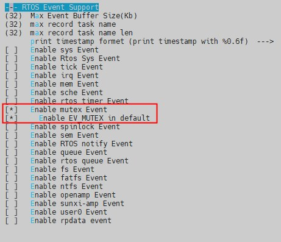

用户如果需要启用其他模块的trace event，启用相应的配置即可。

如下图所示，是mutex 的trace_event 日志输出到event traces buffer 的部分情况。

<!-- PDF page 32 -->

*图10-2: hal_mutex 调用trace_events 接口情况*

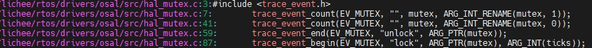

### 10.3 从核trace event命令使用说明

```text
cpu0>trace_events
useage:
  #导出所有支持的trace event的状态
  trace_events events
                    :dump all support subsys
  #把记录了trace evnent的buffer内容全部打印出来
sdump
 :dumpeventsbuffer
  #单独控制某个子系统的trace event的开关
  trace_events ctrl name 0/1 :ctrl wether enable sys event
  #禁用所有子系统trace events
  trace_events disable
                    :disable all sys event
  #使能所有子系统trace events
  trace_events enable
                    :enable all sys event
  #把记录了trace evnent的buffer内容全部清除掉
  trace_events clear
                    :clear event buffer
```

以mutex 为例，演示trace_events 令的使用：

```text
cpu0>trace_events events
                    #dump支持的trace events的子系统的trace event状态
      mutex
                    [enable]
                    #支持mutex产生trace event日志，其状态为enabled
cpu0>trace_events ctrl mutex 0
                    #disable mutex产生trace event
cpu0>trace_events events
      mutex
                    [disable]
                    #支持mutex产生trace eventr日志，其状态为disabled
cpu0>trace_events ctrl mutex 1
                    #disable mutex产生trace event
cpu0>trace_eventsevents
      mutex
                    [enable]
cpu0>trace_events disable
                    #禁用所有子系统trace events
cpu0>trace_events events
      mutex
                    [disable]
cpu0>trace_events enable
                    #使能所有子系统trace events
cpu0>trace_events events
      mutex
                    [enable]
```

### 10.4 日志格式说明

下面的伪代码中，记录了两条mutex 的trace event 日志

```text
int a = 1;
//产生一条begin日志
trace_event_begin(EV_MUTEX, "foo1", ARG_PTR(&a));
日志
```

trace_event_end(EV_MUTEX, "foo2", ARG_PTR(&a));

使用trace event dump 可以得到如下的日志：

cpu0&gt;trace_events dump

```text
# tracer: nop
#
#
                    _---=> irqs-off (.: irq enable, d:irq disabled)
#
                   /
                    _--=> preempt-depth
#
                   | /
#
      TASK-PID
               CPU# || TIMESTAMP
#
         | |
                 |
                   ||
                    |
      hellowold-6
                [0] .0 52.915813: tracing_mark_write: B|6|mutex: foo1 &a=6008DA18
```

<!-- PDF page 33 -->

old-6[0].052.915928:tracing_mark_write:E|6|mutex:foo2&a=6008DA18

日志分析如下，其中括号内的注解为日志的每个字段注解：

```text
hellowold（任务名称）-6（任务pid）
                    [0(cpu的id)] .0 52.915813(时间戳): tracing_mark_write（EV_MUTEX属于非EV_SCHE类event）: B(表示调用
    trace_event_begin输出的打印)|6（任务pid）|mutex（subsys_str，定义在trace_event_def.h的字符串）: foo1（trace_event_begin接口的第
    二个参数）&a（trace_event_begin第三个参数ARG_PTR的括号里面的字符）=6008DA18（&a的指针值）
hellowold（任务名称）-6（任务pid）
                    [0(cpu的id)] .0 52.915928(时间戳): tracing_mark_write（EV_MUTEX属于非EV_SCHE类event）: E(表示调用
    trace_event_end输出的打印)|6（任务pid）|mutex（subsys_str，定义在trace_event_def.h的字符串）: foo2（trace_event_end接口的第二个
    参数）&a（trace_event_begin第三个参数ARG_PTR的括号里面的字符）=6008DA18（&a的指针值）
```

### 10.5 trace event接口说明

#### 10.5.1 trace_event

一个完整的事件，通常用于简单事件的跟踪。

语法：

trace_event(subsys, name, [arg1, arg2, ...])

- subsys：事件所属的子系统标识符，如EV_SPIN、EV_SEM 等。

- name：事件名称，描述事件的类型或操作。

- arg：与事件相关的参数，可选，使用宏（如ARG_PTR、RET_ARG）包装。

使用示例：

trace_event(EV_MUTEX, "lock", ARG_PTR(mutex));

```text
V_MUTEX 中的“lock”
件，传递指针mutex 作为参数。
```

#### 10.5.2 trace_event_begin

功能：用于记录事件的开始，通常与trace_event_end 配对使用，用于跟踪事件的持续时间。

语法：

trace_event_begin(subsys, name, [arg1, arg2, ...])

- subsys：事件所属的子系统标识符。

- name：事件名称。

- arg：与事件相关的参数，可选。

使用示例：

trace_event_begin(EV_SPIN, "", ARG_PTR(lock), ARG_ULONG_RENAME(flags, __cpsr));

- 记录子系统EV_SPIN 中的事件开始，传递指针lock 和重命名为__cpsr 的flags 作为参数。

#### 10.5.3 trace_event_end

功能：用于记录事件的结束，通常与trace_event_begin 配对使用。

语法：

trace_event_end(subsys, name, [arg1, arg2, ...])

<!-- PDF page 34 -->

件所属的子系统标识符。

- name：事件名称。

- arg：与事件相关的参数，可选。

使用示例：

trace_event_end(EV_SPIN, "", ARG_PTR(lock));

- 记录子系统EV_SPIN 中的事件结束，传递指针lock 作为参数。

#### 10.5.4 trace_event_count

功能：一个用于记录计数器事件的接口。它通常用于跟踪资源的使用情况，例如信号量、互斥锁等。

语法:

trace_event_count(subsys, _name, p, v)

- subsys：事件所属的子系统标识符，例如EV_SEM、EV_MUTEX 等。

- _name：事件名称，通常留空。

- p：指针。

- v：计数器值，可以是当前计数或变化量。

使用示例:

```text
trace_event_count(EV_SEM, "", sem, ARG_INT_RENAME(sem, cnt));
trace_event_count(EV_MUTEX, "", mutex, ARG_INT_RENAME(mutex, 1));
```

- 第一个示例记录信号量sem 的计数变化。

```text
记录互斥锁mutex 的状态变化（
   1 表示加锁，0 表示解锁）。
```

### 10.6 自定义trace event与使用trace event

1. 在trace_event_def.h 中添加新的子系统枚举

- 在event_subsys 枚举中，添加新的子系统枚举项，例如：

EV_NEW,

- 确保在定义时，新的子系统枚举项具有一个对应的条件编译宏（如CONFIG_EVENTS_TRACE_EV_NEW）。

2. 添加新的子系统字符串定义

- 在trace_event_def.h 文件中，添加新的子系统字符串宏定义，例如：

```text
#define EV_NEW_STRING
                    "new"
```

3. 在Kconfig 文件中添加配置选项

- 在Kconfig 文件中，添加新的子系统配置选项，格式如下：

config EVENTS_TRACE_EV_NEW

```text
bool "Enable new Event"
      default n
config EVENTS_TRACE_EV_NEW_DEFAULT
      bool "Enable EV_NEW in default"
      depends on EVENTS_TRACE_EV_NEW
      default n
```

<!-- PDF page 35 -->

```text
nt_def.c 中的subsys_class
数组中增加元素：
[EV_NEW] = {
  .name = EV_NEW_STRING,
  .enable = EV_MACRO_IS_ENABLED(CONFIG_EVENTS_TRACE_EV_NEW_DEFAULT),
  .buildin = EV_MACRO_IS_ENABLED(CONFIG_EVENTS_TRACE_EV_NEW)
},
```

5. 然后打开new event 配置

*图10-3: 配置new event*

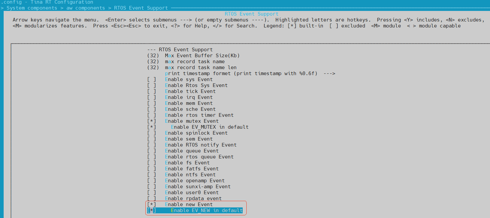

6. 使用new event :

```c
static void helloworld(void * param)
{
   int a = 1;
   int *p = &a;
   trace_event(EV_NEW, "init", ARG_PTR(p));
   trace_event_begin(EV_NEW, "foo1", ARG_PTR(p));
   trace_event_end(EV_NEW, "foo2", ARG_PTR(p));
   trace_event_count(EV_NEW, "", p, ARG_INT_RENAME(p, 1));
   trace_event_count(EV_NEW, "", p, ARG_INT_RENAME(p, 0));
   trace_event(EV_NEW, "deinit", ARG_PTR(p));
}
```

ent 日志：

```text
cpu0>trace_events dump
# tracer: nop
#
#
                    _---=> irqs-off (.: irq enable, d:irq disabled)
#
                   /
                    _--=> preempt-depth
#
                   | /
#
      TASK-PID
               CPU# || TIMESTAMP
#
         | |
                 |
                   ||
                    |
      hellowold-0
                [0] .0 45.020855: tracing_mark_write: I|0|new: init p=60074e0c
      hellowold-0
                [0] .0 45.020866: tracing_mark_write: B|0|new: foo1 p=60074e0c
      hellowold-0
                [0] .0 45.020866: tracing_mark_write: E|0|new: foo2 p=60074e0c
      hellowold-0
                [0] .0 45.020870: tracing_mark_write: C|1611091468|p|1
      hellowold-0
                [0] .0 45.020870: tracing_mark_write: C|1611091468|p|0
      hellowold-0
                [0] .0 45.020870: tracing_mark_write: I|0|new: deinit p=60074e0c
```

<!-- PDF page 36 -->

的补丁：

```text
user@AW:~/tina_sdk/rtos/lichee/rtos-components$ git diff
diff --git a/aw/trace_event/event.Kconfig b/aw/trace_event/event.Kconfig
index f491c9e6..9864c9a3 100644
--- a/aw/trace_event/event.Kconfig
+++ b/aw/trace_event/event.Kconfig
@@ -158,3 +158,11 @@ config EVENTS_TRACE_EV_RPD_DEFAULT
      depends on EVENTS_TRACE_EV_RPD
      default n
+config EVENTS_TRACE_EV_NEW
+
      bool "Enable new Event"
+
      default n
+config EVENTS_TRACE_EV_NEW_DEFAULT
+
      bool "Enable EV_NEW in default"
+
      depends on EVENTS_TRACE_EV_NEW
+
      default n
diff --git a/aw/trace_event/include/trace_event_def.h b/aw/trace_event/include/trace_event_def.h
index d7b3424a..82c7dae3 100644
--- a/aw/trace_event/include/trace_event_def.h
+++ b/aw/trace_event/include/trace_event_def.h
@@ -23,7 +23,8 @@ typedef enum {
      EV_SUNXIAMP,
      EV_USR0,
      EV_RPD,
-
      EV_NUM_SUBSYS
+
      EV_NEW,
+
      EV_NUM_SUBSYS,
 } event_subsys;
 #define EV_SYS_STRING
                    "sys"
@@ -46,5 +47,6 @@ typedef enum {
 #define EV_SUNXIAMP_STRING
                    "amp"
 #define EV_USR0_STRING
                    "usr0"
D_STRING
"rpd"
+#define EV_NEW_STRING
                    "new"
 #endif
diff --git a/aw/trace_event/trace_event_def.c b/aw/trace_event/trace_event_def.c
index 818aaa8a..3c49fedf 100644
--- a/aw/trace_event/trace_event_def.c
+++ b/aw/trace_event/trace_event_def.c
@@ -101,6 +101,12 @@ struct subsys_entry subsys_class[EV_NUM_SUBSYS] = {
      [EV_RPD] = {
             .name = EV_RPD_STRING,
             .enable = EV_MACRO_IS_ENABLED(CONFIG_EVENTS_TRACE_EV_RPD_DEFAULT),
-
             .buildin = EV_MACRO_IS_ENABLED(CONFIG_EVENTS_TRACE_EV_RPD)
+
             .buildin = EV_MACRO_IS_ENABLED(CONFIG_EVENTS_TRACE_EV_RPD),
+
      },
+
+
      [EV_NEW] = {
+
             .name = EV_NEW_STRING,
.enable=EV_MACRO_IS_ENABLED(CONFIG_EVENTS_TRACE_EV_NEW_DEFAULT),
+
             .buildin = EV_MACRO_IS_ENABLED(CONFIG_EVENTS_TRACE_EV_NEW)
      },
 };
```

### 10.7 主核获取从核的trace events

从核在支持了trace event 的基础上，主核配置CONFIG_AW_RPROC_TRACE_EVENT_PARSER 为y，允许用户在主核Linux 命令行获取trace event。配置如下图所示

<!-- PDF page 37 -->

*图10-4: 配置支持主核通过命令行获取trace event*

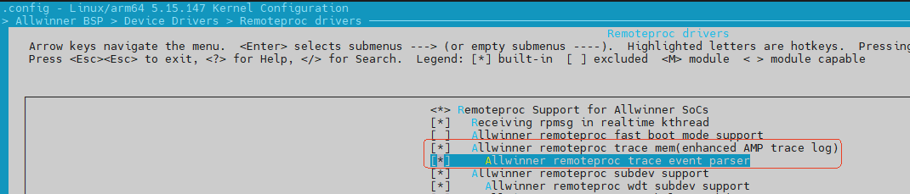

主核在命令行获取trace event 日志如下图所示，用户可以执行cat/sys/kernel/debug/remoteproc/remoteproc0/aw_trace_event 获取从核日志

*图10-5: 主核获取从核的trace event 日志*

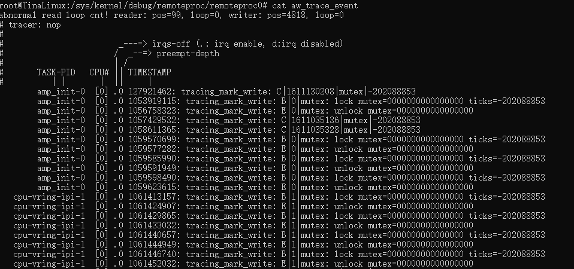

<!-- PDF page 38 -->

## 11 从核异常状态自动恢复

从核异常状态自动恢复支持使用AMP 软件看门狗或AMP 硬件看门狗。

### 11.1 AMP软件看门狗

异构通信框架支持AMP 软件看门狗功能，即rpmsg heartbeat 功能，早期也被称为心跳保活。当从核因为异常或跑飞等原因导致无法继续发送心跳数据给主核后，主核可以检测到从核此时未正常运行，并重新启动从核，配置步骤如下：

#### 11.1.1 配置信息

主核Linux 环境需要启用内核配置CONFIG_AW_RPMSG_HEARTBEAT。

从核RTOS 环境需要启用配置CONFIG_RPMSG_HEARBEAT。

```text
需要注意的是从核RTOS 的rpmsgheartbeat
配置目录下的CONFIG_RPMSG_REMOTE_NAME
                配置需要与Linux
        端board.dts 里remoteproc
```

dts 节点的名字保持一致，如下：

*图11-1: RTOS 环境的remoteproc 名字*

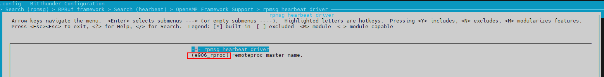

*图11-2: Linux 环境的dts 节点名字*

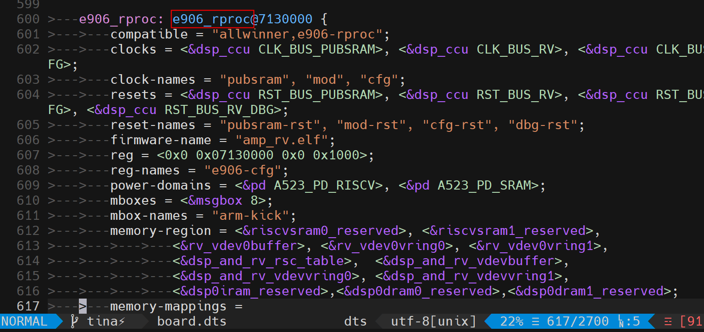

#### 11.1.2 使用示例

在从核系统控制台执行panic 命令让从核crash，之后主核Linux 端会自动重新启动从核，如下：

<!-- PDF page 39 -->

*图11-3: Linux 终端检测从核状态异常并重启从核现象*

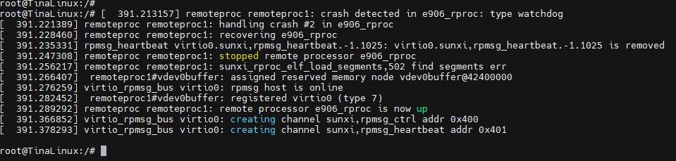

*图11-4: RTOS 终端异常状态自动恢复现象*

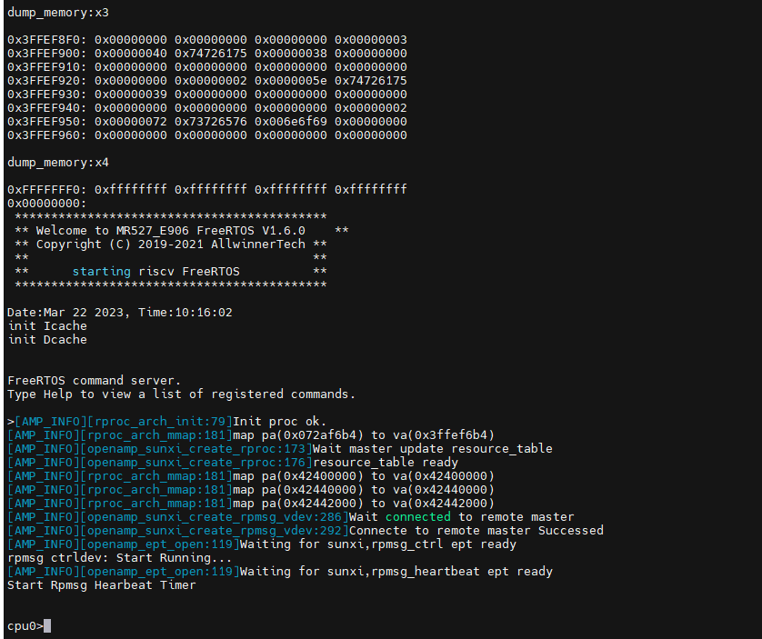

### 11.2 AMP硬件看门狗

<!-- PDF page 40 -->

#### 11.2.1 配置信息

主核Linux 环境需要启用内核配置CONFIG_AW_RPROC_SUBDEV 和CONFIG_AW_RPROC_SUBDEV_WDT。

主核Linux 环境dts 配置中remoteproc 节点需要增加reg、reg-names、interrputs 以及interrupt-names 这些Linux 内核支持的标准属性：

```dts
diff --git a/configs/linux-5.15-origin/sun55iw6p1.dtsi b/configs/linux-5.15-origin/sun55iw6p1.dtsi
index 168801a72..e88c0b126 100644
--- a/configs/linux-5.15-origin/sun55iw6p1.dtsi
+++ b/configs/linux-5.15-origin/sun55iw6p1.dtsi
@@ -1870,7 +1870,7 @@
             e907_rproc: e907_rproc@1a00000 {
                   reg = <0x0 0x1a00000 0x0 0x1000>,
-
                    <0x0 0x02002000 0x0 0x2000>;
+
                    <0x0 0x01a02000 0x0 0x400>;
                   compatible = "allwinner,e907-rproc";
                   core-clock-frequency=<600000000>;
                   axi-clock-frequency = <300000000>;
@@ -1880,8 +1880,10 @@
```

reset-names = "rv-cfg-rst", "core-rst", "rv-sys-rst";

```dts
firmware-name = "amp_rv0.bin";
-
                   reg-names = "rv-cfg", "ccmu";
+
                   reg-names = "rv-cfg", "rproc_wdt_reg";
+
                   interrupts = <GIC_SPI 185 IRQ_TYPE_LEVEL_HIGH>;
+
                   interrupt-names = "rproc_wdt_irq";
                   status = "disabled";
             };
```

另外remoteproc 节点内还需要增加rproc_wdt 子节点以及相关属性：

```dts
diff --git a/configs/evb1/linux-5.15-origin/board.dts b/configs/evb1/linux-5.15-origin/board.dts
index 76fe48c..4d5bbce 100755
--- a/configs/evb1/linux-5.15-origin/board.dts
+++ b/configs/evb1/linux-5.15-origin/board.dts
@@ -771,6 +771,13 @@
             standby-ctrl-en = <0x1>;
             standby-record-reg = <0x07090114>;
             status = "okay";
+
+
             rproc_wdt@0 {
+
                   timeout_ms = <6000>;
+
                   try_times = <3>;
+
                   reset_type = <0x2>;
+
                   status="okay";
+
             };
      };
 };
```

rproc_wdt 子节点内各属性说明如下：

- timeout_ms：Linux 端初始配置AMP 硬件看门狗时的超时时间(单位为ms)

- try_times：AMP 硬件看门狗检测到remoteproc 状态异常后Linux 端尝试重启remoteproc 的次数

- reset_type：AMP 硬件看门狗复位类型，一般设置为2，表示复位后发送中断，1 表示复位整个系统(AMP 场景下一般不使用)

- status：rproc_wdt 的状态，设置为“okay” 或“ok” 时表示AMP 硬件看门狗生效，其他值表示不生效

从核RTOS 环境需要启用配置CONFIG_COMPONENTS_AMP_HW_WATCHDOG。

且从核RTOS 环境有如下配置可修改AMP 硬件看门狗的相关参数：

```text
• CONFIG_AMP_HW_WATCHDOG_TIMEOUT：RTOS 端启动后配置的AMP 硬件看门狗超时时间(单位为s)，默认为2s
• CONFIG_AMP_HW_WATCHDOG_FEED_INTERVAL：RTOS 端喂AMP 硬件看门狗的间隔时间(单位为ms)，默认为100ms
```

<!-- PDF page 41 -->

#### 11.2.2 使用示例

在从核系统控制台执行panic 命令让从核crash，之后主核Linux 端会自动重新启动从核，打印“detected timeout & report crash,timeout_cnt: 1, try_times: 0” 类似日志：

```text
[
  350.039031] rproc_wdt remoteproc0-wdt: detected timeout & report crash, timeout_cnt: 1, try_times: 0
[
  350.049421] remoteproc remoteproc0: crash detected in e907_rproc: type watchdog
[
  350.057961] remoteproc remoteproc0: handling crash #4 in e907_rproc
[
  350.065102] remoteproc remoteproc0: recovering e907_rproc
[
  354.892586] sunxi-rproc 1a00000.e907_rproc: timeout return stop ack, e907 maybe crash
[
  355.914205] sunxi-rproc 1a00000.e907_rproc: timeout return stop dead
[
  355.922028] remoteproc remoteproc0: stopped remote processor e907_rproc
[
  355.929886] remoteproc remoteproc0: firmware version: UTS - Mon, 03 Jun 2024 14:42:41 +0800
[
  355.929886] Compile Time - 14:42:41
[
  355.943513] sunxi-rproc 1a00000.e907_rproc: boot address: 0x60000000
[
  355.950759] sunxi-rproc 1a00000.e907_rproc: core freq: 600000000Hz, axi freq: 300000000Hz
[
  355.959979]
             remoteproc0#vdev0buffer: assigned reserved memory node vdev0buffer@42400000
virtio_rpmsg_busvirtio0:rpmsghostisonline
[
  355.975880]
             remoteproc0#vdev0buffer: registered virtio0 (type 7)
[
  355.982729] remoteproc remoteproc0: remote processor e907_rproc is now up
[
  356.247916] virtio_rpmsg_bus virtio0: creating channel sunxi,rpmsg_ctrl addr 0x400
[
  356.270420] virtio_rpmsg_bus virtio0: creating channel rpbuf-service addr 0x401
[
  356.279222] rpbuf_service_rpmsg virtio0.rpbuf-service.-1.1025: rpmsg device parent 0: virtio0
[
  356.288841] rpbuf_service_rpmsg virtio0.rpbuf-service.-1.1025: rpmsg device parent 1: remoteproc0#vdev0buffer
[
  356.299976] rpbuf_service_rpmsg virtio0.rpbuf-service.-1.1025: rpmsg device parent 2: remoteproc0
[
  356.309943] rpbuf_service_rpmsg virtio0.rpbuf-service.-1.1025: rpmsg device parent 3: 1a00000.e907_rproc
```

另外在让从核crash 之前使用命令uevent-monitor-for-rproc_wdt rproc_wdt 可以监测到rproc_wdt 设备上传的uevent：

```text
root@TinaLinux:/# uevent-monitor-for-rproc_wdt rproc_wdt
addr.nl_groups: ffffffff
socket_fd = 3
 1749: remoteproc0-wdt
                    , rproc_wdt , change
                    , WDT_TIMEOUT , (type: rst_core
                    , timeout_ms:
                    6000, try_times:
    0, timeout_cnt:
                   4)
 1760: remoteproc0-wdt
                    , rproc_wdt , change
                    , WDT_STOPPED , (type: rst_core
                    , timeout_ms:
                    6000, try_times:
    0, timeout_cnt:
                   4)
 1761: remoteproc0-wdt
                    , rproc_wdt , change
                    , WDT_RUNNING , (type: rst_core
                    , timeout_ms:
                    6000, try_times:
    0, timeout_cnt:
                   4)
```

技巧

使用uevent-monitor-for-rproc_wdt 命令需要启用软件包配置CONFIG_PACKAGE_uevent-monitor-for-rproc_wdt

<!-- PDF page 42 -->

## 12 从核资源回收

从核使用的一些外设资源可能需要在从核重启(从核异常状态重启，主核主动重启) 时回收(一般是恢复为默认状态，不会将这些从核专用的资源又分配给主核使用)，目前外设复位功能支持回收从核使用的硬件外设资源。

### 12.1 外设复位功能

外设复位功能基于Linux remoteproc 框架的子设备实现，主核会在从核crash 后复位其使用到的外设。

#### 12.1.1 配置信息

由于是主核负责回收从核使用的外设资源，故只需要在主核做相关配置。

主核Linux 环境需要启用内核配置CONFIG_AW_RPROC_SUBDEV、CONFIG_AW_RPROC_SUBDEV_PERI_RST。

```dts
dts 配置中需要增加外设复位的节点
(peri_reset) 以及包含从核使用的外设的复位信息：
diff --git a/configs/evb1/linux-5.15-origin/board.dts b/configs/evb1/linux-5.15-origin/board.dts
index b12ce8b..2b54357 100644
--- a/configs/evb1/linux-5.15-origin/board.dts
+++ b/configs/evb1/linux-5.15-origin/board.dts
@@ -471,6 +471,9 @@
             standby-record-reg = <0x07090114>;
             share-irq = "e907";
             status = "okay";
+
             peri_reset {
+
                   resets = <&ccu RST_BUS_TIMER0>, <&ccu RST_BUS_UART7>;
+
             };
      };
 };
```

外设的复位信息可以在对应芯片平台的dtsi 文件里查找，比如从核使用了uart7，可以在dtsi 里查找uart7 的节点，其节点内一般会有resets属性包含其复位信息。

<!-- PDF page 43 -->

## 13 从核获取用户资源

从核在运行过程中可能需要根据一些用户资源(用户自定义的数据信息) 来执行对应的操作，这些用户资源一般存放在存储器(Flash 或eMMC 等)里，但目前在从核RTOS 系统上是无法直接去读取存储器，因为对应的控制器外设一般都是分配给了主核Linux 端，从核不能去操作对应的控制器，否则会导致Linux 端操作控制器时出现异常。一般推荐的做法是在主核Linux 端使用rpmsg 等核间通信方式将存储器上的数据传给从核使用。但如果从核在bootloader 阶段启动，且从核启动后需要立即使用到存储器里的数据，此时Linux 还未启动完成，故推荐做法就无法满足这种需求了，需要使用AMP User Resource 功能。

技巧

AMP User Resource 功能目前只支持保存在存储器分区上的用户资源。

### 13.1 配置信息

```text
主核Linux 环境需要启用u-boot 配置
CONFIG_AW_RPROC_RSC_HELPER
      和CONFIG_AW_RPROC_USER_RESOURCE
                  ，另外需要启用内核配
```

置CONFIG_AW_RPROC_SUBDEV 和CONFIG_AW_RPROC_SUBDEV_RSC_HELPER。

从核RTOS 环境需要启用配置CONFIG_COMPONENTS_AMP_USER_RESOURCE。

且从核RTOS 环境目前最多可指定4 个用户资源，每个用户资源有3 个配置，这3 个配置的相关说明如下(配置名中的X 表示用户资源的ID，目前可取0 到3)：

```text
• CONFIG_AMP_USER_RESOURCE_X：启用用户资源X
• CONFIG_AMP_USER_RESOURCE_X_PARTITION_NAME：保存用户资源X 的存储器分区名
• CONFIG_AMP_USER_RESOURCE_X_DATA_LEN：用户资源X 的数据长度
```

!注意

源的buffer 来自于RTOS 环境的一个全局数组，定义在rtos/lichee/rtos-components/aw/amp_app/amp_user_resource/urce.c 文件里，故配置CONFIG_AMP_USER_RESOURCE_X_DATA_LEN 的值决定了此全局数组占用的内存大小。

### 13.2 API说明

由于用户资源主要是从核RTOS 端使用，故提供如下用于从核RTOS 环境的API。

#### 13.2.1 amp_user_resource_t数据结构

amp_user_resource_t 表示AMP 用户资源：

```text
typedef struct amp_user_resource
{
      uint32_t id;
      int type;
      const char *part_name;
      uint32_t len;
      unsigned char *buf;
} amp_user_resource_t;
```

成员说明：

- id：用户资源的ID

- type：用户资源的类型，目前只支持保存在存储器分区上的用户资源，对应类型值为255

- part_name：保存用户资源的存储器分区名

- len：用户资源的数据长度

- buf：保存用户资源的buffer 地址

<!-- PDF page 44 -->

#### 13.2.2 获取指定ID对应的用户资源

int get_amp_user_resource(uint32_t id, amp_user_resource_t *user_rsc);

参数：

- id：用户资源ID

- user_rsc：指向获取到的用户资源的指针

返回值：

- 0：获取成功

- 其他值：获取失败

#### 13.2.3 打印指定ID对应的用户资源信息

void show_user_resource(uint32_t id);

参数：- id：用户资源ID

#### 13.2.4 打印当前系统所有的用户资源信息

void show_all_user_resource(void);

### 13.3 API使用方法

AMP 用户资源使用起来比较简单，步骤如下：

```text
p_user_resource，传入想要获取的
     AMP 用户资源的ID
```

2. 根据具体需求使用AMP 用户资源

### 13.4 使用示例

在从核启动后，会打印出当前系统所有的用户资源信息：

```text
AMP User Resource:
ID: 0
Type: 255
Partition Name: 'riscv0'
Buffer Addr: 6003B648
Data Length: 256
Data:
0x6003B648: 7F 45 4C 46 01 01 01 00 00 00 00 00 00 00 00 00 |.ELF............|
0x6003B658: 02 00 F3 00 01 00 00 00 00 00 00 60 34 00 00 00 |...........`4...|
C70300050000003400200001002800|,.......4....(.|
0x6003B678: 0D 00 0C 00 01 00 00 00 00 10 00 00 00 00 00 60 |...............`|
0x6003B688: 00 00 00 60 48 B6 03 00 64 81 04 00 07 00 00 00 |...`H...d.......|
0x6003B698: 00 10 00 00 00 00 00 00 00 00 00 00 00 00 00 00 |................|
0x6003B6A8: 00 00 00 00 00 00 00 00 00 00 00 00 00 00 00 00 |................|
0x6003B6B8: 00 00 00 00 00 00 00 00 00 00 00 00 00 00 00 00 |................|
0x6003B6C8: 00 00 00 00 00 00 00 00 00 00 00 00 00 00 00 00 |................|
0x6003B6D8: 00 00 00 00 00 00 00 00 00 00 00 00 00 00 00 00 |................|
0x6003B6E8: 00 00 00 00 00 00 00 00 00 00 00 00 00 00 00 00 |................|
0x6003B6F8: 00 00 00 00 00 00 00 00 00 00 00 00 00 00 00 00 |................|
0x6003B708: 00 00 00 00 00 00 00 00 00 00 00 00 00 00 00 00 |................|
0x6003B718: 00 00 00 00 00 00 00 00 00 00 00 00 00 00 00 00 |................|
0x6003B728: 00 00 00 00 00 00 00 00 00 00 00 00 00 00 00 00 |................|
0x6003B738: 00 00 00 00 00 00 00 00 00 00 00 00 00 00 00 00 |................|
```

<!-- PDF page 45 -->

主核Linux 端若在运行时动态修改了用户资源对应的分区里的数据，则可通过重启从核来让从核获取最新的用户资源数据。

<!-- PDF page 46 -->

## 14 主核和从核获取相同时基的时间戳

AMP 场景下主核和从核在有些情况下需要获取相同时间基准的时间戳，比如通信耗时测量，故SDK 中提供了AMP 时间戳功能来满足这种需求。

### 14.1 配置信息

主核Linux 环境需要启用内核配置CONFIG_AW_AMP_TIMESTAMP。

主核Linux 环境dts 配置中需要增加AMP 时间戳设备对应的amp_ts 节点以及相关属性：

```dts
diff --git a/configs/linux-5.15-origin/sun55iw6p1.dtsi b/configs/linux-5.15-origin/sun55iw6p1.dtsi
index ef7294fb6..302c95b95 100644
--- a/configs/linux-5.15-origin/sun55iw6p1.dtsi
+++ b/configs/linux-5.15-origin/sun55iw6p1.dtsi
@@ -1947,6 +1947,15 @@
                   status="disabled";
};
+
             amp_ts0: amp_ts@8020000 {
+
                   compatible = "sunxi,amp_timestamp";
+
                   reg = <0x0 0x08020000 0x0 0x1000>;
+
                   id = <0>;
+
                   counter_type = <ARM_ARCH_COUNTER_TYPE>;
+
                   count_freq = <24000000>;
+
                   status = "disabled";
+
             };
+
             hwspinlock: hwspinlock@3005000 {
                   compatible = "allwinner,sunxi-hwspinlock";
                   reg = <0x0 0x3005000 0x0 0x1000>;
```

amp_ts 节点内各属性(除Linux 内核支持的标准属性外) 说明如下：

间戳设备ID

```text
• counter_type：计数器类型，ARM
                    架构的类型值为
                    ARM_ARCH_COUNTER_TYPE，RV
                    架构的类型值为
```

THEAD_RISCV_ARCH_COUNTER_TYPE

- count_freq：计数频率，单位Hz

另外若需要使用下面章节提到的of_amp_ts_get_dev API 来获取时间戳设备，则需要在使用到AMP 时间戳设备的设备树节点里增加如下属性：

```text
amp_ts_dev = <&amp_ts0>;
```

从核RTOS 环境需要启用配置CONFIG_COMPONENTS_AMP_TIMESTAMP。

且从核RTOS 环境有如下配置可配置AMP 时间戳设备的相关参数：

```text
• CONFIG_AMP_TS_DEV_0：启用AMP 时间戳设备0
```

P_TS_DEV_0_COUNTER_REG_ADDR：AMP 时间戳设备0 对应的计数器的寄存器地址，可在芯片用户手册内存映射章节里找到带TIMESTAMP 的模块，例如对于ARM 架构计数器，其模块名为TIMESTAMP_CTRL)

```text
• CONFIG_AMP_TS_DEV_0_COUNT_FREQ：AMP 时间戳设备0 的计数频率
• CONFIG_AMP_TS_DEV_0_COUNTER_TYPE：AMP 时间戳设备0 对应的计数器类型，ARM 架构计数器对应的值为0，RISCV 架构计数器对
```

应的值为1

!注意

要获取相同时基的时间戳，主核和从核配置中AMP 时间戳设备的参数要一致(也即使用同一个时间戳硬件)，也就是amp_ts0 设备树节点中的reg 节点描述的地址范围要和CONFIG_AMP_TS_DEV_0_COUNTER_REG_ADDR 配置一致，设备树中的counter_type 节点要和

```text
CONFIG_AMP_TS_DEV_0_COUNTER_TYPE 配置一致，设备树中的count_freq 节点要和CONFIG_AMP_TS_DEV_0_COUNT_FREQ 一致。
```

<!-- PDF page 47 -->

### 14.2 API说明

目前只提供了Linux 环境内核态API 和RTOS 环境API，暂未提供Linux 环境用户态API。

#### 14.2.1 Linux环境内核态API

##### 14.2.1.1 amp_ts_dev_t数据结构

amp_ts_dev_t 标识一个AMP 时间戳设备：

typedef void *amp_ts_dev_t;

其实际上是一个指针类型，方便快速获取到AMP 时间戳设备对象，减少获取时间戳过程中的耗时。

##### 14.2.1.2 获取指定ID对应的AMP时间戳设备

int amp_ts_get_dev(uint32_t id, amp_ts_dev_t *dev);

参数：

- id：AMP 时间戳设备ID

- dev：指向获取到的AMP 时间戳设备的指针

返回值：

- 0：获取成功

- 其他值：获取失败

##### 14.2.1.3 获取指定设备树节点对应的AMP时间戳设备

int of_amp_ts_get_dev(struct device_node *np, amp_ts_dev_t *dev);

参数：

- np：指向指定的设备树节点的指针

- dev：指向获取到的AMP 时间戳设备的指针

返回值：

- 0：获取成功

- 其他值：获取失败

此API 为设备树相关的辅助API，方面用户快速获取AMP 时间戳设备，只需要在使用到AMP 时间戳设备的设备树节点里增加如下属性后即可使用此API 快速获取AMP 时间戳设备：

```text
amp_ts_dev = <&amp_ts0>;
```

##### 14.2.1.4 获取时间戳

int amp_ts_get_timestamp(amp_ts_dev_t dev, uint64_t *timestamp);

参数：

- dev：AMP 时间戳设备

- timestamp：指向获取到的时间戳的指针，单位：us

<!-- PDF page 48 -->

- 0：获取成功

- 其他值：获取失败

##### 14.2.1.5 获取AMP时间戳设备的原始计数值

int amp_ts_get_count_value(amp_ts_dev_t dev, uint64_t *count_value);

参数：

- dev：AMP 时间戳设备

- count_value：指向获取到的计数值的指针

返回值：

- 0：获取成功

- 其他值：获取失败

##### 14.2.1.6 获取AMP时间戳设备的计数频率

int amp_ts_get_count_freq(amp_ts_dev_t dev, uint32_t *freq);

参数：

- dev：AMP 时间戳设备

- freq：指向获取到的计数频率的指针，单位：Hz

返回值：

- 0：获取成功

- 其他值：获取失败

#### 14.2.2 RTOS环境API

由于没有Linux 那样的标准驱动模型，RTOS 环境除新增了1 个用于初始化系统内的AMP 时间戳设备的API 外，其余API 和Linux 环境下的API一致。

##### 14.2.2.1 初始化系统内的AMP时间戳设备

int amp_timestamp_init(void);

参数：无

返回值：

- 0：初始化成功

- 其他值：初始化失败

### 14.3 API使用方法

AMP 时间戳使用起来比较简单(Linux 环境内核态和RTOS 环境用法一致)，步骤如下：

1. 调用amp_ts_get_dev 获取AMP 时间戳设备，传入想要获取的AMP 时间戳设备的ID

2. 调用amp_ts_get_timestamp 获取当前时间戳

<!-- PDF page 49 -->

### 14.4 用户空间获取时间戳

```text
用户可通过sysfs 文件获取AMP 时间戳，以MR536 为例，可执行命令cat /sys/devices/platform/soc@3000000/8020000.amp_ts/
```

timestamp 获取AMP 时间戳，执行命令会输出“timestamp: 201721852us, 201721ms” 类似结果。由于cat 操作会消耗一定的时间，这样获取的时间戳不是实时的，这个cat 操作只能用于判断时间戳模块是否正常在计时。

用户如果需要在用户空间获得时间戳，想实现linux 应用层与rv 端统一时间轴，可以参考以下的代码，这里的原理是：内核中会计算时间戳和ktime 的偏移值，用户空间读取偏移值，然在用户空间通过clock_gettime 获取时间再加上偏移值来反推时间戳的时间。在使用这种方法反推时间戳时，注意要在启动以及休眠唤醒后，用户空间必须重新读取并更新用户空间的offset 偏移值，并且每隔一段时间更新offset 偏移值（例如30s）。

```c
#include <stdio.h>
#include <stdlib.h>
#include <unistd.h>
#include <fcntl.h>
#include <sys/ioctl.h>
nt.h>
#include<errno.h>
#include <string.h>
#include <time.h>
#define IOCTL_GET_S64_VALUE _IOR(0xbb, 1, int64_t) // 用于读取s64值
// 定义一个接口，获取当前时间并转换为微秒
long long get_time_in_microseconds(clockid_t clk_id) {
```

struct timespec tp;

```c
// 调用clock_gettime 获取当前时间
   if (clock_gettime(clk_id, &tp) == -1) {
      perror("clock_gettime");
      return -1;
                // 返回-1 表示获取时间失败
   }
   // 将seconds 和nanoseconds 转换为总的微秒数
   long long total_microseconds = tp.tv_sec * 1000000LL + tp.tv_nsec / 1000;
   return total_microseconds;
                    // 返回微秒值
}
int main() {
   int fd;
   int64_t value;
   int ret;
   long long microseconds=0;
   // 打开设备文件
   fd = open("/dev/amp_ts_0", O_RDONLY);
   if (fd < 0) {
      perror("Failed to open device file");
      return -1;
   }
   // 执行ioctl操作读取一个int64_t类型的值
   ret = ioctl(fd, IOCTL_GET_S64_VALUE, &value);
){
      perror("ioctl failed");
      close(fd);
      return -1;
   }
```

```text
// 打印读取的s64值
printf("Read offset: %ld\n", value);
microseconds = get_time_in_microseconds(CLOCK_MONOTONIC);
printf("amp ts(us) = %lld\n", microseconds + value);
// 关闭设备文件
close(fd);
```

<!-- PDF page 51 -->

## 15 主核和从核共享中断

### 15.1 背景

随着多核异构处理器的流行，外设中断的分配成为AMP 场景下一个急需解决的问题，一级中断控制器控制的外设中断的分配在AMP 场景下比较容易解决，由于一级中断控制器一般是每个CPU 对应一个，不同CPU 上运行的软件提前协商好某个外设中断在哪个CPU 上处理，其他CPU 对应的一级中断控制器禁用此外设中断即可。

但到了二级和二级以上的中断控制器时就无法简单的通过在某个CPU 上禁用中断控制器控制的某个外设中断解决了，这些中断控制器一般是全局的，并非每个CPU 一个，以二级中断控制器为例：二级中断控制器汇聚多个中断源为一个中断信号后同时连接到多个CPU 对应的一级中断控制器上，这些二级中断控制器控制的不同中断只要有其中一个触发，多个CPU 都会进入对应的中断处理函数，即使触发的中断并不是分配给当前CPU的。

二级中断控制器的典型示例为GPIO 中断控制器：GPIO 控制器内集成了一个比较简单的中断控制器，其将一个GPIO 组内的所有GPIO 的外部中

断信号然后连接到一级中断控制器上。如下图所示。

<!-- PDF page 52 -->

*图15-1: 中断控制器级联示例*

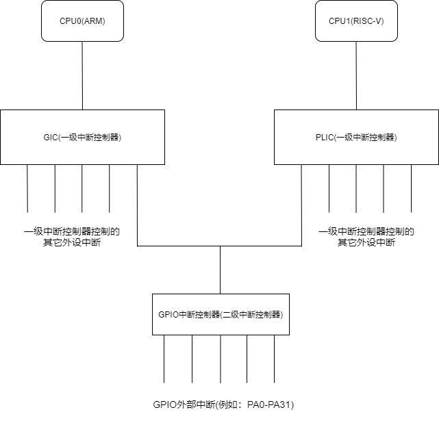

AMP 场景下外设中断的分配问题，在软件层面上设计了共享中断模块。

### 15.2 工作原理

共享中断模块使用一块共享内存来记录某个外设中断被分配到哪个核处理，且在对应中断控制器的驱动代码里根据中断分配信息判断当前中断是否由本CPU 核处理。

### 15.3 配置说明

使用共享中断功能一般情况下需要配置Linux 和RTOS，特殊情况下还需要配置u-boot。

#### 15.3.1 RTOS

<!-- PDF page 53 -->

nts---&gt;

```text
thirdparty components
                  --->
  OpenAMP Support
               --->
   [*]
          openamp share interrupts support
   [ ]
           use share irq table in header file（可选）
```

use share irq table in header file 配置为可选项，若在共享中断资源表未更新前需要使用共享中断，需要把此配置选上。选上此配置后，会在构建阶段，提前解析dts 配置，并生成rtos/lichee/rtos-components/thirdparty/openamp/include/openamp/share-irq-dt.h 头文件，文件中包含有中断类型、中断分配信息掩码、中断号这三个关键信息。

#### 15.3.2 Linux

##### 15.3.2.1 内核配置

勾选CONFIG_SUNXI_RPROC_SHARE_IRQ：

```text
Allwinner BSP
            --->
  Device Drivers
              --->
   Remoteproc drivers
                   --->
     [*]
          SUNXI remote share irq support
```

##### 15.3.2.2 dts配置

主要需要增加3 个配置：

1、在保留内存节点“reserved-memory” 里增加一个节点用于描述保存中断分配信息的保留内存；

```text
reserved-memory {
   e906_share_irq_table: share_irq_table@4244c000 {
          reg = <0x0 0x4244c000 0x0 0x1000>;
          no-map;
```

2、根节点下增加reserved-irq 节点，并在reserved-irq 节点下增加具体的中断分配信息节点；

/&#123;

```text
reserved-irq {
          share-e906 {
                arch-name = "e906";
                memory-region = <&e906_share_irq_table>;
                /* defined by sun55iw3-share-irq-dt.h */
                share-irq =
                    <1
                    0x2
                    RISCV_IRQn(98, 6)
                    ARM_IRQn(101) 0x00000000>, /* GPIOB */
                    <2
                    0x3
                    RISCV_IRQn(98, 8)
                    ARM_IRQn(103) 0x00000000>, /* GPIOC */
                    <3
                    0x4
                    RISCV_IRQn(99, 2)
                    ARM_IRQn(105) 0x00000000>, /* GPIOD */
                    <4
                    0x5
                    RISCV_IRQn(99, 4)
                    ARM_IRQn(107) 0x00000000>, /* GPIOE */
                    <5
                    0x6
                    RISCV_IRQn(99, 6)
                    ARM_IRQn(109) 0x00000000>, /* GPIOF */
                    <6
                    0x7
                    RISCV_IRQn(99, 8)
                    ARM_IRQn(111)0x00000000>,/*GPIOG*/
                    <7
                    0x8
                    RISCV_IRQn(100, 2)
                    ARM_IRQn(113) 0x00000000>, /* GPIOH */
                    <8
                    0x9
                    RISCV_IRQn(100, 4)
                    ARM_IRQn(115) 0x00000000>, /* GPIOI */
                    <9
                    0xa
                    RISCV_IRQn(100, 6)
                    ARM_IRQn(117) 0x00000000>, /* GPIOJ */
                    <10
                    0xb
                    RISCV_IRQn(107, 5)
                    ARM_IRQn(172) 0x00000000>, /* GPIOK */
                    <11
                    0xc
                    RISCV_IRQn(63, 0)
                    ARM_IRQn(191) 0x00000000>, /* GPIOL */
                    <12
                    0xd
                    RISCV_IRQn(65, 0)
                    ARM_IRQn(193) 0x00000000>; /* GPIOM */
          };
   };
};
```

中断分配信息节点中有3 个属性：

1). arch-name，用于标识此中断分配信息用于哪个remoteproc，对应remoteproc 里的share-irq 属性值需要和此属性一致；

<!-- PDF page 54 -->

```text
此属性为数组，数组里每个元素为数值，每
5 个数值构成1 组，对应描述一个
GPIO 组内每个GPIO
外部中断的分配信息。
```

组内第1 个数值为id，需要和share_irq_table 数组中每个元素的major 成员的值一致，对于sun55iw3，share_irq_table 数组可在bsp/drivers/remoteproc/sunxi_share_interrupt/xxx-share-irq.h 里找到；

组内第2 个数值为中断类型，从1 开始为GPIOA 中断，2 为GPIOB 中断，依次类推;

组内第3 个数值为远端处理器(从核) 的中断号，生成中断号的宏可在bsp/include/dt-bindings/gpio/xxx-share-irq-dt.h;

组内第4 个数值为本端处理器(主核) 的中断号，生成中断号的宏可在bsp/include/dt-bindings/gpio/xxx-share-irq-dt.h;

组内第5 个数值为中断分配信息的掩码，表明对应的GPIO 组内的GPIO 外部中断是分配给本端处理器(对应bit 为0)，还是分配给远端处理器(对应bit 为1)。

3、相应remoteproc 节点下增加share-irq 属性，属性值和中断分配信息节点里的arch-name 属性值一致，另外还需在原有的memory-region

属性值的基础上增加保留内存对应的内存区域。

```dts
&soc {
   e906_rproc: e906_rproc@7130000 {
      memory-region = <&rv_sram_reserved>, <&rv_vdev0buffer>, <&rv_vdev0vring0>, <&rv_vdev0vring1>, <&e906_share_irq_table>;
      share-irq = "e906";
   };
};
```

#### 15.3.3 u-boot

若由u-boot 启动remoteproc，则u-boot 配置里需要勾选CONFIG_RISCV_UPDATA_IRQ_TAB

```text
Device Drivers
             --->
   [*] Support RISCV
   [*]
        Support RISCV share irq table updata
```

技巧

```text
早期平台并不支持共享中断，目前支持共享中断的平台有
                    mr536、v821、v821b、r528、r528s2、ai985。MR153
                    采用
                    AMP
                    System
```

Resource Manager 对中断进行管理，不使用共享中断。将来共享中断会被AMP System Resource Manager 替代。

### 15.4 配置示例

下面给出PB0、PD1、PE2、PK10、PK12 这5 个GPIO 外部中断分配给远端处理器，其他GPIO 外部中断分配给本端处理器的dts 配置示例：

/&#123;

```text
reserved-memory {
   e906_share_irq_table: share_irq_table@4244c000 {
          reg = <0x0 0x4244c000 0x0 0x1000>;
          no-map;
```

```text
reserved-irq {
      share-e906 {
             arch-name = "e906";
             memory-region = <&e906_share_irq_table>;
             /* defined by sun55iw3-share-irq-dt.h */
             share-irq =
                   <1
                    0x2
                    RISCV_IRQn(98, 6)
                    ARM_IRQn(101) 0x00000001>, /* GPIOB */
                   <2
                    0x3
                    RISCV_IRQn(98, 8)
                    ARM_IRQn(103) 0x00000000>, /* GPIOC */
                   <3
                    0x4
                    RISCV_IRQn(99, 2)
                    ARM_IRQn(105) 0x00000002>, /* GPIOD */
                   <4
                    0x5
                    RISCV_IRQn(99, 4)
                    ARM_IRQn(107) 0x00000004>, /* GPIOE */
                   <5
                    0x6
                    RISCV_IRQn(99, 6)
                    ARM_IRQn(109) 0x00000000>, /* GPIOF */
                   <6
                    0x7
                    RISCV_IRQn(99, 8)
                    ARM_IRQn(111) 0x00000000>, /* GPIOG */
                   <7
                    0x8
                    RISCV_IRQn(100, 2)
                    ARM_IRQn(113) 0x00000000>, /* GPIOH */
```

<!-- PDF page 55 -->

```dts
<8
       0x9RISCV_IRQn(100,4)
                    ARM_IRQn(115)0x00000000>,/*GPIOI*/
                    <9
       0xaRISCV_IRQn(100,6)
                    ARM_IRQn(117) 0x00000000>, /* GPIOJ */
                    <10
                    0xb
                    RISCV_IRQn(107, 5)
                    ARM_IRQn(172) 0x00001400>, /* GPIOK */
                    <11
                    0xc
                    RISCV_IRQn(63, 0)
                    ARM_IRQn(191) 0x00000000>, /* GPIOL */
                    <12
                    0xd
                    RISCV_IRQn(65, 0)
                    ARM_IRQn(193) 0x00000000>; /* GPIOM */
          };
   };
};
&soc {
   e906_rproc: e906_rproc@7130000 {
      memory-region = <&rv_sram_reserved>, <&rv_vdev0buffer>, <&rv_vdev0vring0>, <&rv_vdev0vring1>, <&e906_share_irq_table>;
      share-irq = "e906";
   };
};
```

配置完成后在RTOS 下可通过dump_amp_share_irq 命令(早期SDK 里为dump_shirq 命令) 查看当前GPIO 外部中断的分配信息：

cpu0&gt;dump_amp_share_irq

```text
:Status
           Type
                 Flags
                    IRQ
  69:Enable
           GPIO
                 0x00000001 9806
  71:Enable
           GPIO
                 0x00000000 9808
  73:Enable
           GPIO
                 0x00000002 9902
  75:Enable
           GPIO
                 0x00000004 9904
  77:Enable
           GPIO
                 0x00000000 9906
  79:Enable
           GPIO
                 0x00000000 9908
  81:Enable
           GPIO
                 0x00000000 10002
  83:Enable
           GPIO
                 0x00000000 10004
  85:Enable
           GPIO
                 0x00000000 10006
  140:Enable
           GPIO
                 0x00001400 10705
  159:Enable
           GPIO
                 0x00000000 6300
  161:Enable
           GPIO
                 0x00000000 6500
GPIO group interrupt allocation info:
GPIOB, allocation mask: 0x00000001, IRQ:9806
ionmask:0x00000000,IRQ:9808
GPIOD, allocation mask: 0x00000002, IRQ:9902
GPIOE, allocation mask: 0x00000004, IRQ:9904
GPIOF, allocation mask: 0x00000000, IRQ:9906
GPIOG, allocation mask: 0x00000000, IRQ:9908
GPIOH, allocation mask: 0x00000000, IRQ:10002
GPIOI, allocation mask: 0x00000000, IRQ:10004
GPIOJ, allocation mask: 0x00000000, IRQ:10006
GPIOK, allocation mask: 0x00001400, IRQ:10705
GPIOL, allocation mask: 0x00000000, IRQ:6300
GPIOM, allocation mask: 0x00000000, IRQ:6500
```

可以看到分配信息和dts 配置里的一致。

### 15.5 注意事项

1、共享中断模块目前只支持GPIO 中断控制器这个二级中断控制器控制的中断，一级中断控制器控制的外设中断不支持。

2、若同一个GPIO 组内的不同GPIO 外部中断分配到超过2 个CPU 核上，可通过新增中断分配信息节点并正确设置中断分配信息的掩码来支持

这种场景。

3、若一个GPIO 组内使用到的GPIO 对应的外部中断只会在某一个CPU 上处理，可将剩余未复用为外部中断功能的GPIO 对应的外部中断也分

配给这个CPU 处理，此时另外一个CPU 不会注册相关的GPIO 中断处理函数，可避免另外的CPU 不必要的进入GPIO 中断处理函数

<!-- PDF page 56 -->

## 16 从核使用的内存区域

当前SDK 中从核使用的内存区域按使用者分类主要分为专用内存区域和共享内存区域，其中共享内存区域主要用于核间通信、共享中断等功能。

### 16.1 专用内存区域

从核使用的专用内存区域主要包含从核的运行内存区域，不排除未来可能新增其他专用内存区域。

#### 16.1.1 运行内存区域

运行内存区域是RTOS 环境下具体方案的链接器脚本文件中MEMORY 语法里指定的内存区域，以MR536 为例，其原始链接器脚本文件(rtos/lichee/rtos/projects/mr536_e907/evb1/freertos.lds.S) 中的运行内存区域指定为如下：

```text
/* Linker script to configure memory regions. */
MEMORY
{
   RAM (rwx)
             : ORIGIN = CONFIG_ARCH_START_ADDRESS, LENGTH = CONFIG_ARCH_MEM_LENGTH
}
```

可以看到上面定义了一块名为RAM 的内存，其起始地址为CONFIG_ARCH_START_ADDRESS，长度为CONFIG_ARCH_MEM_LENGTH，这2个宏来自于RTOS 配置。

上面提到的链接器脚本文件是原始文件，经过预处理后才是最终的链接器脚本文件(路径为build/mr536_e907_evb1/projects/mr536_e907/evb1/freertos.lds)，如下：

```text
MEMORY
{
   RAM (rwx) : ORIGIN = 0x60000000, LENGTH = 0x100000
}
```

可以看到名为RAM 的内存的起始地址为0x60000000，长度为0x100000，根据芯片用户手册，此区域对应DRAM，由于DRAM 一般是给主核

```text
故需要在主核Linux
s 配置里保留这块内存给从核使用：
reserved-memory {
   e907_dram_reserved: e907_dram@60000000 {
      reg = <0x0 0x60000000 0x0 0x00100000>;
      no-map;
   };
};
```

##### 16.1.1.1 修改从核的运行内存区域

1. 查阅芯片用户手册，确认从核可以访问的DRAM 区域的地址范围。例如：MR536 平台上，从核可访问DRAM 区域的地址范围是：0x4000

0000-0xFFFF FFFF

2. 配置dts，将DRAM 上的某个内存区域保留下来。保留下来的内存区域是给从核专用的，主核不会将这块内存作为系统内存使用。例如：为

MR536 的从核E907 预留2MB 的内存空间，内存起始地址为0x70000000，大小为0x00200000。其中，no-map 属性表示这些内存区域不

```text
内核的虚拟地址空间中
作为系统内存使用，但加载固件时会映射
)。
reserved-memory {
...
  e907_dram_reserved: e907_dram@60000000 {
  reg = <0x0 0x70000000 0x0 0x00200000>;
  no-map;
  };
...
};
```

```text
3. 修改从核运行内存起始地址和内存长度。在
                    Tina
                    环境下，运行
                    mrtos menuconfig
                    ，设置
                    CONFIG_ARCH_START_ADDRESS
                    和
```

<!-- PDF page 57 -->

```text
TART_ADDRESS=0x70000000
EM_LENGTH=0x200000
```

4. 在Tina 环境下，执行mrtos 编译rtos，执行mkernel 编译kernel（目的是：编译dts）。

5. 在Tina 环境下，执行pack ，打包完整镜像。

6. 烧录完整镜像。

7. 在RTOS 端通过free 命令查看内存的容量的大小，以及栈地址范围。例如：在MR536 平台，通过free 查看剩余内存以及栈地址，对比修改

前的0x60000000-0x60000000+0x100000，可以看到修改后栈地址都是在0x70000000-0x70000000+0x200000 这段地址范围内，并且剩余内存空间明显变大。

*图16-1: 运行内存修改前后比较图*

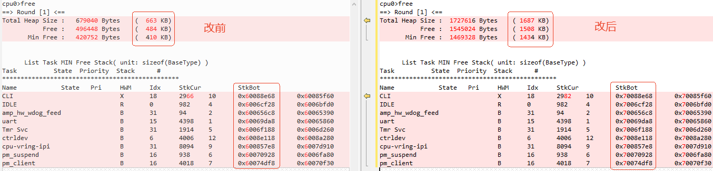

技巧

```text
用户可以参考这个步骤将运行内存区域从
                    DRAM
                    切换到
                    SRAM。切换运行内存区域到
                    SRAM，需要在
                    board.dts
                    中，需要
在设备树中将
             SRAM
                   内存区域
                    reserved
                    保留下来，并且在设备树的
                    remoteproc
                    节点中的
                    memory-region
                    属性中引用这
区域（例如memory-region=<&rv_sram_reserved>...
），修改
 RTOS
        的
             CONFIG_ARCH_START_ADDRESS
以及
      CONFIG_ARCH_MEM_LENGTH，与设备树预留运行内存区域一致。SRAM
                    区域和
                    DRAM
                    区域可以同时预留，但
CONFIG_ARCH_START_ADDRESS、CONFIG_ARCH_MEM_LENGTH 只能在SRAM 和DRAM 之间二选一。
```

### 16.2 共享内存区域

从核使用的共享内存区域目前主要包含如下几个：

- 用于rpmsg 通信的vdev0buffer、vdev0vring0 和vdev0vring1 保留内存

- 用于rpbuf 通信的保留内存

- 用于共享中断功能的share_irq_table 保留内存

以MR536 为例，其Linux 环境的dts 配置里有如下保留内存区域：

ry&#123;

```dts
e907_rpbuf_reserved: e907_rpbuf@42380000 {
   compatible = "shared-dma-pool";
   no-map;
   reg = <0x0 0x42380000 0x0 0x80000>;
};
rv_vdev0buffer: vdev0buffer@42400000 {
   compatible = "shared-dma-pool";
   reg = <0x0 0x42400000 0x0 0x40000>;
   no-map;
};
rv_vdev0vring0: vdev0vring0@42440000 {
   reg = <0x0 0x42440000 0x0 0x2000>;
   no-map;
```

<!-- PDF page 58 -->

```text
rv_vdev0vring1: vdev0vring1@42442000 {
      reg = <0x0 0x42442000 0x0 0x2000>;
      no-map;
   };
   e907_share_irq_table: share_irq_table@4244c000 {
      reg = <0x0 0x4244c000 0x0 0x1000>;
      no-map;
   };
};
可以看到
         vdev0buffer@42400000、vdev0vring0@42440000、vdev0vring1@42442000
                    是用于
                    rpmsg
                    通信的保留内存；
```

e907_rpbuf@42380000 是用于rpbuf 通信的保留内存；share_irq_table@4244c000 是用于共享中断的保留内存。

### 16.3 修改内存区域的地址

```text
上述从核使用的内存区域的地址都可以更改，只要不和
                   Linux 环境中其他用途的保留内存冲突即可，其中从核的运行内存区域被修改时是需要同时
```

更改Linux 环境的dts 配置和RTOS 环境的配置的。

另外由于这些共享内存区域的数量比较多(除了共享中断使用的内存区域不会被从核修改外其他都会被从核修改)，而从核的MPU(RISC-V 架构里叫PMP) 配置条目的数量可能比较少(比如MR527 的RV 核只有8 个配置条目)，因此建议尽量将这些会被从核修改的内存区域配置为相邻内存区域，也即不同内存区域中间不要有空洞(前面内存区域的结束地址+1 后等于后面内存区域的起始地址)，这样的话从核只需要使用一个MPU 配置条目来配置这些共享内存区域的访问权限信息，防止从核由于MPU 配置条目数量不够导致系统运行异常。

上面“共享内存区域”章节里的e907_rpbuf@42380000、vdev0buffer@42400000、vdev0vring0@42440000 和vdev0vring1@42442000这4 个内存区域就是相邻内存区域。下面以MR536 为例，给出将用于rpmsg 通信的共享内存和用于rpbuf 通信的共享内存修改到0x70000000开始的连续内存区域的示例：

```dts
reserved-memory {
   e907_rpbuf_reserved: e907_rpbuf@70000000 {
      compatible = "shared-dma-pool";
p;
      reg = <0x0 0x70000000 0x0 0x80000>;
   };
   rv_vdev0buffer: vdev0buffer@70080000 {
      compatible = "shared-dma-pool";
      reg = <0x0 0x70080000 0x0 0x40000>;
      no-map;
   };
   rv_vdev0vring0: vdev0vring0@700c0000 {
      reg = <0x0 0x700c0000 0x0 0x2000>;
      no-map;
   };
   rv_vdev0vring1: vdev0vring1@700c2000 {
      reg = <0x0 0x700c2000 0x0 0x2000>;
      no-map;
   };
   e907_share_irq_table: share_irq_table@4244c000 {
      reg = <0x0 0x4244c000 0x0 0x1000>;
      no-map;
   };
};
```

<!-- PDF page 59 -->

## 17 使用 RPMsg 进行核间通信

全志平台基于OpenAMP RPmsg 框架以及Linux 内核的RPMsg 框架，实现了两套框架（Rpmsg V1/Rpmsg V2），方便用户在AMP 场景下进行核间通信。Rpmsg V1 与V2 向用户提供了兼容的API 接口。

### 17.1 Rpmsg V1

*图17-1: Rpmsg 整体框图*

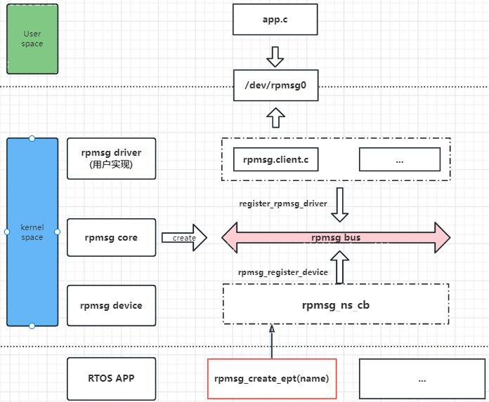

其通信链路建立流程如下：

1. RTOS 端调用rpmsg_create_ept 创建指定name 的端点。

2. Linux 端rpmsg core 层收到端点创建消息，调用rpmsg_register_device 将其作为一个设备注册到rpmsg bus。

3. Linux 端rpmsg bus 匹配到相应的驱动，触发其probe 函数。

4. Linux 端驱动probe 函数完成一些资源的分配以及文件节点的生成。

5. Linux 端驱动的probe 函数调用完后，rpmsg bus 会回复一个ACK。

6. RTOS 端收到ACK 后设置端点的状态，此时使用is_rpmsg_ept_ready 函数会返回true。

<!-- PDF page 60 -->

*图17-2: Rpmsg 通信流程*

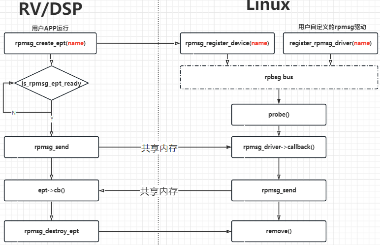

端点除了有专用端点（如ctrl 端点、heartbeat 端点，命名服务端点），还包含有由rpmsg_client.c 统一创建的端点，这部分端点是面向用户的端点，这部分端点会向用户空间呈现/dev/rpmsgX 文件操作接口，在跨核进行自定的数据交互时，应该通过用户端点来进行。用户可以操作/dev/rpmsgX ，读取文件可以获取远端发送过来的数据，也可以写入/dev/rpmsgX 来向远端发送数据。接下来，通过用户端点的创建流程，来理解通信链路建立流程：

```text
1. 【Linxu
端】用户空间通过操作
                   ctrl
                    端点提供的用户空间文件（例如：/dev/rpmsg_ctrl-e907_rproc@1a00000 ），对这个文件写入
```

RPMSG_CREATE_EPT_IOCTL 指令进行创建节点

2. 【Linux 端】rpmsg_master.c 响应RPMSG_CREATE_EPT_IOCTL 指令，然后通过ctrl 端点发送RPMSG_CREATE_CLIENT 命令到RV/DSP ，

让RV/DSP 先创建端点。RV/DSP 创建端点时，会通过命名服务间接触发Linux 端也创建配对的端点

3. 【RV/DSP】rpmsg_master.c 的接收数据线程响应RPMSG_CREATE_CLIENT 命令，创建client 端点（该端点用于和Linux 端的client 端点

进行点对点通信），所有的client 端点的name 都是统一的（例如：sunxi,rpmsg_client）。在创建端点时，会统一将端点的src 和dts 预设置为RPMSG_ADDR_ANY，然后在本地分配src，dst 由Linux 端分配（dst 就是Linux 端的端点的src）

通过命名服务端点，发生命名消息，发送给Linux 端

```text
5. 【Linux
端】在rpmsg_ns.c/rpmsg_ns_cb 回调函数中接收到命名消息，调用接口rpmsg_create_channel 创建通道并最终会调用
```

到rpmsg_core.c/rpmsg_register_device 注册一个rpmsg_device（一个rpmsg_device 对应一个rpmsg 通信设备），多个client 端点的rpmsg_device 的设备名是统一的（例如：sunxi,rpmsg_client）

6. 【Linux 端】rpmsg_bus 总线匹配机制，调用总线的probe 接口（rpmsg_dev_probe），在总线的probe 中创建端点（该端点和从核创建的

端点时一对通信的端点）。创建的端点接收到远端的RPMSG_CREATE_CLIENT 消息，则添加/dev/rpmsX 设备，并且为每个端点的替换正式的接收数据回调函数

```text
7. 【Linux
端】总线的
           probe
                  函数，调用对应驱动的
                    probe
                    函数（rpmsg_client.c），这个函数中初始化端点对应的设备文件
```

（/dev/rpmsgX ）以及其文件操作合集fops

8. 【linux 端】用户空间的RPMSG_CREATE_EPT_IOCTL 至此完成，RV/DSP 和Linux 端都创建了一个端点，这两个端点可以配对进行数据交互

```text
9. 【linux
端】用户空间对/dev/rpmsgX 进行read/write ，即可完成对端点的读写操作。写入/dev/rpmsgX 的数据会发送给RV/DSP ，
```

<!-- PDF page 61 -->

### 17.2 Rpmsg V2

Rpmsg V1 创建销毁流程复杂，因此设计简化版本。Rpmsg V2 框架重新设计了端点的创建与销毁机制，通过ctrl 端点直接在Master 与Remote之间交换控制消息（NS_CREATE/NS_DESTROY），省去了V1 中经由命名服务的间接流程，使得端点生命周期管理更加简洁可控。V2 同时支持动态创建多个同名端点实例，并通过Kconfig 兼容层实现V1/V2 API 共存与切换。

*图17-3: Rpmsg V2 整体框图*

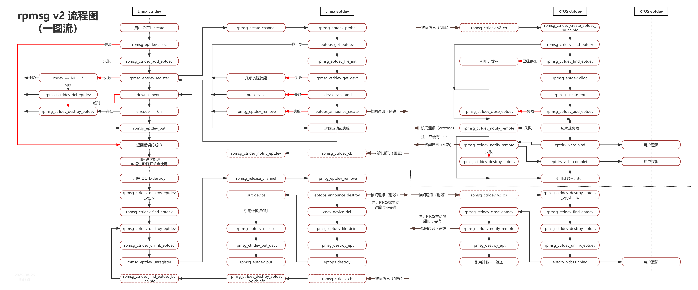

V2 框架中，Linux 端与RTOS 端各有一个ctrl 端点（sunxi,rpmsg_ctrl_v2 ），负责端点的创建和销毁管理。Linux 端通过/dev/rpmsg_ctrl-* 字

```text
提供
ioctl
接口，RTOS
            端通过rpmsg_client_v2_bind/unbind 等
                    API
                    管理端点驱动。两端通过
                    ctrl
                    端点互
```

v_msg 消息来协同完成端点的创建与销毁。其端点创建流程如下：

```text
1. 【Linux
端】用户空间通过操作
                    ctrl
                    端点文件（例如：/dev/rpmsg_ctrl-e907_rproc@1a00000 ），调用
                    ioctl
```

RPMSG_CREATE_EPT_IOCTL 发起创建端点请求，传入端点名称name

```text
2. 【Linux
端】rpmsg_ctrldev.c 响应
                    ioctl，分配
                    eptdev
                    并通过idr_alloc 分配端点
                    ID（范围
                    512~1023），然后调
```

用rpmsg_create_channel 创建rpmsg channel，触发RTOS 端命名服务

3. 【Linux 端】创建rpmsg channel 后，Linux 端rpmsg bus 匹配到sunxi,rpmsg_ept_v2 驱动，触发eptdev probe，此时RTOS 端尚未创建

配对端点

4. 【Linux 端】eptdev probe 完成后，Linux 端通过ctrl 端点向RTOS 发送NS_CREATE 消息，携带端点名称、src/dst 地址信息

5. 【RTOS 端】rpmsg_ctrldev_v2_cb 接收NS_CREATE 消息，查找已注册的eptdrv（通过rpmsg_client_v2_bind 注册），检查实例数上限后

分配eptdev，通过bitmap 分配地址，调用rpmsg_create_ept 创建端点，依次调用bind 和complete 回调

RTOS 端通过ctrl 端点回复NS_CREATE 消息，携带分配好的地址信息

7. 【Linux 端】Linux 端收到回复后，up(&eptdev-&gt;notify) 唤醒等待，ioctl 返回端点ID，/dev/rpmsgN 设备节点可被用户态read/write 使

用

端点销毁流程如下：

1. 【Linux 端】用户空间调用ioctl RPMSG_DESTROY_EPT_IOCTL ，传入端点ID

2. 【Linux 端】通过ctrl 端点向RTOS 发送NS_DESTROY 消息，RTOS 端rpmsg_ctrldev_v2_cb 接收后查找并销毁对应eptdev，调用unbind

回调，释放地址和资源

3. 【Linux 端】销毁完成后，/dev/rpmsgN 设备节点被移除

<!-- PDF page 62 -->

### 17.3 OpenAMP RPMsg

AMP 场景下，RTOS 或裸机系统中进行处理器之间进行相互通信，需要使用到OpenAMP 的RPMsg 框架，通过本节，用户可以了解OpenAMP RPMsg 通信步骤及其接口。注意：用户编写rpmsg 通信程序时，需要基于全志的rpmsg 框架及接口来进行编写，具体请参考“rpmsg 应用层通信程序”。

OpenAMP RPMsg 通信的常见步骤如下：

```c
#include <openamp/rpmsg.h>
#include <openamp/sunxi_helper/openamp_platform.h>
/* Endpoint callback, called when the endpoint receives data. */
static int rpmsg_ept_callback(struct rpmsg_endpoint *ept, void *data,
      size_t len, uint32_t src, void *priv)
{
   /* ... */
   return RPMSG_SUCCESS;
```

```c
/* Endpoint seRVice unbind callback, called when remote endpoint is destroyed. */
static void rpmsg_ns_unbind_callback(struct rpmsg_endpoint *ept)
{
   /* ... */
}
int main(int argc, char *argv[])
{
   struct rpmsg_endpoint ept;
   struct rpmsg_device *rpmsg_dev;
   /* 1. Get rpmsg device */
   rpmsg_dev = openamp_platform_get_rpmsg_vdev(RPMSG_DEV_ID);
   /* 2. Create endpoint */
   rpmsg_create_ept(&ept, rpmsg_dev, EPT_NAME, EPT_SRC_ADDR, EPT_DST_ADDR,
pmsg_ept_callback,rpmsg_ns_unbind_callback);
   /* 3. Waiting for endpoint ready */
   while (!is_rpmsg_ept_ready(ept)) {
      /* sleep ... */
   }
   /* 4. Send data to remote */
   rpmsg_send(ept, data, data_len);
   /* 5. Destroy endpoint */
   rpmsg_destroy_ept(ept);
   return 0;
}
```

device，为后面创建endpoint 做准备。

2. 创建endpoint。应用程序通过操作endpoint 与远端处理器进行通信，endpoint 有源地址和目标地址。在本地处理器，endpoint 通过源地址

进行区分；在远端处理器endpoint 通过目的地址进行区分。当某个endpoint 收到远端处理器发过来的消息时，它的回调函数会被调用到。

3. 在第一次使用某个endpoint 向远端发送消息前，需要等待它准备好。

4. 使用rpmsg_send 向远端发送信息。

5. 当不再需要使用endpoint 时，使用rpmsg_destroy_ept 销毁它。

上述步骤中的OpenAMP RPMsg 接口被全志封装成以下三个接口，具体详见于rtos-components/thirdparty/openamp/sunxi_helper/ope namp.c

```text
/*打开端点，内部调用了OpenAMP RPMsg的rpmsg_create_ept接口*/
struct rpmsg_endpoint *openamp_ept_open(const char *name, int rpmsg_id,
```

<!-- PDF page 63 -->

rpmsg_ept_cbcb,rpmsg_ns_unbind_cbunbind_cb)

```c
/*关闭端点，内部调用了OpenAMP RPMsg的rpmsg_destroy_ept接口*/
void openamp_ept_close(struct rpmsg_endpoint *ept)
/*发送消息到rpmsg端点，内部调用了OpenAMP RPMsg的rpmsg_send接口*/
int openamp_rpmsg_send(struct rpmsg_endpoint *ept, void *data, uint32_t len)
```

#### 17.3.1 OpenAMP RPMsg 接口说明

##### 17.3.1.1 获取 RPMsg Device

/* &lt;openamp/sunxi_helper/openamp_platform.h&gt; */

struct rpmsg_device *openamp_platform_get_rpmsg_vdev(int id);

这个是全志自己定义的API，并非来自OpenAMP 官方。全志平台的OpenAMP 在初始化过程中会创建RPMsg device，该API 就是用来获取前面已经初始化好的RPMsg device。

一般来说，一个RPMsg device 对应一个可进行通信的远端处理器。

具体的ID 号，在全志平台上其定义如下：

- 对于主核：0 代表DSP 端，1 代表RV 端；

- 对于任一从核：0 均代表ARM 端，1 代表另一个从核。如，对于RV 端，ID=1 表示远端的DSP 处理器；对于DSP 端，ID=1 表示远端的RV

处理器。

##### 17.3.1.2 创建 endpoint

pmsg.h&gt; */

/**

```text
* rpmsg_create_ept - create rpmsg endpoint and register it to rpmsg device
*
* Create a RPMsg endpoint, initialize it with a name, source address,
* remoteproc address, endpoint callback, and destroy endpoint callback,
* and register it to the RPMsg device.
*
* @ept: pointer to rpmsg endpoint
* @name: seRVice name associated to the endpoint
* @src: local address of the endpoint
* @dest: target address of the endpoint
* @cb: endpoint callback
* @ns_unbind_cb: end point service unbind callback, called when remote ept is
*
              destroyed.
*
* In essence, an rpmsg endpoint represents a listener on the rpmsg bus, as
* it binds an rpmsg address with an rx callback handler.
*
* Rpmsg client should create an endpoint to discuss with remote. rpmsg client
* provide at least a channel name, a callback for message notification and by
* default endpoint source address should be set to RPMSG_ADDR_ANY.
*
* As an option Some rpmsg clients can specify an endpoint with a specific
* source address.
*/
```

int rpmsg_create_ept(struct rpmsg_endpoint *ept, struct rpmsg_device *rdev,

```text
const char *name, uint32_t src, uint32_t dest,
rpmsg_ept_cb cb, rpmsg_ns_unbind_cb ns_unbind_cb);
```

<!-- PDF page 64 -->

cb 函数在远端处理器往该endpoint 的地址发送消息时会被调用到；

- ns_unbind_cb 函数会在远端对应的endpoint 销毁时被调用到（因为要实现通信，远端会有一个对应的endpoint 与本地的endpoint 关联起

来），如果不需要，可设为NULL。

endpoint 的地址有一些特殊值：

- 0x35（十进制的53）：预留出来用作name service 消息包的收发。

- ≥0x400 （十进制的1024）：大于或等于0x400 的值会被用作自动分配的地址值。当用户创建endpoint 时，如果将src 或dest 设为

RPMSG_ADDR_ANY，RPMsg 会自动为其分配空闲的地址，这个分配的值就会从0x400 开始。

- RPMSG_ADDR_ANY（十六进制的0xFFFFFFFF）：在自动分配地址和name service 通知机制中使用（使用时最好用RPMsg 提供的宏

RPMSG_ADDR_ANY ，以免该值后续发生改变）。

name service 机制，用于通知远端进行RPMsg device/channel/endpoint 的动态申请。

1. 当创建endpoint 时，如果将dest 设为RPMSG_ADDR_ANY，会往远端发送name service 消息包。

```text
息后调用相应RPMsg
 probe 函数。
```

3. 远端分配好地址后，发送消息回来。

4. 收到远端回应后，dest 就会变成远端对应endpoint 的地址，此时就可开始通过本地的endpoint 与远端的endpoint 进行通信。

出于代码通用性的考虑，一般来说都会推荐将地址设为RPMSG_ADDR_ANY，让其自动分配。

##### 17.3.1.3 等待 endpoint 准备好

/* &lt;openamp/rpmsg.h&gt; */

/**

```c
* is_rpmsg_ept_ready - check if the rpmsg endpoint ready to send
 *
 * @ept: pointer to rpmsg endpoint
 *
 * Returns 1 if the rpmsg endpoint has both local addr and destination
 * addr set, 0 otherwise
 */
static inline unsigned int is_rpmsg_ept_ready(struct rpmsg_endpoint *ept)
{
   return ept && ept->rdev && ept->dest_addr != RPMSG_ADDR_ANY;
}
```

在每次数据发送前，都建议使用该接口检查endpoint 是否就绪。（当使用name service 机制时，等待实际就是远端是否已经进行了回应，是否已经修改了endpoint 的dest_addr）。

##### 17.3.1.4 向远端发送数据

向远端发送数据可使用以下API（具体的描述可参考头文件openamp/include/openamp/rpmsg.h ）：

pmsg.h&gt; */

static inline int rpmsg_send(struct rpmsg_endpoint *ept, const void *data,

```c
int len);
static inline int rpmsg_sendto(struct rpmsg_endpoint *ept, const void *data,
               int len, uint32_t dst);
static inline int rpmsg_send_offchannel(struct rpmsg_endpoint *ept,
                uint32_t src, uint32_t dst,
                const void *data, int len);
```

static inline int rpmsg_trysend(struct rpmsg_endpoint *ept, const void *data,

```c
int len);
static inline int rpmsg_trysendto(struct rpmsg_endpoint *ept, const void *data,
              int len, uint32_t dst);
static inline int rpmsg_trysend_offchannel(struct rpmsg_endpoint *ept,
```

<!-- PDF page 65 -->

```text
const void
*data, int len);
```

- send 和trysend 类别函数的区别主要是：当底层用来传输数据的buffer 都满了时，send 类别的会阻塞住，直到buffer 可用或15 秒超时返

回；trysend 则是立即返回。

- send、sendto、send_offchannel 这三类函数的区别是：send 函数直接使用ept 的src 和dst；sendto 函数使用ept 的src，但dst 是使用

额外传进来的参数；send_offchannel 函数则是src 和dst 都与ept 无关，都是使用额外传进来参数。

由此可见，往另一端发送数据时，其实并不一定要用endpoint 里的地址。如果之前创建有别的endpoint，理论上已经可以往远端的任意地址发送数据。

一般为了方便管理，更为推荐使用创建对应地址的endpoint 来传输数据。

说明

的内部代码实现来看，单次rpmsg_send 发送的数据量无法超过底层RPMsg 单个消息包buffer 的大小，否则会被截断。当前buffer 的大小固定是512bytes，扣除16bytes 的头部信息，用户单次可传输的数据量为496bytes。

##### 17.3.1.5 销毁 endpoint

/* &lt;openamp/rpmsg.h&gt; */

/**

```text
* rpmsg_destroy_ept - destroy rpmsg endpoint and unregister it from rpmsg
*
                  device
*
* @ept: pointer to the rpmsg endpoint
*
* It unregisters the rpmsg endpoint from the rpmsg device and calls the
* destroy endpoint callback if it is provided.
*/
stroy_ept(struct
point*ept);
```

### 17.4 通信测试

#### 17.4.1 rpmsg 通信测试

为了便于后面的调试，RTOS 环境下rpmsg 需要选上调试配置，如下：

*图17-4: rpmsg 调试配置*

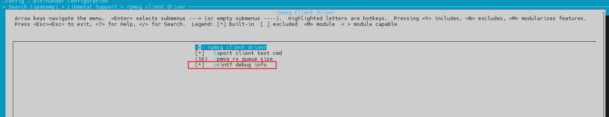

##### 17.4.1.1 名字监听

RTOS 控制台输入eptdev_bind 命令进行监听。

<!-- PDF page 66 -->

*图17-5: rpmsg test*

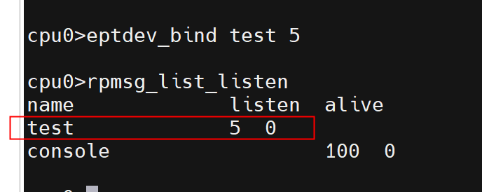

eptdev_bind 命令说明：

- 参数一：name，表示需要监听的端点名称。

- 参数二：cnt，该名称的端点最多可以创建多少个链接。

rpmsg_list_listen 命令无参数，该命令会列举出所有正在监听的端点的设备名字，数量等。

##### 17.4.1.2 节点创建

msg_demo 命令进行节点创建。

<!-- PDF page 67 -->

*图17-6: rpmsg test*

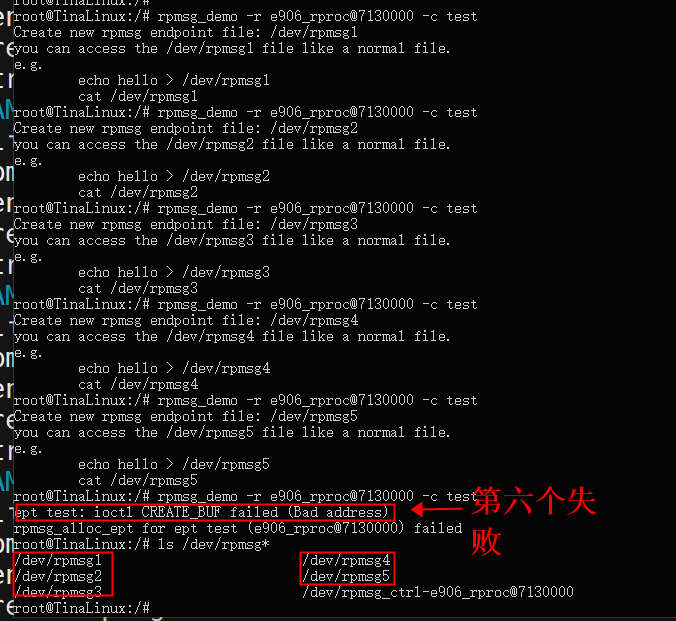

<!-- PDF page 68 -->

*图17-7: rpmsg test*

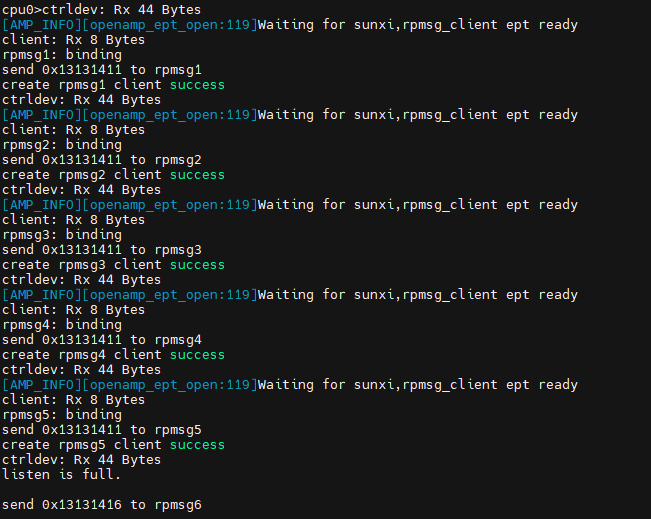

根据log 可以看出，创建了一个rpmsg1-5 5 个设备，因为RV 只监听了5 个，故最多只能创建5 个。

rpmsg_demo 参数说明：

- -r name：指定远端处理器名字，具体名字由dts 中的rproc 节点决定；如在MR527 平台上，RV 在dts 的节点名为e906_rproc@7130000。

- -c name：需要创建的端点的名字，rpmsg 通过名字进行匹配。

- -d name：需要删除的端点的名字。

##### 17.4.1.3 节点通信

```text
标准的文件操作，直接读写即可。
    Linux 向RV 发送数据：
```

*图17-8: rpmsg test*

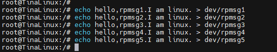

<!-- PDF page 69 -->

*图17-9: rpmsg test*

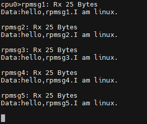

RV 向Linux 发送数据：

*图17-10: rpmsg test*

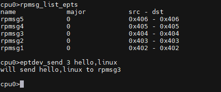

*图17-11: rpmsg test*

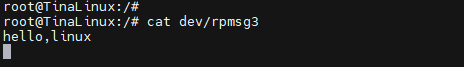

rpmsg_list_epts 命令说明：

- 无参数，列举出当前可用的端点的名称，地址信息等

eptdev_send 命令说明：

- 参数一：id，指定使用哪一个rpmsgX 端点发送消息，这里的X 就是参数一指定的id，可通过rpmsg_list_epts 查看当前可用的端点。

- 参数二：data，要发送的数据

##### 17.4.1.4 节点关闭

Linux 主动释放节点，比如主动删除rpmsg2 节点：

<!-- PDF page 70 -->

*图17-12: rpmsg test*

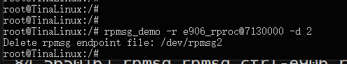

*图17-13: rpmsg test*

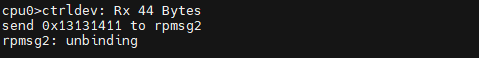

RV 主动关闭设备：

*图17-14: rpmsg test*

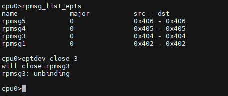

*图17-15: rpmsg test*

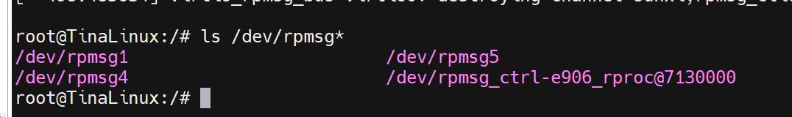

则会释放所有的链接：

*图17-16: rpmsg test*

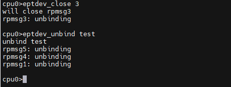

<!-- PDF page 71 -->

*图17-17: rpmsg test*

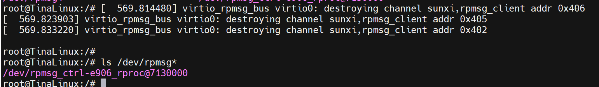

eptdev_close 命令说明：

- 参数一：id，指定删除哪一个rpmsgX 端点，这里的X 就是参数一指定的id，可通过rpmsg_list_epts 查看当前可用的端点。

eptdev_unbind 命令说明：

- 第一个参数：name，表示需要取消监听的端点名称；取消监听时，会把所有通过该name 创建的端点进行释放。

#### 17.4.2 rpmsg应用层通信程序

##### 17.4.2.1 rpmsg_test

此程序适用于RV 和Linux 应用层的通信，用户可参考该软件包开发自己的通信应用。

RV 程序：rpmsg_test，源码路径：rtos-components/thirdparty/openamp/rpmsg_demo/rpmsg_ctrl/test

Linux 配合使用的程序：rpmsg_test，源码路径：platform/allwinner/system/rpmsg/test

该软件包功能如下：

会自动生成生成随机数据和MD5 值，发送给另一端

2. 对收到的数据进行MD5 校验，并与收到的MD5 进行比较，不相同则打印数据校验失败错误

##### 17.4.2.2 编译

RV 编译时需要在mrtos_menuconfig 中选上：

```text
System components
               --->
   thirdparty components --->
      OpenAMP Support
                    --->
          [*] rpmsg client driver
                    --->
             [*]
                  Export client test cmd
```

Linux 编译时需要在m menuconfig 中选上：

```text
Allwinner
         --->
>
      -*- librpmsg................................................... rpmsg library
      <*> rpmsg_test............................................... rpmsg test demo
```

##### 17.4.2.3 基本使用

对于RV 而言，rpmsg_test 的参数说明如下：

- -h：打印帮助信息。

- -c：创建端点。

- -d：删除端点。

<!-- PDF page 72 -->

端点名称。

- -t tx_delay：指定每次的发送间隔，默认是500 ms。

- -L tx_len：指定每次发送的数据长度，默认是32 bytes，注意这个值不能超过496，一次Rpmsg 传输最多能传输496 个字节。

例子：

- rpmsg_test -N “test” -L 256 -t 10 -c：监听端点，建立连接后将会创建一个发送线程，每隔10ms 发送一次长度为256 字节的消息

- rpmsg_test -N “test” -d：取消监听

对于Linux 而言，rpmsg_test 的参数说明如下：

- -r name：指定远端处理器名字。

- -c name：需要创建的端点的名字，rpmsg 通过名字进行匹配。

- -v：冗余打印，否则只有出错时才打印。

```text
指定每次的发送间隔，默认是
500ms。
指定每次发送的数据长度，默认是
32bytes，注意这个值不能超过
496，一次Rpmsg 传输最多能传输
496 个字节。
```

- -R：接收警告阈值，当接收耗时超过该阈值后，会打印警告信息

- -T：发送警告阈值，当发送耗时超过该阈值后，会打印警告信息

例子：

- rpmsg_test -r e906_rproc@7130000 -c test -L 256 -t 10：创建端点，该端点会创建一个发送线程，每隔10ms 发送一次长度为256 字节的

消息

##### 17.4.2.4 简单例子

先确保Linux 有以下RV rpmsg 的控制节点，如果没有，请检查RV 是否有正常启动。

```text
root@TinaLinux:/# ls -l dev/rpmsg*
ootroot
9dev/rpmsg_ctrl-e906_rproc@7130000
```

以下是一个使用rpmsg_test 的简单例子：

Linux与RV通信：

1、RV输入rpmsg_test -N test -L 496 -c -t 10 -M 10

2、Linux输入rpmsg_test -r e906_rproc@7130000 -c test -L 496 -t 5 &

### 17.5 rpmsg传输性能测试

用户可以使用rpmsg_test 命令对rpmsg 进行性能测试，测试发送方向和接收方向各自的耗时以及速率。本章节主要描述这个测试的操作步骤并解读测试结果。

#### 17.5.1 应用层测试方法

以MR536 为例，下面的指令是ARM 主核与RV 从核之间的传输性能测试指令，指令的参数请查看“rpmsg 应用层通信程序”章节。

测试指令汇总如下，请根据平台，调整远端处理器名字

Linux与RV通信：

1、首先，RV输入rpmsg_test -N test -L 496 -c -t 10 -M 10

2、然后，Linux输入rpmsg_test -r e907_rproc@1a00000 -c test -L 496 -t 5 &

主核测试结果：

<!-- PDF page 73 -->

*图17-18: 主核传输性能测试结果*

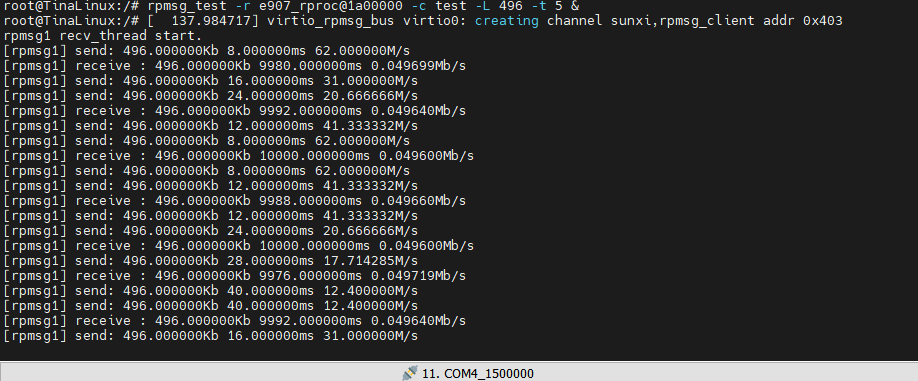

从核测试结果：

*图17-19: 从核传输性能测试结果*

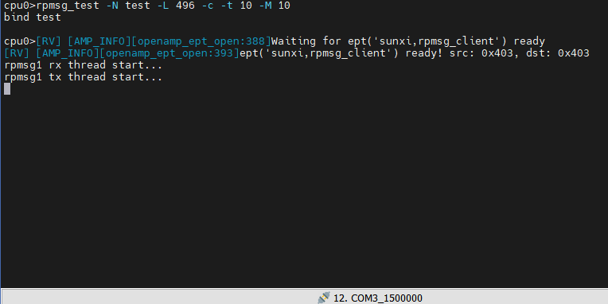

如图，主核与从核之间是通过src 和dst 均为0x403 的端点进行通信，主核的这个端点的接收和发送被映射成对/dev/rpmsg1 设备文件文件的读操作和写操作。结果解读如下：

```text
输出结果
                    结果解读
[rpmsg1] send: 496.000000Kb 8.000000ms 62.000000M/s
                    发送496KB 数据，耗时8 毫秒，发送速率为64MB/s
[rpmsg1] receive : 496.000000Kb 9980.000000ms 0.049699Mb/s
                    接收496KB 数据，耗时9980 毫秒，接收速率为0.049699MB/s
```

<!-- PDF page 74 -->

### 17.6 rpmsg通信耗时测量

rpmsg 框架目前支持通信耗时测量功能，又叫性能跟踪，可通过此功能测量单次rpmsg 通信过程中发送方和接收方各个阶段的耗时信息。

#### 17.6.1 工作原理

通信双方记录rpmsg 发送接收流程中某些执行点的时间戳，且通信双方获取到的时间戳具有相同的时间基准。

#### 17.6.2 性能跟踪点和性能跟踪阶段

目前支持如下几个性能跟踪点：

- RPMSG_PERF_POINT_SENDER_FILL：发送方开始填充数据

- RPMSG_PERF_POINT_SENDER_NOTIFY：发送方开始通知对端

- RPMSG_PERF_POINT_SENDER_END：发送方发送结束

```text
F_POINT_RECEIVER_PREPARE
  ：接收方准备接收
```

- RPMSG_PERF_POINT_RECEIVER_EXEC_CB：接收方开始执行回调函数

- RPMSG_PERF_POINT_RECEIVER_END：接收方接收处理结束

其中还有一个隐式的性能跟踪点，为发送方开始发送的时刻，提供给用户的API 中没有此性能跟踪点，因为用户API 获取到的数据是经过处理后的更方便查看的数据(相对时间戳)，故此隐式跟踪点的相对时间戳为0us。

目前支持如下几个性能跟踪阶段：

- RPMSG_PERF_STAGE_SENDER_PREPARE：发送方准备

- RPMSG_PERF_STAGE_SENDER_FILL：发送方填充数据

- RPMSG_PERF_STAGE_SENDER_NOTIFY：发送方通知对端

- RPMSG_PERF_STAGE_RECEIVER_RECV：发送方通知到接收方准备接收

- RPMSG_PERF_STAGE_RECEIVER_PREPARE：接收方准备

```text
F_STAGE_RECEIVER_EXEC_CB
  ：接收方执行回调函数
```

上述这些性能跟踪点和性能跟踪阶段都有对应的宏，Linux 环境可在bsp/include/linux/aw_rpmsg.h 文件里找到，RTOS 环境可在rtos/lichee/rtos-components/thirdparty/openamp/include/openamp/rpmsg.h 文件里找到。

#### 17.6.3 配置信息

```text
主核
Linux
        环境需要启用内核配置
                    CONFIG_AW_RPMSG_VIRTIO、CONFIG_AW_RPMSG_PERF_TRACE，禁用内核配置
CONFIG_RPMSG_VIRTIO。
```

从核RTOS 环境需要启用配置CONFIG_AW_RPMSG_PERF_TRACE。

```text
由于通信耗时测量功能基于
                    AMP
                    时间戳模块，故
                    AMP
                    时间戳模块也需要配置，另外
                    Linux
                    和
                    RTOS
                    环境还需分别配置
CONFIG_RPMSG_AMP_TS_DEV_ID，且Linux 环境下此配置的值需要和dts 里AMP 时间戳设备的ID 一致，RTOS 环境下暂时只支持设
```

置为0，AMP 时间戳设备的dts 配置也可参考“主核和从核获取相同时基的时间戳”章节。

#### 17.6.4 API说明

rpmsg 通信涉及到通信双方，涉及到主核Linux 和从核RTOS，因此主核Linux 环境和从核RTOS 环境都有类似API。另外由于主核Linux 环境同时支持在内核态和用户态使用rpmsg，故其API 也区分内核态和用户态。目前SDK 中Linux 内核态API 和RTOS 环境API 一致。

##### 17.6.4.1 Linux内核态和RTOS环境API

```text
17.6.4.1.1
rpmsg_perf_data_t 数据结构
```

rpmsg_perf_data_t 表示某次通信过程中的性能跟踪数据：

<!-- PDF page 75 -->

PERF_POINT_SENDER_FILL0

```text
#define RPMSG_PERF_POINT_SENDER_NOTIFY 1
#define RPMSG_PERF_POINT_SENDER_END 2
#define RPMSG_PERF_POINT_RECEIVER_PREPARE 3
#define RPMSG_PERF_POINT_RECEIVER_EXEC_CB 4
#define RPMSG_PERF_POINT_RECEIVER_END 5
#define RPMSG_PERF_STAGE_SENDER_PREPARE 0
#define RPMSG_PERF_STAGE_SENDER_FILL 1
#define RPMSG_PERF_STAGE_SENDER_NOTIFY 2
#define RPMSG_PERF_STAGE_RECEIVER_RECV 3 /* sender notify to receiver prepare */
#define RPMSG_PERF_STAGE_RECEIVER_PREPARE 4
#define RPMSG_PERF_STAGE_RECEIVER_EXEC_CB 5
#define RPMSG_PERF_STAGE_NUM (RPMSG_PERF_STAGE_RECEIVER_EXEC_CB + 1)
#define RPMSG_PERF_POINT_NUM RPMSG_PERF_STAGE_NUM
typedef struct rpmsg_perf_data {
imestamp[RPMSG_PERF_POINT_NUM];
   uint32_t time_span[RPMSG_PERF_STAGE_NUM];
   uint64_t raw_timestamp;
} rpmsg_perf_data_t;
```

成员说明：

- timestamp：性能跟踪点的相对时间戳数组

- time_span：性能跟踪阶段的耗时信息数组

- raw_timestamp：隐式性能跟踪点的原始时间戳(绝对时间戳)

其中时间戳信息和耗时信息的单位都是us。

获取到性能跟踪数据后，可使用RPMSG_PERF_POINT_XXX 宏以及RPMSG_PERF_STAGE_XXX 宏来拿到具体性能跟踪点的相对时间戳或性能跟踪阶段的耗时。

```text
17.6.4.1.2
获取性能跟踪数据
```

int rpmsg_get_perf_data(struct rpmsg_endpoint *ept, rpmsg_perf_data_t *perf_data);

参数：

- ept：指向rpmsg 端点的指针

- perf_data：指向获取到的性能跟踪数据的指针

返回值：

- 0：获取成功

- 其他值：获取失败

印性能跟踪数据

void rpmsg_dump_perf_data(const rpmsg_perf_data_t *perf_data);

参数：

- perf_data：指向性能跟踪数据的指针

<!-- PDF page 76 -->

录接收方处理结束的时间戳

void rpmsg_record_receiver_end_ts(struct rpmsg_endpoint *ept);

参数：

- ept：指向rpmsg 端点的指针

由于在Linux 内核态或RTOS 环境下是在rpmsg 回调函数中接收rpmsg 数据的，属于异步方式，因此接收方处理结束的时间戳必须在rpmsg 回调函数内记录，然后直接获取性能跟踪数据，此API 就是提供给用户在rpmsg 回调函数的最后面调用的。

##### 17.6.4.2 Linux用户态API

用户态API 和内核态API 类似，但由于用户态是通过主动读取文件方式来读取内核态驱动接收到的rpmsg 数据，而不是直接在rpmsg 回调函数里读取rpmsg 数据，因此无法在rpmsg 回调函数里获取到rpmsg 性能跟踪数据，故在设计时将rpmsg 性能跟踪数据放在了rpmsg 数据的前

过读取rpmsg 端点设备文件来获取性能跟踪数据，且只有设置了内核态向用户态传递性能跟踪数据时才会生效。

```text
17.6.4.2.1
设置传递性能跟踪数据给用户态
```

int rpmsg_set_perf_data_delivery(int ept_dev_fd, int is_delivery);

参数：

- ept_dev_fd：rpmsg 端点设备的文件描述符

- is_delivery：是否传递性能跟踪数据到用户态，0：不传递，其它值：传递

返回值：

- 0：设置成功

置失败

```text
17.6.4.2.2
获取性能跟踪数据
```

int rpmsg_get_perf_data(const uint8_t *buf, uint32_t len, rpmsg_perf_data_t *perf_data, uint32_t *payload_offset);

参数：

- buf：指向每次通过rpmsg 端点设备文件读取到的数据buffer

- len：数据buffer 长度

- perf_data：指向获取到的性能跟踪数据的指针

- payload_offset：指向rpmsg payload 在数据buffer 中的偏移的指针

返回值：

- 0：获取成功

- 其他值：获取失败

```text
17.6.4.2.3
打印性能跟踪数据
```

void rpmsg_dump_perf_data(const rpmsg_perf_data_t *perf_data);

参数：

- perf_data：指向性能跟踪数据的指针

<!-- PDF page 77 -->

```text
Sender
      >>
Start
           : 0 us [492485.952 ms]
Fill buffer
           : 2 us
Notify
           : 6 us
End
           : 13 us
Receiver<<
Prepare
           : 28 us
Exec CB
           : 39 us
End
           : 1130 us
Time span:
Sender
      >>
Prepare
           : 2 us
Fill buffer
           : 4 us
Notify
           : 7 us
Receiver<<
Recv
           : 22 us
Prepare
           : 11 us
:1091us
```

其首先打印各性能跟踪点的相对时间戳信息，然后分别打印各性能跟踪阶段的耗时信息，其中第一个性能跟踪点为隐式性能跟踪点，且会打印其原始的绝对时间戳(单位为ms)。上面打印的各性能跟踪点以及各性能跟踪阶段的顺序和上面“性能跟踪点和性能跟踪阶段”章节中介绍的顺序一致，各性能跟踪点和性能跟踪阶段的详细信息请参考此章节。

#### 17.6.5 API使用方法

Linux 内核态以及RTOS 环境可参考rtos/lichee/rtos-components/thirdparty/openamp/rpmsg_demo/rpmsg_ctrl/test/test.c 文件里的相关逻辑来获取rpmsg 性能跟踪数据，具体使用步骤如下：

1. 在想要获取性能跟踪数据的rpmsg 回调函数的最后面调用rpmsg_record_receiver_end_ts 记录时间戳

2. 紧跟着调用rpmsg_get_perf_data 获取性能跟踪数据并保存

3. 根据具体需求来使用获取到的rpmsg 性能跟踪数据

```text
参考platform/allwinner/system/rpmsg/test/main.c
   文件里的相关逻辑来获取
rpmsg 性能跟踪数据，具体使用步骤如下：
```

1. 对想要获取性能跟踪数据的rpmsg 端点设备文件调用rpmsg_set_perf_data_delivery 设置传递性能跟踪数据到用户态

2. 通过rpmsg 端点设备文件读取数据到用户态的某个buffer

3. 调用rpmsg_get_perf_data 来从步骤2 中的buffer 里获取性能跟踪数据并保存

4. 根据具体需求来使用获取到的rpmsg 性能跟踪数据

!注意

上述API 都是需要在接收方调用的，因为单次rpmsg 通信的结束点在接收方这端

#### 17.6.6 使用示例

当前SDK 中rpmsg_test 程序支持获取性能跟踪数据并打印，增加参数-p 时就会自动获取性能跟踪数据并打印，下面是具体命令：

RTOS 端：

rpmsg_test -N test -L 464 -c -v -p

Linux 端：

rpmsg_test -r e907_rproc@1a00000 -c test -L 464 -v -p

测试日志如下：

RTOS 端：

<!-- PDF page 78 -->

st-Ntest-L464-c-v-p

```text
cpu0>[RV] [AMP_INFO][openamp_ept_open:321]Waiting for ept('sunxi,rpmsg_client') ready
[RV] [AMP_INFO][openamp_ept_open:326]ept('sunxi,rpmsg_client') ready! src: 0x403, dst: 0x403
rpmsg1: binding
rpmsg1 rx thread start...
rpmsg1 tx thread start...
[test]data:876a8b34a281ec3603011f4cf8723b52... [md5:3c7c136f2e354c0f20b7536c6bb357cd]
rpmsg1: rx 464 Bytes
'sunxi,rpmsg_client' performance data:
Timestamp:
Sender
      >>
Start
           : 0 us [492485.952 ms]
Fill buffer
           : 2 us
Notify
           : 6 us
End
           : 13 us
Prepare
:28us
Exec CB
           : 39 us
End
           : 1130 us
Time span:
Sender
      >>
Prepare
           : 2 us
Fill buffer
           : 4 us
Notify
           : 7 us
Receiver<<
Recv
           : 22 us
Prepare
           : 11 us
Exec CB
           : 1091 us
data:65bfb259ab096627a8565d03fc00b10a... check:b71b5291be282d4490af7766e00c5cad[test] success
```

Linux 端：

e907_rproc@1a00000-ctest-L464-v-p

```text
[
  488.746109] aw_virtio_rpmsg_bus virtio0: creating channel sunxi,rpmsg_client addr 0x403
[rpmsg1]data:65bfb259ab09rpmsg1 recv_thread start.
invalid perf data delivery magic(0x348b6a87), shoule be 0x46524550
6627a8565d03fc00b10a... [md5:b71b5291be282d4490af7766e00c5cad]
get rpmsg performance data failed, ret: -5
[rpmsg1] receive : 0.464000Kb 0.000000ms infMb/s
[rpmsg1] send: 0.464000Kb 0.000000ms infM/s
data:876a8b34a281ec3603011f4cf8723b52... check:3c7c136f2e354c0f20b7536c6bb357cd[rpmsg1] success
'rpmsg1' performance data:
Timestamp:
Sender
      >>
Start
           : 0 us [492986.915 ms]
Fill buffer
           : 11 us
Notify
           : 26 us
End
           : 44 us
Prepare
           : 348 us
Exec CB
           : 358 us
End
           : 372 us
Time span:
Sender
      >>
Prepare
           : 11 us
Fill buffer
           : 15 us
Notify
           : 18 us
Receiver<<
Recv
           : 322 us
Prepare
           : 10 us
[rpmsg1]data:826caa07b4Exec CB
                    : 14 us
[rpmsg1] receive : 0.464000Kb 504.000000ms 0.000921Mb/s
234c1cdata:22b45edd0c441a4c2b5e6a0a85cc33... [md5:5cb21f7a6a2357dcad88dc65be6820b9684d... check:0
    b560873a1b6f4062613dcedeb77834951d29f]
```

<!-- PDF page 79 -->

g1]success

技巧

上述日志中打印的性能跟踪数据的格式可参考“打印性能跟踪数据”章节

<!-- PDF page 80 -->

## 18 使用 RPBuf 进行核间通信

### 18.1 RPBuf 介绍

RPBuf（Remote Processor Buffering）是为了能在异构的多处理器之间高效传输大量数据（单次大于496byte）而设计出来。Linux 原生的RPMsg 框架已经可以支持在异构核间进行传输数据，但RPMsg 单次传输的长度最大为512 bytes（在Linux 内核代码中用宏来定义），除去头部的16 bytes，有效数据最大为496 bytes，除此之外，被传输的数据本身需要被拷贝到共享内存，远端处理器收到通知后再从共享内存中将数据拷贝出来，整个传输过程不可避免地存在“写入” 和“读出” 两次拷贝。因此若要传输大量数据，会存在多次拷贝和频繁的核间中断，并不高效。在全志平台中，针对单次传输数据量大于496bytes 的情况，我们额外设计了RPBuf 框架。

RPBuf 同样依赖于共享内存来传输数据，但两端的处理器都能直接通过地址访问共享内存，当把数据拷贝到共享内存后，会将数据所在位置的地址偏移和长度使用rpmsg 告知另一端，让另一端自行从该地址读取数据，从而避免额外的拷贝，实现单次也能传输大量数据。

### 18.2 RPBuf 相关概念与流程

#### 18.2.1 RPBuf 框架基本组件

*图18-1: RPBuf Components*

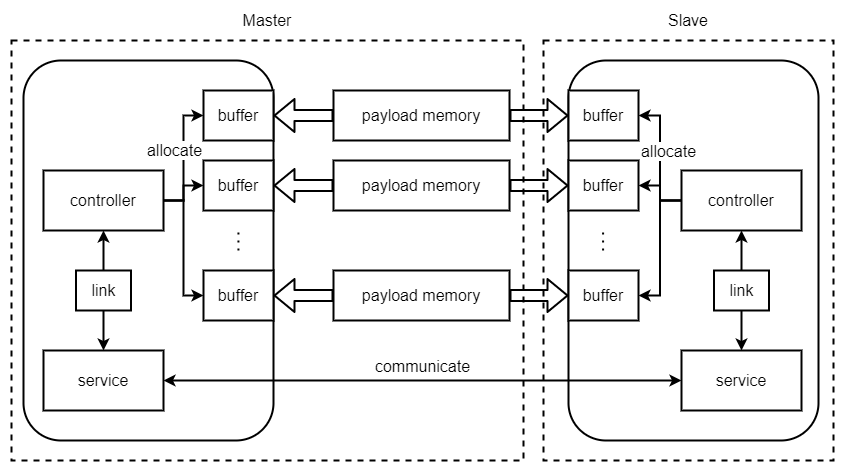

- controller：供用户操作用来申请buffer 的接口，一个controller 对应一个远端处理器。

- service：在RPBuf 内部负责与远端处理器通信的组件，使用的是RPmsg 机制。rpbuf 在进行跨核数据交互时不进行数据的拷贝操作，而是传

输数据在共享内存中的offset 以及len 给远端处理器，远端处理器从相同的位置取出相同长度的数据，这需要将数据发送方将offset 以及len封装成CMD 命令，然后借助rpmsg 传送到远端处理器。

- link：负责将controller 和service 连接起来。每一个controller 都必须与一个service 连接起来，否则它无法与远端通信。

- buffer：表示申请到的共享内存。用户通过操作buffer 对象，可直接访问对应的共享内存。对于同一片共享内存，在通信的两端都各有一个对

应的buffer 对象，它们的名字和长度相同。

- payload memory：用来存放实际传输数据的共享内存，因此称为payload（有效负载）。它统一由master 端分配，在两端都各有名字相同

的buffer 对象与其对应。

<!-- PDF page 81 -->

为controller 和service 两大组件，如此设计的目的在于将“buffer 管理” 和“通信” 两个功能解耦。对于内存管理方式不同

的平台，可以定义不同的controller；对于通信方式不同的平台，也可以定义不同的service，从而做到将不同的controller 实现和不同的service实现进行自由组合。

link 通过名为token 的结构判断哪个controller 跟哪个service 连接。每一个controller 和service 在注册时都需要指定一个token，只有token相同的才能连接起来。

#### 18.2.2 申请/释放 buffer

用户使用RPBuf 申请共享buffer 时，需要在master 端和slave 端都指定相同的“名字” 和“长度”，否则两端无法匹配上，并且只有在两端都申请成功后，buffer 才可被使用（该状态称为“available”）。

说明

buffer 的payload memory 是只由master“分配”，但“申请buffer” 这一操作，master 和slave 都要自己主动进行。

对于master 和slave 孰先孰后申请buffer，并没有什么要求，只要能确保两端最后都申请了就行。在controller 内部会维护以下三个结构，用来区分buffer 当前处于什么状态：

- remote_dummy_buffers：用来记录远端已申请、本地未申请的buffer。

- local_dummy_buffers：用来记录本地已申请、远端未申请的buffer。

- buffers：用来记录本地和远端均已申请的buffer。只有在这里的buffer 才会被认为是“available”。

申请buffer 时其状态切换如下所示：

<!-- PDF page 82 -->

*图18-2: RPBuf Allocate Buffer Flowchart*

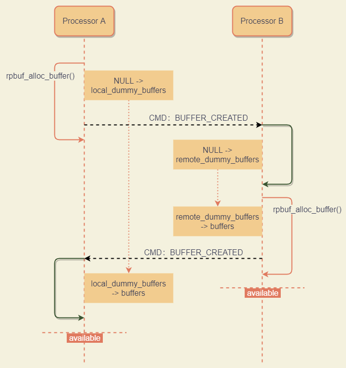

释放buffer 时也类似，无需区分先后顺序：

<!-- PDF page 83 -->

*图18-3: RPBuf Free Buffer Flowchart*

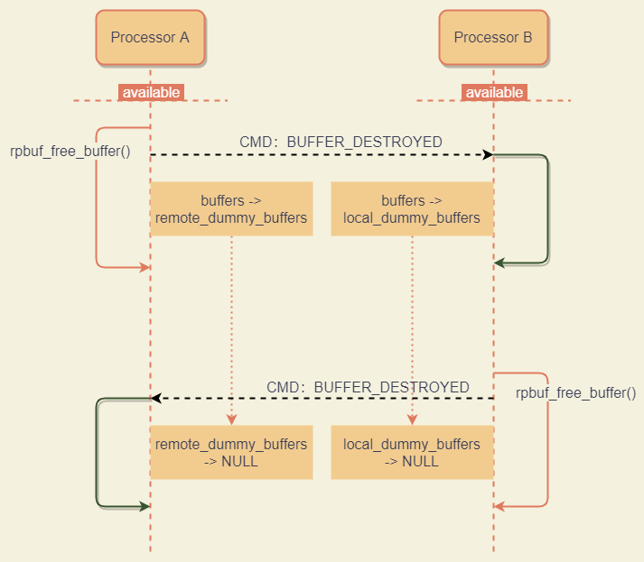

!注意

在任意一端释放了buffer 后，实际对两端来说该buffer 都已经处于“not available” 的状态，此时都不应该对buffer 进行任何读写操作。但因为buffer 的地址是直接暴露给用户，RPBuf 框架无法限制用户对该地址的直接访问，因此用户需自行确保不会在not available 时读写buffer。

```text
上面流程图描述的是正常情况下
                    buffer
                    的状态切换，而在异常情况下（如通信失败、远端处理器崩溃后重新运行等），需要
进行一些特殊处理。下图描述的是从单个处理器自身的角度来看，当它的
                    buffer
                    分别处于
                    NULL 、local_dummy_buffers 、
remote_dummy_buffers 、buffers
                    时，在本地执行
                    rpbuf_alloc_buffer() / rpbuf_free_buffer()
                    或收到远端传过来的
```

RPBUF_SERVICE_CMD_BUFFER_CREATED / RPBUF_SERVICE_CMD_BUFFER_DESTROYED 后，会如何处理：

<!-- PDF page 84 -->

*图18-4: RPBuf Buffer States*

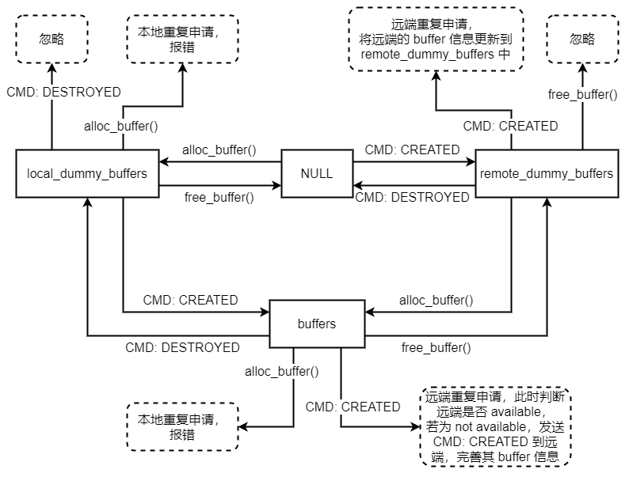

<!-- PDF page 85 -->

#### 18.2.3 数据传输流程

*图18-5: RPBuf Wrok*

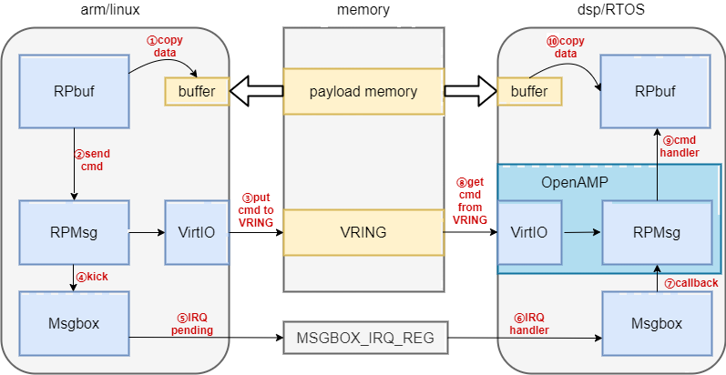

- RPBuf：基于共享内存和RPMsg 消息通知，实现传输大数据传输的框架。

- RPMsg：基于VirtIO 管理的共享内存，实现数据传输的框架。

```text
本是一套用在虚拟化环境中传输数据的框架，这里用作共享内存
    (VRING) 的管理。
```

- OpenAMP：OpenAMP 框架为RTOS、裸机和Linux 用户空间提供了RPMsg、VirtIO、remoteproc（未列出）的实现，并且与Linux 内核

兼容。

- Msgbox：是全志平台提供的一套消息中断机制，已通过linux 内核中原生的mailbox 框架作适配。

- MSGBOX_IRQ_REG：Msgbox 的中断相关寄存器。

- buffer：表示申请到的共享内存。用户通过操作buffer 对象，可直接访问对应的共享内存。

- payload memory：用来存放实际传输数据的共享内存，因此称为payload（有效负载）。

- VRING：由VirtIO 管理的一个环形共享内存。

上图展示了一次RPBuf 数据传输的通信过程，下面详细说明：

1. arm 端把数据拷贝到buffer 中，在初始化时已经将buffer 和payload memory 地址绑定，因此数据拷贝后相当于存放到了payload memory

中。

命令后加上数据在payloadmemory 中的起始地址和长度，组成数据包，调用RPMsg 接口发送，在驱动中我们定义了以下几个命

令。

```text
cmd
                    功能
RPBUF_SERVICE_CMD_BUFFER_CREATED
                    创建命令，通知另一端处理器创建RPBuf。
RPBUF_SERVICE_CMD_BUFFER_DESTROYED
                    释放命令，通知另一端处理器释放RPBuf。
RPBUF_SERVICE_CMD_BUFFER_TRANSMITTED
                    消息传输命令，传输数据的起始地址和长度给另一端处
```

理器。

```text
RPBUF_SERVICE_CMD_BUFFER_ACK
                    消息同步命令，用于收发消息的同步。
```

<!-- PDF page 86 -->

中断标记位置1。

6. dsp 端的Mgxbox 接收到中断后，触发其中断处理函数，并把数据放到队列中。

7. Mgxbox 驱动会有一个task 不断等待队列的数据，当有数据则取出并调用RPMsg 初始化时注册的callback。

8. 在callback 中会调用VirtIO 的接口，把数据包从VRING 中取出。

```text
9. 调用
RPBuf
        的消息处理函数，解析数据包，根据不同的
                    cmd
                    执行不同的
                    handler，这里收到的
                    cmd
                    是
```

RPBUF_SERVICE_CMD_BUFFER_TRANSMITTED。

10. 根据接收到的地址和长度从payload memory 中拷贝出数据。

说明

在每次数据拷贝之后，都需要使用RPMsg 发送消息传输命令，对于单次传输字节数小于496bytes 时，使用RPBuf 反而会降低性能，因为不仅需要用RPMsg 发消息，还多了两次从payload memory 中拷贝数据的操作，因此建议数据量较小时使用RPMsg。

#### 18.2.4 数据同步

当本地处理器将数据拷贝至payload memory 并发送消息传输命令到远端处理器后，并不知道远端处理器在何时会取走消息，假如远端处理器没有及时取走数据，那么本地处理器可能会再次拷贝造成数据覆盖，旧数据丢失的问题，因此RPBbuf 在驱动中增加一个数据同步的机制。同步机制的原理：数据发送端在发送数据时，添加一个同步标志，数据接收端的接收数据处理函数在接收数据时，判断发送端是否设置了同步标志，如果设置了同步标志，则回传一个应答，告知数据发送端，数据已经被接收。

##### 18.2.4.1 在RTOS中设置同步

int rpbuf_buffer_set_sync(struct rpbuf_buffer *buffer, bool sync)

##### 18.2.4.2 在linux用户空间中设置同步

int rpbuf_set_sync_buffer(rpbuf_buffer_t *buffer, uint32_t is_sync)

<!-- PDF page 87 -->

##### 18.2.4.3 数据同步流程

*图18-6: RPBuf Ack Flowchart*

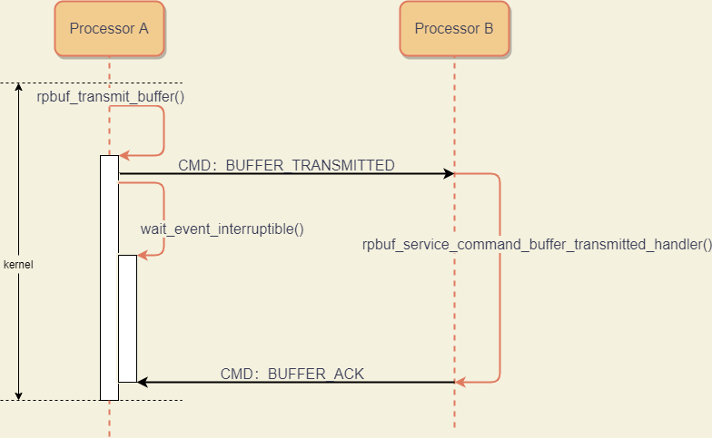

linux 应用层先把数据拷贝到共享内存中，然后调用rpbuf 的传输接口，这会从应用层切换到内核中，调用rpbuf_transmit_buffer() ，这会发送一个消息传输命令RPBUF_SERVICE_CMD_BUFFER_TRANSMITTED ，然后在wait_event_interruptible() 中阻塞，DSP 收到消息后会根据消息的CMD 调用不同的处理函数，当解析到消息传输命令会调用rpbuf_service_command_buffer_transmitted_handler() ，在里面会根据收到的偏移地址和长度刷cache，然后调用应用中注册的rx_cb，最后发送一个消息同步命令RPBUF_SERVICE_CMD_BUFFER_ACK ，linux 收到消息同步命令之后会调用rpbuf_service_command_buffer_ack_handler() ，在里面会唤醒等待事件，然后内核的阻塞线程被唤醒，内核切换到应用层中继续执行往下的逻辑。

#### 18.2.5 异步通知

在应用层中调用rpbuf_install_rx_signal() ，可以让内核使用异步通知，当内核收到消息传输命令后，会发送一个SIGIO 信号给应用层，然后应用层捕获该信号后会调用其处理函数，处理函数通过第二个参数sighandler_t handler 进行安装，具体用法可以参考rpbuf_demo 程序章节里linux

说明

目前linux 每个进程只支持一个rpbuf 使用异步通知机制，因为rpbuf 接收消息后内核发出的信号是SIGIO，进程捕获信号后只会执行对应处理函数，并不会关注该信号从何处来的，也不知道到底是哪一个rpbuf 收到的消息发出了信号，假如有多个rpbuf 都调用了rpbuf_install_rx_signal() ，那么只会触发最后安装的处理函数。

### 18.3 代码分析

#### 18.3.1 Linux

<!-- PDF page 88 -->

```text
├──drivers
│
   └──rpbuf
│
       ├──rpbuf_controller_sunxi.c
                    // 全志平台的rpbuf controller 实现
│
       ├──rpbuf_core.c
                    // rpbuf 核心代码
│
       ├──rpbuf_dev.c
                    // 在/dev 下提供节点供用户空间操作
│
       ├──rpbuf_internal.h
                    // rpbuf 内部头文件
│
       ├──rpbuf_sample_sunxi.c
                    // 在内核使用rpbuf 的一个例子，也提供一些sysfs 节点供简单调试使用
│
       └──rpbuf_service_rpmsg.c
                    // 通过rpmsg 实现的rpbuf service
└──include
```

└──linux

```text
└──rpbuf.h
                    // 提供给其他驱动使用的rpbuf 头文件
```

Tina 系统的package 中提供了在用户空间使用rpbuf 的库和示例demo：

```text
platform/allwinner/system/rpbuf/
├──demo
              // 用户空间使用rpbuf 的示例demo，依赖于librpbuf
/将与内核rpbuf_dev交互的操作封装成接口供其他应用程序使用
```

//用户空间压测rpbuf的示例demo，依赖于librpbuf

##### 18.3.1.1 在内核空间使用 RPBuf

供其他内核模块使用的RPBuf 接口都声明在头文件include/linux/rpbuf.h 中，在使用上大致分为以下步骤：

1. 创建并使能RPBuf controller（后面以rpbuf_controller_sunxi 为例来说明）。

2. 创建并使能RPBuf service（后面以rpbuf_service_rpmsg 为例来说明）。

3. 获取到controller 的指针（一个controller 对应一个远端处理器）。

4. 通过controller 申请buffer（rpbuf_alloc_buffer() ），待buffer available 后可对其地址直接进行读写。

5. 使用rpbuf_transmit_buffer() 将数据传输到远端；若远端有数据传输过来，该buffer 的rx_cb() 会被触发。

6. 使用结束后，释放buffer（rpbuf_free_buffer() ）。

```text
18.3.1.1.1
创建并使能rpbuf_controller_sunxi
```

除了要使能编译rpbuf_controller_sunxi.c 之外，我们还需要在DTS 中定义对应的rpbuf_controller device，以下是一个例子：

```dts
dsp0_rpbuf_controller: rpbuf_controller@0 {
   compatible = "allwinner,rpbuf-controller";
   remoteproc = <&dsp0_rproc>;
   ctrl_id = <0>;
                  /* index of /dev/rpbuf_ctrl */
   memory-region = <&dsp0_rpbuf_reserved>;
                    /* optional */
   status = "okay";
};
```

```text
•
remoteproc 表示它对应哪个远端处理器，它会以该remoteproc device 作为token。
•
ctrl_id 表示它生成的供用户空间操作的节点/dev/rpbuf_ctrlX 的编号（即这里的X 值）。
•
memory-region （可选）用于将一片预留内存赋给controller，让其从中申请payload memory。例如若我们定义了如下的reserved-
```

memory dsp0_rpbuf_reserved ，则dsp0_rpbuf_controller 默认都会从首地址为0x42244000、长度为0x2000 这片内存区域来申请payload memory。

```dts
reserved-memory {
   #address-cells = <2>;
   #size-cells = <2>;
   ranges;
   dsp0_rpbuf_reserved:dsp0_rpbuf@42244000 {
      compatible = "shared-dma-pool";
      no-map;
      reg = <0x0 0x42244000 0x0 0x2000>;
```

<!-- PDF page 89 -->

当rpbuf_controller_sunxi 驱动加载时，会调用rpbuf_create_controller() 和rpbuf_register_controller() 来创建和注册controller，此时需要指定enum rpbuf_role ，表示该RPBuf 是作为master 还是slave。

/* "rpbuf_internal.h" */

struct rpbuf_controller *rpbuf_create_controller(struct device *dev,

```c
const struct rpbuf_controller_ops *ops,
                    void *priv);
void rpbuf_destroy_controller(struct rpbuf_controller *controller);
```

int rpbuf_register_controller(struct rpbuf_controller *controller,

```c
void *token, enum rpbuf_role role);
void rpbuf_unregister_controller(struct rpbuf_controller *controller);
```

在调用rpbuf_create_controller() 时，我们还可以自定义一些ops ，来覆盖RPBuf 默认的行为。详见章节自定义ops。

```text
18.3.1.1.2
创建并使能rpbuf_service_rpmsg
```

rpbuf_service_rpmsg 是依赖RPMsg 框架实现，它本质上是一个rpmsg_driver ，因此它的初始化是靠RPMsg 的name service 机制实现：只有远端的rpbuf_service_rpmsg 在初始化过程中给Linux 发送name service 消息包后，才会触发linux 加载这端的rpbuf_service_rpmsg 。这整个过程对RPBuf 用户来说是隐式的，无法直接感知，但如果RPBuf service 未初始化完成，调用相关API 操作buffer 时会报错，因为RPBuf是当且仅当controller 和service 都初始化完成后才能正常使用。

```text
当
rpbuf_service_rpmsg
                  驱动加载时，类似于controller，也会调用
                    rpbuf_create_service()
                    和
                    rpbuf_register_service()
                    创建和注册
```

service。

/* "rpbuf_internal.h" */

struct rpbuf_service *rpbuf_create_service(struct device *dev,

```c
const struct rpbuf_service_ops *ops,
                  void *priv);
void rpbuf_destroy_service(struct rpbuf_service *service);
int rpbuf_register_service(struct rpbuf_service *service, void *token);
void rpbuf_unregister_service(struct rpbuf_service *service);
```

```text
Linux
的
   rpbuf_service_rpmsg
                    驱动会从它的父设备中寻找实际使用的
                    remoteproc
                    device，以它作为
                    token。因为不同内核版本的
```

remoteproc/RPMsg 代码有异，寻找remoteproc device 的方式也会有所差异：

Linux-4.9 是往上第3 个父设备：

/** We should find the underlying remoteproc device.

```text
* Normally, the rpmsg device is created from:
 *
      remoteproc device
                    <--- defined by vendors, usually in device tree
 *
      |--- rproc
                  <--- rproc_alloc()
 *
          |--- virtio
                    <--- rproc_handle_vdev() & register_virtio_device()
 *
              |--- rpmsg
                    <--- rpmsg_register_device()
 *
 * Therefore the 3rd parent of rpmsg device is the underlying remoteproc
 * device.
 */
dev_tmp = dev;
for (i = 0; i < 3; i++) {
   dev_tmp = dev_tmp->parent;
   if (!dev_tmp) {
      dev_err(dev, "cannot get rpmsg device parent %d\n", i);
      ret = -ENOENT;
```

<!-- PDF page 90 -->

oto err_destroy_service;

```text
}
   dev_dbg(dev, "rpmsg device parent %d: %s\n", i, dev_name(dev_tmp));
}
/* We use the underlying remoteproc device as rpbuf link token */
ret = rpbuf_register_service(service, dev_tmp);
if (ret < 0) {
   dev_err(dev, "rpbuf_register_service failed\n");
   goto err_destroy_service;
}
```

Linux-5.4 是往上第4 个父设备：

/*

```text
* We should find the underlying remoteproc device.
 *
ly, the rpmsg device
ated from:
 *
      remoteproc device
                    <--- defined by vendors, usually in device tree
 *
      |--- rproc
                  <--- rproc_alloc()
 *
          |--- rproc_vdev
                    <---- rproc_handle_vdev()
 *
              |--- virtio
                    <--- register_virtio_device()
 *
                  |--- rpmsg
                    <--- rpmsg_register_device()
 *
 * Therefore the 4th parent of rpmsg device is the underlying remoteproc
 * device.
 */
dev_tmp = dev;
for (i = 0; i < 4; i++) {
   dev_tmp = dev_tmp->parent;
   if (!dev_tmp) {
      dev_err(dev, "cannot get rpmsg device parent %d\n", i);
      ret = -ENOENT;
      goto err_destroy_service;
   }
bg(dev, "rpmsg device
t %d: %s\n",i,dev_name(dev_tmp));
}
/* We use the underlying remoteproc device as rpbuf link token */
ret = rpbuf_register_service(service, dev_tmp);
if (ret < 0) {
   dev_err(dev, "rpbuf_register_service failed\n");
   goto err_destroy_service;
}
```

```text
18.3.1.1.3
获取controller 的指针
```

若某一个模块的驱动想要使用RPBuf，它需要先获取到对应controller 的指针，方法如下：

首先在该驱动模块的DTS 中增加一个rpbuf 节点，并将对应的controller device 节点传给它，以rpbuf_sample_sunxi.c ：

```dts
rpbuf_sample: rpbuf_sample@0 {
   compatible = "allwinner,rpbuf-sample";
   rpbuf = <&dsp0_rpbuf_controller>;
   status = "okay";
};
```

如果需要跟多个远端通信，则传递多个controller：

```dts
rpbuf_sample: rpbuf_sample@0 {
   compatible = "allwinner,rpbuf-sample";
   rpbuf = <&dsp0_rpbuf_controller>, <&dsp1_rpbuf_controller>;
   status = "okay";
};
```

<!-- PDF page 91 -->

uf.h&gt; */

/**

```text
* rpbuf_get_controller_by_of_node - get rpbuf controller by device of_node
 * @np: of_node of the device
 * @index: index to select which of_node to use
 *
 * Return pointer to the rpbuf_controller on success, or NULL on failure.
 */
struct rpbuf_controller *rpbuf_get_controller_by_of_node(const struct device_node *np, int index);
```

```text
18.3.1.1.4
申请/使用/释放buffer
```

驱动操作RPBuf buffer 的API 位于头文件include/linux/rpbuf.h 中，主要有如下：

(*rpbuf_available_cb_t)(struct rpbuf_buffer*buffer, void *priv);

```text
typedef int (*rpbuf_rx_cb_t)(struct rpbuf_buffer *buffer, void *data, int data_len, void *priv);
typedef int (*rpbuf_destroyed_cb_t)(struct rpbuf_buffer *buffer, void *priv);
struct rpbuf_buffer_cbs {
   rpbuf_available_cb_t available_cb;
   rpbuf_rx_cb_t rx_cb;
   rpbuf_destroyed_cb_t destroyed_cb;
};
```

struct rpbuf_buffer *rpbuf_alloc_buffer(struct rpbuf_controller *controller,

```c
const char *name, int len,
                const struct rpbuf_buffer_ops *ops,
                const struct rpbuf_buffer_cbs *cbs,
                void *priv);
int rpbuf_free_buffer(struct rpbuf_buffer *buffer);
```

int rpbuf_buffer_is_available(struct rpbuf_buffer *buffer);

int rpbuf_transmit_buffer(struct rpbuf_buffer *buffer,

unsigned int offset, unsigned int data_len);

```c
const char *rpbuf_buffer_name(struct rpbuf_buffer *buffer);
int rpbuf_buffer_id(struct rpbuf_buffer *buffer);
void *rpbuf_buffer_va(struct rpbuf_buffer *buffer);
phys_addr_t rpbuf_buffer_pa(struct rpbuf_buffer *buffer);
u64 rpbuf_buffer_da(struct rpbuf_buffer *buffer);
int rpbuf_buffer_len(struct rpbuf_buffer *buffer);
void *rpbuf_buffer_priv(struct rpbuf_buffer *buffer);
```

```text
•
rpbuf_alloc_buffer()
                 用于通过
                    controller
                    申请buffer。对同一个buffer，本地与远端的
                    name
                    和
                    len
                    必须相同。此时注册的
```

rpbuf_buffer_cbs 回调函数，会在buffer 的不同阶段被调用到：

```text
•
available_cb ：当buffer 变为available 时会被触发。
端有数据传输过来后会被触发，从
data 和data_len 中可获取到数据的首地址和长度。
•
destroyed_cb ：当远端buffer 被释放后会被触发。
•
rpbuf_free_buffer() 用于释放buffer（会触发远端的destroyed_cb() ）。
•
rpbuf_is_available() 用于判断当前buffer 是否为available。一般情况下如果依靠available_cb 和destroyed_cb 来监视buffer 的
```

available 状态了，就不需要再用rpbuf_is_available() 来检查了。

```text
•
rpbuf_transmit_buffer() 用于将数据传输到远端，会触发远端的rx_cb() 。其中offset 为数据所在的首地址相对于buffer 首地址的偏移，
```

data_len 是数据的长度。这允许每次传输时只传buffer 的一部分，不必将整个buffer 都传过去。

- 其他API 用于获取buffer 的一些信息（因为struct rpbuf_buffer 的定义不会直接暴露给用户）。其中rpbuf_buffer_va() 返回的是可供用

户驱动代码直接访问的buffer 首地址的虚拟地址（Virtual Address）。

<!-- PDF page 92 -->

```text
1.
rpbuf_transmit_buffer() 时传入的offset 是“数据首地址相对于buffer 首地址的偏移”，而远端rx_cb() 被触发后，其data 指针指向
```

的是“数据的首地址”，而非偏移，即：data = buffer 首地址+ offset ，需注意区分。

2. 因为RPbuf 是在异构处理器之间传输数据，期间会涉及刷cache 的操作，使用rpbuf_transmit_buffer() 时需注意传输的数据是否按

cacheline 对齐（cacheline 大小视具体的处理器平台而定），否则可能导致无关区域的数据受影响。

```text
18.3.1.1.5
自定义ops
```

在创建controller 或申请buffer 时，可通过一些自定义的ops 来覆盖RPBuf 默认的行为，其优先级为“buffer &gt; controller &gt; 默认”。

/* &lt;linux/rpbuf.h&gt; */

```text
/**
uf_buffer_ops - user
fic rpbuf buffer operations
 * @alloc_payload_memory: allocate memory for payload
 * @free_payload_memory: free memory for payload
 * @addr_remap: remap pa or da to va
 * @buf_dev_mmap: mmap file operation for buf_dev
 */
struct rpbuf_buffer_ops {
   int (*alloc_payload_memory)(struct rpbuf_buffer *buffer, void *priv);
   void (*free_payload_memory)(struct rpbuf_buffer *buffer, void *priv);
   void *(*addr_remap)(struct rpbuf_buffer *buffer,
             phys_addr_t pa, u64 da, int len, void *priv);
   int (*buf_dev_mmap)(struct rpbuf_buffer *buffer, void *priv, struct vm_area_struct *vma);
};
```

/* "rpbuf_internal.h" */

```text
struct rpbuf_controller_ops {
```

int (*alloc_payload_memory)(struct rpbuf_controller *controller,

```text
struct rpbuf_buffer *buffer, void *priv);
   void (*free_payload_memory)(struct rpbuf_controller *controller,
                struct rpbuf_buffer *buffer, void *priv);
   void *(*addr_remap)(struct rpbuf_controller *controller,
             phys_addr_t pa, u64 da, int len, void *priv);
   int (*buf_dev_mmap)(struct rpbuf_controller *controller,
             struct rpbuf_buffer *buffer, void *priv,
             struct vm_area_struct *vma);
};
```

```text
•
alloc_payload_memory 与free_payload_memory 只在master 端使用，用于申请/释放payload memory。
•
addr_remap 只在slave 端使用，用于将master 端在申请payload memory 后传过来的pa （Physical Address）或da （Device
```

Address）转换为可供代码直接访问的va （Virtual Address）。

```text
map 在rpbuf_dev.c
 ，供mmap() 将buffer 的地址映射到用户空间。
```

##### 18.3.1.2 在用户空间使用 RPBuf

内核代码rpbuf_dev.c 会生成/dev/rpbuf_ctrlX 节点供用户空间程序通过ioctl() 来使用RPBuf 框架（每一个/dev/rpbuf_ctrlX 分别对应每一个controller）。为方便使用，我们基于此再封装成librpbuf 库，其API 位于头文件librpbuf.h 中：

typedef struct __rpbuf_buffer rpbuf_buffer_t;

```c
rpbuf_buffer_t *rpbuf_alloc_buffer(int ctrl_id, const char *name, size_t len);
int rpbuf_free_buffer(rpbuf_buffer_t *buffer);
```

<!-- PDF page 93 -->

pbuf_buffer_name(rpbuf_buffer_t*buffer);uffer_len(rpbuf_buffer_t*buffer);

int rpbuf_buffer_is_available(rpbuf_buffer_t *buffer);

```c
int rpbuf_transmit_buffer(rpbuf_buffer_t *buffer, unsigned int offset, unsigned int data_len);
int rpbuf_receive_buffer(rpbuf_buffer_t *buffer, unsigned int *offset,
      unsigned int *data_len, int timeout_ms);
int rpbuf_install_rx_signal(rpbuf_buffer_t *buffer, sighandler_t handler);
int rpbuf_remove_rx_signal(rpbuf_buffer_t *buffer);
int rpbuf_set_sync_buffer(rpbuf_buffer_t *buffer, uint32_t is_sync);
```

这些API 与内核头文件include/linux/rpbuf.h 中的类似，详细用法可参考librpbuf.h 中的注释和示例demo。

它们与内核API 的用法区别，主要在于：

```text
•
rpbuf_alloc_buffer()
                   会阻塞等待
                    buffer
                    变为
                    available，或超时退出（超时的等待时间在
                    rpbuf_dev.c
                    中用宏
_WAIT_TIMEOUT_MSEC
义）。
•
rpbuf_buffer_addr() 返回的是执行mmap() 后将buffer 地址映射上来的地址，可供用户空间程序直接使用。
•
rpbuf_buffer_is_available() 同样是用于检查buffer 是否为available，但因为涉及用户态和内核态的切换，并不适合太过频繁地使用。
• 将数据传输到远端同样是使用
                    rpbuf_transmit_buffer ，用法也类似；但因为没有
                    rx_cb ，接收数据则需要应用程序主动调用
```

rpbuf_receive_buffer() 来判断远端是否传输数据过来（阻塞与否通过timeout_ms 指定）。

```text
•
rpbuf_install_rx_signal() 可以让内核使用异步通知，当内核收到消息传输命令后，会发送一个SIGIO 信号给应用层，然后应用层捕获该信号
```

后会调用其处理函数，处理函数通过第二个参数sighandler_t handler 进行安装，具体用法可以参考rpbuf_demo 程序章节里linux 的源码。

```text
•
rpbuf_remove_rx_signal()
                    是让应用捕获到SIGIO 信号后执行系统默认操作，不再调用自定义安装的处理函数，
```

与rpbuf_install_rx_signal() 成对使用。

```text
•
rpbuf_set_sync_buffer() 的作用是设置为同步传输，每次调用完rpbuf_transmit_buffer() 都会阻塞，直到收到一个消息同步命令之后退出。
```

```text
在应用程序两次调用
                   rpbuf_receive_buffer()
                    之间，如果远端传输了两次或以上的数据过来，rpbuf_receive_buffer()
                    只能拿到
最近一次的
           offset
                  和
                    data_len ，因为底层没有缓冲区来保存历史值。这种情况在系统繁忙时比较容易出现，需要应用程序调
```

用rpbuf_set_sync_buffer() 设置同步方式来避免覆盖旧数据。

#### 18.3.2 RTOS

RTOS 下的RPBuf 代码结构与Linux 的类似，但因为不区分内核空间和用户空间，所以不需要rpbuf_dev 和librpbuf 这两部分功能的代码。

```text
rtos-components/aw/rpbuf/
├──include
│   └──rpbuf.h
├──Kconfig
├──Makefile
├──rpbuf_common.h
├──rpbuf_controller.c
├──rpbuf_core.c
├──rpbuf_demo
│   ├──Makefile
│   ├──modules.order
│   ├──rpbuf_demo.c
│   └──rpbuf_test.c
├──rpbuf_internal.h
├──rpbuf_perf.c
├──rpbuf_reserved_mem.c
└──rpbuf_service_rpmsg.c
```

<!-- PDF page 94 -->

rder

RPBuf 对外的API 都位于头文件include/rpbuf.h 中，大部分的用法与Linux 的内核API 类似。

区别较大的主要为用于初始化的API。RTOS 没有Linux 那样的设备驱动模型，所以是直接调用以下API 进行初始化，这些步骤一般放在rtos/l ichee/rtos-components/thirdparty/openamp/rpbuf_demo/rpbuf.c 中进行。

/* &lt;rpbuf.h&gt; */

/**

```text
* rpbuf_init_service - Init service
 * @id: service id
 * @token: used to link with controller
 * @attached_op: attached operation for rpbuf service. What it does depends on
 *
              the rpbuf_init_service() implementation.
 * @attached_priv: private data used for attached_op().
 *
 * What @id and @token means is defined by the backend implementation of
 * rpbuf_init_service.
 *
 * Return pointer to rpbuf service on success, or NULL on failure.
 */
struct rpbuf_service *rpbuf_init_service(int id, void *token,
                 rpbuf_service_attached_op_t attached_op,
                 void *attached_priv);
```

/**

```c
* rpbuf_deinit_service - The opposite operation of rpbuf_init_service
 * @service: rpbuf service
 */
void rpbuf_deinit_service(struct rpbuf_service *service);
/**
_controller - Init
er
 * @id: controller id
 * @token: used to link with service
 * @role: MASTER or SLAVE
 * @ops: user-specific rpbuf controller operations
 * @priv: user-specific private data
 *
 * What @id and @token means is defined by the backend implementation of
 * rpbuf_init_controller
 *
 * Return pointer to rpbuf controller on success, or NULL on failure.
 */
struct rpbuf_controller *rpbuf_init_controller(int id, void *token, enum rpbuf_role role,
                    const struct rpbuf_controller_ops *ops,
                    void *priv);
```

/*

```c
* rpbuf_deinit_controller - The opposite operation of rpbuf_init_controller
r: rpbuf controller
 */
void rpbuf_deinit_controller(struct rpbuf_controller* controller);
```

### 18.4 rpbuf_demo程序

此应用主要是用来展示rpbuf 的创建，释放，接收和发送等基本功能的应用，每次执行-s 命令发送一条消息，linux 接收部分用的是异步通知机制。

<!-- PDF page 95 -->

#### 18.4.1 代码路径

##### 18.4.1.1 Linux

platform/allwinner/system/rpbuf/demo/main.c

##### 18.4.1.2 RTOS

rtos/lichee/rtos-components/aw/rpbuf/rpbuf_demo/rpbuf_demo.c

#### 18.4.2 编译

linux 需要在make menuconfig 中选上：

Allwinner ---&gt;

```text
System
      --->
   <*> rpbuf_demo
                    # CONFIG_PACKAGE_rpbuf_demo
```

DSP 需要在make menuconfig 中选上：

```text
System components
               --->
   aw components
               --->
      RPBuf framework
                    --->
          [*] RPBuf demo
                    # CONFIG_COMPONENTS_RPBUF_DEMO
```

重新编译烧录固件后，在控制台中执行help 命令可看到增加了rpbuf_demo 命令。

#### 18.4.3 基本使用

f_demo 的help 信息如下：

USAGE:rpbuf_demo [OPTIONS]

OPTIONS:

```text
-s MESSAGE
           : send MESSAGE
  -d time
           : delay free buffer (default: 100 ms)
  -r
           : receive messages
  -t time
           : specifies the time of receive messagess, unit:ms
  -a
           : sync transmit
  -I ID
           : specify rpbuf ctrl ID (default: 0)
  -N NAME
           : specify buffer name (default: "rpbuf_demo")
  -L LENGTH
           : specify buffer length (default: 32 bytes)
  -O OFFSET
           : specify offset in buffer to store data (default: 0)
e.g.
s"hello":sendstring"hello"
  rpbuf_demo -r
                    : receive data forever
  rpbuf_demo -r -t 1000
                    : receive data 1000 msecond
```

dsp 下的rpbuf_demo 的help 信息如下：

USAGE:

```text
rpbuf_demo [OPTIONS]
OPTIONS:
  -h
           : print help message
  -c
           : create buffer
  -d
           : destory buffer
  -s STRING
           : copy STRING to buffer and send to remote
  -l
           : list created buffers
  -I ID
           : specify controller ID (default: 0)
```

<!-- PDF page 96 -->

cifybuffername(default:"rpbuf_demo")

```text
-L LENGTH
          : specify buffer length (default: 32 bytes)
-O OFFSET
          : specify offset in buffer to store data (default: 0)
```

e.g.First, create a buffer (its name and length should match that of remote rpbuf buffer):

```text
rpbuf_buffer -N "xxx" -L LENGTH -c
Then if remote sends data to it, the buffer callback will be called.
```

We can send data (e.g. "hello") to remote:

rpbuf_demo -N "xxx" -s "hello"

If this buffer is no longer in use, destroy it:

rpbuf_demo -N "xxx" -d

首先，DSP 端使用-c 选项创建rpbuf（可使用-N 指定名字，使用-I 指定远端通信核的ID、使用-L 指定长度）。通过-l 选项可列出之前创建过的rpbuf。

中各ID 分别对应哪个远端核：

```text
本地核
                    ID：0
                    ID：1
CPU
                    DSP0
                    DSP1
DSP0
                    CPU
                    DSP1
DSP1
                    CPU
                    DSP0
```

DSP 端创建了rpbuf 之后，如果远端有消息发送过来，其回调函数会被调用到，将收到的数据打印出来。

使用-s 选项可将某个字符串发送到远端。

如果不再使用该rpbuf，使用-d 参数进行销毁。

demo 最简单的使用方式：

linux与DSP0通信：

（ID默认是0，NAME默认rpbuf_demo）

1、DSP0输入rpbuf_demo -c

2、linux输入rpbuf_demo -s "hello"，DSP0打印输出

3、linux输入rpbuf_demo -r

4、DSP0输入rpbuf_demo -s "123"，linux打印输出

linux与DSP1通信：

AME默认rpbuf_demo）

1、DSP1输入rpbuf_demo -c

2、linux输入rpbuf_demo -I 1 -s "hello"，DSP1打印输出

```text
3、linux输入rpbuf_demo
                   -I 1 -r
```

4、DSP1输入rpbuf_demo -s "123"，linux打印输出

DSP0与DSP1通信：

（因为不能创建同名buffer，假如前面已经创建了名字为rpbuf_demo的buffer，则需要-N指定名字）

<!-- PDF page 97 -->

buf_demo-I1-N"rpbuf_dsp_demo"-c

3、DSP0输入rpbuf_demo -I 1 -N "rpbuf_dsp_demo" -s "hellp"，DSP1打印输出

4、DSP1输入rpbuf_demo -I 1 -N "rpbuf_dsp_demo" -s "hellp"，DSP0打印输出

技巧

两个核申请创建rpbuf 时，必须指定名字和长度一致，这样才会访问到同一块内存区域。

#### 18.4.4 rpbuf_test程序

##### 18.4.4.1 代码路径

```text
此应用是在rpbuf_demo 的基础上修改的，每次发送会生成一个随机数和
                 md5
的值，接收端会进行md5 的校验，可以自定义发送消息的数量和
```

时间间隔，linux 接收部分用的是轮询机制。

```text
18.4.4.1.1
linux
```

platform/allwinner/system/rpbuf/test/main.c

```text
18.4.4.1.2
RTOS
```

rtos/lichee/rtos-components/aw/rpbuf/rpbuf_demo/rpbuf_test.c

##### 18.4.4.2 编译

linux 需要在make menuconfig 中选上：

Allwinner ---&gt;

```text
System
      --->
   <*> rpbuf_test
                    # CONFIG_PACKAGE_rpbuf_test
```

DSP 需要在make menuconfig 中选上：

```text
System components
               --->
   aw components
               --->
      RPBuf framework
                    --->
          [*] RPBuf demo
                    # CONFIG_COMPONENTS_RPBUF_DEMO
```

重新编译烧录固件后，在控制台中执行help 命令可看到增加了rpbuf_test 命令。

##### 18.4.4.3 基本使用

linux 下的rpbuf_test 的help 信息如下：

USAGE:rpbuf_test [OPTIONS]

OPTIONS:

```text
-d time
          : set data sending interval (default: 100 ms)
-s
          : send test messages
-c
          : send count (default: 10)
-r
          : receive messages
-t time
          : specifies the time of receive messagess, unit:ms
-a
          : sync transmit
-v
          : verbosely print check result
```

<!-- PDF page 98 -->

:specifyrpbufctrlID(default:0)

```text
-N NAME
          : specify buffer name (default: "rpbuf_test")
-L LENGTH
          : specify buffer length (default: 32 bytes)
```

e.g.

```text
rpbuf_test -L 0x1000 -c 10 -s -a : send 10 test data, size=0x1000
rpbuf_test -L 0x1000 -c -1 -s -a : send test data all the time, size=0x1000
rpbuf_test -L 0x1000 -r
                    : receive test data forever, size=0x1000
rpbuf_test -L 0x1000 -r -t 1000
                    : receive test data 1 second, size=0x1000
```

dsp 下的rpbuf_test 的help 信息如下：

USAGE:

```text
rpbuf_test [OPTIONS]
OPTIONS:
  -h
           : print help message
  -c
           : create buffer
:destorybuffer
  -s
           : send test messagese
  -l
           : list created buffers
  -a
           : sync transmit
  -v
           : verbosely print check result
  -C
           : send count (default: 1,always send: -1)
  -I ID
           : specify controller ID (default: 0)
  -N NAME
           : specify buffer name (default: "rpbuf_test")
  -D TIME
           : set data sending interval (default: 100 ms)
  -L LENGTH
           : specify buffer length (default: 32 bytes)
```

e.g.First, create a buffer (its name and length should match that of remote rpbuf buffer):

```text
rpbuf_test -N "xxx" -L LENGTH -c -a
Then if remote sends data to it, the buffer callback will be called.
```

We can send 100 test data to remote:

rpbuf_test -N "xxx" -C 100 -s

We can always send test data to remote, interval time 5ms:

rpbuf_test -N "xxx" -C -1 -D 5 -s

If this buffer is no longer in use, destroy it:

rpbuf_test -N "xxx" -d

首先，DSP 端使用-c 选项创建rpbuf（可使用-N 指定名字，使用-I 指定远端通信核的ID、使用-L 指定长度）。通过-l 选项可列出之前创建过的rpbuf。

下表列出本地核中各ID 分别对应哪个远端核：

```text
本地核
                    ID：0
                    ID：1
CPU
                    DSP0
                    DSP1
DSP0
                    CPU
                    DSP1
              CPU
                    DSP0
```

DSP 端创建了rpbuf 之后，如果远端有消息发送过来，DSP 定义的回调函数会被调用到，将收到的数据打印出来。

使用-s 选项可创建发送线程，发送随机生成的数据并在接收端中校验。

如果不再使用该rpbuf，使用-d 参数进行销毁。

下面演示rpbuf_test 最简单的使用方式：

linux与DSP0通信：

<!-- PDF page 99 -->

```text
linux发dsp0收：
1、dsp0执行rpbuf_test -I 0 -L 1024 -N "cpu_to_dsp0" -c
2、linux执行rpbuf_test -I 0 -L 1024 -N "cpu_to_dsp0" -s -c -1 -a &
dsp0发linux收：
1、dsp0执行rpbuf_test -I 0 -L 1024 -N "dsp0_to_cpu" -c -a
2、linux执行rpbuf_test -I 0 -L 1024 -N "dsp0_to_cpu" -r &
3、dsp0执行rpbuf_test -N "dsp0_to_cpu" -C -1 -s
```

linux与DSP1通信：

（ID默认是0，NAME默认rpbuf_test）

```text
linux发dsp1收：
1、dsp1执行rpbuf_test -I 0 -L 1024 -N "cpu_to_dsp1" -c
2、linux执行rpbuf_test -I 1 -L 1024 -N "cpu_to_dsp1" -s -c -1 -a&
dsp1发linux收：
1、dsp1执行rpbuf_test -I 0 -L 1024 -N "dsp1_to_cpu" -c -a
2、linux执行rpbuf_test -I 1 -L 1024 -N "dsp1_to_cpu" -r &
3、dsp1执行rpbuf_test -I 0 -N "dsp1_to_cpu" -C -1 -s
```

DSP0与DSP1通信：

（ID默认是0，NAME默认rpbuf_test）

```text
dsp0发dsp1收：
1、dsp1执行rpbuf_test -I 1 -L 1024 -N "dsp0_to_dsp1" -c
2、dsp0执行rpbuf_test -I 1 -L 1024 -N "dsp0_to_dsp1" -c -a
3、dsp0执行rpbuf_test -N "dsp0_to_dsp1" -C -1 -s
dsp1发dsp0收：
1、dsp0执行rpbuf_test -I 1 -L 1024 -N "dsp1_to_dsp0" -c
buf_test-I1-L1024-N"dsp1_to_dsp0"-c-a
buf_test-N"dsp1_to_dsp0"-C-1-s
```

技巧

两个核申请创建rpbuf 时，必须指定名字和长度一致，这样才会访问到同一块内存区域。

### 18.5 rpbuf传输性能测试

用户可以使用rpbuf_test 命令对rpbuf 进行性能测试，测试发送方向和接收方向各自的耗时以及速率。本章节主要描述这个测试的操作步骤并解读测试结果。

#### 18.5.1 应用层测试方法

下面的指令是主核与从核之间的传输性能测试指令，指令的参数请查看“rpbuf_test 程序”章节。测试方法以及测试结果汇总如

下：

1. 测试一：linux 发dsp0 收

测试方法：

```text
首先，dsp0执行：rpbuf_test -I 0 -L 1024 -N "cpu_to_dsp0" -c
然后，linux执行：rpbuf_test -I 0 -L 1024 -N "cpu_to_dsp0" -s -c -1 -a &
                    #注意：-a启用了数据同步，这可以避免接收端没有及时提取接收到的
    数据，导致数据可能被发送端的新数据覆盖
```

从核测试结果：

<!-- PDF page 100 -->

*图18-7: linux 发dsp0 收的从核测试结果*

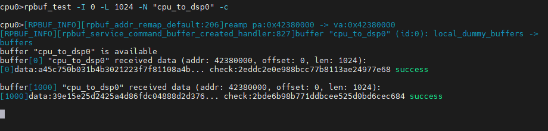

主核测试结果：

*图18-8: linux 发dsp0 收的主核测试结果*

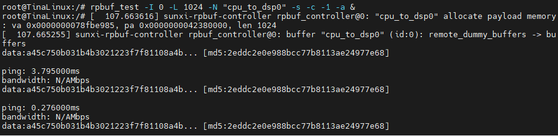

测试结果说明：

```text
【【【从核测试结果说明】】】
1. reamp pa:0x42380000 -> va:0x42380000
                    #说明：rpbuf的payload内存的物理起始地址以及其映射后的虚拟起始地址
2. buffer "cpu_to_dsp0" (id:0): local_dummy_buffers -> buffers，
                    #说明rpbuf的名称为cpu_to_dsp0，控制器的ID为0，local dummy_buffers
    转换成buffers
3. buffer "cpu_to_dsp0" is available，
                    #说明：名称为cpu_to_dsp0的rpbuf为可用状态，可以进行数据的收发
4. buffer[0] "cpu_to_dsp0" received data (addr: 42380000, offset: 0, len: 1024) #说明：dsp端从名cpu_to_dsp0的rpbuf中接收到数据，
    rpbuf的起始地址为0x42380000，rpbuf接收到的数据长度为1024个字节，数据在rpbuf的偏移为0。
5. [0]data:a45c750b031b4b3021223f7f81108a4b... check:2eddc2e0e988bcc77b8113ae24977e68 success
                    ：#说明：“[0]data”：中的“[0]”是指
    接收数据的次数不足一千次，如果超过1千次不足2千次，则会是“[1000]data”，中括号中的数值是接收次数对1000求商的结果。“[0]data”后的则是接收
    到的数据，“check:”后的则是接收到的数据的校验和。
```

```text
【【【主核测试结果说明】】】
1. sunxi-rpbuf-controller rpbuf_controller@0: "cpu_to_dsp0" allocate payload memory: va 0x0000000078fbe985, pa 0x0000000042380000
4#说明：rpbuf_controller分配了名为cpu_to_dsp0的rpbuf有效负载内存，这段内存的物理起始地址为：0x42380000，映射到虚拟起始
    地址为0x78fbe985，rpbuf的长度为1024字节
2. sunxi-rpbuf-controller rpbuf_controller@0: buffer "cpu_to_dsp0" (id:0): remote_dummy_buffers -> buffers #说明：rpbuf
    controller0的rpbuf名为cpu_to_dsp，远端的dummy_buffers转换成buffers
3. data:a45c750b031b4b3021223f7f81108a4b... [md5:2eddc2e0e988bcc77b8113ae24977e68] #说明：发送的数据以及其md5校验和
4. ping: 3.795000ms
                  #说明：linux数据传输到dsp，dsp提取了数据，dsp发送应答给linux，linux响应了应答，同步数据传输过程的耗时
5. bandwidth: N/AMbps
                  #说明：linux端发送数据，不显示带宽，N/A是"Not Applicable" 的缩写，意为不适用
```

2. 测试二：dsp0 发linux 收

测试方法：

```text
首先，dsp0执行：rpbuf_test -I 0 -L 1024 -N "dsp0_to_cpu" -c -a
                    #注意：-a表示启用数据同步，数据同步可以避免接收端没有及时提取接收到的
    数据，旧数据被新数据覆盖
然后，linux执行：rpbuf_test -I 0 -L 1024 -N "dsp0_to_cpu" -r &
```

<!-- PDF page 101 -->

：rpbuf_test-N"dsp0_to_cpu"-C-1-s

从核测试结果：

*图18-9: dsp0 发linux 收的从核测试结果*

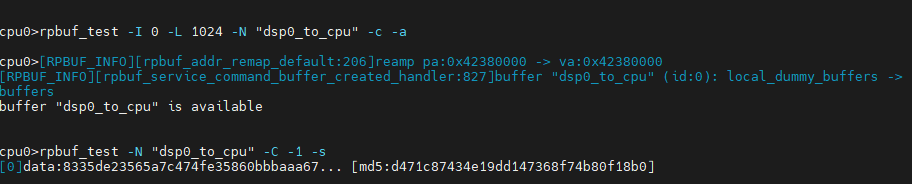

主核测试结果：

*图18-10: dsp0 发linux 收的主核测试结果*

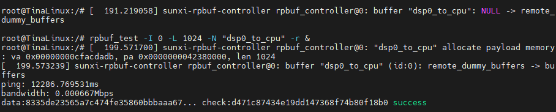

测试结果说明：

```text
【【【从核测试结果说明】】】
1. reamp pa:0x42380000 -> va:0x42380000
                    #说明：rpbuf的payload在内存中的物理起始地址和映射后的虚拟起始地址
2. buffer "dsp0_to_cpu" (id:0): local_dummy_buffers -> buffers
                    #说明：rpbuf的名称为cpu_to_dsp0，控制器的ID为0，local dummy_buffers
    转换成buffers
3. buffer "dsp0_to_cpu" is available
                    #说明：名称为cpu_to_dsp0的rpbuf已经是可用状态，可以进行数据的收发
4. [0]data:8335de23565a7c474fe35860bbbaaa67... [md5:d471c87434e19dd147368f74b80f18b0]
                    #说明：dsp发送的数据以及数据的校验和数据的校
    验和，“[0]”中括号中的数值是发送次数对1000求商的结果
```

【【【主核测试结果说明】】】

```text
1. sunxi-rpbuf-controller rpbuf_controller@0: "dsp0_to_cpu" allocate payload memory: va 0x00000000cfacdadb, pa 0
   x0000000042380000, len 1024
                    #说明：rpbuf_controller分配了名为cpu_to_dsp0的rpbuf有效负载内存，这段内存的物理起始地址为：
   0x42380000，映射后的虚拟起始地址为0xcfacdadb，rpbuf的长度为1024字节
f-controllerrpbuf_controller@0:buffer"cpu_to_dsp0"(id:0):remote_dummy_buffers->buffers#说明：rpbuf
   controller0的rpbuf名为cpu_to_dsp，远端的dummy_buffers转换成buffers
3. ping: 12286.769531ms
                    #说明：获得远端发送过来的数据的offset、len的时长
4. bandwidth: 0.000667Mbps
                    #说明：接收数据的速率，单位：兆位每秒
5. data:8335de23565a7c474fe35860bbbaaa67... check:d471c87434e19dd147368f74b80f18b0 success
                    #说明：接收到的数据以及数据的MD5校验
   和，sucess表示接收成功
```

### 18.6 rpbuf通信耗时测量

rpbuf 框架目前支持通信耗时测量功能，又叫性能跟踪，可通过此功能测量单次rpbuf 通信过程中发送方和接收方各个阶段的耗时信息。

#### 18.6.1 工作原理

<!-- PDF page 102 -->

#### 18.6.2 性能跟踪点和性能跟踪阶段

目前支持如下几个性能跟踪点：

- RPBUF_PERF_POINT_LOCAL_FLUSH：发送方开始刷cache

- RPBUF_PERF_POINT_LOCAL_NOTIFY：发送方开始通知对端

- RPBUF_PERF_POINT_LOCAL_WAIT_ACK：发送方等待ACK

- RPBUF_PERF_POINT_REMOTE_RECV：接收方准备接收

- RPBUF_PERF_POINT_REMOTE_EXEC_CB：接收方开始执行回调函数

- RPBUF_PERF_POINT_REMOTE_SEND_ACK：接收方开始发送ACK

- RPBUF_PERF_POINT_REMOTE_FINISH：接收方结束

- RPBUF_PERF_POINT_LOCAL_FINISH：发送方结束

其中还有一个隐式的性能跟踪点，为发送方开始发送的时刻，提供给用户的API 中没有此性能跟踪点，因为用户API 获取到的数据是经过处理后

```text
数据(相对时间戳)，故此隐式跟踪点的相对时间戳为
0us。
```

目前支持如下几个性能跟踪阶段：

- RPBUF_PERF_STAGE_LOCAL_PREPARE：发送方准备

- RPBUF_PERF_STAGE_LOCAL_FLUSH：发送方刷cache

- RPBUF_PERF_STAGE_LOCAL_NOTIFY：发送方通知对端

- RPBUF_PERF_STAGE_REMOTE_RECV：发送方通知到接收方准备接收

- RPBUF_PERF_STAGE_REMOTE_PREPARE：接收方准备

- RPBUF_PERF_STAGE_REMOTE_EXEC_CB：接收方执行回调函数

- RPBUF_PERF_STAGE_REMOTE_SEND_ACK：接收方发送ACK

- RPBUF_PERF_STAGE_LOCAL_FINISH：发送方结束

上述这些性能跟踪点和性能跟踪阶段都有对应的宏，Linux 环境可在bsp/include/linux/rpbuf.h 文件里找到，RTOS 环境可在rtos/lichee/rtos-

```text
w/rpbuf/include/rpbuf.h
件里找到。
```

!注意

rpbuf 处于非同步模式下上述性能跟踪点和性能跟踪阶段宏名中带有REMOTE 的为无效项(不会记录时间戳信息)

#### 18.6.3 配置信息

主核Linux 环境需要启用内核配置CONFIG_AW_RPBUF_PERF_TRACE。

从核RTOS 环境需要启用配置CONFIG_AW_RPBUF_PERF_TRACE。

由于通信耗时测量功能基于AMP 时间戳模块，故AMP 时间戳模块也需要配置，另外Linux 和RTOS 环境还需分别配置所使用的AMP 时间戳设备的ID，其中Linux 是在dts 里配置，RTOS 是配置CONFIG_RPBUF_AMP_TS_DEV_ID，且Linux 环境下此配置的值需要和dts 里AMP 时间

```text
致，RTOS 环境下暂时只支持设置为
0，AMP 时间戳设备相关的
dts 配置也可参考“主核和从核获取相同时基的时间戳
”章节。
```

#### 18.6.4 API说明

rpbuf 通信涉及到通信双方，涉及到主核Linux 和从核RTOS，因此主核Linux 环境和从核RTOS 环境都有类似API。另外由于主核Linux 环境同时支持在内核态和用户态使用rpbuf，故其API 也区分内核态和用户态。不过目前SDK 中Linux 内核态API、Linux 用户态API 以及RTOS 环境API 都是一致的。

##### 18.6.4.1 rpbuf_perf_data_t数据结构

rpbuf_perf_data_t 表示某次通信过程中的性能跟踪数据：

<!-- PDF page 103 -->

PERF_POINT_LOCAL_FLUSH0

```text
#define RPBUF_PERF_POINT_LOCAL_NOTIFY 1
#define RPBUF_PERF_POINT_LOCAL_WAIT_ACK 2
#define RPBUF_PERF_POINT_REMOTE_RECV 3
#define RPBUF_PERF_POINT_REMOTE_EXEC_CB 4
#define RPBUF_PERF_POINT_REMOTE_SEND_ACK 5
#define RPBUF_PERF_POINT_REMOTE_FINISH 6
#define RPBUF_PERF_POINT_LOCAL_FINISH 7
#define RPBUF_PERF_STAGE_LOCAL_PREPARE 0
#define RPBUF_PERF_STAGE_LOCAL_FLUSH 1
#define RPBUF_PERF_STAGE_LOCAL_NOTIFY 2
#define RPBUF_PERF_STAGE_REMOTE_RECV 3
#define RPBUF_PERF_STAGE_REMOTE_PREPARE 4
#define RPBUF_PERF_STAGE_REMOTE_EXEC_CB 5
#define RPBUF_PERF_STAGE_REMOTE_SEND_ACK 6
#define RPBUF_PERF_STAGE_LOCAL_FINISH 7
PERF_STAGE_NUM(RPBUF_PERF_STAGE_LOCAL_FINISH+1)
PERF_POINT_NUMRPBUF_PERF_STAGE_NUM
typedef struct rpbuf_perf_data {
   int is_sync;
   __u32 timestamp[RPBUF_PERF_POINT_NUM];
   __u32 time_span[RPBUF_PERF_STAGE_NUM];
   __u64 raw_timestamp;
} rpbuf_perf_data_t;
```

成员说明：

- is_sync：此rpbuf 是否是同步模式

- timestamp：性能跟踪点的相对时间戳数组

- time_span：性能跟踪阶段的耗时信息数组

- raw_timestamp：隐式性能跟踪点的原始时间戳(绝对时间戳)

其中时间戳信息和耗时信息的单位都是us。

获取到性能跟踪数据后，可使用RPBUF_PERF_POINT_XXX 宏以及RPBUF_PERF_STAGE_XXX 宏来拿到具体性能跟踪点的相对时间戳或性能跟踪阶段的耗时。

##### 18.6.4.2 获取性能跟踪数据

int rpbuf_get_perf_data(struct rpbuf_buffer *buffer, rpbuf_perf_data_t *perf_data);

参数：

- buffer：指向rpbuf 的指针

- perf_data：指向获取到的性能跟踪数据的指针

- 0：获取成功

- 其他值：获取失败

##### 18.6.4.3 打印性能跟踪数据

void rpbuf_dump_perf_data(const rpbuf_perf_data_t *perf_data);

参数：

<!-- PDF page 104 -->

式如下(以同步模式为例

```text
Mode: Sync
Timestamp:
>Start
          : 0 us [1598572.584 ms]
>Flush cache : 6 us
>Notify
          : 13 us
>Wait ACK
          : 68 us
  <Recv
          : 158 us
  <Exec CB
          : 164 us
  <Send ack
          : 176 us
  <Finish
          : 178 us
>End
          : 417 us
Time span:
>Prepare
          : 6 us
>Flush cache : 7 us
>Notify
          : 55 us
  <Recv
            : 90 us
us
  <Exec CB
            : 12 us
  <Send ACK
            : 2 us
>Local finish: 239 us
```

其首先打印各性能跟踪点的相对时间戳信息，然后分别打印各性能跟踪阶段的耗时信息，其中第一个性能跟踪点为隐式性能跟踪点，且会打印其原始的绝对时间戳(单位为ms)。上面打印的各性能跟踪点以及各性能跟踪阶段的顺序和上面“性能跟踪点和性能跟踪阶段”章节中介绍的顺序一致，各性能跟踪点和性能跟踪阶段的详细信息请参考此章节。

!注意

rpbuf 处于非同步模式下上述API 会在开头打印“Mode: Async”，且不会打印以“ &lt;” 开头的性能跟踪点和性能跟踪阶段的信息，因此这些性能跟踪点和性能跟踪阶段此时是无效的。

#### 18.6.5 API使用方法

可参考rtos/lichee/rtos-components/aw/rpbuf/rpbuf_demo/rpbuf_test.c 文件或platform/allwinner/system/rpbuf/test/main.c 文件里的相关逻辑来获取rpbuf 性能跟踪数据，具体使用步骤如下：

1. 调用rpbuf_get_perf_data 获取某个rpbuf 某次通信的性能跟踪数据并保存

2. 根据具体需求来使用获取到的rpbuf 性能跟踪数据

!注意

上述API 都是需要在发送方调用的，因为rpbuf 处于同步模式时单次rpbuf 通信的结束点在发送方这端，虽然非同步模式时单次rpbuf 通信的结束点在接收方这端，但考虑到一致性且非同步模式使用的比较少，故设计成和同步模式时一样在发送方获取了。

#### 18.6.6 使用示例

```text
buf_test 程序支持获取性能跟踪数据并打印，增加参数
-p 时就会自动获取性能跟踪数据并打印，下面是具体命令：
```

Linux 发RTOS 收：

```text
Linux：rpbuf_test -s -c 10 -I 0 -N test -L 0x1000 -a -p
RTOS：rpbuf_test -c -I 0 -N test -L 0x1000 -a
```

RTOS 发Linux 收：

```text
Linux：rpbuf_test -r -I 0 -N test -L 0x1000 -a
RTOS：rpbuf_test -s -C 10 -I 0 -N test -p
```

测试日志如下:

<!-- PDF page 105 -->

x:/#rpbuf_test-s-c10-I0-Ntest-L0x1000-a-p

[ 1499.609737] sunxi-rpbuf-controller rpbuf_controller@0: "test" allocate payload memory: va 0x000000005a806874, pa 0

```text
x0000000042384000, len 4224
[ 1499.623991] sunxi-rpbuf-controller rpbuf_controller@0: buffer "test" (id:0): remote_dummy_buffers -> buffers
data:27ca300320bce9766c6bdc002f4d9c5b... [md5:121537c4296e79bf2420881c14a47207]
ping: 29.291000ms
bandwidth: N/AMbps
Mode: Sync
Timestamp:
>Start
          : 0 us [1503347.735 ms]
>Flush cache : 2 us
>Notify
          : 3 us
>Wait ACK
          : 18 us
  <Recv
          : 14564 us
  <Exec CB
          : 14575 us
  <Send ack
          : 28931 us
  <Finish
          : 28980 us
:29276us
Time span:
>Prepare
          : 2 us
>Flush cache : 1 us
>Notify
          : 15 us
  <Recv
            : 14546 us
  <Preprae
            : 11 us
  <Exec CB
            : 14356 us
  <Send ACK
            : 49 us
>Local finish: 296 us
data:27ca300320bce9766c6bdc002f4d9c5b... [md5:121537c4296e79bf2420881c14a47207]
ping: 0.543000ms
bandwidth: N/AMbps
Mode: Sync
Timestamp:
>Start
          : 0 us [1503480.788 ms]
>Flush cache : 3 us
:4us
>Wait ACK
          : 26 us
  <Recv
          : 48 us
  <Exec CB
          : 58 us
  <Send ack
          : 201 us
  <Finish
          : 247 us
>End
          : 525 us
Time span:
>Prepare
          : 3 us
>Flush cache : 1 us
>Notify
          : 22 us
  <Recv
            : 22 us
  <Preprae
            : 10 us
  <Exec CB
            : 143 us
  <Send ACK
            : 46 us
>Local finish: 278 us
data:27ca300320bce9766c6bdc002f4d9c5b... [md5:121537c4296e79bf2420881c14a47207]
...
sunxi-rpbuf-controllerrpbuf_controller@0:buffer"test"(id:0):buffers->remote_dummy_buffers
root@TinaLinux:/#
root@TinaLinux:/#
root@TinaLinux:/# rpbuf_test -r -I 0 -N test -L 0x1000 -a
[ 1581.067145] sunxi-rpbuf-controller rpbuf_controller@0: buffer "test" (id:0): remote_dummy_buffers -> buffers
ping: 6762.024902ms
bandwidth: 0.004846Mbps
data:ffa85e5c1ec15049a5c20f18ee41c726... check:52e4d5cd03193300cde15564a56a24c1 success
```

...

```text
ping: 0.030000ms
bandwidth: 318.135925Mbps
data:ffa85e5c1ec15049a5c20f18ee41c726... check:52e4d5cd03193300cde15564a56a24c1 success
```

<!-- PDF page 106 -->

st-c-I0-Ntest-L0x1000-a

```text
cpu0>[RPBUF_INFO][rpbuf_addr_remap_default:206]reamp pa:0x42384000 -> va:0x42384000
[RPBUF_INFO][rpbuf_service_command_buffer_created_handler:827]buffer "test" (id:0): local_dummy_buffers -> buffers
buffer "test" is available
buffer[0] "test" received data (addr: 42384000, offset: 0, len: 4096):
[0]data:27ca300320bce9766c6bdc002f4d9c5b... check:121537c4296e79bf2420881c14a47207 success
[RPBUF_INFO][rpbuf_service_command_buffer_destroyed_handler:965]buffer "test" (id:0): buffers -> local_dummy_buffers
buffer "test": remote buffer destroyed
[RPBUF_INFO][rpbuf_service_command_buffer_destroyed_handler:985]wakeup buffer test, state 2
[RPBUF_INFO][rpbuf_addr_remap_default:206]reamp pa:0x42384000 -> va:0x42384000
[RPBUF_INFO][rpbuf_service_command_buffer_created_handler:827]buffer "test" (id:0): local_dummy_buffers -> buffers
buffer "test" is available
cpu0>rpbuf_test -s -C 10 -I 0 -N test -p
Mode: Sync
Timestamp:
0us[1598572.584ms]
>Flush cache : 6 us
>Notify
          : 13 us
>Wait ACK
          : 68 us
  <Recv
          : 158 us
  <Exec CB
          : 164 us
  <Send ack
          : 176 us
  <Finish
          : 178 us
>End
          : 417 us
Time span:
>Prepare
          : 6 us
>Flush cache : 7 us
>Notify
          : 55 us
  <Recv
            : 90 us
  <Preprae
            : 6 us
  <Exec CB
            : 12 us
  <Send ACK
            : 2 us
>Local finish: 239 us
cpu0>[RPBUF_INFO][rpbuf_service_command_buffer_destroyed_handler:965]buffer "test" (id:0): buffers -> local_dummy_buffers
buffer "test": remote buffer destroyed
[RPBUF_INFO][rpbuf_service_command_buffer_destroyed_handler:985]wakeup buffer test, state 2
```

技巧

上述日志中打印的性能跟踪数据的格式可参考“打印性能跟踪数据”章节

<!-- PDF page 107 -->

## 19 其他

### 19.1 rpmsg 需知

1. 端点是rpmsg 通信的基础；每个端点都有自己的src 和dst 地址，范围（1 - 1023，除了0x35）。

2. rpmsg 每次发送数据最大为512 -16 字节；（数据块大小为512，头部占用16 字节）。

3. rpmsg 使用name server 机制，当从核创建的端点名，和linux 注册的rpmsg 驱动名一样的时候，rpmsg bus 总线会调用其probe 接口。

所以如果需要Linux 端主动发起创建端点并通知从核，则需要借助上面提到的rpmsg_ctrl 驱动。

4. linux 端，rpmsg 是串行调用回调的，故建议rpmsg_driver 的回调中不要调用耗时长的函数，避免影响其他rpmsg 驱动的运行。

5. rpmsg 的回调函数是在线程环境下执行的，并不是中断环境。

<!-- PDF page 108 -->

## 20 FAQ

### 20.1 riscv中怎么从kernel中获得一块reserved内存， 此块内存linux kernel不会修改，只被riscv修改

被riscv 修改

Linux 端，dts 里增加保留内存信息，例如e907_user_mem0@42500000，然后在e907_rproc@1a00000 节点的memory-region 属性里增加这些保留内存的phandle 引用：

```text
diff --git a/configs/evb1/linux-5.15-origin/board.dts b/configs/evb1/linux-5.15-origin/board.dts
index 34134b7..6aef291 100644
--- a/configs/evb1/linux-5.15-origin/board.dts
+++ b/configs/evb1/linux-5.15-origin/board.dts
@@ -103,6 +103,25 @@
                   no-map;
};
+
             e907_user_mem0: e907_user_mem0@42500000 {
+
                   reg = <0x0 0x42500000 0x0 0x1000>;
+
                   no-map;
+
             };
+
+
             e907_user_mem1: e907_user_mem1@42501000 {
+
                   reg = <0x0 0x42501000 0x0 0x2000>;
+
                   no-map;
+
             };
+
+
             e907_user_mem2: e907_user_mem2@42503000 {
+
                   reg = <0x0 0x42503000 0x0 0x4000>;
+
                   no-map;
+
             };
+
+
             e907_user_mem3: e907_user_mem3@42507000 {
reg=<0x00x425070000x00x8000>;
+
                   no-map;
+
             };
      };
      rpbuf_controller0: rpbuf_controller@0 {
@@ -794,7 +813,8 @@
      e907_rproc: e907_rproc@1a00000 {
             mboxes = <&msgbox 4>, <&msgbox 6>;
             mbox-names = "arm-kick", "arm-standby";
-
             memory-region = <&rv_vdev0buffer>, <&rv_vdev0vring0>, <&rv_vdev0vring1>, <&e907_dram_reserved>, <&
    e907_share_irq_table>;
+
             memory-region = <&rv_vdev0buffer>, <&rv_vdev0vring0>, <&rv_vdev0vring1>, <&e907_dram_reserved>, <&
    e907_share_irq_table>,
+
                    <&e907_user_mem0>, <&e907_user_mem1>, <&e907_user_mem2>, <&e907_user_mem3>;
             auto-boot;
             fw-region = <&e907_mem_fw>;
             fw-partitions = "riscv0", "riscv0-r";
```

RTOS 端：启用配置CONFIG_COMPONENTS_AMP_USER_MEMORY、CONFIG_AMP_USER_MEMORY_0。另外根据需要的保留内存数量决定是否开启配置CONFIG_AMP_USER_MEMORY_1、CONFIG_AMP_USER_MEMORY_2 以及CONFIG_AMP_USER_MEMORY_3。

若需要RTOS 系统启动后自动打印AMP user memory 的信息，可启用配置CONFIG_DUMP_ALL_AMP_USER_MEMORY_INFO，自动打印效果如下：

<!-- PDF page 109 -->

*图20-1: amp 用户内存信息*

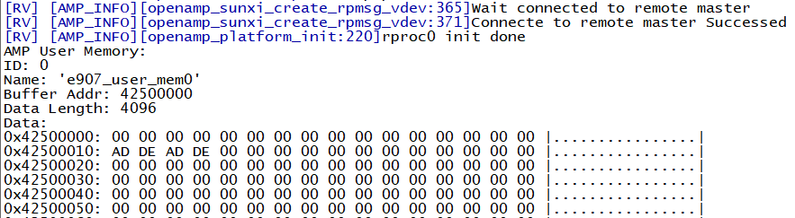

RTOS 端API：

```c
typedef struct amp_user_memory
{
   uint32_t id;
   const char *name;
   uint32_t len;
   void *addr;
} amp_user_memory_t;
int get_amp_user_memory(uint32_t id, amp_user_memory_t *user_mem);
void show_amp_user_memory(uint32_t id);
void show_all_amp_user_memory(void);
API使用方法：
1、调用get_amp_user_memory获取AMP user memory；
2、拿到amp_user_memory_t的addr成员，即为保留内存的起始地址。
```

注意：

1. RTOS 端配置CONFIG_AMP_USER_MEMORY_DT_NODE_NAME_PREFIX 的值需要和Linux 端保留内存的节点名去掉id 后相同，目前此配

置的值默认为e907_user_mem。

2. 若使用多个AMP user memory，建议这些AMP user memory 的内存区域相邻(上面的dts 配置就是相邻的)，以节省RISC-V 的PMP 配置

数目。

3. 在主核Linux 环境重启从核后，AMP user memory 里的数据仍会保留，并不会清空，若需要清空，可在从核RTOS 环境里自己调用API 清

空。

### 20.2 如何增加rv内存

请查阅“专用内存区域”章节，修改设备树中的预留内存，并调整从核的链接器脚本文件。

### 20.3 释放rpmsg端点有哪些方式

释放rpmsg 端点有三种方式，用户可以通过对/dev/rpmsg_ctrl-xxx 设备文件进行操作ioctl 操作来释放端点：

- RPMSG_DESTROY_EPT_IOCTL：释放端点group 中的一个端点

- RPMSG_REST_EPT_GRP_IOCTL：释放端点group 中的所有端点，保留端点group

- RPMSG_DESTROY_ALL_EPT_IOCTL：释放所有的端点，删除端点group

用户在设计app 时，应考虑app 异常处理逻辑，在app 异常时通过ioctl 释放端点。如果app 异常退出没有释放端点，下次分配端点时，在端点分组还有可用端点的情况下，会继续从端点分组中分配新的端点来进行rpmsg 通信，但异常前分配的端点并不会释放。此时内核有类似如下的异常打印：

<!-- PDF page 110 -->

rpmsg_eptdev_official_cb:1490callbackssuppressed

```text
[
  634.408391] rpmsg rpmsg1: rx queue is full.
[
  634.419966] rpmsg rpmsg2: rx queue is full.
[
  634.424742] rpmsg rpmsg3: rx queue is full.
异常打印解读：有三个端点并没有正常释放，并且每个没有释放的端点的接收队列都满了。
为避免这种情况，app
                   在异常后重启的第一时间，需使用
                    RPMSG_REST_EPT_GRP_IOCTL
                    来释放异常前分配的端点。当使用
```

RPMSG_REST_EPT_GRP_IOCTL 释放异常前分配的端点时，内核会有类似如下的打印：

```text
[ 5338.270562] virtio_rpmsg_bus virtio0: destroying channel sunxi,rpmsg_client addr 0x405
                    说明：释放rpmsg3端点
[ 5338.298587] virtio_rpmsg_bus virtio0: destroying channel sunxi,rpmsg_client addr 0x404
                    说明：释放rpmsg2端点
[ 5338.315583] virtio_rpmsg_bus virtio0: destroying channel sunxi,rpmsg_client addr 0x403
                    说明：释放rpmsg1端点
```

### 20.4 uboot启动从核时的处理逻辑是怎样的

时，首先是要依赖bootcmd=runboot_riscv 以及boot_riscv=bootrv$&#123;rv_fw_load_addr&#125;$&#123;rv_fw_load_size&#125;0riscv0ris

cv0-r 这两个boot 命令，当执行bootrv 命令时，则会先将riscv0 分区中的从核固件加载到装载内存中（装载内存是一段临时缓存ELF 固件的内存，并不是从核的运行内存），装载内存地址为$&#123;rv_fw_load_addr&#125;。然后会调用sunxi_riscv_init 来初始化从核，sunxi_riscv_init 中的处理流程如下：

1. 从加载了riscv0 分区的装载内存中，获取从核的运行内存地址

2. load_elf_fw 接口会把ELF 固件从装载内存中，拷贝到运行内存

3. 通过remoteproc 框架的rproc_load 接口调用到全志自定义的sunxi_rproc_load 接口。这个接口会根据是否在设备树中定义了auto_boot

来决定是否处理资源。如果定义了auto_boot，则会在uboot 阶段查找资源表（ELF 中的.resource_table 段）并对其进行处理

4. 通过remoteproc 框架的rproc_start 接口调用到全志自定义的sunxi_rproc_start 接口

5. 最后则配置从核的时钟和复位，把从核固件的运行地址写到RISCV_STA_ADD_REG 中，此时，从核就可以运行，但此时还不能进行rpmsg 异

核通信。从核运行起来后，会阻塞等待主核更新资源表。

### 20.5 uboot启动从核之后，kernel阶段的从核镜像怎么来的

```text
当从核提前被uboot 启动后，内核驱动中
remteproc 的平台资源和平台驱动适配时，
           sunxi_rproc_probe 接口被调用，在
                 sunxi_rproc_probe
中会通过判断从核的时钟是否已经被
                    uboot
                    打开，如果时钟打开，则说明从核已经被提前启动，此时内核驱动会将从核状态标记为
```

RPROC_DETACHED，表明此时从核等待被主核attach。

```text
接着，sunxi_rproc_probe
                    接口调用
                    rproc_add
                    接口向
                    remoteproc
                    核心层注册
                    remoteproc
                    设备（远端处理器），rproc_add
                    最终
```

会调用到rproc_boot 接口来启动远程处理器，rproc_boot 接口调用rproc_attach 后，主核附加到远程处理器，附加后从核状态标记为RPROC_ATTACHED，rproc_attach 则会通过rproc_prepare_device 来执行启动远程处理器所需的所有操作，其中一个操作就是要把从核固件加载到内存（sunxi_request_firmware）。由于uboot 已经启动从核，因此在内存中有一份从核固件的，所以可以直接使用这份内存中的从核固件，所以在这种场景下，内核会打印提示：“load fw from memory”

### 20.6 从kernel直接启动从核的流程是怎样的

内核直接启动从核时，不会走DETACHED 转ATTACHED 的流程，在sunxi_request_firmware 接口中，优先从riscv0 分区中加载从核固件，如果riscv0 中没有则会在riscv0-r 分区中加载从核固件。如果能从分区中加载固件，则内核会打印提示：“load fw from partition riscv0” 或

```text
mpartitionriscv0-r”
都不能从分区中加载固件，则会从
    /lib/firmware/ 中加载从核固件，加载成功时有类似打印提示：
```

ilesystem,filename:amp_rv0.bin”

### 20.7 /lib/firmware 目录下的RV 镜像是否还使用，是否可以删除

不建议删除。正常启动过程中，当riscv0 分区以及riscv0-r 分区分区镜像不可用时，系统会使用/lib/firmware 下的固件。从核panic 时，主核recover 从核时，需要读取/lib/firmware 下的固件文件，以及在主核linux 命令行对从核进行stop&start 操作时，也是需要读取/lib/firmware下的固件文件。这里的“读取” 只是把固件文件读取到内存中。如果用户的存储空间确实有限，可以在将/lib/firmware 的固件文件内容清空后，往固件文件中写入多于1 个字节的任意数据，即保留一个相同文件名且占用空间不多的非空文件，这种应用场景下，分区下的固件一定要是完好无损的，否则系统快启启动从核会失败，stop&start 也会失败。“将/lib/firmware 的固件文件替换成非空且同名的文件” 的操作，不会影响attached 以及stop&start 流程，因为这两个流程会通过rproc_prepare_device –sunxi_rproc_prepare – sunxi_request_firmware 这个调用过程选择从优先内存、分区中加载固件。如果用户的存储空间充裕，建议保留/lib/firmware 下的从核固件，这样即使分区中的固件出现损坏，还有

<!-- PDF page 111 -->

### 20.8 OTA 从核时该如何操作

riscv0 分区、riscv0-r 分区、/lib/firmware 下的从核固件，这三者都是同一个固件，加载顺序是优先加载riscv0 分区中的从核固件，其次是riscv0-r 分区中的从核固件，最后是/lib/firmware 目录下的从核固件。目前，全志方案是只烧录了riscv0 分区下从核固件以及打包从核固件到/lib/firmware 文件目录。用户OTA 时，也同时更新riscv0 分区以及/lib/firmware 下的从核固件即可。

用户调试过程更新固件可以参考“固件更新”章节。

<!-- PDF page 112 -->

本文档及内容受著作权法保护，其著作权由珠海全志科技股份有限公司（“全志”）拥有并保留一切权利。

本文档是全志的原创作品和版权财产，未经全志书面许可，任何单位和个人不得擅自摘抄、复制、修改、发表或传播本文档内容的部分或全部，且不得以任何形式传播。

商标声明

、

、

、

（不完全列举）均为珠海全志科技股

份有限公司的商标或者注册商标。在本文档描述的产品中出现的其它商标，产品名称，和服务名称，均由其各自所有人拥有。

您购买的产品、服务或特性应受您与珠海全志科技股份有限公司（“全志”）之间签署的商业合同和条款的约束。本文档中描述的全部或部分产品、服务或特性可能不在您所购买或使用的范围内。使用前请认真阅读合同条款和相关说明，并严格遵循本文档的使用说明。您将自行承担任何不当使用行为（包括但不限于如超压，超频，超温使用）造成的不利后果，全志概不负责。

本文档作为使用指导仅供参考。由于产品版本升级或其他原因，本文档内容有可能修改，如有变更，恕不另行通知。全志尽全力在本文档中提供准确的信息，但并不确保内容完全没有错误，因使用本文档而发生损害（包括但不限于间接的、偶然的、特殊的损失）或发生侵犯第三方权利事件，全志概不负责。本文档中的所有陈述、信息和建议并不构成任何明示或暗示的保证或承诺。

本文档未以明示或暗示或其他方式授予全志的任何专利或知识产权。在您实施方案或使用产品的过程中，可能需要获得第三方的权利许可。请您自行向第三方权利人获取相关的许可。全志不承担也不代为支付任何关于获取第三方许可的许可费或版税（专利税）。全志不对您所使用的第三方许可技术做出任何保证、赔偿或承担其他义务。
