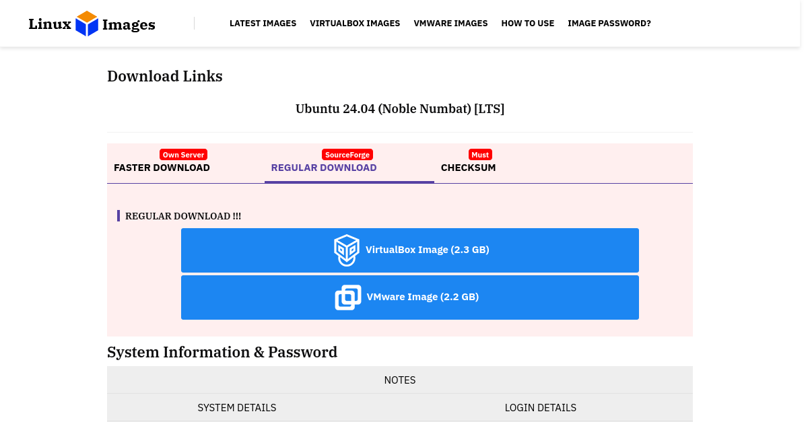

# 安装并配置开发环境

本页只准备编译主机，不开始编译固件。可以使用实体 Ubuntu 主机，也可以在
Windows 或 Linux 电脑中运行 Ubuntu 虚拟机。完成本页后，再进入
[SDK 环境搭建与固件编译](./part3/01-DevelopmentEnvironmentSetup.md)。

## 先选择搭建方式

| 使用场景 | 建议方案 | 特点 |
| --- | --- | --- |
| 有独立 Linux 电脑 | 实体机安装 Ubuntu 24.04 | 编译速度和 USB 稳定性最好 |
| 主机是 Windows，希望快速开始 | VirtualBox 或 VMware 虚拟机 | 无需重装主机，但需配置 USB 直通 |
| 只有 WSL2 | 不作为首选 | USB 烧录、串口和文件系统处理更复杂 |

:::tip 新手建议

如果不熟悉 Linux 安装，可先使用下面的 Ubuntu 24.04 虚拟机。编译过程出现问题时，
也可以用虚拟机快照恢复环境。

:::

## 主机配置要求

| 项目 | 建议配置 |
| --- | --- |
| 系统 | Ubuntu 24.04 LTS x86_64（本文实测环境） |
| CPU | 4 核或以上 |
| 磁盘 | SDK 所在分区至少 100 GB 可用空间 |
| 内存 | 8 GB，推荐 16 GB 以上 |
| 文件系统 | ext4 等 Linux 原生文件系统，不使用 NTFS/FAT 共享目录 |
| USB | 需要直接访问烧录线和 USB 转串口 |

## 方案 A：下载 Ubuntu 24.04 虚拟机

下面的第三方页面提供已安装好的 VirtualBox 和 VMware 镜像，适合快速搭建开发环境：

- [Ubuntu 24.04 VirtualBox / VMware 虚拟机镜像下载](https://www.linuxvmimages.com/images/ubuntu-2404/)
- [Ubuntu 24.04.4 官方 ISO 下载](https://releases.ubuntu.com/noble/)，适合希望自行安装的用户



<small>页面截图仅用于说明下载位置，网站后续可能调整样式和镜像版本。</small>

### 下载前要知道的信息

| 项目 | 下载页标注的内容 |
| --- | --- |
| 镜像类型 | VirtualBox 约 2.3 GB，VMware 约 2.2 GB |
| 默认账户 | 用户名 `ubuntu`，密码 `ubuntu` |
| 默认资源 | 2 vCPU、4 GB 内存、124 GB 虚拟磁盘 |
| 下载选项 | 可选 VirtualBox 或 VMware；建议使用 `REGULAR DOWNLOAD` |

:::warning 第三方预装镜像

这不是 Ubuntu 官方镜像站。下载后应核对页面公布的校验值，首次登录后立即执行
`passwd` 修改默认密码。对供应链有严格要求时，请使用 Ubuntu 官方 ISO 自行安装。

:::

### VirtualBox 导入步骤

1. 安装 VirtualBox，下载并解压 `VirtualBox Image`。
2. 进入解压后的目录，双击 `.vbox` 文件。
3. 在 VirtualBox 中选中新出现的虚拟机，暂时不要启动。
4. 打开 **设置 > 系统**，将 CPU 调整为 4 核，内存调整为 8 GB 或 16 GB。
5. 打开 **设置 > USB**，启用 USB 3.0 控制器，后续再为烧录设备和串口设备添加过滤器。
6. 启动虚拟机，使用 `ubuntu` / `ubuntu` 登录并修改密码。

### VMware 导入步骤

1. 安装 VMware Workstation，下载并解压 `VMware Image`。
2. 在 VMware 中选择 **File > Open**，打开解压后的虚拟机文件。
3. 打开 **Edit virtual machine settings**，将 CPU 调整为 4 核，内存调整为 8 GB 或 16 GB。
4. 启动虚拟机；如果询问虚拟机是移动还是复制而来，选择 **I Copied It**。
5. 使用 `ubuntu` / `ubuntu` 登录，然后执行 `passwd` 修改密码。

### 检查虚拟机磁盘

进入 Ubuntu 后执行：

```bash
lsblk
df -h /
```

SDK 展开和编译后会占用大量空间。如果根分区可用空间不足 100 GB，应先扩容虚拟磁盘和
Ubuntu 文件系统，再下载 SDK。

:::danger 不要把 SDK 放在共享目录

VirtualBox 共享目录和 VMware Shared Folders 只用于临时传输文件。SDK 必须复制到
Ubuntu 虚拟机内部的 ext4 分区中，例如 `$HOME/workspace`。

:::

## 方案 B：准备 Ubuntu 实体机

使用实体机时，从 [Ubuntu 24.04.4 官方页面](https://releases.ubuntu.com/noble/)下载
`64-bit PC (AMD64) desktop image`，制作启动 U 盘后安装。安装前请先备份原电脑数据，并为
Ubuntu 的 ext4 分区预留足够空间。

## 检查 Ubuntu 系统

本文使用 **Ubuntu 24.04.4 LTS x86_64** 完成 OmniGate 配置、编译和打包。建议预留不少于
100 GB 可用磁盘空间；SDK 不要放在 NTFS/FAT 共享目录，也不要使用包含空格和中文的路径。

虚拟机用户也需从这里继续。在 **Ubuntu 终端**执行：

```bash
uname -m
lsb_release -ds
df -h .
```

`uname -m` 应输出 `x86_64`。

本文实测记录如下，补丁版本不同是正常的：

```console
ubuntu@ubuntu2404:~$ uname -m
x86_64
ubuntu@ubuntu2404:~$ lsb_release -ds
Ubuntu 24.04.4 LTS
```

:::warning 路径要求

SDK 路径不要包含空格、中文或 `@`。推荐使用 `$HOME/workspace/T153_Tina5SDK-V1`。虚拟机共享目录
即使能读写，也可能因为符号链接、权限或大小写行为导致编译失败。

:::

## 创建 SDK 工作目录

```bash
mkdir -p "$HOME/workspace"
cd "$HOME/workspace"
pwd
```

正常输出类似：

```console
ubuntu@ubuntu2404:~$ mkdir -p "$HOME/workspace"
ubuntu@ubuntu2404:~$ cd "$HOME/workspace"
ubuntu@ubuntu2404:~/workspace$ pwd
/home/ubuntu/workspace
```

后续 SDK 应解压到这个目录，而不是 `/mnt`、Windows 盘符映射目录或虚拟机共享目录。

## 安装编译依赖

```bash
sudo apt update
sudo apt install -y build-essential gcc-multilib g++-multilib \
  git gawk flex bison gettext texinfo libncurses5-dev libncursesw5-dev \
  libssl-dev python3 python-is-python3 rsync unzip zlib1g-dev file bc \
  cpio wget curl patch device-tree-compiler adb
```

如果安装过程最后没有 `E:` 开头的错误，再执行下面的命令逐项验证。命令能输出版本号，才说明
程序已经装好；只看到**软件包已是最新版**还不算完成验证。

安装后做一次基础检查：

```bash
gcc --version
python3 --version
git --version
dtc --version
adb version
```

如果 `apt` 提示某个 `libncurses5-dev` 包不可用，先执行 `apt-cache search libncurses` 查看当前
Ubuntu 版本的兼容包，不要从不明网站下载 `.deb` 强行安装。

## 安装串口工具

```bash
sudo apt install -y picocom
```

连接 USB 转串口后查看设备：

```bash
ls -l /dev/ttyUSB* /dev/ttyACM* 2>/dev/null
```

找到实际串口后，以 115200 8N1 打开：

```bash
sudo picocom -b 115200 <SERIAL_DEVICE>
```

`<SERIAL_DEVICE>` 替换为实际节点，例如 `/dev/ttyUSB0`。按 `Ctrl+A`、再按 `Ctrl+X` 退出 picocom。

## 可选：免 sudo 使用串口

```bash
sudo usermod -aG dialout "$USER"
```

注销并重新登录后生效。执行 `groups` 能看到 `dialout`，即可直接运行：

```bash
picocom -b 115200 --flow n /dev/ttyUSB0
```

## 环境准备完成标准

- `uname -m` 为 `x86_64`；
- SDK 所在分区可用空间不少于 100 GB；
- GCC、Python 3、Git、DTC 和 ADB 都能输出版本；
- 插入 USB 转串口后能找到新 `/dev/ttyUSB*` 或 `/dev/ttyACM*`；
- 串口按 115200 8N1 打开后没有权限错误。

以上检查全部通过后，继续执行
[SDK 环境搭建与固件编译](./part3/01-DevelopmentEnvironmentSetup.md)。
