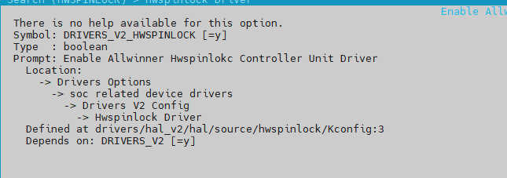
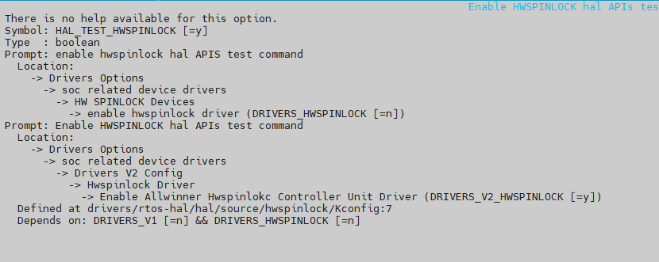
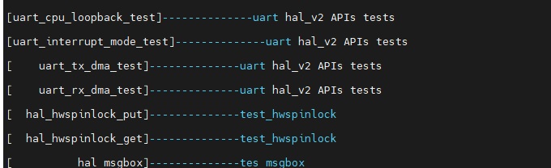
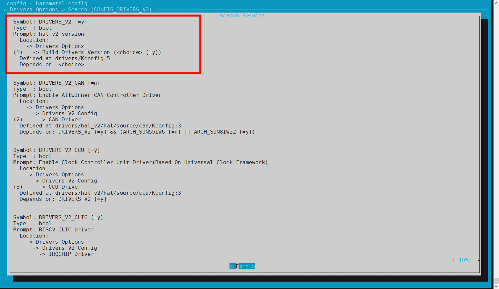
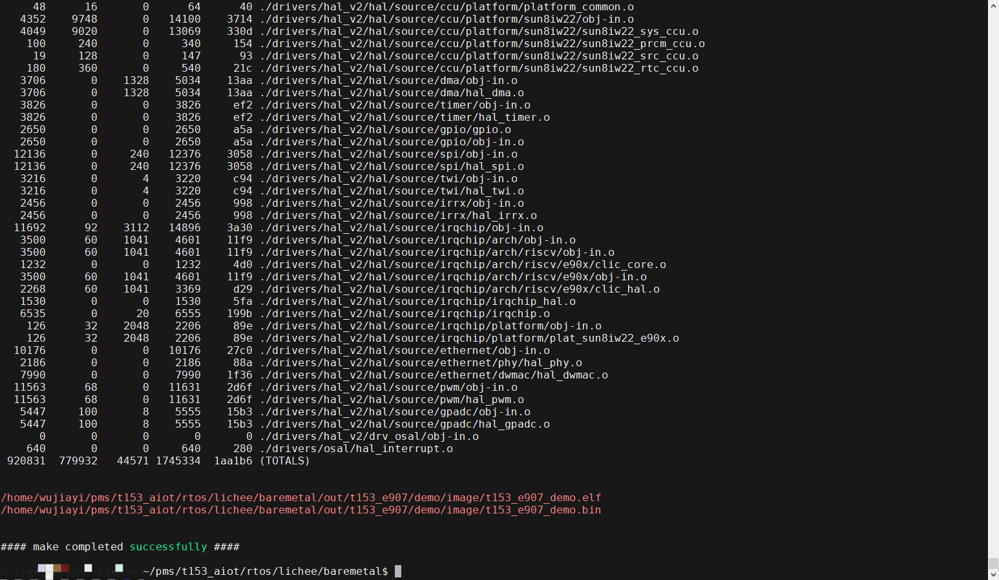

# 总览

:::info 文档说明

- **原始页数：** 14 页
- **原始文件：** [查看或下载 PDF](/pdfs/T153MX/01-overall.pdf)

正文按原始 PDF 的文本层、书签层级和页面顺序转换，仅移除重复页眉、页脚与水印，不改写技术内容。

:::

<!-- PDF page 4 -->

## 1 前言

### 1.1 文档简介

介绍HAL_V2 中设计逻辑、目录、使用方法，为开发者提供参考。

### 1.2 目标读者

HAL_V2 驱动的开发/维护人员。

### 1.3 适用范围

表1-1: 适用产品列表

| 产品名称 | 支持架构 | 内核版本 | 驱动文件 |
| --- | --- | --- | --- |
| T536 | A55、E907 | FreeRTOS/Baremetal | &#123;SDK&#125;/rtos/lichee/hal_v2 |
| T153 | A7、E907 | FreeRTOS/Baremetal | &#123;SDK&#125;/rtos/lichee/hal_v2 |

### 1.4 文档约定

#### 1.4.1 标志说明

! 注意

- 提醒操作中应注意的事项。不当的操作可能会损坏器件，影响可靠性、降低性能等。

说明

为准确理解文中指令、正确实施操作而提供的补充或强调信息。

<!-- PDF page 5 -->

技巧

一些容易忽视的小功能、技巧。了解这些功能或技巧能帮助解决特定问题或者节省操作时间。

### 1.5 相关术语介绍

#### 1.5.1 硬件术语

表1-2: 硬件术语

| 术语 | 解释说明 |
| --- | --- |
| Baremetal | 指裸机环境 |
| HAL_V2 | 指基于rtos 或者baremetal 系统上设计类MCU 用法的bsp 驱动 |

#### 1.5.2 软件术语

表1-3: 软件术语

术语解释说明

HAL Hardware Abstraction Layer，硬件抽象层

<!-- PDF page 6 -->

## 2 HAL_V2库介绍

### 2.1 源码结构

HAL_V2 源码已经集成到Tina5.0 SDK 中，源码位于&#123;SDK&#125;/rtos/lichee/hal_v2 目录中，以下是HAL_V2 源码结构。

```text
.
├──drv_osal
                -- 面向rtos场景
│   ├──examples
                  -- 结合特定rtos场景的驱动使用例子
│   ├──Makefile
│   └──source
                 -- 部分驱动耦合rtos API组合，适用于rtos场景API
├──hal
              -- 底层驱动
│   ├──examples
                  -- 基于bsp驱动测试用例
│   ├──Makefile
│   └──source
                 -- 全部bsp驱动，可用于baremetal和rtos环境构建
├──include
│   ├──hal
               -- bsp驱动头文件
│   └──osal
                -- 用于屏蔽上层rtos类型统一接口
└──Makefile
```

### 2.2 宏配置介绍

#### 2.2.1 驱动版本宏定义

| 驱动版本宏定义 | 解释说明 |
| --- | --- |
| CONFIG_DRIVERS_V2 | 代表hal_v2 驱动 |

CONFIG_DRIVERS_V2_* 代表hal_v2 各个模块驱动; 例如CONFIG_DRIVERS_V2_CCU、

CONFIG_DRIVERS_V2_UART等等

#### 2.2.2 SOC宏定义

<!-- PDF page 7 -->

| SOC 宏定义 | 解释说明 |
| --- | --- |
| CONFIG_ARCH_SUN8IW22 | T153 |
| CONFIG_ARCH_SUN55IW6 | T536 |

#### 2.2.3 架构宏定义

| 一级架构定义 | 二级架构定义 | 解释说明 |
| --- | --- | --- |
| CONFIG_ARCH_ARM/ | 代表32bitARM |  |
| CONFIG_ARCH_ARM64 | / | 代表64bit ARM |
| CONFIG_ARCH_RISCV | CONFIG_ARCH_RISCV_RV32 | 代表32bit RV |
| CONFIG_ARCH_RISCV | CONFIG_ARCH_RISCV_RV64 | 代表64bit RV |
| CONFIG_ARCH_XTENSA | CONFIG_ARCH_XTENSA_HIFI4 | 代表hifi4; |
| CONFIG_ARCH_XTENSA | CONFIG_ARCH_XTENSA_HIFI5 | 代表hifi5; |
| CONFIG_DSP0 | / | dsp0 使用CONFIG_DSP0 |
| CONFIG_DSP1 | / | dsp1 使用CONFIG_DSP1 |

#### 2.2.4 系统区分宏定义

| 系统区分宏定义 | 解释说明 |
| --- | --- |
| CONFIG_KERNEL_FREERTOS | 代表FreeRTOS 系统 |
| CONFIG_KERNEL_BAREMETAL | 代表裸机系统 |
| CONFIG_KERNEL_RTT | 代表RTT 系统 |
| CONFIG_OS_MELIS | 代表Melis 系统 |

### 2.3 HAL_V2开发指南

本章用于介绍HAL_V2 驱动接口的头文件、测试用例相关路径及说明。

<!-- PDF page 8 -->

#### 2.3.1 HAL_V2驱动头文件介绍

驱动头文件位于$&#123;SKD&#125;/lichee/hal_v2/include/hal/目录下，现在SDK 中有如下驱动的头文件。

```text
.
├──aw_common.h
├──aw_list.h
├──hal_can.h
├──hal_clk.h
├──hal_dma.h
├──hal_ethernet.h
├──hal_gpadc.h
├──hal_gpio.h
├──hal_hwspinlock.h
├──hal_irqchip.h
├──hal_irrx.h
├──hal_irtx.h
├──hal_lbc.h
├──hal_lradc.h
├──hal_msgbox.h
├──hal_pwmcs.h
├──hal_pwm.h
├──hal_reset.h
├──hal_rtc.h
├──hal_spi.h
├──hal_sunxi_timer.h
├──hal_twi.h
├──hal_uart.h
├──hal_watchdog.h
└──sunxi_hal_common.h
```

w_common.h_hal_common.h 比较特殊，是一些通用的接口。

如果需要增加驱动，可以在这个$&#123;SKD&#125;/lichee/hal_v2/include/hal/目录下增加驱动头文件，再在$&#123;SKD&#125;/lichee/hal_v2/hal/source/目录下增加相应的驱动。

#### 2.3.2 测试用例说明

HAL_V2 的SDK 提供了各个驱动的测试用例，使用者可以结合测试用例来快速理解HAL_V2 的各个驱动。example 的目录结构如下。

```text
.
├──can
├──ccu
├──dma
├──ethernet
├──gpadc
├──gpio
├──hwspinlock
├──irq
├──irrx
├──irtx
├──lbc
├──lradc
```

<!-- PDF page 9 -->

```text
├──Makefile
├──msgbox
├──pwm
├──pwmcs
├──rtc
├──spi
├──timer
├──twi
├──uart
└──watchdog
```

如果需要使用某一个驱动的例子，需要打开对应的宏，这里以Hwspinlock 的驱动作为例子。目录结构如下。

```text
.
├──hwspinlock_block_test.c
├──hwspinlock_noblock_test.c
├──hwspinlock_timeout_test.c
└──Makefile
```

首先，打开对应的驱动。



*图2-1: 打开Hwspinlock 驱动*

然后，打开example 目录下对应的宏。



*图2-2: 打开Hwspinlock 驱动测试例子*

<!-- PDF page 10 -->

重新编译RV，然后启动RV，输入help 就可以看到hwspinlock_noblock_test.c 例子里面添加的



*图2-3:Help命令*

通过这个命令，可以测试各个驱动，以及可以参考这些例子，使用驱动做相应的应用开发。

### 2.4 源码构建

#### 2.4.1 RTOS

1、进入&#123;SDK&#125;/rtos 目录，执行source envsetup.sh 命令

```text
root:~/pms/t153_aiot/rtos/lichee/baremetal$cd..
root:~/pms/t153_aiot/rtos/lichee$ cd ..
root:~/pms/t153_aiot/rtos$ ls
board envsetup.sh lichee tools
root:~/pms/t153_aiot/rtos$ source envsetup.sh
Setup env done!
Run lunch_rtos to select project
```

然后执行lunch_rtos，选择对应方案，这里以T153 为例子

```text
root:~/pms/t153_aiot/rtos$ lunch_rtos
last=t153_e907_demo
```

You're building on Linux

Lunch menu... pick a combo:

```text
1. ai985_e906_scanp_fastboot
2. mr153_e907_evb1
3. mr527_e906_evb
4. mr536_e907_evb1
5. t153_bga_demo
6. t153_demo
7. t153_demo_smp
8. t153_e907_bga_demo
9. t153_e907_demo
10. t536_demo
11. t536_demo_smp
```

<!-- PDF page 11 -->

12. t536_e907_demo

```text
Which would you like? [Default t153_e907_demo]: 9
select=9...
t153_e907/demo
'/home/wujiayi/pms/t153_aiot/rtos/lichee/rtos/projects/t153_e907/demo/defconfig' -> '/home/wujiayi/pms/t153_aiot/
    rtos/lichee/rtos/.config'
============================================
RTOS_BUILD_TOP=/home/wujiayi/pms/t153_aiot/rtos
RTOS_TARGET_ARCH=riscv
RTOS_TARGET_CHIP=sun8iw22p1
RTOS_TARGET_DEVICE=t153_e907
RTOS_PROJECT_NAME=t153_e907_demo
============================================
Run mrtos_menuconfig to config rtos
Run m or mrtos to build rtos
```

行mrtos_menuconfig ，勾选CONFIG_DRIVERS_V2 ，使能HAL_V2 源码编译；SDK 配套方

案已经默认勾选好，客户可使用。

3、执行mrtos 进行编译。

说明

RTOS 详细构建逻辑，参考《FreeRTOS_RTOS_ 系统_ 开发指南.pdf》、《FreeRTOS_RTOS_ 系统调试_ 使用指南.pdf》文档

#### 2.4.2 Baremetal

1、进入&#123;SDK&#125;/rtos/lichee/baremetal 目录，执行./build.sh config 命令，选择对应方案，这里以

为例子

```text
~/pms/t153_aiot/rtos/lichee/baremetal$ ./build.sh config
Welcome to mkscript setup progress
All available bare_project:
 0. mr153_e907
 1. t153
 2. t153_e907
 3. t536
 4. t536_e907
Choice [t153_e907]:2
All available bare_board:
 0. bga_demo
 1. demo
 2. sram_lp
Choice [demo]:1
```

2、然后打开menuconfig，勾选CONFIG_DRIVERS_V2 ，使能HAL_V2 源码编译；SDK 配套方案

已经默认勾选好，客户可使用。

<!-- PDF page 12 -->



*图2-4: menuconfig 界面*

3、然后执行./build.sh 命令进行编译



*图2-5: 固件编译*

<!-- PDF page 13 -->

## 3 FAQ

无

<!-- PDF page 14 -->

权声明

本文档及内容受著作权法保护，其著作权由珠海全志科技股份有限公司（“全志”）拥有并保留一切权利。

本文档是全志的原创作品和版权财产，未经全志书面许可，任何单位和个人不得擅自摘抄、复制、修改、发表或传播本文档内容的部分或全部，且不得以任何形式传播。

商标声明

、

、

、

（不完全列

举）均为珠海全志科技股份有限公司的商标或者注册商标。在本文档描述的产品中出现的其它商标，产品名称，和服务名称，均由其各自所有人拥有。

免责声明

您购买的产品、服务或特性应受您与珠海全志科技股份有限公司（“全志”）之间签署的商业合同和条款的约束。本文档中描述的全部或部分产品、服务或特性可能不在您所购买或使用的范围内。使用前请认真阅读合同条款和相关说明，并严格遵循本文档的使用说明。您将自行承担任何不当使用行为（包括但不限于如超压，超频，超温使用）造成的不利后果，全志概不负责。

本文档作为使用指导仅供参考。由于产品版本升级或其他原因，本文档内容有可能修改，如有变

恕不另行通知。全志尽全力在本文档中提供准确的信息，但并不确保内容完全没有错误，因

使用本文档而发生损害（包括但不限于间接的、偶然的、特殊的损失）或发生侵犯第三方权利事件，全志概不负责。本文档中的所有陈述、信息和建议并不构成任何明示或暗示的保证或承诺。

本文档未以明示或暗示或其他方式授予全志的任何专利或知识产权。在您实施方案或使用产品的过程中，可能需要获得第三方的权利许可。请您自行向第三方权利人获取相关的许可。全志不承担也不代为支付任何关于获取第三方许可的许可费或版税（专利税）。全志不对您所使用的第三方许可技术做出任何保证、赔偿或承担其他义务。
