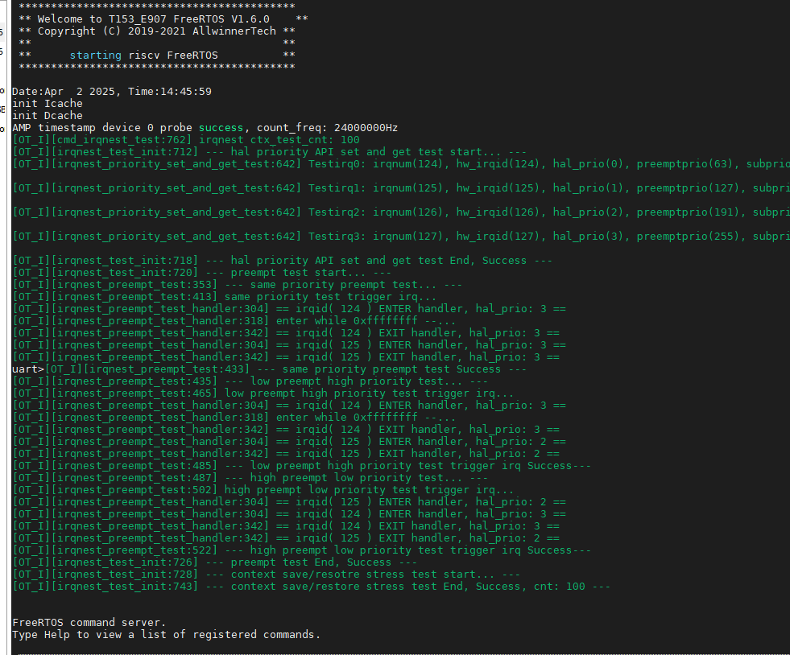

# 中断控制器

:::info 文档说明

- **原始页数：** 13 页
- **原始文件：** [查看或下载 PDF](/pdfs/T153MX/03-interrupt-controller.pdf)

正文按原始 PDF 的文本层、书签层级和页面顺序转换，仅移除重复页眉、页脚与水印，不改写技术内容。

:::

<!-- PDF page 4 -->

## 1 前言

### 1.1 文档简介

介绍Hal_v2 裸机和rtos 环境的中断控制器驱动，帮助使用者快速掌握中断API 接口。

### 1.2 目标读者

基于hal_v2 开发的驱动设计者，使用者，调用对应的中断控制器接口。

### 1.3 适用范围

| 适用平台 | 中断控制器版本 |
| --- | --- |
| T536-A55 | GIC-V3 |
| T153-A7 | GIC-V2 |
| T536-RISCV-E907 | CLIC |
| T153-RISCV-E907 | CLIC |

### 1.4 相关术语介绍

#### 1.4.1 硬件术语

| 术语 | 解释 |
| --- | --- |
| gic | arm 架构的中断控制器 |
| clic | riscv 架构的中断控制器 |

<!-- PDF page 5 -->

## 2 模块介绍

### 2.1 模块功能介绍

中断控制器是用于管理中断的核心组件，负责接收、优先级排序和分发中断信号到CPU 核心，具体功能包括:

- 中断聚合：集中管理所有硬件中断源（如外设、定时器、IPI 等）。

- 优先级仲裁：根据配置的优先级决定中断处理的顺序。

- 中断分发：将中断路由到指定的CPU 核心（支持多核负载均衡）。

- 虚拟化支持：为虚拟机提供虚拟中断（如GICv2/GICv3 的虚拟化扩展）。

#### 2.1.1 GIC中断控制器的主要组件

##### 2.1.1.1 分发器（Distributor）

- 全局中断管理：

- 启用/禁用中断（全局或单个中断）。

- 配置中断触发方式（电平触发、边沿触发）。

- 设置中断优先级和目标CPU 核心。

- 优先级仲裁：比较多个中断的优先级，选择最高优先级的中断发送到CPU 接口。

##### 2.1.1.2 重分发器（Redistributor)

- 每核心私有中断管理：处理Private Peripheral Interrupts (PPIs) 和Software-Generated

Interrupts (SGIs)，这些中断仅与特定CPU 核心相关。

- CPU 接口连接：与CPU Interface 交互，向CPU 核心传递最高优先级的中断。

- 电源管理：

- 跟踪CPU 核心的睡眠状态（GICR_WAKER.ProcessorSleep）。

- 在中断到来时唤醒CPU 核心13。

<!-- PDF page 6 -->

##### 2.1.1.3 CPU 接口（CPU Interface）

- CPU 核心交互：

- 接收来自分发器的中断请求，通知CPU 核心处理。

- 支持中断抢占（高优先级中断可打断低优先级中断）。

- 提供中断确认（ACK）和结束（EOI）机制。

GICV2 和GICV3 的差异主要是CPU_INTERFACE 访问的差异

- GICV2 是内存映射访问。

- GICV3 是系统寄存器直接访问。

#### 2.1.2 CLIC中断控制器的主要组件

CLIC 主要用于管理以下类型的中断：

- 本地中断（Local Interrupts）：

- 软件中断（Software Interrupt, SSI）：用于核间通信（IPI）。

- 定时器中断（Timer Interrupt, STI）：由机器模式定时器（MTIME）触发23。

- 外部中断（External Interrupts）：

- 通过CLIC 管理的外部中断，支持优先级仲裁和向量化处理。

#### 2.1.3 CLIC主要功能配置：

##### 2.1.3.1 中断优先级动态配置

- 每个中断可独立配置优先级（clicintctl[i]），支持运行时调整。

- 优先级数值越大，优先级越高，允许高优先级中断抢占低优先级中断68。

##### 2.1.3.2 中断向量化处理

- 支持向量中断模式，硬件自动跳转到中断服务程序（ISR）入口，减少软件开销37。

- 非向量模式下，所有中断跳转到统一入口，需软件判断中断源7。

##### 2.1.3.3 中断嵌套（Preemption）

- 支持高优先级中断抢占低优先级中断，实现中断嵌套。

- 需配置cliccfg 寄存器使能抢占功能68。

<!-- PDF page 7 -->

##### 2.1.3.4 中断触发方式可配置

- 通过clicintattr[i] 寄存器设置：

- 上升沿触发（Rising Edge）

- 下降沿触发（Falling Edge）

- 电平触发（Level-sensitive）

#### 2.1.4 模块配置说明

rtos 环境在sdk 根目录执行./build.sh rtos menuconfig

架构需打开配置RS_V2_IRQCHIP

arm 架构需打开配置DRIVERS_V2_INTC

baremetal 环境在&#123;sdk&#125;/rtos/lichee/batemetal, ./build.sh config;./build.sh menuconfig

riscv 架构打开配置DRIVERS_V2_IRQCHIP

arm 架构打开配置DRIVERS_V2_INTC

### 2.2 源码层级

中断控制器源码分为两个部分：

- 中断控制器架构相关源码：

- riscv 架构rtos 环境：&#123;sdk&#125;/rtos/lichee/rtos/arch/risc-v/e90x

- riscv 架构baremetal 环境：&#123;sdk&#125;/baremetal/arch/riscv/e907

- a7 架构rtos 环境：&#123;sdk&#125;/rtos/lichee/rtos/arch/arm/armv7a-mp

- a7 架构baremetal 环境：&#123;sdk&#125;/rtos/lichee/baremetal/arch/arm/armv7

- a55 架构rtos 环境：&#123;sdk&#125;/rtos/lichee/rtos/arch/arm/armv8a

- a55 架构baremetal 环境：&#123;sdk&#125;/rtos/lichee/baremetal/arch/arm64/armv8a

断控制器管理及对外接口源码：

- riscv 架构：&#123;sdk&#125;/rtos/lichee/hal_v2/hal/source/irqchip

- arm 架构：&#123;sdk&#125;/rtos/lichee/hal_v2/hal/source/intc

- 中断接口调用例子

- &#123;sdk&#125;/rtos/lichee/hal_v2/hal/examples/normal_single_irq_trigger

- &#123;sdk&#125;&#125;/rtos/lichee/hal_v2/hal/examples/irq/high_priority_irq_preemption

<!-- PDF page 8 -->

## 3 模块接口说明

中断注册和配置接口，统一使用以下接口，可以参考工程例子

### 3.0.1 hal_v2_intc_irq_config

- 原型：hal_v2_intc_irq_config（hal_irq_init_t*irq_initstruct）

- 功能：配置中断使能关闭，中断回调优先级等属性

- 参数：

- irq_initstruct：中断配置信息

- 返回值：

- 0 代表成功

- 负数代表失败

```text
//from {sdk}/rtos/lichee/hal_v2/hal/examples/irq/normal_single_irq_trigger/normal_single_irq_trigger.c
irq_initstruct.irqn = SOFT_IRQ_NUM;
irq_initstruct.preemptionpriority = HAL_IRQ_PRIO_HIGH;
irq_initstruct.subpriority = HAL_IRQ_PRIO_HIGH;
tstruct.cmd=HAL_INIT_CMD_ENABLE;
irq_initstruct.isr_info.func = soft_trigger_handler;
irq_initstruct.isr_info.parg = NULL;
hal_v2_intc_irq_config(&irq_initstruct);
```

关键数据结构

```text
typedef struct hal_irq_init
{
 uint32_t irqn;
 uint32_t preemptionpriority;
 uint32_t subpriority;
 hal_init_cmd_t cmd;
 struct hal_isr_info isr_info;
}hal_irq_init_t;
```

- irqn：中断号，由各驱动自己管理，从spec 上面获取。

- preemptionpriority：抢占优先级，目前裸机平台arm 架构配置了16 级的抢占优先级，需要注

意rv 架构优先级配置越小越低，arm 架构则相反，可以使用

以下的枚举配置，参考例子&#123;sdk&#125;/rtos/lichee/baremetal/drivers/hal_v2/hal/examples/irq/high_priority_irq_preemption

“‘ //arm 的优先级配置枚举

<!-- PDF page 9 -->

typedef enum &#123; HAL_IRQ_PRIO_HIGH = 0, HAL_IRQ_PRIO_MIDDLE = 8, HAL_IRQ_PRIO_LOW =

```text
HAL_IRQ_PRIO_MAX,
HAL_IRQ_PRIO_BASE = HAL_IRQ_PRIO_HIGH,
```

&#125; hal_irq_prio_t;

//riscv 的优先级配置枚举typedef enum &#123; HAL_IRQ_PRIO_LOW = 0, HAL_IRQ_PRIO_MIDDLE,HAL_IRQ_PRIO_HIGH, HAL_IRQ_PRIO_TOP,

```text
HAL_IRQ_PRIO_MAX,
HAL_IRQ_PRIO_BASE = HAL_IRQ_PRIO_LOW,
```

&#125; hal_irq_prio_t; “‘

- subpriority：子优先级别，较少使用默认都配置成HAL_IRQ_PRIO_LOW。

- cmd：中断配置命令，使能和关闭中断，使用以下枚举配置

“‘ typedef enum &#123; HAL_INIT_CMD_DISABLE = 0, HAL_INIT_CMD_ENABLE = 1,

```text
HAL_INIT_CMD_MAX,
HAL_INIT_CMD_BASE = HAL_INIT_CMD_ENABLE,
```

&#125; hal_init_cmd_t; “‘

info: 中断回调和参数

其他对外中断接口：

#### 3.0.2 hal_v2_interrupt_set_pending

- 原型：hal_v2_interrupt_set_pending（uint32_t irq）

- 功能：设置对应中断的pending 位。

- 参数：

-irq：中断号

- 返回值：

-0 代表成功-负数代表失败

<!-- PDF page 10 -->

#### 3.0.3 hal_v2_interrupt_clear_pending

- 原型：hal_v2_interrupt_clear_pending（uint32_t irq）

- 功能：清楚中断pending 位

- 参数：

- irq：中断号

- 返回值：

- 0 代表成功

- 负数代表失败

<!-- PDF page 11 -->

## 4 中断嵌套支持情况

- 裸机环境下，riscv 架构和arm 架构皆支持中断嵌套，可以使用sdk 自带例子&#123;sdk&#125;&#125;/rtos/lichee/

hal_v2/hal/examples/irq/high_priority_irq_preemption 验证

- rtos 环境目前仅riscv 架构支持中断嵌套（默认不打开），需要在sdk 根目录，./build,.sh rtos

menuconfig 使能配置

```text
CONFIG_ARCH_RISCV_INTERRUPT_NEST
COMPONENTS_OSTEST_IRQNEST
CONFIG_COMPONENTS_OSTEST=y
CONFIG_COMPONENTS_OSTEST_IRQNEST=y
CONFIG_IRQNEST_TEST_HW_IRQID_START=124
CONFIG_IRQNEST_OSTEST_GENERAL_CTX_CMP=y
CONFIG_IRQNEST_GENERAL_REG_SIZE=4
CONFIG_IRQNEST_GENERAL_REG_CNT=32
CONFIG_IRQNEST_FPU_TEST=y
CONFIG_IRQNEST_FPU_GENERAL_REG_SIZE=8
CONFIG_IRQNEST_FPU_GENERAL_REG_CNT=32
```

- CONFIG_IRQNEST_TEST_HW_IRQID_START 表示要测试的起始中断号，抢占的中断会在这个

断号基础上加1，优先级也对应加1。

测试成功的log 如下

<!-- PDF page 12 -->



*图4-1: 中断嵌套测试例子*

<!-- PDF page 13 -->

权声明

本文档及内容受著作权法保护，其著作权由珠海全志科技股份有限公司（“全志”）拥有并保留一切权利。

本文档是全志的原创作品和版权财产，未经全志书面许可，任何单位和个人不得擅自摘抄、复制、修改、发表或传播本文档内容的部分或全部，且不得以任何形式传播。

商标声明

、

、

、

（不完全列

举）均为珠海全志科技股份有限公司的商标或者注册商标。在本文档描述的产品中出现的其它商标，产品名称，和服务名称，均由其各自所有人拥有。

免责声明

您购买的产品、服务或特性应受您与珠海全志科技股份有限公司（“全志”）之间签署的商业合同和条款的约束。本文档中描述的全部或部分产品、服务或特性可能不在您所购买或使用的范围内。使用前请认真阅读合同条款和相关说明，并严格遵循本文档的使用说明。您将自行承担任何不当使用行为（包括但不限于如超压，超频，超温使用）造成的不利后果，全志概不负责。

本文档作为使用指导仅供参考。由于产品版本升级或其他原因，本文档内容有可能修改，如有变

恕不另行通知。全志尽全力在本文档中提供准确的信息，但并不确保内容完全没有错误，因

使用本文档而发生损害（包括但不限于间接的、偶然的、特殊的损失）或发生侵犯第三方权利事件，全志概不负责。本文档中的所有陈述、信息和建议并不构成任何明示或暗示的保证或承诺。

本文档未以明示或暗示或其他方式授予全志的任何专利或知识产权。在您实施方案或使用产品的过程中，可能需要获得第三方的权利许可。请您自行向第三方权利人获取相关的许可。全志不承担也不代为支付任何关于获取第三方许可的许可费或版税（专利税）。全志不对您所使用的第三方许可技术做出任何保证、赔偿或承担其他义务。
