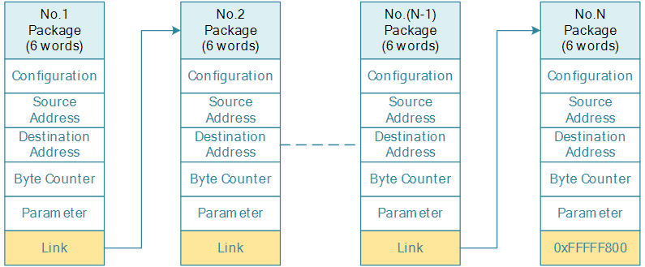

# DMA

:::info 文档说明

- **原始页数：** 25 页
- **原始文件：** [查看或下载 PDF](/pdfs/T153MX/05-dma.pdf)

正文按原始 PDF 的文本层、书签层级和页面顺序转换，仅移除重复页眉、页脚与水印，不改写技术内容。

:::

<!-- PDF page 5 -->

## 1 前言

### 1.1 文档简介

介绍HAL_V2 DMA 驱动的接口及使用方法，为DMA 的使用者提供参考。

### 1.2 目标读者

- DMA 驱动开发人员

- DMA 驱动使用人员

### 1.3 适用范围

表1-1: 适用产品列表

| 产品名称 | 内核版本 | 驱动文件 |
| --- | --- | --- |
| T153 | FreeRTOS/ Baremetal | hal_dma.c |
| T536 | FreeRTOS/ Baremetal | hal_dma.c |

### 1.4 文档约定

#### 1.4.1 标志说明

! 注意

- 提醒操作中应注意的事项。不当的操作可能会损坏器件，影响可靠性、降低性能等。

说明

为准确理解文中指令、正确实施操作而提供的补充或强调信息。

<!-- PDF page 6 -->

技巧

一些容易忽视的小功能、技巧。了解这些功能或技巧能帮助解决特定问题或者节省操作时间。

#### 1.4.2 地址与数据描述方法约定

本文档在描述地址、数据时遵循如下约定：

Table: 地址与数据描述方法约定

符号例子说明

200，0x79 地址或数据以16 进制表示。

0b 0b010，0b00 000 111 数据采用二进制表示(寄存器描述除外)。

X 00X，XX1 数据描述中，X 代表0 或1。

例如，00X代表000或001；XX1代表001，011，101或111。

#### 1.4.3 数值单位约定

本文档在描述数据容量（如NAND 容量）时，单位词头代表的是1024 的倍数；描述频率、数据速

时则代表的是1000倍数。具体如下：

Table: 数值单位约定

类型符号对应数值

数据容量（如NAND 容量）1 K 1024

```text
1 M
      1 048 576
1 G
     1 073 741 824
```

频率，数据速率等1 k 1000

1M1000000

```text
1 G
     1 000 000 000
```

<!-- PDF page 7 -->

### 1.5 相关术语介绍

#### 1.5.1 硬件术语

表1-2: 硬件术语

| 术语 | 解释说明 |
| --- | --- |
| DMA | Direct Memory Access，直接存储器存取 |

#### 1.5.2 软件术语

表1-3: 软件术语

| 术语 | 解释说明 |  |
| --- | --- | --- |
| HAL | Hardware Abstraction Layer，硬件抽象层 |  |
| RTOS | Real Time Operatiing System，实时操作系统 |  |
| O | GeneralPurposeInput/Output | ，通用输入输出 |
| DRQSRC_XXX | 源DRQ 号 |  |
| DRQDST_XXX | 目的DRQ 号 |  |

<!-- PDF page 8 -->

## 2 模块介绍

### 2.1 模块功能

DMA 主要实现设备与设备、设备与memory、memory 与memory 之间的数据搬运与传输。DMA驱动主要实现设备驱动的底层细节，并为上层提供一套标准的API 接口以供使用，DMA 支持链式

驱动源码对应ma.c。链式传输格式说明如下

- 传输一大串数据的时候，需要把数据分成n 块，每一块配置好描述符，组成一个链表。将第一

个块的描述符地址传到描述符寄存器中，就可以开始链式传输了

- 每个描述符长度为6word，包含configuration、source address、destination address、byte

counter、parameter、link。

- configuration：包含DRQ type、传输端地址计数模式、传输block 长度等；

- source address：配置传输的源地址；

- destination address：配置传输的目的地址；

ecounter：配置一个数据包的数据量大小，最大不超过2ˆ25-1byte;

- parameter：配置一些参数，比如timeout 等。

- link：指向下一个描述符地址，当link 等于0xFFFFF800 时，DMAC 会传输完这个包就停止传

输。



*图2-1: DMA 链式传输*

<!-- PDF page 9 -->

### 2.2 模块配置

rtos 环境配置：

执行：lunch_rtos 选择对应Board

baremetal 环境配置：

执行：./build.sh config 选择对应Board

#### 2.2.1 menuconfig 配置说明

metal 环境配置：

执行：./build.sh menuconfig

rtos 环境配置：

执行：mrtos_menuconfig

Drivers Options ---&gt;Drivers V2 Config ---&gt;

DMA Devices ---&gt;

```text
[*] enable dma driver
(16) Maximum number of DMA0 channels
(16) Maximum number of DMA1 channels
(50) Maximum number of dma descriptor pool
[*] enable dma hal APIs test command
```

DMA HAL 代码路径：lichee/hal_v2/hal/source/dma

DMA 测试代码路径：lichee/hal_v2/hal/examples/dma

#### 2.2.2 使用配置说明

在不同的Sunxi 硬件平台中，DMA 设计不同，但平台配置文件的信息基本类似，一般位置为hal_v2/hal/source/dma/platform/dma-xx.h。

如下：

```c
#ifndef __DMA_SUN8IW22_H__
#define __DMA_SUN8IW22_H__
#include <stdint.h>
#include <stdbool.h>
#include <stdio.h>
/*DMA irq number*/
#define DMA0_IRQ_NUM
                    MAKE_IRQn(CONTROLLER_ID, 223)
```

<!-- PDF page 10 -->

```text
#define DMA1_IRQ_NUM
                    MAKE_IRQn(CONTROLLER_ID, 225)
#defineDMAC0_BASE_ADDR0x03001000
#define DMAC1_BASE_ADDR 0x04000000
#define DMAC0_CHANNEL_MAX CONFIG_DMA0_CHANNELS_MAX
#define DMAC1_CHANNEL_MAX CONFIG_DMA1_CHANNELS_MAX
```

\\#define DMAC_BASE_ADDR(id) ((id) &lt; (DMA1) ? \\

(DMAC0_BASE_ADDR) : (DMAC1_BASE_ADDR))

\\#define DMAC_CHANNEL_MAX(id) ((id) &lt; (DMA1) ? \\

(DMAC0_CHANNEL_MAX) : (DMAC1_CHANNEL_MAX))

/*

```text
* The source DRQ type and port corresponding relation
*/
#define DRQSRC_SDRAM
                    0i
eDRQSRC_DRAM1
#define DRQSRC_OWA
                    2
#define DRQSRC_I2S0_RX
                    3
#define DRQSRC_I2S1_RX
                    4
......
```

/*

```text
* The destination DRQ type and port corresponding relation
*/
#define DRQDST_SDRAM
                    0
#define DRQDST_DRAM
                    1
#define DRQDST_OWA
                    2
#define DRQDST_I2S0_TX
                    3
#define DRQDST_I2S1_TX
                    4
......
```

/*__DMA_SUN8IW22_H__*/

其中：

1．DMAC_BASE_ADDR，表示DMAC 基地址。

2．DMA_IRQ_NUM，表示DMAC 中断号。

3．DRQSRC_XXX，表示源DRQ 号。

4．DRQDST_XXX，表示目的DRQ 号。

### 2.3 源码结构

```text
hal/source/dma/
                 # 驱动源码
├──hal_dma.c
                  # dma驱动源码
├──Kconfig
                 # dma驱动的menuconfig配置文件
├──Makefile
                 # dma驱动的makefile文件
├──platform
                 # dma的芯片差异配置头文件
│├──dma-sun55iw6.h
│└──dma-sun8iw22.h
│└──common.h
                    #dma的芯片公共配置文件
```

<!-- PDF page 11 -->

```text
├──platform.h
                    # ndma的芯片差异配置总头文件
  include/hal/
                 # 驱动
APIs声明头文件
```

└──hal_dma.h

```text
hal/examples/dma/
                  # 驱动测试代码
├──dma_clock
                   # 驱动测试时钟配置源文件
│├──dma_clock.c
                    # 驱动测试时钟配置头文件
│└──dma_clock.h
├──dma_mem2mem_all_channels
│└──dma_mem2mem_all_channels_test.c # 所有通道驱动测试代码
├──dma_mem2mem_signle_channel
│└──dma_mem2mem_signle_channel_test.c # 单通道驱动测试代码
├──dma_pause
│└──dma_pause_test.c
                    # 暂停通道驱动测试代码
└──Makefile
                    # dma测试驱动的makefile文件
```

### 2.4 数据结构

dma 传输配置结构体用于在dma 传输的时候填充传输方向、数据类型、传输地址等参数，结构体参数解释如下。

```text
typedef struct
{
 /*value for channel configuration register*/
 uint32_t dst_data_width; //目的数据传输位宽
 uint32_t dst_addr_mode; //目的数据传输模式
 uint32_t dst_block_size; //目的数据传输dma触发最小单元
 uint32_t dst_drq_type; //目的drq号
 uint32_t src_data_width; //源数据传输位宽
 uint32_t src_addr_mode; //源数据传输模式
 uint32_t src_block_size; //源数据传输dma触发最小单元
 uint32_t src_drq_type; //源drq号
 uint32_t desc_src_addr; //源地址
 uint32_t desc_dst_addr; //目的地址
 uint32_t desc_byte_cnt; //数据传输个数
}dma_init_t;
```

<!-- PDF page 12 -->

## 3 模块接口说明

### 3.1 模块接口列表

使用下述模块接口，需包含头文件：

```c
#include <hal_dma.h>
```

| API | 解释说明 |
| --- | --- |
| hal_dma_init | 初始化dma |
| hal_dma_deinit | 释放DMA |
| hal_dma_irq_cfg | 申请dma 中断 |
| hal_dma_clear_irq_flag | 释放dma 中断 |
| hal_dma_is_irq_pending | 判断中断状态 |

hal_dma_flush_dcache_to_memcleancache

| hal_dma_load_dcache_from_mem | invalid cache |
| --- | --- |
| hal_dma_tx_status | 获取DMA 发送状态 |
| hal_dma_start | 开始DMA 传输 |
| hal_dma_pause | 停止DMA 传输 |
| hal_dma_resume | 启动dma 传输 |
| dma_dump_common_regs | 打印通用寄存器信息 |
| dma_dump_channel_regs | 打印通道寄存器信息 |

<!-- PDF page 13 -->

### 3.2 函数功能说明

### 3.3 hal_dma_init

- hal_dma_init(dma_stream *stream, dma_init dma_init_struct)

- 作用：初始化dma

- 参数：

-stream: 存放使用DMA 和使用通道结构体-dma_init_struct：存放dma 配置信息

回：

--1: 初始化失败-0: 初始化成功

### 3.4 hal_dma_deinit

- 原型：void hal_dma_deinit(dma_stream *stream);

- 作用：释放DMA

- 参数：

-stream: 释放使用MA 和使用通道结构体

- 返回：

-void

### 3.5 hal_dma_tx_status

- 原型：dma_transfer_status hal_dma_tx_status(dma_stream *stream);

- 作用：获取DMA 发送状态

数：

-stream: 存放使用DMA 和使用通道结构体

- 返回：

-DMA_TRANSFER_IN_PROGRESS: 失败-DMA_TRANSFER_COMPLETE: 成功

<!-- PDF page 14 -->

### 3.6 hal_dma_start

- 原型：void hal_dma_cmd(dma_stream *stream, dma_state new_state)

- 作用：控制DMA 通道的启动或停止

- 参数：

-stream: 存放使用DMA 和使用通道结构体-new_state:DMA 状态控制参数，（启用dma 停止dma）

- 返回：

-void

### 3.7 hal_dma_irq_cfg

- 原型：void hal_dma_irq_cfg(dma_stream*stream,uint32_t dma_irq,dma_state

new_state);

- 作用：配置DMA 通道的中断设置

- 参数：

-stream: 存放使用DMA 和使用通道结构体-dma_irq: 配置的中断类型（半传输完成中断全传输完成中断队列传输完成中断）-new_state: 中断状态控制参数，（启用中断禁用中断）

回：中断状态控制参数，决定是启用还是禁用中断

-void

### 3.8 hal_dma_clear_irq_flag

- 原型：void hal_dma_clear_irq_flag(dma_stream *stream)

- 作用：清除DMA 通道的中断标志位

- 参数：

-stream: 存放使用MA 和使用通道结构体

- 返回：

-void

### 3.9 hal_dma_is_irq_pending

- 原型：int hal_dma_is_irq_pending(dma_stream *stream)

<!-- PDF page 15 -->

- 作用：检查DMA 通道是否有挂起的中断

数：

-stream: 存放使用DMA 和使用通道结构体

- 返回：

-1: 有pending 的中断-0: 无pending 的中断

### 3.10 hal_dma_flush_dcache_to_mem

型：voidhal_dma_flush_dcache_to_mem(unsignedlongstart,unsignedlonglen)

- 作用：数据从Cache 刷新到内存中

- 参数：

-start: 内存起始地址-len: 数据长度

- 返回：

-void

### 3.11 hal_dma_load_dcache_from_mem

- 原型：void hal_dma_load_dcache_from_mem(unsigned long start, unsigned long len);

- 作用：数据从内存刷到cache

- 参数：

-start: 内存起始地址-len: 数据长度

- 返回：

-void

### 3.12 hal_dma_pause

- 原型：void hal_dma_pause(dma_stream *stream);

- 作用：暂停dma 传输

- 参数：

-stream: 存放使用DMA 和使用通道结构体

- 返回：

-void

<!-- PDF page 16 -->

### 3.13 hal_dma_resume

- 原型：void hal_dma_pause(dma_stream *stream)

- 作用：开启DMA 传输

- 参数：

-stream: 存放使用DMA 和使用通道结构体

- 返回：

-void

### 3.14 dma_dump_channel_regs

- 原型：void dma_dump_channel_regs(dma_stream *stream)

- 作用：打印寄存器状态信息

- 参数：

-stream: 存放使用DMA 和使用通道结构体

- 返回：

-void

<!-- PDF page 17 -->

## 4 开发指南

### 4.1 功能概述

DMA 驱动提供了常用功能：dma 四种传输方式（mem2mem、mem2dev、dev2mem、dev2dev）

### 4.2 开发流程

步骤1 准备数据

```text
memset(buf1, 0xaa, DMA_TEST_LEN);
memset(buf2, 0x0, DMA_TEST_LEN);
hal_dma_flush_dcache_to_mem((unsigned long)buf1, DMA_TEST_LEN);
hal_dma_flush_dcache_to_mem((unsigned long)buf2, DMA_TEST_LEN);
```

步骤2 初始化时钟

需要根据平台配置时钟，具体配置请参考’hal/examples/dma/dma_clock’ 目录下时钟配置

```text
hal_dma_reset_set(dmac)；
hal_dma_clock_gate_set(dmac)；
```

步骤3 初始化dma

需根据使用情况填充dma 描述符相关信息结构体，申请相应DMA 资源，申请了之后需要释放了，别的设备才可以用。

```text
dma_init_t dma_init_struct;
dma_init_struct.dst_data_width = DMA_DEST_DATA_WIDTH_8BIT;
dma_init_struct.dst_addr_mode = DMA_DEST_ADDR_MODE_LINEAR;
dma_init_struct.dst_block_size = DMA_DEST_BLOCK_SIZE_4BYTE;
dma_init_struct.dst_drq_type=DRQDST_SDRAM;
dma_init_struct.src_data_width = DMA_SRC_DATA_WIDTH_8BIT;
dma_init_struct.src_addr_mode = DMA_DEST_ADDR_MODE_LINEAR;
dma_init_struct.src_block_size = DMA_SRC_BLOCK_SIZE_4BYTE;
dma_init_struct.src_drq_type = DRQSRC_SDRAM;
dma_init_struct.desc_src_addr = (unsigned long)buf1;
dma_init_struct.desc_dst_addr = (unsigned long)buf2;
dma_init_struct.desc_byte_cnt = DMA_TEST_LEN;
hal_dma_init(&stream, &dma_init_struct);
```

步骤4 申请中断, 注册dma 回调函数

<!-- PDF page 18 -->

dma 中断触发方式主要有两种：全传输结束起中断，传输完一半起中断。注意的是当数据量比较小的时候，dma 搬运很快的，如果配置了半包起中断，传输到一半的时候可能没有中断起来，传输结束会来中断。

```text
hal_irq_init_t intc_init_struct;
hal_dma_irq_cfg(&stream, DMA_IRQ_QUEUE, ENABLE);
intc_init_struct.irqn = DMA1_IRQ_NUM;
intc_init_struct.preemptionpriority = 0;
intc_init_struct.subpriority = 0;
intc_init_struct.cmd = HAL_INIT_CMD_ENABLE;
intc_init_struct.isr_info.func = dma_irq_handle;
intc_init_struct.isr_info.parg = &stream;
hal_v2_intc_irq_config(&intc_init_struct);
```

步骤5 开始dma 传输

ma_start(&stream,ENABLE);

步骤6 等待dma 传输结束

while(DMA_TRANSFER_COMPLETE != hal_dma_tx_status(&stream));

步骤7 停止dma 传输和释放dma 通道

dma 传输结束，停止dma，释放通道。

hal_dma_deinit(&stream);

步骤8 若是mem2mem 或dev2mem，需要无效cahce

使缓存中的数据为无效，cpu 下次使用该数据时，就会从RAM 中重新载入。

hal_dma_load_dcache_from_mem((unsigned long)buf2, DMA_TEST_LEN);

### 4.3 编程示例

路径：lichee/hal_v2/hal/examples/dma

其中单通道mem to men 测试用例如下

```c
#include <stdio.h>
#include <stdlib.h>
de<string.h>
#include <hal_interrupt.h>
#include "hal_dma.h"
#include "../dma_clock/dma_clock.h"
#ifdef CONFIG_KERNEL_BAREMETAL
#include <include.h>
#else
#include <sunxi_hal_common.h>
#endif
#if defined(CONFIG_KERNEL_FREERTOS)
#include <console.h>
#elif defined(CONFIG_KERNEL_BAREMETAL)
```

<!-- PDF page 19 -->

```c
#include "shell.h"
#endif
/**********************************test********************************************/
//#define TEST_DMA_DEBUG
#define IRQ_EN
#define DMA_TEST_LEN
                    4096
uint8_t buf1[DMA_TEST_LEN];
uint8_t buf2[DMA_TEST_LEN];
#ifdef IRQ_EN
static hal_irqreturn_t dma_irq_handle(void *data)
{
 dma_stream *stream = data;
 printf("irq handle for dma%d_channel%d\n", stream->dmac, stream->channel);
 hal_dma_clear_irq_flag(stream);
rn0;
}
#endif
int dma_clk_init(uint32_t dmac)
{
 int ret;
 ret = hal_dma_reset_set(dmac);
 if (ret)
   return ret;
 ret = hal_dma_clock_gate_set(dmac);
 if (ret)
```

return ret;

```c
return 0;
}
void dma_mem2mem_test()
{
 int i = 0;
 int ret = 0;
 dma_stream stream;
 dma_init_t dma_init_struct;
#ifdef IRQ_EN
 hal_irq_init_t intc_init_struct;
#endif
#ifdef TEST_DMA_DEBUG
 int remainder = 0;
#endif
 memset(buf1, 0xaa, DMA_TEST_LEN);
mset(buf2,0x0,DMA_TEST_LEN);
 hal_dma_flush_dcache_to_mem((unsigned long)buf1, DMA_TEST_LEN);
 hal_dma_flush_dcache_to_mem((unsigned long)buf2, DMA_TEST_LEN);
 stream.dmac
               = DMA1;
 stream.channel
               = DMA1_CHANNEL0;
 /* clk init*/
 ret = dma_clk_init(stream.dmac);
 if (ret)
```

return;

<!-- PDF page 20 -->

```text
/* dma init */
dma_init_struct.dst_data_width = DMA_DEST_DATA_WIDTH_8BIT;
dma_init_struct.dst_addr_mode = DMA_DEST_ADDR_MODE_LINEAR;
dma_init_struct.dst_block_size = DMA_DEST_BLOCK_SIZE_4BYTE;
dma_init_struct.dst_drq_type = DRQDST_SDRAM;
dma_init_struct.src_data_width = DMA_SRC_DATA_WIDTH_8BIT;
dma_init_struct.src_addr_mode = DMA_DEST_ADDR_MODE_LINEAR;
dma_init_struct.src_block_size = DMA_SRC_BLOCK_SIZE_4BYTE;
dma_init_struct.src_drq_type = DRQSRC_SDRAM;
dma_init_struct.desc_src_addr = (unsigned long)buf1;
dma_init_struct.desc_dst_addr = (unsigned long)buf2;
dma_init_struct.desc_byte_cnt = DMA_TEST_LEN;
ret = hal_dma_init(&stream, &dma_init_struct);
if (ret) {
 printf("hal_dma_init failed\n");
 return;
}
```

\\#ifdef IRQ_EN

```text
hal_dma_irq_cfg(&stream, DMA_IRQ_QUEUE, ENABLE);
 intc_init_struct.irqn = DMA1_IRQ_NUM;
 intc_init_struct.preemptionpriority = 0;
 intc_init_struct.subpriority = 0;
 intc_init_struct.cmd = HAL_INIT_CMD_ENABLE;
 intc_init_struct.isr_info.func = dma_irq_handle;
 intc_init_struct.isr_info.parg = &stream;
 hal_v2_intc_irq_config(&intc_init_struct);
#endif
 hal_dma_start(&stream, ENABLE);
 while(DMA_TRANSFER_COMPLETE != hal_dma_tx_status(&stream));
 hal_dma_deinit(&stream);
 hal_dma_load_dcache_from_mem((unsigned long)buf2, DMA_TEST_LEN);
```

\\#ifdef TEST_DMA_DEBUG

```text
printf("src buf:\n");
 for (i = 0; i < DMA_TEST_LEN; i++) {
   remainder = i % 32;
   if (0 == remainder)
    printf("\r\n");
   printf("%02x ", buf1[i]);
 }
 printf("\n\n\n");
 printf("dst buf:\n");
 for (i = 0; i < DMA_TEST_LEN; i++) {
   remainder = i % 32;
   if (0 == remainder)
    printf("\r\n");
   printf("%02x ", buf2[i]);
 }
 printf("\n\n\n");
#endif
 if (memcmp(buf1, buf2, DMA_TEST_LEN) == 0) {
   printf("dma transfer test pass\n");
 } else {
   printf("dma transfer test fail\n");
#ifndef TEST_DMA_DEBUG
   for (i = 0; i < DMA_TEST_LEN; i++) {
    if (buf1[i] != buf2[i]) {
```

<!-- PDF page 21 -->

```text
printf("buf1[%d]:%x != buf2[%d]:%x\n", i, buf1[i], i, buf2[i]);
    } else {
      printf("buf1[%d]:%x == buf2[%d]:%x\n", i, buf1[i], i, buf2[i]);
    }
   }
#endif
 }
}
#if defined(CONFIG_KERNEL_FREERTOS)
FINSH_FUNCTION_EXPORT_CMD(dma_mem2mem_test, dma_signle_channel_test, dma signle channel test);
#elif defined(CONFIG_KERNEL_BAREMETAL)
SHELL_EXPORT_CMD(
SHELL_CMD_PERMISSION(0)|SHELL_CMD_TYPE(SHELL_TYPE_CMD_FUNC)|SHELL_CMD_DISABLE_RETURN,
dma_signle_channel_test, dma_mem2mem_test, test for dma signle channel);
#endif
```

<!-- PDF page 22 -->

## 5 日志分析

### 5.1 调试信息打印寄存器，dma链配置等信息

路径：lichee/hal_v2/include/hal/hal_dma.h

\\#define DMA_DEBUG_EN

上述宏之后，会使用下面函数打印dma 寄存器

```c
void dma_dump_common_regs(dma_stream *stream)
{
 uint32_t dmac_base_addr = DMAC_BASE_ADDR(stream->dmac);
```

printf("Common register:\\n"

```text
"\tDMA_SEC_REG
                    : \t0x%08x\n"
    "\tDMA_AUTO_GATE_REG: \t0x%08x\n"
    "\tDMA_STA_REG
                    : \t0x%08x\n",
    readl(DMA_SEC_REG(dmac_base_addr)),
    readl(DMA_AUTO_GATE_REG(dmac_base_addr)),
    readl(DMA_STA_REG(dmac_base_addr)));
}
```

ma_dump_channel_regs(dma_stream*stream)

```text
{
 uint32_t dmac_base_addr = DMAC_BASE_ADDR(stream->dmac);
 unsigned int chan = stream->channel;
```

printf("Channel%d register:\\n"

```text
"\tDMA_IRQ_EN_REG
                   : \t0x%08x\n"
"\tDMA_IRQ_PEND_REG
                    : \t0x%08x\n"
"\tDMA_EN_REG
               : \t0x%08x\n"
"\tDMA_PAU_REG
                : \t0x%08x\n"
"\tDMA_DESC_ADDR_REG: \t0x%x\n"
"\tDMA_CFG_REG
                : \t0x%08x\n"
"\tDMA_CUR_SRC_REG : \t0x%08x\n"
"\tDMA_CUR_DEST_REG : \t0x%08x\n"
"\tDMA_BCNT_LEFT_REG: \t0x%08x\n"
"\tDMA_PKG_NUM_REG : \t0x%08x\n"
"\tDMA_PARA_REG
                : \t0x%08x\n\n",
chan,
readl(DMA_IRQ_EN_REG(dmac_base_addr, chan)),
readl(DMA_IRQ_PEND_REG(dmac_base_addr, chan)),
readl(DMA_EN_REG(dmac_base_addr, chan)),
readl(DMA_PAU_REG(dmac_base_addr, chan)),
readl(DMA_DESC_ADDR_REG(dmac_base_addr, chan)),
readl(DMA_CFG_REG(dmac_base_addr, chan)),
readl(DMA_CUR_SRC_REG(dmac_base_addr, chan)),
readl(DMA_CUR_DEST_REG(dmac_base_addr, chan)),
readl(DMA_BCNT_LEFT_REG(dmac_base_addr, chan)),
readl(DMA_PKG_NUM_REG(dmac_base_addr, chan)),
```

<!-- PDF page 23 -->

```c
readl(DMA_PARA_REG(dmac_base_addr, chan)));
}
void dma_dump_descs(dma_stream *stream, dma_descriptor *desc, uint32_t desc_num)
{
 int i = 0;
```

for(i = 0; i &lt; desc_num; i++)printf("dma%d_channel%d_descriptor%d:\\n"

```text
"\t\tdesc addr:0x%lx, desc->cfg:0x%08lx, desc->src_addr:0x%08lx, desc->dst_addr:0x%08lx, \n"
      "\t\tdesc->byte_cnt:0x%08lx, desc->parameter:0x%08lx, desc->link:0x%08lx\n",
      stream->dmac, stream->channel, i,
      (unsigned long)&desc[i], (unsigned long)desc[i].cfg, (unsigned long)desc[i].src_addr, (unsigned long)desc[i].
    dst_addr,
      (unsigned long)desc[i].byte_cnt, (unsigned long)desc[i].parameter, (unsigned long)desc[i].link);
}
```

### 5.2 调试工具

配置CONFIG_HAL_TEST_DMA 后，可以使用dma_all_channel_test 、dma_pause_test、dma_signle_channel_test 命令验证DMA 模块是否能正常工作。

rtos 测试log 如下

```text
cpu0>dma_all_channel_test
init dma1_channel0 success
init dma1_channel1 success
init dma1_channel2 success
ma1_channel3success
init dma1_channel4 success
init dma1_channel5 success
init dma1_channel6 success
init dma1_channel7 success
irq handle for dma1_channel0
irq handle for dma1_channel1
irq handle for dma1_channel2
irq handle for dma1_channel3
irq handle for dma1_channel4
irq handle for dma1_channel5
irq handle for dma1_channel6
irq handle for dma1_channel7
dma1_channel0 transfer test pass
dma1_channel1 transfer test pass
dma1_channel2 transfer test pass
_channel3transfertestpass
dma1_channel4 transfer test pass
dma1_channel5 transfer test pass
dma1_channel6 transfer test pass
dma1_channel7 transfer test pass
cpu0>dma_pause_test
init dma1_channel0 success
irq handle for dma1_channel0
dma transfer test pass
```

cpu0&gt;dma_signle_channel_test

<!-- PDF page 24 -->

```text
init dma1_channel0 success
irq handle for dma1_channel0
ransfertestpass
```

cpu0&gt;

baremetal 测试log 如下：

letter:/$ help

```text
Command List:
dma_signle_channel_test
                    CMD -------- test for dma signle channel
dma_all_channel_test
                    CMD -------- test for dma all channel test
dma_pause_test
                   CMD -------- test for dma pause
setVar
             CMD -------- set var
help
            CMD -------- show command info
users
            CMD -------- list all user
CMD--------listallcmd
vars
           CMD -------- list all var
keys
            CMD -------- list all key
clear
            CMD -------- clear console
letter:/$ dma_signle_channel_test
[18.971327] init dma1_channel0 success
[18.971403] irq handle for dma1_channel0
[18.971600] dma transfer test pass
letter:/$ dma_all_channel_test
[22.866332] init dma1_channel0 success
[22.866370] init dma1_channel1 success
[22.866403] init dma1_channel2 success
[22.866436] init dma1_channel3 success
[22.869168] init dma1_channel4 success
[22.872636] init dma1_channel5 success
[22.876103] init dma1_channel6 success
[22.879571] init dma1_channel7 success
[22.883040] irq handle for dma256_channel0
[22.886865] dma1_channel0 transfer test pass
[22.890837] dma1_channel1 transfer test pass
[22.894824] dma1_channel2 transfer test pass
[22.898810] dma1_channel3 transfer test pass
[22.902798] dma1_channel4 transfer test pass
[22.906784] dma1_channel5 transfer test pass
[22.910771] dma1_channel6 transfer test pass
[22.914757] dma1_channel7 transfer test pass
letter:/$ dma_pause_test
[28.589254] init dma1_channel0 success
9821]irqhandlefordma1_channel0
0012]dmatransfertestpass
```

<!-- PDF page 25 -->

权声明

本文档及内容受著作权法保护，其著作权由珠海全志科技股份有限公司（“全志”）拥有并保留一切权利。

本文档是全志的原创作品和版权财产，未经全志书面许可，任何单位和个人不得擅自摘抄、复制、修改、发表或传播本文档内容的部分或全部，且不得以任何形式传播。

商标声明

、

、

、

（不完全列

举）均为珠海全志科技股份有限公司的商标或者注册商标。在本文档描述的产品中出现的其它商标，产品名称，和服务名称，均由其各自所有人拥有。

免责声明

您购买的产品、服务或特性应受您与珠海全志科技股份有限公司（“全志”）之间签署的商业合同和条款的约束。本文档中描述的全部或部分产品、服务或特性可能不在您所购买或使用的范围内。使用前请认真阅读合同条款和相关说明，并严格遵循本文档的使用说明。您将自行承担任何不当使用行为（包括但不限于如超压，超频，超温使用）造成的不利后果，全志概不负责。

本文档作为使用指导仅供参考。由于产品版本升级或其他原因，本文档内容有可能修改，如有变

恕不另行通知。全志尽全力在本文档中提供准确的信息，但并不确保内容完全没有错误，因

使用本文档而发生损害（包括但不限于间接的、偶然的、特殊的损失）或发生侵犯第三方权利事件，全志概不负责。本文档中的所有陈述、信息和建议并不构成任何明示或暗示的保证或承诺。

本文档未以明示或暗示或其他方式授予全志的任何专利或知识产权。在您实施方案或使用产品的过程中，可能需要获得第三方的权利许可。请您自行向第三方权利人获取相关的许可。全志不承担也不代为支付任何关于获取第三方许可的许可费或版税（专利税）。全志不对您所使用的第三方许可技术做出任何保证、赔偿或承担其他义务。
