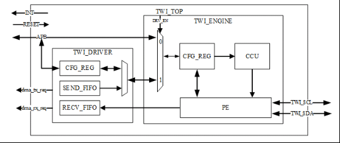
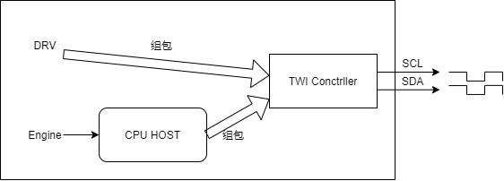

# TWI

:::info 文档说明

- **原始页数：** 14 页
- **原始文件：** [查看或下载 PDF](/pdfs/T153MX/13-twi.pdf)

正文按原始 PDF 的文本层、书签层级和页面顺序转换，仅移除重复页眉、页脚与水印，不改写技术内容。

:::

<!-- PDF page 4 -->

## 1 前言

### 1.1 文档简介

介绍HAL_V2 中TWI 驱动的接口及使用方法，为TWI 使用者提供参考。

### 1.2 目标读者

TWI 驱动的开发/维护人员。

### 1.3 适用范围

表1-1: 适用产品列表

| 产品名称 | 内核版本 | 驱动文件 |
| --- | --- | --- |
| T536 | FreeRTOS | hal_twi.c |
| T153 | FreeRTOS | hal_twi.c |

### 1.4 文档约定

#### 1.4.1 标志说明

! 注意

- 提醒操作中应注意的事项。不当的操作可能会损坏器件，影响可靠性、降低性能等。

说明

为准确理解文中指令、正确实施操作而提供的补充或强调信息。

<!-- PDF page 5 -->

技巧

一些容易忽视的小功能、技巧。了解这些功能或技巧能帮助解决特定问题或者节省操作时间。

### 1.5 相关术语介绍

| 术语 | 解释说明 |
| --- | --- |
| Sunxi | 指Allwinner 的一系列SOC 硬件平台 |
| TWI | Normal Two Wire Interface，兼容I2C 协议。 |

<!-- PDF page 6 -->

## 2 模块介绍

### 2.1 模块功能介绍



*图2-1: TWI 硬件框图*

TWI 控制器的框图如上所示，该控制器支持的标准通信速率为100Kbps，最高通信速率可以达到400Kbps。其中CPUX 域的TWI 控制器时钟源来自于APB2，CPUS 域的S-TWI 时钟源来自于APBS。

TWI 传输数据的方式包括CPU 传输和DMA 运输。

TWI 传输数据有两种模式：drv 和engine。其中drv 是不需要经过cpu host 组包和conctrller 通信的。而engine 则需要经过cpu host 组包和conctrller 通信。drv 模式只支持做主机。



*图2-2: drv 和eng 区别*

<!-- PDF page 7 -->

说明

当前驱动仅支持eng 主机模式。

### 2.2 模块配置介绍

menuconfig 配置项

Drivers V2 Config ---&gt;TWI Driver ---&gt;

```text
[*] enable twi driver
[ ] enable twi hal APIs test command
```

### 2.3 模块源码结构

1. 驱动源码

```text
hal_v2/hal/source/twi/
├──common_twi.h
├──hal_twi.c
├──Kconfig
├──Makefile
├──platform
│   ├──twi_sun55iw6.h
│   └──twi_sun8iw22.h
─platform_twi.h
```

2. 驱动APIs 声明头文件

```text
hal_v2/include/hal/
└──hal_twi.h
```

3. 驱动APIs 测试代码

```text
hal_v2/hal/examples/twi/
├──Makefile
└──twi_transfer
```

└──twi_transfer.c

<!-- PDF page 8 -->

## 3 模块接口说明

### 3.1 对外提供的API接口

#### 3.1.1 TWI初始化接口

- 原型：voidhal_twi_init(u32port,twi_init_t*twi_config);

- 功能：TWI 模块初始化

- 参数：

-port：TWI 端口号-twi_config：twi_init_t 结构体指针

- 返回值：空

#### 3.1.2 TWI读

- 原型：inthal_twi_read(u32port,u8chip,u32addr,intalen,u8*buffer,intlen);

- 功能：TWI 读

- 参数：

-port：twi 端口号-chip：slave 地址-addr：读取的地址-alen：读取长度-buffer：存储读到的数据-len：存储读到的长度

- 返回值：

-0：成功--1：失败

#### 3.1.3 TWI写

- 原型：hal_twi_write(u32 port, u8 chip, u32 addr, int alen, u8 *buffer, int len);

- 功能：TWI 写

<!-- PDF page 9 -->

- 参数：

-port：twi 端口号-chip：slave 地址-addr：要写的地址-alen：写的长度-buffer：写入的内容-len：写入的长度

- 返回值：

-0：成功--1：失败

<!-- PDF page 10 -->

## 4 模块使用范例

可参考驱动APIs 测试代码（hal_v2/hal/examples/twi/）：

```c
#include <hal_clk.h>
#include <hal_reset.h>
#include <hal_gpio.h>
#include <hal_twi.h>i
```

ned(CONFIG_KERNEL_FREERTOS)

```c
#include <console.h>
#elif defined(CONFIG_KERNEL_BAREMETAL)
#include "shell.h"
#endif
#define SLAVE_ADDR
                  0x36
#define BUF_SIZE
                 32
#define ADDR_LEN
                 1
#if defined(CONFIG_ARCH_SUN55IW6)
static int port = S_TWI0;
#else
static int port = TWI4;
#endif
```

nttwi_clk_init()

```text
{
 int ret;
 hal_rst_t rst;
 rst_number_t rst_num;
 hal_clk_t clk;
 clk_number_t clk_num;
```

\\#if defined(CONFIG_ARCH_SUN55IW6)

```text
rst_num = MAKE_RSTn(AW_PRCM_CCU, RST_BUS_PRCM_R_TWI0);
 clk_num = MAKE_CLKn(AW_PRCM_CCU, CLK_PRCM_R_TWI0_BUS);
#else
 rst_num = MAKE_RSTn(AW_SYS_CCU, RST_BUS_TWI4);
 clk_num = MAKE_CLKn(AW_SYS_CCU, CLK_BUS_TWI4);
#endif
 ret = hal_rst_get_by_rst_num(rst_num, &rst);
 if (ret) {
   printf("get reset handle failed, rst_num: %u, ret: %d\n", rst_num, ret);
   return -1;
 }
 ret = hal_n_clk_get_by_clk_num(clk_num, &clk);
 if (ret) {
   printf("get clk(%u) failed, ret: %d\n", clk_num, ret);
   return -1;
 }
 ret = hal_rst_deassert(rst);
```

<!-- PDF page 11 -->

```text
if (ret) {
 printf("deassert reset failed, rst_num: %u, ret: %d\n", rst_num, ret);
 ret = -2;
 goto exit_with_put_rst;
}
ret = hal_n_clk_enable(clk);
if (ret) {
 printf("enable clk(%u) failed, ret: %d\n", clk_num, ret);
 ret = -2;
 goto exit_with_put_clk;
}
ret = 0;
```

exit_with_put_clk:hal_n_clk_put(clk);

exit_with_put_rst:

```c
hal_rst_put(rst);
 return ret;
}
void twi_pin_init(void)
{
```

gpio_init_t gpio_initstruct;

\\#if defined(CONFIG_ARCH_SUN55IW6)

```c
gpio_initstruct.port = SUNXI_GPIO_L;/* PL0 PL1: s_twi0 */
 gpio_initstruct.port_num = PIN_0 | PIN_1;
 gpio_initstruct.mul_sel = GPL_S_TWI0;
 gpio_initstruct.pull = PIN_PULL_UP;
 gpio_initstruct.drv_level = PIN_MULTI_DRIVE_2;
 gpio_initstruct.port = SUNXI_GPIO_B;
 gpio_initstruct.port_num = PIN_13 | PIN_14;
 gpio_initstruct.mul_sel = GPB_TWI4;
 gpio_initstruct.pull = PIN_PULL_UP;
 gpio_initstruct.drv_level = PIN_MULTI_DRIVE_2;
#endif
 hal_gpio_init(&gpio_initstruct);
}
void twi_test(void)
{
 u8 read_buf[BUF_SIZE] = {0};
 u8 write_buf[10] = {0x2};
 int ret = 0;
```

twi_clk_init();

twi_pin_init();

twi_init_t twi_initstruct;

```text
twi_initstruct.mode = TWI_DRV_XFER;
twi_initstruct.freq = TWI_FREQUENCY_400K;
```

<!-- PDF page 12 -->

hal_twi_init(port, &twi_initstruct);

```text
/* write 1 byte: write addr:0x22, write len:1 */
ret = hal_twi_write(port, SLAVE_ADDR, 0x22, ADDR_LEN, write_buf, 1);
if (ret) {
 printf("i2c_write fail, ret:%d\n", ret);
}
/* read 1 byte: read addr:0x22, read len:1 */
ret = hal_twi_read(port, SLAVE_ADDR, 0x22, ADDR_LEN, read_buf, 1);
if (ret) {
 printf("i2c_read fail, ret:%d\n", ret);
}
if (read_buf[0] != write_buf[0]) {
 printf("read and write data are not equal, test fail!\n");
} else {
intf("twiread/write1bytetestpass!\n");
```

printf("0x22 read_buf:0x%x\\n", read_buf[0]);

```text
/* slave addr: 0x36，start read addr: 0x0, read length: 32 */
ret = hal_twi_read(port, SLAVE_ADDR, 0x0, ADDR_LEN, read_buf, BUF_SIZE);
if (ret) {
 printf("i2c_read fail, ret:%d\n", ret);
}
printf("i2c_read 32 byte data:\n");
for (i = 0; i < 32; i++) {
 printf("0x%x ", read_buf[i]);
 if (i == 16)
```

printf("\\r\\n");

```text
}
#if defined(CONFIG_KERNEL_FREERTOS)
FINSH_FUNCTION_EXPORT_CMD(twi_test, twi_test, twi hal_v2 APIs tests)
#elif defined(CONFIG_KERNEL_BAREMETAL)
SHELL_EXPORT_CMD(
SHELL_CMD_PERMISSION(0)|SHELL_CMD_TYPE(SHELL_TYPE_CMD_FUNC)|SHELL_CMD_DISABLE_RETURN,
twi_test, twi_test, test for twi transfer);
#endif
```

<!-- PDF page 13 -->

## 5 FAQ

无

<!-- PDF page 14 -->

权声明

本文档及内容受著作权法保护，其著作权由珠海全志科技股份有限公司（“全志”）拥有并保留一切权利。

本文档是全志的原创作品和版权财产，未经全志书面许可，任何单位和个人不得擅自摘抄、复制、修改、发表或传播本文档内容的部分或全部，且不得以任何形式传播。

商标声明

、

、

、

（不完全列

举）均为珠海全志科技股份有限公司的商标或者注册商标。在本文档描述的产品中出现的其它商标，产品名称，和服务名称，均由其各自所有人拥有。

免责声明

您购买的产品、服务或特性应受您与珠海全志科技股份有限公司（“全志”）之间签署的商业合同和条款的约束。本文档中描述的全部或部分产品、服务或特性可能不在您所购买或使用的范围内。使用前请认真阅读合同条款和相关说明，并严格遵循本文档的使用说明。您将自行承担任何不当使用行为（包括但不限于如超压，超频，超温使用）造成的不利后果，全志概不负责。

本文档作为使用指导仅供参考。由于产品版本升级或其他原因，本文档内容有可能修改，如有变

恕不另行通知。全志尽全力在本文档中提供准确的信息，但并不确保内容完全没有错误，因

使用本文档而发生损害（包括但不限于间接的、偶然的、特殊的损失）或发生侵犯第三方权利事件，全志概不负责。本文档中的所有陈述、信息和建议并不构成任何明示或暗示的保证或承诺。

本文档未以明示或暗示或其他方式授予全志的任何专利或知识产权。在您实施方案或使用产品的过程中，可能需要获得第三方的权利许可。请您自行向第三方权利人获取相关的许可。全志不承担也不代为支付任何关于获取第三方许可的许可费或版税（专利税）。全志不对您所使用的第三方许可技术做出任何保证、赔偿或承担其他义务。
