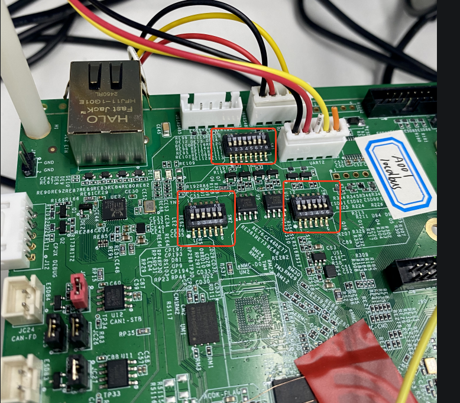

# CAN

:::info 文档说明

- **原始页数：** 26 页
- **原始文件：** [查看或下载 PDF](/pdfs/T153MX/15-can.pdf)

正文按原始 PDF 的文本层、书签层级和页面顺序转换，仅移除重复页眉、页脚与水印，不改写技术内容。

:::

<!-- PDF page 4 -->

## 1 前言

### 1.1 文档简介

介绍T536、T153 HAL V2 CAN 模块的使用方法，方便开发人员使用，注意仅适用于T536, T153。

### 1.2 目标读者

CAN 模块开发维护人员。

### 1.3 适用范围

产品名称内核版本

T536linux-5.10-rt

T153 linux-5.10-rt

### 1.4 文档约定

#### 1.4.1 标志说明

注意

提醒操作中应注意的事项。不当的操作可能会损坏器件，影响可靠性、降低性能等。

说明

为准确理解文中指令、正确实施操作而提供的补充或强调信息。

技巧

一些容易忽视的小功能、技巧。了解这些功能或技巧能帮助解决特定问题或者节省操作时间。

<!-- PDF page 5 -->

#### 1.4.2 地址与数据描述方法约定

本文档在描述地址、数据时遵循如下约定：

表1-2: 地址与数据描述方法约定

| 符号 | 例子 | 说明 |
| --- | --- | --- |
| 0x | 0x0200，0x79 | 地址或数据以16 进制表示。 |
| 0b | 0b010，0b00 000 111 | 数据采用二进制表示(寄存器描述除外)。 |
| X | 00X，XX1 | 数据描述中，X 代表0 或1。 |

例如，00X 代表000 或001；XX1 代表001，011，101 或111。

#### 1.4.3 数值单位约定

本文档在描述数据容量（如NAND 容量）时，单位词头代表的是1024 的倍数；描述频率、数据速率等时则代表的是1000 的倍数。具体如下：

表1-3: 数值单位约定

| 类型 | 符号对应数值 |  |
| --- | --- | --- |
| 数据容量（如NAND 容量） | 1 K | 1024 |
| 1 M | 1 048 576 |  |
| 1 G | 1 073 741 824 |  |
| 频率，数据速率等 | 1 k | 1000 |
| 1 M | 1 000 000 |  |
| 1 G | 1 000 000 000 |  |

### 1.5 相关术语介绍

#### 1.5.1 软件术语

<!-- PDF page 6 -->

术语解释说明

| sunxi | 指Allwinner 的一系列SoC 硬件平台 |
| --- | --- |
| BRP | Bit Rate Prescaler |
| BSP | Bit Stream Processor |
| CAN | Controller Area Network |
| CAN FD | Controller Area Network with Flexible Data-rate |
| CRC | Cyclic Redundancy Check |

DLCDataLengthCode

| ECC | Error Correction Code |
| --- | --- |
| ECU | Electronic Control Unit |
| EOF | End of Frame |
| SOF | Start of Frame |
| SSP | Secondary Sample Point |
| TDC | Transmitter Delay Compensation |
| tq | time quantum |

TSEG1TimeSegmentbeforeSamplePoint

TSEG2 Time Segment after Sample Point

<!-- PDF page 7 -->

## 2 源码结构

驱动源码目录如下：

```text
# tina/rtos/lichee/hal_v2/hal/source/can
$ tree ./
./
├──can_platform.h
├──Kconfig
─Makefile
├──platform
│   ├──can_sun55iw6.h
│   ├──can_sun8iw22.h
│   └──sunxi_can_reg.h
├──sunxi_can_drv.c
└──sunxi_can_drv.h
```

测试程序源码目录：

```text
# tina/rtos/lichee/hal_v2/hal/examples/can
$ tree ./
./
├──can_fd_frame_test
│   ├──can_fd_frame_test_sun55iw6.c
│   └──can_fd_frame_test_sun8iw22.c
├──can_filter_test
│   ├──can_filter_test_sun55iw6.c
│   └──can_filter_test_sun8iw22.c
├──classic_frame_test
│   ├──classic_frame_test_sun55iw6.c
│   └──classic_frame_test_sun8iw22.c
└──Makefile
```

T536 使用xxx_sun55iw6.c 测试程序，T153 使用xxx_sun8iw22.c 测试程序。

<!-- PDF page 8 -->

## 3 模块接口说明

| API | 解释说明 |
| --- | --- |
| hal_fdcan_init | fdcan 驱动初始化 |
| hal_fdcan_deinit | fdcan 驱动释放 |
| hal_fdcan_config_filter | 配置fdcan 过滤属性 |
| hal_fdcan_config_global_filter | 配置fdcan 全局过滤属性 |
| hal_fdcan_start | 启动CAN |
| hal_fdcan_stop | 停止CAN |
| hal_fdcan_activate_notification | 启用指定CAN 中断 |
| hal_fdcan_deactivate_notification | 禁用指定CAN 中断 |
| hal_fdcan_irq_handler | fdcan 中断处理函数 |
| hal_fdcan_rx_fifo0_callback | rxfifo0 接收中断回调函数 |

### 3.1 hal_fdcan_init

- 函数原型：status_type_def_t hal_fdcan_init(can_handle_type_def_t *hfdcan)

- 作用：fdcan 驱动初始化

- 参数：

-hfdcan: 设备驱动句柄

回：

-HAL_OK：成功-非HAL_OK：失败

### 3.2 hal_fdcan_deinit

- 函数原型：status_type_def_t hal_fdcan_deinit(can_handle_type_def_t *hfdcan)

<!-- PDF page 9 -->

- 作用：fdcan 驱动释放

数：

-hfdcan: 设备驱动句柄

- 返回：

-HAL_OK：成功-非HAL_OK：失败

### 3.3 hal_fdcan_config_filter

- 函数原型：status_type_def_t hal_fdcan_config_filter(can_handle_type_def_t hfdcan, const

can_filter_type_def_t filter_config)

- 作用：配置fdcan 过滤属性

- 参数：

-hfdcan: 设备驱动句柄-filter_config: 过滤参数

- 返回：

-HAL_OK：成功-非HAL_OK：失败

### 3.4 hal_fdcan_config_global_filter

- 函数原型：status_type_def_t hal_fdcan_config_global_filter(can_handle_type_def_t *hfd-

can, uint32_t non_matching_std, uint32_t non_matching_ext, uint32_t reject_remote_std,uint32_t reject_remote_ext);

- 作用：配置fdcan 全局过滤属性

- 参数：

-hfdcan: 设备驱动句柄-non_matching_std:acceptnon-matchingframestandard配置

-non_matching_ext: accept non-matching frame extended 配置-reject_remote_std: reject remote frame standard 配置-reject_remote_ext: reject remote frame extended 配置

- 返回：

-HAL_OK：成功-非HAL_OK：失败

<!-- PDF page 10 -->

### 3.5 hal_fdcan_start

- 函数原型：status_type_def_t hal_fdcan_start(can_handle_type_def_t *hfdcan)

- 作用：启动CAN

- 参数：

-hfdcan: 设备驱动句柄

- 返回：

-HAL_OK：成功-非HAL_OK：失败

### 3.6 hal_fdcan_stop

- 函数原型：status_type_def_t hal_fdcan_stop(can_handle_type_def_t *hfdcan)

- 作用：停止CAN

- 参数：

-hfdcan: 设备驱动句柄

- 返回：

-HAL_OK：成功-非HAL_OK：失败

### 3.7 hal_fdcan_activate_notification

- 函数原型：status_type_def_t hal_fdcan_activate_notification(can_handle_type_def_t

*hfdcan, uint32_t active_its, uint32_t buffer_indexes);

- 作用: 启用指定CAN 中断

- 参数：

-hfdcan: 设备驱动句柄-active_its: 启动指定中断-buffer_indexes: 对应buffer 索引

- 返回：

-HAL_OK：成功-非HAL_OK：失败

<!-- PDF page 11 -->

### 3.8 hal_fdcan_deactivate_notification

- 函数原型：status_type_def_t hal_fdcan_deactivate_notification(can_handle_type_def_t

*hfdcan, uint32_t inactive_its);

- 作用：禁用指定CAN 中断

- 参数：

-hfdcan: 设备驱动句柄-inactive_its: 需要disable 的中断位

- 返回：

-HAL_OK：成功-非HAL_OK：失败

### 3.9 hal_fdcan_irq_handler

- 函数原型：void hal_fdcan_irq_handler(can_handle_type_def_t *hfdcan);

- 作用：CAN 中断处理函数

- 参数：

-hfdcan: 设备驱动句柄

### 3.10 hal_fdcan_rx_fifo0_callback

- 函数原型：void hal_fdcan_rx_fifo0_callback(can_handle_type_def_t *hfdcan,uint32_t

rx_fifo0_its);

- 作用：fdcan rx fifo0 中断触发回调函数

- 参数：

-hfdcan: 设备驱动句柄-rx_fifo0_its: rx_fifo0 中断pending 状态

<!-- PDF page 12 -->

## 4 功能开发

### 4.1 开发流程

1. 初始化GPIO 和初始化时钟。

2. 初始化CAN，并注册中断处理函数，驱动使用rx_fifo0 接收数据，所以需要根据需求实现

_fdcan_rx_fifo0_callback 回调函数。

3. CAN 收发测试，确保硬件连接正常，总线负载电阻值正常。

4. 程序结束，释放资源。

### 4.2 例程

```c
int start_can_classic_frame_test(int argc, char **argv) {
 uint32_t test_data = 0;
 tx_test_frame_cnt = 0;
 rx_test_frame_cnt = 0;
```

printf("************** start CAN%d test %s %s************** \\n", TEST_CANX, __DATE__, __TIME__);

```text
gpio_init();
clk_init();
```

if (can_config() != HAL_OK)goto exit;

printf("%s\\n", "FDCAN_Config done");

```text
while (1) {
 test_data++;
 memcpy(&tx_data[0], &test_data, 4);
 memcpy(&tx_data[4], &test_data, 4);
 /* Start the Transmission process */
 if (hal_fdcan_add_message_to_tx_fifoQ(&hfdcan, &tx_header, tx_data) != HAL_OK) {
   printf("tx failed \n");
 } else {
   printf("tx done\n");
   tx_test_frame_cnt++;
 }
 udelay(1000000);
}
```

exit:hal_fdcan_deinit(&hfdcan);

<!-- PDF page 13 -->

```text
clk_deinit();
return 0;
```

CAN 初始化代码如下，hfdcan 为can 驱动handler，通过该结构体配置CAN 不同参数，tx_header 结构体用于配置发送帧结构信息。

```text
status_type_def_t can_config(void) {
```

/* Bit time configuration:

```text
fdcan_ker_ck
                   = 40 MHz
   Time_quantum (tq)
                    = 25 ns
   Synchronization_segment
                    = 1 tq
   Propagation_segment
                    = 23 tq
   Phase_segment_1
                    = 8 tq
   Phase_segment_2
                    = 8 tq
   Synchronization_Jump_width = 8 tq
   Bit_length
                 = 40 tq = 1 祍
   Bit_rate
                = 1 MBit/s
 */
#if (TEST_CANX == 0)
 hfdcan.instance = FDCAN0;
 hfdcan.sram_base_addr = SRAMCAN_BASE0;
 hfdcan.irq_num = CAN0_INT0_NUM;
#elif (TEST_CANX == 1)
 hfdcan.instance = FDCAN1;
 hfdcan.sram_base_addr = SRAMCAN_BASE1;
 hfdcan.irq_num = CAN1_INT0_NUM;
#endif
 hfdcan.init.frame_format = FDCAN_FRAME_CLASSIC;
 hfdcan.init.mode = FDCAN_MODE_NORMAL;
 hfdcan.init.auto_retransmission = ENABLE;
 hfdcan.init.transmit_pause = DISABLE;
an.init.protocol_exception=ENABLE;
 hfdcan.init.nominal_prescaler = 0x1; /* tq = NominalPrescaler x (1/fdcan_ker_ck) */
 hfdcan.init.nominal_sync_jump_width = 0x8;
 hfdcan.init.nominal_time_seg1 = 0x1F; /* NominalTimeSeg1 = Propagation_segment + Phase_segment_1 */
 hfdcan.init.nominal_time_seg2 = 0x8;
 hfdcan.init.msg_ram_offset = 0;
 hfdcan.init.std_filters_nbr = 1;
 hfdcan.init.ext_filters_nbr = 0;
 hfdcan.init.rx_fifo0_elmts_nbr = 1;
 hfdcan.init.rx_fifo0_elmt_size = FDCAN_DATA_BYTES_8;
 hfdcan.init.rx_fifo1_elmts_nbr = 0;
 hfdcan.init.rx_buffers_nbr = 0;
 hfdcan.init.tx_events_nbr = 0;
 hfdcan.init.tx_buffers_nbr = 0;
 hfdcan.init.tx_fifo_queue_elmts_nbr = 1;
 hfdcan.init.tx_fifo_queue_mode = FDCAN_TX_FIFO_OPERATION;
an.init.tx_elmt_size=FDCAN_DATA_BYTES_8;
 if (can_intc_init(hfdcan.irq_num) != HAL_OK) {
   printf("can irq init failed\n");
   return HAL_ERROR;
 }
 if (hal_fdcan_init(&hfdcan) != HAL_OK) {
   printf("HAL_FDCAN_Init failed\n");
   return HAL_ERROR;
 }
 printf("HAL_FDCAN_Init done\n");
```

<!-- PDF page 14 -->

hal_fdcan_config_global_filter(&hfdcan, FDCAN_ACCEPT_IN_RX_FIFO0, FDCAN_ACCEPT_IN_RX_FIFO0,

```text
FDCAN_FILTER_REMOTE, FDCAN_FILTER_REMOTE);
 printf("HAL_FDCAN_ConfigGlobalFilter done%s\n", " ");
 /* Start the FDCAN module */
 if (hal_fdcan_start(&hfdcan) != HAL_OK) {
   printf("HAL_FDCAN_Start failed%s\n", " ");
   return HAL_ERROR;
 }
 printf("HAL_FDCAN_Start done%s\n", " ");
 if (hal_fdcan_activate_notification(&hfdcan, FDCAN_IT_RX_FIFO0_NEW_MESSAGE, 0) != HAL_OK) {
   printf("HAL_FDCAN_ActivateNotification failed%s\n", " ");
   return HAL_ERROR;
 }
 printf("HAL_FDCAN_ActivateNotification done%s\n", " ");
 /*PrepareTxHeader*/
 tx_header.identifier = 0x321;
 tx_header.id_type = FDCAN_STANDARD_ID;
 tx_header.tx_frame_type = FDCAN_DATA_FRAME;
 tx_header.data_length = FDCAN_DLC_BYTES_8;
 tx_header.error_state_indicator = FDCAN_ESI_ACTIVE;
 tx_header.bit_rate_switch = FDCAN_BRS_OFF;
 tx_header.fd_format = FDCAN_CLASSIC_CAN;
 tx_header.tx_event_fifo_control = FDCAN_NO_TX_EVENTS;
 tx_header.message_marker = 0;
 printf("Prepare Tx header done%s\n", " ");
 return HAL_OK;
}
```

如果需要添加过滤功能，则使用filter_config 结构体进行配置, 通过filter_id1 设置需要接收的数据帧ID，如下是仅接收ID = 0x321 的配置：

```text
/* Configure Rx filter */
filter_config.id_type = FDCAN_STANDARD_ID;
filter_config.filter_index = 0;
filter_config.filter_type = FDCAN_FILTER_MASK;
filter_config.filter_config = FDCAN_FILTER_TO_RXFIFO0;
filter_config.filter_id1 = 0x321;
filter_config.filter_id2 = 0x7FF;
if (hal_fdcan_config_filter(&hfdcan, &filter_config) != HAL_OK) {
 printf("HAL_FDCAN_ConfigFilter failed %s\n", " ");
 return HAL_ERROR;
}
printf("HAL_FDCAN_ConfigFilter done%s\n", " ");
```

<!-- PDF page 15 -->

## 5 环境搭建

如果使用T536 环境配置如下：

```text
$ ./build.sh config
06-11 14:12:25.383 808609 D mkcommon : ========ACTION List: mk_config ;========
06-11 14:12:25.384 808609 D mkcommon : options :
All available platform:
 2. linux
e[linux]:
```

All available linux_dev:

```text
3. buildroot
Choice [buildroot]:
All available ic:
 4. t536
Choice [t536]:
All available board:
 2. demo_amp
Choice [demo_amp]:
All available flash:
 1. default
 2. nor
Choice [default]:
```

All available kern_name:

```text
2. linux-5.10-rt
Choice [linux-5.10-rt]:
```

如果使用T153 环境配置如下：

```text
$ ./build.sh config
07-24 16:37:35.890 3686411 D mkcommon : ========ACTION List: mk_config ;========
07-24 16:37:35.892 3686411 D mkcommon : options :
All available platform:
 1. linux
Choice [linux]:
All available linux_dev:
 1. buildroot
Choice [buildroot]:
All available ic:
53
Choice[t153]:
All available board:
 1. bga_demo_amp_nand
Choice [bga_demo_amp_nand]:
All available flash:
 0. default
 1. nor
Choice [default]:
All available kern_name:
 2. linux-5.10-rt
Choice [linux-5.10-rt]:
```

<!-- PDF page 16 -->

| 2、关闭 | Linux | 端 | CAN | 驱动模块 | (取消配置项 | CONFIG_AW_CAN_SUN8I | / | CON- |
| --- | --- | --- | --- | --- | --- | --- | --- | --- |
| W_CAN_SUN55I) | a 根目录执行./build.shmenuconfig | 。 |  |  |  |  |  |  |

### 5.1 ARM baremetal 环境搭建

1、配置板型。

执行./build.sh config 选择对应的板型。

T536 选择配置: T536, demo。

T153 选择配置: T153, bga_demo。

```text
$ ./build.sh config
Welcome to mkscript setup progress
All available bare_project:
 1. mr153_e907
 2. t153
 3. t153_e907
 4. t536
 5. t536_e907
Choice [t536]:
All available bare_board:
 1. demo
Choice [demo]:
```

开baremetal 端驱动模块，进入tina/rtos/lichee/baremetal目录执行./build.shmenu-i g。

打开配置CONFIG_DRIVERS_V2_CAN=y, CONFIG_HAL_TEST_CAN=y，方法如下：

&gt; Drivers Options&gt; Drivers V2 Config

&gt; CAN Driver

```text
[*] Enable Allwinner CAN Controller Driver
[*] Enable CAN hal APIs test command
```

3、将编译后生成的固件baremetal 固件tina/rtos/lichee/baremetal/out/t536/demo/image/

t536_demo.bin 使用adb push 到板端/lib/firmware/。

操作指令:

```bash
sync
echo stop > /sys/class/remoteproc/remoteproc2/state
echo t536_demo.bin > /sys/class/remoteproc/remoteproc2/firmware
echo start > /sys/class/remoteproc/remoteproc2/state
```

T153 操作指令:

```bash
sync
echo 0 > /sys/devices/system/cpu/cpu2/online
echo t153_bga_demo.elf > /sys/class/remoteproc/remoteproc2/firmware
```

<!-- PDF page 17 -->

```bash
echo start > /sys/class/remoteproc/remoteproc2/state
```

口连接图示。

T536 串口连接图示:


*图5-1*

T153 串口连接图示:

<!-- PDF page 18 -->



*图5-2*

### 5.2 ARM RTOS 环境搭建

1、选择板型。

执行lunch_rtos 选择对应板型。

选择板型：t536 o。

T153 选择板型：t153，bga_demo。

2、mrtos_menuconfig 选择编译CAN 模块驱动，然后执行mrtos 编译。

打开配置CONFIG_DRIVERS_V2_CAN=y, CONFIG_HAL_TEST_CAN=y，如下：

---&gt; Drivers Options---&gt; soc related device drivers

---&gt; Drivers V2 Config

<!-- PDF page 19 -->

---&gt; CAN Driver

```text
[*] Enable Allwinner CAN Controller Driver
[*]EnableCANhalAPIstestcommand
```

3、将编译好的固件push 到板端，执行如下指令启动。

T536 操作指令：

```bash
sync
echo stop > /sys/class/remoteproc/remoteproc1/state
echo rt_system.elf > /sys/class/remoteproc/remoteproc1/firmware
echo start > /sys/class/remoteproc/remoteproc1/state
```

T153 操作指令：

```bash
sync
echo stop > /sys/class/remoteproc/remoteproc1/state
echort_system.elf>/sys/class/remoteproc/remoteproc1/firmware
echo start > /sys/class/remoteproc/remoteproc1/state
```

### 5.3 RV RTOS 环境搭建

1、执行lunch_rtos 选择对应板型。

T536 选择板型：t536_e907，demo。

T153 选择板型：t153_e907，bga_demo。

tos_menuconfig择编译CAN 模块驱动，然后执行mrtos 编译。

打开配置CONFIG_DRIVERS_V2_CAN=y, CONFIG_HAL_TEST_CAN=y，如下：

---&gt; Drivers Options---&gt; soc related device drivers

---&gt; Drivers V2 Config---&gt; CAN Driver

```text
[*] Enable Allwinner CAN Controller Driver
[*] Enable CAN hal APIs test command
```

3、将编译好的固件push 到板端，执行如下指令启动。

T536 操作指令：

```bash
sync
echo stop > /sys/class/remoteproc/remoteproc0/state
echo rt_system.elf > /sys/class/remoteproc/remoteproc0/firmware
echo start > /sys/class/remoteproc/remoteproc0/state
```

T153 操作指令：

```bash
sync
echo stop > /sys/class/remoteproc/remoteproc1/state
echo rt_system.elf > /sys/class/remoteproc/remoteproc1/firmware
echo start > /sys/class/remoteproc/remoteproc1/state
```

<!-- PDF page 20 -->

### 5.4 RV baremetal 环境搭建

1、选择板型。

T536 选择配置: t536_e907, demo。

T153 选择配置: t153_e907, bga_demo。

```text
$ ./build.sh config
Welcome to mkscript setup progress
All available bare_project:
 1. mr153_e907
 2. t153
 3. t153_e907
 4. t536
 5. t536_e907
Choice [t536_e907]:
All available bare_board:
 1. demo
 2. demo_sram
Choice [demo]:
INFO: /home/wangjin/workspace/tina/rtos/lichee/baremetal/projects/t536_e907/default/BoardConfig.mk can not find
    ...
INFO: Prepare executive of tools ...
INFO: ./tools/riscv64-elf-x86_64-20201104 ready ...
#
# No change to .config
#
INFO: use ./projects/t536_e907/demo/sun55iw6p1_t536_e907_demo_defconfig ...
```

2、打开baremetal 端CAN 驱动模块，进入tina/rtos/lichee/baremetal目录执行./build.shmenu-

config 打开配置CONFIG_DRIVERS_V2_CAN=y, CONFIG_HAL_TEST_CAN=y，如下：

&gt; Drivers Options&gt; Drivers V2 Config

&gt; CAN Driver

```text
[*] Enable Allwinner CAN Controller Driver
[*] Enable CAN hal APIs test command
```

3、将固件推到板端执行。

T536 指令：

```bash
sync
top>/sys/class/remoteproc/remoteproc0/state
echo t536_e907_demo.elf > /sys/class/remoteproc/remoteproc0/firmware
echo start > /sys/class/remoteproc/remoteproc0/state
```

T153 指令：

```bash
sync
echo stop > /sys/class/remoteproc/remoteproc0/state
echo t153_e907_bga_demo.elf > /sys/class/remoteproc/remoteproc0/firmware
echo start > /sys/class/remoteproc/remoteproc0/state
```

<!-- PDF page 21 -->

## 6 使用方法

通过修改rtos/lichee/hal_v2/hal/examples/can/Makefile 后重新编译固件来切换can 测试指令。

can_classic_frame_test：测试can 传统帧，波特率1Mbps。

can_filter_test：测试can 传统帧过滤，波特率1Mbps，仅接收帧ID 为0x321 的数据。

d_frame_test：测试anfd 帧，仲裁段波特率500kbps，数据段波特率2Mbps。

### 6.1 测试传统帧

测试CAN 传统帧的收发功能, 采用A 板与B 板对测。其中A 板是具有CAN 功能的正常设备, B 板是待测的T536/T153 开发板。

步骤如下：

1、将A 板的CAN0 与B 板的待测CAN0 连接。

板linux 系统下输入如下指令，配置CAN0 仲裁段波特率1Mbps，打开接收和发送功能。

```text
ip link set can0 down
ip link set can0 type can bitrate 1000000 loopback off
ip link set can0 up
ip -detail -s link show can0
```

candump can0 &

cangen can0 -L i -D i -I i -g 1000 -p 100 &

3、B 板命令行执行can_classic_frame_test, 日志如下：

```text
cpu0>can_classic_frame_test
************** start can test Jun 19 2025 19:50:08**************
init can0 gpio done
init can1 gpio done
init can2 gpio done
init can3 gpio done
 can0 rst info, rst_num: 131137, rst_id: 2, rst_id: 65
 can1 rst info, rst_num: 131138, rst_id: 2, rst_id: 66
 can2 rst info, rst_num: 131139, rst_id: 2, rst_id: 67
 can3 rst info, rst_num: 131140, rst_id: 2, rst_id: 68
 can mbus bus info, clk_num: 131132, cc_id: 2, clk_id: 60
  can0 clk info, clk_num: 131230, cc_id: 2, clk_id: 158
 can0 bus clk info, clk_num: 131231, cc_id: 2, clk_id: 159
  can1 clk info, clk_num: 131232, cc_id: 2, clk_id: 160
 can1 bus clk info, clk_num: 131233, cc_id: 2, clk_id: 161
```

<!-- PDF page 22 -->

```text
can2 clk info, clk_num: 131234, cc_id: 2, clk_id: 162
 can2 bus clk info, clk_num: 131235, cc_id: 2, clk_id: 163
  can3 clk info, clk_num: 131236, cc_id: 2, clk_id: 164
 can3 bus clk info, clk_num: 131237, cc_id: 2, clk_id: 165
set can0 clk to 40000000 done
set can1 clk to 40000000 done
set can2 clk to 40000000 done
set can3 clk to 40000000 done
can0 reset deassert done
can1 reset deassert done
can2 reset deassert done
can3 reset deassert done
can mbus bus clk enable done
can0 bus clk enable done
can0 clk enable done
can1 bus clk enable done
can1 clk enable done
usclkenabledone
can2 clk enable done
can3 bus clk enable done
can3 clk enable done
params check done [hal_fdcan_init, 102]
clear csr [hal_fdcan_init, 114]
req init mode [hal_fdcan_init, 127]
[hal_fdcan_init, 229]
HAL_FDCAN_Init done
HAL_FDCAN_ConfigGlobalFilter done
CAN2 Start done
HAL_FDCAN_ActivateNotification done
Prepare Tx header done
FDCAN_Config done
tx done
tx done
ata:0001020304050607
id:
     0 data: 00 01 02 03 04 05 06 07
id:
     0 data: 00 01 02 03 04 05 06 07
tx done
id:
     0 data: 00 01 02 03 04 05 06 07
id:
     0 data: 00 01 02 03 04 05 06 07
id:
     0 data: 00 01 02 03 04 05 06 07
```

### 6.2 测试 CAN 帧过滤功能

使用测试指令can_filter_test，测试步骤和测试传统帧一致，区别在于只有发送端发送id 为0x321

时才能收到。

日志如下：

```text
cpu0>can_filter_test
************** start can test Jun 19 2025 19:50:08**************
init can0 gpio done
init can1 gpio done
init can2 gpio done
init can3 gpio done
 can0 rst info, rst_num: 131137, rst_id: 2, rst_id: 65
 can1 rst info, rst_num: 131138, rst_id: 2, rst_id: 66
```

<!-- PDF page 23 -->

```text
can2 rst info, rst_num: 131139, rst_id: 2, rst_id: 67
 can3 rst info, rst_num: 131140, rst_id: 2, rst_id: 68
 can mbus bus info, clk_num: 131132, cc_id: 2, clk_id: 60
  can0 clk info, clk_num: 131230, cc_id: 2, clk_id: 158
 can0 bus clk info, clk_num: 131231, cc_id: 2, clk_id: 159
  can1 clk info, clk_num: 131232, cc_id: 2, clk_id: 160
 can1 bus clk info, clk_num: 131233, cc_id: 2, clk_id: 161
  can2 clk info, clk_num: 131234, cc_id: 2, clk_id: 162
 can2 bus clk info, clk_num: 131235, cc_id: 2, clk_id: 163
  can3 clk info, clk_num: 131236, cc_id: 2, clk_id: 164
 can3 bus clk info, clk_num: 131237, cc_id: 2, clk_id: 165
set can0 clk to 40000000 done
set can1 clk to 40000000 done
set can2 clk to 40000000 done
set can3 clk to 40000000 done
can0 reset deassert done
can1 reset deassert done
esetdeassertdone
can3 reset deassert done
can mbus bus clk enable done
can0 bus clk enable done
can0 clk enable done
can1 bus clk enable done
can1 clk enable done
can2 bus clk enable done
can2 clk enable done
can3 bus clk enable done
can3 clk enable done
... init can2 ...
params check done [hal_fdcan_init, 102]
clear csr [hal_fdcan_init, 114]
req init mode [hal_fdcan_init, 127]
[hal_fdcan_init, 229]
DCAN_Initdone
HAL_FDCAN_ConfigFilter done
HAL_FDCAN_ConfigGlobalFilter done
HAL_FDCAN_Start done
HAL_FDCAN_ActivateNotification done
Prepare Tx header done
FDCAN_Config done
id:
    321 data: 00 01 02 03 04 05 06 07
id:
    321 data: 00 01 02 03 04 05 06 07
id:
    321 data: 00 01 02 03 04 05 06 07
id:
    321 data: 00 01 02 03 04 05 06 07
id:
    321 data: 00 01 02 03 04 05 06 07
id:
    321 data: 00 01 02 03 04 05 06 07
id:
    321 data: 00 01 02 03 04 05 06 07
id:
    321 data: 00 01 02 03 04 05 06 07
id:
    321 data: 00 01 02 03 04 05 06 07
send frame count: 10000, recv frame count: 9
id:
    321 data: 00 01 02 03 04 05 06 07
id:
    321 data: 00 01 02 03 04 05 06 07
id:
    321 data: 00 01 02 03 04 05 06 07
id:
    321 data: 00 01 02 03 04 05 06 07
id:
    321 data: 00 01 02 03 04 05 06 07
send frame count: 20000, recv frame count: 14
```

<!-- PDF page 24 -->

### 6.3 测试 CAN-FD

测试CAN-FD 帧的收发功能, 采用A 板与B 板对测。其中A 板是具有CAN-FD 功能的正常设备, B 板是待测的T536/T153 开发板。

步骤如下：

1、将A 板的CAN0 与B 板的待测CAN0 连接。

2、A 板linux 系统下输入如下指令，配置CAN0 仲裁段波特率500K，数据段波特率2M, 打开接

收：

```text
ip link set can0 down
setcan0typecanfdonbitrate500000dbitrate2000000loopbackoff
ip link set can0 up
ip -d -s link show can0
```

candump can0&

3、B 板执行指令can_fd_frame_test。

4、A 板收到B 板发送的数据后执行如下指令：

```text
然后输入
cangen can0 -L 64 -D r -I i -f -b -p 100 -e -n 1
或者
cansend can0 00000123##011223344556677881122334455667788
```

板发送一帧canfd 数据，当B 板收到数据后会返回一帧数据，日志如下：

```text
uart>can_fd_frame_test
************** start fd can frame test Jun 20 2025 11:09:24**************
init can0 gpio done
init can1 gpio done
init can2 gpio done
init can3 gpio done
 can0 rst info, rst_num: 131137, rst_id: 2, rst_id: 65
 can1 rst info, rst_num: 131138, rst_id: 2, rst_id: 66
 can2 rst info, rst_num: 131139, rst_id: 2, rst_id: 67
 can3 rst info, rst_num: 131140, rst_id: 2, rst_id: 68
 can mbus bus info, clk_num: 131132, cc_id: 2, clk_id: 60
  can0 clk info, clk_num: 131230, cc_id: 2, clk_id: 158
 can0 bus clk info, clk_num: 131231, cc_id: 2, clk_id: 159
  can1 clk info, clk_num: 131232, cc_id: 2, clk_id: 160
busclkinfo,clk_num:131233,cc_id:2,clk_id:161
  can2 clk info, clk_num: 131234, cc_id: 2, clk_id: 162
 can2 bus clk info, clk_num: 131235, cc_id: 2, clk_id: 163
  can3 clk info, clk_num: 131236, cc_id: 2, clk_id: 164
 can3 bus clk info, clk_num: 131237, cc_id: 2, clk_id: 165
set can0 clk to 40000000 done
set can1 clk to 40000000 done
set can2 clk to 40000000 done
set can3 clk to 40000000 done
can0 reset deassert done
can1 reset deassert done
can2 reset deassert done
```

<!-- PDF page 25 -->

```text
can3 reset deassert done
can mbus bus clk enable done
can0 bus clk enable done
can0 clk enable done
can1 bus clk enable done
can1 clk enable done
can2 bus clk enable done
can2 clk enable done
can3 bus clk enable done
can3 clk enable done
... init can2 ...
can irq init done
params check done [hal_fdcan_init, 102]
clear csr [hal_fdcan_init, 114]
req init mode [hal_fdcan_init, 127]
[hal_fdcan_init, 229]
can fd init done
startdone
Prepare Tx header done
FDCAN_Config done
tx done
id:
     0 dlc: 64 data: 64 84 08 7b 66 00 e5 49 64 84 08 7b 66 00 e5 49 00 00 00 00 00 00 00 00 00 00 00 00 00 00 00 00 00 00
    00 00 00 00 00 00 00 00 84 0c 00 00 3a 00 10 32 54 76 98 00 11 22 33 44 55 66 77 88 99 00
tx done
id:
     1 dlc: 64 data: 5d 4f 9c 2d bd d0 c9 00 5d 4f 9c 2d bd d0 c9 00 00 00 84 0c 00 00 3a 00 10 32 54 76 98 00 11 22 33 44
    55 66 77 88 99 00 00 00 84 0c 00 00 3a 00 10 32 54 76 98 00 11 22 33 44 55 66 77 88 99 00
tx done
id:
     2 dlc: 64 data: 1b b9 bc 4a 10 2d aa 1e 1b b9 bc 4a 10 2d aa 1e 01 00 00 40 00 00 3f ff 5d 4f 9c 2d bd d0 c9 00 5d 4f 9c
     2d bd d0 c9 00 00 00 84 0c 00 00 3a 00 10 32 54 76 98 00 11 22 33 44 55 66 77 88 99 00
tx done
id:
     3 dlc: 64 data: 04 5b a1 03 81 b8 24 67 04 5b a1 03 81 b8 24 67 00 00 84 0c 00 00 3a 00 10 32 54 76 98 00 11 22 33 44
    55 66 77 88 99 00 00 00 84 0c 00 00 3a 00 10 32 54 76 98 00 11 22 33 44 55 66 77 88 99 00
tx done
```

<!-- PDF page 26 -->

权声明

本文档及内容受著作权法保护，其著作权由珠海全志科技股份有限公司（“全志”）拥有并保留一切权利。

本文档是全志的原创作品和版权财产，未经全志书面许可，任何单位和个人不得擅自摘抄、复制、修改、发表或传播本文档内容的部分或全部，且不得以任何形式传播。

商标声明

、

、

、

（不完全列

举）均为珠海全志科技股份有限公司的商标或者注册商标。在本文档描述的产品中出现的其它商标，产品名称，和服务名称，均由其各自所有人拥有。

免责声明

您购买的产品、服务或特性应受您与珠海全志科技股份有限公司（“全志”）之间签署的商业合同和条款的约束。本文档中描述的全部或部分产品、服务或特性可能不在您所购买或使用的范围内。使用前请认真阅读合同条款和相关说明，并严格遵循本文档的使用说明。您将自行承担任何不当使用行为（包括但不限于如超压，超频，超温使用）造成的不利后果，全志概不负责。

本文档作为使用指导仅供参考。由于产品版本升级或其他原因，本文档内容有可能修改，如有变

恕不另行通知。全志尽全力在本文档中提供准确的信息，但并不确保内容完全没有错误，因

使用本文档而发生损害（包括但不限于间接的、偶然的、特殊的损失）或发生侵犯第三方权利事件，全志概不负责。本文档中的所有陈述、信息和建议并不构成任何明示或暗示的保证或承诺。

本文档未以明示或暗示或其他方式授予全志的任何专利或知识产权。在您实施方案或使用产品的过程中，可能需要获得第三方的权利许可。请您自行向第三方权利人获取相关的许可。全志不承担也不代为支付任何关于获取第三方许可的许可费或版税（专利税）。全志不对您所使用的第三方许可技术做出任何保证、赔偿或承担其他义务。
