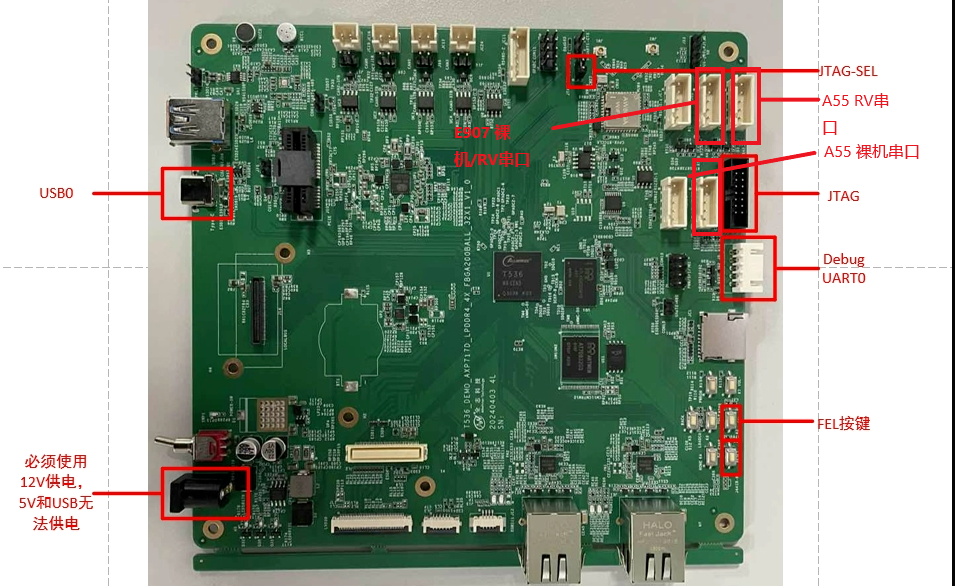
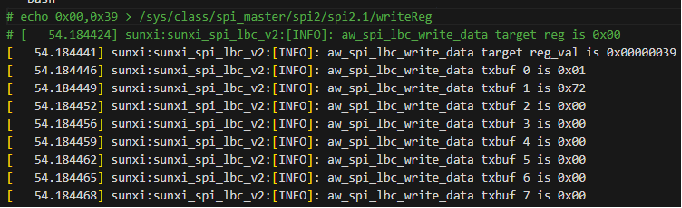
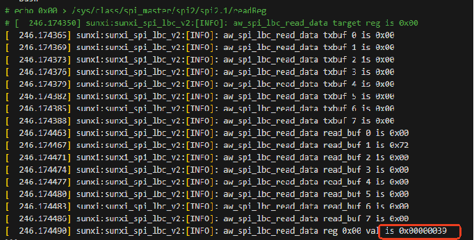
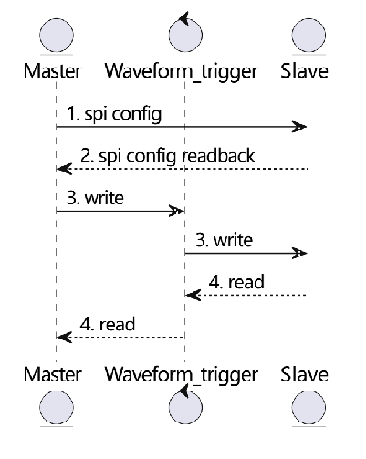
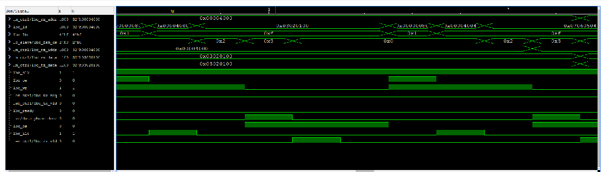
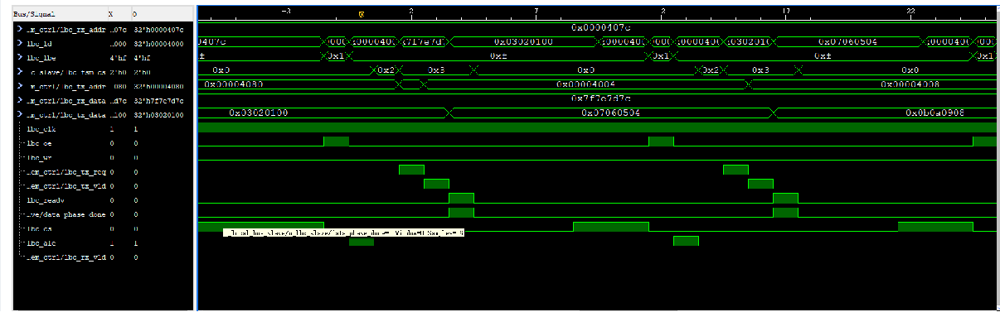

# LBC

:::info 文档说明

- **原始页数：** 28 页
- **原始文件：** [查看或下载 PDF](/pdfs/T153MX/17-lbc.pdf)

正文按原始 PDF 的文本层、书签层级和页面顺序转换，仅移除重复页眉、页脚与水印，不改写技术内容。

:::

<!-- PDF page 5 -->

## 1 前言

### 1.1 编写目的

本文旨在介绍T536、T153 HAL V2 LBC 模块的使用方法，方便开发人员使用。

### 1.2 读者对象

本文档适用于以下工程师：

- LBC 模块开发维护工程师

### 1.3 符号约定

不同符号区分信息类型，具体释义如下：

说明

用于呈现技术核心信息（如功能原理、核心参数定义）、流程补充内容（如步骤细节说明）等。

技巧

用于分享技术操作中的高效方法（如命令行快捷指令、配置项优化窍门）与实践技巧。

!注意

用于突出技术操作中易出错的环节（如参数配置边界、操作顺序要求）的提示。

### 1.4 适用范围

```text
产品名称
             内核版本
T536
             Linux-5.10-rt/origin，rtos，baremetal
T153
             Linux-5.10-rt/origin，rtos，baremetal
```

<!-- PDF page 6 -->

## 2 源码结构

sunxi_lbc_v1_xxx 是T536 LBC 驱动相关代码，sunxi_lbc_v2_xxx 是T153 LBC 驱动相关代码。

驱动源码目录如下：

```text
# tina/rtos/lichee/hal_v2/hal/source/lbc
$ tree ./
./
├──Kconfig
├──Makefile
├──platform
│   ├──sunxi_lbc_v1_drv.h
│   ├──sunxi_lbc_v1_reg.h
│   ├──sunxi_lbc_v2_drv.h
│   └──sunxi_lbc_v2_reg.h
te.h
├──sunxi_lbc_asic_test.c
├──sunxi_lbc.h
├──sunxi_lbc_platform.h
├──sunxi_lbc_reg_operate.h
├──sunxi_lbc_set_voltage.c
├──sunxi_lbc_v1_drv.c
├──sunxi_lbc_v2_drv.c
└──sunxi_lbc_v2_spi_tool.c
```

T153 LBC 目前可通过SPI 配置slave 子板使用的协议、位宽等参数。

测试程序源码，源码目录：

```text
# tina/rtos/lichee/hal_v2/hal/examples/lbc
$ tree ./
./
_test
│  └──sunxi_lbc_v1_da_test.c
├──lbc_v1_dma_test
│   └──sunxi_lbc_v1_dma_test.c
├──lbc_v1_ida_test
│   └──sunxi_lbc_v1_ida_test.c
├──lbc_v2_da_test
│   └──sunxi_lbc_v2_da_test.c
├──lbc_v2_dma_test
│   └──sunxi_lbc_v2_dma_test.c
├──lbc_v2_ida_test
│   └──sunxi_lbc_v2_ida_test.c
└──Makefile
```

<!-- PDF page 7 -->

## 3 开发环境搭建

1. 环境配置

- T536 环境配置如下：

```text
$ ./build.sh config
06-18 21:15:12.184 2416113 D mkcommon
                    : ========ACTION List: mk_config ;========
06-18 21:15:12.185 2416113 D mkcommon
                    : options :
All available platform:
  1. linux
Choice [linux]:
All available linux_dev:
  2. buildroot
Choice [buildroot]:
All available ic:
  3. t536
Choice [t536]:
All available board:
  0. demo
  1. demo_amp
Choice [demo_amp]:
All available flash:
  0. default
  1. nor
Choice [default]:
```

All available kern_name:

```text
2. linux-5.10-rt
  5. linux-5.15-origin
Choice [linux-5.10-rt]:
```

置如下：

```text
$ ./build.sh config
07-24 16:37:35.890 3686411 D mkcommon
                    : ========ACTION List: mk_config ;========
07-24 16:37:35.892 3686411 D mkcommon
                    : options :
All available platform:
  1. linux
Choice [linux]:
All available linux_dev:
  1. buildroot
Choice [buildroot]:
All available ic:
  1. t153
Choice [t153]:
All available board:
  1. bga_demo_amp_nand
Choice [bga_demo_amp_nand]:
All available flash:
  1. nor
Choice [default]:
All available kern_name:
  2. linux-5.10-rt
Choice [linux-5.10-rt]:
```

2. 关闭Linux 端LBC 驱动模块（关闭配置CONFIG_AW_LBC 、CONFIG_AW_LBC_V2 、CONFIG_AW_SPI_LBC_TEST ），Tina 根目录执

行./build.sh menuconfig ，如下所示（T153 操作步骤与T536 相同）：

&gt; Allwinner BSP

&gt; Device Drivers

&gt; Localbus Drivers

<!-- PDF page 8 -->

接图示：

*图3-1*



- T153 串口连接图示：

<!-- PDF page 9 -->

*图3-2*


### 3.1 ARM baremetal 环境搭建

1. 配置板型：执行./build.sh config 选择对应的板型。

置：T536，demo

- T153 选择配置：T153，bga-demo

2. 打开baremetal 端LBC 驱动模块，进入tina/rtos/lichee/baremetal 目录执行./build.sh menuconfig 。

- T536 需要打开配置CONFIG_DRIVERS_V2_LBC=y 、CONFIG_HAL_TEST_LBC=y ，如下：

&gt; Drivers Options

&gt; Drivers V2 Config

&gt; Localbus Drivers

[*] support localbus drivers

```text
select lbc driver version (Local Bus Ctrl Support for sun55iw6 Allwinner SoCs)
                    --->
[*]
     Enable lbc hal api test
```

<!-- PDF page 10 -->

```text
需打开配置
   CONFIG_DRIVERS_V2_SPI=y 、CONFIG_DRIVERS_V2_LBC=y 、CONFIG_DRIVERS_V2_LBC_V2=y 、
CONFIG_DRIVERS_V2_LBC_V2_SPI=y 、CONFIG_HAL_TEST_LBC=y ，配置如下：
```

&gt; Drivers Options

&gt; Drivers V2 Config&gt; SPI Driver

[*] enable spi driver

&gt; Drivers Options

&gt; Drivers V2 Config

&gt; Localbus Drivers[*] support localbus drivers

```text
select lbc driver version (Local Bus Ctrl Support for sun8iw22 Allwinner SoCs)
                    --->
[*]
     Enable hal spi driver for Local Bus
[*]
     Enable lbc hal api test
```

```text
3. 将编译后生成的固件baremetal 固件tina/rtos/lichee/baremetal/out/t536/demo/image/t536_demo.bin
                    使用adb push 到板
```

are/ 。

- T536 操作指令：

```bash
sync
echo stop > /sys/class/remoteproc/remoteproc2/state
echo t536_demo.bin > /sys/class/remoteproc/remoteproc2/firmware
echo start > /sys/class/remoteproc/remoteproc2/state
```

- T153 操作指令：

```bash
sync
echo 0 > /sys/devices/system/cpu/cpu2/online
echo t153_bga_demo.elf > /sys/class/remoteproc/remoteproc2/firmware
echo start > /sys/class/remoteproc/remoteproc2/state
```

### 3.2 ARM RTOS 环境搭建

1. 选择板型：执行lunch_rtos 选择对应板型。

- T536 选择板型：t536，demo

- T153 选择板型：t153，bga_demo

2. mrtos_menuconfig 选择编译LBC 模块驱动，然后执行mrtos 编译。

- T536 需要打开配置CONFIG_DRIVERS_V2_LBC=y 、CONFIG_HAL_TEST_LBC=y ，如下：

---&gt; Drivers Options

---&gt; soc related device drivers

---&gt; Drivers V2 Config

---&gt; Localbus Drivers

[*] support localbus drivers

```text
select lbc driver version (Local Bus Ctrl Support for sun55iw6 Allwinner SoCs)
                    --->
[*]
     Enable lbc hal api test
```

```text
• T153
         需打开配置
                    CONFIG_DRIVERS_V2_SPI=y 、CONFIG_DRIVERS_V2_LBC=y 、CONFIG_DRIVERS_V2_LBC_V2=y 、
CONFIG_DRIVERS_V2_LBC_V2_SPI=y 、CONFIG_HAL_TEST_LBC=y ，配置如下：
```

&gt; Drivers Options

&gt; soc related device drivers

&gt; Drivers V2 Config

&gt; SPI Driver

[*] enable spi driver

<!-- PDF page 11 -->

ons

&gt; soc related device drivers

&gt; Drivers V2 Config

&gt; Localbus Drivers

[*] support localbus drivers

```text
select lbc driver version (Local Bus Ctrl Support for sun8iw22 Allwinner SoCs)
                    --->
[*]
     Enable hal spi driver for Local Bus
[*]
     Enable lbc hal api test
```

3. 将编译好的固件push 到板端，执行如下指令启动。

- T536 操作指令：

```bash
sync
echo stop > /sys/class/remoteproc/remoteproc1/state
echo rt_system.elf > /sys/class/remoteproc/remoteproc1/firmware
echo start > /sys/class/remoteproc/remoteproc1/state
```

- T153 操作指令：

```bash
sync
echo stop > /sys/class/remoteproc/remoteproc1/state
echo rt_system.elf > /sys/class/remoteproc/remoteproc1/firmware
echo start > /sys/class/remoteproc/remoteproc1/state
```

### 3.3 RV RTOS 环境搭建

1. 选择板型：执行lunch_rtos 选择对应板型。

- T536 选择板型：t536_e907，demo

- T153 选择板型：t153_e907，bga_demo

```text
config 选择编译LBC
动，然后执行mrtos 编译。
```

- T536 需要打开配置CONFIG_DRIVERS_V2_LBC=y 、CONFIG_HAL_TEST_LBC=y ，如下：

---&gt; Drivers Options

---&gt; soc related device drivers

---&gt; Drivers V2 Config

---&gt; Localbus Drivers

[*] support localbus drivers

```text
select lbc driver version (Local Bus Ctrl Support for sun55iw6 Allwinner SoCs)
                    --->
[*]
     Enable lbc hal api test
```

```text
• T153
         需打开配置
                    CONFIG_DRIVERS_V2_SPI=y 、CONFIG_DRIVERS_V2_LBC=y 、CONFIG_DRIVERS_V2_LBC_V2=y 、
CONFIG_DRIVERS_V2_LBC_V2_SPI=y 、CONFIG_HAL_TEST_LBC=y ，配置如下：
```

&gt; Drivers Options

&gt; soc related device drivers

&gt; Drivers V2 Config

&gt; SPI Driver

[*] enable spi driver

&gt; Drivers Options

&gt; soc related device drivers

&gt; Drivers V2 Config

&gt; Localbus Drivers

[*] support localbus drivers

```text
select lbc driver version (Local Bus Ctrl Support for sun8iw22 Allwinner SoCs)
                    --->
[*]
     Enable hal spi driver for Local Bus
[*]
     Enable lbc hal api test
```

<!-- PDF page 12 -->

件push 到板端，执行如下指令启动。

- T536 指令：

```bash
sync
echo stop > /sys/class/remoteproc/remoteproc0/state
echo amp_rv0.bin > /sys/class/remoteproc/remoteproc0/firmware
echo start > /sys/class/remoteproc/remoteproc0/state
或
sync
echo stop > /sys/class/remoteproc/remoteproc0/state
echo rt_system.elf > /sys/class/remoteproc/remoteproc0/firmware
echo start > /sys/class/remoteproc/remoteproc0/state
```

- T153 指令：

```bash
sync
echostop>/sys/class/remoteproc/remoteproc0/state
echo rt_system.elf > /sys/class/remoteproc/remoteproc0/firmware
echo start > /sys/class/remoteproc/remoteproc0/state
```

### 3.4 RV baremetal 环境搭建

1. 选择板型

- T536 选择配置：t536_e907，demo

- T153 选择配置：t153_e907，bga_demo

```text
$ ./build.sh config
Welcome to mkscript setup progress
All available bare_project:
07
  2. t153
  3. t153_e907
  4. t536
  5. t536_e907
Choice [t536_e907]:
All available bare_board:
  1. demo
  2. demo_sram
Choice [demo]:
INFO: /home/wangjin/workspace/tina/rtos/lichee/baremetal/projects/t536_e907/default/BoardConfig.mk can not find ...
INFO: Prepare executive of tools ...
INFO: ./tools/riscv64-elf-x86_64-20201104 ready ...
#
# No change to .config
#
INFO: use ./projects/t536_e907/demo/sun55iw6p1_t536_e907_demo_defconfig ...
```

```text
tal 端LBC 驱动模块，进入
ina/rtos/lichee/baremetal 目录执行
       ./build.shmenuconfig
```

- T536 需要打开配置CONFIG_DRIVERS_V2_LBC=y 、CONFIG_HAL_TEST_LBC=y ，如下：

&gt; Drivers Options

&gt; Drivers V2 Config

&gt; Localbus Drivers

[*] support localbus drivers

```text
select lbc driver version (Local Bus Ctrl Support for sun55iw6 Allwinner SoCs)
                    --->
[*]
     Enable lbc hal api test
```

```text
• T153
需打开配置
                 CONFIG_DRIVERS_V2_SPI=y 、CONFIG_DRIVERS_V2_LBC=y 、CONFIG_DRIVERS_V2_LBC_V2=y 、
```

<!-- PDF page 13 -->

ons

&gt; Drivers V2 Config&gt; SPI Driver

[*] enable spi driver

&gt; Drivers Options

&gt; Drivers V2 Config

&gt; Localbus Drivers[*] support localbus drivers

```text
select lbc driver version (Local Bus Ctrl Support for sun8iw22 Allwinner SoCs)
                    --->
[*]
     Enable hal spi driver for Local Bus
[*]
     Enable lbc hal api test
```

3. 将固件推到板端

- T536 指令：

```bash
sync
echo stop > /sys/class/remoteproc/remoteproc0/state
echo t536_e907_demo.elf > /sys/class/remoteproc/remoteproc0/firmware
echo start > /sys/class/remoteproc/remoteproc0/state
```

- T153 指令：

```bash
sync
echo stop > /sys/class/remoteproc/remoteproc0/state
echo t153_e907_bga_demo.elf > /sys/class/remoteproc/remoteproc0/firmware
echo start > /sys/class/remoteproc/remoteproc0/state
```

<!-- PDF page 14 -->

## 4 使用方法

说明

1. 由于不同SDK 版本，不同板型有所差异，详细信息可查看rtos/lichee/hal_v2/hal/examples/lbc 目录下的代码实现。

2. T153 RV 下只支持IDA 和DMA 模式。

### 4.1 T536 使用方法

在T536 baremetal/RTOS 命令行中输入start_lbc_da_test 、start_lbc_ida_test 、start_lbc_dma_test 即可进行测试，日志如下：

```text
letter:/$ start_lbc_dma_test
[2962.669890] ********************** test dma lbc
0x90read_buf:0x6d
[2962.670258] 0x90 set to :0x6d
[2962.670391] 0x99 read_buf:0xd
[2962.672169] 0x90 set to :0xd
[2962.674793] init lbc gpio done
[2962.677698] init lbc direction gpio init done
[2962.681944]
              lbc rst info, rst_num: 131150, rst_id: 2, rst_id: 78
[2962.688097]
            lbc clk info, clk_num: 131254, cc_id: 2, clk_id: 182
[2962.694077]
            lbc bus clk info, clk_num: 131256, cc_id: 2, clk_id: 184
[2962.700404]
            lbc nsi ahb clk info, clk_num: 131255, cc_id: 2, clk_id: 183
[2962.707077]
            lbc nsi pll clk info, clk_num: 131083, cc_id: 2, clk_id: 11
[2962.713664]
            lbc pll clk info, clk_num: 131081, cc_id: 2, clk_id: 9
[2962.719818] can sys reset deassert done
[2962.723550] lbc clks init done
[2962.726491] *** do lbc clk init
[2962.729524] install isr 50
[2962.732126] *** do lbc bus init
[2962.735157] addr: 00000000, read data: 8403022a, write data: 8403022a
addr:00000004,readdata:00001004,writedata:00001004
[2962.747811] addr: 00000010, read data: 00040100, write data: 00040100
[2962.754137] addr: 0000001c, read data: 00100020, write data: 00100020
[2962.760464] addr: 00000038, read data: 00000100, write data: 00000100
[2962.766790] addr: 00000008, data: 00ffd92f
[2962.770777] ****** 111111111
[2962.773564] tx_desc_buf: 559e9000, rx_desc_buf: 559ea000, tx_buf: 559e7000, rx_buf: 559e8000, iodl: 256
[2962.782825]
             0 [0x559e9000]: a1040100 15679c00 00000000 00000000
[2962.788718]
             0 [0x559ea000]: a3040100 1567a000 00000000 00000000
[2962.794611] 0x0000: 0x8403022a
[2962.797558] 0x0004: 0x00001004
[2962.800504] 0x0034: 0x000001f4
[2962.803451] 0x0010: 0x00040100
[2962.806397] 0x0038: 0x00000100
[2962.809344] 0x0008: 0x00ffd92f
[2962.812291] 0x003c: 0x00000000
[2962.815237] 0x0014: 0x00000000
[2962.818204] *** start dma tx
******lbcirq_status:150
[2962.820959]
             0 [0x559e9000]: a1040100 15679c00 00000000 00000000
[2962.830490] dma tx done
[2962.832909] *** start dma rx
[2962.835607] ****** lbc irq_status: 1d0
[2962.835605]
             0 [0x559ea000]: a3040100 1567a000 00000000 00000000
[2962.845216] dma rx done
[2962.847478] [
              0] tx:
                    0, rx:
                    0
[2962.850684] [
              1] tx:
                    1, rx:
                    1
[2962.853891] [
              2] tx:
                    2, rx:
                    2
[2962.857098] [
              3] tx:
                    3, rx:
                    3
[2962.860304] [
              4] tx:
                    4, rx:
                    4
[2962.863511] [
              5] tx:
                    5, rx:
                    5
[2962.866718] [
              6] tx:
                    6, rx:
                    6
[2962.869924] [
              7] tx:
                    7, rx:
                    7
[2962.873131] [
              8] tx:
                    8, rx:
                    8
```

<!-- PDF page 15 -->

[9]tx:9,rx:9

```text
[2962.879544] [ 10] tx:
                    a, rx:
                    a
[2962.882751] [ 11] tx:
                    b, rx:
                    b
[2962.885958] [ 12] tx:
                    c, rx:
                    c
[2962.889164] [ 13] tx:
                    d, rx:
                    d
[2962.892371] [ 14] tx:
                    e, rx:
                    e
[2962.895578] [ 15] tx:
                    f, rx:
                    f
[2962.898874] dma data check OK
```

### 4.2 T153 使用方法

在153 baremetal/RTOS 命令行中输入如下指令即可进行测试：

```text
start_lbc_da_test [cs] [lbc_mode] [bus_width]
start_lbc_ida_test [cs] [lbc_mode] [bus_width]
start_lbc_dma_test [cs] [lbc_mode] [bus_width]
[cs]:片选；
[lbc_mode]: timemode，可选0(lbc0)，1(lbc1)；
[bus_width]: 总线位宽，可选0(8bit)，1(16bit)，2(32bit)；
```

如下为测试DMA、lbc1、cs0、32bit width 的日志：

```text
letter:/$ lbc_dma_test 0 1 2
[367.005506] *********
                    cs: 0x0,
                    cs_idx: 0x0
[367.005536] ********* timemode: 0x1, time_mode: 0x1
[367.005565] *********
                    width: 0x2, bus_width: 0x2
[367.008573] init lbc gpio done
[367.011400]
             lbc rst info, rst_num: 131131, rst_id: 2, rst_id: 59
[367.017466]
           lbc clk info, clk_num: 131235, cc_id: 2, clk_id: 163
[367.023360]
           lbc bus clk info, clk_num: 131236, cc_id: 2, clk_id: 164
[367.029600]
           lbc mbus sw clk info, clk_num: 131130, cc_id: 2, clk_id: 58
[367.036100]
           lbc pll clk info, clk_num: 131077, cc_id: 2, clk_id: 5
[367.042169] can sys reset deassert done
[367.045812]origintargetfreq50000000setto50000000
[367.050839] lbc clks init done
[367.053694] install isr 50
[367.056213] current cs with clk divider: 1, cycle num cle: 1, ale: 1, data: 1
[367.063140] current cs with clk divider: 1, cycle num cle: 1, ale: 1, data: 1
[367.070073] current cs with clk divider: 1, cycle num cle: 1, ale: 1, data: 1
[367.077007] current cs with clk divider: 1, cycle num cle: 1, ale: 1, data: 1
[367.083940] add_mux_type: 1
[367.086540] lbc_protocol: 1
[367.089140] bus_endian: 1
[367.091566] transfer_width: 2
[367.094340] bus_addr_offset: 0
[367.097200] rd_sync_type: 1
[367.099800] wr_sync_type: 1
[367.102400] config reg 0x[02810000]: 0x11012011
[367.106733] config reg 0x[02810004]: 0x00000100
[367.111066] config reg 0x[02810008]: 0x00c11021
[367.115400] config reg 0x[0281000c]: 0x00000101
[367.119733] be_parity_en: 0, de_polarity: 1, be_polarity: 1
[367.125106] 0x10 lbc_be_ctrl reg : 0x101
[367.128833] config reg 0x[02810010]: 0x00000101
[367.133167] config reg 0x[02810014]: 0x04000100
[367.137500] config reg 0x[02810018]: 0x06060000
[367.141833] config reg 0x[0281001c]: 0x04040201
[367.146167] config reg 0x[02810020]: 0x00000000
[367.150500] config reg 0x[02810024]: 0x00060401
[367.154834] config reg 0x[02810028]: 0x00060400
[367.159167] config reg 0x[0281002c]: 0x00000000
[367.163500] config reg 0x[02810030]: 0x00000000
[367.167833] config reg 0x[02810034]: 0x00060006
[367.172166] config reg 0x[02810038]: 0x00040004
[367.176500] config reg 0x[0281003c]: 0x00000002
[367.180833] config reg 0x[02810040]: 0x00000004
```

<!-- PDF page 16 -->

onfigreg0x[02810044]:0x00020011

```text
[367.189500] init cs 0 timing done
[367.192620] config reg 0x[02810400]: 0x00000000
[367.196953] config reg 0x[02810404]: 0x00000000
[367.201287] config reg 0x[02810524]: 0x00000000
[367.205620] set da config done
[367.208480] config reg 0x[02810300]: 0x00038100
[367.212813] config reg 0x[02810528]: 0x00010080
[367.217146] set ida config done
[367.220093] config reg 0x[02810460]: 0x00000030
[367.224426] config reg 0x[0281052c]: 0x00000000
[367.228760] set dma config done
[367.231707] config reg 0x[02810200]: 0x00000100
[367.236040] config reg 0x[02810250]: 0x00000000
[367.240373] config reg 0x[02810254]: 0x00000000
[367.244706] config reg 0x[02810280]: 0x00010005
[367.249040] config reg 0x[02810440]: 0x00000111
[367.253373] init trans config done
bcversion:lbc210_v1.0
[367.259960] do calibrate delay value, 32
[367.263887] calibrate_delay_chain done
[367.267240] int0en: 0x800000f8
[367.270100] int1en: 0x0
[367.272353] init interrupt en done
[367.275585] install isr 32
[367.278074] spi mode: 0xe
[367.280500] bits per word: 8
[367.283186] max speed: 10000000 Hz (10000 kHz)
[367.287433] >>> write to addr: 0x0, 0x39
[367.291160] >>> tx data: 01 72 00 00 00 00 00 00
[[367.295749] spi irq handler enable(0x1700) status(0x1032)
[367.300866] spi irq bus tc comes
367.295741] >>> config slave 0x00: 0x00000039
[367.307977] tx_desc_buf: 443e7000, rx_desc_buf: 443e7080, tx_buf: 443ff480, rx_buf: 443ff500, iodl: 128
[367.317160]
             0 [0x443e7000]: a9ff007f 110ffd20 00000000 00004000
```

[0x443e7080]:b9ff007f110ffd400000000000004000

```text
[367.329120] ------------lbc v2 dma test-------------------
[367.334411] write to addr: 0x00004000
[367.337874]
             0 [0x443e7000]: a9ff007f 110ffd20 00000000 00004000
[367.344853] dma tx done
[367.346107]
             0 [0x443e7080]: b9ff007f 110ffd40 00000000 00004000
[367.353086] dma rx done
[367.354340] [
             0] tx: 71, rx:
                    71
[367.357460] [
             1] tx: 16, rx:
                    16
[367.360580] [
             2] tx: a4, rx:
                    a4
[367.363700] [
             3] tx: 38, rx:
                    38
[367.366820] [
             4] tx: ef, rx:
                    ef
[367.369940] [
             5] tx: 31, rx:
                    31
[367.373060] [
             6] tx: 6a, rx:
                    6a
[367.376180] [
             7] tx: 62, rx:
                    62
8]tx:8b,rx:8b
[367.382420] [
             9] tx: da, rx:
                    da
[367.385540] [ 10] tx: 14, rx:
                    14
[367.388660] [ 11] tx: e2, rx:
                    e2
[367.391780] [ 12] tx: fd, rx:
                    fd
[367.394900] [ 13] tx:
                   5, rx:
                    5
[367.398020] [ 14] tx: a3, rx:
                    a3
[367.401140] [ 15] tx: b2, rx:
                    b2
[367.404289] dma data check OK
[367.507035] lbc clk deinit
[367.507053] lbc bus clk deinit
[367.507073] lbc mbus sw clk deinit
[367.507094] lbc pll clk deinit
[367.507308] lbc rst assert
```

<!-- PDF page 17 -->

## 5 配置参数

### 5.1 T536 参数

表5-1: T536 参数说明

```text
参数
                    含义
ccr_lbc_mode_en
                    lbc module 使能
ccr_dp_pin_select
                    数据校验模式选择
ccr_dp_select
                    数据校验奇偶模式选择
ccr_dp_en
                    数据校验使能
ccr_lb_rx_negative_sel
                    LBC RX 信号是否使用反向时钟采样
ative_sel
                    LBCTX 信号是否使用反向时钟输出
ccr_bus_endian
                    数据大小端
ccr_apn
                    地址时钟周期
ccr_aws
                    地址位宽
ccr_dws
                    数据位宽
ccr_lbcs
                    lbc 时钟源选择
ccr_lbrwc
                    lbc cpu 模式下读写方向控制
csr_cs0vv
                    cs0 极性
csr_cs1vv
                    cs1 极性
csr_cs2vv
                    cs2 极性
csr_cs3vv
                    cs3 极性
csr_cs0
                    cs0 使能
```

cs1 使能

```text
csr_cs2
                    cs2 使能
csr_cs3
                    cs3 使能
csr_cfg_dma_reg_start
                    寄存器模式DMA 传输开始
csr_cfg_dma_start
                    描述符模式DMA 传输开始
csr_cfg_da_mode_on
                    DA 模式使能
csr_cfg_dma_mode_on
                    DMA 模式使能
csr_sr
                    软复位
csr_lb_cpu_mode_start
                    IDA 模式传输开始
iodlr_drq_vld
                    DRQ 模式使能
iodlr_burst
                    LBC burst 模式配置
```

IDA 传输数据长度

```text
da_start_addr
                    DA 模式起始地址
da_end_addr
                    DA 模式结束地址
tlr_rxvdv
                    rx trigger level
tlr_txvdv
                    tx trigger level
ready_wait_cycle_drc_burst
                    drc burst type
ready_wait_cycle_nums
                    ready timeout cycle 数
phase_cycle_nrad
                    读地址周期cycle 数
phase_cycle_nrdd
                    读数据周期cycle 数
phase_cycle_nwad
                    写地址周期cycle 数
```

<!-- PDF page 18 -->

含义

```text
phase_cycle_nwdd
                    写数据周期cycle 数
phase_cycle_nr
                    recovery 周期cycle 数
phase_cycle_rdsp
                    读数据周期采样点，需小于等于nrdd
```

### 5.2 T153 参数

- struct lbc_cs_cfg：配置LBC 片选时序参数，各字段含义如下。

表5-2: struct lbc_cs_cfg 参数说明

```text
参数
                    含义
cle_cycle_num
                    命令周期cycle 数，需配置timing_flag = 0
m
         地址周期cycle 数，需配置timing_flag=0
dat_cycle_num
                    数据周期cycle 数，需配置timing_flag = 0
addr_mux_type
                    地址复用模式NON/AD/AAD MUX
lbc_protocol
                    总线时序模式，lbc mode0/1/2
bus_endian
                    数据大小端
transfer_width
                    总线位宽8/16/32 bit
bus_addr_offset
                    总线地址偏移使能
rd_sync_type
                    读同步/异步配置
wr_sync_type
                    写同步/异步配置
clk_divider
                    FCLK 时钟分频系数配置
clk_delay_time
                    分频时钟与FCLK 相位差
t_time
         ready 信号超时检测时间
rd_ready_en
                    读传输ready 检测使能
wr_ready_en
                    写传输ready 检测使能
ready_delay_time
                    ready 信号检车延迟配置
rd_ready_mode
                    读传输ready 检测模式，检测第一个数据的ready/检测每个数据的ready
wr_ready_mode
                    写传输ready 检测模式，检测第一个数据的ready/检测每个数据的ready
ready_polarity
                    ready 信号极性
dp_mode
                    奇偶数据校验模式，每个byte 均校验、所有byte 一起校验
dp_parity
                    奇偶数据校验模式选择
dp_en
                    奇偶数据校验使能
be_parity_en
                    BE 信号参与奇偶校验使能，使能时LBE 信号参与数据校验
de_polarity
                    数据有效信号极性配置
```

byte 有效信号极性配置

```text
cs_rdoff_time
                    片选信号读传输无效时刻
cs_wroff_time
                    片选信号写传输无效时刻
cs_on_time
                    片选信号有效时刻
cs_polarity
                    片选信号极性
ale_rdoff_time
                    ALE 信号读传输无效时刻
ale_wroff_time
                    ALE 信号写传输无效时刻
ale_on_time
                    ALE 信号有效时刻
ale_polarity
                    ALE 信号极性
```

<!-- PDF page 19 -->

含义

```text
ale_aad_wroff_time
                    AAD 复用下第一个地址信号写传输无效时刻
ale_aad_on_time
                    AAD 复用下第一个地址信号有效时刻
we_off_time
                    WE 信号无效时刻
we_on_time
                    WE 信号有效时刻
we_polarity
                    WE 信号极性
oe_off_time
                    OE 信号无效时刻
oe_on_time
                    OE 信号有效时刻
oe_polarity
                    OE 信号极性
oe_aad_off_time
                    AAD 复用下OE 信号第一次无效时刻
oe_aad_on_time
                    AAD 复用下OE 信号第一次有效时刻
oe_page_time
                    OE PAGE 模式下占空比配置
```

OEPAGE 模式使能

```text
rd_cycle_time
                    读传输总周期数配置
wr_cycle_time
                    写传输总周期数配置
rd_access_time
                    读传输首笔数据采样时刻
wr_access_time
                    写传输首笔数据采样时刻
page_access_time
                    burst 传输时，每笔数据的持续时间
wr_data_on_time
                    首笔数据放置到总线上的时间
cle_off_time
                    CLE 信号无效时刻，仅LBC MODE1 时序下有效
cle_on_time
                    CLE 信号有效时刻，仅LBC MODE1 时序下有效
cle_mode
                    CLE 信号选择，使用时single 传输也发送CLE 信号，关闭时single 传输不发送CLE 信号
cle_polarity
                    CLE 信号极性
```

- strcut lbc_trans_cfg：LBC 总线传输控制参数配置，个字段含义如下。

表5-3: strcut lbc_trans_cfg 参数说明

```text
参数
                    含义
cs_da_haddr[CS_NUMS]
                    csn 直接访问地址空间上限
cs_da_laddr[CS_NUMS]
                    csn 直接访问地址空间下限
cs_ida_haddr[CS_NUMS]
                    csn 间接访问地址空间上限
cs_ida_laddr[CS_NUMS]
                    csn 间接访问地址空间下限
lbc_rx_negative_sel
                    LBC RX 信号是否使用反向时钟采样
lbc_tx_negative_sel
                    LBC TX 信号是否使用反向时钟输出
lbc_fclk_sel
                    LBC FCLK 时钟源选择
```

LBCFCLK 时钟使能

```text
dma_priority
                    DMA 通路优先级设置
ida_priority
                    IDA 通路优先级设置
da_priority
                    DA 通路优先级设置
```

- struct lbc_ida_cfg：用于配置IDA 通路的burst 参数等。

- struct lbc_da_cfg：用于配置DA 通路的burst 参数等。

- struct lbc_dma_cfg：用于配置DMA 通路的burst 参数等。

<!-- PDF page 20 -->

更多参数详细含义请参考芯片手册User_Manual 文档Peripherals-&gt;Local Bus Controller(LBC)-&gt;Register Description 章节。

<!-- PDF page 21 -->

## 6 开发调试流程

demo 目录位于：rtos/lichee/hal_v2/hal/examples/lbc/ 。

以T153 dma demo 为例，步骤如下。

### 6.1 适配LBC配置过程需要的SPI

如果LBC 依赖SPI 进行配置，请根据原理图配置引脚、片选，参考rtos/lichee/hal_v2/hal/source/lbc/sunxi_lbc_v2_spi_tool.c ，适配SPI 驱动。

### 6.2 配置Master

根据原理图配置LBC 引脚：

c_gpio_init(void)

配置时序，默认使用lbc mode1, 如果使用其他时序，调整lbc_default_cs_timing 时序初始化代码：

```text
static const struct lbc_cs_cfg lbc_default_cs_timing = {
   .cle_cycle_num = DEFAULT_CLE_CYCLE_NUM,
   .ale_cycle_num = DEFAULT_ALE_CYCLE_NUM,
   .dat_cycle_num = DEFAULT_DAT_CYCLE_NUM,
   .addr_mux_type
                   = ADDR_MUX_AD_TYPE,
   .lbc_protocol
                   = TIME_MODE_LBC1,
   .bus_endian
                   = LITTLE_BUS_ENDIAN,
   .transfer_width
                   = DATA_WIDTH_32_BIT,
   .bus_addr_offset
                   = DISABLE,
   .rd_sync_type
                   = SYNC_RD_WR_TYPE,
   .wr_sync_type
                   = SYNC_RD_WR_TYPE,
   .clk_divider
                   =DEFAULT_CLK_DIVIDER,
   .clk_delay_time
                   = CLK_DELAY_0_CYCLE,
   .ready_timeout_time = 0xC1,
   .rd_ready_en
                   = ENABLE,
   .wr_ready_en
                   = DISABLE,
   .ready_delay_time
                   = READY_DELAY_0_CYCLE,
   .rd_ready_mode
                   = DETECT_READY_EVERY_TRANS,
   .wr_ready_mode
                   = DETECT_READY_FIRST_TRANS,
   .ready_polarity
                   = ACTIVE_HIGH,
   .dp_mode
                   = ONE_DP_PER_BYTE,
   .dp_parity
                   = EVEN_PARITY,
   .dp_en
                   = ENABLE,
   .be_parity_en
                   = DISABLE,
   .de_polarity
                   = ACTIVE_HIGH,
ity
                   =ACTIVE_HIGH,
   .wait_timeout_time
                   = 0x0400,
   .wait_polarity
                   = ACTIVE_HIGH,
   .wait_en
                   = DISABLE,
   .cs_polarity
                   = ACTIVE_LOW,
   .ale_polarity
                   = ACTIVE_HIGH,
   .we_polarity
                   = ACTIVE_HIGH,
   .oe_polarity
                   = ACTIVE_LOW,
   .oe_page_time
                   = 0x00,
   .oe_page_en
                   = DISABLE,
   .cle_mode
                   = ENABLE_IN_SINGLE_TRANS,
   .cle_polarity
                   = ACTIVE_HIGH,
```

<!-- PDF page 22 -->

设置好每个片选的可访问的地址空间，如果地址空间错误，将会导致数据读写异常：

```text
static const struct lbc_trans_cfg lbc_default_trans_cfg = {
   .user_sel_en
                = DISABLE,
   .fix_sel_en
                = DISABLE,
   .addr_sel_en
                = ENABLE,
   .cs_da_haddr[0]
                   = LBC_CS0_HADDR,
   .cs_da_laddr[0]
                   = LBC_CS0_LADDR,
   .cs_ida_haddr[0]
                   = LBC_CS0_HADDR,
   .cs_ida_laddr[0]
                   = LBC_CS0_LADDR,
   .cs_da_haddr[1]
                   = LBC_CS1_HADDR,
   .cs_da_laddr[1]
                   = LBC_CS1_LADDR,
   .cs_ida_haddr[1]
                   = LBC_CS1_HADDR,
addr[1]=LBC_CS1_LADDR,
   .cs_da_haddr[2]
                   = LBC_CS2_HADDR,
   .cs_da_laddr[2]
                   = LBC_CS2_LADDR,
   .cs_ida_haddr[2]
                   = LBC_CS2_HADDR,
   .cs_ida_laddr[2]
                   = LBC_CS2_LADDR,
   .cs_da_haddr[3]
                   = LBC_CS3_HADDR,
   .cs_da_laddr[3]
                   = LBC_CS3_LADDR,
   .cs_ida_haddr[3]
                   = LBC_CS3_HADDR,
   .cs_ida_laddr[3]
                   = LBC_CS3_LADDR,
   .dma_fix_cs
                = FIX_TO_CHANNEL0,
   .ida_fix_cs
                = FIX_TO_CHANNEL0,
   .da_fix_cs
                = FIX_TO_CHANNEL0,
   .cs_user_sel[0] = 0,
   .cs_user_sel[1] = 0,
sel[2]=0,
sel[3]=0,
   .lbc_clk_mode
                    = CLK_ALWAYS_ON,
   .lbc_rx_negative_sel
                    = NOT_REVERSE_PHASE,
   .lbc_tx_negative_sel
                    = REVERSE_PHASE,
   .lbc_fclk_sel
                    = CLK_FROM_CCU,
   .lbc_fclk_gate
                    = ENABLE,
   .samp_dl_sw_value
                   = DEFAULT_CHAIN_DELAY,
   .samp_dl_sw_en
                   = ENABLE,
   .dma_priority
                   = MIDDLE_PRIORITY,
   .ida_priority
                   = MIDDLE_PRIORITY,
   .da_priority
                   = MIDDLE_PRIORITY,
};
```

当前驱动默认每个片选256M；0x00000000 ~ 0x3FFFFFFF 映射到物理地址空间是0xC0000000 ~ 0xFFFFFFFF。

```text
#define LBC_CS0_LADDR
                    (0x00000000)
#define LBC_CS0_HADDR
                    (0x0FFFFFFF)
#define LBC_CS1_LADDR
                    (0x10000000)
#define LBC_CS1_HADDR
                    (0x1FFFFFFF)
#define LBC_CS2_LADDR
                    (0x20000000)
#define LBC_CS2_HADDR
                    (0x2FFFFFFF)
#define LBC_CS3_LADDR
                    (0x30000000)
#define LBC_CS3_HADDR
                    (0x3FFFFFFF)
```

设置DA/IDA/DMA burst type：

```text
static const struct lbc_ida_cfg lbc_default_ida_cfg = {
```

<!-- PDF page 23 -->

```text
.ida_burst_type_type
                    = BURST_TYPE_INCR,
t_type_length
    =0x1,//val=length+1
   .ida_dma_on
                    = DISABLE,
   .ida_rx_trigger_lvl
                    = 0x1,
   .ida_tx_trigger_lvl
                    = 0x80,
};
```

```text
static const struct lbc_da_cfg lbc_default_da_cfg = {
   .da_cs_burst_sel[0] = BURST_SEL_AXI,
   .da_cs_burst_sel[1] = BURST_SEL_AXI,
   .da_cs_burst_sel[2] = BURST_SEL_AXI,
   .da_cs_burst_sel[3] = BURST_SEL_AXI,
   .da_burst_type_type[0]
                    = BURST_TYPE_FIX,
   .da_burst_type_length[0]
                    = 0x0,
   .da_burst_type_type[1]
                    = BURST_TYPE_FIX,
_type_length[1]=0x0,
   .da_burst_type_type[2]
                    = BURST_TYPE_FIX,
   .da_burst_type_length[2]
                    = 0x0,
   .da_burst_type_type[3]
                    = BURST_TYPE_FIX,
   .da_burst_type_length[3]
                    = 0x0,
   .da_cs_saddr_reg[0] = 0x0,
   .da_cs_saddr_reg[1] = 0x0,
   .da_cs_saddr_reg[2] = 0x0,
   .da_cs_saddr_reg[3] = 0x0,
   .da_rx_trigger_lvl
                   = 0x0,
   .da_tx_trigger_lvl
                   = 0x0,
};
static const struct lbc_dma_cfg lbc_default_dma_cfg = {
   .dma_burst_arb_grain
                    = DMA_BURST_ARB_GRAIN_512_BYTE,
   .dma_drq_en
                    = DISABLE,
t_type
                    =BURST_TYPE_INCR,
   .dma_burst_length
                    = 0x7F,
   .dma_rx_trigger_lvl
                    = 0x0,
   .dma_tx_trigger_lvl
                    = 0x0,
};
```

### 6.3 配置Slave

配置Slave 端，Slave 和Master 的协议、大小端、位宽、地址复用模式等都需要相匹配：

```c
static void config_slave(sunxi_lbc_t *lbc, uint32_t cs)
{
   uint32_t reg_val = 0;
   reg_val = ((lbc->cs_cfg[cs].lbc_protocol & 0x3) << 5)
|((lbc->cs_cfg[cs].bus_endian&0x1)<<4)
             | ((lbc->cs_cfg[cs].transfer_width & 0x3) << 2)
             | ((lbc->cs_cfg[cs].addr_mux_type & 0x3) << 0);
   sunxi_lbc_spi_write(0x00, reg_val);
   printf(">>> config slave 0x00: 0x%08x\n", reg_val);
}
```

保证SPI 通路正常，数据写入回读正常。

<!-- PDF page 24 -->

*图6-1*



*图6-2*



### 6.4 进行读写测试

```text
// 1. init gpio
lbc_gpio_init();
// 2. init clk
lbc_clk_init();
// 3. init master
do_lbc_init(&lbc_dev);
// 4. config slave
config_slave(&lbc_dev, cs_idx);
// 5. 如果需要可执行chain delay 自动校准
if (do_training) {
```

<!-- PDF page 25 -->

```text
// 5. 进行读写测试
do_write_read_test(tsa_base, iodl, loop_time, true);
// 6. 释放资源
lbc_irq_config(DEINIT_LBC_IRQ);
lbc_clk_deinit();
```

### 6.5 读写数据不正常排查方法

1. 定位问题出现的阶段。

*图6-3*



2. 排查LBC 写过程

- 确认写入到Slave 的数据是否正常；

- 写入波形异常则排查Master 端时序参数配置。

<!-- PDF page 26 -->

*图6-4*



过程

- 确认Slave 发出的数据是否正常；

- 读取波形异常则排查Slave 端的SPI 配置是否成功；

- 如果读取波形正常，但是Master 的数据异常，则需要调整Master 端的采样。

*图6-5*



<!-- PDF page 27 -->

## 7 FAQ

### 7.1 数据读取错误

1. 检查transfer_mode 等参数设置是否正确。

2. 检查访问地址空间是否正确。

3. 检查burst 模式时候正确。

4. 检查LBC slave 端配置是否符合。

### 7.2 时序如何设置?

详细时序波形介绍及调试请参考文档：《T536_LBC 时序说明文档》《T153_LBC_硬件开发指南》。

### 7.3 DMA 传输过程失败，恢复描述符无数据

检查CONFIG_RESERVE_NO_CACHE_MEM=y 配置是否打开。

<!-- PDF page 28 -->

本文档及内容受著作权法保护，其著作权由珠海全志科技股份有限公司（“全志”）拥有并保留一切权利。

本文档是全志的原创作品和版权财产，未经全志书面许可，任何单位和个人不得擅自摘抄、复制、修改、发表或传播本文档内容的部分或全部，且不得以任何形式传播。

商标声明

、

、

、

（不完全列举）均为珠海全志科技股

份有限公司的商标或者注册商标。在本文档描述的产品中出现的其它商标，产品名称，和服务名称，均由其各自所有人拥有。

您购买的产品、服务或特性应受您与珠海全志科技股份有限公司（“全志”）之间签署的商业合同和条款的约束。本文档中描述的全部或部分产品、服务或特性可能不在您所购买或使用的范围内。使用前请认真阅读合同条款和相关说明，并严格遵循本文档的使用说明。您将自行承担任何不当使用行为（包括但不限于如超压，超频，超温使用）造成的不利后果，全志概不负责。

本文档作为使用指导仅供参考。由于产品版本升级或其他原因，本文档内容有可能修改，如有变更，恕不另行通知。全志尽全力在本文档中提供准确的信息，但并不确保内容完全没有错误，因使用本文档而发生损害（包括但不限于间接的、偶然的、特殊的损失）或发生侵犯第三方权利事件，全志概不负责。本文档中的所有陈述、信息和建议并不构成任何明示或暗示的保证或承诺。

本文档未以明示或暗示或其他方式授予全志的任何专利或知识产权。在您实施方案或使用产品的过程中，可能需要获得第三方的权利许可。请您自行向第三方权利人获取相关的许可。全志不承担也不代为支付任何关于获取第三方许可的许可费或版税（专利税）。全志不对您所使用的第三方许可技术做出任何保证、赔偿或承担其他义务。
