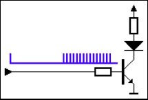
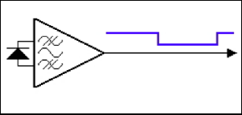

# IRTX

:::info 文档说明

- **原始页数：** 14 页
- **原始文件：** [查看或下载 PDF](/pdfs/T153MX/21-irtx.pdf)

正文按原始 PDF 的文本层、书签层级和页面顺序转换，仅移除重复页眉、页脚与水印，不改写技术内容。

:::

<!-- PDF page 4 -->

## 1 前言

### 1.1 文档简介

介绍HAL_V2 中IRTX 驱动的接口及使用方法，为IRTX 使用者提供参考。

### 1.2 目标读者

IRRX 驱动的开发/维护人员。

### 1.3 适用范围

表1-1: 适用产品列表

| 产品名称 | 内核版本 | 驱动文件 |
| --- | --- | --- |
| T536 | FreeRTOS | hal_irtx.c |
| T153 | FreeRTOS | hal_irtx.c |

### 1.4 文档约定

#### 1.4.1 标志说明

! 注意

- 提醒操作中应注意的事项。不当的操作可能会损坏器件，影响可靠性、降低性能等。

说明

为准确理解文中指令、正确实施操作而提供的补充或强调信息。

<!-- PDF page 5 -->

技巧

一些容易忽视的小功能、技巧。了解这些功能或技巧能帮助解决特定问题或者节省操作时间。

### 1.5 相关术语介绍

| 术语 | 解释说明 |
| --- | --- |
| Sunxi | 指Allwinner 的一系列SOC 硬件平台 |
| IR | 红外模块 |
| TX | 红外发送 |
| 占空比 | 决定了一个周期内IRTX 信号高低的比例，即一个周期内的平均电压 |
| 极性 | 决定了高电平有效或者低电平有效 |
| 开关 | 控制IRTX 信号是否输出 |

<!-- PDF page 6 -->

## 2 模块介绍

### 2.1 模块功能介绍

红外是一种电磁波，可以实现数据的无线传输，由发送和接收两个部分组成。发送端对红外信号进行脉冲编码，接收端完成对红外信号的脉冲解码。红外遥控协议有多种，如NEC、SIRC、RC-5等，这些协议都比较简单，基本都是以脉冲宽度或脉冲间隔来编码。当遥控器按下按键时，遥控器逻辑单元会产生一个完整的脉冲波形，包含遥控指令的信息，即红外传输的基带信号。这个波形被送到遥控器的调制单元，经调制单元调制成高频红外电磁波信号，由发光二极管发射出去，如下图所示。



*图2-1: 红外发射电路*

红外电磁波信号一般使用一体化接收头接收，同时完成信号的解调和放大，其输出信号就是红外的基带脉冲信号。解调后的信号可直接送入信号处理单元，由处理单元对脉冲波形进行解码，典型红外接收电路如下图所示。



*图2-2: 红外接收电路*

### 2.2 模块配置介绍

menuconfig 配置项

<!-- PDF page 7 -->

Drivers V2 Config ---&gt;IRTX Driver ---&gt;

```text
[*] enable irtx driver
[ ] enable irtx hal APIs test command
```

### 2.3 模块源码结构

1. 驱动源码

```text
hal_v2/hal/source/irtx/
├──hal_irtx.c
├──Kconfig
─Makefile
├──platform
│   ├──irtx_sun55iw6.h
│   └──irtx_sun8iw22.h
└──platform_irtx.h
```

2. 驱动APIs 声明头文件

```text
hal_v2/include/hal/
└──hal_irtx.h
```

3. 驱动APIs 测试代码

```text
hal_v2/hal/examples/irtx/
├──irtx_test
│   ├──irtx_test.c
│   └──Makefile
└──Makefile
```

<!-- PDF page 8 -->

## 3 模块接口说明

### 3.1 对外提供的API接口

#### 3.1.1 IRTX初始化接口

- 原型：cir_tx_status_thal_irtx_init(irtx_init_t*cir_tx);

- 功能：IRTX 模块初始化，主要完成clk 初始化

- 参数：

-cir_tx: irtx_init_t 结构体指针

- 返回值：

-0：代表成功--1：代表失败

#### 3.1.2 IRTX设置载波占空比接口

- 原型：void hal_irtx_set_duty_cycle(int duty_cycle);

- 功能：配置IRTX 模块占空比

- 参数：占空比大小

- 返回值：无

#### 3.1.3 IRTX设置载波频率接口

- 原型：hal_irtx_set_carrier(int carrier_freq);

能：设置载波频率

- 参数：载波频率大小

- 返回值：无

#### 3.1.4 IRTX使能发送接口

- 原型：void hal_irtx_xmit(unsigned int *txbuf, unsigned int count);

- 功能：发送IRTX 数据

<!-- PDF page 9 -->

- 参数：

-txbuf：代表数据buf-count：代表数据长度

- 返回值：无

<!-- PDF page 10 -->

## 4 模块使用范例

可参考驱动APIs 测试代码（hal_v2/hal/examples/irtx/）：

```c
#include <hal_irtx.h>
#include <hal_interrupt.h>
#define NS_TO_US(nsec)
                    ((nsec) / 1000)i
```

eNEC_NBITS32

```text
#define NEC_UNIT
                 562500 /* ns. Logic data bit pulse length */
#define NEC_HEADER_PULSE
                    (16 * NEC_UNIT) /* 9ms. 16 * Logic data bit pulse length*/
#define NEC_HEADER_SPACE
                    (8 * NEC_UNIT) /* 4.5ms */
#define NEC_BIT_PULSE
                    (1 * NEC_UNIT)
#define NEC_BIT_0_SPACE
                    (1 * NEC_UNIT)
#define NEC_BIT_1_SPACE
                    (3 * NEC_UNIT)
#define NEC_TRAILER_PULSE (1 * NEC_UNIT)
#define NEC_TRAILER_SPACE (10 * NEC_UNIT) /* even longer */
#define GPIO_IR_RAW_BUF_SIZE
                    128
#define DEFAULT_DUTY_CYCLE 33
#define DEFAULT_CARRIER_FREQ
                    38000
#define LIRC_MODE2_PULSE
                    0x01000000
#define LIRC_MODE2_SPACE
                    0x00000000
#define LIRC_VALUE_MASK
                    0x00FFFFFF
#define LIRC_MODE2_MASK
                    0xFF000000
#define LIRC_PULSE(val) (((val)&LIRC_VALUE_MASK) | LIRC_MODE2_PULSE)
#define LIRC_SPACE(val) (((val)&LIRC_VALUE_MASK) | LIRC_MODE2_SPACE)
```

uint32_t tx_raw_buf[GPIO_IR_RAW_BUF_SIZE];

```c
static int nec_modulation_byte(uint32_t *buf, uint8_t code)
{
 int i = 0;
 uint8_t mask = 0x01;
 while (mask) {
   if (code & mask) {
    /* bit 1 */
    *(buf + i) = LIRC_PULSE(NS_TO_US(NEC_BIT_PULSE));
    *(buf + i + 1) = LIRC_SPACE(NS_TO_US(NEC_BIT_1_SPACE));
   } else {
    /* bit 0 */
    *(buf + i) = LIRC_PULSE(NS_TO_US(NEC_BIT_PULSE));
    *(buf + i + 1) = LIRC_SPACE(NS_TO_US(NEC_BIT_0_SPACE));
   }
   mask <<= 1;
   i += 2;
 }
 return i;
```

<!-- PDF page 11 -->

```c
}
static int nec_ir_encode(uint32_t *raw_buf, uint32_t key_code)
{
 uint8_t address, reverse_address, command, reverse_command;
 uint32_t *head_p, *data_p, *stop_p;
 address = (key_code >> 24) & 0xff;
 reverse_address = (key_code >> 16) & 0xff;
 command = (key_code >> 8) & 0xff;
 reverse_command = (key_code >> 0) & 0xff;
 /* head bit */
 head_p = raw_buf;
 *(head_p) = LIRC_PULSE(NS_TO_US(NEC_HEADER_PULSE));
 *(head_p + 1) = LIRC_PULSE(NS_TO_US(NEC_HEADER_SPACE));
```

tabit*/

```c
data_p = raw_buf + 2;
 nec_modulation_byte(data_p, address);
 data_p += 16;
 nec_modulation_byte(data_p, reverse_address);
 data_p += 16;
 nec_modulation_byte(data_p, command);
 data_p += 16;
 nec_modulation_byte(data_p, reverse_command);
 /* stop bit */
 stop_p = data_p + 16;
 *(stop_p) = LIRC_PULSE(NS_TO_US(NEC_TRAILER_PULSE));
op_p+1)=LIRC_PULSE(NS_TO_US(NEC_TRAILER_SPACE));
 return ((NEC_NBITS + 2) * 2 - 1);
}
int cir_tx_get_intsta(void)
{
 unsigned long reg_addr = SUNXI_IRTX_PBASE;
 return readl(reg_addr + IR_TX_STAR);
}
int cir_tx_clr_intsta(unsigned int bitmap)
{
 unsigned int reg_val;
 unsigned long reg_addr = SUNXI_IRTX_PBASE;
 reg_val = readl(reg_addr + IR_TX_STAR);
 reg_val &= ~0xff;
 reg_val |= bitmap & 0xff;
 writel(reg_val, reg_addr + IR_TX_STAR);
 return 0;
}
static hal_irqreturn_t cir_tx_irq_handler(void *data)
{
```

unsigned int intsta;

<!-- PDF page 12 -->

```text
intsta = cir_tx_get_intsta();
```

cir_tx_clr_intsta(intsta);

```c
return 0;
}
int test_cir_tx(void)
{
 int key_code = 0x04fb13ec;
 int i, size;
 int count = 67;
```

irtx_init_t irtx_initstruct;

```text
irtx_initstruct.duty_cycle = DEFAULT_DUTY_CYCLE;
initstruct.carrier_freq=DEFAULT_CARRIER_FREQ;
irtx_init(&irtx_initstruct);
```

hal_irq_init_t irq_initstruct;

```text
irq_initstruct.irqn = SUNXI_IRQ_IRTX;
irq_initstruct.preemptionpriority = 0;
irq_initstruct.subpriority = 0;
irq_initstruct.cmd = true;
irq_initstruct.isr_info.func = cir_tx_irq_handler;
irq_initstruct.isr_info.parg = NULL;
hal_v2_intc_irq_config(&irq_initstruct);
size = nec_ir_encode(tx_raw_buf, key_code);
for (i = 0; i < size; i++) {
 printf("%d ", *(tx_raw_buf + i) & 0x00FFFFFF);
(i+1)%8==0){
   printf("\r\n");
 }
}
printf("\r\n");
```

for (i = 0; i &lt; size; i++)tx_raw_buf[i] = (tx_raw_buf[i] & 0x00FFFFFF);

```text
hal_irtx_xmit(tx_raw_buf, count);
printf("end test!\n");
```

hal_irtx_deinit();

```text
return 0;
}
```

<!-- PDF page 13 -->

## 5 FAQ

无

<!-- PDF page 14 -->

权声明

本文档及内容受著作权法保护，其著作权由珠海全志科技股份有限公司（“全志”）拥有并保留一切权利。

本文档是全志的原创作品和版权财产，未经全志书面许可，任何单位和个人不得擅自摘抄、复制、修改、发表或传播本文档内容的部分或全部，且不得以任何形式传播。

商标声明

、

、

、

（不完全列

举）均为珠海全志科技股份有限公司的商标或者注册商标。在本文档描述的产品中出现的其它商标，产品名称，和服务名称，均由其各自所有人拥有。

免责声明

您购买的产品、服务或特性应受您与珠海全志科技股份有限公司（“全志”）之间签署的商业合同和条款的约束。本文档中描述的全部或部分产品、服务或特性可能不在您所购买或使用的范围内。使用前请认真阅读合同条款和相关说明，并严格遵循本文档的使用说明。您将自行承担任何不当使用行为（包括但不限于如超压，超频，超温使用）造成的不利后果，全志概不负责。

本文档作为使用指导仅供参考。由于产品版本升级或其他原因，本文档内容有可能修改，如有变

恕不另行通知。全志尽全力在本文档中提供准确的信息，但并不确保内容完全没有错误，因

使用本文档而发生损害（包括但不限于间接的、偶然的、特殊的损失）或发生侵犯第三方权利事件，全志概不负责。本文档中的所有陈述、信息和建议并不构成任何明示或暗示的保证或承诺。

本文档未以明示或暗示或其他方式授予全志的任何专利或知识产权。在您实施方案或使用产品的过程中，可能需要获得第三方的权利许可。请您自行向第三方权利人获取相关的许可。全志不承担也不代为支付任何关于获取第三方许可的许可费或版税（专利税）。全志不对您所使用的第三方许可技术做出任何保证、赔偿或承担其他义务。
