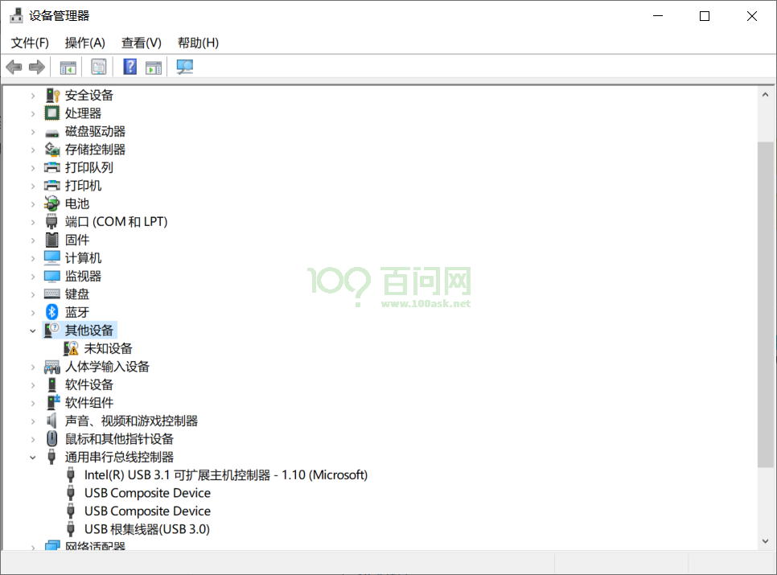
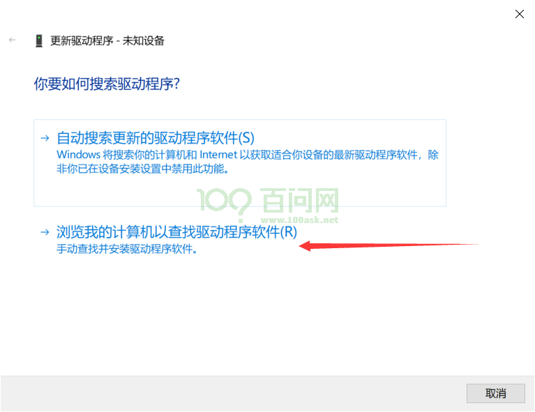
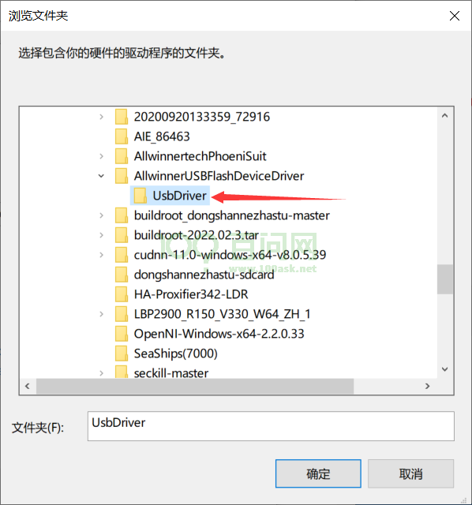
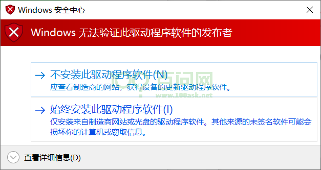
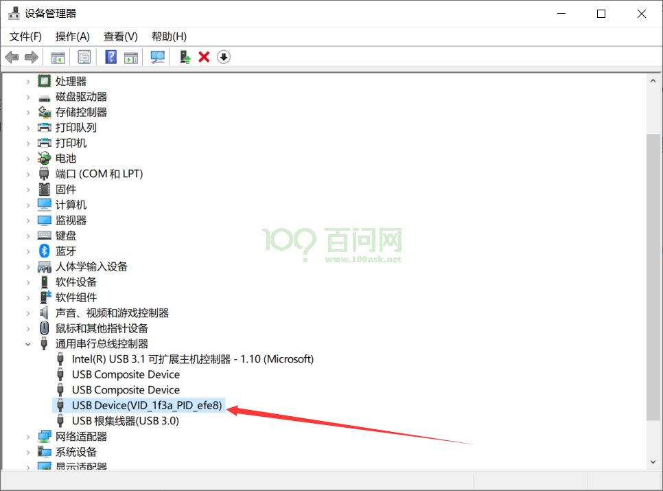
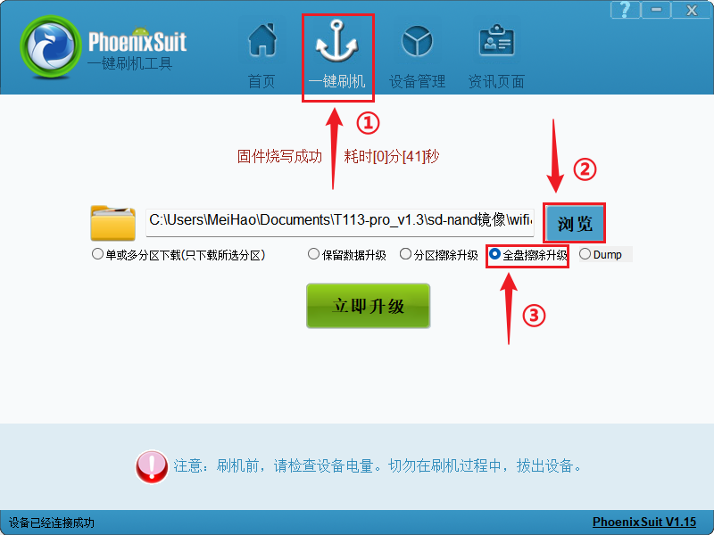
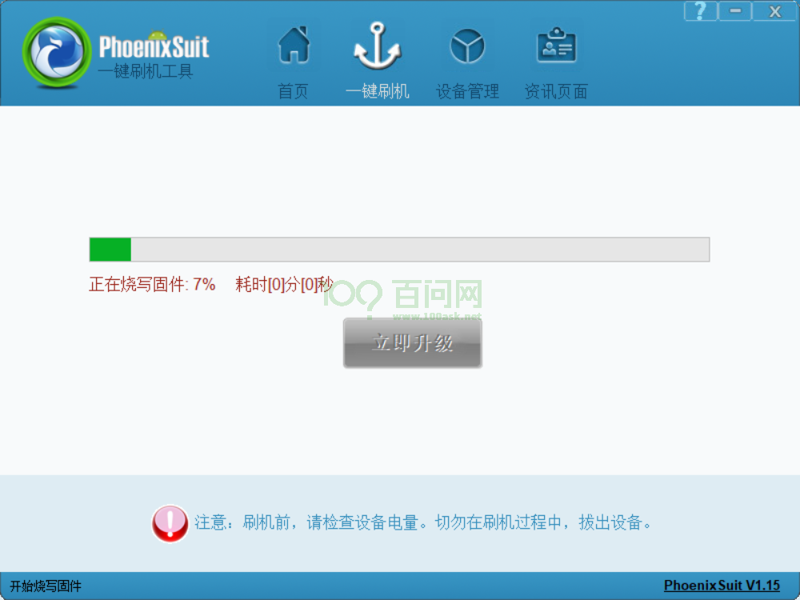

# 更新系统固件

本章讲解如何把 T153MX `.img` 固件完整烧写到 OmniGate-T153 的 eMMC。以下以 Ubuntu 和
OpenixCLI 为主，同时给出 Windows PhoenixSuit 流程。

| 项目 | 说明 |
| --- | --- |
| 预计时间 | 准备完成后约 10～20 分钟 |
| 操作位置 | Ubuntu/Windows 主机；串口只用于观察启动 |
| 完成标志 | 工具报告成功，重启后串口进入新系统 |

:::danger 烧录会覆盖板载系统

完整烧录会覆盖板载系统和用户数据。烧录前备份重要文件，并确认选择的是 OmniGate-T153 固件。

:::

## 准备工作

**硬件：**

- OmniGate-T153 开发板
- 稳定电源
- USB 数据线
- 调试串口

**固件：** 默认固件和自行编译固件二选一。

### 选择 1：下载默认固件

如果只需要体验或恢复板卡，从
[OmniGate-T153 默认固件目录](https://dl.100ask.net/Hardware/MPU/OmniGate-T153/images/)下载
`t153_linux_omnigate_DefaultSystem.7z`。

在 **Ubuntu 主机**执行：

```bash
sudo apt install -y p7zip-full
mkdir -p "$HOME/OmniGate-T153/firmware"
cd "$HOME/OmniGate-T153/firmware"
wget -c https://dl.100ask.net/Hardware/MPU/OmniGate-T153/images/t153_linux_omnigate_DefaultSystem.7z
7z x t153_linux_omnigate_DefaultSystem.7z -oDefaultSystem
find "$PWD/DefaultSystem" -type f -name '*.img' -print
```

记住 `find` 实际显示的 `.img` 路径，烧录时要使用解压后的 `.img`，不能直接选择
`.7z` 压缩包。

### 选择 2：使用自己编译的固件

自己编译的固件位于：

```text
out/t153_linux_omnigate_uart0.img
```

这是 `pack` 日志中 `image is at` 指向的交付路径。构建目录
`out/t153/omnigate/buildroot/` 中也会保留同名副本以及 `boot.img`、`dtbo.img`；新手直接使用
SDK 根目录下 `out/` 中的完整镜像，不能把 `boot.img` 或 `dtbo.img` 当成整机固件。

## 烧录前检查固件

先把 `FIRMWARE` 设置为实际的 `.img` 路径。下载的默认固件使用第一种写法；自己编译的
固件在 SDK 根目录使用第二种写法：

```bash
FIRMWARE="$HOME/OmniGate-T153/firmware/DefaultSystem/<实际固件名>.img"
# 或：FIRMWARE="$PWD/out/t153_linux_omnigate_uart0.img"

test -s "$FIRMWARE" && ls -lh "$FIRMWARE"
sha256sum "$FIRMWARE"
```

`<实际固件名>` 必须替换为解压后看到的文件名。`test` 没有输出且后面的 `ls` 显示镜像，
表示文件存在且非空。记录镜像名称和 SHA-256；复制到其他烧录电脑后再次计算，结果应完全一致。

## 准备 OpenixCLI

OpenixCLI 是独立工具，不在当前 SDK 内。安装方法见[源码、工具与手册](../02-SourceCodeToolDocumentationManual.md)。
下面假设程序位于相邻目录：

```bash
OPENIXCLI="$PWD/../OpenixCLI/target/release/openixcli"
test -x "$OPENIXCLI" && "$OPENIXCLI" --help
```

如果使用预编译程序，把 `OPENIXCLI` 改成它的实际绝对路径。

## 连接开发板并进入 FEL

1. 接好 UART0 调试串口，并打开 115200 8N1 串口终端。
2. 使用 USB 数据线连接开发板烧录/OTG 接口和主机。
3. 保持开发板使用稳定电源。

常见操作是：开发板断电，按住标有 FEL/UPDATE/烧录的按键，通过 OTG/Device 口连接主机，再上电
或复位；主机检测到设备后松开按键。不同硬件批次的按键名称和时序可能不同，必须以当前板卡
丝印及随板说明为准。

在 **Ubuntu 主机**开一个终端观察 USB 热插拔：

```bash
sudo dmesg -w
```

保持窗口运行，再让开发板进入 FEL。如果日志中完全没有新 USB 设备，先更换数据线、主机 USB
接口并检查按键时序。

## Ubuntu 使用 OpenixCLI 烧录

在 **Ubuntu 主机、SDK 根目录**执行：

```bash
sudo "$OPENIXCLI" scan
```

如果开发板已经进入 FEL/FES，命令会扫描到全志设备。

应能看到一个 Allwinner FEL/FES 设备。如果连接了多块板，记录工具显示的 bus 和 port，烧录时
通过 `--bus`、`--port` 指定，避免写错设备。

可先解析镜像，确认它是可识别的全志完整包：

```bash
"$OPENIXCLI" inspect "$FIRMWARE"
```

首次或需要恢复到一致状态时，执行完整擦除和校验：

```bash
sudo "$OPENIXCLI" flash "$FIRMWARE" \
  --mode full_erase --verify true --post-action reboot
```

烧录过程中不要拔 USB、断电、复位或关闭终端。只有工具明确报告全部分区写入成功，才能认为
烧录完成。`keep_data` 和分区烧录适合已经理解分区布局的开发者，新手不要用它们代替完整烧录。

## Windows 使用 PhoenixSuit 烧录

### 1. 下载 Windows 工具

| 文件 | 下载 | 作用 |
| --- | --- | --- |
| `AllwinnertechPhoeniSuit.zip` | [下载 PhoenixSuit](https://dl.100ask.net/Hardware/MPU/T113i-Industrial/Tools/AllwinnertechPhoeniSuit.zip) | 选择并烧录全志 `.img` 镜像 |
| `AllwinnerUSBFlashDeviceDriver.zip` | [下载 USB 烧录驱动](https://dl.100ask.net/Hardware/MPU/T113i-Industrial/Tools/AllwinnerUSBFlashDeviceDriver.zip) | 让 Windows 识别 FEL/FES 设备 |
| `t153_linux_omnigate_DefaultSystem.7z` | [下载默认固件](https://dl.100ask.net/Hardware/MPU/OmniGate-T153/images/) | 解压后获得可烧录的 `.img` |

把三份文件分别解压到简短的英文路径，例如 `C:\OmniGate-T153\`。不要在 ZIP/7z 预览窗口中
直接运行工具，也不要选择尚未解压的 `.7z` 作为固件。

### 2. 安装 FEL USB 驱动

如果设备管理器已显示 `USB Device(VID_1f3a_PID_efe8)`，可以跳过手动安装。否则按下面步骤操作。

1. 解压 `AllwinnerUSBFlashDeviceDriver.zip`。
2. 按照前文的方法，通过板卡 OTG/Device 口进入 FEL/FES 模式。
3. 在 Windows 中右击**开始**，打开**设备管理器**。驱动未安装时，通常会看到带黄色提示的**未知设备**。



4. 右击**未知设备**，选择**更新驱动程序**，然后点击**浏览我的计算机以查找驱动程序**。



5. 点击**浏览**，选中驱动压缩包解压后的 `UsbDriver` 目录，勾选**包括子文件夹**，然后点击**下一页**。



6. Windows 如果询问是否安装驱动，确认压缩包来自上表链接后，选择**始终安装此驱动程序软件**。



7. 重新让板卡进入 FEL/FES。设备管理器显示 `USB Device(VID_1f3a_PID_efe8)` 时，表示驱动已就绪。



:::tip 看不到 FEL 设备

在设备管理器中保持界面打开，重新执行一次**断电 → 按住 FEL/UPDATE 键 → 连接 OTG 或上电 → 复位**。
如果设备列表完全没变化，先更换确定能传输数据的 USB 线和电脑 USB 接口。

:::

### 3. 在 PhoenixSuit 中选择固件

1. 进入解压后的 `AllwinnertechPhoeniSuit` 目录，右击 `PhoenixSuit.exe`，选择**以管理员身份运行**。
2. 切换到**一键刷机**页面。
3. 点击**浏览**，选择默认固件解压出的 `.img`，或自行编译的 `t153_linux_omnigate_uart0.img`。
4. 首次烧录或恢复到默认状态时，选择**全盘擦除升级**。



:::note 界面图仅用于说明按钮位置

截图中的文件路径是其他操作记录的示例。实际操作必须选择 **OmniGate-T153** 的 `.img`，
不要照抄截图中的文件名。

:::

### 4. 触发烧录并等待完成

1. 保持 PhoenixSuit 已选中固件，通过 OmniGate-T153 的 OTG/Device 口让板卡进入 FEL/FES。
2. PhoenixSuit 识别到设备后会开始升级或弹出确认框。如果询问是否强制格式化，完整恢复时选择**是**。
3. 开始后会显示进度条；不要拔 USB、断电、复位或关闭 PhoenixSuit。



4. 等待进度达到 100%，并出现烧录成功提示。工具可能会让板卡自动重启，此时再通过串口观察启动日志。

| 现象 | 先检查 |
| --- | --- |
| PhoenixSuit 一直显示无设备 | 设备管理器是否出现 `VID_1f3a_PID_efe8`，是否连接 OTG/Device 口 |
| 选择固件时报错 | 是否选中解压后的完整 `.img`，而不是 `.7z`、`boot.img` 或 `dtbo.img` |
| 进度一直为 0% | 重新进入 FEL/FES，更换 USB 数据线和主机 USB 口，暂时不使用 USB Hub |
| 中途失败 | 检查板卡供电，重新下载或校验固件，然后执行全盘擦除升级 |

## 启动系统

烧录完成后复位或重新上电。串口终端会打印 U-Boot 和 Linux 启动信息。

不要只看屏幕是否亮来判断成功。进入 **开发板 Linux Shell**后执行：

```bash
uname -a
cat /proc/partitions
df -h
cat /proc/cmdline
ip -br link
```

能够正常进入 Shell，并看到 Linux 5.10 和 eMMC 分区，说明固件烧录成功。接下来可以进入[板载功能体验](../part2/01-Ethernet.md)。

## 烧录成功的判断标准

- 烧录工具完整执行并明确提示成功。
- 重新上电后能从 UART0 看到 Boot0、U-Boot 和 Linux 日志。
- 能进入 Linux Shell，并看到 Linux 5.10 和 eMMC 分区。
- 实际启动的镜像与本次选择的方案和构建时间一致。

建议把本次烧录记录保存为文本：

```text
板卡序列号/批次：
镜像文件名：
SHA-256：
构建时间：
烧录工具与版本：
烧录模式：full_erase
结果：
```

扫描不到设备、烧录后不能启动等问题统一见[启动与烧录常见问题](./03-CommonIssues.md)。
