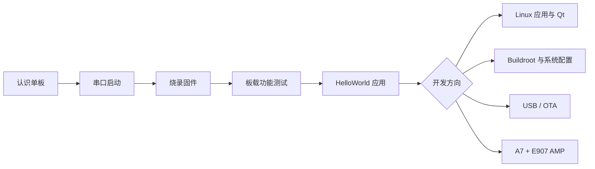

# OmniGate-T153 Linux 学习路线

不需要从头读完所有参考手册。先完成能运行、能联网、能编译应用的最小闭环，再按项目需要进入系统定制或 AMP 专题。

## 第一步：启动并确认系统

- [启动开发板](./01-QuickStart.md)
- [更新系统固件](./02-FlashSystem.md)
- [启动与烧录常见问题](./03-CommonIssues.md)

完成标志：能够从 UART0 进入 Linux Shell，并确认 Linux 5.10、Arm 架构和 eMMC 分区。

## 第二步：完成板载功能测试

依次测试双网口、Wi-Fi/Bluetooth、CAN FD、RS485、USB、TF 卡和按键。每项测试都应保留命令、实际输出和接线记录。

完成标志：项目会使用的接口至少完成一次发送、接收或读写闭环。

## 第三步：开发 Linux 应用

- [HelloWorld 快速入门](../part4/01-HelloWorld.md)
- [Qt 应用环境部署](../part4/02-QtApplication.md)

完成标志：能在 Ubuntu 主机交叉编译 Arm 程序，上传到开发板并正确运行。

## 第四步：定制系统或学习异构开发

需要裁剪根文件系统、添加软件包时进入 Tina-SDK 开发；需要升级维护时学习 OTA；需要实时控制或多核协作时再进入 OmniGate AMP Shell。

长篇的系统软件、Buildroot、系统配置、USB、OTA 和异构通信文档是按需查询的进阶参考，不要求新手顺序通读。
