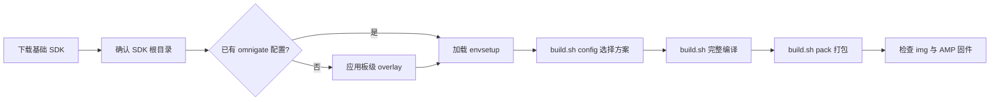
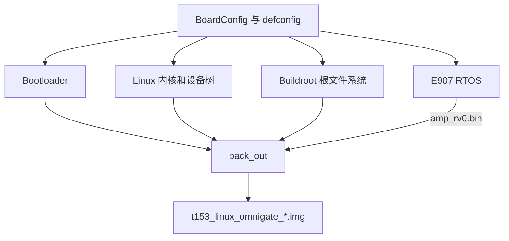

# SDK 环境搭建与固件编译

本文从一台新 Ubuntu 主机开始，完成 T153MX OmniGate 基础 SDK 检查、板级配置应用、
`t153_omnigate_mmc-buildroot` 方案选择、完整编译和固件打包。完成后会得到可供全志烧录工具
使用的 `.img` 固件。

## 目标

在 Ubuntu 主机上确认 SDK 和 OmniGate 板级配置，准确选择 `t153_omnigate_mmc-buildroot`，完成全量编译与打包，并获得可追溯的镜像和 E907 固件产物。

## 操作步骤与验证方法

1. 安装主机依赖并检查磁盘空间。
2. 确认当前目录是 SDK 根目录，检查或应用 OmniGate overlay。
3. 使用 `./build.sh config` 选择准确方案。
4. 执行完整构建和 `pack`。
5. 核对镜像路径、大小、时间戳、文件类型和 SHA-256；同时检查 `amp_rv0.bin`。

只有本次构建命令退出成功、镜像非空且时间戳属于本次 `pack`，才算完成。烧录前还应保存构建配置和镜像 SHA-256。

:::info 本教程使用的已确认版本

| 项目 | 版本或配置 |
| --- | --- |
| 编译主机 | Ubuntu 24.04.4 LTS x86_64 |
| Tina SDK | Tina Linux 5.0 |
| Linux | 5.10，当前 SDK 源码版本为 5.10.198 |
| Buildroot | 2022.05，SDK 目录名为 `buildroot-202205` |
| Linux 架构 | 32 位 Arm hard-float |
| 方案名 | `t153_omnigate_mmc-buildroot` |
| 交叉编译器 | Linaro GCC 11.3.1，`arm-linux-gnueabihf-` |

:::

## 1 构建流程



`./build.sh` 生成内核、Buildroot 根文件系统、U-Boot 和 RTOS 等组件；`./build.sh pack` 再依据
分区表将这些组件组合为全志格式固件。只完成编译而没有执行打包，不能得到最终烧录镜像。

## 2 准备主机

本文已经在 Ubuntu 24.04.4 LTS x86_64 上完成配置、编译和打包。至少预留 100 GB 可用空间；首次完整构建会产生大量
中间文件，SDK 与 `out/` 不应放在 FAT/NTFS 共享盘或路径含空格、中文、`@` 的目录中。

安装常用构建依赖：

```bash
sudo apt update
sudo apt install -y build-essential gcc-multilib g++-multilib \
  git gawk flex bison gettext texinfo libncurses5-dev libncursesw5-dev \
  libssl-dev python3 python-is-python3 rsync unzip zlib1g-dev file bc \
  cpio wget curl patch device-tree-compiler
```

检查主机与空间：

```bash
uname -m
lsb_release -ds
df -h .
```

`uname -m` 应输出 `x86_64`。如果使用容器或虚拟机，应同时保证内存和磁盘配额充足，并避免
构建期间挂起共享目录。

## 3 获取并检查 SDK

基础开发包位于百度网盘文件夹 `DshanPI-OminiGate_T153MX`：

- 链接：[https://pan.baidu.com/s/1ai6yzYs5ujDba-luz-JeXw](https://pan.baidu.com/s/1ai6yzYs5ujDba-luz-JeXw)
- 提取码：`6mtk`

下载后按压缩包格式解压。以下只是示例，实际文件名以下载内容为准：

```bash
mkdir -p T153MX-work
tar -xf 下载得到的SDK压缩包 -C T153MX-work
cd T153MX-work/解压后的SDK目录
```

:::caution 不要凭网盘文件夹名判断 SDK 根目录

后续所有 SDK 命令都必须在根目录执行。根目录至少应同时包含
`build/.tinatopdir`、`build/envsetup.sh`、`build.sh`、`device/`、`kernel/` 和 `buildroot/`。

:::

在候选目录执行：

```bash
test -f build/.tinatopdir && test -f build/envsetup.sh && \
test -x build.sh && test -d device && test -d kernel && test -d buildroot && \
echo "SDK root OK"
```

只有看到 `SDK root OK` 才继续。首次修改前应保留原压缩包或制作一份未改动副本。

### SDK 目录关系

```text
T153_Tina_SDK/                     ← 后续命令的执行目录
├── build/                         构建框架、envsetup 和打包脚本
├── build.sh -> build/top_build.sh 顶层编译入口
├── brandy/                        boot0、U-Boot 等启动组件
├── buildroot/                     Buildroot 2022.05 源码和全志 package
├── device/config/chips/t153/      T153 芯片及各板级配置
│   └── configs/omnigate/          本教程使用的 OmniGate 配置
├── kernel/linux-5.10-origin/      Linux 5.10.198 源码
├── out/                           编译后生成；可重新生成，不应当作源码修改
├── platform/                      全志平台组件
└── rtos/                          E907 RTOS 源码
```

后续看到 **SDK 根目录**，均指上图第一层，而不是 `buildroot/buildroot-202205/`、`kernel/` 或
`out/`。

## 4 检查或应用 OmniGate 板级配置

先判断基础包中是否已经包含板级配置：

```bash
test -f device/config/chips/t153/configs/omnigate/buildroot/BoardConfig.mk && \
echo "OmniGate config exists"
```

若已经输出 `OmniGate config exists`，不要重复覆盖。若文件不存在，再取得板级仓库并应用
overlay：

```bash
git clone https://github.com/dshanpi/T153MX-Tina5SDK_OmniGate.git ../T153MX-Tina5SDK_OmniGate
../T153MX-Tina5SDK_OmniGate/scripts/apply_overlay.sh "$PWD"
```

应用后再次运行上一条 `test` 命令。overlay 脚本不会自动执行删除清单；若确实需要删除旧文件，
必须先人工审阅板级仓库中的 `meta/delete_list.txt`。

:::tip 客户网络不能访问 GitHub 时

请提前把完整 OmniGate overlay 仓库和 SDK 一起交付。当前 overlay 已在
`buildroot/buildroot-202205/dl/` 预置 4G 所需的 ModemManager、libqmi、libmbim、uqmi、pppd 和
usb-modeswitch 等源码归档，并带有离线校验脚本。应用 overlay 时会验证这些文件，正常情况下无需
在客户现场再访问 GitHub 下载它们。

:::

## 5 加载环境并选择方案

当前 SDK 使用 `build.sh config`，不提供旧版 Tina 常见的 `lunch` 函数。准确方案名
`t153_omnigate_mmc-buildroot` 在本 SDK 中对应下面这组选项：

```bash
source build/envsetup.sh
./build.sh config
```

按名称依次选择，不要照抄序号，因为增加其他板卡配置后序号可能变化：

| 提示项 | 选择值 |
| --- | --- |
| `platform` | `linux` |
| `linux_dev` | `buildroot` |
| `ic` | `t153` |
| `board` | `omnigate` |
| `flash` | `default`（OmniGate 的 BoardConfig 指向 MMC defconfig） |
| `kern_name` | `linux-5.10-origin` |

### 一次真实的配置操作记录

下面记录来自 Ubuntu 24.04 主机。冒号后的数字是当时菜单中的序号；你的 SDK 若增加了其他板型，
序号可能改变，所以实际操作仍应核对左侧名称。

```console
ubuntu@ubuntu2404:~/T153_Tina5SDK-V1$ source build/envsetup.sh
ubuntu@ubuntu2404:~/T153_Tina5SDK-V1$ ./build.sh config
All available platform:
   0. android
   1. linux
Choice [linux]: 1
All available linux_dev:
   0. bsp
   1. buildroot
Choice [buildroot]: 1
All available ic:
   0. t153
Choice [t153]: 0
All available board:
  ...
  12. omnigate
Choice [omnigate]: 12
All available flash:
   0. default
   1. nor
Choice [default]: 0
All available kern_name:
   0. linux-5.10-origin
   1. linux-5.10-rt
   2. linux-5.10-xenomai
Choice [linux-5.10-origin]: 0
```

随后出现 `Setup BSP files`、`Prepare toolchain`、`configuration written to .config` 和
`buildroot defconfig is sun8iw22p1_t153_mmc_defconfig`，说明配置阶段已经把 OmniGate 的 BSP、
内核 defconfig、工具链和 Buildroot defconfig 准备好。中间出现编译器 `warning` 不等于失败；
应以命令退出码和最后是否完成配置为准。

配置会写入 SDK 根目录的 `.buildconfig`。不要选择名字相近的 `demo`、NAND 或 NOR 方案。加载
生成配置并验证：

```bash
source .buildconfig
printf 'board=%s\nlinux_dev=%s\nkernel=%s\nbuildroot=%s\nout=%s\n' \
  "$LICHEE_BOARD" "$LICHEE_LINUX_DEV" "$LICHEE_KERN_VER" \
  "$LICHEE_BR_VER" "$LICHEE_PLAT_OUT"
```

关键结果应为：

```text
board=omnigate
linux_dev=buildroot
kernel=linux-5.10-origin
buildroot=202205
.../out/t153/omnigate/buildroot
```

再核对 MMC、内核版本和工具链三项，防止只看板名遗漏其他选项：

```bash
grep -E 'LICHEE_(BOARD|LINUX_DEV|KERN_VER|BR_VER|BR_DEFCONF|COMPILER_TAR)=' .buildconfig
```

预期至少包含：

```text
export LICHEE_BOARD=omnigate
export LICHEE_LINUX_DEV=buildroot
export LICHEE_KERN_VER=linux-5.10-origin
export LICHEE_BR_VER=202205
export LICHEE_BR_DEFCONF=sun8iw22p1_t153_mmc_defconfig
export LICHEE_COMPILER_TAR=arm/gcc-linaro-11.3.1-2022.06-x86_64_arm-linux-gnueabihf.tar.xz
```

构建时还会把配置复制到 `out/t153/omnigate/buildroot/.buildconfig`。排查环境问题时可以查看这
两个文件，但不要手工编辑生成配置；需要切换方案时重新运行 `./build.sh config`。

## 6 完整编译与打包

首次构建执行：

```bash
mkdir -p build-logs
set -o pipefail
./build.sh 2>&1 | tee build-logs/full-build.log
./build.sh pack 2>&1 | tee build-logs/pack.log
```

构建时间取决于 CPU、内存、磁盘和下载缓存。出现失败时先保留终端中第一处 `error`，不要只截取
最后几行。修正依赖或源码后可再次执行 `./build.sh`，Buildroot 会复用已完成的中间结果。

`set -o pipefail` 很重要：使用 `tee` 保存日志时，它能让编译失败继续表现为非零退出状态。每条
命令结束后可立即检查：

```bash
echo "exit_code=$?"
```

:::warning 两条命令必须按顺序成功

`./build.sh` 负责编译组件，`./build.sh pack` 负责把组件组合成可烧录镜像。编译成功不代表已经
有完整固件；如果 `pack` 失败，也不能拿目录里的旧 `.img` 交付。

:::

### 一次成功的打包记录

成功结尾会明确出现 `Dragon execute image.cfg SUCCESS`、`image is at` 和 `pack finish`：

```console
08-14 04:35:43.967  794415 D pack : BuildImg0
08-14 04:35:43.970  794415 D pack : Dragon execute image.cfg SUCCESS !
08-14 04:35:43.991  794415 D pack : ----------image is at----------
08-14 04:35:43.994  794415 I pack : 407M /home/ubuntu/T153_Tina5SDK-V1/out/t153_linux_omnigate_uart0.img
08-14 04:35:43.999  794415 D pack : pack finish
```

这里的 `407M` 是该次构建的镜像大小，不是固定值；加入或删除软件包后发生变化很正常。真正要
记录的是 `image is at` 下一行给出的**绝对路径**。本例最终固件为：

```text
/home/ubuntu/T153_Tina5SDK-V1/out/t153_linux_omnigate_uart0.img
```

### 各阶段关系



### 修改后的常用构建命令

| 修改内容 | 构建命令 | 最后是否还要打包 |
| --- | --- | --- |
| 不确定影响范围、首次构建或交付构建 | `./build.sh` | 是 |
| Linux 内核源码或内核配置 | `./build.sh kernel` | 是 |
| 设备树 | `./build.sh dtb` | 是 |
| U-Boot | `./build.sh uboot` | 是 |
| Buildroot package、overlay 或根文件系统 | `./build.sh buildroot_rootfs` | 是 |
| E907 RTOS | `./build.sh rtos` | 是 |
| 仅重新组合已经成功生成的组件 | 不重新编译 | 是 |

分组件编译只适合已经完成过一次全量构建的工作区。修改跨越多个组件、切换方案或无法判断依赖时，
直接执行完整 `./build.sh` 更可靠。

### 配置菜单入口

```bash
./build.sh menuconfig             # Linux 内核配置
./build.sh buildroot_menuconfig   # Buildroot 软件包配置
./build.sh uboot_menuconfig       # U-Boot 配置
```

菜单中保存只更新当前输出目录。需要把配置变更长期保存到板级 defconfig 时，应先查看
[系统配置指南](./04-SystemConfiguration.md)，确认保存目标，避免把临时测试项直接覆盖到板级基线。

若只修改了设备树、内核或根文件系统，可使用环境帮助中列出的分组件命令，但交付前仍应重新
执行 `./build.sh pack`，并验证新镜像的时间戳。

## 7 核对实际产物

```bash
ls -lh out/t153_linux_omnigate_uart0.img
stat -c '%y  %s bytes  %n' out/t153_linux_omnigate_uart0.img
sha256sum out/t153_linux_omnigate_uart0.img

find out/t153/omnigate -type f -name amp_rv0.bin -printf '%p  %s bytes\n'
```

当前 SDK 已确认的主要产物如下：

| 产物 | 实际路径 | 用途 |
| --- | --- | --- |
| 完整固件（交付路径） | `out/t153_linux_omnigate_uart0.img` | `pack` 日志报告的默认 OmniGate eMMC 烧录镜像 |
| 完整固件（构建目录副本） | `out/t153/omnigate/buildroot/t153_linux_omnigate_uart0.img` | 与交付镜像内容相同的构建副本 |
| Linux 内核 | `out/t153/omnigate/buildroot/zImage` | 内核调试，不可代替完整固件烧录 |
| E907 固件打包副本 | `out/t153/omnigate/pack_out/amp_rv0.bin` | `pack` 使用的 AMP 固件 |
| E907 根文件系统副本 | `out/t153/omnigate/buildroot/buildroot/target/lib/firmware/amp_rv0.bin` | Linux remoteproc 加载路径的源文件 |

同一目录中可能同时残留多个历史 `.img`。烧录前记录本次构建时间，并运行：

```bash
stat -c '%y  %s bytes  %n' out/t153_linux_omnigate_uart0.img
sha256sum out/t153_linux_omnigate_uart0.img
```

如果某个自定义 pack 配置额外生成带后缀的无线变体，以本次 `pack` 日志和时间戳为准；默认
OmniGate 交付镜像是无后缀的 `t153_linux_omnigate_uart0.img`。

只有时间戳属于本次 `pack`、尺寸非零且文件名与本次配置一致的镜像才可交付。随后进入
[更新系统固件](../part1/02-FlashSystem.md)。

### 构建完成检查表

- `full-build.log` 和 `pack.log` 对应命令退出码均为 0。
- `.buildconfig` 中板卡、Buildroot、MMC 和内核选项全部正确。
- `zImage`、根文件系统、`amp_rv0.bin` 和目标 `.img` 均存在且大小非零。
- 目标 `.img` 的时间戳晚于本次源码修改和编译开始时间。
- SHA-256 已记录，复制到烧录机后能够再次核对。
- 没有用另一个旧镜像的**可启动**结果代替本次镜像验证。

### 关于清理输出目录

普通源码修改不需要先清空 `out/`。只有切换芯片/板型后状态混乱、生成配置明显不一致，或构建系统
明确要求时才考虑：

```bash
./build.sh clean
```

`./build.sh distclean` 会清理更多配置和产物，重新构建成本更高；执行前应备份日志、自定义配置和
尚未进入 overlay/源码目录的修改。不要直接删除整个 SDK 来处理一个可定位的编译错误。

## 8 常见问题

| 现象 | 原因与处理 |
| --- | --- |
| `Please source envsetup.sh in the root of SDK` | 当前目录不是 SDK 根目录；回到包含 `build/.tinatopdir` 的目录 |
| `./build.sh config` 中没有 OmniGate | overlay 未应用或应用到了错误目录；检查板级 `BoardConfig.mk` |
| 编译器无法执行 | 确认主机是 x86_64，并安装 32 位兼容库和 `gcc-multilib` |
| `No space left on device` | 清理其他文件或扩容；不要在失败状态下继续打包 |
| 编译成功但没有完整 `.img` | 尚未执行 `./build.sh pack`，或打包失败 |
| 镜像时间早于本次构建 | 当前看到的是历史产物；重新执行 `./build.sh pack` 并按时间戳核对 |
| 使用 `tee` 后明明失败却显示成功 | 当前 Shell 未启用 `set -o pipefail`；重新查看日志中的第一处错误 |
| 分组件编译后修改没有进入镜像 | 对应组件未重建或忘记重新 `./build.sh pack`；按阶段关系逐项检查 |
